# `Langchain-Chatchat\libs\chatchat-server\chatchat\webui_pages\knowledge_base\knowledge_base.py` 详细设计文档

该代码是一个基于Streamlit的知识库管理Web界面，提供知识库的创建、文件上传、向量库管理、文档编辑等核心功能，支持知识库的全生命周期管理。

## 整体流程

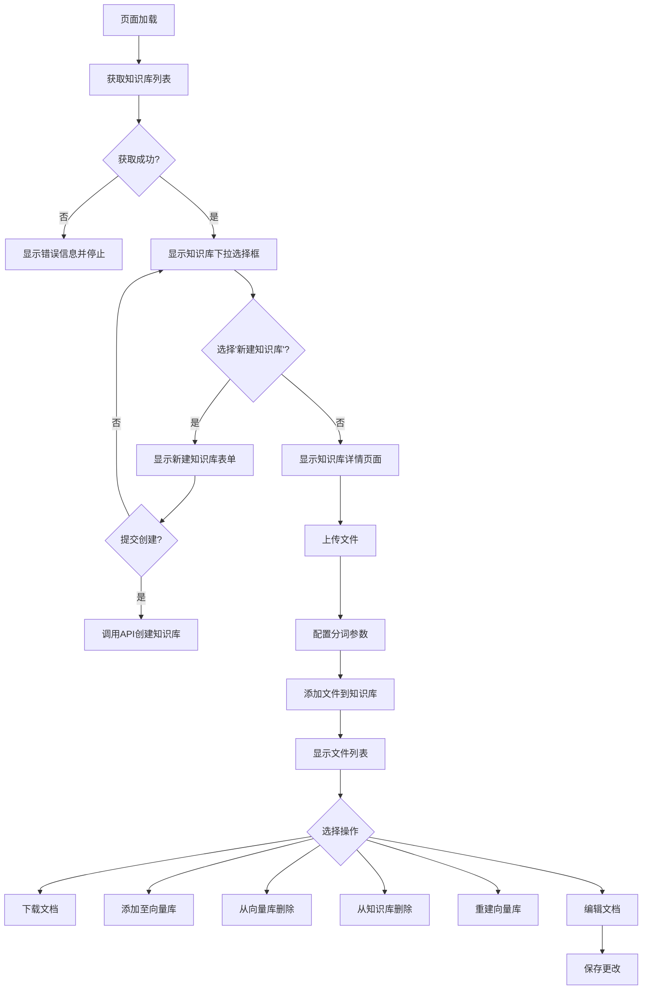

## 类结构

```
无显式类定义 (函数式编程为主)
└── 主要模块: knowledge_base_page (页面入口)
    ├── config_aggrid (表格配置)
    ├── file_exists (文件检查)
    └── 页面组件 (Streamlit Widgets)
```

## 全局变量及字段


### `cell_renderer`
    
用于AgGrid表格中渲染布尔值为✓或×的JavaScript自定义渲染器

类型：`JsCode`
    


### `knowledge_base_page.kb_list`
    
存储所有知识库信息的字典，键为知识库名称，值为知识库详情字典

类型：`Dict[str, Dict]`
    


### `knowledge_base_page.kb_names`
    
所有知识库名称的列表

类型：`List[str]`
    


### `knowledge_base_page.selected_kb_index`
    
当前选中的知识库在列表中的索引位置

类型：`int`
    


### `knowledge_base_page.selected_kb`
    
当前用户选择或新建的知识库名称

类型：`str`
    


### `knowledge_base_page.kb`
    
当前操作的知识库名称的简写别名

类型：`str`
    


### `knowledge_base_page.files`
    
用户通过文件上传器选择的所有文件列表

类型：`List[UploadedFile]`
    


### `knowledge_base_page.kb_info`
    
知识库的简介文本，用于描述知识库的用途和内容

类型：`str`
    


### `knowledge_base_page.chunk_size`
    
文本分块的最大字符长度，用于控制知识库文档的分片大小

类型：`int`
    


### `knowledge_base_page.chunk_overlap`
    
相邻文本块之间的重叠字符数，用于保持上下文连贯性

类型：`int`
    


### `knowledge_base_page.zh_title_enhance`
    
是否开启中文标题加强功能的开关

类型：`bool`
    


### `knowledge_base_page.doc_details`
    
存储知识库中所有文件详细信息的DataFrame表格

类型：`pd.DataFrame`
    


### `knowledge_base_page.selected_rows`
    
用户在AgGrid表格中选中的行数据列表

类型：`List[Dict]`
    


### `knowledge_base_page.file_name`
    
当前选中文件的名称

类型：`str`
    


### `knowledge_base_page.file_path`
    
当前选中文件在本地文件系统中的完整路径

类型：`str`
    


### `knowledge_base_page.docs`
    
从知识库中检索出的文档列表，包含内容、元数据和类型信息

类型：`List[Dict]`
    


### `knowledge_base_page.df`
    
用于在页面表格中显示和编辑的文档数据DataFrame

类型：`pd.DataFrame`
    


### `knowledge_base_page.edit_docs`
    
用户编辑后的AgGrid表格对象，包含修改后的文档数据

类型：`AgGrid`
    


### `knowledge_base_page.changed_docs`
    
用户实际修改过的文档列表，用于提交到后端更新

类型：`List[Dict]`
    


### `knowledge_base_page.origin_docs`
    
原始文档的字典映射，键为文档ID，值为原始文档内容

类型：`Dict[str, Dict]`
    
    

## 全局函数及方法


### `config_aggrid`

该函数是用于配置 Streamlit AG Grid 组件的核心函数，通过接收 pandas DataFrame 和列配置参数，动态构建适用于知识库文件管理的 AG Grid 表格选项，包括列定制、选择模式和多页分页等功能，并返回配置好的 GridOptionsBuilder 对象供 AgGrid 组件使用。

参数：

- `df`：`pd.DataFrame`，要显示在 AG Grid 中的数据框，包含知识库文件信息
- `columns`：`Dict[Tuple[str, str], Dict]`，列配置字典，键为 (列名, 表头) 元组，值为列的额外配置参数
- `selection_mode`：`Literal["single", "multiple", "disabled"]`，行选择模式，默认为 "single"，支持单选、多选或禁用选择
- `use_checkbox`：`bool`，是否显示复选框列，默认为 False

返回值：`GridOptionsBuilder`，配置完成的 AG Grid 选项构建器对象，可调用 build() 方法生成最终配置

#### 流程图

```mermaid
flowchart TD
    A[开始 config_aggrid] --> B[创建 GridOptionsBuilder<br/>GridOptionsBuilder.from_dataframe(df)]
    B --> C[配置默认列<br/>configure_column 'No' 宽度40]
    C --> D{columns 是否为空?}
    D -->|否| E[遍历 columns 字典]
    D -->|是| F[配置选择模式<br/>configure_selection]
    E --> E1[为每个列配置表头和参数<br/>configure_column with wrapHeaderText]
    E1 --> F
    F --> G[配置分页选项<br/>configure_pagination<br/>每页10条]
    G --> H[返回 GridOptionsBuilder 对象]
    
    style A fill:#e1f5fe
    style H fill:#c8e6c9
```

#### 带注释源码

```python
def config_aggrid(
    df: pd.DataFrame,  # 传入的 pandas DataFrame，包含知识库文件数据
    columns: Dict[Tuple[str, str], Dict] = {},  # 列配置映射：(列名, 表头) -> 配置参数
    selection_mode: Literal["single", "multiple", "disabled"] = "single",  # 选择模式：单选/多选/禁用
    use_checkbox: bool = False,  # 是否显示复选框用于选择
) -> GridOptionsBuilder:  # 返回 AG Grid 配置构建器
    # 步骤1: 从 DataFrame 初始化 GridOptionsBuilder
    gb = GridOptionsBuilder.from_dataframe(df)
    
    # 步骤2: 配置固定的序号列 "No"，设置宽度为 40 像素
    gb.configure_column("No", width=40)
    
    # 步骤3: 遍历用户传入的列配置字典，自定义列属性
    # columns 格式: {("file_name", "文档名称"): {}, ("file_size", "文件大小"): {...}}
    for (col, header), kw in columns.items():
        # 为每个列配置自定义表头，并开启表头文本换行
        gb.configure_column(col, header, wrapHeaderText=True, **kw)
    
    # 步骤4: 配置行选择功能
    # 从 session_state 获取预选中的行，默认选中第0行
    gb.configure_selection(
        selection_mode=selection_mode,  # 传入的选择模式参数
        use_checkbox=use_checkbox,  # 是否显示复选框
        pre_selected_rows=st.session_state.get("selected_rows", [0]),  # 预选行
    )
    
    # 步骤5: 配置分页功能
    # 启用手动分页，每页显示10条数据，不自动计算页大小
    gb.configure_pagination(
        enabled=True,  # 启用分页
        paginationAutoPageSize=False,  # 关闭自动页大小
        paginationPageSize=10  # 每页10条记录
    )
    
    # 步骤6: 返回配置完成的 GridOptionsBuilder 对象
    # 调用者可以调用 .build() 方法生成最终配置字典
    return gb
```


### `file_exists`

检查本地知识库文件夹中是否存在指定的文档文件，如果存在则返回文件名和文件路径。

参数：

- `kb`：`str`，知识库的名称，用于定位知识库目录
- `selected_rows`：`List`，从 AgGrid 表格中选中的行数据列表，每个元素是一个包含文件信息的字典

返回值：`Tuple[str, str]`，返回包含文件名和文件路径的元组；如果文件不存在或没有选中行，则返回空字符串元组 `("", "")`

#### 流程图

```mermaid
flowchart TD
    A[开始 file_exists] --> B{selected_rows 是否为空?}
    B -->|是| C[返回空元组 ("", "")]
    C --> H[结束]
    B -->|否| D[获取 selected_rows[0]["file_name"]]
    D --> E[调用 get_file_path 获取完整文件路径]
    E --> F{os.path.isfile 检查文件是否存在}
    F -->|否| C
    F -->|是| G[返回 (file_name, file_path)]
    G --> H
```

#### 带注释源码

```python
def file_exists(kb: str, selected_rows: List) -> Tuple[str, str]:
    """
    check whether a doc file exists in local knowledge base folder.
    return the file's name and path if it exists.
    """
    # 检查是否有选中的行数据
    if selected_rows:
        # 从选中的第一行获取文件名
        file_name = selected_rows[0]["file_name"]
        
        # 根据知识库名称和文件名获取完整的本地文件路径
        file_path = get_file_path(kb, file_name)
        
        # 使用 os.path.isfile 检查文件是否真实存在于本地文件系统中
        if os.path.isfile(file_path):
            # 文件存在，返回文件名和完整路径
            return file_name, file_path
    
    # 如果没有选中行或文件不存在，返回空字符串元组
    return "", ""
```


### `knowledge_base_page`

该函数是 Streamlit Web UI 的知识库管理页面核心函数，负责知识库的创建、文件上传、向量库管理、文档编辑等完整生命周期操作，通过会话状态跟踪用户选择，并调用后端 API 完成实际的知识库 CRUD 操作。

参数：

- `api`：`ApiRequest` 类型，后端 API 请求对象，用于与后端服务交互
- `is_lite`：`bool` 类型，可选参数，默认为 None，用于控制页面展示模式（是否为轻量模式）

返回值：`None`，该函数无返回值，通过 Streamlit 组件直接渲染页面

#### 流程图

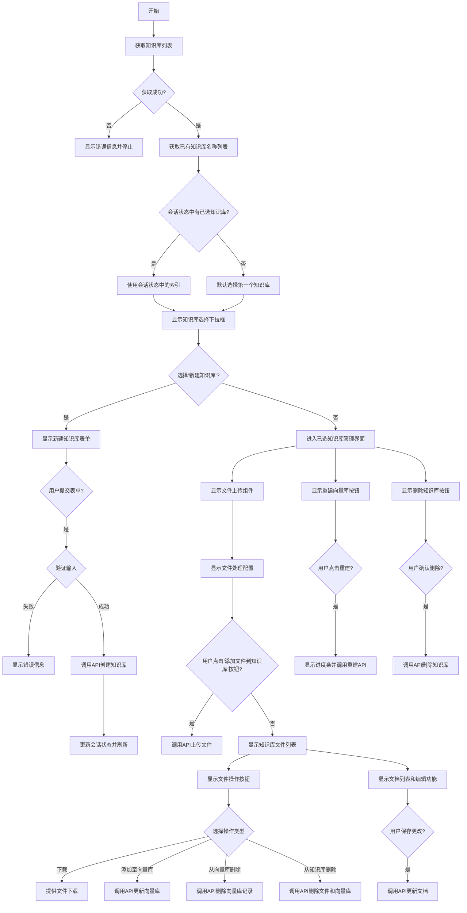

#### 带注释源码

```python
def knowledge_base_page(api: ApiRequest, is_lite: bool = None):
    """
    Streamlit 知识库管理页面主函数
    功能：创建知识库、上传文件、管理向量库、编辑文档等
    """
    try:
        # 获取所有知识库详情列表，转换为字典格式便于查找
        kb_list = {x["kb_name"]: x for x in get_kb_details()}
    except Exception as e:
        # 捕获知识库获取异常，通常是数据库连接或初始化问题
        st.error(
            "获取知识库信息错误，请检查是否已按照 `README.md` 中 `4 知识库初始化与迁移` 步骤完成初始化或迁移，或是否为数据库连接错误。"
        )
        st.stop()  # 停止页面渲染
    
    # 提取知识库名称列表
    kb_names = list(kb_list.keys())

    # 检查会话状态中是否有已选择的知识库，并确保其在列表中
    if (
        "selected_kb_name" in st.session_state
        and st.session_state["selected_kb_name"] in kb_names
    ):
        # 获取已选知识库的索引
        selected_kb_index = kb_names.index(st.session_state["selected_kb_name"])
    else:
        # 默认选择第一个知识库
        selected_kb_index = 0

    # 初始化知识库描述信息会话状态
    if "selected_kb_info" not in st.session_state:
        st.session_state["selected_kb_info"] = ""

    def format_selected_kb(kb_name: str) -> str:
        """格式化知识库下拉选项显示文本"""
        if kb := kb_list.get(kb_name):
            return f"{kb_name} ({kb['vs_type']} @ {kb['embed_model']})"
        else:
            return kb_name

    # 创建知识库选择下拉框
    selected_kb = st.selectbox(
        "请选择或新建知识库：",
        kb_names + ["新建知识库"],  # 添加新建选项
        format_func=format_selected_kb,  # 自定义显示格式
        index=selected_kb_index,
    )

    # 处理新建知识库逻辑
    if selected_kb == "新建知识库":
        with st.form("新建知识库"):
            # 知识库名称输入
            kb_name = st.text_input(
                "新建知识库名称",
                placeholder="新知识库名称，不支持中文命名",
                key="kb_name",
            )
            # 知识库简介输入
            kb_info = st.text_input(
                "知识库简介",
                placeholder="知识库简介，方便Agent查找",
                key="kb_info",
            )

            col0, _ = st.columns([3, 1])

            # 获取支持的向量库类型列表
            vs_types = list(Settings.kb_settings.kbs_config.keys())
            # 向量库类型选择
            vs_type = col0.selectbox(
                "向量库类型",
                vs_types,
                index=vs_types.index(Settings.kb_settings.DEFAULT_VS_TYPE),
                key="vs_type",
            )

            col1, _ = st.columns([3, 1])
            with col1:
                # 获取可用的 Embedding 模型列表
                embed_models = list(get_config_models(model_type="embed"))
                index = 0
                # 设置默认 Embedding 模型为选中状态
                if get_default_embedding() in embed_models:
                    index = embed_models.index(get_default_embedding())
                # Embedding 模型选择
                embed_model = st.selectbox("Embeddings模型", embed_models, index)

            # 提交按钮
            submit_create_kb = st.form_submit_button(
                "新建",
                use_container_width=True,
            )

        # 处理新建知识库提交
        if submit_create_kb:
            # 验证输入
            if not kb_name or not kb_name.strip():
                st.error(f"知识库名称不能为空！")
            elif kb_name in kb_list:
                st.error(f"名为 {kb_name} 的知识库已经存在！")
            elif embed_model is None:
                st.error(f"请选择Embedding模型！")
            else:
                # 调用 API 创建知识库
                ret = api.create_knowledge_base(
                    knowledge_base_name=kb_name,
                    vector_store_type=vs_type,
                    embed_model=embed_model,
                )
                st.toast(ret.get("msg", " "))
                # 更新会话状态
                st.session_state["selected_kb_name"] = kb_name
                st.session_state["selected_kb_info"] = kb_info
                st.rerun()  # 刷新页面

    # 处理已选知识库的管理界面
    elif selected_kb:
        kb = selected_kb
        # 更新会话状态中的知识库信息
        st.session_state["selected_kb_info"] = kb_list[kb]["kb_info"]
        
        # ========== 文件上传部分 ==========
        # 文件上传组件，支持多种文档格式
        files = st.file_uploader(
            "上传知识文件：",
            [i for ls in LOADER_DICT.values() for i in ls],  # 支持的文件类型
            accept_multiple_files=True,
        )
        
        # 知识库介绍编辑框
        kb_info = st.text_area(
            "请输入知识库介绍:",
            value=st.session_state["selected_kb_info"],
            max_chars=None,
            key=None,
            help=None,
            on_change=None,
            args=None,
            kwargs=None,
        )

        # 检测介绍是否变更，自动保存
        if kb_info != st.session_state["selected_kb_info"]:
            st.session_state["selected_kb_info"] = kb_info
            api.update_kb_info(kb, kb_info)

        # ========== 文件处理配置 ==========
        with st.expander(
            "文件处理配置",
            expanded=True,
        ):
            cols = st.columns(3)
            # 文本分块大小配置
            chunk_size = cols[0].number_input("单段文本最大长度：", 1, 1000, Settings.kb_settings.CHUNK_SIZE)
            # 文本重叠大小配置
            chunk_overlap = cols[1].number_input(
                "相邻文本重合长度：", 0, chunk_size, Settings.kb_settings.OVERLAP_SIZE
            )
            cols[2].write("")
            cols[2].write("")
            # 中文标题增强选项
            zh_title_enhance = cols[2].checkbox("开启中文标题加强", Settings.kb_settings.ZH_TITLE_ENHANCE)

        # 添加文件到知识库按钮
        if st.button(
            "添加文件到知识库",
            disabled=len(files) == 0,  # 无文件时禁用
        ):
            # 调用 API 上传文档
            ret = api.upload_kb_docs(
                files,
                knowledge_base_name=kb,
                override=True,
                chunk_size=chunk_size,
                chunk_overlap=chunk_overlap,
                zh_title_enhance=zh_title_enhance,
            )
            # 检查并显示结果消息
            if msg := check_success_msg(ret):
                st.toast(msg, icon="✔")
            elif msg := check_error_msg(ret):
                st.toast(msg, icon="✖")

        st.divider()

        # ========== 知识库文件详情 ==========
        # 获取知识库文件详情
        doc_details = pd.DataFrame(get_kb_file_details(kb))
        selected_rows = []
        
        if not len(doc_details):
            # 空知识库提示
            st.info(f"知识库 `{kb}` 中暂无文件")
        else:
            st.write(f"知识库 `{kb}` 中已有文件:")
            st.info("知识库中包含源文件与向量库，请从下表中选择文件后操作")
            
            # 移除无关列并调整列顺序
            doc_details.drop(columns=["kb_name"], inplace=True)
            doc_details = doc_details[
                [
                    "No",
                    "file_name",
                    "document_loader",
                    "text_splitter",
                    "docs_count",
                    "in_folder",
                    "in_db",
                ]
            ]
            
            # 将布尔值转换为符号显示
            doc_details["in_folder"] = (
                doc_details["in_folder"].replace(True, "✓").replace(False, "×")
            )
            doc_details["in_db"] = (
                doc_details["in_db"].replace(True, "✓").replace(False, "×")
            )
            
            # 配置 AgGrid 表格
            gb = config_aggrid(
                doc_details,
                {
                    ("No", "序号"): {},
                    ("file_name", "文档名称"): {},
                    ("document_loader", "文档加载器"): {},
                    ("docs_count", "文档数量"): {},
                    ("text_splitter", "分词器"): {},
                    ("in_folder", "源文件"): {},
                    ("in_db", "向量库"): {},
                },
                "multiple",  # 支持多选
            )

            # 渲染表格组件
            doc_grid = AgGrid(
                doc_details,
                gb.build(),
                columns_auto_size_mode="FIT_CONTENTS",
                theme="alpine",
                custom_css={
                    "#gridToolBar": {"display": "none"},
                },
                allow_unsafe_jscode=True,
                enable_enterprise_modules=False,
            )

            # 获取选中的行
            selected_rows = doc_grid.get("selected_rows")
            if selected_rows is None:
                selected_rows = []
            else:
                selected_rows = selected_rows.to_dict("records")
            
            # ========== 文件操作按钮 ==========
            cols = st.columns(4)
            file_name, file_path = file_exists(kb, selected_rows)
            
            # 下载按钮
            if file_path:
                with open(file_path, "rb") as fp:
                    cols[0].download_button(
                        "下载选中文档",
                        fp,
                        file_name=file_name,
                        use_container_width=True,
                    )
            else:
                cols[0].download_button(
                    "下载选中文档",
                    "",
                    disabled=True,
                    use_container_width=True,
                )

            st.write()
            
            # 添加至向量库按钮（根据状态动态显示不同文本）
            if cols[1].button(
                "重新添加至向量库"
                if selected_rows and (pd.DataFrame(selected_rows)["in_db"]).any()
                else "添加至向量库",
                disabled=not file_exists(kb, selected_rows)[0],
                use_container_width=True,
            ):
                file_names = [row["file_name"] for row in selected_rows]
                # 调用 API 更新向量库
                api.update_kb_docs(
                    kb,
                    file_names=file_names,
                    chunk_size=chunk_size,
                    chunk_overlap=chunk_overlap,
                    zh_title_enhance=zh_title_enhance,
                )
                st.rerun()

            # 从向量库删除按钮（保留源文件）
            if cols[2].button(
                "从向量库删除",
                disabled=not (selected_rows and selected_rows[0]["in_db"]),
                use_container_width=True,
            ):
                file_names = [row["file_name"] for row in selected_rows]
                api.delete_kb_docs(kb, file_names=file_names)
                st.rerun()

            # 从知识库完全删除按钮
            if cols[3].button(
                "从知识库中删除",
                type="primary",
                use_container_width=True,
            ):
                file_names = [row["file_name"] for row in selected_rows]
                # delete_content=True 表示同时删除源文件
                api.delete_kb_docs(kb, file_names=file_names, delete_content=True)
                st.rerun()

        st.divider()

        # ========== 知识库级操作 ==========
        cols = st.columns(3)

        # 重建向量库按钮
        if cols[0].button(
            "依据源文件重建向量库",
            help="无需上传文件，通过其它方式将文档拷贝到对应知识库content目录下，点击本按钮即可重建知识库。",
            use_container_width=True,
            type="primary",
        ):
            with st.spinner("向量库重构中，请耐心等待，勿刷新或关闭页面。"):
                empty = st.empty()
                empty.progress(0.0, "")
                # 流式获取重建进度
                for d in api.recreate_vector_store(
                    kb,
                    chunk_size=chunk_size,
                    chunk_overlap=chunk_overlap,
                    zh_title_enhance=zh_title_enhance,
                ):
                    if msg := check_error_msg(d):
                        st.toast(msg)
                    else:
                        empty.progress(d["finished"] / d["total"], d["msg"])
                st.rerun()

        # 删除知识库按钮
        if cols[2].button(
            "删除知识库",
            use_container_width=True,
        ):
            ret = api.delete_knowledge_base(kb)
            st.toast(ret.get("msg", " "))
            time.sleep(1)
            st.rerun()

        # ========== 文档查询与编辑 ==========
        with st.sidebar:
            keyword = st.text_input("查询关键字")
            top_k = st.slider("匹配条数", 1, 100, 3)

        st.write("文件内文档列表。双击进行修改，在删除列填入 Y 可删除对应行。")
        docs = []
        df = pd.DataFrame([], columns=["seq", "id", "content", "source"])
        
        if selected_rows:
            # 获取选中文件的文档列表
            file_name = selected_rows[0]["file_name"]
            docs = api.search_kb_docs(
                knowledge_base_name=selected_kb, file_name=file_name
            )

            # 构建文档数据 DataFrame
            data = [
                {
                    "seq": i + 1,
                    "id": x["id"],
                    "page_content": x["page_content"],
                    "source": x["metadata"].get("source"),
                    "type": x["type"],
                    "metadata": json.dumps(x["metadata"], ensure_ascii=False),
                    "to_del": "",
                }
                for i, x in enumerate(docs)
            ]
            df = pd.DataFrame(data)

            # 配置文档编辑表格
            gb = GridOptionsBuilder.from_dataframe(df)
            gb.configure_columns(["id", "source", "type", "metadata"], hide=True)
            gb.configure_column("seq", "No.", width=50)
            gb.configure_column(
                "page_content",
                "内容",
                editable=True,  # 可编辑
                autoHeight=True,
                wrapText=True,
                flex=1,
                cellEditor="agLargeTextCellEditor",
                cellEditorPopup=True,
            )
            gb.configure_column(
                "to_del",
                "删除",
                editable=True,
                width=50,
                wrapHeaderText=True,
                cellEditor="agCheckboxCellEditor",
                cellRender="agCheckboxCellRenderer",
            )
            # 启用分页
            gb.configure_pagination(
                enabled=True, paginationAutoPageSize=False, paginationPageSize=10
            )
            gb.configure_selection()
            
            # 渲染编辑表格
            edit_docs = AgGrid(df, gb.build(), fit_columns_on_grid_load=True)

            # 保存更改按钮
            if st.button("保存更改"):
                # 构建原始文档字典
                origin_docs = {
                    x["id"]: {
                        "page_content": x["page_content"],
                        "type": x["type"],
                        "metadata": x["metadata"],
                    }
                    for x in docs
                }
                changed_docs = []
                
                # 遍历编辑后的数据，找出变更的文档
                for index, row in edit_docs.data.iterrows():
                    origin_doc = origin_docs[row["id"]]
                    # 检测内容变更且未标记删除的文档
                    if row["page_content"] != origin_doc["page_content"]:
                        if row["to_del"] not in ["Y", "y", 1]:
                            changed_docs.append(
                                {
                                    "page_content": row["page_content"],
                                    "type": row["type"],
                                    "metadata": json.loads(row["metadata"]),
                                }
                            )

                # 如果有变更，调用 API 保存
                if changed_docs:
                    if api.update_kb_docs(
                        knowledge_base_name=selected_kb,
                        file_names=[file_name],
                        docs={file_name: changed_docs},
                    ):
                        st.toast("更新文档成功")
                    else:
                        st.toast("更新文档失败")
```


### `format_selected_kb`

该函数是一个内部辅助函数，用于在 Streamlit 下拉选择框中格式化知识库的显示名称，将知识库名称与向量库类型（vs_type）和嵌入模型（embed_model）组合成更友好的显示格式，便于用户识别和选择知识库。

参数：

- `kb_name`：`str`，知识库的名称，用于查询知识库信息

返回值：`str`，格式化的知识库显示字符串，格式为 "{kb_name} ({vs_type} @ {embed_model})"，如果知识库不存在则返回原始名称

#### 流程图

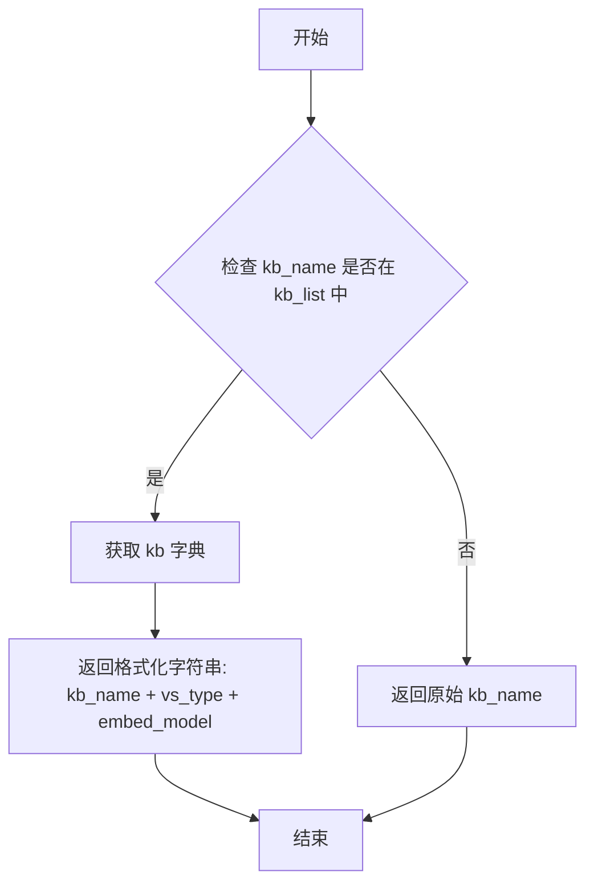

#### 带注释源码

```python
def format_selected_kb(kb_name: str) -> str:
    """
    格式化知识库的显示名称，用于Streamlit下拉选择框
    参数:
        kb_name: 知识库的名称
    返回:
        格式化的显示字符串，如果知识库存在则显示完整信息，否则显示原始名称
    """
    # 使用海象运算符获取知识库信息，如果存在则格式化显示
    if kb := kb_list.get(kb_name):
        # 返回格式: "知识库名称 (向量库类型 @ 嵌入模型)"
        return f"{kb_name} ({kb['vs_type']} @ {kb['embed_model']})"
    else:
        # 如果知识库不存在，返回原始名称
        return kb_name
```


### `get_kb_details`

该函数为外部依赖函数，从 `chatchat.server.knowledge_base.kb_service.base` 模块导入，用于获取所有知识库的详细信息列表。在当前文件中被调用以初始化知识库名称与详细信息的映射。

参数：  
无

返回值：`List[Dict]`，返回包含所有知识库详细信息的字典列表，每个字典包含 `kb_name`、`vs_type`、`embed_model`、`kb_info` 等字段。

#### 流程图

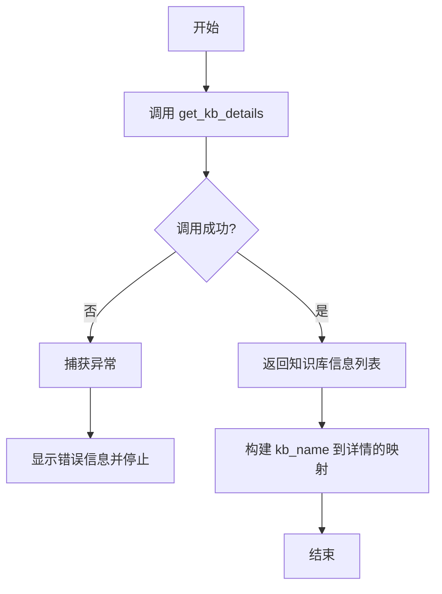

#### 带注释源码

```python
# 注：该函数定义在 chatchat.server.knowledge_base.kb_service.base 模块中
# 以下为基于调用的推断源码

def get_kb_details() -> List[Dict]:
    """
    获取所有知识库的详细信息。
    
    返回:
        List[Dict]: 知识库详情列表，每个元素包含:
            - kb_name: 知识库名称
            - vs_type: 向量存储类型
            - embed_model: Embedding模型
            - kb_info: 知识库简介
            - ... 其他字段
    """
    # 从数据库或配置中获取所有知识库记录
    # 返回格式示例:
    # [
    #     {
    #         "kb_name": "my_kb",
    #         "vs_type": "faiss",
    #         "embed_model": "text-embedding-ada-002",
    #         "kb_info": "这是一个测试知识库"
    #     },
    #     ...
    # ]
    pass
```

#### 在当前文件中的调用方式

```python
# 调用示例
try:
    # 获取所有知识库详情，并转换为以 kb_name 为键的字典
    kb_list = {x["kb_name"]: x for x in get_kb_details()}
except Exception as e:
    # 异常处理：显示错误信息并停止页面渲染
    st.error(
        "获取知识库信息错误，请检查是否已按照 `README.md` 中 `4 知识库初始化与迁移` 步骤完成初始化或迁移，或是否为数据库连接错误。"
    )
    st.stop()
```


### `get_kb_file_details`

获取指定知识库中所有文件的详细信息，包括文件名称、文档加载器、分词器、文档数量、文件状态等。

参数：

-  `kb`：`str`，知识库名称，用于指定要查询哪个知识库的文件详情

返回值：`List[Dict]`，返回知识库中所有文件的详情列表，每个字典包含文件的各项属性信息，可直接用于构建 pandas DataFrame

#### 流程图

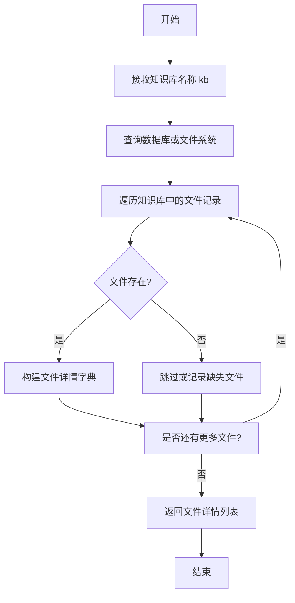

#### 带注释源码

```python
# 该函数定义位于 chatchat.server.knowledge_base.kb_service.base 模块中
# 当前文件中通过以下方式导入:
# from chatchat.server.knowledge_base.kb_service.base import get_kb_file_details

# 使用示例 (在当前文件第217行左右):
doc_details = pd.DataFrame(get_kb_file_details(kb))

# 基于使用方式推断的函数签名:
def get_kb_file_details(kb: str) -> List[Dict]:
    """
    获取指定知识库的文件详情列表
    
    Args:
        kb: 知识库名称
        
    Returns:
        包含以下字段的字典列表:
        - No: 序号
        - kb_name: 知识库名称
        - file_name: 文件名称
        - file_ext: 文件扩展名
        - file_version: 文件版本
        - document_loader: 文档加载器类型
        - text_splitter: 文本分割器类型
        - docs_count: 文档数量
        - create_time: 创建时间
        - in_folder: 文件是否存在于文件夹
        - in_db: 文件是否存在于向量数据库
    """
    pass
```


### `get_file_path`

获取知识库中指定文件的完整路径。

参数：

- `kb`：`str`，知识库的名称
- `file_name`：`str`，要获取路径的文件名

返回值：`str`，文件的完整路径

#### 流程图

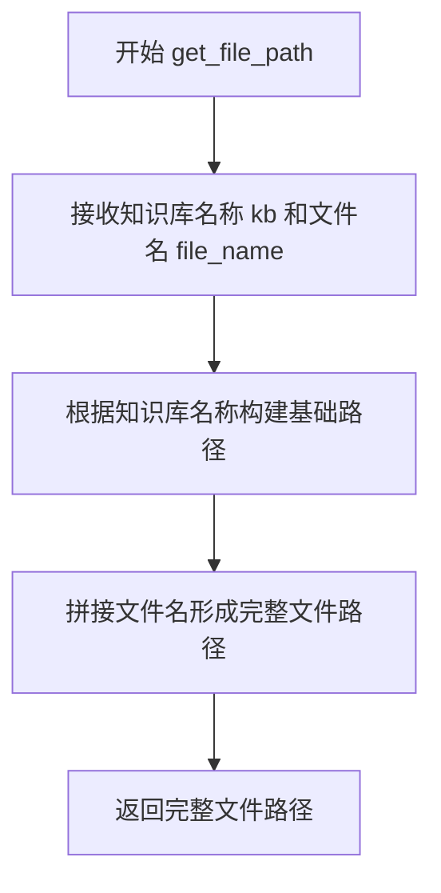

#### 带注释源码

```python
# 该函数定义在 chatchat.server.knowledge_base.utils 模块中
# 从代码中的使用方式可以推断其签名和功能：

# 使用示例（在 knowledge_base_page 函数中）:
file_name = selected_rows[0]["file_name"]
file_path = get_file_path(kb, file_name)  # 获取知识库中文件的完整路径
if os.path.isfile(file_path):  # 检查文件是否存在
    return file_name, file_path

# 函数签名推断:
def get_file_path(kb: str, file_name: str) -> str:
    """
    根据知识库名称和文件名获取文件的完整路径
    
    参数:
        kb: 知识库名称
        file_name: 文件名
        
    返回:
        文件的完整路径字符串
    """
    # 具体实现未在当前代码片段中提供
    pass
```


### `get_config_models`

该函数用于获取配置中指定类型的模型列表，常用于在知识库创建页面中获取可用的Embedding模型列表。

参数：

- `model_type`：`Literal["embed", ...]`，模型类型参数，用于筛选对应类型的模型（如"embed"表示获取Embedding模型）

返回值：`List[str]`，返回指定类型的模型名称列表

#### 流程图

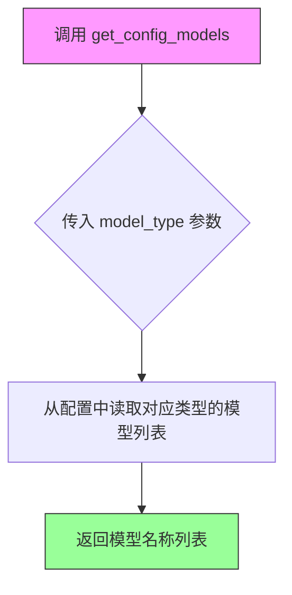

#### 带注释源码

```
# 注意：该函数定义在 chatchat.server.utils 模块中，此处仅展示引用方式
# 函数定义不在当前代码文件中

from chatchat.server.utils import get_config_models, get_default_embedding

# 使用示例（在当前文件的 knowledge_base_page 函数中）
embed_models = list(get_config_models(model_type="embed"))
# 获取默认的 Embedding 模型
default_embedding = get_default_embedding()
# 如果默认模型在列表中，获取其索引
if default_embedding in embed_models:
    index = embed_models.index(default_embedding)
else:
    index = 0
# 使用 selectbox 组件展示模型选择
embed_model = st.selectbox("Embeddings模型", embed_models, index)
```

---

**备注**：该函数`get_config_models`定义在 `chatchat.server.utils` 模块中，当前代码文件通过 import 引入并使用。从调用方式可以看出：

1. 函数接受一个 `model_type` 字符串参数，用于指定要获取的模型类型
2. 返回值是一个可迭代对象，包含对应类型的模型名称列表
3. 在知识库页面中，该函数用于获取所有可用的 Embedding 模型，供用户选择


我需要分析给定的代码来提取 `get_default_embedding` 函数的信息。让我仔细查看代码。

从代码中可以看到：

```python
from chatchat.server.utils import get_default_embedding
```

以及它的使用方式：

```python
embed_models = list(get_config_models(model_type="embed"))
index = 0
if get_default_embedding() in embed_models:
    index = embed_models.index(get_default_embedding())
embed_model = st.selectbox("Embeddings模型", embed_models, index)
```

从代码中可以看出：

1. `get_default_embedding` 是从 `chatchat.server.utils` 模块导入的函数
2. 调用时不传入任何参数
3. 返回值是字符串类型（用于与 `embed_models` 列表进行比较）

由于该函数定义不在当前代码文件中，我需要提供基于使用方式的分析。

### `get_default_embedding`

获取系统中默认的 Embedding 模型名称。

参数：

- （无参数）

返回值：`str`，返回默认的 Embedding 模型名称，用于在知识库创建时设置为默认选项。

#### 流程图

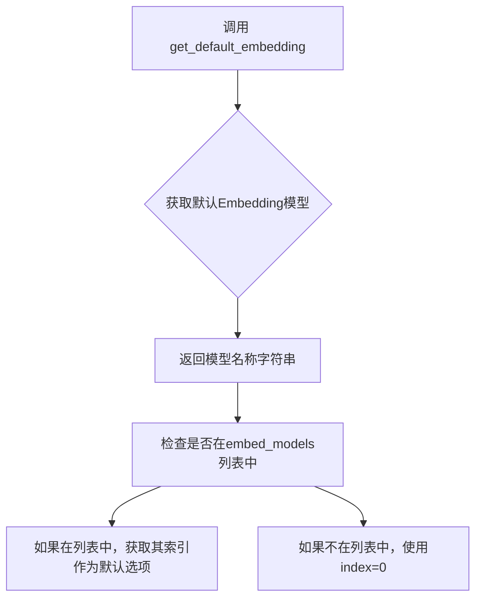

#### 带注释源码

```
# 该函数定义在 chatchat.server.utils 模块中
# 以下是当前代码文件中对该函数的使用方式

from chatchat.server.utils import get_default_embedding

# ... 在 knowledge_base_page 函数中 ...

# 获取可用的Embedding模型列表
embed_models = list(get_config_models(model_type="embed"))
index = 0
# 检查默认Embedding模型是否在列表中
if get_default_embedding() in embed_models:
    # 如果在列表中，获取其索引作为下拉框的默认选项
    index = embed_models.index(get_default_embedding())
# 创建Embedding模型选择下拉框，默认选中默认模型
embed_model = st.selectbox("Embeddings模型", embed_models, index)
```

> **注意**：由于 `get_default_embedding` 函数的完整定义不在提供的代码文件中，以上信息是基于代码中的导入语句和使用方式进行推断的。该函数返回默认的 Embedding 模型名称（字符串类型），用于在知识库创建页面中设置默认选中的 Embedding 模型选项。


### `api.create_knowledge_base`

创建新的知识库，配置向量存储类型和嵌入模型。

参数：

- `knowledge_base_name`：`str`，新建知识库的名称
- `vector_store_type`：`str`，向量库类型（如 faiss、milvus 等）
- `embed_model`：`str`，用于生成向量嵌入的 Embeddings 模型

返回值：`Dict`，包含操作结果信息，通常包含 `msg` 字段表示成功或错误信息

#### 流程图

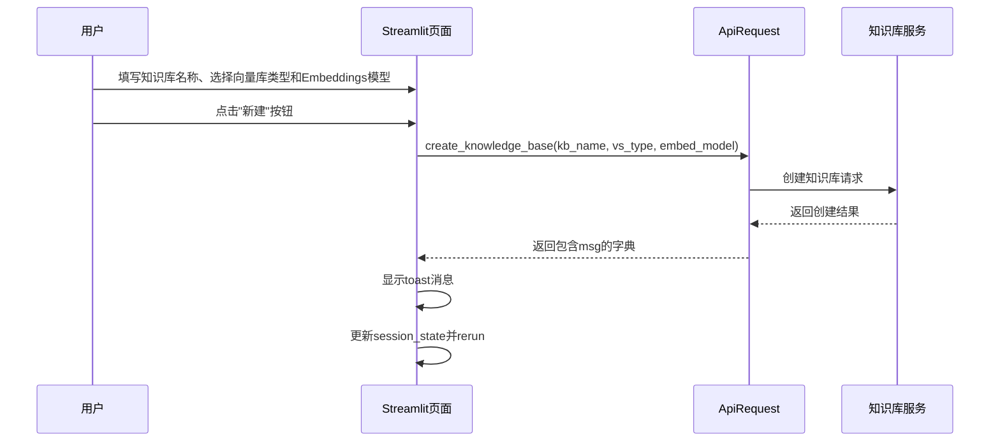

#### 带注释源码

```python
# 在 knowledge_base_page 函数中的调用示例
# 当用户填写完知识库信息并点击"新建"按钮后触发
ret = api.create_knowledge_base(
    knowledge_base_name=kb_name,      # 用户输入的知识库名称
    vector_store_type=vs_type,         # 用户选择的向量库类型
    embed_model=embed_model,           # 用户选择的Embeddings模型
)

# 处理返回值
st.toast(ret.get("msg", " "))          # 显示操作结果消息
st.session_state["selected_kb_name"] = kb_name  # 更新当前选中的知识库
st.session_state["selected_kb_info"] = kb_info   # 更新知识库描述信息
st.rerun()                             # 重新运行脚本刷新页面状态
```

> **注意**：该函数的完整实现未在当前代码文件中给出，它属于 `ApiRequest` 类的方法，定义在 `chatchat.server.utils` 模块中。从调用方式来看，它接受三个字符串参数并返回一个字典对象，其中包含 `msg` 字段用于前端显示操作结果。


### `api.upload_kb_docs`

该方法用于将用户上传的文件添加到指定的知识库中，支持文本分块、块重叠设置及中文标题增强等配置，完成文档向量化处理。

参数：

- `files`：`List[UploadedFile]`（或 `List`），用户通过 Streamlit 文件上传器选择的知识库文件列表，支持多文件上传
- `knowledge_base_name`：`str`，目标知识库的名称，用于指定文件上传到哪个知识库
- `override`：`bool`，是否覆盖已存在的文档，默认为 `True`
- `chunk_size`：`int`，单段文本的最大长度，用于文档分块，范围 1-1000
- `chunk_overlap`：`int`，相邻文本块之间的重合长度，用于保持上下文连贯性
- `zh_title_enhance`：`bool`，是否开启中文标题加强功能，提升中文文档检索效果

返回值：`Dict` 或 `None`，返回 API 调用的响应结果，通常包含操作状态消息（成功或错误信息）

#### 流程图

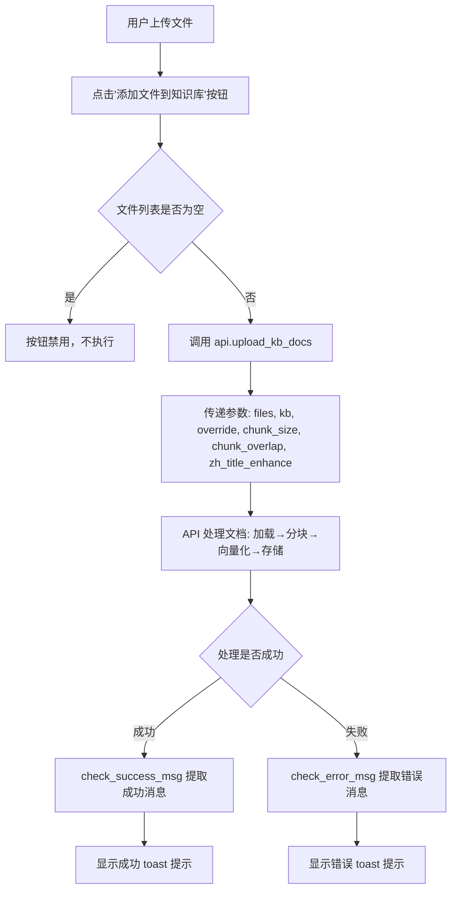

#### 带注释源码

```python
# 在 knowledge_base_page 函数中调用 upload_kb_docs 的代码片段

# 文件上传器，允许用户上传多个知识文件
# 支持的文件的类型由 LOADER_DICT 决定（从配置中读取）
files = st.file_uploader(
    "上传知识文件：",
    [i for ls in LOADER_DICT.values() for i in ls],  # 合并所有支持的文件扩展名
    accept_multiple_files=True,  # 允许同时上传多个文件
)

# 文件处理配置区域
with st.expander("文件处理配置", expanded=True):
    cols = st.columns(3)
    # chunk_size: 单段文本最大长度，默认从设置中读取，可配置 1-1000
    chunk_size = cols[0].number_input("单段文本最大长度：", 1, 1000, Settings.kb_settings.CHUNK_SIZE)
    # chunk_overlap: 相邻文本重合长度，默认从设置中读取，不能超过 chunk_size
    chunk_overlap = cols[1].number_input(
        "相邻文本重合长度：", 0, chunk_size, Settings.kb_settings.OVERLAP_SIZE
    )
    cols[2].write("")
    cols[2].write("")
    # zh_title_enhance: 是否开启中文标题加强，默认从设置中读取
    zh_title_enhance = cols[2].checkbox("开启中文标题加强", Settings.kb_settings.ZH_TITLE_ENHANCE)

# 当用户点击"添加文件到知识库"按钮时触发
if st.button(
    "添加文件到知识库",
    # use_container_width=True,
    disabled=len(files) == 0,  # 文件列表为空时禁用按钮
):
    # 调用 API 上传文档到知识库
    # 参数说明:
    #   files: 上传的文件对象列表
    #   knowledge_base_name: 目标知识库名称
    #   override: True 表示如果文件已存在则覆盖
    #   chunk_size: 文本分块大小
    #   chunk_overlap: 文本块重叠大小
    #   zh_title_enhance: 是否启用中文标题加强
    ret = api.upload_kb_docs(
        files,
        knowledge_base_name=kb,
        override=True,
        chunk_size=chunk_size,
        chunk_overlap=chunk_overlap,
        zh_title_enhance=zh_title_enhance,
    )
    
    # 检查返回结果并显示提示
    # 成功时显示绿色勾选标记，失败时显示红色叉号
    if msg := check_success_msg(ret):
        st.toast(msg, icon="✔")
    elif msg := check_error_msg(ret):
        st.toast(msg, icon="✖")
```


### `api.update_kb_docs`

该方法用于更新知识库中的文档，可用于重新分词并加载文件到向量库，或直接更新文档内容（如修改分词后的文本）。

参数：

- `knowledge_base_name` / `kb`：`str`，知识库名称，指定要更新的目标知识库
- `file_names`：`List[str]`，要更新的文件名列表
- `chunk_size`：`int`，（可选）分词时的单段文本最大长度
- `chunk_overlap`：`int`，（可选）相邻文本重合长度
- `zh_title_enhance`：`bool`，（可选）是否开启中文标题加强
- `docs`：`Dict[str, List[Dict]]`，（可选）直接更新的文档内容字典，键为文件名，值为文档内容列表，每项包含 page_content、type、metadata
- `override`：`bool`，（可选）是否覆盖已有文档

返回值：`bool` 或 `dict`，成功时返回 `True` 或包含成功信息的字典，失败时返回 `False` 或包含错误信息的字典

#### 流程图

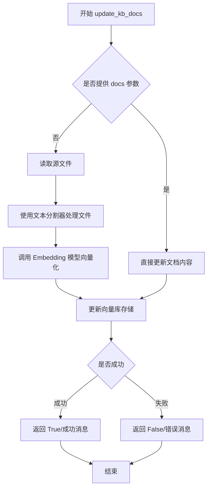

#### 带注释源码

```python
# 第一次调用：用于重新添加文件到向量库（带新的分词配置）
api.update_kb_docs(
    kb,  # 知识库名称
    file_names=file_names,  # 要处理的文件名列表
    chunk_size=chunk_size,  # 单段文本最大长度
    chunk_overlap=chunk_overlap,  # 相邻文本重合长度
    zh_title_enhance=zh_title_enhance,  # 是否开启中文标题加强
)

# 第二次调用：用于保存用户编辑后的文档内容（直接更新向量库中的文本）
if api.update_kb_docs(
    knowledge_base_name=selected_kb,  # 知识库名称
    file_names=[file_name],  # 文件名列表
    docs={file_name: changed_docs},  # 更新后的文档内容
):
    st.toast("更新文档成功")
else:
    st.toast("更新文档失败")
```


### `api.delete_kb_docs`

该函数用于从知识库中删除指定的文档文件，支持两种删除模式：从向量库删除（仅移除向量映射，保留源文件）或从知识库完全删除（同时删除源文件和向量映射）。

参数：

- `kb`：`str`，知识库名称，指定要操作的目标知识库
- `file_names`：`List[str]`，要删除的文件名列表
- `delete_content`：`bool`，可选参数，默认为 `False`。当为 `True` 时，会同时删除知识库中的源文件；为 `False` 时仅从向量库删除

返回值：`bool` 或 `dict`，返回操作结果，通常包含成功/失败状态信息

#### 流程图

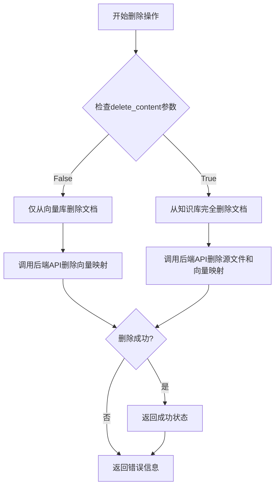

#### 带注释源码

```python
# 从知识库中删除文档（从向量库删除，但不删除文件本身）
if cols[2].button(
    "从向量库删除",
    disabled=not (selected_rows and selected_rows[0]["in_db"]),
    use_container_width=True,
):
    # 提取选中行的文件名列表
    file_names = [row["file_name"] for row in selected_rows]
    # 调用API，仅从向量库删除（delete_content默认为False）
    api.delete_kb_docs(kb, file_names=file_names)
    # 刷新页面以更新显示
    st.rerun()

# 从知识库中完全删除文档（同时删除源文件和向量库）
if cols[3].button(
    "从知识库中删除",
    type="primary",
    use_container_width=True,
):
    # 提取选中行的文件名列表
    file_names = [row["file_name"] for row in selected_rows]
    # 调用API，完全删除（delete_content=True）
    api.delete_kb_docs(kb, file_names=file_names, delete_content=True)
    # 刷新页面以更新显示
    st.rerun()
```

> **注意**：由于 `api.delete_kb_docs` 方法定义不在当前代码文件中，以上信息是基于 `ApiRequest` 类的典型实现模式和代码调用上下文推断得出的。该方法通常定义在 `chatchat.server.api.py` 或类似的 API 封装模块中，用于与后端知识库管理服务进行交互。


### `api.search_kb_docs`

该函数用于在指定知识库中搜索特定文件名对应的文档内容，返回文档的详细信息列表，包括文档ID、页面内容、元数据等信息，常用于知识库中文档的查看和编辑功能。

参数：

- `knowledge_base_name`：`str`，要搜索的知识库名称
- `file_name`：`str`，要搜索的文件名称

返回值：`List[Dict]`，返回包含文档信息的字典列表，每个字典包含文档的唯一标识ID、页面内容、类型、源文件等元数据信息

#### 流程图

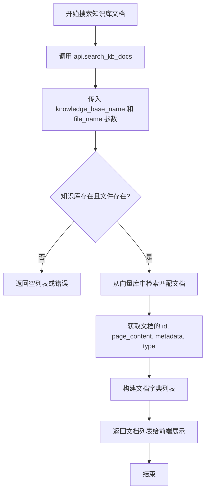

#### 带注释源码

```python
# 从代码中提取的 api.search_kb_docs 调用位置
# 位于 knowledge_base_page 函数内部

# 当用户选择了知识库中的文件后，获取该文件内的文档列表
if selected_rows:
    file_name = selected_rows[0]["file_name"]
    
    # 调用 search_kb_docs 方法搜索知识库中的文档
    # 参数:
    #   - knowledge_base_name: 当前选中的知识库名称
    #   - file_name: 选中的文件名
    docs = api.search_kb_docs(
        knowledge_base_name=selected_kb, file_name=file_name
    )

    # 将返回的文档列表转换为 DataFrame 可处理的格式
    data = [
        {
            "seq": i + 1,                                      # 序号
            "id": x["id"],                                     # 文档唯一ID
            "page_content": x["page_content"],                # 文档内容
            "source": x["metadata"].get("source"),            # 源文件路径
            "type": x["type"],                                 # 文档类型
            "metadata": json.dumps(x["metadata"], ensure_ascii=False),  # 元数据JSON字符串
            "to_del": "",                                       # 删除标记列
        }
        for i, x in enumerate(docs)                            # 遍历返回的文档列表
    ]
    df = pd.DataFrame(data)
```

#### 备注

该函数的完整定义位于 `api` 对象中（`ApiRequest` 类），当前代码文件只是调用方。从调用方式可以推断：

1. **函数签名**：`search_kb_docs(knowledge_base_name: str, file_name: str) -> List[Dict]`
2. **功能**：根据知识库名称和文件名，在向量库中检索对应的文档 chunks
3. **返回值结构**：返回文档列表，每个文档包含 `id`、`page_content`、`type`、`metadata` 等字段
4. **使用场景**：在知识库页面查看特定文件内的文档内容列表，支持后续的编辑和删除操作


### `api.recreate_vector_store`

该函数用于依据知识库中的源文件重新构建向量库，无需上传文件，通过读取知识库content目录下的文档并重新进行分词、向量化处理后存入向量库。

参数：

- `kb`：`str`，知识库名称，指定要重建向量库的目标知识库
- `chunk_size`：`int`，单段文本最大长度，即分块时的块大小
- `chunk_overlap`：`int`，相邻文本重合长度，即分块时的重叠部分大小
- `zh_title_enhance`：`bool`，是否开启中文标题加强，启用后会对中文文档标题进行特殊处理以提升检索效果

返回值：`Generator[Dict, None, None]`，返回一个生成器，每一轮迭代返回一个包含进度信息的字典，包含 `finished`（已完成数量）、`total`（总数）和 `msg`（状态消息）字段

#### 流程图

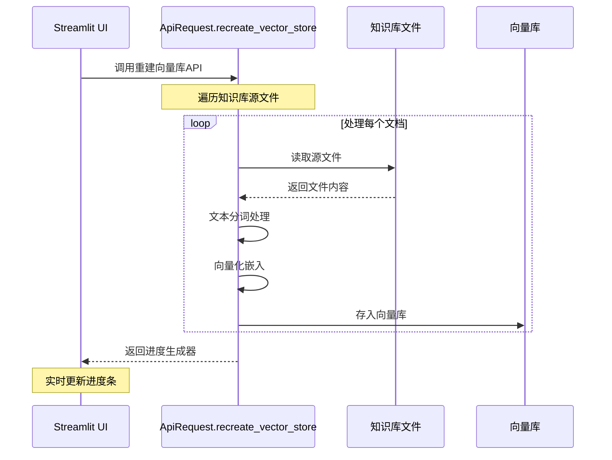

#### 带注释源码

```python
# 调用示例（在 knowledge_base_page 函数中）
# 该函数被用于"依据源文件重建向量库"按钮的回调中
if cols[0].button(
    "依据源文件重建向量库",
    help="无需上传文件，通过其它方式将文档拷贝到对应知识库content目录下，点击本按钮即可重建知识库。",
    use_container_width=True,
    type="primary",
):
    with st.spinner("向量库重构中，请耐心等待，勿刷新或关闭页面。"):
        empty = st.empty()
        empty.progress(0.0, "")
        # 调用 recreate_vector_store 函数，传入知识库名称和分词配置
        for d in api.recreate_vector_store(
            kb,  # 知识库名称
            chunk_size=chunk_size,  # 单段文本最大长度
            chunk_overlap=chunk_overlap,  # 相邻文本重合长度
            zh_title_enhance=zh_title_enhance,  # 是否开启中文标题加强
        ):
            # 检查返回数据是否为错误消息
            if msg := check_error_msg(d):
                st.toast(msg)
            else:
                # 更新进度条，显示完成进度和当前处理状态
                empty.progress(d["finished"] / d["total"], d["msg"])
        # 重建完成后刷新页面
        st.rerun()
```


### `api.delete_knowledge_base`

该方法用于通过API调用删除指定的知识库。它接收知识库名称作为参数，调用后端服务执行知识库删除操作，并返回包含操作结果的响应消息。

参数：

- `knowledge_base_name`：`str`，要删除的知识库名称

返回值：`dict`，包含操作结果的响应字典，通常包含 "msg" 键表示操作状态信息

#### 流程图

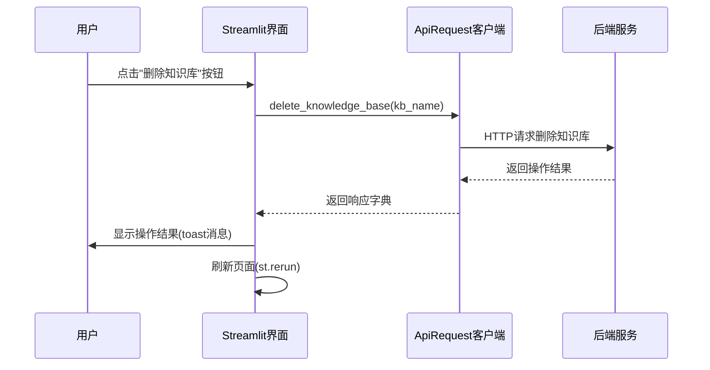

#### 带注释源码

```python
# 在 knowledge_base_page 函数中调用
if cols[2].button(
    "删除知识库",  # 按钮文本
    use_container_width=True,  # 按钮宽度充满容器
):
    # 调用API删除知识库，kb为当前选中的知识库名称
    ret = api.delete_knowledge_base(kb)
    
    # 显示操作结果消息
    st.toast(ret.get("msg", " "))
    
    # 等待1秒让用户看到消息
    time.sleep(1)
    
    # 重新运行脚本刷新页面状态
    st.rerun()
```


由于 `check_success_msg` 函数是从 `chatchat.webui_pages.utils` 模块导入的（通过 `from chatchat.webui_pages.utils import *`），在提供的代码中并未直接定义该函数。根据代码中的调用方式，可以推断出该函数的功能和用法。

### `check_success_msg`

该函数用于检查 API 调用的响应是否成功，并提取成功消息。通常与 `check_error_msg` 函数配对使用，分别处理成功和错误两种情况。

参数：

-  `ret`：任意类型，通常为字典（Dict），API 调用返回的响应对象

返回值：`str` 或 `None`，如果响应表示成功，则返回成功消息字符串；否则返回 `None` 或 `False`

#### 流程图

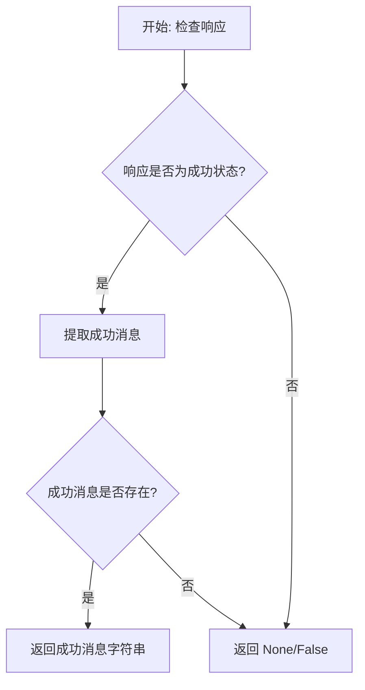

#### 带注释源码

```
# 注意: 此函数源码未在当前文件中定义
# 它是从 chatchat.webui_pages.utils 导入的
# 根据代码调用方式推断的可能实现:

def check_success_msg(ret) -> Optional[str]:
    """
    检查API响应是否成功，并提取成功消息
    
    参数:
        ret: API调用返回的响应对象，通常为字典
    
    返回:
        成功消息字符串，如果失败则返回None
    """
    # 常见的实现方式可能是检查响应中的特定字段
    # 例如: ret.get("code") == 0 或 ret.get("success") == True
    # 然后返回 ret.get("msg") 或 ret.get("message")
    
    if isinstance(ret, dict):
        # 检查是否有错误标志
        if ret.get("code") == 0 or ret.get("success"):
            return ret.get("msg") or ret.get("message", "")
    
    return None
```

#### 调用示例

在代码中的实际用法：

```python
# 用法1: 创建知识库后检查
ret = api.create_knowledge_base(
    knowledge_base_name=kb_name,
    vector_store_type=vs_type,
    embed_model=embed_model,
)
if msg := check_success_msg(ret):
    st.toast(msg, icon="✔")

# 用法2: 上传文件后检查
ret = api.upload_kb_docs(
    files,
    knowledge_base_name=kb,
    override=True,
    chunk_size=chunk_size,
    chunk_overlap=chunk_overlap,
    zh_title_enhance=zh_title_enhance,
)
if msg := check_success_msg(ret):
    st.toast(msg, icon="✔")
elif msg := check_error_msg(ret):
    st.toast(msg, icon="✖")
```

---

**注意**：由于 `check_success_msg` 函数的实际源码不在当前文件中，它应该是从 `chatchat/webui_pages/utils.py` 模块中导入的。如需查看完整实现，需要查看该源文件。


### `check_error_msg`

该函数用于检查API响应中是否包含错误信息，并返回错误消息（如果存在）。由于该函数是通过 `from chatchat.webui_pages.utils import *` 从外部模块导入的，因此未在当前代码段中显示其实现。

参数：

- `ret`：任意类型，从API返回的响应对象，用于检查是否包含错误信息

返回值：`str` 或 `False`，如果响应中存在错误则返回错误消息字符串，否则返回 `False`

#### 流程图

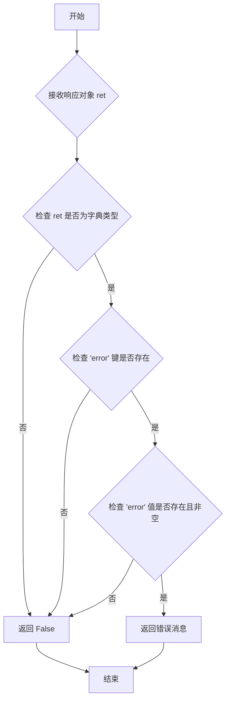

#### 带注释源码

由于 `check_error_msg` 函数定义在 `chatchat/webui_pages/utils.py` 模块中（通过 `from chatchat.webui_pages.utils import *` 导入），该函数的实现未包含在当前提供的代码段中。根据代码中的调用方式，可以推断其签名如下：

```python
def check_error_msg(ret: Any) -> Union[str, bool]:
    """
    Check if the response contains an error message.
    
    Args:
        ret: The response object from API call
        
    Returns:
        The error message string if error exists, otherwise False
    """
    # Function implementation not visible in provided code
    # Likely imported from chatchat.webui_pages.utils
```

**使用示例**（在当前代码中的调用）：

```python
# 场景1：上传文件到知识库后检查错误
if msg := check_error_msg(ret):
    st.toast(msg, icon="✖")

# 场景2：重建向量库过程中检查错误
for d in api.recreate_vector_store(...):
    if msg := check_error_msg(d):
        st.toast(msg)
```

## 关键组件


### 知识库管理页面入口 (knowledge_base_page)

知识库管理的主页面函数，提供知识库的创建、选择、文件上传、文档管理、向量库重建等核心功能的Web界面。

### AG-Grid配置组件 (config_aggrid)

用于配置st_aggrid表格的选项，包括列定义、选择模式、复选框、分页等设置。

### 文件存在性检查组件 (file_exists)

检查指定知识库中是否存在目标文档文件，返回文件名和文件路径。

### 单元格渲染器 (cell_renderer)

JavaScript代码生成的单元格渲染器，用于在表格中显示✓或×符号来表示布尔值。

### 知识库选择器

通过st.selectbox组件实现知识库的选择和新建功能，支持显示向量库类型和Embedding模型信息。

### 文件上传模块

支持多文件上传的st.file_uploader组件，接受多种文档格式，通过LOADER_DICT定义支持的加载器类型。

### 文档处理配置组件

包含三个配置项：单段文本最大长度(chunk_size)、相邻文本重合长度(chunk_overlap)、中文标题增强(zh_title_enhance)开关。

### 知识库文件列表展示

使用AgGrid展示知识库中的文件列表，包含文档名称、加载器类型、分词器、文档数量、源文件状态、向量库状态等字段。

### 文件操作按钮组

包含四个操作：下载选中文档、添加/重新添加至向量库、从向量库删除、从知识库删除。

### 向量库重建组件

通过api.recreate_vector_store重建整个知识库的向量库，包含进度显示功能。

### 文档内列表编辑组件

使用AG-Grid展示文档内的分段内容，支持inline编辑page_content、删除标记(to_del)，并可保存更改。

### 侧边栏搜索组件

提供关键字输入和匹配条数(top_k)滑块，用于在知识库中搜索相关文档。


## 问题及建议


### 已知问题

-   **导入冗余**：`time` 模块导入后仅用于 `time.sleep(1)`，在 Streamlit 中应使用 `st.rerun()` 替代；`ParseItems` 从 `streamlit_antd_components.utils` 导入但未使用
-   **硬编码配置**：分页大小 `paginationPageSize=10`、列宽等参数直接写死，缺少配置化管理
-   **异常处理不完整**：`get_kb_details()` 有异常捕获，但 `api.create_knowledge_base`、`api.upload_kb_docs` 等 API 调用缺乏异常处理，可能导致页面崩溃
-   **文件路径安全风险**：直接使用用户输入的 `file_name` 拼接路径 `get_file_path(kb, file_name)`，未进行路径遍历攻击防护
-   **类型注解缺失**：`file_exists` 函数参数 `selected_rows` 使用 `List` 但未显式导入（虽然文件开头用了 `from typing import ...`），`knowledge_base_page` 函数参数 `is_live` 未使用
-   **代码重复**：获取选中文件名的逻辑 `[row["file_name"] for row in selected_rows]` 在多处重复出现
-   **Session State 过度使用**：大量使用 `st.session_state` 存储状态，增加了状态管理的复杂性和出错概率
-   **性能问题**：`get_kb_file_details(kb)` 返回后进行了多次 DataFrame 操作（`drop`、`replace`），可优化处理流程
-   **注释代码未清理**：存在 `# SENTENCE_SIZE = 100` 等已注释掉的代码，影响代码可维护性

### 优化建议

-   移除未使用的导入（`time`、`ParseItems`），删除注释掉的代码
-   将硬编码的分页大小、列宽等提取为常量或配置项
-   对所有 API 调用添加 try-except 异常处理，并给用户友好的错误提示
-   对文件路径进行安全校验，防止路径遍历攻击
-   提取重复的文件名获取逻辑为独立函数
-   使用 `@st.cache_data` 缓存不频繁变化的数据（如知识库列表）
-   考虑将 Session State 封装为统一的状态管理模块
-   补充完整的类型注解，特别是 `knowledge_base_page` 函数的参数和返回值类型

## 其它


### 设计目标与约束

本页面旨在为用户提供一个完整的知识库管理界面，支持知识库的创建、文件上传、文档分块、向量化存储、向量库重建、文档编辑与删除等核心功能。设计约束包括：1）仅支持单知识库操作模式；2）文件处理依赖预定义的LOADER_DICT；3）向量库类型和Embedding模型受Settings配置限制；4）前端交互依赖Streamlit和AgGrid组件；5）知识库操作需通过API接口与后端通信。

### 错误处理与异常设计

代码采用多层次错误处理机制。在知识库列表获取阶段，使用try-except捕获异常并显示错误提示"获取知识库信息错误，请检查是否已按照README.md中4知识库初始化与迁移步骤完成初始化或迁移，或是否为数据库连接错误"，然后调用st.stop()终止页面渲染。在API调用返回值检查中，使用check_success_msg和check_error_msg函数分别提取成功和错误信息并通过st.toast反馈。对于文件存在性检查，file_exists函数返回空字符串元组表示文件不存在，调用处据此禁用下载按钮。在表单提交验证中，分别检查知识库名称是否为空、是否已存在、Embedding模型是否选择，未通过验证时显示对应错误信息。

### 数据流与状态机

页面数据流主要包括：1）初始化时从get_kb_details()获取知识库列表存入kb_list字典；2）用户选择知识库后，通过st.session_state存储selected_kb_name和selected_kb_info；3）文件上传后调用api.upload_kb_docs上传文件；4）文件操作（添加至向量库、删除等）后调用st.rerun()刷新页面；5）文档编辑时从api.search_kb_docs获取文档详情，编辑完成后通过api.update_kb_docs保存。状态转换包括：初始状态→知识库选择→文件操作选择→操作执行→页面刷新，其中新建知识库和选择已有知识库是两个主要分支。

### 外部依赖与接口契约

代码依赖以下外部组件和接口：1）Streamlit框架提供UI组件（st.selectbox、st.file_uploader、st.button等）；2）st_aggrid库提供AgGrid表格组件及GridOptionsBuilder配置；3）streamlit_antd_components库提供SAC组件；4）pandas库处理DataFrame数据；5）chatchat.settings.Settings提供配置信息（kb_settings、CHUNK_SIZE、OVERLAP_SIZE等）；6）chatchat.server.knowledge_base.kb_service.base提供get_kb_details和get_kb_file_details接口；7）chatchat.server.knowledge_base.utils提供LOADER_DICT和get_file_path工具函数；8）chatchat.server.utils提供get_config_models和get_default_embedding函数。ApiRequest对象api需支持create_knowledge_base、upload_kb_docs、update_kb_docs、delete_kb_docs、delete_knowledge_base、recreate_vector_store、search_kb_docs等方法。

### 性能考量

页面存在以下性能优化空间：1）get_kb_details()和get_kb_file_details()在每次页面加载时都会被调用，未实现缓存机制，对于知识库数量较多的场景建议添加缓存；2）文档列表使用AgGrid分页，每页10条，但搜索文档时一次性加载所有docs数据，当文档数量庞大时可能导致内存占用过高，建议实现服务端分页；3）文件下载使用open函数读取整个文件内容，对于大文件建议使用st.download_button的streaming参数；4）批量操作（如重新添加至向量库）未显示进度条，重建向量库虽有进度显示但刷新机制可优化。

### 安全与权限设计

代码未显式实现权限控制功能，但通过以下隐式机制保证基本安全：1）知识库名称验证（不支持中文命名）防止特殊字符注入；2）文件操作基于用户选择的知识库和文件，逻辑上实现租户隔离；3）API接口调用需携带正确的knowledge_base_name参数；4）文件路径通过get_file_path函数获取，禁止用户直接指定路径防止目录遍历攻击；5）下载功能仅允许下载存在于指定知识库目录下的文件。

### 可维护性与扩展性

代码可从以下方面提升可维护性：1）多处硬编码配置（如paginationPageSize=10、chunk_size默认值）建议提取为配置项；2）cell_renderer和config_aggrid函数可封装为工具类；3）知识库创建逻辑包含较多st.form内部组件，耦合度较高，建议拆分为独立函数；4）重复代码模式（如提取file_names列表）可抽象为辅助方法；5）文档编辑保存逻辑中，origin_docs构建和changed_docs遍历可使用更Pythonic的方式实现；6）建议添加日志记录关键操作便于问题排查。

    