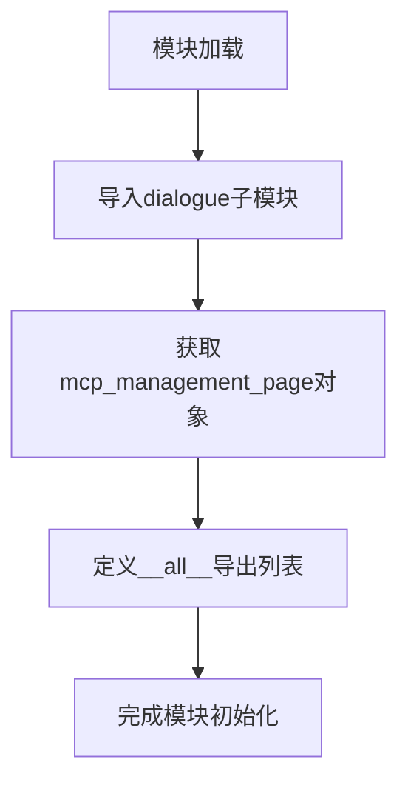

# `Langchain-Chatchat\libs\chatchat-server\chatchat\webui_pages\mcp\__init__.py` 详细设计文档

这是一个MCP管理页面的包初始化模块，负责从dialogue子模块导入并导出mcp_management_page核心功能组件，供外部调用使用。

## 整体流程



## 类结构

```
该文件为包初始化文件，无类层次结构
如需了解mcp_management_page的详细信息，需查看dialogue模块源码
```

## 全局变量及字段


### `mcp_management_page`
    
渲染MCP管理页面的主函数，用于展示和管理MCP服务配置

类型：`function`
    


    

## 全局函数及方法


## 关键组件


### MCP管理页面模块

该模块是MCP（Model Control Protocol）管理页面的入口模块，负责对外暴露MCP管理页面的核心功能，充当模块间的集成层。

### 文件整体运行流程

该模块作为包级别（package-level）的入口文件，其运行流程如下：
1. Python解释器导入该模块时，首先执行模块初始化
2. 从同目录下的 `dialogue` 子模块导入 `mcp_management_page` 函数/类
3. 通过 `__all__` 定义公共API接口，供外部调用

### 关键组件信息

#### mcp_management_page

**类型**: 函数/类（取决于dialogue模块的实际实现）

**描述**: MCP管理页面的核心功能实现，负责渲染和管理MCP服务的配置界面

### 全局变量和导入信息

| 名称 | 类型 | 描述 |
|------|------|------|
| `__all__` | list | 定义模块的公共接口，仅导出mcp_management_page |

### 潜在的技术债务或优化空间

1. **模块依赖单一**: 当前模块仅从`dialogue`导入，如需扩展MCP管理功能，可能需要重构导入结构
2. **文档缺失**: 缺少对`mcp_management_page`具体功能的文档说明
3. **模块化程度**: 建议将不同功能（如配置、监控、状态管理）拆分为独立子模块

### 其它项目

#### 设计目标与约束

- **目标**: 提供统一的MCP管理页面入口，实现配置管理、状态监控等功能
- **约束**: 遵循Python模块规范，通过`__all__`控制暴露的接口

#### 错误处理与异常设计

- 导入时异常：如果`dialogue`模块不存在或`mcp_management_page`属性缺失，会抛出`ImportError`或`AttributeError`
- 建议添加异常处理机制，提升模块健壮性

#### 外部依赖与接口契约

- 依赖项：`dialogue`模块（内部模块）
- 接口：`mcp_management_page`函数/类
- 契约：调用方可通过`from . import mcp_management_page`或`from .dialogue import mcp_management_page`使用

#### 数据流与状态机

- 该模块作为数据流的入口点，实际的状态管理和数据流转逻辑由`dialogue`模块中的`mcp_management_page`实现


## 问题及建议


### 已知问题

-   **单一依赖风险**：当前仅从 `.dialogue` 模块导入 `mcp_management_page`，如果 dialogue 模块不存在或导入失败，将导致整个包无法使用
-   **模块命名语义不清**：包名为 "MCP管理页面模块"，但导入来源是 `dialogue` 子模块，命名体系不一致，容易造成维护困惑
-   **缺乏异常处理**：导入语句未使用 try-except 包装，运行时若 dialogue 模块缺失会直接抛出 ImportError
-   **导出内容单一且无文档**：未对导出对象添加任何文档注释或类型注解
-   **扩展性受限**：当前结构仅支持单个功能导出，未来新增功能需频繁修改 `__all__`

### 优化建议

-   **添加导入异常处理**：使用 try-except 包装导入语句，提供友好的错误提示或降级方案
-   **统一命名规范**：考虑将 `dialogue` 模块重命名为更贴合 "MCP管理" 语义的名称，如 `mcp_dialogue` 或 `management`
-   **完善模块文档**：为模块添加更详细的 docstring，说明功能职责、依赖关系和使用方式
-   **增加类型注解**：在导入时考虑使用 `TYPE_CHECKING` 进行类型声明，提升代码可维护性
-   **预留扩展接口**：如需支持多个导出项，可采用插件化或动态发现机制，避免频繁修改 `__all__`


## 其它


### 设计目标与约束

本模块作为MCP管理页面的包入口文件，旨在提供统一的模块导出接口，遵循Python包的标准化结构规范。设计约束包括：仅支持Python 3.x环境，需依赖.dialogue子模块的存在，不涉及业务逻辑实现。

### 外部依赖与接口契约

本模块依赖.dialogue子模块中的mcp_management_page对象。对外通过__all__列表明确导出mcp_management_page，调用方可通过from . import mcp_management_page或from package_name import mcp_management_page方式导入使用。

### 模块交互关系

本模块作为包初始化文件，是外部访问MCP管理页面功能的唯一入口点。它桥接dialogue子模块与外部调用者，属于轻量级的导入聚合层，不包含实际业务逻辑。

### 安全性考虑

本模块本身不涉及敏感数据处理或权限控制，但需确保.dialogue子模块的mcp_management_page对象来源可信。建议在项目中对该模块的导入路径进行访问控制，避免潜在的导入劫持风险。

### 性能考量

由于仅包含导入语句，模块加载时间主要取决于.dialogue子模块的初始化开销。建议.dialogue子模块采用延迟加载策略，避免不必要的模块预加载开销。

### 版本兼容性

当前模块结构兼容Python 3.6+版本。若未来需要支持Python 2.x，需移除__all__语法并调整导入方式。

### 测试策略

建议为本模块编写基础测试，验证：1) 模块可正常导入；2) __all__导出项符合预期；3) 对话框模块可用性。

### 部署与发布

本模块作为内部包使用，无需独立发布。但需确保打包时包含.dialogue子模块，否则会导致导入失败。

    