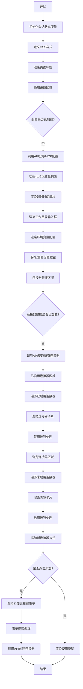
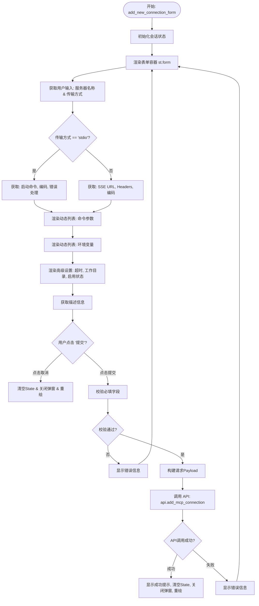
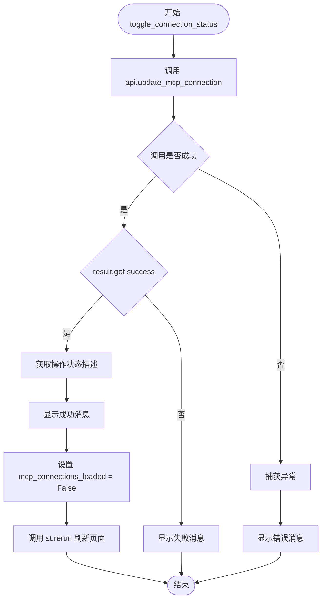
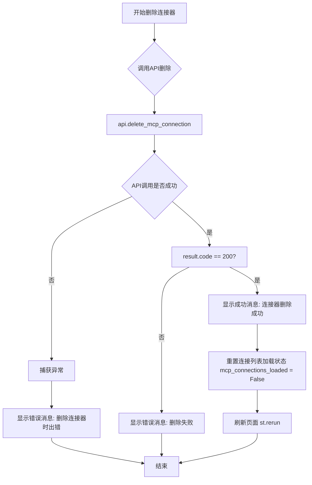

# `Langchain-Chatchat\libs\chatchat-server\chatchat\webui_pages\mcp\dialogue.py` 详细设计文档

该代码实现了一个基于Streamlit的MCP（Model Context Protocol）连接器管理界面，主要功能包括：加载并配置全局MCP参数（如超时、工作目录、环境变量）、管理已启用/禁用的连接器列表、添加新连接器（支持stdio和sse两种传输协议）以及通过API与后端进行数据交互。

## 整体流程

```mermaid
graph TD
    Start([页面加载]) --> InitState[初始化会话状态]
    InitState --> CheckProfileLoaded{检查 mcp_profile_loaded}
    CheckProfileLoaded -- False --> APIGetProfile[调用 api.get_mcp_profile 获取配置]
    APIGetProfile --> SetProfile[设置 st.session_state.mcp_profile]
    CheckProfileLoaded -- True --> CheckConnLoaded{检查 mcp_connections_loaded}
    CheckConnLoaded -- False --> APIGetConns[调用 api.get_all_mcp_connections 获取连接器列表]
    APIGetConns --> SetConns[设置 st.session_state.mcp_connections]
    CheckConnLoaded -- True --> RenderMain[渲染主界面]
    RenderMain --> SectionSettings[渲染通用设置区域 (Expander)]
    RenderMain --> SectionEnabled[渲染已启用连接器列表]
    RenderMain --> SectionBrowse[渲染浏览连接器列表 (Grid)]
    RenderMain --> CheckAdd[检查 show_add_conn 状态]
    CheckAdd -- True --> RenderForm[渲染 add_new_connection_form]
    CheckAdd -- False --> End([等待交互])
    SectionSettings --> ActionSave[点击保存设置]
    ActionSave --> APISave[调用 api.update_mcp_profile]
    APISave --> Rerun[st.rerun]
    SectionEnabled --> ActionToggle[点击禁用/启用按钮]
    ActionToggle --> APIToggle[调用 api.update_mcp_connection]
    APIToggle --> Rerun
    RenderForm --> ActionSubmit[提交新连接器表单]
    ActionSubmit --> APIAdd[调用 api.add_mcp_connection]
    APIAdd --> Rerun
```

## 类结构

```
mcp_management_page.py (文件模块)
├── mcp_management_page (主页面函数)
│   ├── 1. 状态初始化 (Init State)
│   ├── 2. CSS 样式注入 (st.markdown)
│   ├── 3. 通用设置 (通用设置 Expander)
│   │   └── 环境变量编辑 (Dynamic Form)
│   ├── 4. 已启用连接器 (连接器列表与状态切换)
│   ├── 5. 浏览连接器 (未启用连接器网格)
│   └── 6. 添加连接器 (弹窗表单逻辑)
├── add_new_connection_form (子组件：添加连接器表单)
│   ├── 传输协议选择 (stdio/sse)
│   ├── 参数与环境变量编辑
│   └── 提交处理逻辑
├── toggle_connection_status (辅助函数：切换连接器状态)
└── delete_connection (辅助函数：删除连接器)
```

## 全局变量及字段


### `st`
    
Streamlit框架主模块，用于构建数据应用Web界面

类型：`module`
    


### `sac`
    
Streamlit Ant Design Components组件库，提供增强的UI组件

类型：`module`
    


### `Settings`
    
ChatChat项目配置类，包含系统级设置和默认参数

类型：`class`
    


### `requests`
    
Python HTTP客户端库，用于发起网络请求

类型：`module`
    


### `json`
    
Python标准库模块，用于JSON数据的序列化和反序列化

类型：`module`
    


    

## 全局函数及方法


### `mcp_management_page`

MCP管理页面是Chatchat系统中用于管理Model Context Protocol（MCP）连接器的Web界面，提供连接器的配置、启用/禁用、添加和删除等完整生命周期管理功能，采用Streamlit框架结合超感官极简主义×液态数字形态主义设计风格实现。

参数：

- `api`：`ApiRequest`，API请求对象，负责与后端服务通信，获取/更新MCP配置和连接器数据
- `is_lite`：`bool`，可选参数，默认值为`False`，标识是否为轻量模式显示

返回值：`None`，该函数为Streamlit页面渲染函数，无返回值，直接在页面上渲染UI组件

#### 流程图



#### 带注释源码

```python
def mcp_management_page(api: ApiRequest, is_lite: bool = False):
    """
    MCP管理页面 - 连接器设置界面
    采用超感官极简主义×液态数字形态主义设计风格
    使用Streamlit语法实现
    """
    
    # ============================================================
    # 第一部分：会话状态初始化
    # ============================================================
    # 初始化MCP配置加载状态标志
    if 'mcp_profile_loaded' not in st.session_state:
        st.session_state.mcp_profile_loaded = False
    # 初始化MCP连接器加载状态标志
    if 'mcp_connections_loaded' not in st.session_state:
        st.session_state.mcp_connections_loaded = False
    # 初始化MCP连接器列表
    if 'mcp_connections' not in st.session_state:
        st.session_state.mcp_connections = []
    # 初始化MCP配置文件
    if 'mcp_profile' not in st.session_state:
        st.session_state.mcp_profile = {}
        
    # 初始化添加连接器弹窗显示状态
    if "show_add_conn" not in st.session_state:
        st.session_state.show_add_conn = False

    # ============================================================
    # 第二部分：CSS样式定义
    # ============================================================
    # 定义页面CSS变量和样式，包括：
    # - 主色调渐变（#4F46E5 到 #818CF8）
    # - 警告色渐变（#F59E0B 到 #FBBF24）
    # - 导航栏、卡片、连接器等UI组件样式
    st.markdown("""<style>...</style>""", unsafe_allow_html=True)
    
    # ============================================================
    # 第三部分：页面布局与标题
    # ============================================================
    with st.container():
        # 渲染页面主标题
        st.markdown('<h1 class="page-title">连接器管理</h1>', unsafe_allow_html=True)
        
        # ============================================================
        # 第四部分：通用设置区域
        # ============================================================
        with st.expander("⚙️ 通用设置", expanded=False): 
            
            # 加载当前配置（首次加载时从API获取）
            if not st.session_state.mcp_profile_loaded:
                try:
                    # 调用API获取MCP配置文件
                    profile_data = api.get_mcp_profile()
                    if profile_data:
                        st.session_state.mcp_profile = profile_data
                        # 从配置中提取环境变量并转换为列表格式
                        env_vars = st.session_state.mcp_profile.get("env_vars", {})
                        st.session_state.env_vars_list = [
                            {"key": k, "value": v} for k, v in env_vars.items()
                        ]
                        st.session_state.mcp_profile_loaded = True
                    else:
                        # 使用默认值初始化配置
                        st.session_state.mcp_profile = {
                            "timeout": 30,
                            "working_dir": str(Settings.CHATCHAT_ROOT),
                            "env_vars": {
                                "PATH": "/usr/local/bin:/usr/bin:/bin",
                                "PYTHONPATH": "/app",
                                "HOME": str(Settings.CHATCHAT_ROOT)
                            }
                        }
                        # 初始化默认环境变量列表
                        st.session_state.env_vars_list = [
                            {"key": "PATH", "value": "/usr/local/bin:/usr/bin:/bin"},
                            {"key": "PYTHONPATH", "value": "/app"},
                            {"key": "HOME", "value": str(Settings.CHATCHAT_ROOT)}
                        ]
                except Exception as e:
                    st.error(f"加载配置失败: {str(e)}")
                    return
            
            # 渲染超时时间滑块（10-300秒）
            timeout_value = st.slider(
                "默认连接超时时间（秒）",
                min_value=10,
                max_value=300,
                value=st.session_state.mcp_profile.get("timeout", 30),
                step=5,
                help="设置MCP连接器的默认超时时间，范围：10-300秒"
            )
            
            # 渲染工作目录输入框
            working_dir = st.text_input(
                "默认工作目录",
                value=st.session_state.mcp_profile.get("working_dir", str(Settings.CHATCHAT_ROOT)),
                help="设置MCP连接器的默认工作目录"
            )
            
            # 环境变量配置区域
            st.subheader("环境变量配置")
            st.write("添加环境变量键值对：")
            
            # 初始化环境变量列表（备用）
            if 'env_vars_list' not in st.session_state:
                st.session_state.env_vars_list = [
                    {"key": "PATH", "value": "/usr/local/bin:/usr/bin:/bin"},
                    {"key": "PYTHONPATH", "value": "/app"},
                    {"key": "HOME", "value": str(Settings.CHATCHAT_ROOT)}
                ]
            
            # 遍历并渲染现有环境变量（支持编辑和删除）
            for i, env_var in enumerate(st.session_state.env_vars_list):
                col1, col2, col3 = st.columns([2, 3, 1])
                
                with col1:
                    # 变量名输入框
                    key = st.text_input("变量名", value=env_var["key"], key=f"env_key_{i}", placeholder="例如：PATH")
                    env_var["key"] = key
                with col2:
                    # 变量值输入框
                    value = st.text_input("变量值", value=env_var["value"], key=f"env_value_{i}", placeholder="例如：/usr/bin")
                    env_var["value"] = value
                with col3:
                    # 删除按钮（点击后立即保存到数据库）
                    if st.button("🗑️", key=f"env_delete_{i}", help="删除此环境变量"):
                        st.session_state.env_vars_list.pop(i)
                        # 构建环境变量字典并调用API保存
                        env_vars_dict = {}
                        for env_var in st.session_state.env_vars_list:
                            if env_var["key"] and env_var["value"]:
                                env_vars_dict[env_var["key"]] = env_var["value"]
                        
                        result = api.update_mcp_profile(
                            timeout=timeout_value,
                            working_dir=working_dir,
                            env_vars=env_vars_dict
                        )
                        st.rerun()
            
            # 添加新环境变量按钮
            if st.button("➕ 添加环境变量", key="add_env_var"):
                st.session_state.env_vars_list.append({"key": "", "value": ""})
                st.rerun()
            
            # 显示当前环境变量预览（bash格式）
            if st.session_state.env_vars_list:
                st.markdown("### 当前环境变量")
                env_preview = {}
                for env_var in st.session_state.env_vars_list:
                    if env_var["key"] and env_var["value"]:
                        env_preview[env_var["key"]] = env_var["value"]
                
                st.code(
                    "\n".join([f'{k}="{v}"' for k, v in env_preview.items()]),
                    language="bash",
                    line_numbers=False
                )
            
            # 保存设置和重置默认按钮
            col1, col2 = st.columns([1, 2])
            
            with col1:
                if st.button("💾 保存设置", type="primary", use_container_width=True):
                    # 构建环境变量字典
                    env_vars_dict = {}
                    for env_var in st.session_state.env_vars_list:
                        if env_var["key"] and env_var["value"]:
                            env_vars_dict[env_var["key"]] = env_var["value"]
                    
                    # 调用API保存配置
                    result = api.update_mcp_profile(
                        timeout=timeout_value,
                        working_dir=working_dir,
                        env_vars=env_vars_dict
                    )
                    
                    if result:
                        st.success("通用设置已保存")
                        st.session_state.mcp_profile_loaded = False  # 标记需要重新加载
                    else:
                        st.error("保存失败，请检查配置")
            
            with col2:
                if st.button("🔄 重置默认", use_container_width=True):
                    try:
                        result = api.reset_mcp_profile()
                        if result and result.get("success"):
                            # 重置UI状态为默认值
                            st.session_state.env_vars_list = [
                                {"key": "PATH", "value": "/usr/local/bin:/usr/bin:/bin"},
                                {"key": "PYTHONPATH", "value": "/app"},
                                {"key": "HOME", "value": str(Settings.CHATCHAT_ROOT)}
                            ]
                            st.session_state.mcp_profile_loaded = False
                            st.rerun()
                    except Exception as e:
                        st.error(f"重置失败: {str(e)}")
             
        # ============================================================
        # 第五部分：连接器管理区域
        # ============================================================
        st.markdown('<h2 class="section-title">🔗 连接器管理</h2>', unsafe_allow_html=True)
        
        # 加载MCP连接数据
        if not st.session_state.mcp_connections_loaded:
            try:
                connections_data = api.get_all_mcp_connections()
                if connections_data:
                    st.session_state.mcp_connections = connections_data.get("connections", [])
                    st.session_state.mcp_connections_loaded = True
                else:
                    st.session_state.mcp_connections = []
            except Exception as e:
                st.error(f"加载连接器失败: {str(e)}")
                return
        
        # ============================================================
        # 第六部分：已启用连接器展示
        # ============================================================
        st.markdown('<h2 class="section-title">已启用连接器</h2>', unsafe_allow_html=True)
        
        # 筛选已启用的连接器
        enabled_connections = [conn for conn in st.session_state.mcp_connections if conn.get("enabled", False)]
        
        if enabled_connections:
            for connection in enabled_connections:
                # 根据传输类型确定图标颜色和标识
                icon_colors = {"stdio": "#111827", "sse": "linear-gradient(135deg, #8B5CF6 0%, #3B82F6 100%)"}
                transport = connection.get("transport", "stdio").lower()
                icon_letter = "S" if transport == "stdio" else "E"
                icon_bg = icon_colors.get("stdio") if transport == "stdio" else icon_colors.get("sse")
                
                # 渲染连接器卡片
                with st.container():
                    col1, col2, col3 = st.columns([3, 1, 1])
                    
                    with col1:
                        st.markdown(f"""
                            <div class="connector-card">
                                <div class="connector-content">
                                    <div class="connector-left">
                                        <div class="connector-icon" style="background: {icon_bg};">
                                            <span>{icon_letter}</span>
                                        </div>
                                        <div class="connector-info">
                                            <h3>{connection.get('server_name', '')}</h3>
                                            <p>{json.dumps(connection.get('config', {}), ensure_ascii=False, indent=2)}</p>
                                            <div class="status-indicator">
                                                <div class="status-dot" style="background: #6B7280;"></div>
                                                <span style="color: #6B7280; font-size: 12px; font-weight: 500;">连接</span>
                                            </div>
                                        </div>
                                    </div>
                                </div>
                            </div>
                        """, unsafe_allow_html=True)
                    
                    with col2:
                        # 禁用按钮
                        if st.button("🔄 禁用", key=f"toggle_disable_{connection.get('id', i)}", use_container_width=True):
                            toggle_connection_status(api, connection.get('id', i), False)
        else:
            st.info("暂无已启用的连接器")
        
        # ============================================================
        # 第七部分：浏览连接器（未启用）
        # ============================================================
        st.markdown('<h2 class="section-title">浏览连接器</h2>', unsafe_allow_html=True)
        
        # 筛选未启用的连接器
        disabled_connections = [conn for conn in st.session_state.mcp_connections if not conn.get("enabled", True)]
        
        if disabled_connections:
            cols = st.columns(3)
            
            for i, connection in enumerate(disabled_connections):
                with cols[i % 3]:
                    # 根据传输类型选择emoji图标
                    icon_emojis = {"stdio": "💻", "sse": "🌐"}
                    transport = connection.get("transport", "stdio").lower()
                    icon_emoji = icon_emojis.get(transport, "🔗")
                    
                    # 渲染浏览卡片
                    st.markdown(f"""
                        <div class="browse-card">
                            <div class="browse-icon" style="background: rgba(107, 114, 128, 0.1);">
                                <span style="color: #6B7280; font-size: 24px;">{icon_emoji}</span>
                            </div>
                            <h3>{connection.get('server_name', '')}</h3>
                        </div>
                    """, unsafe_allow_html=True)
                    
                    # 启用按钮
                    if st.button("🔄 启用", key=f"toggle_enable_{connection.get('id', i)}", use_container_width=True):
                        toggle_connection_status(api, connection.get('id', i), True)
        else:
            st.info("暂无其他连接器")
    
    # ============================================================
    # 第八部分：添加新连接器功能
    # ============================================================
    st.divider()
    st.subheader("连接器操作")
      
    # 添加新连接器按钮
    if st.button("➕ 添加新连接器", type="primary"):
        st.session_state.show_add_conn = True
        st.rerun()

    # 弹窗占位容器
    placeholder = st.empty()
    if st.session_state.show_add_conn:
        with placeholder.container():
            add_new_connection_form(api)     # 渲染添加连接器表单
    
    # ============================================================
    # 第九部分：使用说明
    # ============================================================
    st.divider()
    
    with st.expander("📖 使用说明", expanded=False):
        st.markdown("""
        ### 连接器管理
        **已启用连接器**：显示当前已配置并启用的连接器...
        **浏览连接器**：展示可用的连接器类型...
        **状态指示**：✅正常运行 / ⚠️设置未完成 / ❌连接失败
        **支持的连接器类型**：文档协作、代码托管、沟通工具、云存储、社交媒体
        """)
    
    # 页脚信息
    st.markdown("---")
    st.caption("💡 提示：连接器需要正确的API权限和网络访问才能正常工作")
```


### `add_new_connection_form`

该函数是Streamlit页面中用于添加新MCP（Model Context Protocol）连接器的弹窗表单组件。它提供了一个交互式UI界面，允许用户配置服务器名称、传输协议（STDIO或SSE）、启动命令、参数、环境变量以及超时等高级设置，并负责收集用户输入、进行前端校验，最终通过API客户端将配置持久化到后端。

参数：

-  `api`：`ApiRequest`，API请求客户端实例，用于调用后端接口（如 `api.add_mcp_connection`）保存连接配置。

返回值：`None`，该函数为UI渲染函数，不返回值，主要通过修改 `st.session_state` 和调用 `api` 方法与后端交互。

#### 流程图



#### 带注释源码

```python
def add_new_connection_form(api: "ApiRequest"):
    """
    添加新连接器的弹窗表单（修正版）
    - 统一使用 st.form 保证一次性提交
    - 健壮的 Session State 初始化
    - 根据 transport 显示不同必填项
    """
    import streamlit as st

    # ---- State 初始化 ----
    # 初始化命令参数列表，如果不存在则创建空列表
    if "connection_args" not in st.session_state:
        st.session_state.connection_args = []
    
    # 初始化环境变量列表，默认为全局配置中的环境变量列表
    if "connection_env_vars" not in st.session_state:
        st.session_state.connection_env_vars = st.session_state.env_vars_list or []

    # 渲染表单标题
    st.subheader("新连接器配置")

    # 使用 st.form 创建一次性提交表单，避免每次输入都重载
    with st.form("new_mcp_connection"):
        # ===== 基本信息 =====
        col1, col2 = st.columns(2)
        with col1:
            # 服务器名称输入
            server_name = st.text_input(
                "服务器名称 *",
                placeholder="例如：my-server",
                help="服务器的唯一标识符",
                key="conn_server_name",
            )
        with col2:
            # 传输方式选择：SSE 或 STDIO
            transport = st.selectbox(
                "传输方式 *",
                options=["sse", "stdio"],
                help="连接传输协议",
                key="conn_transport",
            )

        # ===== 启动命令 / SSE 配置 =====
        st.subheader("传输配置")
        
        # 根据传输类型动态渲染不同的输入字段
        if transport == "stdio":
            command = st.text_input(
                "启动命令 *",
                placeholder="例如：python -m mcp_server",
                help="启动 MCP 服务器的命令",
                key="conn_command",
            )
            
            # Stdio 特定配置
            st.subheader("Stdio 传输配置")
            encoding = st.selectbox(
                "文本编码",
                options=["utf-8", "gbk", "ascii", "latin-1"],
                index=0,
                help="文本编码格式",
                key="conn_encoding",
            )
            
            encoding_error_handler = st.selectbox(
                "编码错误处理",
                options=["strict", "ignore", "replace"],
                index=0,
                help="编码错误处理方式",
                key="conn_encoding_error_handler",
            )
        else:
            # SSE 模式配置
            sse_url = st.text_input(
                "SSE 服务器地址 *",
                placeholder="例如：https://example.com/mcp/sse",
                help="SSE 服务器的 URL",
                key="conn_sse_url",
            )
            
            # SSE 特定配置
            st.subheader("SSE 传输配置")
            
            # 可选：SSE 额外 header (JSON格式)
            sse_headers = st.text_area(
                "SSE Headers（可选，JSON）",
                placeholder='例如：{"Authorization":"Bearer xxx"}',
                help="以 JSON 形式填写可选的请求头",
                key="conn_sse_headers",
            )
            
            col_ti1, col_ti2 = st.columns(2)
            with col_ti1:
                sse_encoding_error_handler = st.selectbox(
                    "编码错误处理",
                    options=["strict", "ignore", "replace"],
                    index=0,
                    help="编码错误处理方式",
                    key="conn_sse_encoding_error_handler",
                )

            with col_ti2:
                # SSE 编码配置
                sse_encoding = st.selectbox(
                    "文本编码",
                    options=["utf-8", "gbk", "ascii", "latin-1"],
                    index=0,
                    help="文本编码格式",
                    key="conn_sse_encoding",
                )
            
        # ===== 命令参数（可选） =====
        st.write("命令参数（可选）：")
        # 遍历已添加的参数，允许用户编辑或删除
        for i, arg in enumerate(st.session_state.connection_args):
            col_arg, col_del = st.columns([4, 1])
            with col_arg:
                new_arg = st.text_input(
                    f"参数 {i+1}",
                    value=arg,
                    key=f"conn_arg_{i}",
                    placeholder="例如：--port=8080",
                )
                if new_arg != arg:
                    st.session_state.connection_args[i] = new_arg
            with col_del:
                # 注意：表单内的按钮也会触发表单提交，这里使用 form_submit_button 仅做状态修改
                if st.form_submit_button(f"🗑️ 删除_{i}", use_container_width=True):
                    st.session_state.connection_args.pop(i)
                    st.rerun()

        # 添加参数按钮（表单内）
        if st.form_submit_button("➕ 添加参数", use_container_width=False):
            st.session_state.connection_args.append("")
            st.rerun()

        # ===== 环境变量（可选） =====
        st.write("环境变量（可选）：")
        # 遍历已添加的环境变量
        for i, pair in enumerate(st.session_state.connection_env_vars):
            col_k, col_v, col_del = st.columns([3, 4, 1])
            with col_k:
                new_k = st.text_input(
                    f"键 {i+1}",
                    value=pair.get("key", ""),
                    key=f"env_k_{i}",
                    placeholder="例如：GITHUB_TOKEN",
                )
            with col_v:
                new_v = st.text_input(
                    f"值 {i+1}",
                    value=pair.get("value", ""),
                    key=f"env_v_{i}",
                    placeholder="例如：xxxxxx",
                    type="password", # 密码类型输入
                )
            with col_del:
                if st.form_submit_button(f"🗑️ 删ENV_{i}", use_container_width=True):
                    st.session_state.connection_env_vars.pop(i)
                    st.rerun()
            
            # 同步修改 Session State
            st.session_state.connection_env_vars[i] = {"key": new_k, "value": new_v}

        # 添加 ENV 按钮
        if st.form_submit_button("➕ 添加环境变量"):
            st.session_state.connection_env_vars.append({"key": "", "value": ""})
            st.rerun()

        # ===== 高级设置 =====
        with st.expander("高级设置", expanded=False):
            col_adv1, col_adv2 = st.columns(2)
            with col_adv1:
                timeout = st.number_input(
                    "连接超时（秒）",
                    min_value=10,
                    max_value=300,
                    value=st.session_state.mcp_profile.get("timeout", 30),
                    help="连接超时时间",
                    key="conn_timeout",
                )
                cwd = st.text_input(
                    "工作目录",
                    value=st.session_state.mcp_profile.get("working_dir", str(Settings.CHATCHAT_ROOT)),
                    placeholder="/tmp",
                    help="服务器运行的工作目录",
                    key="conn_cwd",
                )
            with col_adv2:
                enabled = st.checkbox(
                    "启用连接器",
                    value=False,
                    help="是否启用此连接器",
                    key="conn_enabled",
                )

        # ===== 描述信息 =====
        description = st.text_area(
            "连接器描述",
            placeholder="描述此连接器的用途和配置...",
            help="可选的连接器描述信息",
            key="conn_description",
        )

        # ===== 提交/取消 =====
        col_submit, col_cancel = st.columns([1, 1])
        with col_submit:
            submitted = st.form_submit_button("💾 创建连接器", type="primary", use_container_width=True)
        with col_cancel:
            cancel_clicked = st.form_submit_button("❌ 取消", use_container_width=True)

        # ----- 提交处理 -----
        # 处理取消逻辑
        if cancel_clicked:
            # 清理状态并刷新
            st.session_state.connection_args = []
            st.session_state.connection_env_vars = []
            st.session_state.show_add_conn = False
            st.rerun()

        # 处理提交逻辑
        if submitted:
            # 1. 前端校验
            errors = []
            if not server_name:
                errors.append("服务器名称")

            if transport == "stdio":
                if not command:
                    errors.append("启动命令（stdio）")
            else:
                if not sse_url:
                    errors.append("SSE 服务器地址")

            if errors:
                st.error("请填写所有必填字段（*）：" + "、".join(errors))
                return

            # 2. 处理环境变量数据
            env_vars_dict = {}
            for env_var in st.session_state.connection_env_vars:
                k = (env_var.get("key") or "").strip()
                v = (env_var.get("value") or "").strip()
                if k and v:
                    env_vars_dict[k] = v

            # 3. 组装 API 参数
            # 通用配置
            payload = dict(
                server_name=server_name,
                args=st.session_state.connection_args,
                env=env_vars_dict,
                cwd=cwd or "",
                transport=transport,
                timeout=timeout,               
                enabled=bool(enabled),
                description=description or None,
                config={},                     # 预留config字典
            )

            # 传输协议特定配置
            if transport == "stdio":
                # STDIO模式下，command是核心，存入config
                payload["config"]["command"] = command
                payload["config"]["encoding"] = encoding
                payload["config"]["encoding_error_handler"] = encoding_error_handler
            else:
                # SSE模式下，URL是核心
                payload["config"]["url"] = sse_url
                # 解析Headers JSON
                if sse_headers:
                    import json
                    try:
                        payload["config"]["headers"] = json.loads(sse_headers)
                    except Exception as e:
                        st.error(f"sse_headers出错：{e}")
                else:
                    payload["config"]["headers"] = None
                
                # SSE 编码配置
                payload["config"]["encoding"] = sse_encoding
                payload["config"]["encoding_error_handler"] = sse_encoding_error_handler

            # 4. 调用后端API
            try:
                result = api.add_mcp_connection(**payload)
                
                # 5. 处理返回结果
                if result:
                    st.success("连接器创建成功！")
                    # 清理并刷新列表
                    st.session_state.connection_args = []
                    st.session_state.connection_env_vars = []
                    st.session_state.mcp_connections_loaded = False
                    st.session_state.show_add_conn = False
                    st.rerun()
                else:
                    # 提取错误信息
                    err_msg = getattr(result,'msg', None) or (result.get('msg') if isinstance(result, dict) else '未知错误')
                    st.error(f"创建失败：{err_msg}")
            except Exception as e:
                st.error(f"创建连接器时出错：{e}")
```


### `toggle_connection_status`

切换指定连接器的启用/禁用状态，通过调用后端 API 更新连接器配置，并根据操作结果刷新页面状态。

参数：

- `api`：`ApiRequest`，API 请求对象，用于调用后端接口更新连接器状态
- `connection_id`：`str`，连接器的唯一标识 ID
- `enabled`：`bool`，目标状态，True 表示启用，False 表示禁用

返回值：`None`，无返回值，通过 Streamlit 的 `st.success` 或 `st.error` 展示操作结果

#### 流程图



#### 带注释源码

```python
def toggle_connection_status(api: ApiRequest, connection_id: str, enabled: bool):
    """
    切换连接器启用/禁用状态
    
    Args:
        api: API 请求对象，用于调用后端接口
        connection_id: 连接器的唯一标识 ID
        enabled: 目标状态，True 为启用，False 为禁用
    
    Returns:
        None，通过 Streamlit 组件展示结果
    """
    try:
        # 调用后端 API 更新连接器的启用状态
        result = api.update_mcp_connection(connection_id=connection_id, enabled=enabled)
        
        # 检查 API 返回结果
        if result and result.get("success"):
            # 根据 enabled 参数生成状态描述文字
            status = "启用" if enabled else "禁用"
            
            # 显示操作成功的提示信息
            st.success(f"连接器{status}成功！")
            
            # 标记连接列表需要重新加载
            st.session_state.mcp_connections_loaded = False
            
            # 重新运行 Streamlit 脚本以刷新页面显示最新数据
            st.rerun()
        else:
            # API 返回 success=False 的情况
            status = "启用" if enabled else "禁用"
            
            # 从返回结果中提取错误消息，默认为"未知错误"
            st.error(f"{status}失败：{result.get('message', '未知错误')}")
            
    except Exception as e:
        # 捕获网络异常、接口不存在等其他错误
        status = "启用" if enabled else "禁用"
        
        # 显示异常信息帮助调试
        st.error(f"{status}连接器时出错：{str(e)}")
```


### `delete_connection`

该函数用于删除指定ID的MCP连接器，调用后端API执行删除操作，并根据返回结果更新前端界面状态。

参数：

- `api`：`ApiRequest`，用于调用后端API的接口对象
- `connection_id`：`str`，要删除的连接器的唯一标识符

返回值：`None`，该函数通过Streamlit的UI组件（成功/错误消息）向用户展示操作结果，不返回具体数值

#### 流程图



#### 带注释源码

```python
def delete_connection(api: ApiRequest, connection_id: str):
    """
    删除连接器
    
    Args:
        api: ApiRequest实例，用于调用后端API
        connection_id: str，要删除的连接器的唯一标识符
    
    Returns:
        None: 通过Streamlit UI组件展示结果
    """
    # 使用try-except捕获可能发生的异常
    try:
        # 调用API的删除方法，传入连接器ID
        result = api.delete_mcp_connection(connection_id=connection_id)
        
        # 判断API调用是否成功且返回状态码为200
        if result and result.get("code") == 200:
            # 展示成功消息给用户
            st.success("连接器删除成功！")
            
            # 重置连接列表的加载状态标志
            # 设为False以确保下次加载时重新获取最新数据
            st.session_state.mcp_connections_loaded = False
            
            # 刷新Streamlit页面以更新UI显示
            st.rerun()
        else:
            # API返回失败，提取错误消息并展示
            # 使用get方法提供默认值'未知错误'防止KeyError
            error_msg = result.get('msg', '未知错误') if result else '未知错误'
            st.error(f"删除失败：{error_msg}")
            
    except Exception as e:
        # 捕获所有异常（网络错误、连接超时等）
        # 展示通用的错误消息，包含具体异常信息
        st.error(f"删除连接器时出错：{str(e)}")
```

## 关键组件


### MCP连接器管理界面

MCP（Model Context Protocol）连接器的Web管理界面，提供连接器的配置、启用/禁用、添加、删除等生命周期管理功能，支持stdio和SSE两种传输协议。

### 通用配置管理

全局设置模块，管理MCP连接器的通用参数，包括默认超时时间（10-300秒）、默认工作目录、以及环境变量键值对配置，支持动态添加/删除环境变量并实时预览。

### 传输协议支持

支持两种MCP连接传输方式：stdio（标准输入输出）和SSE（Server-Sent Events），每种传输方式具有独立的配置参数，包括文本编码（utf-8/gbk/ascii/latin-1）和编码错误处理策略（strict/ignore/replace）。

### 会话状态管理

使用Streamlit Session State进行状态持久化，包括配置加载标志（mcp_profile_loaded、mcp_connections_loaded）、配置数据（mcp_profile、mcp_connections）、环境变量列表（env_vars_list）、连接器参数（connection_args）、连接器环境变量（connection_env_vars）、以及UI状态标志（show_add_conn）。

### 连接器卡片组件

自定义CSS样式的连接器展示卡片，包括图标（根据传输类型显示S或E，或使用emoji）、服务器名称、配置JSON预览、状态指示器（带脉冲动画），支持悬停交互效果和响应式布局。

### 表单验证与错误处理

添加连接器时的必填字段验证，根据传输类型动态检查不同必填项（stdio需要启动命令，SSE需要服务器URL），并提供详细的错误提示信息。

### API交互层

通过ApiRequest对象与后端交互，调用get_mcp_profile获取配置、update_mcp_profile保存设置、get_all_mcp_connections获取连接列表、add_mcp_connection创建连接器、update_mcp_connection修改状态、delete_mcp_connection删除连接器。

### 动态表单构建

根据选择的传输协议动态显示相应配置项，stdio模式显示启动命令输入框，SSE模式显示URL和Headers配置，支持运行时添加/删除命令参数和环境变量。

## 问题及建议


### 已知问题

-   **变量作用域错误**：在显示已启用连接器的循环中使用了变量 `i`（`connection.get('id', i)`），但 `i` 未在该作用域定义，会导致 `NameError`
-   **未使用的函数**：`delete_connection` 函数被定义但在整个代码中未被调用，属于死代码
-   **函数调用位置错误**：`toggle_connection_status` 函数定义在 `mcp_management_page` 外部，但页面内的按钮直接调用它，可能因作用域或导入问题导致运行时错误；且调用后未执行 `st.rerun()` 刷新页面状态
-   **重复的 session_state 初始化**：`env_vars_list` 在两处被初始化（全局和通用设置内），代码重复且可能导致状态不一致
-   **API 调用冗余**：环境变量删除操作中，每次删除后立即调用 `api.update_mcp_profile` 保存，这种实时保存逻辑在批量操作时效率低下
-   **硬编码的默认值**：图标颜色、传输类型映射等配置硬编码在函数内部，扩展性差
-   **异常处理不完善**：多处 `except Exception as e` 捕获所有异常，缺乏具体错误类型的针对性处理

### 优化建议

-   **修复变量作用域**：将 `i` 定义为循环索引，或直接使用 `connection.get('id')` 作为 key
-   **移除死代码**：删除未使用的 `delete_connection` 函数，或在 UI 中添加删除按钮使其被调用
-   **统一状态管理**：将 `toggle_connection_status` 的调用结果处理（`st.rerun()`）移入函数内部，或重构为回调函数模式
-   **提取配置常量**：将图标颜色、传输类型映射等配置抽取为模块级常量或配置文件
-   **批量保存机制**：环境变量编辑改用"修改后统一保存"模式，而非每次删除/修改都触发 API 调用
-   **增强错误处理**：针对不同异常类型（如网络超时、权限错误）提供差异化提示信息
-   **代码复用**：将重复的 session_state 初始化逻辑封装为工具函数

## 其它


### 设计目标与约束

**设计目标：**
- 提供可视化的MCP连接器管理界面，支持stdio和SSE两种传输协议
- 实现连接器的启用/禁用、添加、删除等完整生命周期管理
- 支持全局超时、工作目录、环境变量等通用配置
- 采用超感官极简主义×液态数字形态主义设计风格

**技术约束：**
- 基于Streamlit框架实现，需遵循Streamlit的页面刷新机制
- 依赖chatchat项目的ApiRequest接口进行后端通信
- 仅支持Chrome、Firefox等现代浏览器
- 页面响应式设计，支持移动端浏览

### 错误处理与异常设计

**前端错误处理：**
- API调用使用try-except包裹，捕获网络异常后显示错误提示
- 配置文件加载失败时使用默认配置并提示用户
- 表单提交前进行必填字段校验
- JSON解析异常单独捕获并提示用户格式错误

**异常分类：**
- `NetworkError`：网络连接失败或超时
- `ValidationError`：用户输入验证失败
- `ApiError`：后端API返回错误码
- `ParseError`：JSON解析异常
- `StateError`：会话状态管理异常

**错误提示策略：**
- 使用st.error显示错误信息
- 使用st.warning显示警告信息
- 使用st.info显示提示信息

### 数据流与状态机

**页面状态流转：**
```
初始化 → 加载配置 → 显示页面 → 用户操作 → 状态更新 → 重新渲染
     ↓
配置加载失败 → 使用默认配置 → 继续运行
     ↓
API调用失败 → 显示错误 → 等待重试
```

**会话状态管理：**
- `mcp_profile_loaded`：配置文件加载标志
- `mcp_connections_loaded`：连接器列表加载标志
- `mcp_connections`：连接器数据列表
- `mcp_profile`：全局配置文件
- `show_add_conn`：新增连接器弹窗显示标志
- `env_vars_list`：环境变量键值对列表
- `connection_args`：新连接器命令参数
- `connection_env_vars`：新连接器环境变量

**数据更新时机：**
- 页面首次加载时拉取配置和连接器列表
- 保存设置后重新加载配置
- 添加/删除/切换连接器后刷新列表
- 任何修改后使用st.rerun()触发页面刷新

### 外部依赖与接口契约

**依赖库：**
- `streamlit`：页面框架
- `streamlit_antd_components`：UI组件库
- `chatchat.webui_pages.utils`：工具函数
- `chatchat.settings`：项目配置
- `requests`：HTTP请求（间接使用）
- `json`：数据序列化

**API接口契约：**
- `api.get_mcp_profile()`：获取MCP全局配置，返回包含timeout、working_dir、env_vars的字典
- `api.update_mcp_profile(timeout, working_dir, env_vars)`：更新全局配置
- `api.reset_mcp_profile()`：重置为默认配置
- `api.get_all_mcp_connections()`：获取所有连接器，返回{"connections": [...]}格式
- `api.add_mcp_connection(**payload)`：创建新连接器
- `api.update_mcp_connection(connection_id, enabled)`：更新连接器状态
- `api.delete_mcp_connection(connection_id)`：删除连接器

**数据模型：**
- 连接器：{id, server_name, transport, config, enabled, description, args, env, cwd, timeout}
- 配置文件：{timeout, working_dir, env_vars}
- 环境变量：{key, value}

### 性能与优化

**当前实现问题：**
- 每次删除环境变量都触发API保存操作
- 页面状态更新频繁使用st.rerun()，可能导致闪烁
- 未实现连接器列表的缓存机制
- 未实现API请求的重试逻辑

**优化建议：**
- 添加防抖机制，减少API调用频率
- 实现连接器列表的本地缓存
- 添加批量操作支持
- 考虑使用Streamlit的st.fragment减少全页面刷新

### 安全考虑

**当前实现：**
- 环境变量值支持password类型输入
- API异常信息适当暴露给前端

**安全风险：**
- API密钥等敏感信息可能在前端残留
- 未实现CSRF防护机制
- 未实现请求签名或token验证

**改进建议：**
- 敏感配置使用专门的加密存储
- 添加请求超时保护
- 实现操作日志审计

### 用户交互设计

**交互流程：**
- 通用设置通过expander折叠，默认收起
- 连接器卡片支持点击交互
- 表单使用st.form保证原子性提交
- 删除操作直接触发状态更新

**用户体验问题：**
- 删除环境变量时立即保存，可能导致误操作
- 页面加载状态无明显loading指示
- 错误信息可能遮挡关键操作区域
- 移动端适配部分CSS可能失效

### 部署与运维

**配置要求：**
- 需要配置CHATCHAT_ROOT环境变量
- 需要后端API服务正常运行
- 需要浏览器支持JavaScript

**监控建议：**
- 添加API调用成功率监控
- 记录用户配置修改日志
- 监控连接器启用/禁用频率

### 测试建议

**单元测试：**
- 各种API接口的mock测试
- 会话状态初始化逻辑测试
- 表单验证逻辑测试

**集成测试：**
- 完整的新增连接器流程测试
- 配置保存和加载测试
- 错误场景下的用户体验测试

**端到端测试：**
- 跨浏览器的UI一致性测试
- 响应式布局测试
- 网络异常场景下的容错测试

    