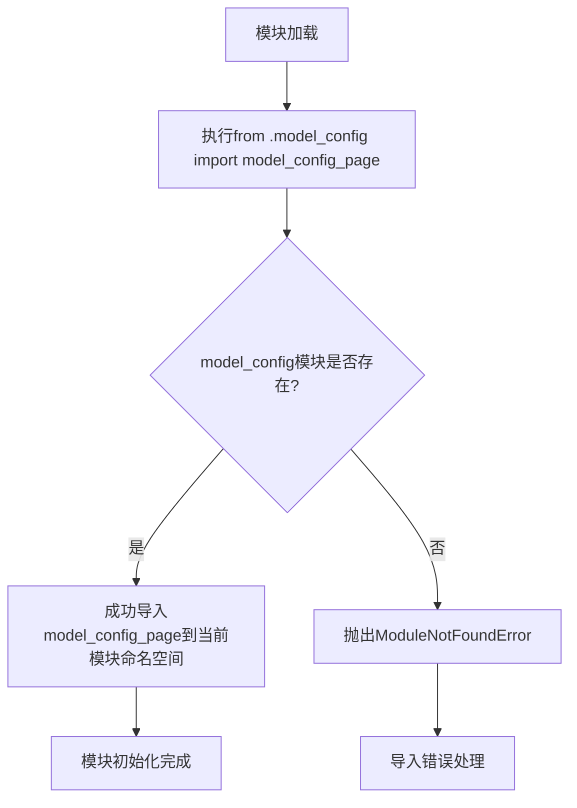

# `Langchain-Chatchat\libs\chatchat-server\chatchat\webui_pages\model_config\__init__.py` 详细设计文档

这是一个模型配置页面模块的导入文件，主要用于从同目录的model_config模块中导入model_config_page配置对象或函数，实现模块化配置管理。

## 整体流程



## 类结构

```
项目根目录
├── model_page.py (当前文件)
└── model_config.py (依赖模块)
```

## 全局变量及字段


### `model_config_page`
    
从同包model_config模块导入的变量或函数，具体类型取决于model_config模块中的定义

类型：`unknown (imported from model_config module)`
    


    

## 全局函数及方法


## 关键组件


### 模块导入组件

该代码文件是一个简单的Python模块导入语句，其核心功能是从同目录下的 `model_config` 模块中导入 `model_config_page` 对象，这是模块化代码组织中的基础导入机制。

### 文件运行流程

该文件作为模块入口点或子模块，通过相对导入方式（`.`表示同目录）从 `model_config` 模块中获取 `model_config_page` 对象，使其可被其他模块导入使用。

### 全局变量/导入项详情

| 名称 | 类型 | 描述 |
|------|------|------|
| model_config_page | 未知（需查看model_config模块） | 从model_config模块导入的页面配置对象 |

### 潜在技术债务与优化空间

1. **信息不足**：由于仅提供导入语句，无法对 `model_config_page` 的实际功能、类型和使用方式进行详细分析
2. **依赖隐式**：缺少对该导入依赖的文档说明，建议添加模块级docstring描述导入目的

### 其它说明

- **设计目标**：遵循Python模块化设计原则，使用相对导入保持包内模块间的依赖关系
- **接口契约**：依赖于 `model_config` 模块的存在和其中 `model_config_page` 的导出
- **建议**：如需完整分析，建议同时提供 `model_config.py` 的源代码内容


## 问题及建议


### 已知问题

-   **代码片段不完整**：该文件仅包含一个导入语句，缺少实际的业务逻辑实现，无法进行完整的功能分析
-   **缺少模块文档**：未提供模块级文档字符串（docstring），无法了解该模块的设计意图和功能定位
-   **命名规范不明确**：无法确认 `model_config_page` 的命名是否符合项目规范（如驼峰命名或下划线命名）
-   **潜在的循环导入风险**：使用相对导入（`.model_config`），若被导入模块存在反向导入，可能导致循环依赖
-   **无错误处理机制**：导入语句未包含任何异常捕获逻辑，若 `model_config_page` 不存在或导入失败，会直接抛出 `ModuleNotFoundError` 或 `ImportError`
-   **缺少类型注解**：未使用类型提示（type hints），降低代码的可读性和静态检查工具的效能

### 优化建议

-   **补充模块功能**：根据业务需求，在该文件中添加具体的业务逻辑实现，而非仅作为中转站
-   **添加文档字符串**：为模块编写清晰的文档，说明其职责和公共接口
-   **显式导出声明**：建议在模块中添加 `__all__` 列表，明确公开的API接口
-   **考虑延迟导入**：若 `model_config_page` 非必须立即使用，可采用延迟导入（lazy import）以优化启动性能
-   **添加类型注解**：为导入的 `model_config_page` 添加类型提示，或使用 `from __future__ import annotations`
-   **异常处理包装**：对导入语句添加 `try-except` 包装，提供更友好的错误信息
-   **依赖解耦**：评估是否可改为依赖注入（Dependency Injection）方式，降低模块间耦合度


## 其它


### 设计目标与约束

本模块作为配置页面的导入入口，遵循Python模块化设计原则，通过相对导入方式获取model_config_page配置对象。设计目标为提供轻量级的配置访问机制，约束为仅支持模块级导入，不包含运行时动态加载能力。

### 错误处理与异常设计

由于代码仅包含导入语句，错误处理主要依赖于Python的导入机制。当model_config模块不存在或model_config_page未定义时，Python解释器将抛出ImportError或AttributeError。建议调用方使用try-except块捕获导入异常，确保程序健壮性。

### 外部依赖与接口契约

外部依赖为同目录下的model_config模块。该模块需定义model_config_page对象，对象类型取决于具体实现（可能为字典、类实例或配置对象）。接口契约要求model_config_page必须可被导入且具有有效的配置属性。

### 测试策略建议

由于代码仅为导入语句，测试重点应放在：
1. 验证model_config模块可正常导入
2. 验证model_config_page对象存在且类型正确
3. 验证相对导入路径正确性
4. 模拟ImportError场景测试异常处理

### 性能考虑

当前实现无性能开销，仅在模块加载时执行一次导入操作。model_config_page对象应为模块级缓存，避免重复初始化开销。

### 版本兼容性

使用相对导入语法（from .module import name）要求Python 3版本，支持Python 3.0+。不兼容Python 2.x系列。

### 模块职责

单一职责：作为model_config模块的导入桥接层，隐藏具体配置实现细节，为上层代码提供统一的配置访问入口。

### 部署与环境

本模块为项目内部模块，无特殊部署要求。依赖项为Python标准库，无需额外第三方包。适用于任何支持Python 3的运行环境。


    