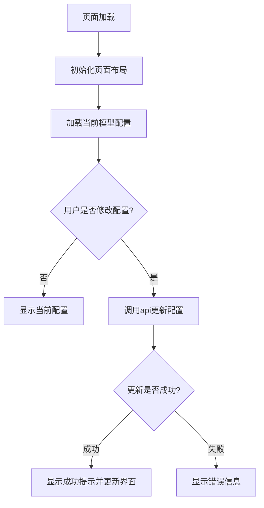
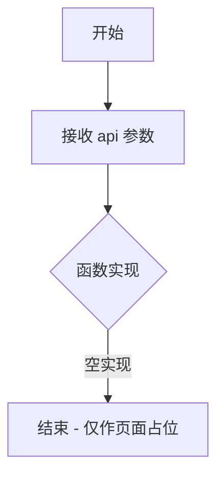
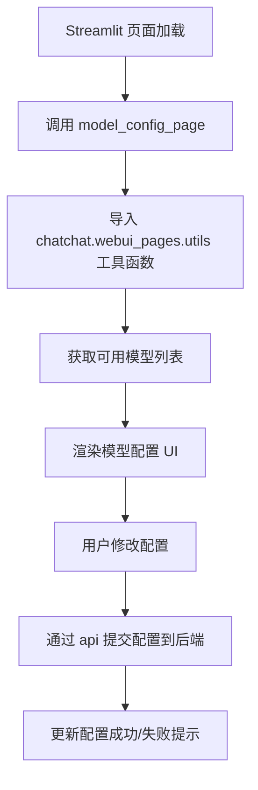

# `Langchain-Chatchat\libs\chatchat-server\chatchat\webui_pages\model_config\model_config.py` 详细设计文档

这是一个Streamlit页面模块，用于在Web界面上配置模型参数，通过ApiRequest对象与后端API交互。

## 整体流程



## 类结构

```
模块: model_config_page
└── 函数: model_config_page(api: ApiRequest)
```

## 全局变量及字段


    

## 全局函数及方法


### `model_config_page`

该函数是一个 Streamlit 页面渲染函数，用于在 ChatChat WebUI 中显示模型配置页面，接受 ApiRequest 对象作为参数以执行后端 API 调用，当前函数体为空实现（pass）。

参数：

- `api`：`ApiRequest`，API 请求对象，用于与后端服务通信以获取或提交模型配置数据

返回值：`None`，该函数无返回值，仅作为页面渲染入口

#### 流程图



#### 带注释源码

```python
import streamlit as st  # 导入 Streamlit 框架，用于构建 Web UI
from chatchat.webui_pages.utils import *  # 导入页面工具函数


def model_config_page(api: ApiRequest):
    """
    模型配置页面渲染函数
    
    参数:
        api: ApiRequest 对象，用于向后端发送 API 请求
    
    返回值:
        无返回值 (None)
    
    注意:
        当前函数体为 pass，是空实现
        需根据实际业务需求填充页面渲染逻辑
    """
    pass  # TODO: 实现模型配置页面的 UI 和交互逻辑
```

---

### 补充说明

| 项目 | 说明 |
|------|------|
| **函数类型** | Streamlit 页面函数 |
| **当前状态** | 空实现（占位符） |
| **设计目标** | 提供模型参数配置的 Web 界面 |
| **外部依赖** | `streamlit`、`chatchat.webui_pages.utils`、`ApiRequest` 类 |
| **技术债务** | 函数体完全为空，需要从头实现页面逻辑 |
| **优化建议** | 需要补充页面布局、表单控件、API 交互逻辑 |

## 关键组件


## 核心功能概述
该代码定义了一个用于模型配置页面的 Streamlit 页面函数 `model_config_page`，接受 `ApiRequest` 类型的 API 对象作为参数，目前为占位实现（pass），用于在 ChatChat WebUI 中展示和配置 AI 模型的参数设置页面。

## 整体运行流程
1. 页面函数被 Streamlit 框架调用
2. 接收 `ApiRequest` 对象作为 API 通信接口
3. 内部调用 `chatchat.webui_pages.utils` 中的工具函数获取模型配置项
4. 渲染模型配置的 Web UI 界面
5. 用户提交配置后通过 API 对象提交到后端

## 类详细信息
该代码文件中无类定义，仅包含一个模块级函数。

## 函数详细信息

### model_config_page

**参数：**
| 参数名 | 类型 | 描述 |
|--------|------|------|
| api | ApiRequest | API 请求对象，用于与后端服务通信 |

**返回值：**
| 类型 | 描述 |
|------|------|
| None | 无返回值，仅渲染页面 |

**Mermaid 流程图：**


**源码：**
```python
import streamlit as st
# 导入 ChatChat WebUI 页面工具函数模块
from chatchat.webui_pages.utils import *


def model_config_page(api: ApiRequest):
    """
    模型配置页面主函数
    
    Args:
        api: ApiRequest 实例，用于与后端 API 通信
        
    Returns:
        None
    """
    pass
```

## 关键组件信息

### ApiRequest
API 通信接口类，负责前后端数据交互

### chatchat.webui_pages.utils
WebUI 页面工具函数模块，提供页面渲染和数据处理辅助函数

### model_config_page
模型配置页面入口函数，负责渲染模型参数配置界面

## 潜在技术债务或优化空间

1. **空实现占位符**：`model_config_page` 函数体为 `pass`，无实际功能实现，需后续补充完整的模型配置逻辑
2. **类型注解不完整**：仅标注了参数类型 `ApiRequest`，但未验证该类型是否正确导入
3. **缺少错误处理**：函数未包含任何异常捕获和处理机制
4. **静态导入通配符**：使用 `from ... import *` 导入，建议明确列出所需函数以提高可读性和可维护性

## 其它项目

### 设计目标与约束
- 目标：在 Streamlit WebUI 中提供模型参数配置界面
- 约束：需与 `ApiRequest` API 对象解耦，支持前端页面动态渲染

### 错误处理与异常设计
- 当前代码无异常处理设计
- 建议：添加 API 请求超时异常、配置验证失败异常的处理

### 数据流与状态机
- 用户访问页面 → 获取模型列表 → 渲染配置表单 → 用户提交 → API 同步配置

### 外部依赖与接口契约
- 依赖 `streamlit` 框架进行页面渲染
- 依赖 `chatchat.webui_pages.utils` 工具模块
- 依赖 `ApiRequest` 类与后端通信


## 问题及建议


### 已知问题

-   **空函数实现**: `model_config_page` 函数体仅包含 `pass`，没有任何实际功能实现，函数形同虚设
-   **不明确的导入**: 使用 `from chatchat.webui_pages.utils import *` 导入，不清楚具体导入了哪些符号，代码可读性和可维护性差
-   **缺失类型定义**: 参数类型 `ApiRequest` 未在本文件中定义或导入，依赖外部模块
-   **缺少文档字符串**: 函数没有任何文档说明其用途、参数和返回值
-   **无错误处理**: 函数未实现任何逻辑，但若后续添加功能，可能需要添加异常处理
-   **streamlit 页面规范缺失**: 作为 webui 页面函数，未包含任何 streamlit 组件（如 st.title、st.sidebar 等）

### 优化建议

-   **完成函数实现**: 根据业务需求完善 `model_config_page` 的具体功能，如模型配置表单、参数设置等
-   **显式导入**: 将 `from chatchat.webui_pages.utils import *` 改为显式导入，如 `from chatchat.webui_pages.utils import func1, func2`
-   **添加类型定义**: 确认 `ApiRequest` 的来源并添加类型注解，或在文件中添加类型导入说明
-   **添加文档字符串**: 为函数添加 docstring，说明函数功能、参数和返回值
-   **添加 streamlit 组件**: 补充页面 UI 元素，如使用 st.container、st.form 等组织配置界面
-   **错误处理**: 添加 try-except 块处理可能的异常情况
-   **代码分离**: 考虑将配置逻辑拆分到独立的配置类或模块中，提高代码复用性


## 其它


### 设计目标与约束

该模块作为Streamlit Web界面的模型配置页面，旨在为用户提供模型参数配置功能。设计约束包括：依赖Streamlit框架进行UI渲染，仅支持同步调用ApiRequest接口，页面应在500ms内完成加载，遵循chatchat项目的模块导入规范。

### 错误处理与异常设计

由于函数体为pass，当前无错误处理逻辑。未来实现时应考虑：ApiRequest参数为空或类型不匹配时抛出TypeError并显示友好提示；API请求超时应捕获requests.exceptions.Timeout并提示用户重试；网络异常应捕获requests.exceptions.RequestException并记录日志；页面加载异常应使用try-except块包装核心逻辑并显示st.error错误信息。

### 数据流与状态机

该页面作为单一状态节点，接收ApiRequest对象作为输入，输出模型配置表单界面。数据流向：用户访问页面 → 加载当前模型配置 → 用户修改参数 → 点击保存 → 调用ApiRequest更新配置 → 刷新页面显示新配置。状态转换：INIT(初始加载) → EDIT(编辑中) → SAVING(保存中) → COMPLETE(完成) 或 ERROR(错误)。

### 外部依赖与接口契约

依赖streamlit>=1.28.0用于Web界面渲染；依赖chatchat.webui_pages.utils模块提供工具函数；依赖ApiRequest类进行后端通信。接口契约：model_config_page(api: ApiRequest) -> None，api参数必须为ApiRequest实例且已初始化，函数无返回值，通过Streamlit组件直接渲染UI。

### 性能考虑与资源限制

当前空实现无性能考量。未来实现时应注意：避免在每次页面刷新时重复调用API获取配置，可使用st.session_state缓存；表单组件使用st.form减少重渲染；大列表配置项应实现虚拟滚动或分页；页面加载时应显示st.spinner加载指示器。

### 安全与权限设计

该页面用于模型配置，应仅对管理员角色开放。需在函数开头添加权限检查逻辑，验证当前用户是否有配置权限。敏感配置项如API密钥应使用st.secrets管理，不在前端明文显示。

### 可测试性设计

当前pass函数无法测试。未来实现时应将业务逻辑提取至独立函数，接受配置参数而非直接操作Streamlit组件，便于单元测试；ApiRequest应作为可mock的参数注入；关键分支路径应有对应的测试用例覆盖。

### 配置管理

页面中涉及的模型配置项应定义配置schema，明确每项的类型、默认值、取值范围和校验规则。配置变更应记录审计日志，包括变更时间、操作用户和变更内容。


    