# `Langchain-Chatchat\libs\chatchat-server\chatchat\webui_pages\utils.py` 详细设计文档

该文件封装了对后端api.py服务的HTTP请求，提供同步(ApiRequest)和异步(AsyncApiRequest)两种调用方式，支持对话、知识库管理、工具调用、MCP连接管理等核心功能的API封装，并包含流式响应处理和错误重试机制。

## 整体流程

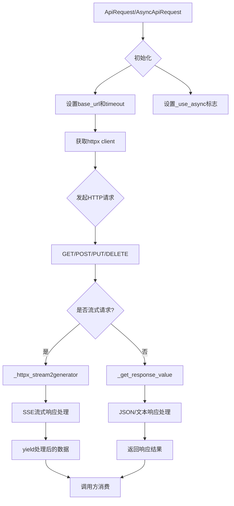

## 类结构

```
ApiRequest (同步API请求封装基类)
└── AsyncApiRequest (异步API请求封装类，继承自ApiRequest)
```

## 全局变量及字段


### `logger`
    
日志记录器实例，用于记录API请求过程中的错误和信息

类型：`logging.Logger`
    


### `check_error_msg`
    
检查API响应是否包含错误信息，并返回错误消息

类型：`Callable[[Union[str, dict, list], str], str]`
    


### `check_success_msg`
    
检查API响应是否成功（code==200），并返回消息内容

类型：`Callable[[Union[str, dict, list], str], str]`
    


### `get_img_base64`
    
根据文件名获取图片的Base64编码字符串，用于streamlit显示

类型：`Callable[[str], str]`
    


### `ApiRequest.base_url`
    
API服务器基础地址

类型：`str`
    


### `ApiRequest.timeout`
    
HTTP请求超时时间

类型：`float`
    


### `ApiRequest._use_async`
    
是否使用异步模式标志

类型：`bool`
    


### `ApiRequest._client`
    
httpx客户端实例，用于发送HTTP请求

类型：`httpx.Client/httpx.AsyncClient`
    
    

## 全局函数及方法


### `check_error_msg`

检查API响应数据中是否存在错误消息，并返回相应的错误信息。该函数主要用于验证API调用是否成功，当API返回错误时提取错误消息供调用方使用。

参数：

- `data`：`Union[str, dict, list]`，API响应数据，可以是字符串、字典或列表类型
- `key`：`str = "errorMsg"`，错误消息的键名，默认为"errorMsg"

返回值：`str`，返回提取到的错误消息字符串，若无错误则返回空字符串

#### 流程图

```mermaid
flowchart TD
    A[开始检查错误消息] --> B{data是否为dict类型?}
    B -- 否 --> F[返回空字符串]
    B -- 是 --> C{key是否在data中?}
    C -- 是 --> D[返回data[key]]
    C -- 否 --> E{code是否存在且不等于200?}
    E -- 是 --> G[返回data['msg']]
    E -- 否 --> F
```

#### 带注释源码

```python
def check_error_msg(data: Union[str, dict, list], key: str = "errorMsg") -> str:
    """
    return error message if error occured when requests API
    
    检查API响应中是否存在错误信息
    - 如果data是字典，优先查找指定的key（如errorMsg）
    - 如果未找到指定key但存在code且不为200，则返回msg字段
    - 其他情况返回空字符串表示无错误
    
    参数:
        data: API响应数据，支持str/dict/list类型
        key: 错误消息的键名，默认为"errorMsg"
    
    返回:
        str: 错误消息字符串，无错误时返回空字符串
    """
    # 判断输入数据是否为字典类型
    if isinstance(data, dict):
        # 优先查找指定的错误消息键（如errorMsg）
        if key in data:
            return data[key]
        # 如果指定键不存在，检查code字段是否为错误状态（非200）
        if "code" in data and data["code"] != 200:
            # 返回错误消息字段
            return data["msg"]
    # 非字典类型或无错误情况，返回空字符串
    return ""
```


### `check_success_msg`

检查API响应中的成功消息，如果响应成功（code为200）则返回对应的消息内容，否则返回空字符串。

参数：

-  `data`：`Union[str, dict, list]`，需要检查的API响应数据，可以是字符串、字典或列表
-  `key`：`str`，默认为"msg"，用于从字典中提取消息的键名

返回值：`str`，如果API响应成功（code==200）且包含指定key的消息，则返回该消息；否则返回空字符串

#### 流程图

```mermaid
flowchart TD
    A[开始检查成功消息] --> B{data是否为dict类型?}
    B -- 否 --> F[返回空字符串 '']
    B -- 是 --> C{key是否存在于data中?}
    C -- 否 --> F
    C -- 是 --> D{'code'是否存在于data中?}
    D -- 否 --> F
    D -- 是 --> E{data['code']是否等于200?}
    E -- 否 --> F
    E -- 是 --> G[返回 data[key]]
    G --> H[结束]
    F --> H
```

#### 带注释源码

```python
def check_success_msg(data: Union[str, dict, list], key: str = "msg") -> str:
    """
    return error message if error occured when requests API
    """
    # 检查data是否为字典类型，且包含指定的key，以及code字段且值为200（成功状态码）
    if (
        isinstance(data, dict)          # 确保data是字典类型
        and key in data                  # 确保传入的key（如"msg"）存在于data中
        and "code" in data               # 确保响应包含code字段
        and data["code"] == 200          # 确保code值为200表示成功
    ):
        return data[key]                 # 返回成功消息内容
    return ""                            # 不满足条件时返回空字符串
```


### `get_img_base64`

将本地图片文件转换为Base64编码的Data URL格式，常用于在Streamlit等Web界面中直接显示图片而无需通过HTTP端点获取。

参数：

- `file_name`：`str`，图片文件名，不包含路径前缀，函数会自动拼接`Settings.basic_settings.IMG_DIR`目录

返回值：`str`，返回Base64编码的图片Data URL，格式为`data:image/png;base64,{base64编码数据}`

#### 流程图

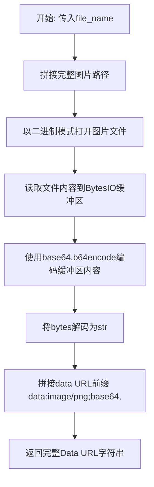

#### 带注释源码

```python
def get_img_base64(file_name: str) -> str:
    """
    get_img_base64 used in streamlit.
    absolute local path not working on windows.
    """
    # 使用Settings中配置的图片目录与文件名拼接完整路径
    image = f"{Settings.basic_settings.IMG_DIR}/{file_name}"
    
    # 读取图片：以二进制读取模式打开文件
    with open(image, "rb") as f:
        # 将文件内容读取到内存缓冲区BytesIO中
        buffer = BytesIO(f.read())
        # 对缓冲区内容进行Base64编码，返回bytes类型
        # 再调用decode()将bytes转换为str
        base_str = base64.b64encode(buffer.getvalue()).decode()
    
    # 返回标准的Data URL格式，可直接在HTML/Sreamlit中作为图片src使用
    return f"data:image/png;base64,{base_str}"
```


### `ApiRequest.__init__`

构造函数，用于初始化 `ApiRequest` 类的实例，设置API请求的基础URL、超时时间等属性，并初始化HTTP客户端状态。

参数：

- `base_url`：`str`，API服务器的基础URL，默认为 `api_address()` 函数的返回值
- `timeout`：`float`，HTTP请求的超时时间（秒），默认为 `Settings.basic_settings.HTTPX_DEFAULT_TIMEOUT`

返回值：`None`，无返回值，仅初始化对象属性

#### 流程图

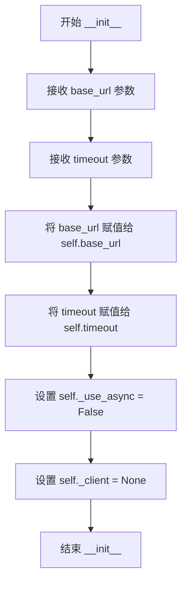

#### 带注释源码

```python
def __init__(
    self,
    base_url: str = api_address(),
    timeout: float = Settings.basic_settings.HTTPX_DEFAULT_TIMEOUT,
):
    """
    初始化ApiRequest实例
    
    该构造函数创建ApiRequest对象，用于同步模式调用API服务。
    初始化时设置基础URL、请求超时时间，并标记为非异步模式。
    
    参数:
        base_url: API服务器的基础URL，默认为api_address()的返回值
        timeout: HTTP请求的超时时间（秒），默认为Settings配置中的默认值
    """
    # 存储API服务器的基础URL，用于构建完整请求地址
    self.base_url = base_url
    
    # 存储HTTP请求的超时时间，用于控制请求响应时间
    self.timeout = timeout
    
    # 标记是否为异步模式，False表示同步模式
    self._use_async = False
    
    # 初始化HTTP客户端为None，实现懒加载（首次使用时创建）
    self._client = None
```


### `ApiRequest.client`

这是一个延迟初始化属性，用于获取或创建 httpx 客户端实例。该属性确保客户端在需要时自动创建，并在客户端已关闭或未初始化时重新创建，从而提供可靠的 HTTP 通信支持。

参数：无（仅包含隐式参数 `self`）

返回值：`httpx.Client` 或 `httpx.AsyncClient`，返回当前维护的 HTTP 客户端实例，用于发送 HTTP 请求

#### 流程图

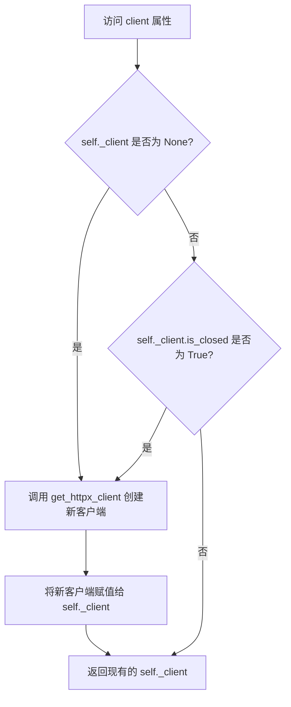

#### 带注释源码

```python
@property
def client(self):
    """
    延迟初始化并返回 httpx 客户端实例
    如果客户端尚未创建或已关闭，则创建新客户端；否则返回现有客户端
    """
    # 检查客户端是否未创建或已关闭
    if self._client is None or self._client.is_closed:
        # 使用工厂函数创建新的 httpx 客户端
        # 参数包括：基础URL、是否异步模式、请求超时时间
        self._client = get_httpx_client(
            base_url=self.base_url,      # API 服务器基础地址
            use_async=self._use_async,   # 是否使用异步客户端
            timeout=self.timeout          # 请求超时时间
        )
    # 返回可用的客户端实例
    return self._client
```


### `ApiRequest.get`

该方法封装了同步GET请求逻辑，支持普通请求和流式请求，具备重试机制以提高请求成功率。

参数：

- `url`：`str`，请求的目标URL地址
- `params`：`Union[Dict, List[Tuple], bytes]`，可选，请求的查询参数，支持字典、元组列表或字节格式
- `retry`：`int`，可选，默认值为3，请求失败时的重试次数
- `stream`：`bool`，可选，默认值为False，是否启用流式传输模式
- `**kwargs`：`Any`，可选，其他传递给httpx客户端的关键字参数

返回值：`Union[httpx.Response, Iterator[httpx.Response], None]`，成功时返回httpx.Response对象（普通模式）或Iterator[httpx.Response]（流式模式），重试次数耗尽后返回None

#### 流程图

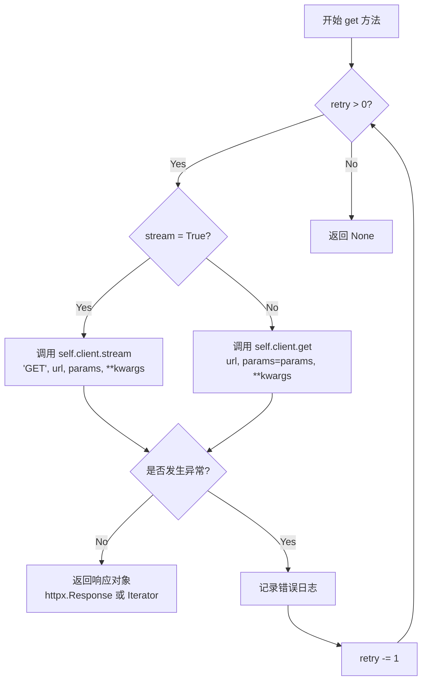

#### 带注释源码

```python
def get(
    self,
    url: str,
    params: Union[Dict, List[Tuple], bytes] = None,
    retry: int = 3,
    stream: bool = False,
    **kwargs: Any,
) -> Union[httpx.Response, Iterator[httpx.Response], None]:
    """
    发送同步GET请求，支持普通模式和流式模式
    """
    # 当重试次数大于0时持续尝试请求
    while retry > 0:
        try:
            # 根据stream参数决定使用流式还是普通请求
            if stream:
                # 流式请求：返回迭代器用于处理SSE等流式响应
                return self.client.stream("GET", url, params=params, **kwargs)
            else:
                # 普通请求：直接返回响应对象
                return self.client.get(url, params=params, **kwargs)
        except Exception as e:
            # 捕获所有异常并记录日志
            msg = f"error when get {url}: {e}"
            logger.error(f"{e.__class__.__name__}: {msg}")
            # 重试次数减1
            retry -= 1
    # 重试次数耗尽，返回None
    return None
```


### `ApiRequest.post`

该方法封装了同步 POST 请求逻辑，支持重试机制和流式响应处理。通过指定的 URL 发送 POST 请求，可选择发送表单数据或 JSON 数据，并提供失败自动重试功能。

**参数：**

- `url`：`str`，请求的目标URL地址
- `data`：`Dict = None`，可选的表单数据，将作为 form 数据发送
- `json`：`Dict = None`，可选的JSON数据，将作为 JSON body 发送
- `retry`：`int = 3`，请求失败时的重试次数，默认为3次
- `stream`：`bool = False`，是否使用流式响应模式
- `**kwargs`：`Any`，其他传递给 httpx 的可选参数

**返回值：**`Union[httpx.Response, Iterator[httpx.Response], None]`

- 成功时返回 `httpx.Response` 对象（非流式）或 `Iterator[httpx.Response]`（流式）
- 当重试次数耗尽仍失败时返回 `None`

#### 流程图

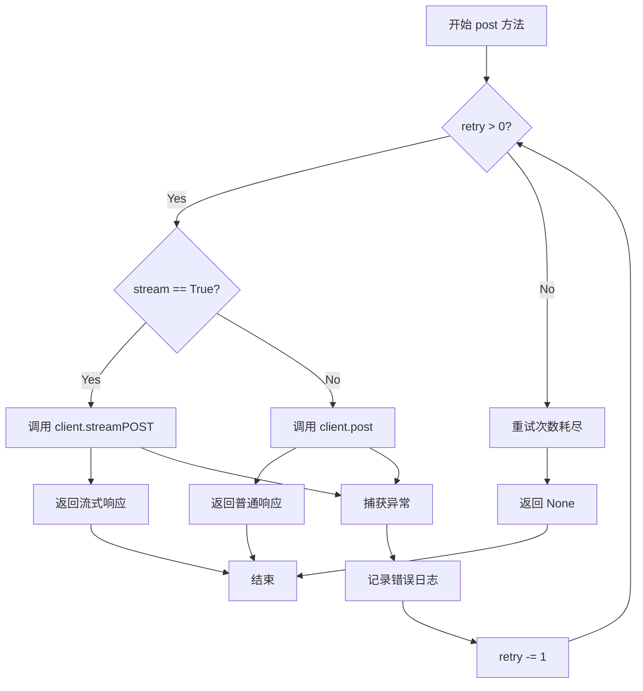

#### 带注释源码

```python
def post(
    self,
    url: str,
    data: Dict = None,
    json: Dict = None,
    retry: int = 3,
    stream: bool = False,
    **kwargs: Any,
) -> Union[httpx.Response, Iterator[httpx.Response], None]:
    """
    发送 POST 请求的封装方法
    
    参数:
        url: 请求的目标URL
        data: 表单数据（可选）
        json: JSON数据（可选）
        retry: 失败重试次数，默认3次
        stream: 是否使用流式响应
        **kwargs: 其他传递给httpx的参数
    
    返回:
        httpx.Response对象、流式响应迭代器，或重试失败后返回None
    """
    # 循环重试机制：当retry大于0时持续尝试
    while retry > 0:
        try:
            # print(kwargs)  # 调试用的打印语句，已注释
            if stream:
                # 使用流式响应模式，适合Server-Sent Events等场景
                return self.client.stream(
                    "POST", url, data=data, json=json, **kwargs
                )
            else:
                # 普通POST请求模式
                return self.client.post(url, data=data, json=json, **kwargs)
        except Exception as e:
            # 捕获所有异常并记录日志
            msg = f"error when post {url}: {e}"
            logger.error(f"{e.__class__.__name__}: {msg}")
            # 重试次数减1
            retry -= 1
    # 当重试次数耗尽仍失败时，返回None
    return None
```


### `ApiRequest.delete`

该方法封装了同步 DELETE 请求的实现，支持重试机制、流式响应处理和异常捕获。通过 `httpx` 客户端向指定 URL 发送 DELETE 请求，可选择是否启用流式模式，并返回响应对象或迭代器。

参数：

- `self`：`ApiRequest` 实例本身
- `url`：`str`，请求的目标 URL 地址
- `data`：`Dict = None`，可选的表单数据，作为请求体发送
- `json`：`Dict = None`，可选的 JSON 数据，作为 JSON 请求体发送
- `retry`：`int = 3`，请求失败时的最大重试次数，默认为 3 次
- `stream`：`bool = False`，是否启用流式响应模式，默认为 False
- `**kwargs`：`Any`，其他传递给 httpx 客户端的关键字参数

返回值：`Union[httpx.Response, Iterator[httpx.Response], None]`

- 若 `stream=False`：返回 `httpx.Response` 对象
- 若 `stream=True`：返回 `Iterator[httpx.Response]` 迭代器
- 若所有重试均失败：返回 `None`

#### 流程图

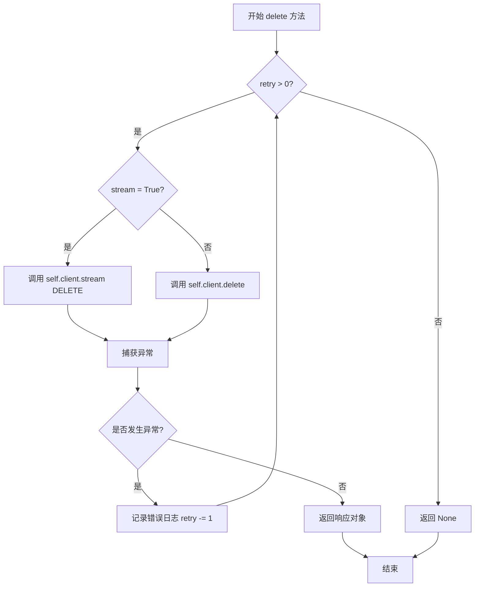

#### 带注释源码

```python
def delete(
    self,
    url: str,
    data: Dict = None,
    json: Dict = None,
    retry: int = 3,
    stream: bool = False,
    **kwargs: Any,
) -> Union[httpx.Response, Iterator[httpx.Response], None]:
    """
    发送 DELETE 请求的封装方法
    :param url: 请求的目标URL
    :param data: 可选的表单数据
    :param json: 可选的JSON数据
    :param retry: 重试次数，默认为3
    :param stream: 是否使用流式响应
    :param kwargs: 其他httpx接受的参数
    :return: 响应对象、流式迭代器或None
    """
    # 使用while循环实现重试机制
    while retry > 0:
        try:
            # 根据stream参数选择不同的请求方式
            if stream:
                # 流式响应：使用stream方法并返回迭代器
                return self.client.stream(
                    "DELETE", url, data=data, json=json, **kwargs
                )
            else:
                # 普通响应：直接调用delete方法
                return self.client.delete(url, data=data, json=json, **kwargs)
        except Exception as e:
            # 捕获所有异常并记录日志
            msg = f"error when delete {url}: {e}"
            logger.error(f"{e.__class__.__name__}: {msg}")
            # 重试次数减1
            retry -= 1
    # 重试次数用尽后返回None
    return None
```


### `ApiRequest.put`

该方法封装了同步的 HTTP PUT 请求，支持重试机制和流式响应处理。

参数：

- `url`：`str`，请求的目标 URL
- `data`：`Dict = None`，表单数据
- `json`：`Dict = None`，JSON 格式的请求体
- `retry`：`int = 3`，请求失败时的重试次数，默认为 3 次
- `stream`：`bool = False`，是否启用流式响应
- `**kwargs`：`Any`，其他传递给 httpx 的可选参数

返回值：`Union[httpx.Response, Iterator[httpx.Response], None]`，httpx 响应对象或流式迭代器，失败时返回 None

#### 流程图

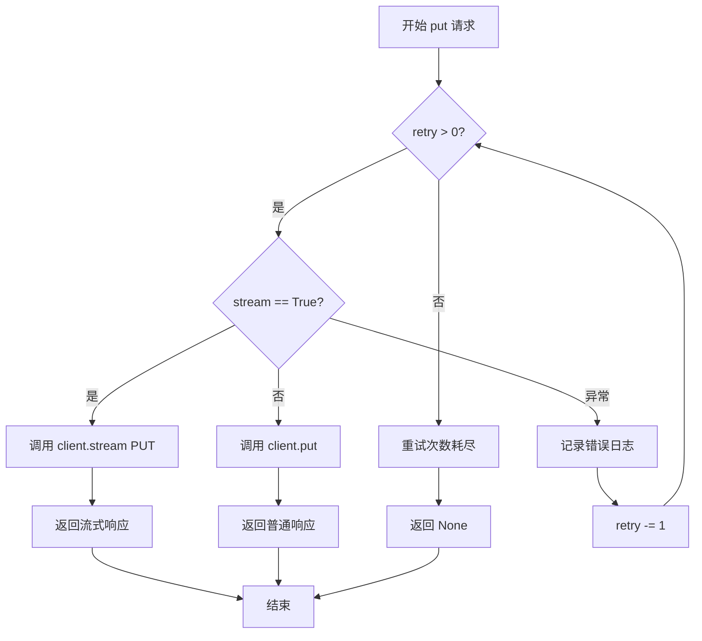

#### 带注释源码

```python
def put(
    self,
    url: str,
    data: Dict = None,
    json: Dict = None,
    retry: int = 3,
    stream: bool = False,
    **kwargs: Any,
) -> Union[httpx.Response, Iterator[httpx.Response], None]:
    """
    发送 HTTP PUT 请求
    :param url: 请求目标 URL
    :param data: 表单数据
    :param json: JSON 格式请求体
    :param retry: 重试次数
    :param stream: 是否流式响应
    :param kwargs: 其他 httpx 支持的参数
    :return: httpx.Response 或 Iterator[httpx.Response]，失败返回 None
    """
    # 循环重试机制，最多重试 retry 次
    while retry > 0:
        try:
            # 根据 stream 参数选择不同的请求方式
            if stream:
                # 流式响应：用于 Server-Sent Events 等场景
                return self.client.stream(
                    "PUT", url, data=data, json=json, **kwargs
                )
            else:
                # 普通响应：一次性返回完整响应
                return self.client.put(url, data=data, json=json, **kwargs)
        except Exception as e:
            # 捕获异常并记录错误日志
            msg = f"error when put {url}: {e}"
            logger.error(f"{e.__class__.__name__}: {msg}")
            # 重试次数递减
            retry -= 1
```


### `ApiRequest._httpx_stream2generator`

将 httpx.stream 返回的 GeneratorContextManager 转换为普通生成器，支持同步/异步模式，处理 SSE 流式响应并可选地解析为 JSON 格式。

参数：

- `response`：`contextlib._GeneratorContextManager`，httpx.stream 方法返回的生成器上下文管理器
- `as_json`：`bool`，是否将响应内容解析为 JSON 格式，默认为 False

返回值：`Generator`，根据 `self._use_async` 返回异步或同步生成器

#### 流程图

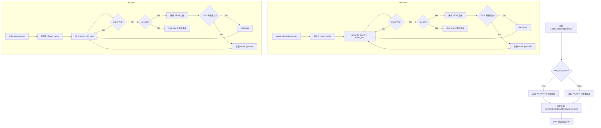

#### 带注释源码

```python
def _httpx_stream2generator(
    self,
    response: contextlib._GeneratorContextManager,
    as_json: bool = False,
):
    """
    将httpx.stream返回的GeneratorContextManager转化为普通生成器
    """

    # 定义异步内部生成器函数
    async def ret_async(response, as_json):
        try:
            # 异步上下文管理器，自动管理连接生命周期
            async with response as r:
                chunk_cache = ""  # 用于缓存不完整的 JSON 片段
                # 异步迭代响应文本块
                async for chunk in r.aiter_text(None):
                    # fastchat api 在开始和结束时会 yield 空字节，直接跳过
                    if not chunk:
                        continue
                    
                    # 需要解析为 JSON 格式
                    if as_json:
                        try:
                            # 处理 SSE 格式: "data: {...}\n\n"
                            if chunk.startswith("data: "):
                                # 提取 JSON 数据并去掉结尾的换行符
                                data = json.loads(chunk_cache + chunk[6:-2])
                            elif chunk.startswith(":"):  # 跳过 SSE 注释行
                                continue
                            else:
                                # 普通 JSON 格式
                                data = json.loads(chunk_cache + chunk)

                            chunk_cache = ""  # 重置缓存
                            yield data  # 输出解析后的数据
                        except Exception as e:
                            # JSON 解析失败，记录错误并缓存片段待后续处理
                            msg = f"接口返回json错误： '{chunk}'。错误信息是：{e}。"
                            logger.error(f"{e.__class__.__name__}: {msg}")

                            if chunk.startswith("data: "):
                                chunk_cache += chunk[6:-2]
                            elif chunk.startswith(":"):  # 跳过 SSE 注释行
                                continue
                            else:
                                chunk_cache += chunk
                            continue
                    else:
                        # 直接 yield 原始文本块
                        # print(chunk, end="", flush=True)
                        yield chunk
        except httpx.ConnectError as e:
            # 连接错误：API 服务器未启动
            msg = f"无法连接API服务器，请确认 'api.py' 已正常启动。({e})"
            logger.error(msg)
            yield {"code": 500, "msg": msg}
        except httpx.ReadTimeout as e:
            # 读取超时：服务响应过慢
            msg = f"API通信超时，请确认已启动FastChat与API服务（详见Wiki '5. 启动 API 服务或 Web UI'）。({e})"
            logger.error(msg)
            yield {"code": 500, "msg": msg}
        except Exception as e:
            # 其他通信错误
            msg = f"API通信遇到错误：{e}"
            logger.error(f"{e.__class__.__name__}: {msg}")
            yield {"code": 500, "msg": msg}

    # 定义同步内部生成器函数，逻辑与异步版本相同
    def ret_sync(response, as_json):
        try:
            # 同步上下文管理器
            with response as r:
                chunk_cache = ""
                for chunk in r.iter_text(None):
                    if not chunk:  # fastchat api yield empty bytes on start and end
                        continue
                    if as_json:
                        try:
                            if chunk.startswith("data: "):
                                data = json.loads(chunk_cache + chunk[6:-2])
                            elif chunk.startswith(":"):  # skip sse comment line
                                continue
                            else:
                                data = json.loads(chunk_cache + chunk)

                            chunk_cache = ""
                            yield data
                        except Exception as e:
                            msg = f"接口返回json错误： '{chunk}'。错误信息是：{e}。"
                            logger.error(f"{e.__class__.__name__}: {msg}")

                            if chunk.startswith("data: "):
                                chunk_cache += chunk[6:-2]
                            elif chunk.startswith(":"):  # skip sse comment line
                                continue
                            else:
                                chunk_cache += chunk
                            continue
                    else:
                        # print(chunk, end="", flush=True)
                        yield chunk
        except httpx.ConnectError as e:
            msg = f"无法连接API服务器，请确认 'api.py' 已正常启动。({e})"
            logger.error(msg)
            yield {"code": 500, "msg": msg}
        except httpx.ReadTimeout as e:
            msg = f"API通信超时，请确认已启动FastChat与API服务（详见Wiki '5. 启动 API 服务或 Web UI'）。({e})"
            logger.error(msg)
            yield {"code": 500, "msg": msg}
        except Exception as e:
            msg = f"API通信遇到错误：{e}"
            logger.error(f"{e.__class__.__name__}: {msg}")
            yield {"code": 500, "msg": msg}

    # 根据 _use_async 标志返回对应的生成器
    if self._use_async:
        return ret_async(response, as_json)
    else:
        return ret_sync(response, as_json)
```


### `ApiRequest._get_response_value`

该方法用于转换同步或异步请求返回的响应，支持将响应转换为JSON格式，并允许用户通过自定义函数处理返回值。

参数：

- `self`：`ApiRequest` 实例本身
- `response`：`httpx.Response`，HTTP响应对象
- `as_json`：`bool`，是否将响应转换为JSON格式，默认为 `False`
- `value_func`：`Callable`，可选的自定义返回值处理函数，接收 response 或 json 作为参数，默认为 `None`（返回原始响应）

返回值：根据 `as_json` 和 `value_func` 参数，返回处理后的响应内容。如果 `as_json` 为 `True`，返回 JSON 解析后的对象；否则返回原始响应对象。若提供 `value_func`，则返回经过该函数处理后的结果。

#### 流程图

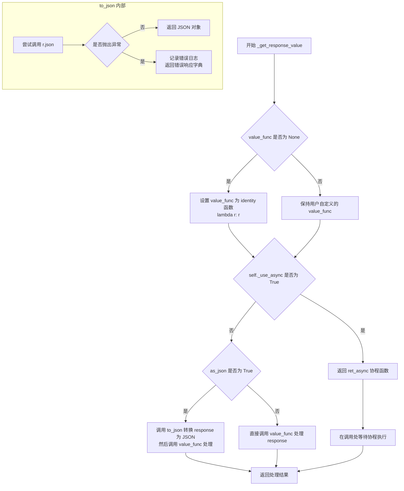

#### 带注释源码

```python
def _get_response_value(
    self,
    response: httpx.Response,
    as_json: bool = False,
    value_func: Callable = None,
):
    """
    转换同步或异步请求返回的响应
    `as_json`: 返回json
    `value_func`: 用户可以自定义返回值，该函数接受response或json
    """

    def to_json(r):
        """将响应对象转换为JSON格式"""
        try:
            return r.json()  # 尝试解析JSON响应
        except Exception as e:
            msg = "API未能返回正确的JSON。" + str(e)  # 构建错误消息
            logger.error(f"{e.__class__.__name__}: {msg}")  # 记录错误日志
            # 返回标准错误响应格式
            return {"code": 500, "msg": msg, "data": None}

    # 如果用户未提供自定义函数，则使用恒等函数（返回原值）
    if value_func is None:
        value_func = lambda r: r

    async def ret_async(response):
        """异步处理响应的内部协程函数"""
        if as_json:
            # 如果需要JSON格式，先转换为JSON，再应用自定义函数
            return value_func(to_json(await response))
        else:
            # 否则直接应用自定义函数到原始响应
            return value_func(await response)

    # 根据是否为异步模式返回不同的处理结果
    if self._use_async:
        # 异步模式：返回协程函数，由调用方await执行
        return ret_async(response)
    else:
        # 同步模式：直接执行并返回结果
        if as_json:
            return value_func(to_json(response))
        else:
            return value_func(response)
```


### ApiRequest.get_server_configs

获取服务器配置信息的方法，通过 POST 请求调用 `/server/configs` 接口获取服务器配置，并返回 JSON 格式的配置数据。

参数：

- `**kwargs`：`Any`，可选参数，会直接传递给 `self.post` 方法，用于扩展请求参数

返回值：`Dict`，服务器配置的字典数据

#### 流程图

```mermaid
flowchart TD
    A[调用 get_server_configs] --> B[执行 self.post&#40;'/server/configs', **kwargs&#41;]
    B --> C[获取 httpx.Response 对象]
    C --> D[调用 self._get_response_value&#40;response, as_json=True&#41;]
    D --> E{是否为异步模式?}
    E -->|是| F[返回异步函数 ret_async]
    E -->|否| G[将 response 转换为 JSON]
    F --> H[返回 Dict 类型的配置数据]
    G --> H
```

#### 带注释源码

```python
# 服务器信息
def get_server_configs(self, **kwargs) -> Dict:
    """
    获取服务器配置信息
    通过 POST 请求访问 /server/configs 接口获取服务器配置
    
    参数:
        **kwargs: 可变关键字参数，会传递给 self.post 方法
                  用于传递额外的请求参数
    
    返回值:
        Dict: 服务器配置信息字典
    """
    # 使用 POST 方法向 /server/configs 端点发送请求
    # **kwargs 允许调用者传递额外的参数如 headers、timeout 等
    response = self.post("/server/configs", **kwargs)
    
    # 调用 _get_response_value 方法将响应转换为 JSON 格式
    # as_json=True 表示将响应体解析为 JSON 字典
    return self._get_response_value(response, as_json=True)
```


### `ApiRequest.get_prompt_template`

获取指定类型的提示词模板。该方法通过 POST 请求调用服务器的 `/server/get_prompt_template` 接口，返回模板的文本内容。

参数：

- `type`：`str`，提示词模板类型，默认为 `"llm_chat"`
- `name`：`str`，提示词模板名称，默认为 `"default"`
- `**kwargs`：`Any`，传递给底层 `post` 方法的其他可选参数

返回值：`str`，返回提示词模板的文本内容

#### 流程图

```mermaid
flowchart TD
    A[开始 get_prompt_template] --> B[构建请求数据 data]
    B --> C{type 参数}
    C -->|使用默认值 "llm_chat"| D{type 已设置}
    C -->|使用传入值| D
    D --> E{name 参数}
    E -->|使用默认值 "default"| F{name 已设置}
    E -->|使用传入值| F
    F --> G[调用 self.post 方法]
    G --> H[POST /server/get_prompt_template]
    H --> I[获取 response]
    I --> J[调用 _get_response_value]
    J --> K[使用 value_func=lambda r: r.text 提取文本]
    K --> L[返回 str 类型的模板内容]
    L --> M[结束]
    
    style A fill:#e1f5fe
    style M fill:#e1f5fe
    style L fill:#c8e6c9
```

#### 带注释源码

```python
def get_prompt_template(
    self,
    type: str = "llm_chat",  # 提示词模板类型，默认为 LLM 对话类型
    name: str = "default",   # 提示词模板名称，默认为 default
    **kwargs,                # 传递给底层 post 方法的其他可选参数
) -> str:                   # 返回值类型为字符串
    """
    获取指定类型的提示词模板
    """
    # 构建请求体数据，包含模板类型和名称
    data = {
        "type": type,
        "name": name,
    }
    # 向服务器发送 POST 请求，传入 JSON 格式的 data
    response = self.post("/server/get_prompt_template", json=data, **kwargs)
    # 调用内部方法转换响应，使用 lambda 函数提取响应文本内容
    # value_func=lambda r: r.text 表示直接返回响应的文本内容
    return self._get_response_value(response, value_func=lambda r: r.text)
```


### `ApiRequest.chat_chat`

该方法是对 `api.py` 中 `/chat/chat` 接口的同步调用封装，用于发起对话请求并返回流式响应（Server-Sent Events）。方法接收用户查询、历史记录、模型配置等参数，构建请求体后通过 POST 方式发送请求，并使用生成器模式返回解析后的 JSON 数据块。

参数：

- `query`：`str`，用户输入的查询内容
- `metadata`：`dict`，包含对话的元数据信息（如用户ID、来源等）
- `conversation_id`：`str`，可选，用于指定会话ID以保持上下文连续性，默认为 `None`
- `history_len`：`int`，指定返回的历史消息数量，-1 表示返回全部历史，默认为 `-1`
- `history`：`List[Dict]`，对话历史记录列表，每个元素为包含角色和内容的字典，默认为空列表 `[]`
- `stream`：`bool`，是否启用流式响应，默认为 `True`
- `chat_model_config`：`Dict`，可选，聊天模型的配置参数（如温度、最大token数等）
- `tool_config`：`Dict`，可选，工具调用配置
- `**kwargs`：任意关键字参数，会透传给底层的 HTTP 请求

返回值：`Generator`，返回一个生成器对象，用于迭代获取流式响应的 JSON 数据

#### 流程图

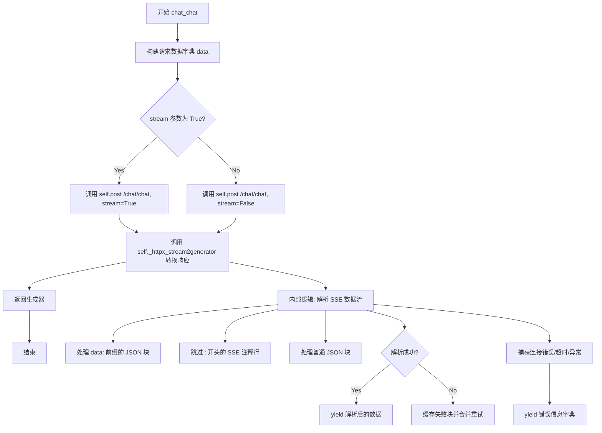

#### 带注释源码

```python
def chat_chat(
    self,
    query: str,
    metadata: dict,
    conversation_id: str = None,
    history_len: int = -1,
    history: List[Dict] = [],
    stream: bool = True,
    chat_model_config: Dict = None,
    tool_config: Dict = None,
    **kwargs,
):
    """
    对应api.py/chat/chat接口
    """
    # 构建请求数据字典，包含所有对话所需的参数
    data = {
        "query": query,                     # 用户当前的查询内容
        "metadata": metadata,               # 元数据信息
        "conversation_id": conversation_id, # 会话ID，用于多轮对话
        "history_len": history_len,         # 历史记录长度控制
        "history": history,                 # 对话历史列表
        "stream": stream,                   # 是否启用流式输出
        "chat_model_config": chat_model_config, # 聊天模型配置
        "tool_config": tool_config,         # 工具配置
    }

    # print(f"received input message:")
    # pprint(data)

    # 发送 POST 请求到 /chat/chat 接口，启用流式模式
    response = self.post("/chat/chat", json=data, stream=True, **kwargs)
    
    # 将 httpx 的流式响应转换为生成器，并按 JSON 格式解析每一块数据
    return self._httpx_stream2generator(response, as_json=True)
```


### `ApiRequest.upload_temp_docs`

该方法用于将临时文档上传到知识库，支持多种文件格式（本地路径、Path对象或字节数据），并返回JSON格式的响应结果。

参数：

- `files`：`List[Union[str, Path, bytes]]`，待上传的文件列表，支持字符串路径、Path对象或原始字节数据
- `knowledge_id`：`str = None`，知识库ID，用于指定目标知识库（可选）
- `chunk_size`：`int`，文档分块大小，默认为 `Settings.kb_settings.CHUNK_SIZE`
- `chunk_overlap`：`int`，分块重叠大小，默认为 `Settings.kb_settings.OVERLAP_SIZE`
- `zh_title_enhance`：`bool`，是否启用中文标题增强，默认为 `Settings.kb_settings.ZH_TITLE_ENHANCE`

返回值：`Dict`，包含上传结果的JSON响应数据

#### 流程图

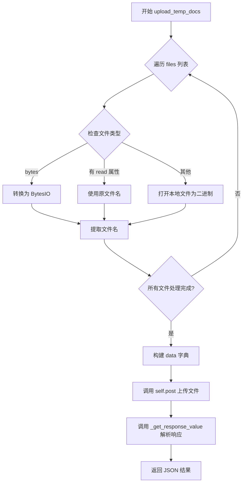

#### 带注释源码

```python
def upload_temp_docs(
    self,
    files: List[Union[str, Path, bytes]],
    knowledge_id: str = None,
    chunk_size=Settings.kb_settings.CHUNK_SIZE,
    chunk_overlap=Settings.kb_settings.OVERLAP_SIZE,
    zh_title_enhance=Settings.kb_settings.ZH_TITLE_ENHANCE,
):
    """
    对应api.py/knowledge_base/upload_temp_docs接口
    """

    def convert_file(file, filename=None):
        """将不同类型的文件转换为 (filename, file_object) 元组"""
        if isinstance(file, bytes):  # raw bytes
            # 原始字节数据转换为 BytesIO 对象
            file = BytesIO(file)
        elif hasattr(file, "read"):  # a file io like object
            # 文件对象（如打开的流），使用其 name 属性作为文件名
            filename = filename or file.name
        else:  # a local path
            # 本地文件路径，转换为绝对路径并以二进制模式打开
            file = Path(file).absolute().open("rb")
            filename = filename or os.path.split(file.name)[-1]
        return filename, file

    # 转换所有文件为统一格式
    files = [convert_file(file) for file in files]
    
    # 构建请求数据
    data = {
        "knowledge_id": knowledge_id,
        "chunk_size": chunk_size,
        "chunk_overlap": chunk_overlap,
        "zh_title_enhance": zh_title_enhance,
    }

    # 发送 POST 请求到知识库临时文档上传接口
    response = self.post(
        "/knowledge_base/upload_temp_docs",
        data=data,
        files=[("files", (filename, file)) for filename, file in files],
    )
    
    # 解析响应为 JSON 格式并返回
    return self._get_response_value(response, as_json=True)
```


### `ApiRequest.file_chat`

该方法用于与知识库中的文件进行对话，封装了对 `/chat/file_chat` API 接口的调用，支持流式返回响应。

参数：

- `query`：`str`，用户查询内容
- `knowledge_id`：`str`，知识库ID，用于指定要查询的知识库
- `top_k`：`int`，向量搜索返回的最相似结果数量，默认为 `Settings.kb_settings.VECTOR_SEARCH_TOP_K`
- `score_threshold`：`float`，相似度分数阈值，用于过滤低相关性结果，默认为 `Settings.kb_settings.SCORE_THRESHOLD`
- `history`：`List[Dict]`，对话历史列表，默认为空列表 `[]`
- `stream`：`bool`，是否启用流式返回，默认为 `True`
- `model`：`str`，使用的模型名称，默认为 `None`（使用服务端默认模型）
- `temperature`：`float`，生成文本的随机性参数，默认为 `0.9`
- `max_tokens`：`int`，生成文本的最大token数，默认为 `None`（不限制）
- `prompt_name`：`str`，使用的提示词模板名称，默认为 `"default"`

返回值：`Generator`，通过 `_httpx_stream2generator` 转换后的流式响应生成器，返回JSON格式的数据

#### 流程图

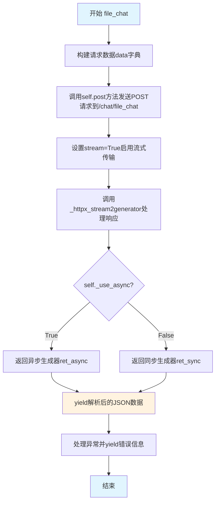

#### 带注释源码

```python
def file_chat(
    self,
    query: str,
    knowledge_id: str,
    top_k: int = Settings.kb_settings.VECTOR_SEARCH_TOP_K,
    score_threshold: float = Settings.kb_settings.SCORE_THRESHOLD,
    history: List[Dict] = [],
    stream: bool = True,
    model: str = None,
    temperature: float = 0.9,
    max_tokens: int = None,
    prompt_name: str = "default",
):
    """
    对应api.py/chat/file_chat接口
    """
    # 构建请求体数据字典，包含对话所需的所有参数
    data = {
        "query": query,                          # 用户输入的查询内容
        "knowledge_id": knowledge_id,            # 目标知识库ID
        "top_k": top_k,                          # 返回的相似文档数量
        "score_threshold": score_threshold,      # 相似度过滤阈值
        "history": history,                      # 对话历史上下文
        "stream": stream,                        # 是否启用流式输出
        "model_name": model,                     # 使用的LLM模型名称
        "temperature": temperature,              # 生成随机性控制
        "max_tokens": max_tokens,                # 生成token上限
        "prompt_name": prompt_name,              # 提示词模板标识
    }

    # 发送POST请求到file_chat接口，设置stream=True启用流式响应
    response = self.post(
        "/chat/file_chat",
        json=data,
        stream=True,
    )
    # 将httpx流式响应转换为生成器，as_json=True表示解析JSON格式
    return self._httpx_stream2generator(response, as_json=True)
```


### `ApiRequest.list_knowledge_bases`

该方法用于获取系统中所有已创建的知识库列表。它向服务器发送 GET 请求到 `/knowledge_base/list_knowledge_bases` 端点，并返回知识库数据列表。

参数：该方法没有参数

返回值：`List`，返回所有知识库的列表数据

#### 流程图

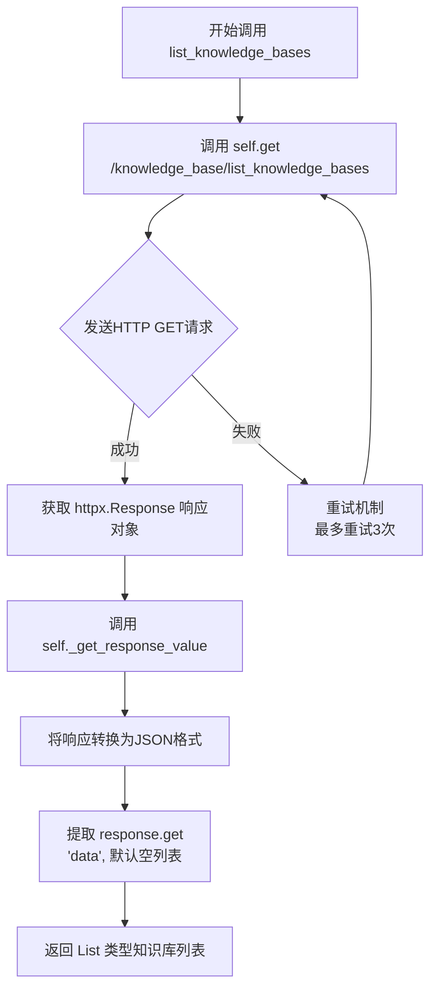

#### 带注释源码

```python
def list_knowledge_bases(
    self,
):
    """
    对应api.py/knowledge_base/list_knowledge_bases接口
    用于获取系统中所有已创建的知识库列表
    """
    # 发送 GET 请求到知识库列表端点
    # 使用 self.get 方法，继承自父类 ApiRequest
    response = self.get("/knowledge_base/list_knowledge_bases")
    
    # 调用 _get_response_value 方法处理响应
    # as_json=True: 将响应转换为 JSON 格式
    # value_func=lambda r: r.get("data", []): 自定义取值函数
    #   - 从响应中提取 "data" 字段
    #   - 如果 data 不存在或为 None，返回空列表作为默认值
    return self._get_response_value(
        response, as_json=True, value_func=lambda r: r.get("data", [])
    )
```


### `ApiRequest.create_knowledge_base`

该方法用于通过API调用在服务端创建一个新的知识库，封装了对 `api.py/knowledge_base/create_knowledge_base` 接口的同步请求过程，支持指定知识库名称、向量存储类型和嵌入模型。

参数：

- `knowledge_base_name`：`str`，要创建的知识库的名称，必填参数，用于唯一标识知识库
- `vector_store_type`：`str`，向量存储类型，默认为 `Settings.kb_settings.DEFAULT_VS_TYPE`，用于指定知识库使用的向量数据库类型（如 Faiss、Milvus、Elasticsearch 等）
- `embed_model`：`str`，嵌入模型，默认为 `get_default_embedding()` 的返回值，用于指定文本向量化所使用的嵌入模型

返回值：`Dict`，API 响应的 JSON 数据，通常包含创建结果的状态信息（如是否成功、错误信息等）

#### 流程图

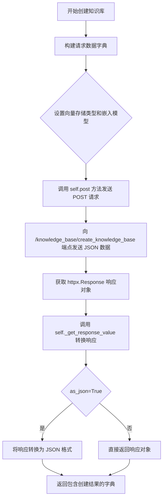

#### 带注释源码

```python
def create_knowledge_base(
    self,
    knowledge_base_name: str,
    vector_store_type: str = Settings.kb_settings.DEFAULT_VS_TYPE,
    embed_model: str = get_default_embedding(),
):
    """
    对应api.py/knowledge_base/create_knowledge_base接口
    用于在服务端创建一个新的知识库
    """
    # 构建请求数据字典，包含知识库的基本配置信息
    data = {
        "knowledge_base_name": knowledge_base_name,  # 知识库名称
        "vector_store_type": vector_store_type,      # 向量存储类型
        "embed_model": embed_model,                  # 嵌入模型
    }

    # 发送 POST 请求到创建知识库的 API 端点
    response = self.post(
        "/knowledge_base/create_knowledge_base",  # API 路径
        json=data,  # 将 data 作为 JSON 格式发送到请求体
    )
    
    # 获取响应值，as_json=True 表示将响应解析为 JSON 字典返回
    return self._get_response_value(response, as_json=True)
```


### `ApiRequest.delete_knowledge_base`

该方法用于调用后端API删除指定的知识库，发送POST请求到 `/knowledge_base/delete_knowledge_base` 端点，并返回JSON格式的响应结果。

参数：

- `knowledge_base_name`：`str`，要删除的知识库名称

返回值：`Dict`，API返回的JSON响应数据，包含删除操作的结果信息

#### 流程图

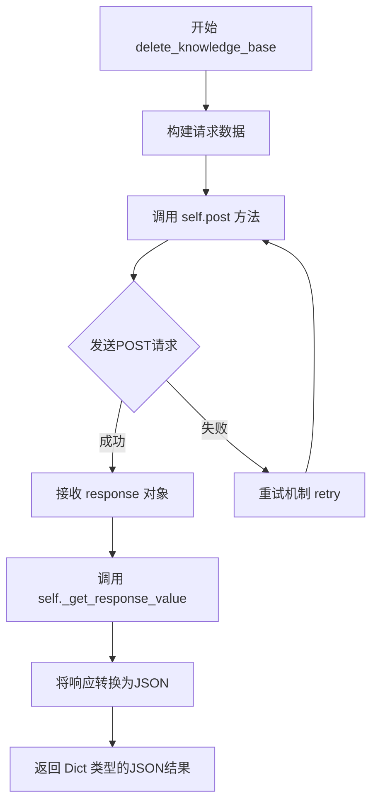

#### 带注释源码

```python
def delete_knowledge_base(
    self,
    knowledge_base_name: str,
):
    """
    对应api.py/knowledge_base/delete_knowledge_base接口
    该方法用于删除指定的知识库
    """
    # 使用 POST 方法调用删除知识库的API端点
    # 注意：这里将 knowledge_base_name 转换为字符串后作为 JSON 发送
    response = self.post(
        "/knowledge_base/delete_knowledge_base",
        json=f"{knowledge_base_name}",
    )
    # 调用 _get_response_value 方法将响应转换为 JSON 格式并返回
    return self._get_response_value(response, as_json=True)
```


### `ApiRequest.list_kb_docs`

该方法用于获取指定知识库中的文件列表，通过调用后端API的`/knowledge_base/list_files`接口来获取知识库文件信息，并从响应中提取`data`字段返回给调用者。

参数：

- `knowledge_base_name`：`str`，知识库的名称，用于指定要列出文件的目标知识库

返回值：`List`，返回知识库中的文件列表，如果请求失败或无数据则返回空列表

#### 流程图

```mermaid
sequenceDiagram
    participant Client as 调用者
    participant ApiRequest as ApiRequest类
    participant httpx as HTTPX客户端
    participant API_Server as 后端API服务器

    Client->>ApiRequest: list_kb_docs(knowledge_base_name)
    ApiRequest->>httpx: GET /knowledge_base/list_files?knowledge_base_name=xxx
    httpx->>API_Server: HTTP请求
    API_Server-->>httpx: 响应JSON
    httpx-->>ApiRequest: httpx.Response对象
    ApiRequest->>ApiRequest: _get_response_value(解析JSON)
    ApiRequest->>ApiRequest: 提取data字段，默认[]
    ApiRequest-->>Client: 返回文件列表(List)
```

#### 带注释源码

```python
def list_kb_docs(
    self,
    knowledge_base_name: str,
):
    """
    对应api.py/knowledge_base/list_files接口
    """
    # 调用GET方法访问知识库文件列表接口，传入知识库名称作为查询参数
    response = self.get(
        "/knowledge_base/list_files",
        params={"knowledge_base_name": knowledge_base_name},
    )
    # 解析响应为JSON格式，并提取"data"字段作为返回值，若无data则返回空列表
    return self._get_response_value(
        response, as_json=True, value_func=lambda r: r.get("data", [])
    )
```


### `ApiRequest.search_kb_docs`

该方法用于在指定的知识库中搜索相关文档，通过向量相似度和过滤条件返回最匹配的文档列表。

参数：

- `knowledge_base_name`：`str`，目标知识库的名称，用于指定在哪个知识库中进行搜索
- `query`：`str`，搜索查询文本，默认为空字符串，将使用该文本进行向量相似度匹配
- `top_k`：`int`，返回最相似的文档数量，默认为知识库设置中的向量搜索 top k 值
- `score_threshold`：`int`，相似度分数阈值，用于过滤低相关性结果，默认为知识库设置中的分数阈值
- `file_name`：`str`，文件名过滤条件，默认为空字符串，表示不限制文件名
- `metadata`：`dict`，元数据过滤条件字典，默认为空字典，用于根据文档的元数据进行筛选

返回值：`List`，搜索结果文档列表，包含与查询条件匹配的文档数据

#### 流程图

```mermaid
flowchart TD
    A[开始 search_kb_docs] --> B[构建请求数据 data]
    B --> C{检查知识库名称是否有效}
    C -->|有效| D[调用 self.post 方法]
    C -->|无效| E[抛出异常或返回空列表]
    D --> F[发送 POST 请求到 /knowledge_base/search_docs]
    F --> G[获取 httpx.Response 响应对象]
    G --> H[调用 self._get_response_value 转换为 JSON]
    H --> I{请求是否成功}
    I -->|成功| J[返回文档列表 List]
    I -->|失败| K[返回错误信息或空列表]
    J --> L[结束]
    K --> L
```

#### 带注释源码

```python
def search_kb_docs(
    self,
    knowledge_base_name: str,
    query: str = "",
    top_k: int = Settings.kb_settings.VECTOR_SEARCH_TOP_K,
    score_threshold: int = Settings.kb_settings.SCORE_THRESHOLD,
    file_name: str = "",
    metadata: dict = {},
) -> List:
    """
    对应api.py/knowledge_base/search_docs接口
    该方法用于在指定知识库中搜索相关文档
    支持通过查询文本、文件名和元数据进行多维度搜索
    """
    # 构建请求数据字典，包含所有搜索参数
    data = {
        "query": query,                      # 搜索查询文本，用于向量相似度匹配
        "knowledge_base_name": knowledge_base_name,  # 目标知识库名称
        "top_k": top_k,                      # 返回的最多相似文档数量
        "score_threshold": score_threshold,  # 相似度分数阈值，低于该值的结果被过滤
        "file_name": file_name,              # 文件名过滤条件
        "metadata": metadata,                # 元数据过滤条件
    }

    # 发送 POST 请求到知识库搜索接口
    response = self.post(
        "/knowledge_base/search_docs",
        json=data,  # 将 data 作为 JSON 格式发送到服务端
    )
    
    # 将响应转换为 JSON 格式并返回
    # _get_response_value 方法会处理响应解析和错误处理
    return self._get_response_value(response, as_json=True)
```


### ApiRequest.upload_kb_docs

该方法是 `ApiRequest` 类的成员方法，用于将文档上传到指定的知识库。它封装了对后端 `/knowledge_base/upload_docs` API 接口的调用，支持多种文件格式（字符串路径、Path 对象或字节），并提供文档分块、向量存储、覆盖策略等配置选项。

参数：

- `files`：`List[Union[str, Path, bytes]]`，要上传的文件列表，支持本地文件路径、Path 对象或原始字节数据
- `knowledge_base_name`：`str`，目标知识库的名称
- `override`：`bool`，是否覆盖已存在的文档，默认为 `False`
- `to_vector_store`：`bool`，是否将文档写入向量存储，默认为 `True`
- `chunk_size`：`int`，文档分块大小，默认使用 `Settings.kb_settings.CHUNK_SIZE`
- `chunk_overlap`：`int`，分块重叠大小，默认使用 `Settings.kb_settings.OVERLAP_SIZE`
- `zh_title_enhance`：`bool`，是否启用中文标题增强，默认使用 `Settings.kb_settings.ZH_TITLE_ENHANCE`
- `docs`：`Dict`，可选的自定义文档元数据字典
- `not_refresh_vs_cache`：`bool`，是否不刷新向量存储缓存，默认为 `False`

返回值：`Any`，调用 `_get_response_value` 返回 JSON 解析后的响应数据，通常包含上传结果的状态和信息

#### 流程图

```mermaid
flowchart TD
    A[开始 upload_kb_docs] --> B[定义 convert_file 内部函数]
    B --> C[遍历 files 列表调用 convert_file]
    C --> D[构建 data 字典]
    D --> E{docs 是否为 dict?}
    E -->|是| F[将 docs 序列化为 JSON 字符串]
    E -->|否| G[直接使用 docs]
    F --> H[调用 self.post 上传文件和数据]
    H --> I[调用 self._get_response_value 处理响应]
    I --> J[返回 JSON 解析结果]
    
    B -.-> B1[bytes -> BytesIO]
    B -.-> B2[有 read 方法 -> 使用原文件名]
    B -.-> B3[其他 -> 打开文件并获取文件名]
```

#### 带注释源码

```python
def upload_kb_docs(
    self,
    files: List[Union[str, Path, bytes]],
    knowledge_base_name: str,
    override: bool = False,
    to_vector_store: bool = True,
    chunk_size=Settings.kb_settings.CHUNK_SIZE,
    chunk_overlap=Settings.kb_settings.OVERLAP_SIZE,
    zh_title_enhance=Settings.kb_settings.ZH_TITLE_ENHANCE,
    docs: Dict = {},
    not_refresh_vs_cache: bool = False,
):
    """
    对应api.py/knowledge_base/upload_docs接口
    将文档上传到指定的知识库
    """

    def convert_file(file, filename=None):
        """内部函数：将不同类型的文件转换为 (filename, file_object) 元组"""
        if isinstance(file, bytes):  # raw bytes: 如果是原始字节数据
            file = BytesIO(file)      # 转换为 BytesIO 对象
        elif hasattr(file, "read"):   # a file io like object: 如果是文件类对象
            filename = filename or file.name  # 使用传入的文件名或对象属性名
        else:                         # a local path: 如果是本地路径
            file = Path(file).absolute().open("rb")  # 打开文件为二进制读取
            filename = filename or os.path.split(file.name)[-1]  # 提取文件名
        return filename, file  # 返回文件名和文件对象的元组

    # 将所有文件转换为标准格式
    files = [convert_file(file) for file in files]
    
    # 构建请求数据字典
    data = {
        "knowledge_base_name": knowledge_base_name,
        "override": override,
        "to_vector_store": to_vector_store,
        "chunk_size": chunk_size,
        "chunk_overlap": chunk_overlap,
        "zh_title_enhance": zh_title_enhance,
        "docs": docs,
        "not_refresh_vs_cache": not_refresh_vs_cache,
    }

    # 如果 docs 是字典，序列化为 JSON 字符串（确保中文不转义）
    if isinstance(data["docs"], dict):
        data["docs"] = json.dumps(data["docs"], ensure_ascii=False)
    
    # 发送 POST 请求到 upload_docs 接口
    response = self.post(
        "/knowledge_base/upload_docs",
        data=data,
        files=[("files", (filename, file)) for filename, file in files],
    )
    
    # 返回 JSON 解析后的响应结果
    return self._get_response_value(response, as_json=True)
```


### `ApiRequest.delete_kb_docs`

该方法用于删除知识库中的指定文档，对应 api.py 的 `/knowledge_base/delete_docs` 接口。

参数：

- `self`：`ApiRequest` 对象本身
- `knowledge_base_name`：`str`，知识库的名称
- `file_names`：`List[str]`，要删除的文件名列表
- `delete_content`：`bool`，可选，是否删除实际的文件内容（默认为 False）
- `not_refresh_vs_cache`：`bool`，可选，是否不刷新向量存储缓存（默认为 False）

返回值：`Dict`，JSON 格式的响应数据，包含删除操作的结果

#### 流程图

```mermaid
flowchart TD
    A[开始 delete_kb_docs] --> B[构建请求数据 data]
    B --> C{包含 knowledge_base_name, file_names, delete_content, not_refresh_vs_cache}
    C --> D[调用 self.post /knowledge_base/delete_docs]
    D --> E[获取 HTTP 响应]
    E --> F[调用 self._get_response_value 转换为 JSON]
    F --> G[返回 JSON 响应]
```

#### 带注释源码

```python
def delete_kb_docs(
    self,
    knowledge_base_name: str,
    file_names: List[str],
    delete_content: bool = False,
    not_refresh_vs_cache: bool = False,
):
    """
    对应api.py/knowledge_base/delete_docs接口
    用于删除知识库中的指定文档
    
    参数:
        knowledge_base_name: 知识库名称
        file_names: 要删除的文件名列表
        delete_content: 是否删除实际的文件内容,默认为False
        not_refresh_vs_cache: 是否不刷新向量存储缓存,默认为False
    
    返回:
        JSON格式的响应数据,包含删除操作的结果
    """
    # 构建请求数据字典
    data = {
        "knowledge_base_name": knowledge_base_name,
        "file_names": file_names,
        "delete_content": delete_content,
        "not_refresh_vs_cache": not_refresh_vs_cache,
    }

    # 向服务器发送POST请求,调用删除文档接口
    response = self.post(
        "/knowledge_base/delete_docs",
        json=data,
    )
    
    # 将响应转换为JSON格式并返回
    return self._get_response_value(response, as_json=True)
```


### `ApiRequest.update_kb_info`

该方法用于更新指定知识库的元信息，通过POST请求调用后端API的`/knowledge_base/update_info`接口，实现知识库基本信息的修改。

参数：

- `knowledge_base_name`：知识库的名称，用于指定需要更新的目标知识库
- `kb_info`：知识库的新信息/元数据，以字典形式传入待更新的内容

返回值：`Dict`，返回API响应的JSON数据，通常包含操作结果状态和信息

#### 流程图

```mermaid
flowchart TD
    A[开始 update_kb_info] --> B[构建请求数据]
    B --> C{设置knowledge_base_name}
    C --> D{设置kb_info}
    D --> E[调用POST方法 /knowledge_base/update_info]
    E --> F[通过_get_response_value转换响应]
    F --> G[返回JSON格式结果]
```

#### 带注释源码

```python
def update_kb_info(self, knowledge_base_name, kb_info):
    """
    对应api.py/knowledge_base/update_info接口
    用于更新知识库的元信息/描述等基础信息
    """
    # 构建请求数据字典，包含知识库名称和待更新的信息
    data = {
        "knowledge_base_name": knowledge_base_name,
        "kb_info": kb_info,
    }

    # 发送POST请求到后端API接口
    response = self.post(
        "/knowledge_base/update_info",
        json=data,
    )
    # 将httpx响应转换为JSON格式并返回
    return self._get_response_value(response, as_json=True)
```


### ApiRequest.update_kb_docs

该方法用于更新知识库中的指定文档，封装了对 `/knowledge_base/update_docs` API 接口的同步调用，支持自定义文档处理参数（如分块大小、重叠量、中文标题增强等），并返回 API 的 JSON 响应结果。

参数：

- `knowledge_base_name`：`str`，目标知识库的名称
- `file_names`：`List[str]`，需要更新的文件名称列表
- `override_custom_docs`：`bool`，是否覆盖已有的自定义文档，默认为 False
- `chunk_size`：`int`，文本分块的大小，默认为 Settings.kb_settings.CHUNK_SIZE
- `chunk_overlap`：`int`，文本分块之间的重叠量，默认为 Settings.kb_settings.OVERLAP_SIZE
- `zh_title_enhance`：`bool`，是否启用中文标题增强，默认为 Settings.kb_settings.ZH_TITLE_ENHANCE
- `docs`：`Dict`，自定义文档元数据字典，默认为空字典 {}
- `not_refresh_vs_cache`：`bool`，是否不刷新向量存储缓存，默认为 False

返回值：`Dict`，API 返回的 JSON 响应结果，通常包含操作状态和消息

#### 流程图

```mermaid
flowchart TD
    A[开始 update_kb_docs] --> B[构建请求数据 data 字典]
    B --> C{判断 docs 是否为 dict}
    C -->|是| D[将 docs 转换为 JSON 字符串]
    C -->|否| E[直接使用 docs]
    D --> F[调用 self.post 发送请求]
    E --> F
    F --> G[调用 self._get_response_value 获取响应]
    G --> H[返回 JSON 格式的响应结果]
```

#### 带注释源码

```python
def update_kb_docs(
    self,
    knowledge_base_name: str,  # 目标知识库的名称
    file_names: List[str],     # 需要更新的文件名称列表
    override_custom_docs: bool = False,  # 是否覆盖已有的自定义文档
    chunk_size=Settings.kb_settings.CHUNK_SIZE,       # 文本分块大小
    chunk_overlap=Settings.kb_settings.OVERLAP_SIZE,   # 文本分块重叠量
    zh_title_enhance=Settings.kb_settings.ZH_TITLE_ENHANCE,  # 是否启用中文标题增强
    docs: Dict = {},           # 自定义文档元数据字典
    not_refresh_vs_cache: bool = False,  # 是否不刷新向量存储缓存
):
    """
    对应api.py/knowledge_base/update_docs接口
    """
    # 构建请求参数字典
    data = {
        "knowledge_base_name": knowledge_base_name,
        "file_names": file_names,
        "override_custom_docs": override_custom_docs,
        "chunk_size": chunk_size,
        "chunk_overlap": chunk_overlap,
        "zh_title_enhance": zh_title_enhance,
        "docs": docs,
        "not_refresh_vs_cache": not_refresh_vs_cache,
    }

    # 如果 docs 是字典类型，则序列化为 JSON 字符串以确保正确传输
    if isinstance(data["docs"], dict):
        data["docs"] = json.dumps(data["docs"], ensure_ascii=False)

    # 向服务器发送 POST 请求
    response = self.post(
        "/knowledge_base/update_docs",
        json=data,
    )
    # 将响应转换为 JSON 格式并返回
    return self._get_response_value(response, as_json=True)
```


### `ApiRequest.recreate_vector_store`

用于重建指定知识库的向量存储，调用远程 API 接口并返回流式响应。

参数：

- `knowledge_base_name`：`str`，知识库名称，指定要重建向量存储的知识库
- `allow_empty_kb`：`bool`，是否允许空知识库，默认为 True
- `vs_type`：`str`，向量存储类型，默认为设置中的默认向量存储类型
- `embed_model`：`str`，嵌入模型，默认为系统默认嵌入模型
- `chunk_size`：`int`，文本分块大小，默认为设置中的分块大小
- `chunk_overlap`：`int`，文本分块重叠大小，默认为设置中的重叠大小
- `zh_title_enhance`：`bool`，是否启用中文标题增强，默认为设置中的值

返回值：`Iterator[httpx.Response]`，流式迭代器，返回知识库重建过程的 JSON 数据流

#### 流程图

```mermaid
flowchart TD
    A[开始重建向量存储] --> B[构建请求数据字典]
    B --> C{调用 post 方法}
    C -->|stream=True, timeout=None| D[POST /knowledge_base/recreate_vector_store]
    D --> E[调用 _httpx_stream2generator]
    E --> F[返回流式生成器]
    F --> G[结束]
```

#### 带注释源码

```python
def recreate_vector_store(
    self,
    knowledge_base_name: str,
    allow_empty_kb: bool = True,
    vs_type: str = Settings.kb_settings.DEFAULT_VS_TYPE,
    embed_model: str = get_default_embedding(),
    chunk_size=Settings.kb_settings.CHUNK_SIZE,
    chunk_overlap=Settings.kb_settings.OVERLAP_SIZE,
    zh_title_enhance=Settings.kb_settings.ZH_TITLE_ENHANCE,
):
    """
    对应api.py/knowledge_base/recreate_vector_store接口
    用于重建指定知识库的向量存储
    """
    # 构建请求数据字典，包含知识库名称和相关配置参数
    data = {
        "knowledge_base_name": knowledge_base_name,
        "allow_empty_kb": allow_empty_kb,
        "vs_type": vs_type,
        "embed_model": embed_model,
        "chunk_size": chunk_size,
        "chunk_overlap": chunk_overlap,
        "zh_title_enhance": zh_title_enhance,
    }

    # 发送 POST 请求到重建向量存储接口，启用流式响应
    response = self.post(
        "/knowledge_base/recreate_vector_store",
        json=data,
        stream=True,
        timeout=None,
    )
    # 将响应转换为 JSON 格式的流式生成器并返回
    return self._httpx_stream2generator(response, as_json=True)
```


### `ApiRequest.embed_texts`

该方法用于将文本列表转换为向量嵌入，支持本地嵌入模型和在线模型，可通过 `to_query` 参数区分查询向量和文档向量的用途。

参数：

- `texts`：`List[str]`，需要向量化的文本列表
- `embed_model`：`str`，使用的嵌入模型，默认为系统默认嵌入模型（通过 `get_default_embedding()` 获取）
- `to_query`：`bool`，指定向量化的用途，False 表示生成文档向量，True 表示生成查询向量

返回值：`List[List[float]]`，返回文本对应的向量嵌入列表，每个元素是一个浮点数列表

#### 流程图

```mermaid
flowchart TD
    A[开始 embed_texts] --> B[构建请求数据 data]
    B --> C{调用 self.post 方法}
    C -->|发送POST请求| D[/other/embed_texts 接口]
    D --> E{获取响应 resp}
    E --> F[调用 _get_response_value 方法]
    F --> G{解析 JSON 响应}
    G -->|提取 data 字段| H[返回向量列表 List[List[float]]]
    
    style A fill:#f9f,color:#000
    style H fill:#9f9,color:#000
```

#### 带注释源码

```python
def embed_texts(
    self,
    texts: List[str],
    embed_model: str = get_default_embedding(),
    to_query: bool = False,
) -> List[List[float]]:
    """
    对文本进行向量化，可选模型包括本地 embed_models 和支持 embeddings 的在线模型
    
    Args:
        texts: 需要向量化的文本列表
        embed_model: 嵌入模型名称，默认为系统配置的默认模型
        to_query: 是否用于查询向量，True 表示生成查询向量，False 表示生成文档向量
    
    Returns:
        List[List[float]]: 文本对应的向量嵌入列表
    """
    # 构建请求数据字典
    data = {
        "texts": texts,           # 待向量化的文本列表
        "embed_model": embed_model,  # 使用的嵌入模型
        "to_query": to_query,      # 向量用途标识
    }
    
    # 向服务器发送 POST 请求到 /other/embed_texts 接口
    resp = self.post(
        "/other/embed_texts",
        json=data,
    )
    
    # 获取响应值，将 JSON 响应中的 "data" 字段提取为返回值
    return self._get_response_value(
        resp, as_json=True, value_func=lambda r: r.get("data")
    )
```


### `ApiRequest.chat_feedback`

反馈对话评价，用于将用户对对话消息的评价（评分和原因）发送给服务器。

参数：

- `message_id`：`str`，消息的唯一标识符，用于定位被评价的具体对话消息
- `score`：`int`，评分分数，表示用户对对话的满意程度
- `reason`：`str`，评价原因（可选），提供评分的详细解释或补充说明

返回值：`httpx.Response` 或 JSON，返回服务器对反馈请求的响应结果

#### 流程图

```mermaid
flowchart TD
    A[开始 chat_feedback] --> B[构建请求数据 data]
    B --> C{包含 message_id, score, reason}
    C --> D[调用 self.post /chat/feedback]
    D --> E[获取 HTTP 响应对象]
    E --> F[调用 self._get_response_value 处理响应]
    F --> G[根据 as_json 和 value_func 转换响应]
    G --> H[返回转换后的结果]
```

#### 带注释源码

```python
def chat_feedback(
    self,
    message_id: str,
    score: int,
    reason: str = "",
) -> int:
    """
    反馈对话评价
    """
    # 构建包含评价信息的数据字典
    data = {
        "message_id": message_id,  # 消息ID，用于标识被评价的消息
        "score": score,            # 评分，用户对对话的评分
        "reason": reason,          # 评价原因，可选的详细说明
    }
    # 向服务器发送 POST 请求到 /chat/feedback 接口
    resp = self.post("/chat/feedback", json=data)
    # 获取响应值，默认返回 Response 对象（as_json=False）
    return self._get_response_value(resp)
```


### `ApiRequest.list_tools`

该方法用于从API服务器获取所有可用工具的列表，通过调用 `/tools` 端点并返回工具数据字典。

参数： 无（仅包含隐式参数 `self`）

返回值：`Dict`，返回包含所有工具信息的字典，如果请求失败或无数据则返回空字典

#### 流程图

```mermaid
flowchart TD
    A[开始] --> B[调用 self.get /tools 发送GET请求]
    B --> C[调用 self._get_response_value 处理响应]
    C --> D{设置参数}
    D --> E[as_json=True]
    D --> F[value_func=lambda r: r.get'data', {}]
    E --> G[返回工具数据字典]
    F --> G
```

#### 带注释源码

```python
def list_tools(self) -> Dict:
    """
    列出所有工具
    """
    # 发送GET请求到/tools端点获取工具列表
    resp = self.get("/tools")
    
    # 使用_get_response_value方法处理响应
    # 参数as_json=True表示将响应解析为JSON格式
    # value_func函数从响应中提取"data"字段，若不存在则返回空字典
    return self._get_response_value(
        resp, as_json=True, value_func=lambda r: r.get("data", {})
    )
```


### `ApiRequest.call_tool`

调用指定的工具，实现对工具的远程调用功能。

参数：

- `name`：`str`，要调用的工具名称
- `tool_input`：`Dict`，传递给工具的输入参数，默认为空字典

返回值：`Any`，工具执行后返回的数据结果

#### 流程图

```mermaid
flowchart TD
    A[开始调用 call_tool] --> B[接收参数: name, tool_input]
    B --> C[构建请求数据 data 字典]
    C --> D{执行 POST 请求}
    D -->|成功| E[调用 _get_response_value 方法]
    D -->|失败| F[异常被 post 方法捕获并重试]
    F --> D
    E --> G[提取响应中的 data 字段]
    G --> H[返回工具执行结果]
```

#### 带注释源码

```python
def call_tool(
    self,
    name: str,
    tool_input: Dict = {},
):
    """
    调用工具
    
    Args:
        name: 工具名称，用于指定要调用的工具
        tool_input: 工具输入参数，以字典形式传递给工具
    
    Returns:
        工具执行后返回的数据结果
    """
    # 构建请求数据，包含工具名称和输入参数
    data = {
        "name": name,
        "tool_input": tool_input,
    }
    # 发送 POST 请求到 /tools/call 端点
    resp = self.post("/tools/call", json=data)
    # 处理响应，转换为 JSON 格式并提取 data 字段返回
    return self._get_response_value(
        resp, as_json=True, value_func=lambda r: r.get("data")
    )
```


### `ApiRequest.get_mcp_profile`

该方法用于从远程API服务获取MCP（Model Context Protocol）的通用配置文件，通过GET请求调用相应的接口端点并返回JSON格式的配置数据。

参数：

- `**kwargs`：`Any`，可变关键字参数，用于传递额外的HTTP请求参数（如headers、params等）

返回值：`Dict`，返回MCP通用配置的字典对象，包含配置的各项参数信息

#### 流程图

```mermaid
flowchart TD
    A[调用 get_mcp_profile] --> B[调用 self.get]
    B --> C[构建GET请求: /api/v1/mcp_connections/profile]
    C --> D[发送HTTP请求到服务器]
    D --> E{请求是否成功}
    E -->|是| F[获取响应对象]
    E -->|否| G[重试机制 retry 次]
    G --> D
    F --> H[调用 _get_response_value]
    H --> I[转换为JSON格式]
    I --> J[返回Dict类型配置数据]
```

#### 带注释源码

```python
def get_mcp_profile(self, **kwargs) -> Dict:
    """
    获取 MCP 通用配置
    """
    # 调用GET方法请求MCP配置端点
    # endpoint: /api/v1/mcp_connections/profile
    # **kwargs允许调用者传入额外的HTTP请求参数（如headers, params, timeout等）
    resp = self.get("/api/v1/mcp_connections/profile", **kwargs)
    
    # 将响应转换为JSON格式的字典返回
    # _get_response_value方法会处理响应转换和错误处理
    return self._get_response_value(resp, as_json=True)
```


### `ApiRequest.create_mcp_profile`

该方法用于创建 MCP（Model Control Protocol）通用配置，通过 POST 请求向服务器发送超时时间、工作目录和环境变量等配置信息，并返回创建结果。

参数：

- `self`：隐式参数，当前 `ApiRequest` 实例
- `timeout`：`int`，超时时间（秒），默认值为 30
- `working_dir`：`str`，工作目录，默认值为 "/tmp"
- `env_vars`：`Dict[str, str]`，环境变量字典，默认为 `None`（空字典）
- `**kwargs`：可变关键字参数，用于传递额外的 HTTP 请求参数

返回值：`Dict`，服务器返回的 MCP 配置文件创建结果（JSON 格式）

#### 流程图

```mermaid
flowchart TD
    A[开始 create_mcp_profile] --> B{env_vars 是否为 None}
    B -->|是| C[设置 env_vars = {}]
    B -->|否| D[保持原 env_vars 不变]
    C --> E[构建 data 字典]
    D --> E
    E --> F[调用 self.post 发送 POST 请求到 /api/v1/mcp_connections/profile]
    F --> G[调用 self._get_response_value 转换响应结果]
    G --> H[返回 Dict 类型的 JSON 响应]
    I[结束]
    
    style A fill:#e1f5fe
    style H fill:#e8f5e8
    style I fill:#ffebee
```

#### 带注释源码

```python
def create_mcp_profile(
    self,
    timeout: int = 30,
    working_dir: str = "/tmp",
    env_vars: Dict[str, str] = None,
    **kwargs
) -> Dict:
    """
    创建 MCP 通用配置
    
    该方法向服务器发送 POST 请求以创建 MCP 配置文件，
    包含超时时间、工作目录和环境变量等配置项。
    
    Args:
        timeout: 超时时间（秒），默认 30 秒
        working_dir: 工作目录，默认 /tmp
        env_vars: 环境变量字典，用于配置 MCP 服务器运行环境
        **kwargs: 额外的关键字参数，会传递给 httpx 请求
    
    Returns:
        Dict: 服务器返回的 JSON 响应，包含创建结果
    """
    # 如果未提供 env_vars，初始化为空字典
    # 避免后续字典操作时报错
    if env_vars is None:
        env_vars = {}
    
    # 构建请求数据体
    # 包含 MCP 配置的核心参数
    data = {
        "timeout": timeout,           # MCP 服务器超时时间
        "working_dir": working_dir,  # MCP 服务器工作目录
        "env_vars": env_vars,         # 环境变量配置
    }
    
    # 发送 POST 请求到 MCP 配置端点
    # 使用 json 参数将 data 作为 JSON 载荷发送
    # **kwargs 允许调用者添加额外的请求参数（如 headers、cookies 等）
    resp = self.post("/api/v1/mcp_connections/profile", json=data, **kwargs)
    
    # 将 httpx 响应转换为 JSON 格式并返回
    # _get_response_value 方法处理了同步/异步响应转换
    # as_json=True 确保返回 Python 字典而非原始响应对象
    return self._get_response_value(resp, as_json=True)
```


### `ApiRequest.update_mcp_profile`

更新 MCP 通用配置信息，包括超时时间、工作目录和环境变量等参数。

参数：

- `timeout`：`int`，超时时间（秒），默认值为 30
- `working_dir`：`str`，工作目录，默认值为 "/tmp"
- `env_vars`：`Dict[str, str]`，环境变量字典，默认值为 None
- `**kwargs`：`Any`，其他关键字参数，用于传递额外的请求参数

返回值：`Dict`，包含更新后的 MCP 配置文件信息，通常包含响应状态码、消息和数据

#### 流程图

```mermaid
flowchart TD
    A[开始 update_mcp_profile] --> B{env_vars 是否为 None}
    B -->|是| C[初始化空字典]
    B -->|否| D[使用传入的 env_vars]
    C --> E[构建 data 字典]
    D --> E
    E --> F[调用 self.put 方法]
    F --> G[发送 PUT 请求到 /api/v1/mcp_connections/profile]
    G --> H[调用 self._get_response_value 转换响应]
    H --> I[返回 JSON 格式的响应结果]
    I --> J[结束]
    
    style A fill:#f9f,color:#333
    style J fill:#9f9,color:#333
```

#### 带注释源码

```python
def update_mcp_profile(
    self,
    timeout: int = 30,
    working_dir: str = "/tmp",
    env_vars: Dict[str, str] = None,
    **kwargs
) -> Dict:
    """
    更新 MCP 通用配置
    
    该方法用于更新 MCP（Model Context Protocol）的通用配置文件，
    包括超时时间、工作目录和环境变量等配置项。
    
    参数:
        timeout: 超时时间，单位为秒，默认为 30 秒
        working_dir: 工作目录路径，默认为 "/tmp"
        env_vars: 环境变量字典，用于设置 MCP 服务运行时的环境变量
        **kwargs: 额外的关键字参数，会传递给底层的 HTTP 请求
    
    返回:
        Dict: 包含更新结果的响应数据，通常包含 code、msg 和 data 字段
    """
    # 如果未提供 env_vars，初始化为空字典，避免后续使用时出现空引用
    if env_vars is None:
        env_vars = {}
    
    # 构建请求数据字典，包含需要更新的配置项
    data = {
        "timeout": timeout,          # MCP 服务超时时间配置
        "working_dir": working_dir, # MCP 服务工作目录配置
        "env_vars": env_vars,        # MCP 服务环境变量配置
    }
    
    # 发送 PUT 请求到 MCP 配置接口，更新通用配置
    # 使用 PUT 方法表示更新操作
    resp = self.put("/api/v1/mcp_connections/profile", json=data, **kwargs)
    
    # 调用内部方法将响应转换为 JSON 格式并返回
    # as_json=True 表示将响应体解析为 JSON 格式
    return self._get_response_value(resp, as_json=True)
```


### `ApiRequest.reset_mcp_profile`

该方法用于将 MCP 通用配置重置为默认值，通过向服务器发送 POST 请求到指定的端点来实现配置重置。

参数：

- `**kwargs`：任意关键字参数，这些参数将传递给底层的 HTTP 请求方法（如 headers、params 等），用于自定义请求行为

返回值：`Dict`，返回 API 响应的 JSON 数据，包含重置操作的结果

#### 流程图

```mermaid
sequenceDiagram
    participant Client as ApiRequest客户端
    participant HTTP as HTTP客户端
    participant Server as API服务器
    
    Client->>Client: 准备请求参数
    Client->>HTTP: POST /api/v1/mcp_connections/profile/reset
    HTTP->>Server: 发送重置MCP配置的请求
    Server-->>HTTP: 返回响应
    HTTP-->>Client: 返回httpx.Response对象
    Client->>Client: _get_response_value()转换响应
    Client: 将响应转换为JSON格式并返回
```

#### 带注释源码

```python
def reset_mcp_profile(self, **kwargs) -> Dict:
    """
    重置 MCP 通用配置为默认值
    """
    # 向服务器发送 POST 请求到重置端点
    # 端点路径: /api/v1/mcp_connections/profile/reset
    # **kwargs 允许调用者传递额外的请求参数，如 headers、timeout 等
    resp = self.post("/api/v1/mcp_connections/profile/reset", **kwargs)
    
    # 调用内部方法将响应转换为 JSON 格式并返回
    # as_json=True 表示将响应体解析为 JSON
    return self._get_response_value(resp, as_json=True)
```


### `ApiRequest.delete_mcp_profile`

该方法用于通过 HTTP DELETE 请求删除 MCP 通用配置，调用后端 `/api/v1/mcp_connections/profile` 接口，并将响应转换为 JSON 格式返回。

参数：

- `**kwargs`：`Any`，可选关键字参数，会传递给底层的 `delete` HTTP 方法和响应处理函数

返回值：`Dict`，后端返回的删除操作结果（JSON 格式）

#### 流程图

```mermaid
flowchart TD
    A[开始 delete_mcp_profile] --> B[调用 self.delete]
    B --> C[构建 DELETE 请求]
    C --> D[URL: /api/v1/mcp_connections/profile]
    D --> E[发送请求到后端]
    E --> F[接收响应]
    F --> G[调用 _get_response_value]
    G --> H{as_json=True}
    H -->|是| I[解析 JSON 响应]
    H -->|否| J[返回原始响应]
    I --> K[返回 Dict 结果]
    J --> K
    K --> L[结束]
    
    style A fill:#f9f,color:#333
    style L fill:#9f9,color:#333
    style K fill:#ff9,color:#333
```

#### 带注释源码

```python
def delete_mcp_profile(self, **kwargs) -> Dict:
    """
    删除 MCP 通用配置
    
    该方法向后端发送 DELETE 请求，删除已创建的 MCP 通用配置文件。
    通常与 create_mcp_profile、update_mcp_profile 配合使用，用于管理
    MCP 连接的整体配置。
    
    Args:
        **kwargs: 可选关键字参数，会传递给:
                  - self.delete() HTTP 请求方法
                  - self._get_response_value() 响应处理方法
                  常见用途包括自定义请求头、超时设置等
    
    Returns:
        Dict: 后端返回的删除操作结果，包含状态码和消息等信息。
              典型返回格式: {"code": 200, "msg": "删除成功", "data": ...}
    
    Example:
        >>> api = ApiRequest()
        >>> result = api.delete_mcp_profile()
        >>> print(result)
        {'code': 200, 'msg': 'MCP profile deleted successfully'}
    """
    # 调用 delete 方法发送 HTTP DELETE 请求到后端接口
    # 接口路径: /api/v1/mcp_connections/profile
    # **kwargs 允许调用者传递额外的请求参数（如 headers, timeout 等）
    resp = self.delete("/api/v1/mcp_connections/profile", **kwargs)
    
    # 使用 _get_response_value 方法处理响应
    # as_json=True 表示将响应解析为 JSON 格式并返回 Dict
    # 该方法会自动处理错误响应和异常情况
    return self._get_response_value(resp, as_json=True)
```


### `ApiRequest.add_mcp_connection`

该方法用于向 API 服务器添加一个新的 MCP（Model Context Protocol）连接配置，允许客户端定义远程 MCP 服务器的连接参数，包括服务器名称、启动参数、环境变量、工作目录、传输协议、超时设置、启用状态及描述信息等。

参数：

- `self`：`ApiRequest`，ApiRequest 实例自身
- `server_name`：`str`，MCP 服务器的唯一标识名称，用于标识和引用该连接
- `args`：`List[str]`，可选，启动 MCP 服务器时传递的命令行参数列表，默认为空列表
- `env`：`Dict[str, str]`，可选，传递给 MCP 服务器的环境变量字典，默认为空字典
- `cwd`：`Optional[str]`，可选，MCP 服务器进程的工作目录，默认为 None
- `transport`：`str`，可选，通信传输协议类型，默认为 "stdio"，还支持 "sse" 等其他协议
- `timeout`：`int`超时时间设置，单位为秒，用于控制 MCP 服务器请求的响应超时，默认为 30 秒
- `enabled`：`bool`，可选，连接创建后是否自动启用，默认为 True
- `description`：`Optional[str]`，可选，对该 MCP 连接的人工描述或备注信息，默认为 None
- `config`：`Dict`，可选，额外的服务器特定配置选项字典，默认为空字典
- `**kwargs`：`Any`，可选，传递给底层 HTTP 请求的额外关键字参数

返回值：`Dict`，API 服务器返回的响应数据，通常包含创建成功的 MCP 连接信息或错误信息

#### 流程图

```mermaid
flowchart TD
    A[开始 add_mcp_connection] --> B{参数初始化检查}
    B --> C{args 是否为 None?}
    C -->|是| D[args = []]
    C -->|否| E{env 是否为 None?}
    D --> E
    E -->|是| F[env = {}]
    E -->|否| G{config 是否为 None?}
    F --> G
    G -->|是| H[config = {}]
    G -->|否| I[构建 data 字典]
    H --> I
    I --> J[调用 self.post /api/v1/mcp_connections/]
    J --> K[调用 self._get_response_value 转换响应]
    K --> L[返回 Dict 类型的 JSON 响应]
    L --> M[结束]
```

#### 带注释源码

```python
def add_mcp_connection(
    self,
    server_name: str,
    args: List[str] = None,
    env: Dict[str, str] = None,
    cwd: Optional[str] = None,
    transport: str = "stdio",
    timeout: int = 30,
    enabled: bool = True,
    description: Optional[str] = None,
    config: Dict = None,
    **kwargs
) -> Dict:
    """
    添加 MCP 连接
    该方法向 API 服务器发送 POST 请求，创建一个新的 MCP 服务器连接配置
    """
    # 处理可选参数，避免后续使用 None 值
    if args is None:
        args = []  # 默认空列表，避免 None 序列化问题
    if env is None:
        env = {}   # 默认空字典
    if config is None:
        config = {}  # 默认空字典
    
    # 构建请求数据字典，包含所有 MCP 连接配置参数
    data = {
        "server_name": server_name,       # MCP 服务器唯一名称
        "args": args,                     # 命令行参数列表
        "env": env,                       # 环境变量字典
        "cwd": cwd,                       # 工作目录
        "transport": transport,           # 传输协议类型
        "timeout": timeout,               # 超时时间（秒）
        "enabled": enabled,               # 是否启用该连接
        "description": description,       # 连接描述信息
        "config": config,                 # 额外配置项
    }
    
    # 向 MCP 连接管理 API 端点发送 POST 请求
    # 请求体为 JSON 格式的 data 字典
    resp = self.post("/api/v1/mcp_connections/", json=data, **kwargs)
    
    # 调用内部方法将 HTTP 响应转换为 JSON 格式并返回
    return self._get_response_value(resp, as_json=True)
```


### `ApiRequest.get_all_mcp_connections`

获取所有 MCP（Model Context Protocol）连接信息，可选择仅获取已启用的连接。

参数：

- `enabled_only`：`bool`，默认为 `False`，是否仅返回已启用的 MCP 连接
- `**kwargs`：`Any`，可选，其他传递给 GET 请求的关键字参数（如 headers、timeout 等）

返回值：`Dict`，返回包含 MCP 连接列表的字典数据，通常包含连接详情（ID、服务器名称、传输类型、启用状态等）

#### 流程图

```mermaid
flowchart TD
    A[调用 get_all_mcp_connections] --> B{enabled_only 是否为 True}
    B -->|是| C[构建 params = {'enabled_only': True}]
    B -->|否| D[构建 params = {}]
    C --> E[调用 self.get /api/v1/mcp_connections/ 参数 params]
    D --> E
    E --> F[调用 self._get_response_value 转换响应]
    F --> G[返回 JSON 格式的字典数据]
```

#### 带注释源码

```python
def get_all_mcp_connections(self, enabled_only: bool = False, **kwargs) -> Dict:
    """
    获取所有 MCP 连接
    
    该方法向服务器请求所有已注册的 MCP 连接列表。
    可以通过 enabled_only 参数筛选仅返回已启用的连接。
    
    Args:
        enabled_only: 是否仅获取已启用的连接。默认为 False，返回所有连接。
        **kwargs: 其他传递给 httpx.get 的关键字参数（如 headers、timeout 等）
    
    Returns:
        Dict: 包含 MCP 连接列表的响应数据，通常格式为:
              {
                  "code": 200,
                  "data": [
                      {
                          "id": "connection_id",
                          "server_name": "server_name",
                          "transport": "stdio",
                          "enabled": true,
                          ...
                      },
                      ...
                  ]
              }
    """
    # 根据 enabled_only 参数构建查询参数
    # 如果 enabled_only 为 True，则在 params 中添加 enabled_only 字段
    params = {"enabled_only": enabled_only} if enabled_only else {}
    
    # 调用 GET 请求到 MCP 连接列表端点
    # 路径: /api/v1/mcp_connections/
    resp = self.get("/api/v1/mcp_connections/", params=params, **kwargs)
    
    # 将响应转换为 JSON 格式的字典并返回
    # _get_response_value 方法会处理错误情况和 JSON 解析
    return self._get_response_value(resp, as_json=True)
```


### `ApiRequest.get_mcp_connection`

根据 MCP 连接的 ID 获取该连接的详细信息。

参数：

- `connection_id`：`str`，MCP 连接的唯一标识符
- `**kwargs`：`Any`，传递给底层 HTTP GET 请求的额外关键字参数（如 headers、timeout 等）

返回值：`Dict`，返回包含 MCP 连接详细信息的字典，包含连接的配置、状态、描述等字段

#### 流程图

```mermaid
flowchart TD
    A[开始 get_mcp_connection] --> B[接收 connection_id 参数]
    B --> C[构建请求 URL: /api/v1/mcp_connections/{connection_id}]
    C --> D[调用 self.get 方法发起 GET 请求]
    D --> E{请求是否成功}
    E -->|成功| F[将响应传递给 self._get_response_value]
    E -->|失败| G[重试机制 retry > 0?]
    G -->|是| D
    G -->|否| H[记录错误日志并返回 None]
    F --> I[将响应转换为 JSON 字典]
    I --> J[返回 MCP 连接信息字典]
```

#### 带注释源码

```python
def get_mcp_connection(self, connection_id: str, **kwargs) -> Dict:
    """
    根据 ID 获取 MCP 连接
    
    该方法通过 REST API 获取指定 MCP 连接的完整配置信息，
    包括服务器名称、传输方式、超时设置、环境变量、启用状态等。
    
    Args:
        connection_id: MCP 连接的唯一标识符
        **kwargs: 传递给底层 HTTP 请求的额外参数
        
    Returns:
        Dict: 包含 MCP 连接详细信息的字典，格式如:
              {
                  "id": "xxx",
                  "server_name": "xxx",
                  "transport": "stdio",
                  "enabled": true,
                  ...
              }
              如果请求失败或连接不存在，返回包含错误信息的字典
    """
    # 构建完整的 API 端点 URL，将 connection_id 作为路径参数
    # 格式: /api/v1/mcp_connections/{connection_id}
    resp = self.get(f"/api/v1/mcp_connections/{connection_id}", **kwargs)
    
    # 调用内部方法将 HTTP 响应转换为 JSON 格式的字典
    # _get_response_value 方法会处理:
    # 1. 响应状态码检查
    # 2. JSON 解析及异常处理
    # 3. 可选的 value_func 自定义转换
    return self._get_response_value(resp, as_json=True)
```


### `ApiRequest.update_mcp_connection`

该方法用于更新指定ID的MCP连接配置，支持动态更新连接的各项参数（如服务器名称、启动参数、环境变量、传输协议等），并通过HTTP PUT请求将更新后的配置发送到服务器。

参数：

- `connection_id`：`str`，MCP连接的唯一标识符，用于指定要更新的连接
- `server_name`：`Optional[str]`，MCP服务器名称，可选
- `args`：`Optional[List[str]]`，MCP服务器启动命令参数列表，可选
- `env`：`Optional[Dict[str, str]]`，MCP服务器环境变量字典，可选
- `cwd`：`Optional[str]`，MCP服务器工作目录，可选
- `transport`：`Optional[str]`，MCP传输协议类型（如stdio），可选
- `timeout`：`Optional[int]`，MCP连接超时时间（秒），可选
- `enabled`：`Optional[bool]`，是否启用该MCP连接，可选
- `description`：`Optional[str]`，MCP连接描述信息，可选
- `config`：`Optional[Dict]`，MCP连接的自定义配置字典，可选
- `**kwargs`：任意额外的关键字参数，会传递给HTTP请求

返回值：`Dict`，服务器返回的响应数据，通常包含操作结果或更新后的连接信息

#### 流程图

```mermaid
flowchart TD
    A[开始 update_mcp_connection] --> B[接收参数 connection_id 和其他可选参数]
    B --> C[初始化空字典 data]
    C --> D{检查 server_name 是否非空}
    D -->|是| E[将 server_name 加入 data]
    D -->|否| F{检查 args 是否非空}
    E --> F
    F -->|是| G[将 args 加入 data]
    F -->|否| H{检查 env 是否非空}
    G --> H
    H -->|是| I[将 env 加入 data]
    H -->|否| J{检查 cwd 是否非空}
    I --> J
    J -->|是| K[将 cwd 加入 data]
    J -->|否| L{检查 transport 是否非空}
    K --> L
    L -->|是| M[将 transport 加入 data]
    L -->|否| N{检查 timeout 是否非空}
    M --> N
    N -->|是| O[将 timeout 加入 data]
    N -->|否| P{检查 enabled 是否非空}
    O --> P
    P -->|是| Q[将 enabled 加入 data]
    P -->|否| R{检查 description 是否非空}
    Q --> R
    R -->|是| S[将 description 加入 data]
    R -->|否| T{检查 config 是否非空}
    S --> T
    T -->|是| U[将 config 加入 data]
    T -->|否| V[调用 self.put 发送 HTTP PUT 请求]
    U --> V
    V --> W[调用 self._get_response_value 解析响应]
    W --> X[返回解析后的 JSON 响应]
```

#### 带注释源码

```python
def update_mcp_connection(
    self,
    connection_id: str,
    server_name: Optional[str] = None,
    args: Optional[List[str]] = None,
    env: Optional[Dict[str, str]] = None,
    cwd: Optional[str] = None,
    transport: Optional[str] = None,
    timeout: Optional[int] = None,
    enabled: Optional[bool] = None,
    description: Optional[str] = None,
    config: Optional[Dict] = None,
    **kwargs
) -> Dict:
    """
    更新 MCP 连接
    
    该方法允许用户更新已存在的MCP连接配置。所有参数（除connection_id外）
    都是可选的，只有传入非空值的参数才会被更新到服务器。
    
    Args:
        connection_id: MCP连接的唯一标识符，必填
        server_name: MCP服务器名称，可选
        args: MCP服务器启动参数列表，可选
        env: 环境变量字典，可选
        cwd: 工作目录路径，可选
        transport: 传输协议类型，可选
        timeout: 超时时间（秒），可选
        enabled: 是否启用该连接，可选
        description: 连接描述信息，可选
        config: 自定义配置字典，可选
        **kwargs: 额外的请求参数
    
    Returns:
        Dict: 服务器返回的响应，包含更新结果或错误信息
    """
    # 初始化空字典，用于存储需要更新的字段
    data = {}
    
    # 仅将非空参数添加到data字典中，实现增量更新
    # 这样服务器只会更新传入的字段，未传入的字段保持原值
    if server_name is not None:
        data["server_name"] = server_name
    if args is not None:
        data["args"] = args
    if env is not None:
        data["env"] = env
    if cwd is not None:
        data["cwd"] = cwd
    if transport is not None:
        data["transport"] = transport
    if timeout is not None:
        data["timeout"] = timeout
    if enabled is not None:
        data["enabled"] = enabled
    if description is not None:
        data["description"] = description
    if config is not None:
        data["config"] = config
    
    # 发送HTTP PUT请求到MCP连接更新端点
    # 路径格式: /api/v1/mcp_connections/{connection_id}
    resp = self.put(f"/api/v1/mcp_connections/{connection_id}", json=data, **kwargs)
    
    # 调用内部方法将响应转换为JSON格式并返回
    return self._get_response_value(resp, as_json=True)
```


### `ApiRequest.delete_mcp_connection`

该方法用于通过HTTP DELETE请求删除指定ID的MCP连接，并返回删除操作的结果。

参数：

- `connection_id`：`str`，MCP连接的唯一定位符，用于指定需要删除的连接
- `**kwargs`：`Any`，可选的额外HTTP请求参数（如headers、timeout等）

返回值：`Dict`，包含删除操作的成功/失败状态及相关信息

#### 流程图

```mermaid
flowchart TD
    A[调用 delete_mcp_connection] --> B{检查 connection_id}
    B -->|有效| C[构建 DELETE 请求URL]
    B -->|无效| D[抛出异常或返回错误]
    C --> E[调用 self.delete 方法]
    E --> F[HTTP DELETE /api/v1/mcp_connections/{connection_id}]
    F --> G[接收 httpx.Response 响应]
    G --> H[调用 _get_response_value 转换为JSON]
    H --> I[返回 Dict 格式结果]
```

#### 带注释源码

```python
def delete_mcp_connection(self, connection_id: str, **kwargs) -> Dict:
    """
    删除 MCP 连接
    
    Args:
        connection_id: MCP连接的唯一定位符
        **kwargs: 传递给HTTP请求的额外参数（如headers、timeout等）
    
    Returns:
        Dict: 包含删除操作结果的字典，通常包含code、msg等字段
    
    Raises:
        httpx.HTTPError: 当HTTP请求失败时由底层delete方法抛出
    """
    # 构建DELETE请求的URL路径，使用connection_id进行标识
    url_path = f"/api/v1/mcp_connections/{connection_id}"
    
    # 调用继承自父类的delete方法发起HTTP DELETE请求
    # delete方法内部包含重试逻辑（retry=3）
    resp = self.delete(url_path, **kwargs)
    
    # 将httpx.Response响应对象转换为JSON格式的Dict返回
    # as_json=True表示自动调用response.json()解析响应体
    return self._get_response_value(resp, as_json=True)
```


### `ApiRequest.enable_mcp_connection`

该方法用于启用指定的 MCP 连接，向服务器发送 POST 请求以激活指定 ID 的 MCP 连接，并返回操作结果。

参数：

- `connection_id`：`str`，MCP 连接的标识符，用于指定要启用的连接
- `**kwargs`：`Any`，可选的额外关键字参数，会传递给底层的 POST 请求

返回值：`Dict`，返回服务器响应经过 JSON 解析后的结果，通常包含操作是否成功的状态信息

#### 流程图

```mermaid
flowchart TD
    A[开始] --> B[接收 connection_id 和 kwargs]
    B --> C[构建请求 URL: /api/v1/mcp_connections/{connection_id}/enable]
    C --> D[调用 self.post 发送 POST 请求]
    D --> E{请求是否成功}
    E -->|成功| F[调用 self._get_response_value 转换为 JSON]
    E -->|失败| G[由 self.post 处理重试]
    G --> D
    F --> H[返回 Dict 类型的响应结果]
    H --> I[结束]
```

#### 带注释源码

```python
def enable_mcp_connection(self, connection_id: str, **kwargs) -> Dict:
    """
    启用 MCP 连接
    通过向服务器发送 POST 请求来激活指定 ID 的 MCP 连接
    """
    # 构建启用连接的 API 端点 URL
    # 格式: /api/v1/mcp_connections/{connection_id}/enable
    resp = self.post(f"/api/v1/mcp_connections/{connection_id}/enable", **kwargs)
    
    # 调用 _get_response_value 方法将响应转换为 JSON 格式并返回
    # as_json=True 表示将响应解析为 JSON 字典
    return self._get_response_value(resp, as_json=True)
```


### `ApiRequest.disable_mcp_connection`

禁用指定的MCP连接，使其不再可用。

参数：

- `connection_id`：`str`，MCP连接的ID，用于指定要禁用的连接
- `**kwargs`：`Any`，其他可选参数（如headers、timeout等）

返回值：`Dict`，返回API响应结果（JSON格式），包含操作是否成功等信息

#### 流程图

```mermaid
flowchart TD
    A[开始] --> B[构造请求URL<br/>/api/v1/mcp_connections/{connection_id}/disable]
    B --> C[调用self.post方法发送POST请求]
    C --> D[将响应传入self._get_response_value<br/>as_json=True转换为JSON]
    D --> E[返回Dict类型的响应结果]
    E --> F[结束]
```

#### 带注释源码

```python
def disable_mcp_connection(self, connection_id: str, **kwargs) -> Dict:
    """
    禁用 MCP 连接
    
    参数:
        connection_id: MCP连接的ID，用于指定要禁用的连接
        **kwargs: 其他可选参数
    
    返回:
        Dict: 返回API响应结果（JSON格式）
    """
    # 构造请求URL，将connection_id嵌入到路径中
    # 例如: /api/v1/mcp_connections/abc123/disable
    resp = self.post(f"/api/v1/mcp_connections/{connection_id}/disable", **kwargs)
    
    # 调用_get_response_value方法处理响应
    # as_json=True表示将响应转换为JSON格式返回
    return self._get_response_value(resp, as_json=True)
```


### `ApiRequest.search_mcp_connections`

该方法封装了对MCP连接搜索接口的同步调用，允许客户端通过关键字、服务器类型、启用状态等条件过滤MCP连接，并返回符合条件的连接列表。

参数：

- `keyword`：`Optional[str]`，搜索关键字，用于匹配服务器名称或描述
- `server_type`：`Optional[str]`，服务器类型筛选条件
- `enabled`：`Optional[bool]`，是否仅返回已启用的连接
- `limit`：`int`，返回结果的最大数量，默认为50
- `**kwargs`：`Any`，额外传递给HTTP请求的参数

返回值：`Dict`，搜索结果，包含匹配条件的MCP连接列表

#### 流程图

```mermaid
flowchart TD
    A[开始 search_mcp_connections] --> B[构建请求数据字典]
    B --> C{检查keyword是否为空}
    C -->|是| D[keyword设为None]
    C -->|否| E[保留keyword原始值]
    D --> F[发送POST请求到 /api/v1/mcp_connections/search]
    E --> F
    F --> G[_get_response_value 处理响应]
    G --> H[将响应转换为JSON格式]
    H --> I[返回Dict类型结果]
```

#### 带注释源码

```python
def search_mcp_connections(
    self,
    keyword: Optional[str] = None,
    server_type: Optional[str] = None,
    enabled: Optional[bool] = None,
    limit: int = 50,
    **kwargs
) -> Dict:
    """
    搜索 MCP 连接
    根据关键字、服务器类型、启用状态等条件搜索MCP连接
    
    参数:
        keyword: 搜索关键字，用于匹配服务器名称或描述
        server_type: 服务器类型筛选条件
        enabled: 是否仅返回已启用的连接
        limit: 返回结果的最大数量，默认50
        **kwargs: 额外的HTTP请求参数
    
    返回:
        Dict: 包含匹配MCP连接的字典结果
    """
    # 构建请求数据字典，包含所有搜索条件
    data = {
        "keyword": keyword,           # 搜索关键字
        "server_type": server_type,   # 服务器类型筛选
        "enabled": enabled,           # 启用状态筛选
        "limit": limit,               # 结果数量限制
    }
    
    # 发送POST请求到MCP连接搜索接口
    # 使用json参数将data作为JSON请求体发送
    resp = self.post("/api/v1/mcp_connections/search", json=data, **kwargs)
    
    # 调用_get_response_value方法处理响应
    # as_json=True表示将响应转换为JSON格式
    return self._get_response_value(resp, as_json=True)
```


### `ApiRequest.get_mcp_connections_by_server_name`

根据服务器名称从 API 服务端获取对应的 MCP 连接信息。

参数：

- `server_name`：`str`，服务器名称，用于标识要查询的 MCP 服务器
- `**kwargs`：`Any`，可选的额外关键字参数，会传递给底层 HTTP 请求

返回值：`Dict`，包含匹配指定服务器名称的 MCP 连接信息，通常包含连接 ID、服务器配置、启用状态等字段

#### 流程图

```mermaid
flowchart TD
    A[开始] --> B[接收 server_name 参数]
    B --> C[构建请求 URL: /api/v1/mcp_connections/server/{server_name}]
    C --> D[调用 self.get 方法发起 GET 请求]
    D --> E{请求是否成功}
    E -->|成功| F[调用 _get_response_value 转换为 JSON]
    E -->|失败| G[重试机制 retry 次]
    G --> D
    F --> H[返回 Dict 类型的响应数据]
    H --> I[结束]
```

#### 带注释源码

```python
def get_mcp_connections_by_server_name(self, server_name: str, **kwargs) -> Dict:
    """
    根据服务器名称获取 MCP 连接
    
    该方法通过 server_name 参数查询匹配的 MCP 连接配置信息。
    底层调用 GET 请求到 /api/v1/mcp_connections/server/{server_name} 端点。
    
    Args:
        server_name: str - MCP 服务器名称，用于匹配查询
        **kwargs: Any - 额外的请求参数（如 headers、timeout 等）
    
    Returns:
        Dict - 包含 MCP 连接详细信息的字典，如连接 ID、服务器名称、
               传输方式、超时设置、启用状态等字段
    """
    # 构建完整的 API 端点 URL，将 server_name 作为路径参数
    # 格式: /api/v1/mcp_connections/server/{server_name}
    resp = self.get(f"/api/v1/mcp_connections/server/{server_name}", **kwargs)
    
    # 调用内部方法将响应转换为 JSON 格式并返回
    # _get_response_value 方法处理了异常情况和错误响应
    return self._get_response_value(resp, as_json=True)
```


### `ApiRequest.get_enabled_mcp_connections`

获取当前已启用的所有MCP连接列表。该方法通过GET请求调用后端API接口 `/api/v1/mcp_connections/enabled/list`，返回所有处于启用状态的MCP连接信息。

参数：

- `**kwargs`：`Any`，传递给HTTP GET请求的额外关键字参数（如headers、timeout等）

返回值：`Dict`，返回包含已启用MCP连接列表的字典数据

#### 流程图

```mermaid
flowchart TD
    A[调用 get_enabled_mcp_connections] --> B[构建 GET 请求到 /api/v1/mcp_connections/enabled/list]
    B --> C{发送请求}
    C -->|成功| D[接收 HTTP 响应]
    C -->|失败| E[重试机制 - 最多3次]
    E --> C
    D --> F[调用 _get_response_value 转换为 JSON]
    F --> G[返回 Dict 类型的已启用 MCP 连接列表]
```

#### 带注释源码

```python
def get_enabled_mcp_connections(self, **kwargs) -> Dict:
    """
    获取启用的 MCP 连接
    """
    # 发起 GET 请求到后端 API 端点，获取已启用的 MCP 连接列表
    # 端点: /api/v1/mcp_connections/enabled/list
    resp = self.get("/api/v1/mcp_connections/enabled/list", **kwargs)
    
    # 将响应转换为 JSON 格式并返回
    # _get_response_value 方法会处理响应转换、错误处理等逻辑
    return self._get_response_value(resp, as_json=True)
```


### `AsyncApiRequest.__init__`

该方法用于初始化 AsyncApiRequest 实例，通过调用父类 ApiRequest 的初始化方法设置基础 URL 和超时时间，并将内部属性 `_use_async` 设为 `True` 以启用异步请求模式。

参数：

-  `base_url`：`str`，API 请求的基础 URL，默认为 `api_address()` 的返回值，用于指定要连接的服务器地址
-  `timeout`：`float`，请求超时时间，默认为 `Settings.basic_settings.HTTPX_DEFAULT_TIMEOUT`，用于控制 HTTP 请求的最大等待时间

返回值：`None`，该方法为构造函数，不返回任何值

#### 流程图

```mermaid
flowchart TD
    A[开始 __init__] --> B[调用 super().__init__ base_url timeout]
    B --> C[父类 ApiRequest.__init__ 初始化 base_url 和 timeout 属性]
    C --> D[设置 self._use_async = True]
    D --> E[结束]
```

#### 带注释源码

```python
def __init__(
    self, base_url: str = api_address(), timeout: float = Settings.basic_settings.HTTPX_DEFAULT_TIMEOUT
):
    """
    异步 API 请求类的初始化方法
    
    参数:
        base_url: API 服务器的基础地址，默认为 api_address() 的返回值
        timeout: HTTP 请求的超时时间，默认为配置中的 HTTPX_DEFAULT_TIMEOUT
    """
    # 调用父类 ApiRequest 的 __init__ 方法
    # 初始化基础 URL、超时时间等属性
    # 并在父类中设置 self._use_async = False（同步模式）
    super().__init__(base_url, timeout)
    
    # 将 _use_async 设置为 True
    # 以启用异步请求模式，使得 client 属性返回异步 httpx 客户端
    # 该属性会影响后续请求方法（如 get、post）使用异步客户端还是同步客户端
    self._use_async = True
```

## 关键组件


### ApiRequest 类

同步模式下的API请求封装类，简化对api.py的HTTP调用，支持GET/POST/DELETE/PUT请求、重试机制、流式响应处理和知识库/对话/MCP连接管理等核心功能。

### AsyncApiRequest 类

异步模式下的API请求封装类，继承自ApiRequest，通过设置_use_async=True标志位切换到异步HTTP客户端模式。

### HTTP请求方法群（get/post/delete/put）

提供基础HTTP动词封装，支持params/data/json参数，带有重试机制（默认3次）和stream流式响应支持，用于调用后端各类API端点。

### _httpx_stream2generator 方法

将httpx流式响应（GeneratorContextManager）转换为Python生成器，支持同步/异步两种模式，处理SSE（Server-Sent Events）格式的JSON解析和错误恢复。

### _get_response_value 方法

统一处理HTTP响应转换为返回值，支持as_json自动解析JSON，支持value_func自定义转换函数，封装了异常处理和错误信息提取逻辑。

### 对话功能模块（chat_chat/file_chat）

封装对话类API接口，支持流式返回、对话历史管理、chat_model_config和tool_config配置，用于与LLM进行交互式对话。

### 知识库管理模块

涵盖知识库全生命周期管理，包括list_knowledge_bases（列表）、create_knowledge_base（创建）、delete_knowledge_base（删除）、recreate_vector_store（重建向量库）等操作。

### 文档操作模块（upload/delete/update/search）

封装知识库文档的CRUD操作，支持临时文档上传（upload_temp_docs）、知识库文档上传（upload_kb_docs）、文档删除（delete_kb_docs）、文档搜索（search_kb_docs）等。

### MCP连接管理模块

提供MCP（Model Context Protocol）连接的完整管理能力，包括add_mcp_connection（添加）、get_all_mcp_connections（获取全部）、update_mcp_connection（更新）、delete_mcp_connection（删除）、enable_mcp_connection（启用）、disable_mcp_connection（禁用）、search_mcp_connections（搜索）等方法。

### MCP Profile配置模块

管理MCP通用配置，包括get_mcp_profile（获取配置）、create_mcp_profile（创建配置）、update_mcp_profile（更新配置）、reset_mcp_profile（重置为默认）、delete_mcp_profile（删除配置）。

### 工具调用模块（list_tools/call_tool）

封装工具相关API，支持列出可用工具（list_tools）和调用指定工具（call_tool），用于扩展系统功能。

### embed_texts 方法

对文本进行向量化处理，可选本地embed_models或在线embedding模型，支持to_query参数区分查询向量和文档向量。

### 错误处理与响应检查函数（check_error_msg/check_success_msg）

工具函数，用于检查API返回数据中的错误信息（errorMsg字段或非200状态码）和成功消息（msg字段且code为200）。

### 重试机制

在所有HTTP请求方法（get/post/delete/put）中实现，默认3次重试，捕获Exception并记录日志后递减retry计数，直到重试次数耗尽。


## 问题及建议


### 已知问题

-   **重试逻辑缺陷**：`get`、`post`、`delete`、`put` 方法的重试逻辑在捕获异常后仅减少 `retry` 次数，但未在成功后 `break`，且重试次数耗尽时返回 `None` 而非抛出异常或返回有意义的错误信息。
-   **AsyncApiRequest 实现不完整**：`AsyncApiRequest` 类仅设置了 `_use_async = True`，但 `get`、`post` 等核心方法内部仍为同步实现，异步版本的 `_httpx_stream2generator` 虽然存在但调用路径不清晰，导致异步模式可能无法正常工作。
-   **参数命名冲突**：`post`、`delete`、`put` 方法的参数 `json` 与 Python 内置 `json` 模块同名，降低了代码可读性且容易造成混淆。
-   **重复代码**：`upload_temp_docs` 和 `upload_kb_docs` 中的文件转换逻辑（`convert_file` 函数）完全相同，应提取为类的私有方法或工具函数。
-   **错误处理不一致**：部分方法（如 `chat_chat`）在异常时通过 yield 返回错误字典，而 `_get_response_value` 在 JSON 解析失败时也返回错误字典，但整体缺乏统一的错误处理策略。
-   **超时处理不一致**：`recreate_vector_store` 方法显式传递 `timeout=None`，但其他流式请求使用默认超时，可能导致长时间运行任务被意外中断。
-   **缺乏资源管理**：未实现上下文管理器（`__enter__`/`__exit__`）或 `close()` 方法来显式关闭 `httpx` 客户端，可能导致连接泄漏。

### 优化建议

-   **重构重试逻辑**：在重试成功时添加 `break` 语句，并在重试耗尽后抛出自定义异常或返回包含错误详情的响应对象。
-   **完善异步实现**：重新设计 `AsyncApiRequest`，使用 `httpx.AsyncClient` 替代同步客户端，确保所有网络操作真正异步化。
-   **修复参数命名**：将 `json` 参数重命名为 `json_data` 或 `payload`，避免与内置模块冲突。
-   **提取公共方法**：将 `convert_file` 抽取为类方法 ` _convert_file`，在 `ApiRequest` 类中复用。
-   **统一超时策略**：在类初始化时提供可配置的默认超时，并在文档中明确说明各方法的超时行为。
-   **添加资源管理**：实现 `__enter__`/`__exit__` 或添加 `close()` 方法，确保客户端资源正确释放。
-   **增强日志与监控**：统一错误日志格式，添加请求/响应的调试日志开关，便于问题排查。

## 其它


### 设计目标与约束

**设计目标**：
- 封装HTTP请求细节，为Web UI提供简洁的同步/异步API调用接口
- 支持重试机制、流式响应处理、错误捕获与日志记录
- 提供完整的知识库管理、对话、工具调用等业务功能接口
- 支持MCP（Model Context Protocol）连接管理

**设计约束**：
- 依赖httpx库进行HTTP通信
- 必须配合api.py后端服务使用
- 同步模式使用同步httpx客户端，异步模式使用异步httpx客户端
- API响应需遵循统一规范：{code: int, msg: str, data: any}

### 错误处理与异常设计

**重试机制**：
- get/post/delete/put方法均支持retry参数，默认为3次
- 每次重试前记录错误日志，包含错误类型和错误信息
- 重试失败后返回None（同步模式）或抛出异常（异步模式）

**异常分类与处理**：
- `httpx.ConnectError`：无法连接API服务器，提示确认api.py已启动
- `httpx.ReadTimeout`：API通信超时，提示确认FastChat与API服务已启动
- `json.JSONDecodeError`：接口返回非有效JSON，记录错误并尝试缓存片段
- 通用Exception：记录错误信息，返回{code: 500, msg: error_message}

**错误响应格式**：
```python
{"code": 500, "msg": "错误描述信息"}
```

### 数据流与状态机

**请求数据流**：
1. 调用业务方法（如chat_chat）构建请求数据字典
2. 根据stream参数选择stream方法或普通方法
3. 调用post/get方法执行HTTP请求
4. 若为流式响应，通过_httpx_stream2generator转换为生成器
5. 若为普通响应，通过_get_response_value转换为目标格式

**客户端状态管理**：
- 懒加载：client属性在首次使用时初始化
- 自动重连：client关闭或为None时自动重新创建
- 同步/异步模式：_use_async标志决定使用同步或异步方法

**流式响应处理流程**：
- 接收Server-Sent Events（SSE）格式数据块
- 过滤空字节块和SSE注释行（以:开头）
- 解析data:前缀的JSON数据
- 支持分块JSON组装（chunk_cache）

### 外部依赖与接口契约

**核心依赖**：
- `httpx`：HTTP客户端，支持同步/异步
- `chatchat.settings.Settings`：配置管理（basic_settings, kb_settings）
- `chatchat.server.utils`：API地址获取、HTTP客户端配置、embedding模型获取
- `chatchat.utils.build_logger`：日志构建

**接口契约**：
- 基础URL：api_address()返回，默认http://localhost:7861
- 超时时间：Settings.basic_settings.HTTPX_DEFAULT_TIMEOUT
- 所有POST请求Content-Type为application/json（除文件上传）
- 响应格式统一：{code: int, msg: str, data: any}
- 流式响应：SSE格式，以"data: "开头，"\n\n"结尾

### 配置与参数说明

**ApiRequest/AsyncApiRequest构造函数**：
- base_url：API服务器地址，默认api_address()
- timeout：请求超时时间，默认Settings.basic_settings.HTTPX_DEFAULT_TIMEOUT

**通用参数**：
- retry：重试次数，默认3次
- stream：是否使用流式响应，默认False（部分方法默认True）
- as_json：是否将响应解析为JSON，默认False

**知识库相关默认值**：
- chunk_size：Settings.kb_settings.CHUNK_SIZE
- chunk_overlap：Settings.kb_settings.OVERLAP_SIZE
- zh_title_enhance：Settings.kb_settings.ZH_TITLE_ENHANCE
- top_k：Settings.kb_settings.VECTOR_SEARCH_TOP_K
- score_threshold：Settings.kb_settings.SCORE_THRESHOLD

### 安全性考虑

**无认证机制**：
- 当前代码未实现任何认证/授权功能
- 建议在后续版本中添加API Key或JWT Token支持

**敏感信息处理**：
- 日志记录可能包含请求URL和错误信息，需注意敏感数据脱敏
- env_vars参数可能包含敏感环境变量，传输时需考虑加密

**文件上传安全**：
- upload_temp_docs、upload_kb_docs支持文件上传
- 需在后端验证文件类型、大小、来源

### 版本兼容性

**Python版本**：
- 建议Python 3.8+
- 使用typing模块的Optional、Union等类型提示

**依赖版本**：
- httpx：建议0.24+
- 其他依赖遵循chatchat项目整体要求

**API兼容性**：
- 当前版本与api.py接口紧耦合
- 建议使用版本号前缀（如/api/v1/）便于后续API演进

### 性能特征

**连接池**：
- 使用httpx.Client池化连接，提升并发性能
- 客户端复用：同一实例多次请求共享连接

**流式响应**：
- 减少内存占用，适用于大响应场景
- 生成器模式，边接收边处理

**并发限制**：
- AsyncApiRequest可配合asyncio实现高并发
- 需注意后端服务并发处理能力

### 测试策略建议

**单元测试**：
- 测试各方法参数构造正确性
- 测试_get_response_value转换逻辑
- 测试_httpx_stream2generator解析逻辑

**集成测试**：
- 测试与api.py的实际通信
- 测试重试机制、错误处理
- 测试流式响应解析

**Mock测试**：
- 使用httpx_mock或responses模拟HTTP响应
- 测试各种异常场景

### 部署与运维

**部署要求**：
- 需先启动api.py后端服务
- 确保网络连通性
- 配置正确的base_url

**监控指标**：
- 请求成功率/失败率
- 平均响应时间
- 重试次数分布
- 流式响应完整性

**日志建议**：
- 区分info、warning、error级别
- 记录请求ID便于追踪
- 避免记录敏感请求/响应体

    