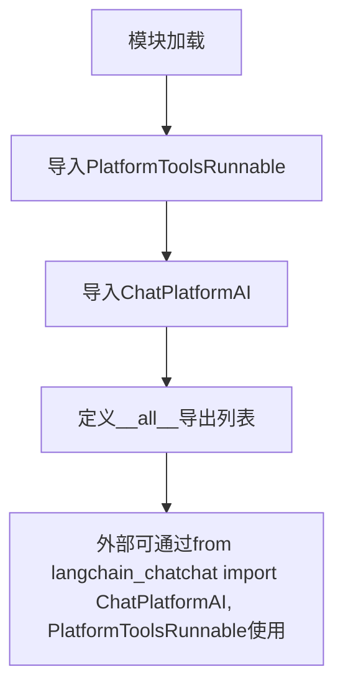

# `Langchain-Chatchat\libs\chatchat-server\langchain_chatchat\__init__.py` 详细设计文档

这是一个LangChain ChatChat项目的模块初始化文件，主要用于导出平台化的AI聊天模型ChatPlatformAI和平台工具可运行组件PlatformToolsRunnable，为外部使用者提供统一的API入口。

## 整体流程



## 类结构

```
langchain_chatchat (包根模块)
├── ChatPlatformAI (聊天模型类)
└── PlatformToolsRunnable (工具运行组件类)
```

## 全局变量及字段


### `__all__`
    
定义模块的公共API，指定哪些名称可以被 from module import * 导入

类型：`list[str]`
    


    

## 全局函数及方法


## 关键组件


### 一段话描述

该代码是 langchain_chatchat 项目的入口模块，通过导出 `ChatPlatformAI` 聊天模型类和 `PlatformToolsRunnable` 平台工具运行器，为上层应用提供与平台AI交互的核心接口。

### 文件的整体运行流程

该模块作为包级别导出文件，首先通过 import 语句从同包路径导入核心类，然后通过 `__all__` 列表显式声明公开 API。当其他模块使用 `from langchain_chatchat import ChatPlatformAI, PlatformToolsRunnable` 时，Python 会自动加载这两个类供外部调用。

### 类的详细信息

#### ChatPlatformAI

**描述**：平台聊天模型封装类，用于与底层AI平台进行对话交互。

**导出路径**：`langchain_chatchat.chat_models.ChatPlatformAI`

**使用方式**：作为 LangChain 的 ChatModel 使用，支持流式输出、工具调用等功能。

#### PlatformToolsRunnable

**描述**：平台工具可运行类，继承自 LangChain 的 Runnable 接口，用于执行平台提供的各种工具。

**导出路径**：`langchain_chatchat.agents.PlatformToolsRunnable`

**使用方式**：作为 LangChain 链式调用的一部分，支持工具调用、代理执行等能力。

### 关键组件信息

- **ChatPlatformAI** - 聊天模型核心类，提供与平台AI的对话能力
- **PlatformToolsRunnable** - 工具运行器基类，支持平台工具的链式调用
- **__all__** - 显式导出列表，定义模块的公共接口

### 潜在的技术债务或优化空间

1. **缺少类型注解** - 导出类未添加类型注解，影响静态分析和IDE支持
2. **模块粒度较粗** - 两个类分别来自不同模块（chat_models 和 agents），在同一个文件中导出可能造成耦合
3. **文档缺失** - 缺少模块级和类级的文档字符串

### 其它项目

- **设计目标**：提供统一的平台AI交互接口，遵循 LangChain 的 Runnable 协议
- **接口契约**：依赖 langchain_chatchat 内部模块，需保持向后兼容
- **错误处理**：由底层模块 ChatPlatformAI 和 PlatformToolsRunnable 各自实现


## 问题及建议


### 已知问题

- **缺乏模块级文档字符串**：代码未提供模块功能说明，开发者无法快速理解该模块的用途和职责
- **导入语句无错误处理**：直接导入 `PlatformToolsRunnable` 和 `ChatPlatformAI`，若 `langchain_chatchat` 依赖包缺失或版本不兼容，会导致整个包无法导入，缺乏容错机制
- **`__all__` 定义不完整/不明确**：仅列出两个类，未说明导出策略和模块职责边界
- **缺少版本控制和依赖声明**：未指定 `langchain_chatchat` 的版本要求，可能导致依赖兼容性问题
- **缺乏类型注解**：未提供任何类型提示信息，不利于静态分析和IDE支持
- **重导出模式风险**：直接重导出第三方类，可能暴露内部实现细节，降低模块抽象层级

### 优化建议

- **添加模块文档字符串**：在文件开头添加 `"""..."""` 说明模块功能（如：提供 ChatPlatformAI 聊天模型和 PlatformToolsRunnable 工具运行时的公共接口）
- **添加导入错误处理**：使用 `try-except` 包装导入语句，提供有意义的错误信息或延迟导入
- **完善 `__all__` 注释**：在 `__all__` 附近添加注释说明每个导出类的用途
- **添加类型注解**：为导入的类添加类型注解（如 `from typing import TYPE_CHECKING`）
- **版本和依赖声明**：在文档或 `pyproject.toml`/`setup.py` 中明确 `langchain_chatchat` 的版本约束
- **考虑接口抽象**：若这两个类为核心接口，可考虑定义抽象基类或协议，提高代码可测试性和可替换性

## 其它


### 项目背景与定位

本文件为langchain_chatchat包的初始化模块（__init__.py），位于langchain_chatchat包的核心接口层。该模块作为包的公共API导出点，统一对外暴露PlatformToolsRunnable和ChatPlatformAI两个核心类，实现模块间的解耦和接口抽象。

### 整体架构设计

本模块采用典型的模块导出接口模式，通过__all__定义公开API。整体架构分为三个层次：顶层为包初始化模块（当前文件），中间层为agents模块和chat_models模块，底层为langchain框架和可能的AI平台集成。这种分层设计遵循了Python包的最佳实践，使外部调用者只需导入langchain_chatchat包即可获取所需的核心组件。

### 全局变量详情

| 名称 | 类型 | 描述 |
|------|------|------|
| __all__ | list | 定义模块的公开API接口列表，包含ChatPlatformAI和PlatformToolsRunnable两个导出类 |

### 关键组件信息

| 组件名称 | 描述 |
|----------|------|
| ChatPlatformAI | 聊天模型封装类，继承自LangChain的BaseChatModel，用于与AI平台交互 |
| PlatformToolsRunnable | 平台工具运行器类，继承自LangChain的Runnable接口，用于执行平台提供的工具 |

### 外部依赖与接口契约

本模块依赖于langchain_chatchat.agents和langchain_chatchat.chat_models两个子模块。接口契约包括：ChatPlatformAI需实现LangChain的聊天模型接口（invoke方法），PlatformToolsRunnable需实现LangChain的Runnable接口（invoke和batch方法）。外部调用者应确保langchain_chatchat包正确安装，且版本兼容。

### 设计目标与约束

主要设计目标包括：提供统一的包入口点、遵循LangChain的接口规范、实现AI平台工具调用能力。设计约束包括：必须保持与LangChain框架的兼容性、导出类需继承或实现LangChain的标准接口、__all__列表应保持稳定以保证向后兼容。

### 错误处理与异常设计

由于本文件仅为导入和导出声明，不包含具体业务逻辑，因此错误处理由底层模块（langchain_chatchat.agents和langchain_chatchat.chat_models）负责。潜在异常包括导入错误（ImportError）、属性错误（AttributeError）和底层模块抛出的业务异常。调用者应捕获导入时的ModuleNotFoundError以处理包未安装情况。

### 数据流与状态机

本文件不涉及运行时数据流或状态机设计。数据流发生在外部调用者导入本模块后，创建ChatPlatformAI或PlatformToolsRunnable实例并调用其方法时。状态管理由具体类的实例负责，不在本模块范围内。

### 潜在技术债务与优化空间

当前模块设计简洁，但也存在以下优化空间：缺少版本信息导出（建议添加__version__）、缺少类型提示（typing.pyi文件）、缺少详细的模块文档字符串（docstring）、未提供子模块的延迟导入机制以优化启动性能、可考虑添加deprecationwarnings以提示接口变更。此外，当前导出项较少，如有更多公共组件应考虑分组导出或添加__getattr__实现动态导入。

### 版本兼容性说明

本模块的接口稳定性依赖于langchain_chatchat包的版本管理。建议外部项目锁定langchain_chatchat的版本范围，避免因底层模块接口变更导致的不兼容问题。当前代码未指定版本约束，使用者需自行确保版本兼容性。

    