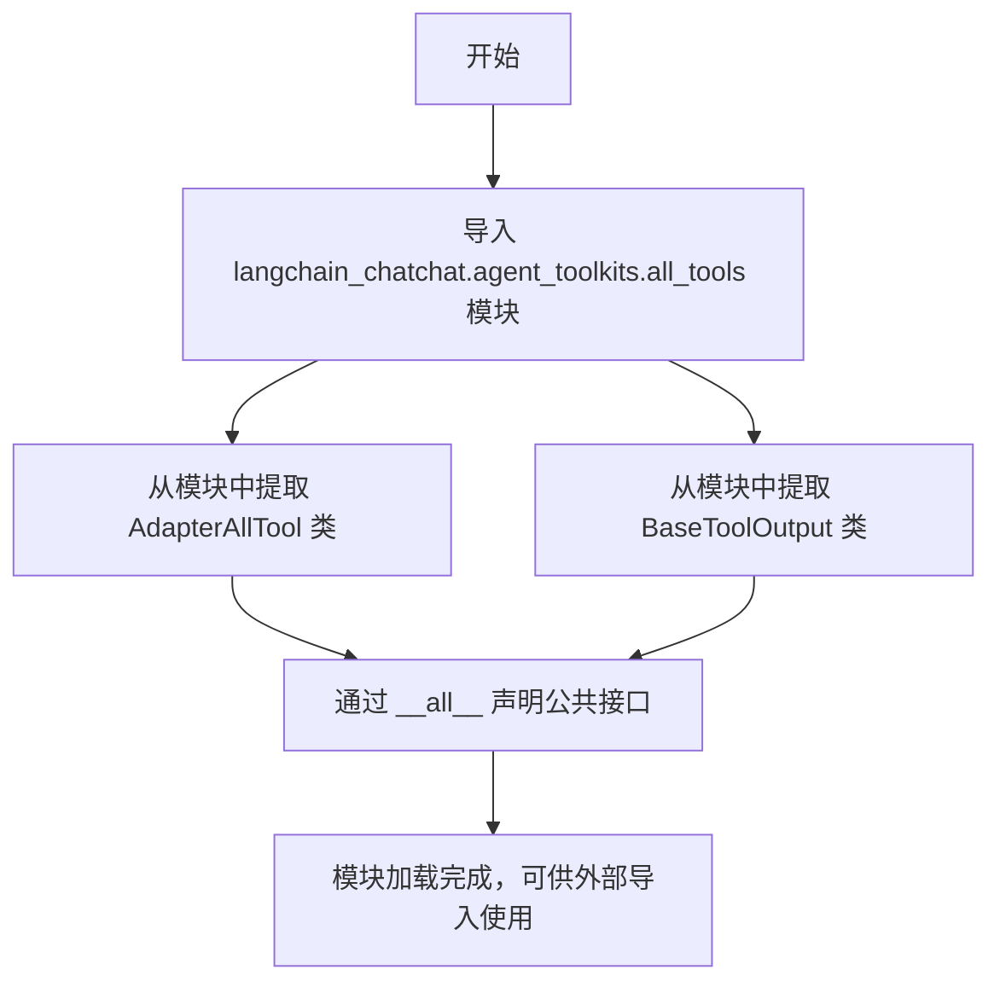

# `Langchain-Chatchat\libs\chatchat-server\langchain_chatchat\agent_toolkits\__init__.py` 详细设计文档

该文件是 langchain_chatchat 项目的 agent_toolkits 模块的入口文件，主要用于从 all_tools 子模块中导入 AdapterAllTool 和 BaseToolOutput 两个核心工具类，并通过 __all__ 显式声明公共API接口，供外部模块调用。

## 整体流程



## 类结构

```
导入的外部类（非本文件定义）
├── AdapterAllTool
│   └── 工具适配器基类
└── BaseToolOutput
    └── 工具输出基类
```

## 全局变量及字段


### `__all__`
    
定义模块的公开API接口，指定了哪些符号可以被 from module import * 导入

类型：`List[str]`
    


    

## 全局函数及方法


## 关键组件


### BaseToolOutput

工具输出基类，定义工具执行结果的标准数据结构，用于规范化工具返回值的类型和格式。

### AdapterAllTool

适配器工具类，用于集成和管理所有可用工具的适配器，实现工具的统一调用和协调。

### langchain_chatchat.agent_toolkits.all_tools

外部工具模块依赖，提供ChatChat框架中的工具适配器和输出基类的实现。


## 问题及建议


### 已知问题

-   **空模块设计**：该文件仅为简单的导入重导出操作，没有任何实质性实现，属于"空壳模块"，增加了项目结构的复杂度而未提供额外价值
-   **缺少文档字符串**：模块级别完全没有文档说明，开发者无法理解该模块的存在目的和业务意义
-   **Python 3中编码声明冗余**：在Python 3环境下，`# -*- coding: utf-8 -*-` 声明是多余的（UTF-8已是默认编码）
-   **缺乏版本控制**：没有 `__version__` 或相关版本管理字段，无法追踪模块版本变更历史

### 优化建议

-   **添加文档字符串**：在模块开头添加模块级docstring，说明该模块的业务定位（例如："提供工具适配器的统一入口"）
-   **移除冗余编码声明**：删除 `# -*- coding: utf-8 -*-` 这行无用代码
-   **评估模块必要性**：确认该模块是否真正需要，如果只是为了简化导入路径，建议在项目文档中明确说明其设计意图
-   **考虑添加类型注解和重导出说明**：如有必要，可在docstring中说明这些类是从上游模块重导出的原因（如API稳定性考虑）
-   **添加版本信息**：如有需要，可添加 `__version__ = "0.1.0"` 等版本标识


## 其它


### 设计目标与约束

本模块作为langchain_chatchat项目的工具适配器重导出模块，主要目标是将`langchain_chatchat.agent_toolkits.all_tools`中的核心工具类统一对外暴露，提供清晰的API接口契约。设计约束包括：必须保持与上游模块的版本兼容性，仅重导出经过验证的稳定接口，不引入额外的业务逻辑。

### 错误处理与异常设计

本模块本身不涉及复杂的错误处理逻辑，主要依赖上游模块`langchain_chatchat.agent_toolkits.all_tools`抛出的异常。BaseToolOutput可能包含工具执行失败时的错误信息，调用方需检查其status字段以判断执行是否成功。AdapterAllTool在工具适配过程中可能抛出ValidationError或ImportError等异常。

### 数据流与状态机

该模块为纯导入重导出类型，不涉及复杂的数据流或状态机。数据流方向为：外部模块 → 本模块 → langchain_chatchat.agent_toolkits.all_tools → 具体工具实现。BaseToolOutput作为工具输出的数据结构载体，在工具执行完成后承载结果或错误信息。

### 外部依赖与接口契约

主要外部依赖为`langchain_chatchat.agent_toolkits.all_tools`模块，依赖版本需与项目主版本保持一致。接口契约包括：AdapterAllTool需实现工具适配协议，BaseToolOutput需包含status、output、error等标准字段。调用方应通过from langchain_chatchat.agent_toolkits.all_tools import导入，或使用__all__定义的接口。

### 性能考虑

本模块为纯导入重导出，不引入额外性能开销。性能瓶颈主要在下游工具的实际执行过程。

### 安全考虑

本模块不涉及敏感数据处理或权限控制。安全考量主要在于调用方使用AdapterAllTool时需确保工具来源可信，避免执行恶意自定义工具。

### 使用示例

```python
from langchain_chatchat.agent_toolkits.all_tools import AdapterAllTool, BaseToolOutput

# 使用适配器加载工具
adapter = AdapterAllTool()
tools = adapter.get_tools()

# 执行工具并获取输出
output = tool.invoke(input_data)
if output.status == "success":
    result = output.output
```


    