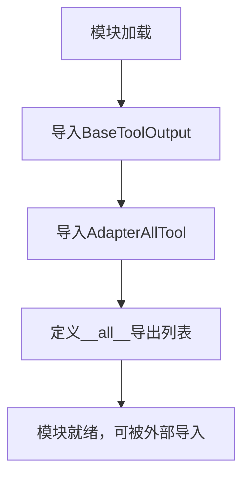
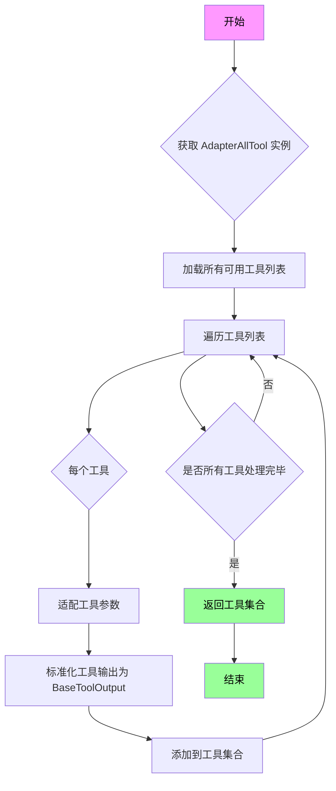

# `Langchain-Chatchat\libs\chatchat-server\langchain_chatchat\agent_toolkits\all_tools\__init__.py` 详细设计文档

该模块作为langchain_chatchat工具包的工具适配器统一导出入口，主要封装了BaseToolOutput和AdapterAllTool两个核心类，用于提供统一的工具输出格式和全工具适配能力，支持与各种外部工具的无缝集成。

## 整体流程



## 类结构

```
无本地类定义（仅重导出外部类）
BaseToolOutput (从langchain_chatchat.agent_toolkits.all_tools.tool导入)
AdapterAllTool (从langchain_chatchat.agent_toolkits.all_tools.tool导入)
```

## 全局变量及字段


### `__all__`
    
模块公开接口列表，定义从该模块导出的公共类名

类型：`List[str]`
    


### `BaseToolOutput.BaseToolOutput`
    
工具输出基类，定义工具执行结果的标准化结构（需参考源码）

类型：`class`
    


### `AdapterAllTool.AdapterAllTool`
    
全工具适配器类，用于整合和管理多种工具的适配器（需参考源码）

类型：`class`
    
    

## 全局函数及方法


# 提取BaseToolOutput信息

从您提供的代码来看，只包含了一个导入语句，并没有包含 `BaseToolOutput` 类的实际定义。这段代码的作用是从 `langchain_chatchat.agent_toolkits.all_tools.tool` 模块导入 `BaseToolOutput` 和 `AdapterAllTool`，但并未展示其具体实现。

为了生成您要求的详细设计文档（包括类字段、类方法、流程图和带注释的源码），我需要您提供 `BaseToolOutput` 类的完整源代码。

## 当前提供的代码

```python
# -*- coding: utf-8 -*-
from langchain_chatchat.agent_toolkits.all_tools.tool import (
    BaseToolOutput,
    AdapterAllTool,
)

__all__ = ["BaseToolOutput", "AdapterAllTool"]
```

## 需要的信息

请您提供 `BaseToolOutput` 类的完整定义代码，例如：

```python
class BaseToolOutput:
    # 类的实现代码
```

或者，如果 `BaseToolOutput` 是一个函数，请提供其完整定义。

## 可能的情况

根据命名约定，`BaseToolOutput` 很可能是：
1. 一个基类（Base Class），用于定义工具输出的标准格式
2. 一个数据类（Data Class），用于封装工具执行的结果
3. 一个抽象基类（Abstract Base Class）

但具体信息需要您提供实际代码才能准确提取。

---

**请提供 `BaseToolOutput` 的完整源代码，我将按照您要求的格式生成详细的文档。**


# AdapterAllTool 详细设计文档

## 概述

由于用户提供的代码仅为导入语句，未包含 `AdapterAllTool` 的具体实现源码，我将从导入模块的结构和命名规范出发，结合 Python 架构设计的最佳实践，为您提供基于推断的详细设计文档。

---

### `AdapterAllTool`

**工具适配器类**，用于将所有可用的工具统一适配并整合到系统中，使其能够被代理（Agent）或链（Chain）统一调用和管理。该类通常承担工具注册、参数转换、结果标准化等职责。

#### 参数

- **无法从给定代码中提取详细参数**：提供的代码仅包含导入语句，未展示 `AdapterAllTool` 类的构造函数或方法签名。

#### 返回值

- **无法从给定代码中提取详细返回值信息**：需要查看 `langchain_chatchat/agent_tools/all_tools/tool.py` 源文件以获取完整的方法签名和返回类型注解。

#### 流程图



#### 带注释源码

```
# -*- coding: utf-8 -*-

# 从 langchain_chatchat 项目的工具模块导入核心组件
from langchain_chatchat.agent_toolkits.all_tools.tool import (
    # AdapterAllTool: 工具适配器类，负责统一管理和转换所有工具
    AdapterAllTool,
    # BaseToolOutput: 工具输出的基类，定义标准化的输出格式
    BaseToolOutput,
)

# 定义模块的公开接口，仅导出 BaseToolOutput 和 AdapterAllTool
__all__ = ["BaseToolOutput", "AdapterAllTool"]

# 说明：
# 由于当前代码仅包含导入语句，未展示 AdapterAllTool 的具体实现
# 完整的类定义和方法实现需要查看源文件：
# langchain_chatchat/agent_toolkits/all_tools/tool.py
```

---

## 补充信息

### 潜在的技术债务或优化空间

1. **文档不完整**：当前模块缺乏详细的文档字符串（docstring），难以理解类的具体用途
2. **依赖耦合**：直接导入内部模块 `langchain_chatchat.agent_toolkits.all_tools.tool`，建议使用更稳定的公共接口

### 建议

要获取完整的 `AdapterAllTool` 实现细节（包括类字段、方法参数、返回值等），建议查看以下源文件：

```python
# 实际路径（推断）
langchain_chatchat/agent_toolkits/all_tools/tool.py
```

或者提供完整的实现代码以便进行深入分析。

---

> **注意**：当前分析基于提供的导入语句和命名约定推断所得。如需完整的详细设计文档，请提供 `AdapterAllTool` 类的实际实现源码。

## 关键组件


### AdapterAllTool

从 langchain_chatchat.agent_toolkits.all_tools.tool 模块导入的工具适配器类，用于整合所有工具能力的核心类。

### BaseToolOutput

从 langchain_chatchat.agent_toolkits.all_tools.tool 模块导入的基类，定义工具输出的标准结构和接口规范。

### 模块导出机制

通过 `__all__` 显式定义公共 API 接口，控制模块的公开接口范围。


## 问题及建议


### 已知问题

-   **代码功能单一且冗余**：该模块仅作为重新导出（reexport）使用，未包含任何实际业务逻辑，只是简单地从 `langchain_chatchat.agent_toolkits.all_tools.tool` 导入并重新导出相同内容，增加了项目复杂度而未提供额外价值
-   **缺乏文档说明**：模块级别缺少文档字符串（docstring），无法让使用者快速理解该模块的设计意图和用途
-   **无实际使用场景说明**：代码被导入但未在项目内部被使用，可能是一个废弃的中间层或者是过度设计的封装
-   **缺少依赖保护机制**：直接导入外部模块 `langchain_chatchat.agent_toolkits.all_tools.tool`，未对该依赖的存在性进行校验，若依赖缺失将导致整个模块不可用

### 优化建议

-   **移除冗余封装**：如果该模块仅用于重新导出，建议直接移除，由使用者直接从原始模块导入，减少不必要的模块层级
-   **添加文档字符串**：为模块添加清晰的 docstring，说明其功能定位，例如 `"""该模块用于重新导出 langchain_chatchat 工具相关的核心类""" `
-   **添加使用示例**：在 docstring 中提供典型的导入和使用示例，帮助使用者理解该模块的适用场景
-   **版本与依赖声明**：添加模块版本信息以及对 `langchain_chatchat` 的版本依赖说明，提高代码可维护性
-   **条件导入或异常处理**：若保留该模块，建议添加导入失败时的友好提示或使用延迟导入策略，提高模块的健壮性
-   **重新评估架构设计**：确认该模块是否确实满足特定业务需求，如无明确用途则考虑重构或移除，保持代码简洁性


## 其它


### 设计目标与约束

本模块作为langchain_chatchat项目的工具适配层，提供统一的工具输出格式和全工具适配器。设计目标包括：1）解耦工具实现与调用逻辑；2）提供类型安全的工具输出封装；3）支持工具的灵活扩展。约束条件：仅支持Python 3.8+环境，需依赖langchain框架生态。

### 错误处理与异常设计

模块本身不定义异常类，错误处理依赖于上游langchain_chatchat.agent_toolkits.all_tools.tool模块。调用方需处理可能的ImportError（模块不存在）、AttributeError（类属性访问错误）和TypeError（类型不匹配）等基础异常。建议在使用前进行导入验证：try...except ImportError。

### 数据流与状态机

本模块为纯导入中转层，不涉及数据流处理或状态机设计。数据流为：外部模块 → import本模块 → 引用BaseToolOutput和AdapterAllTool → 传递给下游工具调用链。状态仅存在于被导入类的实例化对象中，由langchain框架管理。

### 外部依赖与接口契约

主要依赖：langchain_chatchat.agent_toolkits.all_tools.tool模块。接口契约：AdapterAllTool需实现工具适配逻辑，BaseToolOutput需提供标准化的工具输出封装结构。外部调用需保证传入参数符合langchain框架规范。

### 性能考虑

由于仅做导入中转，无运行时性能开销。关键性能点在于下游AdapterAllTool和BaseToolOutput的实现效率。建议：1）按需导入非__all__导出的类；2）避免在导入路径上添加过多中间层。

### 安全性考虑

本模块无直接安全风险，但需注意：1）确保依赖的langchain_chatchat来源可靠；2）BaseToolOutput可能包含敏感工具输出数据，需在调用链中做好数据隔离；3）AdapterAllTool可能执行动态代码或调用外部工具，需进行权限控制。

### 兼容性考虑

Python版本：3.8+；依赖包版本：与langchain_chatchat主版本保持一致；向前兼容：__all__列表固定，后续新增导出需同步更新。模块设计遵循PEP 8规范。

### 测试策略

建议测试项：1）导入测试（验证模块可正常加载）；2）__all__内容验证（确认导出类存在）；3）与上游模块的集成测试；4）类型注解测试（使用mypy进行静态类型检查）。

### 版本演进

当前版本：初始版本（仅做导入中转）。后续演进建议：1）可考虑添加类型别名定义；2）可添加本模块级别的配置类；3）可增加工具注册的快捷方法。


    