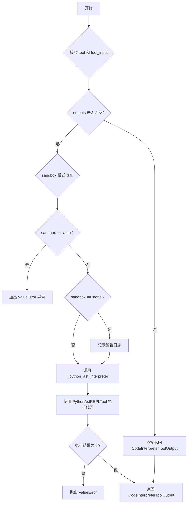
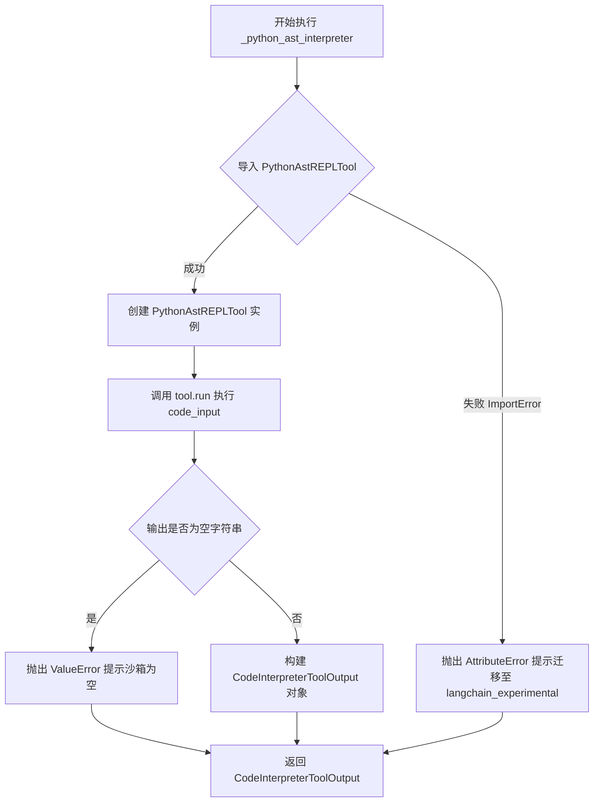
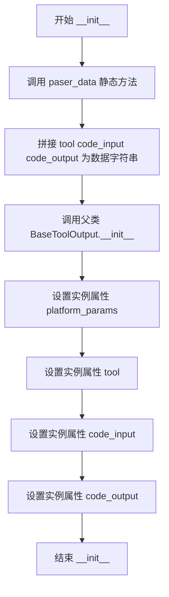
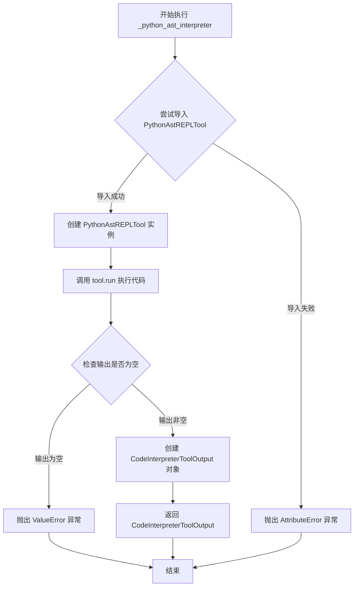
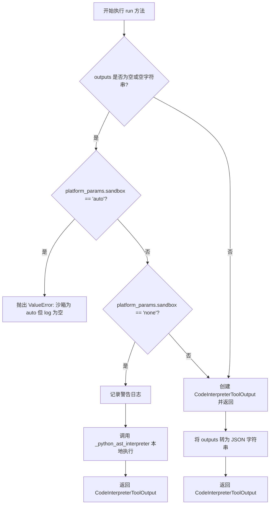
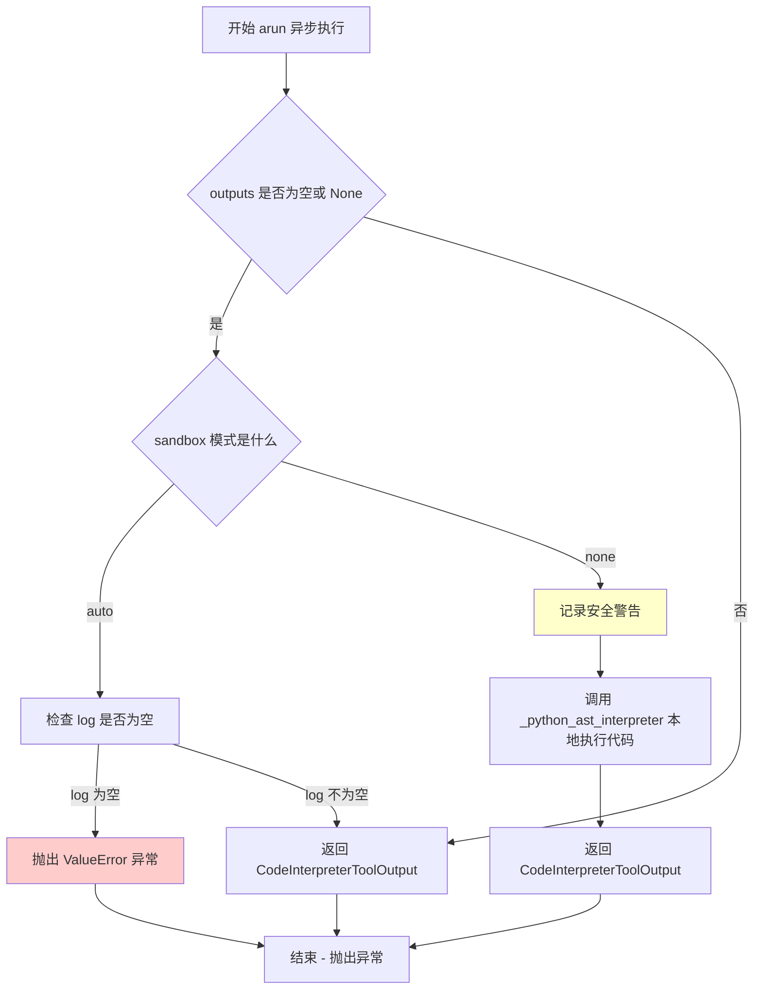
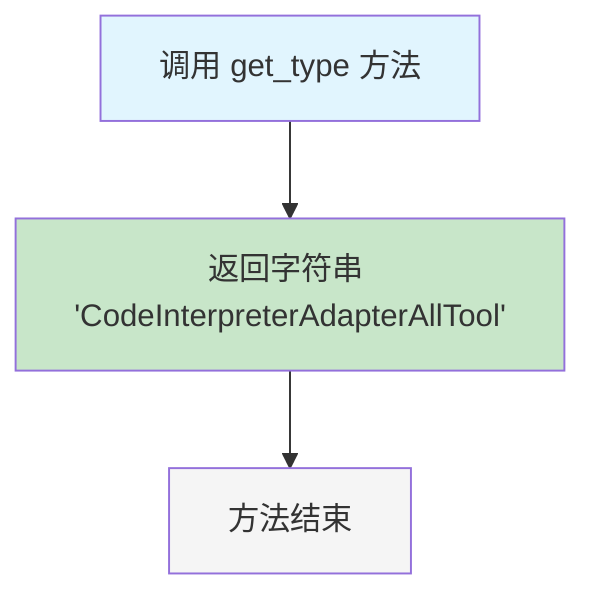
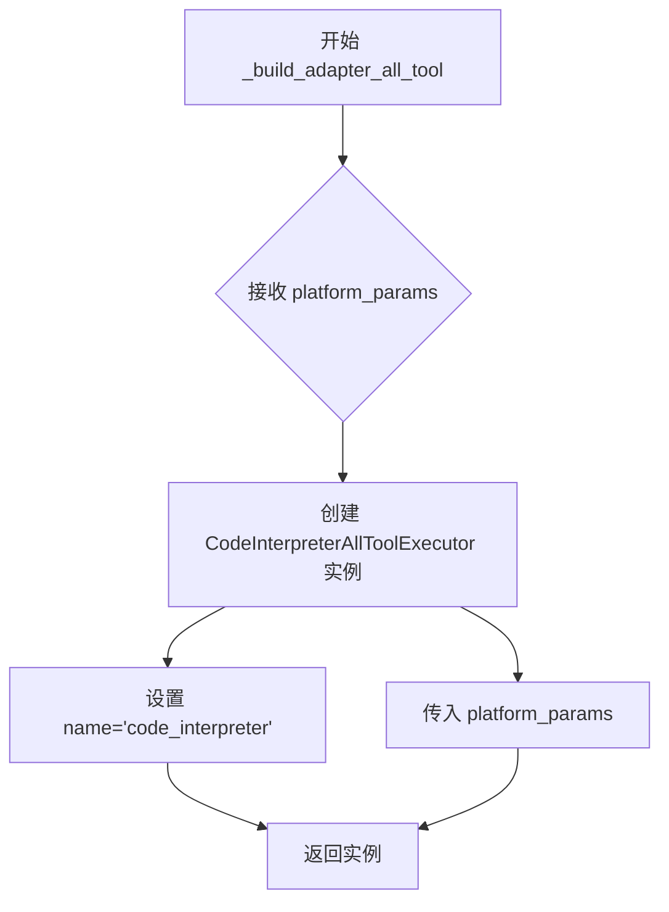

# `Langchain-Chatchat\libs\chatchat-server\langchain_chatchat\agent_toolkits\all_tools\code_interpreter_tool.py` 详细设计文档

该代码实现了一个代码解释器工具适配器，用于在langchain_chatchat项目中安全地执行Python代码。它提供了同步和异步执行能力，支持沙箱模式选择（auto/none），通过PythonAstREPLTool在本地沙箱中执行Python代码，并将执行结果封装为结构化输出返回给上层Agent系统。

## 整体流程



## 类结构

```
BaseToolOutput (langchain_chatchat)
└── CodeInterpreterToolOutput

AllToolExecutor (langchain_chatchat)
└── CodeInterpreterAllToolExecutor

AdapterAllTool (langchain_chatchat)
└── CodeInterpreterAdapterAllTool
```

## 全局变量及字段


### `logger`
    
模块级日志记录器

类型：`logging.Logger`
    


### `CodeInterpreterToolOutput.platform_params`
    
平台参数配置

类型：`Dict[str, Any]`
    


### `CodeInterpreterToolOutput.tool`
    
工具名称

类型：`str`
    


### `CodeInterpreterToolOutput.code_input`
    
输入的代码字符串

类型：`str`
    


### `CodeInterpreterToolOutput.code_output`
    
代码执行结果

类型：`Dict[str, Any]`
    


### `CodeInterpreterAllToolExecutor.name`
    
工具执行器名称

类型：`str`
    
    

## 全局函数及方法


### `CodeInterpreterToolOutput.paser_data`

静态方法，解析并格式化工具输出数据，将工具名称、代码输入和代码输出合并为一个格式化的字符串。

参数：

- `tool`：`str`，工具名称，用于标识执行代码的解释器类型
- `code_input`：`str`，代码输入，即需要执行的 Python 代码字符串
- `code_output`：`Dict[str, Any]`，代码执行后的输出结果，以字典形式存储

返回值：`str`，格式化后的字符串，包含工具访问信息、消息和代码输出

#### 流程图

```mermaid
flowchart TD
    A[开始 paser_data] --> B[接收参数 tool, code_input, code_output]
    B --> C[格式化字符串]
    C --> D[返回格式化字符串]
    
    subgraph 格式化逻辑
    C1[f"Access: {tool}"] --> C2[添加 Message: {code_input}]
    C2 --> C3[添加 ,{code_output}]
    C3 --> C4[合并为完整字符串]
    end
```

#### 带注释源码

```python
@staticmethod
def paser_data(tool: str, code_input: str, code_output: Dict[str, Any]) -> str:
    """
    静态方法：解析并格式化工具输出数据
    
    参数:
        tool: str - 工具名称，用于标识执行代码的解释器类型（如 'python'）
        code_input: str - 用户输入的需要执行的 Python 代码字符串
        code_output: Dict[str, Any] - 代码执行后的输出结果字典
    
    返回:
        str - 格式化后的字符串，包含工具访问信息、消息和代码输出
    
    示例:
        >>> paser_data('python', 'print(1+1)', {'result': 2})
        'Access：python, Message: print(1+1),{'result': 2}'
    """
    # 使用 f-string 格式化输出字符串
    # 将工具名、代码输入和代码输出拼接为统一格式
    return f"""Access：{tool}, Message: {code_input},{code_output}"""
```

---

#### 补充说明

| 项目 | 描述 |
|------|------|
| **设计目标** | 将 CodeInterpreter 工具的多维度输出（工具名、输入代码、执行结果）统一格式化为字符串，便于日志记录和结果展示 |
| **约束条件** | 该方法为静态方法，不依赖实例状态；返回格式为固定模板的字符串 |
| **潜在技术债务** | 1. 方法名 `paser_data` 存在拼写错误，应为 `parse_data`<br>2. 返回格式缺乏结构化，建议使用 JSON 或专用数据类以提高可读性和可解析性<br>3. 代码输出直接转换为字符串可能丢失类型信息 |
| **优化空间** | 1. 修复拼写错误以提升代码可读性<br>2. 考虑返回结构化数据（如 dataclass 或 JSON）而非字符串<br>3. 可添加参数校验以增强健壮性 |
| **调用场景** | 在 `CodeInterpreterToolOutput.__init__` 构造函数中被调用，用于初始化父类 `BaseToolOutput` 的数据字段 |


### `CodeInterpreterAllToolExecutor._python_ast_interpreter`

该静态方法是代码解释器的核心执行单元，通过调用 `langchain_experimental.tools.PythonAstREPLTool` 在本地沙箱环境中执行用户输入的 Python 代码，并将执行结果封装为 `CodeInterpreterToolOutput` 对象返回，同时处理可能的导入错误和空输出异常。

参数：

- `code_input`：`str`，待执行的 Python 代码字符串
- `platform_params`：`Dict[str, Any]`，可选，平台相关参数字典，用于传递沙箱配置等信息

返回值：`CodeInterpreterToolOutput`，包含工具名称、输入代码、输出结果和平台参数的执行结果对象

#### 流程图



#### 带注释源码

```python
@staticmethod
def _python_ast_interpreter(
    code_input: str, platform_params: Dict[str, Any] = None
):
    """Use Shell to execute system shell commands"""
    # 尝试导入 PythonAstREPLTool，若失败则提示用户使用 langchain_experimental
    try:
        from langchain_experimental.tools import PythonAstREPLTool

        # 创建 Python AST REPL 工具实例，用于执行 Python 代码
        tool = PythonAstREPLTool()
        # 在工具中运行输入的代码，获取执行结果
        out = tool.run(tool_input=code_input)
        # 检查执行结果是否为空，若为空则抛出异常（沙箱可能未正常执行）
        if str(out) == "":
            raise ValueError(f"Tool {tool.name} local sandbox is out empty")
        # 将执行结果封装为 CodeInterpreterToolOutput 对象返回
        return CodeInterpreterToolOutput(
            tool=tool.name,
            code_input=code_input,
            code_output=out,
            platform_params=platform_params,
        )
    except ImportError:
        # 处理导入失败情况，提示工具已迁移至 langchain experimental
        raise AttributeError(
            "This tool has been moved to langchain experiment. "
            "This tool has access to a python REPL. "
            "For best practices make sure to sandbox this tool. "
            "Read https://github.com/langchain-ai/langchain/blob/master/SECURITY.md "
            "To keep using this code as is, install langchain experimental and "
            "update relevant imports replacing 'langchain' with 'langchain_experimental'"
        )
```


### `CodeInterpreterToolOutput.__init__`

初始化工具输出对象，设置平台参数、工具名称、代码输入和代码输出，并将这些信息传递给父类进行统一处理。

参数：

- `tool`：`str`，工具名称，表示代码解释器的工具名称
- `code_input`：`str`，代码输入内容，表示需要执行的代码字符串
- `code_output`：`Dict[str, Any]`，代码输出结果，表示代码执行后返回的字典结果
- `platform_params`：`Dict[str, Any]`，平台参数字典，包含平台相关的配置参数
- `**extras`：`Any`，额外关键字参数，用于传递父类需要的额外参数

返回值：`None`，该方法为构造函数，不返回任何值

#### 流程图



#### 带注释源码

```python
def __init__(
    self,
    tool: str,
    code_input: str,
    code_output: Dict[str, Any],
    platform_params: Dict[str, Any],
    **extras: Any,
) -> None:
    """
    初始化 CodeInterpreterToolOutput 对象
    
    参数:
        tool: 工具名称
        code_input: 代码输入内容
        code_output: 代码执行结果字典
        platform_params: 平台参数字典
        extras: 传递给父类的额外关键字参数
    """
    # 使用静态方法 paser_data 将参数组合成数据字符串
    # 格式: "Access：{tool}, Message: {code_input},{code_output}"
    data = CodeInterpreterToolOutput.paser_data(
        tool=tool, code_input=code_input, code_output=code_output
    )
    
    # 调用父类 BaseToolOutput 的初始化方法
    # 传入数据、空字符串（可能用于其他占位参数）
    super().__init__(data, "", "", **extras)
    
    # 设置实例属性 platform_params，存储平台相关参数
    self.platform_params = platform_params
    
    # 设置实例属性 tool，存储工具名称
    self.tool = tool
    
    # 设置实例属性 code_input，存储输入的代码
    self.code_input = code_input
    
    # 设置实例属性 code_output，存储代码执行结果
    self.code_output = code_output
```


### `CodeInterpreterToolOutput.paser_data`

该静态方法用于将代码解释器的工具名称、代码输入和代码输出整合成一个格式化的字符串描述，便于日志记录、调试和监控。它接收三个参数：工具名称、代码输入和代码输出字典，并返回包含这些信息的格式化字符串。

参数：

- `tool`：`str`，代码解释器的工具名称，用于标识所使用的工具
- `code_input`：`str`，用户输入的待执行代码内容
- `code_output`：`Dict[str, Any]`，代码执行后的输出结果，以字典形式存储

返回值：`str`，格式化后的字符串，格式为 `"Access：{tool}, Message: {code_input},{code_output}"`

#### 流程图

```mermaid
flowchart TD
    A[开始 paser_data] --> B[接收参数 tool, code_input, code_output]
    B --> C[使用 f-string 格式化字符串]
    C --> D[构建输出字符串: 'Access: {tool}, Message: {code_input},{code_output}']
    D --> E[返回格式化后的字符串]
    E --> F[结束]
```

#### 带注释源码

```python
@staticmethod
def paser_data(tool: str, code_input: str, code_output: Dict[str, Any]) -> str:
    """
    静态方法：解析和格式化输出数据
    
    参数:
        tool: str - 代码解释器的工具名称
        code_input: str - 待执行的代码输入
        code_output: Dict[str, Any] - 代码执行后的输出结果
    
    返回:
        str - 格式化后的字符串，格式为 "Access：{tool}, Message: {code_input},{code_output}"
    """
    return f"""Access：{tool}, Message: {code_input},{code_output}"""
```

---

### 1. 类整体信息

#### `CodeInterpreterToolOutput` 类

该类继承自 `BaseToolOutput`，用于封装代码解释器工具的输出结果，包含平台参数、工具名称、代码输入和代码输出等核心字段，并通过 `paser_data` 方法格式化输出数据。

类字段：

- `platform_params`：`Dict[str, Any]`，平台参数配置字典
- `tool`：`str`，工具名称
- `code_input`：`str`，代码输入内容
- `code_output`：`Dict[str, Any]`，代码执行输出

---

### 2. 潜在技术债务与优化空间

| 序号 | 问题描述 | 优化建议 |
|------|----------|----------|
| 1 | 方法名 `paser_data` 存在拼写错误，应为 `parse_data` | 重命名方法以修正拼写错误 |
| 2 | 格式化字符串直接使用 f-string 当 code_output 为复杂字典时可能导致输出格式混乱 | 考虑使用 JSON 序列化或更优雅的格式化方式 |
| 3 | 返回值描述不够明确，缺少异常情况说明 | 添加异常处理文档和边界条件说明 |
| 4 | 该静态方法被 `__init__` 调用但未在其他地方复用，利用率存疑 | 评估是否需要将其提取为独立的工具类方法 |

---

### 3. 设计目标与约束

- **设计目标**：提供统一的代码解释器输出格式化能力，便于日志记录和监控
- **输入约束**：`tool` 和 `code_input` 应为有效字符串，`code_output` 应为字典类型
- **输出约束**：返回固定格式的字符串，不包含错误处理机制

---

### 4. 错误处理与异常设计

当前方法未包含显式的错误处理逻辑，存在以下潜在风险：

- 当 `code_input` 或 `code_output` 包含特殊字符时，格式化后的字符串可能难以解析
- 当 `code_output` 为空字典时，输出信息可能不够有意义

建议增加参数校验和异常抛出机制，以提高方法的健壮性。

---

### 5. 外部依赖与接口契约

- **依赖项**：无外部依赖，仅使用 Python 内置类型
- **接口契约**：
  - 输入：三个必需参数 `tool`、`code_input`、`code_output`
  - 输出：格式化的字符串
  - 调用方：`CodeInterpreterToolOutput.__init__` 方法


### `CodeInterpreterAllToolExecutor._python_ast_interpreter`

该函数是一个静态方法，用于通过 Python AST 解释器执行用户输入的代码。它尝试导入 `PythonAstREPLTool` 工具，在本地沙箱环境中运行代码，并返回包含执行结果的 `CodeInterpreterToolOutput` 对象。如果工具未安装或代码执行结果为空，则抛出相应的异常。

参数：

- `code_input`：`str`，用户输入的 Python 代码字符串，将被传递给 Python AST REPL 工具执行
- `platform_params`：`Dict[str, Any]`，可选参数，包含平台相关的配置参数，如沙箱设置等

返回值：`CodeInterpreterToolOutput`，返回包含工具名称、输入代码、输出结果和平台参数的输出对象

#### 流程图



#### 带注释源码

```python
@staticmethod
def _python_ast_interpreter(
    code_input: str, platform_params: Dict[str, Any] = None
):
    """Use Shell to execute system shell commands"""

    try:
        # 从 langchain_experimental.tools 导入 Python AST REPL 工具
        # 该工具提供一个安全的 Python REPL 环境，通过 AST 解析执行代码
        from langchain_experimental.tools import PythonAstREPLTool

        # 创建工具实例，用于执行 Python 代码
        tool = PythonAstREPLTool()
        
        # 使用工具执行输入的代码，获取执行结果
        out = tool.run(tool_input=code_input)
        
        # 检查执行结果是否为空，如果为空则抛出异常
        # 防止空的沙箱输出被误认为是正常执行结果
        if str(out) == "":
            raise ValueError(f"Tool {tool.name} local sandbox is out empty")
        
        # 返回包含执行结果的工具输出对象
        # 包含工具名称、原始输入代码、执行输出和平台参数
        return CodeInterpreterToolOutput(
            tool=tool.name,
            code_input=code_input,
            code_output=out,
            platform_params=platform_params,
        )
    except ImportError:
        # 处理 langchain_experimental 未安装的情况
        # 提供清晰的错误信息和迁移指南
        raise AttributeError(
            "This tool has been moved to langchain experiment. "
            "This tool has access to a python REPL. "
            "For best practices make sure to sandbox this tool. "
            "Read https://github.com/langchain-ai/langchain/blob/master/SECURITY.md "
            "To keep using this code as is, install langchain experimental and "
            "update relevant imports replacing 'langchain' with 'langchain_experimental'"
        )
```


### `CodeInterpreterAllToolExecutor.run`

该方法是 `CodeInterpreterAllToolExecutor` 类的核心同步执行方法，用于根据 `sandbox` 参数（沙箱模式）决定如何执行代码：当 `outputs` 为空时，若沙箱为 "auto" 则抛出异常，若为 "none" 则使用本地 Python AST REPL 工具执行代码；否则直接返回包含代码执行结果的 `CodeInterpreterToolOutput` 对象。

参数：

- `tool`：`str`，工具名称标识符
- `tool_input`：`str`，需要执行的代码输入内容
- `log`：`str`，执行日志信息
- `outputs`：`List[Union[str, dict]] = None`，外部执行后的输出结果列表，默认为 None
- `run_manager`：`Optional[CallbackManagerForToolRun] = None`，LangChain 工具运行的回调管理器，用于链式调用中的事件处理

返回值：`CodeInterpreterToolOutput`，封装了工具名称、代码输入、代码输出和平台参数的输出对象

#### 流程图



#### 带注释源码

```python
def run(
    self,
    tool: str,
    tool_input: str,
    log: str,
    outputs: List[Union[str, dict]] = None,
    run_manager: Optional[CallbackManagerForToolRun] = None,
) -> CodeInterpreterToolOutput:
    # 检查 outputs 是否为空（None 或空字符串）
    if outputs is None or str(outputs).strip() == "":
        # 获取 sandbox 参数，默认为 "auto"
        sandbox_mode = self.platform_params.get("sandbox", "auto")
        
        # 如果沙箱模式为 "auto" 且 log 为空，则抛出服务器错误
        if "auto" == sandbox_mode:
            raise ValueError(
                f"Tool {self.name} sandbox is auto , but log is None, is server error"
            )
        # 如果沙箱模式为 "none"，表示使用本地不安全执行
        elif "none" == sandbox_mode:
            logger.warning(
                f"Tool {self.name} sandbox is local!!!, this not safe, please use jupyter sandbox it"
            )
            # 调用本地 Python AST REPL 工具执行代码
            return self._python_ast_interpreter(
                code_input=tool_input, platform_params=self.platform_params
            )

    # outputs 不为空时，直接封装结果并返回
    return CodeInterpreterToolOutput(
        tool=tool,
        code_input=tool_input,
        code_output=json.dumps(outputs),  # 将 outputs 序列化为 JSON 字符串
        platform_params=self.platform_params,
    )
```


### `CodeInterpreterAllToolExecutor.arun`

该方法是 `CodeInterpreterAllToolExecutor` 类的异步执行方法，用于在代码解释器工具中异步执行代码。它根据沙箱模式（sandbox）配置处理不同的执行策略：当沙箱为"auto"且日志为空时抛出错误；当沙箱为"none"时在本地执行代码（存在安全警告）；否则返回包含输出结果的 `CodeInterpreterToolOutput` 对象。

参数：

- `tool`：`str`，工具名称，标识要执行的代码解释器工具
- `tool_input`：`str`，代码输入，要执行的 Python 代码字符串
- `log`：`str`，日志信息，记录工具执行的日志内容
- `outputs`：`Optional[List[Union[str, dict]]]`（可选，默认 `None`），工具输出列表，包含代码执行后的结果，可为字符串或字典类型
- `run_manager`：`Optional[AsyncCallbackManagerForToolRun]`（可选，默认 `None`），异步回调管理器，用于在工具执行过程中触发回调事件

返回值：`CodeInterpreterToolOutput`，返回包含工具名称、代码输入、代码输出和平台参数的代码解释器工具输出对象

#### 流程图



#### 带注释源码

```python
async def arun(
    self,
    tool: str,
    tool_input: str,
    log: str,
    outputs: List[Union[str, dict]] = None,
    run_manager: Optional[AsyncCallbackManagerForToolRun] = None,
) -> CodeInterpreterToolOutput:
    """Use the tool asynchronously."""
    # 检查 outputs 是否为空、None 或空字符串
    if outputs is None or str(outputs).strip() == "" or len(outputs) == 0:
        # 获取沙箱模式配置，默认为 "auto"
        if "auto" == self.platform_params.get("sandbox", "auto"):
            # auto 模式下要求 log 必须存在，否则为服务器错误
            raise ValueError(
                f"Tool {self.name} sandbox is auto , but log is None, is server error"
            )
        elif "none" == self.platform_params.get("sandbox", "auto"):
            # none 模式表示本地执行，记录不安全警告
            logger.warning(
                f"Tool {self.name} sandbox is local!!!, this not safe, please use jupyter sandbox it"
            )
            # 调用本地 Python AST 解释器执行代码
            return self._python_ast_interpreter(
                code_input=tool_input, platform_params=self.platform_params
            )

    # 正常情况：outputs 存在，将 outputs 序列化为 JSON 字符串并返回
    return CodeInterpreterToolOutput(
        tool=tool,
        code_input=tool_input,
        code_output=json.dumps(outputs),
        platform_params=self.platform_params,
    )
```


### `CodeInterpreterAdapterAllTool.get_type`

该方法是一个类方法，用于返回当前工具适配器的类型标识字符串，用于在系统中唯一标识该工具类型。

参数：
- `cls`：类本身（class method的隐含参数），无需显式传入

返回值：`str`，返回工具类型标识字符串 `"CodeInterpreterAdapterAllTool"`

#### 流程图



#### 带注释源码

```python
@classmethod
def get_type(cls) -> str:
    """
    获取工具类型标识符
    
    该类方法返回当前工具适配器的类型名称，用于在系统中
    标识和区分不同的工具适配器实现。
    
    Args:
        cls: 类本身，由 @classmethod 装饰器自动传入
        
    Returns:
        str: 工具类型标识字符串 "CodeInterpreterAdapterAllTool"
    """
    return "CodeInterpreterAdapterAllTool"
```

#### 技术说明

| 项目 | 说明 |
|------|------|
| **方法类型** | 类方法（@classmethod） |
| **访问级别** | 公开 |
| **设计目的** | 提供工具类型的静态标识，用于工厂模式或注册机制中识别具体工具实现 |
| **调用场景** | 通常在工具注册、类型检查、序列化/反序列化等场景中被调用 |
| **优化建议** | 当前实现已足够简洁，如需扩展可考虑将类型字符串定义为类常量以提高可维护性 |


### `CodeInterpreterAdapterAllTool._build_adapter_all_tool`

构建并返回一个配置好的 `CodeInterpreterAllToolExecutor` 实例，用于执行代码解释器工具。

参数：

- `self`：`CodeInterpreterAdapterAllTool`，当前适配器实例
- `platform_params`：`Dict[str, Any]`，平台参数字典，用于配置执行器的行为，如沙箱模式（sandbox）等

返回值：`CodeInterpreterAllToolExecutor`，代码解释器全工具执行器实例

#### 流程图



#### 带注释源码

```python
@classmethod
def get_type(cls) -> str:
    return "CodeInterpreterAdapterAllTool"

def _build_adapter_all_tool(
    self, platform_params: Dict[str, Any]
) -> CodeInterpreterAllToolExecutor:
    """
    构建并返回 CodeInterpreterAllToolExecutor 实例
    
    参数:
        platform_params: Dict[str, Any], 平台参数字典，用于配置执行器行为
            - sandbox: str, 沙箱模式，可选值: 'auto', 'none'
            - 其他平台特定配置参数
    
    返回值:
        CodeInterpreterAllToolExecutor: 配置好的代码解释器执行器实例
    
    功能说明:
        该方法是 AdapterAllTool 抽象类的实现，用于根据平台参数
        创建针对性的代码解释器执行器。每个执行器实例都绑定特定的
        工具名称 'code_interpreter' 和平台配置参数。
    """
    return CodeInterpreterAllToolExecutor(
        name="code_interpreter",    # 工具名称，固定为 code_interpreter
        platform_params=platform_params  # 平台参数，用于控制沙箱行为等
    )
```

## 关键组件


### CodeInterpreterToolOutput

工具输出数据类，封装代码解释器的执行结果，包含平台参数、工具名称、代码输入和代码输出四个核心字段，用于在langchain链中传递代码执行结果。

### CodeInterpreterAllToolExecutor

代码解释器的核心执行器类，继承自AllToolExecutor，负责实际执行Python代码。该类支持同步run和异步arun两种执行模式，内部通过PythonAstREPLTool实现代码解析与执行，同时提供沙箱模式（auto/none）的配置管理。

### CodeInterpreterAdapterAllTool

平台适配器工具类，继承自AdapterAllTool<CodeInterpreterAllToolExecutor>，负责构建CodeInterpreterAllToolExecutor实例，提供get_type方法返回工具类型标识，是整个代码解释器工具的入口适配器。

### _python_ast_interpreter 静态方法

内部核心执行方法，利用langchain_experimental的PythonAstREPLTool在本地沙箱中执行Python代码，返回CodeInterpreterToolOutput对象。当langchain_experimental模块未安装时抛出明确的迁移指导错误。

### 沙箱模式控制逻辑

代码中的sandbox参数控制逻辑，支持"auto"和"none"两种模式：auto模式下若日志为空则抛出异常，none模式下执行本地Python REPL并输出安全警告。该机制用于平衡代码执行灵活性与安全性。


## 问题及建议


### 已知问题

-   **方法名拼写错误**：`paser_data` 方法名存在拼写错误，应为 `parse_data`
-   **代码重复**：`run` 和 `arun` 方法中处理 sandbox 的逻辑几乎完全重复，未进行抽象
-   **魔法字符串**：sandbox 模式值（"auto"、"none"）在多处硬编码，应提取为常量
-   **安全风险**：当 `sandbox` 参数为 "none" 时，代码仍会在本地执行 Python 代码，仅有警告日志而未阻止执行
-   **类型提示不完整**：`run` 和 `arun` 方法中的 `log` 参数缺少类型注解
-   **异常类型不一致**：导入失败时抛出 `AttributeError` 而非更合适的 `ImportError` 或自定义异常
-   **硬编码工具名称**：工具名称 "code_interpreter" 在 `_build_adapter_all_tool` 方法中硬编码，缺乏灵活性
-   **缺少输入验证**：`platform_params` 传入后未进行任何校验，可能导致后续运行时错误
-   **序列化风险**：`json.dumps(outputs)` 可能因 outputs 包含不可序列化对象而失败
-   **日志参数未使用**：`run` 和 `arun` 方法接收 `log` 参数但从未使用

### 优化建议

-   将 `paser_data` 重命名为 `parse_data` 并修正拼写
-   提取 sandbox 处理逻辑为私有方法，如 `_handle_sandbox_mode`，供 `run` 和 `arun` 共用
-   定义常量类或枚举来管理 sandbox 模式值，如 `SandboxMode.AUTO`、`SandboxMode.NONE`
-   在 sandbox 为 "none" 时抛出异常或返回错误，而非仅记录警告后继续执行
-   为所有方法参数添加完整的类型注解
-   将工具名称提取为类属性或配置参数
-   添加 `platform_params` 的结构验证，确保必要字段存在
-   使用 `try-except` 包装 `json.dumps`，提供更友好的错误处理
-   考虑使用 `dataclasses` 或 `pydantic` 替代手动的数据类构造
-   统一异常类型，定义项目特定的异常类


## 其它


### 设计目标与约束

本工具旨在为 LangChain 代理提供代码解释执行能力，支持在沙箱环境中安全执行 Python 代码。设计约束包括：必须使用 langchain_experimental 包中的 PythonAstREPLTool；仅支持 Python 语言解释执行；沙箱模式分为 auto、none 三种状态；平台参数通过 dependency injection 方式注入。

### 错误处理与异常设计

工具定义了三种主要异常场景：ImportError 当 langchain_experimental 未安装时抛出 AttributeError；ValueError 当 sandbox 模式为 auto 但 outputs 为空时抛出，表示服务器错误；运行时警告当 sandbox 模式为 none 时记录本地执行不安全日志。所有异常均携带描述性错误信息，便于调试定位。

### 数据流与状态机

数据流路径：tool_input (str) → _python_ast_interpreter() → PythonAstREPLTool.run() → code_output → CodeInterpreterToolOutput 实例化 → 返回结果。状态机转换：初始状态 → 检查 outputs 是否为空 → 若为空根据 sandbox 模式分支 (auto 抛异常 / none 本地执行) → 否则直接返回输出结果。

### 外部依赖与接口契约

核心依赖：langchain_experimental.tools.PythonAstREPLTool 用于代码执行；langchain_chatchat.agent_toolkits.AdapterAllTool 提供适配器基类；langchain_core.callbacks 提供回调管理接口。外部契约：platform_params 必须包含 sandbox 字段，合法值为 "auto" 或 "none"；outputs 参数支持 List[Union[str, dict]] 类型。

### 安全性考虑

当前实现存在安全风险：当 sandbox 参数为 "none" 时直接在本地执行 Python 代码，未启用沙箱隔离。建议：生产环境强制使用 "auto" 模式；添加代码执行超时限制；考虑引入 Docker 容器或 Jupyter 内核隔离方案；限制可导入的模块和访问的系统资源。

### 性能考量

代码执行采用同步阻塞方式，大型计算任务可能影响响应速度。建议：实现执行超时机制（建议 30-60 秒）；考虑异步执行队列和任务调度；添加执行结果缓存减少重复计算；对复杂计算任务提供进度回调机制。

### 配置管理

platform_params 为核心配置入口，当前仅支持 sandbox 参数。建议扩展配置项：execution_timeout 超时时间配置；memory_limit 内存限制；allowed_modules 白名单模块列表；max_output_size 输出大小限制。配置应支持热更新和动态调整。

### 测试策略

建议覆盖测试场景：正常代码执行流程测试；sandbox 为 auto 且 outputs 为空时的异常测试；sandbox 为 none 时的警告日志测试；异步 arun 方法功能测试；ImportError 场景下的错误提示测试；空代码和异常代码的边界情况测试。

### 资源限制与配额

当前未实现资源限制机制。建议添加：最大执行时间限制（防止无限循环）；内存使用限制；输出结果大小限制；每日/每小时调用次数配额；单用户并发执行数限制。这些限制应在平台参数中配置。

### 监控与可观测性

当前仅使用标准 logging 模块记录警告信息。建议增强：记录执行成功率指标；监控平均执行时长；记录代码执行错误类型分布；添加链路追踪支持；暴露 Prometheus 指标接口；记录沙箱模式使用分布。

### 版本兼容性

当前依赖 langchain_experimental 包，该包为实验性质 API 可能变更。PythonAstREPLTool 从 langchain 迁移至 langchain_experimental。建议：锁定依赖版本；定期更新测试兼容性；提供版本检测和迁移指南；考虑封装内部实现隔离依赖变化。

### 使用示例与最佳实践

基础用法：通过 AdapterAllTool 工厂创建实例，传入包含 sandbox 配置的 platform_params。推荐模式：始终使用 sandbox="auto" 并确保外部系统提供执行结果；避免在生产环境使用 sandbox="none"；对长时间运行的代码设置超时；处理 CodeInterpreterToolOutput 中的 code_output 字段获取执行结果。

### 线程安全性

CodeInterpreterAllToolExecutor 实例本身无状态，但 PythonAstREPLTool 底层实现可能存在状态。建议：每次执行创建新的工具实例；或确认工具类为线程安全设计；异步执行时应注意事件循环兼容性。

### 错误码规范

建议定义统一错误码体系：ERR_001 表示沙箱配置异常；ERR_002 表示代码执行超时；ERR_003 表示依赖包缺失；ERR_004 表示执行结果为空；ERR_005 表示输出大小超限。错误码便于自动化监控和问题定位。


    