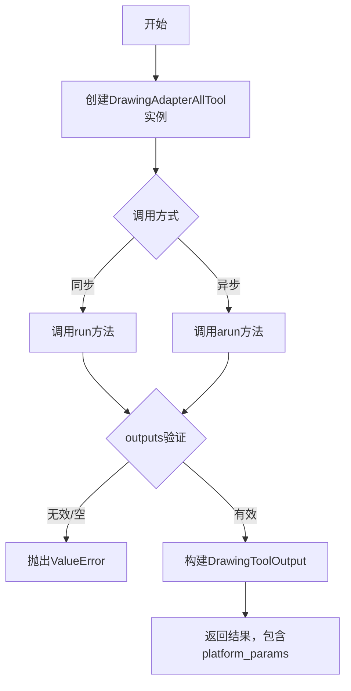
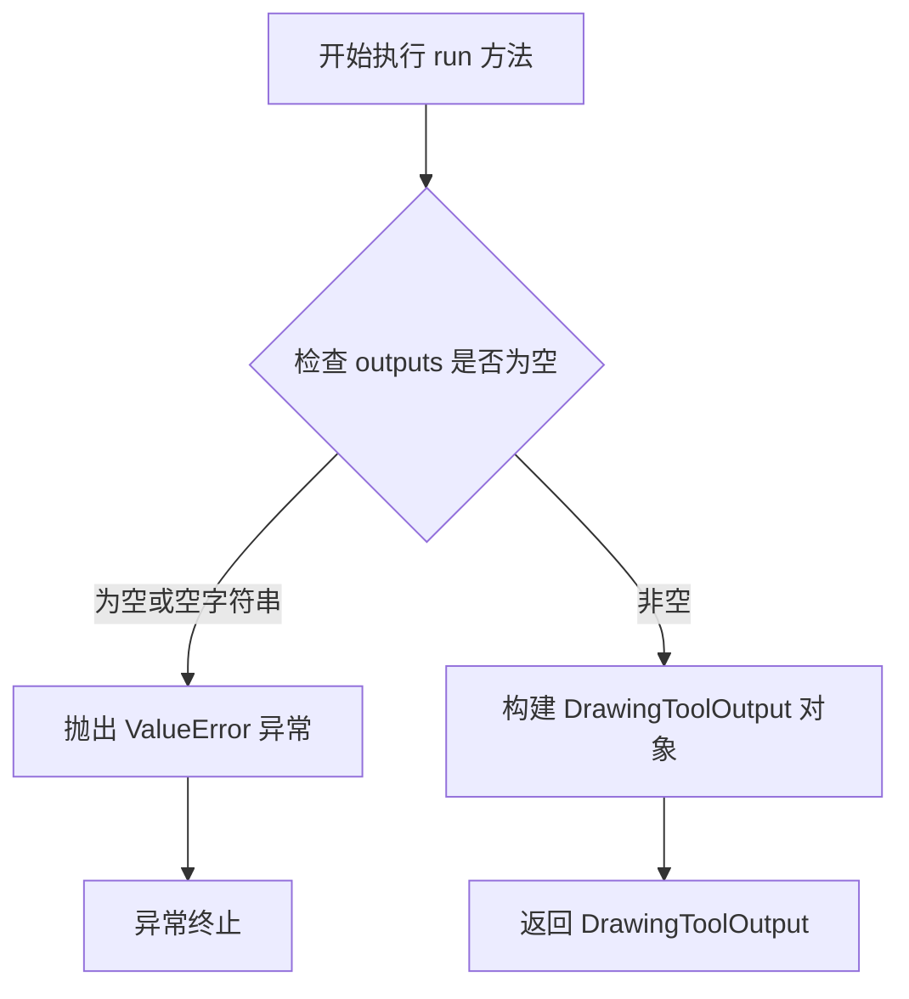
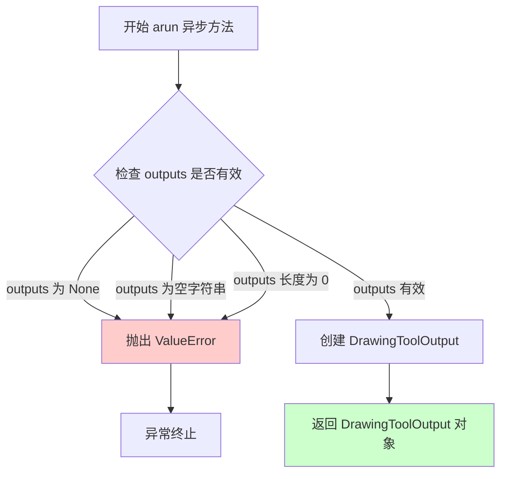
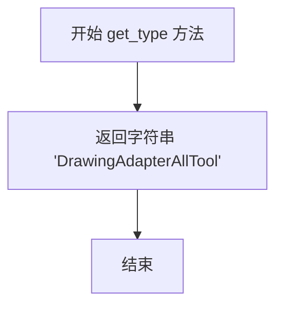
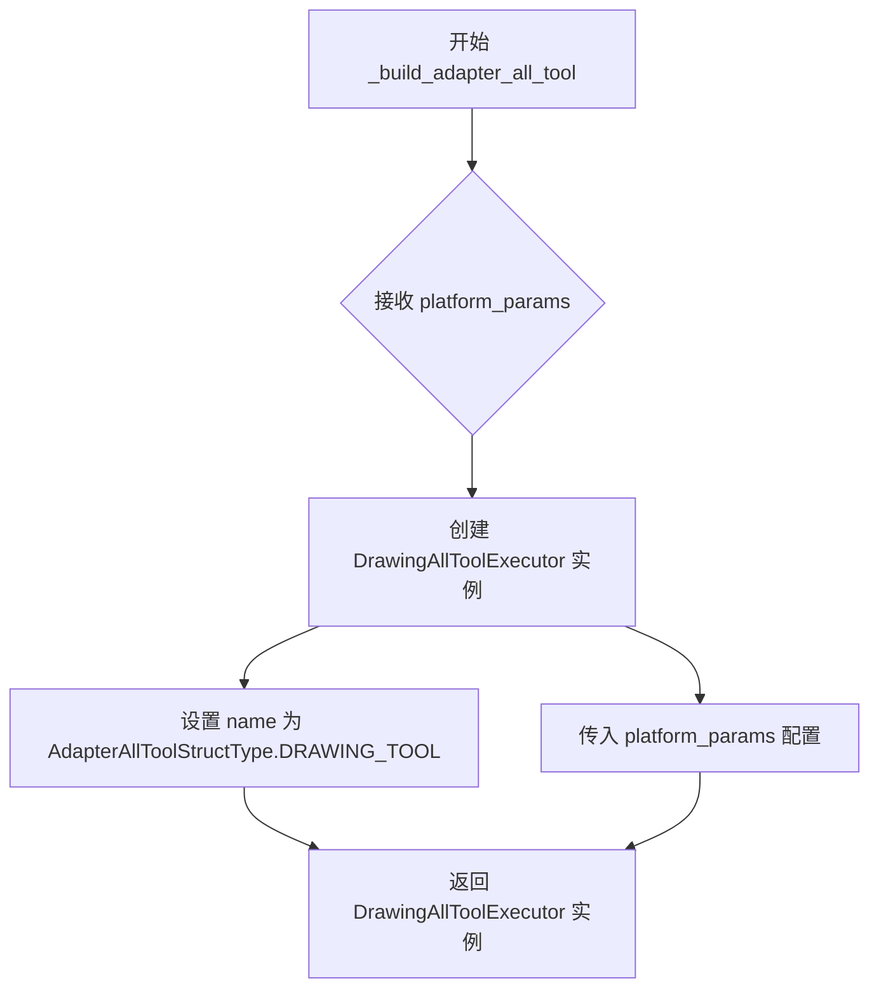

# `Langchain-Chatchat\libs\chatchat-server\langchain_chatchat\agent_toolkits\all_tools\drawing_tool.py` 详细设计文档

该代码实现了一个绘图工具适配器（DrawingAdapterAllTool），用于代码解释器工具与第三方平台的集成，通过DrawingAllToolExecutor提供同步和异步执行能力，并携带平台参数（platform_params）进行上下文传递。

## 整体流程



## 类结构

```
BaseToolOutput (基类)
└── DrawingToolOutput (平台参数输出类)

AllToolExecutor (抽象执行器)
└── DrawingAllToolExecutor (绘图工具执行器)

AdapterAllTool<T> (泛型适配器基类)
└── DrawingAdapterAllTool (绘图工具适配器)
```

## 全局变量及字段


### `logger`
    
模块级日志记录器，用于记录运行日志

类型：`logging.Logger`
    


### `DrawingToolOutput.platform_params`
    
平台参数字典，用于传递第三方平台配置信息

类型：`Dict[str, Any]`
    


### `DrawingAllToolExecutor.name`
    
工具名称

类型：`str`
    
    

## 全局函数及方法


### `DrawingToolOutput.__init__`

初始化工具输出对象，用于存储绘图工具的执行结果和平台参数。该构造函数继承自 `BaseToolOutput`，并额外保存平台相关的参数信息，以便后续处理或传递给其他组件。

参数：

- `data`：`Any`，核心数据内容，表示工具执行的主要输出结果
- `platform_params`：`Dict[str, Any]`，平台参数字典，包含与平台相关的配置或上下文信息
- `**extras`：`Any`，额外的关键字参数，用于传递可选的扩展属性

返回值：`None`，构造函数不返回值，仅初始化对象状态

#### 流程图

```mermaid
flowchart TD
    A[开始 __init__] --> B[调用 super().__init__data, '', '', **extras]
    B --> C[设置 self.platform_params = platform_params]
    C --> D[结束]
    
    style A fill:#f9f,color:#000
    style D fill:#9f9,color:#000
```

#### 带注释源码

```python
def __init__(
    self,
    data: Any,
    platform_params: Dict[str, Any],
    **extras: Any,
) -> None:
    """
    初始化 DrawingToolOutput 实例
    
    参数:
        data: 工具执行返回的核心数据
        platform_params: 平台相关的参数字典
        **extras: 传递给父类的额外关键字参数
    """
    # 调用父类 BaseToolOutput 的构造函数
    # 传入 data 作为结果数据，空字符串作为 tool 和 observation（继承自 BaseToolOutput）
    super().__init__(data, "", "", **extras)
    
    # 保存平台参数到实例属性，供后续使用
    self.platform_params = platform_params
```


### `DrawingAllToolExecutor.run`

该方法是 DrawingAllToolExecutor 类的同步执行方法，用于验证工具输出是否有效，若有效则构建包含工具访问信息、消息、日志以及平台参数的 DrawingToolOutput 对象返回，若输出为空则抛出 ValueError 异常。

**参数：**

- `self`：`DrawingAllToolExecutor` 实例本身
- `tool`：`str`，要执行的工具名称
- `tool_input`：`str`，工具输入内容
- `log`：`str`，执行日志信息
- `outputs`：`List[Union[str, dict]]`，可选参数，工具执行后的输出列表，默认为 None
- `run_manager`：`Optional[CallbackManagerForToolRun]`，可选参数，用于管理工具运行的回调管理器，默认为 None

**返回值：** `DrawingToolOutput`，包含工具访问信息、消息内容以及平台参数的输出对象

#### 流程图



#### 带注释源码

```python
def run(
    self,
    tool: str,
    tool_input: str,
    log: str,
    outputs: List[Union[str, dict]] = None,
    run_manager: Optional[CallbackManagerForToolRun] = None,
) -> DrawingToolOutput:
    """
    同步执行工具方法，验证输出并返回 DrawingToolOutput
    
    参数:
        tool: 工具名称
        tool_input: 工具输入内容
        log: 执行日志
        outputs: 工具执行后的输出列表
        run_manager: 回调管理器
    
    返回:
        DrawingToolOutput: 包含平台参数的输出对象
    
    异常:
        ValueError: 当 outputs 为空或空字符串时抛出
    """
    # 检查 outputs 是否为空或空字符串，如果是则抛出异常
    if outputs is None or str(outputs).strip() == "":
        raise ValueError(f"Tool {self.name}  is server error")

    # 构建并返回 DrawingToolOutput 对象，包含工具访问信息、消息和平台参数
    return DrawingToolOutput(
        data=f"""Access：{tool}, Message: {tool_input},{log}""",
        platform_params=self.platform_params,
    )
```


### `DrawingAllToolExecutor.arun`

异步执行工具方法，验证输出并返回包含平台参数的 DrawingToolOutput 对象。

参数：

- `tool`：`str`，工具名称标识
- `tool_input`：`str`，工具输入内容
- `log`：`str`，执行日志信息
- `outputs`：`List[Union[str, dict]]`，工具执行输出列表，可选
- `run_manager`：`Optional[AsyncCallbackManagerForToolRun]`，异步回调管理器，可选

返回值：`DrawingToolOutput`，包含工具访问信息、输入消息、日志以及平台参数的输出对象

#### 流程图



#### 带注释源码

```python
async def arun(
    self,
    tool: str,
    tool_input: str,
    log: str,
    outputs: List[Union[str, dict]] = None,
    run_manager: Optional[AsyncCallbackManagerForToolRun] = None,
) -> DrawingToolOutput:
    """Use the tool asynchronously."""
    # 验证 outputs 参数：检查是否为 None、空字符串或空列表
    if outputs is None or str(outputs).strip() == "" or len(outputs) == 0:
        # 输出无效时抛出工具服务器错误异常
        raise ValueError(f"Tool {self.name}  is server error")

    # 构建平台适配的输出对象，包含工具访问信息、输入和日志
    return DrawingToolOutput(
        data=f"""Access：{tool}, Message: {tool_input},{log}""",
        platform_params=self.platform_params,
    )
```


### `DrawingAdapterAllTool.get_type`

获取工具类型标识符，用于在系统中唯一标识该绘图适配器工具。

参数：

- `cls`：`<class method>`，类方法隐式参数，表示类本身

返回值：`str`，返回工具类型字符串 "DrawingAdapterAllTool"，用于工具注册和类型识别

#### 流程图



#### 带注释源码

```python
@classmethod
def get_type(cls) -> str:
    """
    获取工具类型标识符
    
    Returns:
        str: 工具类型字符串 'DrawingAdapterAllTool'，用于在系统中
             唯一标识该绘图适配器工具类
    
    Note:
        该方法为类方法，通过 cls 参数访问类本身
        返回值通常用于工具注册、类型判断和序列化等场景
    """
    return "DrawingAdapterAllTool"
```


### `DrawingAdapterAllTool._build_adapter_all_tool`

该方法根据传入的平台参数构建并返回一个配置好的 `DrawingAllToolExecutor` 实例，用于执行绘图相关的工具操作。

参数：

- `platform_params`：`Dict[str, Any]`，平台参数字典，包含适配器所需的平台特定配置信息

返回值：`DrawingAllToolExecutor`，返回一个配置好的绘图工具执行器实例

#### 流程图



#### 带注释源码

```python
def _build_adapter_all_tool(
    self, platform_params: Dict[str, Any]
) -> DrawingAllToolExecutor:
    """
    根据平台参数构建DrawingAllToolExecutor实例
    
    参数:
        platform_params: Dict[str, Any] - 平台参数字典，包含适配器所需的平台特定配置
    
    返回值:
        DrawingAllToolExecutor - 配置好的绘图工具执行器实例
    """
    # 使用AdapterAllToolStructType.DRAWING_TOOL作为工具名称，
    # 并结合platform_params创建DrawingAllToolExecutor实例
    return DrawingAllToolExecutor(
        name=AdapterAllToolStructType.DRAWING_TOOL,  # 工具类型名称
        platform_params=platform_params                # 平台参数配置
    )
```

## 关键组件


### DrawingToolOutput

工具输出类，封装工具执行结果和平台参数，继承自 BaseToolOutput，用于返回绘图工具的执行结果数据。

### DrawingAllToolExecutor

绘图工具执行器，继承自 AllToolExecutor，负责同步和异步执行绘图工具，验证输出有效性并构建 DrawingToolOutput 返回结果。

### DrawingAdapterAllTool

绘图工具适配器，继承自 AdapterAllTool，用于构建 DrawingAllToolExecutor 实例，将平台参数转换为具体的工具执行器。

### platform_params

平台参数字典 (Dict[str, Any])，在工具执行过程中传递平台特定的配置信息，用于支持多平台适配。

### AdapterAllToolStructType.DRAWING_TOOL

绘图工具类型标识，用于标识当前适配器处理的工具类型为绘图工具。


## 问题及建议


### 已知问题

-   **重复代码**：同步方法`run`和异步方法`arun`中存在重复的验证逻辑（检查`outputs`是否为`None`或空字符串），以及重复的`DrawingToolOutput`构造逻辑
-   **验证逻辑不一致**：`run`方法使用`str(outputs).strip() == ""`检查，而`arun`方法额外检查`len(outputs) == 0`，两处验证逻辑不完全一致
-   **字符串检查方式不健壮**：使用`str(outputs).strip() == ""`判断空值不够精确，对于非字符串类型的`outputs`（如空列表`[]`）会返回不准确的结果
-   **基类初始化不完整**：`DrawingAllToolExecutor`继承自`AllToolExecutor`但未调用`super().__init__()`，可能导致基类的属性未正确初始化
-   **错误信息不够详细**：`ValueError`异常的消息仅为`"Tool {self.name} is server error"`，缺乏具体的错误原因和调试信息
-   **缺少日志记录**：异常发生时没有使用`logger`记录错误日志，不利于问题排查和监控
-   **类型注解不完整**：`log`参数声明为`str`类型，但在构造输出时直接拼接未做转义处理，可能导致输出格式问题
-   **硬编码的空字符串**：`DrawingToolOutput`构造时将`text`、`observation_prefix`、`llm_prefix`硬编码为空字符串，缺乏灵活性

### 优化建议

-   **抽取公共验证逻辑**：将`outputs`的验证逻辑提取为私有方法（如`_validate_outputs`），在`run`和`arun`中复用，减少代码重复
-   **统一验证逻辑**：确保同步和异步方法的验证逻辑完全一致，都检查`outputs is None`或`len(outputs) == 0`
-   **改进空值检查**：使用`not outputs or (isinstance(outputs, (str, list)) and len(outputs) == 0)`等方式进行更准确的空值判断
-   **调用父类构造函数**：在`DrawingAllToolExecutor`中添加`super().__init__()`调用，确保基类属性正确初始化
-   **增强错误信息**：在异常消息中包含更多上下文信息，如`outputs`的实际值、类型等，便于调试
-   **添加日志记录**：在抛出异常前使用`logger.error`记录错误详情，包括工具名、输入参数等
-   **完善类型注解**：考虑为`log`参数添加更严格的类型约束，或在文档中说明其格式要求
-   **参数化输出字段**：将`text`、`observation_prefix`、`llm_prefix`等硬编码值提取为可选参数，增强`DrawingToolOutput`的灵活性
-   **添加输入验证**：对`tool`和`tool_input`参数进行有效性验证，避免无效输入导致后续问题


## 其它


### 设计目标与约束

本模块旨在为LangChain_chatchat框架提供一种通用的绘图工具适配器实现，用于将不同平台的绘图工具执行结果统一封装为标准化的输出格式。设计约束包括：必须继承自AllToolExecutor基类、必须支持同步和异步两种执行模式、输出必须包含平台特定参数（platform_params）、必须遵循LangChain的回调管理器接口规范。

### 错误处理与异常设计

代码中包含两处明确的错误处理逻辑：
1. 在`run`方法中：当`outputs`为None或空字符串时，抛出`ValueError`异常，错误信息格式为`f"Tool {self.name} is server error"`
2. 在`arun`方法中：当`outputs`为None、空字符串或空列表时，抛出`ValueError`异常
异常处理策略采用快速失败模式，验证失败立即抛出异常而非返回错误结果，确保调用方能够及时感知错误状态。建议增加更细粒度的异常类型区分，如区分参数错误、平台错误、服务端错误等。

### 数据流与状态机

数据流方向：外部调用 → DrawingAdapterAllTool.get_type()获取工具类型 → _build_adapter_all_tool()构建执行器 → DrawingAllToolExecutor.run()/arun()执行 → DrawingToolOutput封装结果 → 返回调用方。状态机相对简单，主要包含两个状态：初始化状态（构建执行器）和执行状态（运行工具并返回结果）。

### 外部依赖与接口契约

核心依赖包括：langchain_core.agents.AgentAction、langchain_core.callbacks相关类、langchain_chatchat.agent_toolkits模块下的AdapterAllTool、AllToolExecutor、BaseToolOutput等。接口契约要求：DrawingAllToolExecutor必须实现run()和arun()方法并返回DrawingToolOutput类型；DrawingAdapterAllTool必须实现get_type()返回字符串类型和_build_adapter_all_tool()返回DrawingAllToolExecutor实例；DrawingToolOutput必须继承BaseToolOutput并包含platform_params字段。

### 安全性考虑

当前代码未包含敏感信息处理、输入校验、权限控制等安全机制。建议增加：tool和tool_input参数的输入校验防止注入攻击；平台参数（platform_params）的访问权限控制；日志脱敏处理避免敏感信息泄露。

### 性能考虑

当前实现为轻量级封装，性能开销主要来源于字符串拼接和字典复制。优化建议：使用f-string替代字符串拼接；考虑使用__slots__优化DrawingToolOutput内存占用；对于高频调用场景可考虑对象池化。

### 测试策略

建议包含以下测试用例：同步run方法和异步arun方法的正常流程测试；outputs为None、空字符串、空列表时的异常抛出测试；platform_params传递和封装正确性验证；多线程/多协程并发调用时的线程安全性测试；与基类AllToolExecutor的接口兼容性测试。

### 配置管理

当前tool_name通过AdapterAllToolStructType.DRAWING_TOOL枚举硬编码。建议将工具类型名称提取为可配置项，支持通过platform_params或配置文件动态指定，增强模块的通用性和可扩展性。

### 版本兼容性

代码明确标注# -*- coding: utf-8 -*-，确保Python3兼容性。当前依赖的langchain_core版本未明确指定，建议在requirements.txt或setup.py中明确声明最低兼容版本。

### 使用示例

```python
# 创建适配器实例
adapter = DrawingAdapterAllTool(platform_params={"source": "drawing_platform"})

# 获取工具类型
tool_type = adapter.get_type()  # 返回 "DrawingAdapterAllTool"

# 构建执行器
executor = adapter._build_adapter_all_tool(platform_params={"version": "v1"})

# 同步执行
output = executor.run(tool="draw", tool_input="circle", log="created", outputs=["success"])

# 异步执行
async_output = await executor.arun(tool="draw", tool_input="rect", log="created", outputs=[{"status": "ok"}])
```

### 部署与运维

日志记录使用标准logging模块，logger名称为__name__。建议在部署时配置合理的日志级别（如INFO或DEBUG），便于生产环境问题排查。监控指标建议包括：工具调用成功率、响应时间分布、异常发生频率等。


    