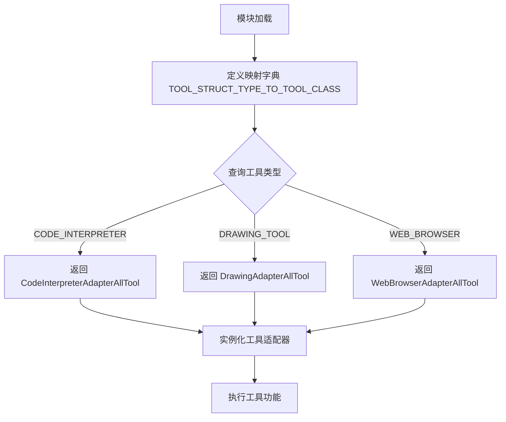

# `Langchain-Chatchat\libs\chatchat-server\langchain_chatchat\agent_toolkits\all_tools\registry.py` 详细设计文档

该文件定义了一个工具结构类型到工具适配器类的映射字典，用于根据不同的工具类型动态加载相应的工具适配器实现。

## 整体流程



## 类结构

```
langchain_chatchat.agent_toolkits
├── AdapterAllTool (抽象基类)
│   ├── CodeInterpreterAdapterAllTool
│   ├── DrawingAdapterAllTool
│   └── WebBrowserAdapterAllTool
└── AdapterAllToolStructType (枚举)
```

## 全局变量及字段


### `TOOL_STRUCT_TYPE_TO_TOOL_CLASS`
    
将工具结构类型映射到对应工具适配器类的字典，用于根据类型获取相应的工具实现

类型：`Dict[AdapterAllToolStructType, Type[AdapterAllTool]]`
    


    

## 全局函数及方法


## 关键组件


### TOOL_STRUCT_TYPE_TO_TOOL_CLASS

全局字典变量，将 AdapterAllToolStructType 枚举值映射到对应的 AdapterAllTool 子类，用于根据工具结构类型动态获取相应的工具实现类。

### AdapterAllToolStructType

从 langchain_chatchat.agent_toolkits.all_tools.struct_type 导入的枚举类型，定义了工具的结构类型枚举值，包括 CODE_INTERPRETER、DRAWING_TOOL、WEB_BROWSER 等。

### CodeInterpreterAdapterAllTool

从 langchain_chatchat.agent_toolkits.all_tools.code_interpreter_tool 模块导入的工具类，用于执行代码解释器功能的 AdapterAllTool 实现。

### DrawingAdapterAllTool

从 langchain_chatchat.agent_toolkits.all_tools.drawing_tool 模块导入的工具类，用于执行绘图功能的 AdapterAllTool 实现。

### WebBrowserAdapterAllTool

从 langchain_chatchat.agent_toolkits.all_tools.web_browser_tool 模块导入的工具类，用于执行网页浏览器功能的 AdapterAllTool 实现。


## 问题及建议


### 已知问题

-   **导入未使用的类型**：`AdapterAllTool` 被导入但在当前代码中未使用，造成不必要的依赖导入
-   **缺乏错误处理机制**：通过 `TOOL_STRUCT_TYPE_TO_TOOL_CLASS[struct_type]` 直接访问字典，如果传入不存在的 `AdapterAllToolStructType` 会抛出 `KeyError` 异常，缺乏优雅的错误处理
-   **硬编码的静态映射**：工具类型与类的映射关系是硬编码的，未来新增工具类型需要手动修改该字典，不符合开闭原则
- **缺少动态注册机制**：没有提供运行时动态注册新工具类型的接口，扩展性受限
- **类型注解不完整**：虽然字典定义了键值类型，但缺少对 `None` 值的处理和返回值的类型安全检查

### 优化建议

-   **移除未使用的导入**：删除 `AdapterAllTool` 的导入，或将其用于类型注解（如函数签名中）
-   **封装为函数或类**：将字典访问封装成带错误处理的函数，如 `get_tool_class(struct_type: AdapterAllToolStructType) -> Type[AdapterAllTool]`，在找不到时返回默认值或抛出自定义异常
-   **采用注册模式**：使用注册表模式，让各个工具类在初始化时自动注册自己，避免硬编码修改
-   **添加类型守卫**：使用 `typing.TypeGuard` 或运行时验证确保返回的类符合 `AdapterAllTool` 接口
-   **考虑使用 `__all__` 明确导出接口**：规范模块的公共 API 暴露


## 其它


### 设计目标与约束

**设计目标**：提供一个类型安全的工具适配器映射机制，使得系统能够根据不同的工具结构类型（AdapterAllToolStructType）动态加载对应的工具实现类（AdapterAllTool），实现工具类型的注册与发现功能。

**约束条件**：
- 必须保持字典键值对与枚举类型的严格对应关系
- 工具类必须继承自 AdapterAllTool 基类
- 该映射在模块加载时即被初始化，属于静态配置

### 错误处理与异常设计

- **键不匹配异常**：若传入的 AdapterAllToolStructType 不在字典中，可能导致 KeyError，建议在调用处进行枚举值校验
- **类型错误异常**：若映射的类不是 AdapterAllTool 的子类，可能导致类型检查失败
- **当前设计**：本模块未实现显式的异常处理，属于配置型模块，异常处理应由调用方负责

### 数据流与状态机

**数据流**：
1. 调用方根据业务场景确定所需的工具结构类型（AdapterAllToolStructType）
2. 通过 TOOL_STRUCT_TYPE_TO_TOOL_CLASS 字典查询对应的工具类
3. 实例化工具类并使用

**状态机**：本模块为纯配置模块，不涉及状态机设计

### 外部依赖与接口契约

**外部依赖**：
- `langchain_chatchat.agent_toolkits.AdapterAllTool`：工具基类
- `langchain_chatchat.agent_toolkits.all_tools.code_interpreter_tool.CodeInterpreterAdapterAllTool`：代码解释器工具
- `langchain_chatchat.agent_toolkits.all_tools.drawing_tool.DrawingAdapterAllTool`：绘图工具
- `langchain_chatchat.agent_toolkits.all_tools.web_browser_tool.WebBrowserAdapterAllTool`：网页浏览器工具
- `langchain_chatchat.agent_toolkits.all_tools.struct_type.AdapterAllToolStructType`：工具结构类型枚举
- `typing.Dict, Type`：Python 类型提示

**接口契约**：
- 字典的键必须为 AdapterAllToolStructType 枚举值
- 字典的值必须为 AdapterAllTool 的子类（Type[AdapterAllTool]）
- 返回的工具类可通过调用其构造函数创建实例

### 配置管理

- 该映射表采用硬编码方式定义，适合工具类型相对稳定的场景
- 若需要动态扩展工具类型，建议改为注册机制或配置中心管理

### 性能考量

- 字典查询时间复杂度为 O(1)，满足高效查询需求
- 模块加载时初始化，无运行时动态计算开销

### 兼容性说明

- 代码仅在 Python 3 环境下运行（使用类型注解）
- 依赖于 langchain_chatchat 框架，需确保框架版本兼容性


    