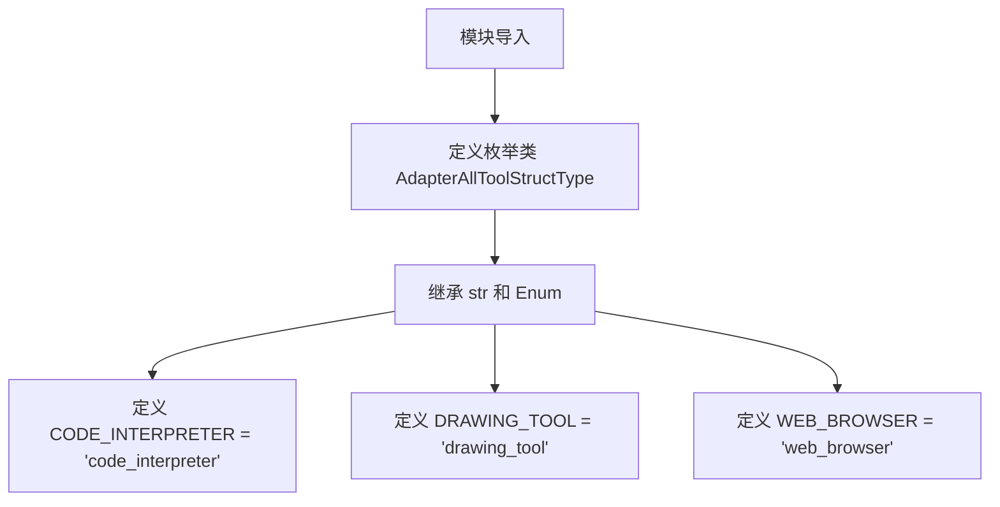
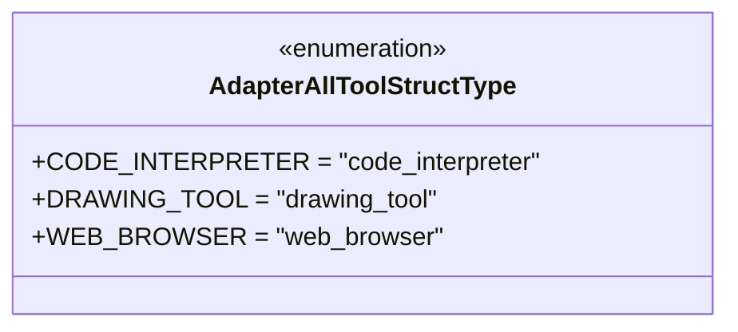

# `Langchain-Chatchat\libs\chatchat-server\langchain_chatchat\agent_toolkits\all_tools\struct_type.py` 详细设计文档

定义了一个名为AdapterAllToolStructType的字符串枚举类，用于表示适配器支持的所有工具结构类型，包括代码解释器、绘图工具和网页浏览器三种工具类型。

## 整体流程



## 类结构

```
Enum (Python内置)
└── AdapterAllToolStructType (字符串枚举类)
```

## 全局变量及字段


    

## 全局函数及方法


## 关键组件


### 核心功能概述

AdapterAllToolStructType 是一个枚举类型类，用于定义适配器工具的结构类型，通过继承 str 和 Enum 实现了字符串枚举功能，支持代码解释器、绘图工具和网页浏览器三种工具类型的标识。

### 文件运行流程

该模块为纯定义性代码，无运行时逻辑流程，仅在导入时加载枚举类及其成员值。

### 类详细信息

#### 类名：AdapterAllToolStructType

**类描述：**
继承自 str 和 Enum 的枚举类，用于表示适配器工具的结构类型常量。

**类字段：**

| 字段名称 | 类型 | 描述 |
|---------|------|------|
| CODE_INTERPRETER | str | 代码解释器工具类型标识 |
| DRAWING_TOOL | str | 绘图工具类型标识 |
| WEB_BROWSER | str | 网页浏览器工具类型标识 |

**类方法：**
该类无自定义方法，仅继承自 Enum 的标准方法。

**mermaid 流程图：**



**带注释源码：**

```python
# -*- coding: utf-8 -*-
"""IndexStructType class."""

# 导入标准库 Enum 模块
from enum import Enum


class AdapterAllToolStructType(str, Enum):
    """
    适配器工具结构类型枚举类
    
    用于定义系统中支持的工具类型集合，
    继承 str 以便在字符串比较和序列化场景中直接使用。
    """

    # 文档注释属性说明
    Attributes:
        DICT ("dict"): 字典类型占位符

    # TODO: 建议重构为基类属性
    # 代码注释：待重构项，将枚举值定义为基类属性

    # 枚举成员定义
    CODE_INTERPRETER = "code_interpreter"  # 代码解释器工具类型
    DRAWING_TOOL = "drawing_tool"          # 绘图工具类型
    WEB_BROWSER = "web_browser"            # 网页浏览器工具类型
```

### 全局变量和全局函数

该文件无全局变量和全局函数定义。

### 关键组件信息

| 组件名称 | 描述 |
|---------|------|
| AdapterAllToolStructType | 枚举类，定义三种工具类型的字符串常量 |
| 枚举成员 | CODE_INTERPRETER、DRAWING_TOOL、WEB_BROWSER 三个枚举值 |

### 潜在的技术债务或优化空间

1. **TODO 待办项**：代码中存在 `# TODO: refactor so these are properties on the base class` 注释，表明当前设计可能需要重构为基类属性的形式。
2. **文档不完整**：类文档字符串中的 DICT 属性描述模糊，未明确其用途。
3. **扩展性受限**：当前枚举值为硬编码，如需新增工具类型需修改源码，不支持运行时动态扩展。
4. **缺乏验证逻辑**：无输入验证或类型检查机制，无法确保枚举值的有效性。

### 其它项目

**设计目标与约束：**
- 目标：提供类型安全的工具类型标识
- 约束：继承 str 以支持字符串操作兼容性

**错误处理与异常设计：**
- 该代码无运行时逻辑，不涉及错误处理设计
- 使用标准 Enum 异常机制处理无效值访问

**数据流与状态机：**
- 无状态机实现
- 数据流为静态定义，无动态数据流转

**外部依赖与接口契约：**
- 依赖：Python 标准库 enum 模块
- 接口契约：提供字符串形式的枚举值访问接口


## 问题及建议


### 已知问题

-   **文档与代码不匹配**：类的文档字符串（docstring）中描述了属性 `DICT ("dict")`，但代码中并未定义此枚举成员，造成文档误导
-   **TODO 待完成**：存在 `# TODO: refactor so these are properties on the base class` 注释，表明有重构计划但尚未实施
-   **枚举值缺乏描述**：三个枚举值 `CODE_INTERPRETER`、`DRAWING_TOOL`、`WEB_BROWSER` 均无对应的文档说明，不清楚各自的具体用途和含义
-   **硬编码字符串值**：枚举的字符串值采用硬编码方式（如 `"code_interpreter"`），缺乏统一管理和类型安全保护
-   **命名冗长且不明确**：`AdapterAllToolStructType` 命名过长且语义不清晰，难以理解其具体业务含义

### 优化建议

-   完善文档字符串，为每个枚举成员添加清晰的描述，说明其用途和业务场景
-   移除或补充 `DICT` 属性的文档，使其与代码实际内容一致
-   考虑使用 `Python` 的 `auto()` 或 `StrEnum`（Python 3.11+）简化字符串值的硬编码
-   可将重复的字符串前缀提取为类属性或常量，提高可维护性
-   重新评估类命名，使其更贴合业务场景，提高代码可读性
-   添加类型注解（如 `value: str`）增强代码的可读性和 IDE 支持
-   补充单元测试以验证枚举值的正确性和一致性


## 其它


### 设计目标与约束

本代码的设计目标是为适配器工具类型提供类型安全的枚举定义，支持代码解释器、绘图工具和网页浏览器三种工具类型的统一管理。设计约束包括：仅使用Python标准库（enum模块），保持类结构简单以降低维护成本，枚举值采用字符串类型以便于序列化和跨系统交互。

### 错误处理与异常设计

由于代码仅包含静态枚举定义，无运行时错误处理需求。枚举类本身的特性提供了内置的错误检测机制：当尝试访问不存在的枚举成员时会抛出AttributeError，当尝试使用无效值构造枚举时会抛出ValueError，这些异常由Python的enum模块自动处理，无需额外捕获。

### 外部依赖与接口契约

本代码无外部依赖，仅使用Python标准库中的enum模块。接口契约如下：枚举类AdapterAllToolStructType继承自str和Enum，因此其成员既是枚举类型又是字符串值；CODE_INTERPRETER的值为字符串"code_interpreter"，DRAWING_TOOL的值为字符串"drawing_tool"，WEB_BROWSER的值为字符串"web_browser"；所有枚举成员可通过.name属性获取名称，通过.value属性获取字符串值。

### 版本信息与变更历史

当前版本为1.0.0（初始版本）。代码中的TODO注释表明未来可能需要重构，将这些枚举值重构为基类的属性，以提供更好的可扩展性和代码复用性。

### 使用示例与调用关系

该枚举类可被其他模块导入并使用，典型调用方式包括：直接引用（如AdapterAllToolStructType.CODE_INTERPRETER）、字符串比较（如tool_type == AdapterAllToolStructType.WEB_BROWSER）、获取枚举值（如str(AdapterAllToolStructType.DRAWING_TOOL)）。适用于需要明确区分工具类型的场景，如工具适配器注册、工具选择逻辑等。

    