# `Langchain-Chatchat\libs\chatchat-server\langchain_chatchat\agent_toolkits\all_tools\tool.py` 详细设计文档

这是一个平台适配器工具，用于将各种工具（代码解释器、绘图工具、网页浏览器）统一适配到LangChain的Agent框架中，通过AdapterAllTool类提供同步和异步执行能力，支持工具输入的灵活处理和输出格式化。

## 整体流程

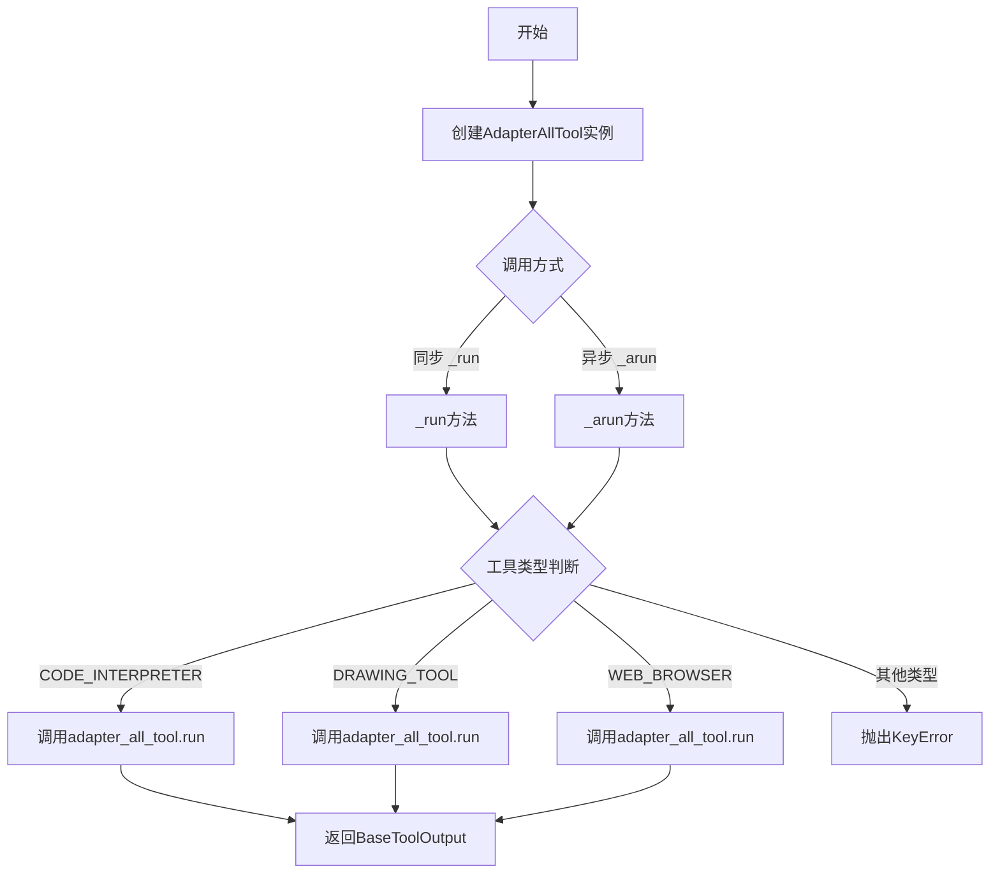

## 类结构

```
Serializable (langchain)
├── BaseToolOutput
DataClassJsonMixin (dataclasses_json)
├── AllToolExecutor (抽象基类)
BaseTool (langchain)
├── AdapterAllTool<E> (泛型适配器)
```

## 全局变量及字段


### `logger`
    
模块级日志记录器，用于记录工具执行过程中的日志信息

类型：`logging.Logger`
    


### `BaseToolOutput.data`
    
工具返回的实际数据

类型：`Any`
    


### `BaseToolOutput.format`
    
输出格式控制，可为字符串或可调用对象

类型：`str | Callable`
    


### `BaseToolOutput.data_alias`
    
数据别名，用于标识数据的别名

类型：`str`
    


### `BaseToolOutput.extras`
    
额外参数，用于传递额外的配置信息

类型：`dict`
    


### `AllToolExecutor.platform_params`
    
平台参数配置，存储不同平台的参数

类型：`Dict[str, Any]`
    


### `AdapterAllTool.name`
    
工具名称，标识工具的唯一名称

类型：`str`
    


### `AdapterAllTool.description`
    
工具描述，说明工具的功能和用途

类型：`str`
    


### `AdapterAllTool.platform_params`
    
平台参数，用于配置不同平台的适配参数

类型：`Dict[str, Any]`
    


### `AdapterAllTool.adapter_all_tool`
    
适配的工具执行器，负责执行具体的工具逻辑

类型：`E`
    
    

## 全局函数及方法


### `BaseToolOutput.__init__`

`BaseToolOutput` 类的初始化方法，用于封装工具输出数据，使其既能作为字符串返回给 LLM，又能保留结构化数据供其他场景使用。通过将数据包装在该类中，可以同时满足 LLM 对字符串输出的要求和其他组件对结构化数据的需求。

参数：

- `data`：`Any`，要封装的核心数据，可以是任意类型（字典、列表、字符串等）
- `format`：`str | Callable`，可选，格式化方式指定。字符串形式时如 `"json"` 会触发 JSON 格式化；也可以传入可调用对象（Callable）自定义格式化逻辑；默认为 `None`
- `data_alias`：`str`，可选，数据的别名/标识符，用于在某些场景下作为数据的键名；默认为空字符串
- `**extras`：`Any`，可选，额外的关键字参数。这些额外的参数会被收集到 `extras` 字典属性中，用于存储元数据或其他辅助信息

返回值：`None`，该方法继承自父类，不返回任何值，仅完成对象初始化

#### 流程图

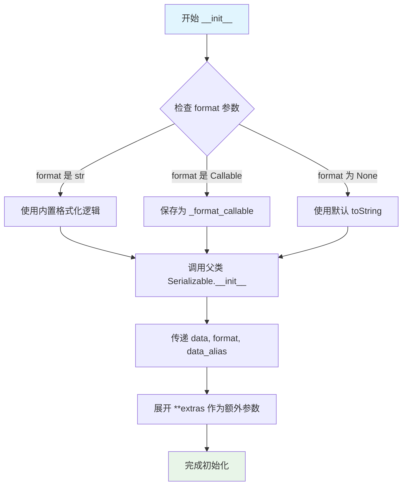

#### 带注释源码

```python
def __init__(
    self,
    data: Any,                              # 核心数据：任意类型，要封装的结果数据
    format: str | Callable = None,          # 格式化方式：字符串或可调用对象，用于控制 __str__ 输出格式
    data_alias: str = "",                   # 数据别名：可选的标识名称，用于特定场景的键名
    **extras: Any,                          # 额外参数：捕获的关键字参数，会存入 self.extras 字典
) -> None:                                  # 返回类型：无返回值
    # 调用父类 Serializable 的初始化方法
    # 传递 data、format、data_alias 作为命名参数
    # 将 **extras 展开后传入，供父类或后续逻辑使用
    super().__init__(data=data, format=format, data_alias=data_alias, **extras)
```


### `BaseToolOutput.__str__`

该方法将 `BaseToolOutput` 对象转换为字符串，根据 `format` 属性的不同值采用不同的格式化策略：若 `format` 为 `"json"` 则使用 JSON 格式化输出；若存在可调用的 `_format_callable` 则调用该函数进行格式化；否则直接返回数据的字符串表示。

参数：

- `self`：隐式参数，`BaseToolOutput` 的实例对象，无需显式传递

返回值：`str`，返回格式化后的字符串结果

#### 流程图

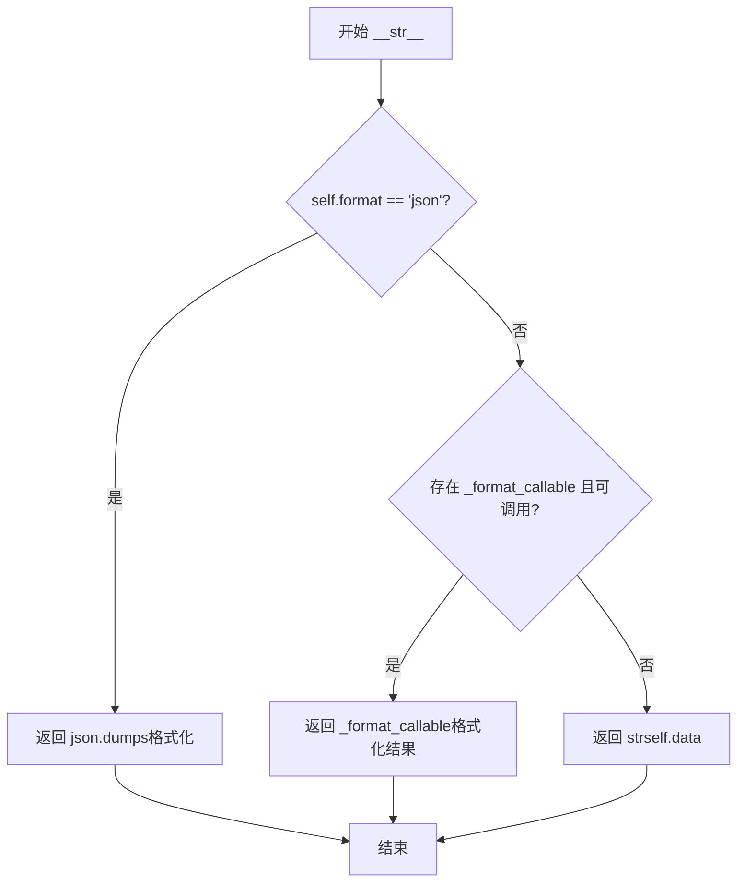

#### 带注释源码

```python
def __str__(self) -> str:
    """
    将 BaseToolOutput 对象转换为字符串表示。
    
    该方法支持三种格式化策略：
    1. 当 format 字段值为 "json" 时，使用 JSON 格式化输出 data
    2. 当存在 _format_callable 属性且可调用时，调用该函数进行格式化
    3. 其他情况直接返回 data 的字符串形式
    
    Returns:
        str: 格式化后的字符串结果
    """
    # 判断是否需要 JSON 格式化
    if self.format == "json":
        # 使用 JSON 序列化，ensure_ascii=False 保留中文等非ASCII字符
        # indent=2 使输出格式化便于阅读
        return json.dumps(self.data, ensure_ascii=False, indent=2)
    # 判断是否存在自定义格式化函数且可调用
    elif hasattr(self, "_format_callable") and callable(self._format_callable):
        # 调用自定义格式化函数，传入自身以获取完整上下文
        return self._format_callable(self)
    else:
        # 默认行为：直接转换为字符串
        return str(self.data)
```


### `BaseToolOutput.is_lc_serializable`

判断当前类是否可序列化，用于 LangChain 的序列化机制。

参数：

- `cls`：`Class`，隐式的类参数，表示类本身

返回值：`bool`，返回 `True` 表示该类可被 LangChain 序列化

#### 流程图

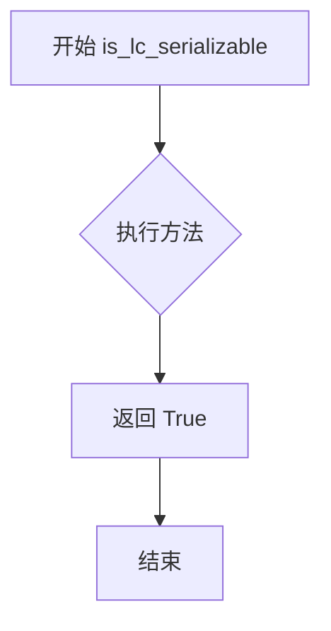

#### 带注释源码

```python
@classmethod
def is_lc_serializable(cls) -> bool:
    """Return whether or not the class is serializable."""
    # 该方法用于 LangChain 的序列化机制
    # 返回 True 表示 BaseToolOutput 类可以被 LangChain 序列化
    # 这是因为该类继承自 Serializable，需要支持跨进程或跨环境的序列化
    return True
```


### `BaseToolOutput.get_lc_namespace`

获取 langchain 对象的命名空间，用于序列化时标识对象的类型和位置。

参数：无（类方法，隐式参数 `cls` 表示类本身）

返回值：`List[str]`，返回 langchain 对象的命名空间路径列表，包含 "langchain_chatchat"、"agent_toolkits"、"all_tools" 和 "tool" 四个层级。

#### 流程图

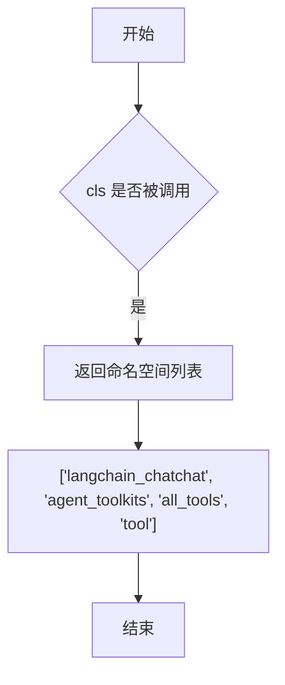

#### 带注释源码

```python
@classmethod
def get_lc_namespace(cls) -> List[str]:
    """Get the namespace of the langchain object."""
    return ["langchain_chatchat", "agent_toolkits", "all_tools", "tool"] 
```


### `AllToolExecutor.run`

该方法是抽象工具执行器的核心抽象方法，定义了工具执行的同步接口。子类需要实现该方法来完成具体的工具执行逻辑，并返回封装在 `BaseToolOutput` 中的执行结果。

参数：

- `*args: Any`，任意数量的位置参数，用于传递工具执行所需的额外位置参数
- `**kwargs: Any`，任意数量的关键字参数，用于传递工具执行所需的命名参数（如 tool、tool_input、log、outputs 等）

返回值：`BaseToolOutput`，封装工具执行结果的输出对象，支持字符串和结构化数据两种格式

#### 流程图

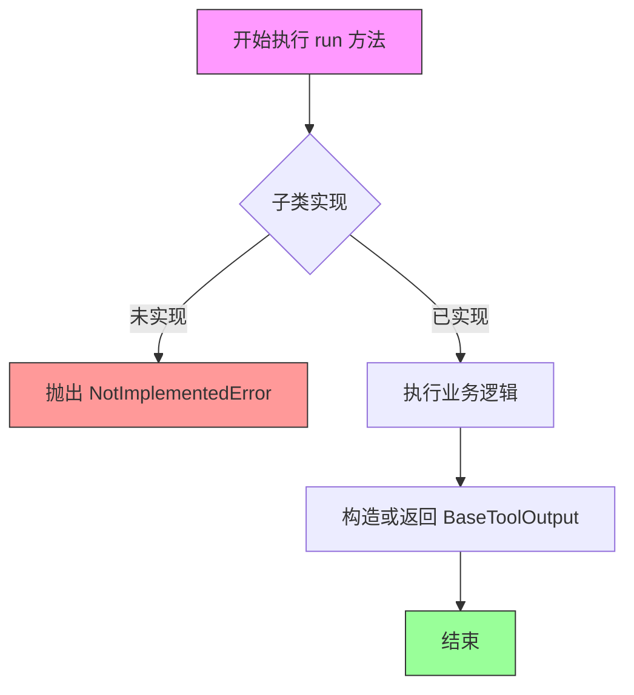

#### 带注释源码

```python
@abstractmethod
def run(self, *args: Any, **kwargs: Any) -> BaseToolOutput:
    """
    抽象方法：执行工具的同步接口
    
    该方法为抽象方法，要求子类必须实现具体的工具执行逻辑。
    子类实现时需要：
    1. 从 kwargs 中解析必要的参数（如 tool, tool_input, log, outputs 等）
    2. 执行业务逻辑
    3. 将结果封装为 BaseToolOutput 对象返回
    
    参数:
        *args: 任意数量的位置参数
        **kwargs: 关键字参数，通常包含:
            - tool: str，工具名称
            - tool_input: Any，工具输入数据
            - log: str，执行日志
            - outputs: Any，工具输出数据
    
    返回值:
        BaseToolOutput: 封装后的工具执行结果，支持字符串和结构化数据格式
    
    示例（子类实现）:
        def run(self, *args: Any, **kwargs: Any) -> BaseToolOutput:
            tool = kwargs.get("tool")
            tool_input = kwargs.get("tool_input")
            # 执行业务逻辑...
            result = do_something(tool, tool_input)
            return BaseToolOutput(data=result, format="json")
    """
    pass
```


### `AllToolExecutor.arun`

异步抽象方法，定义了工具执行器的异步运行接口，供具体平台适配器实现，用于在异步环境中执行工具并返回结构化输出。

参数：

- `*args`：`Any`，可变位置参数，用于传递任意数量的位置参数
- `**kwargs`：`Any`，可变关键字参数，用于传递任意数量的关键字参数

返回值：`BaseToolOutput`，封装工具执行结果的数据类，可同时满足 LLM 要求的字符串输出和结构化数据返回需求

#### 流程图

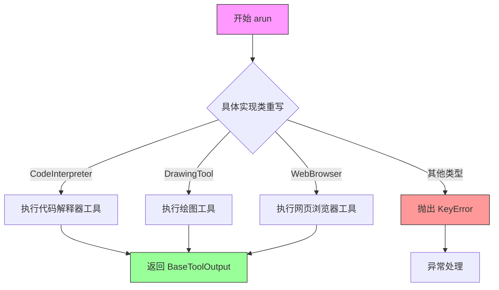

#### 带注释源码

```python
@abstractmethod
async def arun(
    self,
    *args: Any,
    **kwargs: Any,
) -> BaseToolOutput:
    """
    异步执行工具的抽象方法
    
    参数:
        *args: 可变位置参数，支持任意数量的位置参数传递
        **kwargs: 可变关键字参数，支持任意数量的键值对参数传递
    
    返回值:
        BaseToolOutput: 封装后的工具执行结果，支持字符串和结构化数据两种形式
        
    注意:
        - 该方法为抽象方法，必须由子类实现
        - 具体实现应根据 platform_params 和传入的参数执行对应的工具
        - 返回值必须封装在 BaseToolOutput 中以确保兼容性
    """
    pass
```


### `AdapterAllTool.__init__`

这是 `AdapterAllTool` 类的构造函数，用于初始化平台适配器工具。它接收工具名称和平台参数，通过调用父类构造函数并构建适配器工具实例来完成初始化过程。

参数：

- `name`：`str`，工具的名称，用于标识和描述该适配器工具
- `platform_params`：`Dict[str, Any]`，平台参数字典，包含适配器所需的配置信息
- `**data`：`Any`，可选的额外关键字参数，用于传递额外的配置数据

返回值：`None`，构造函数不返回任何值

#### 流程图

```mermaid
flowchart TD
    A[开始 __init__] --> B[接收 name, platform_params, **data]
    B --> C[调用 _build_adapter_all_tool 构建适配器实例]
    C --> D[调用 super().__init__ 初始化父类]
    D --> E[传入 name, description, platform_params, adapter_all_tool, **data]
    E --> F[结束 __init__]
```

#### 带注释源码

```python
def __init__(self, name: str, platform_params: Dict[str, Any], **data: Any):
    """
    初始化 AdapterAllTool 实例。
    
    参数:
        name: 工具的名称，用于标识和描述该适配器工具
        platform_params: 平台参数字典，包含适配器所需的配置信息
        **data: 可选的额外关键字参数，用于传递额外的配置数据
    """
    # 调用父类 BaseTool 的构造函数，传递必要的参数
    super().__init__(
        name=name,  # 工具名称
        description=f"platform adapter tool for {name}",  # 自动生成描述，格式为 "platform adapter tool for {name}"
        platform_params=platform_params,  # 平台参数传递给父类
        adapter_all_tool=self._build_adapter_all_tool(platform_params),  # 构建具体的适配器工具实例
        **data,  # 传递额外的关键字参数
    )
```


### `AdapterAllTool._build_adapter_all_tool`

这是一个抽象方法，用于根据传入的平台参数构建并返回一个适配器工具执行器（`AllToolExecutor`子类实例）。该方法在类的`__init__`方法中被调用，用于初始化`adapter_all_tool`属性，实现不同平台工具的适配逻辑。

参数：

- `self`：`AdapterAllTool`，当前类的实例
- `platform_params`：`Dict[str, Any]`，平台参数字典，包含用于构建适配器的配置信息（如API密钥、端点URL、认证信息等）

返回值：`E`（`AllToolExecutor`的子类实例），根据平台参数构建的适配器工具执行器，用于实际执行工具逻辑

#### 流程图

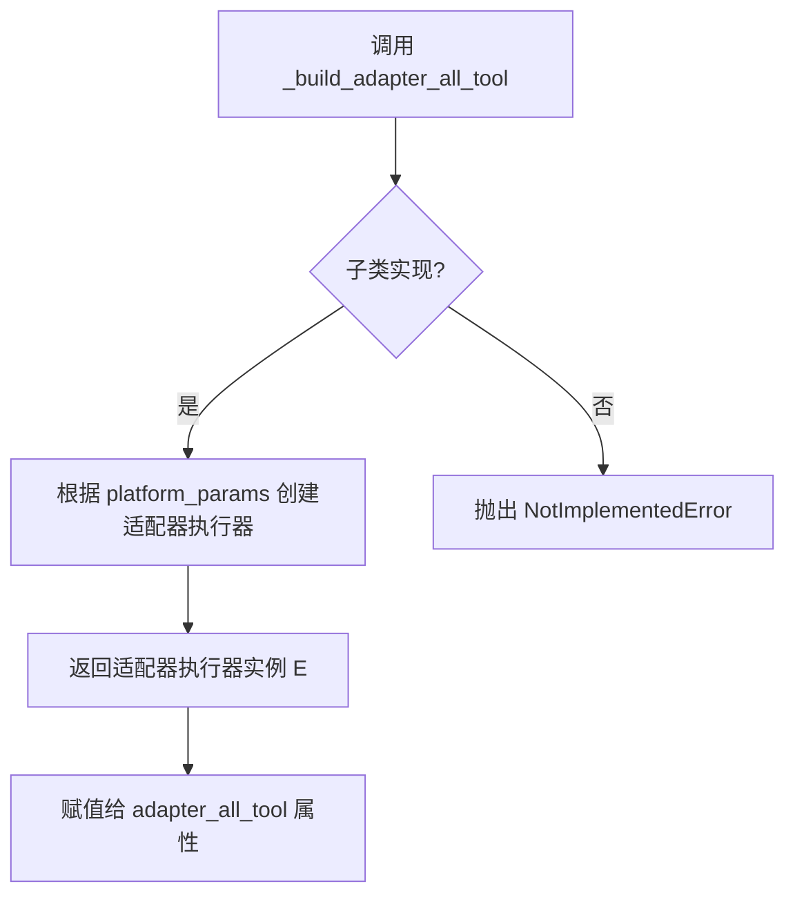

#### 带注释源码

```python
@abstractmethod
def _build_adapter_all_tool(self, platform_params: Dict[str, Any]) -> E:
    """
    抽象方法：根据平台参数构建适配器工具执行器
    
    参数:
        platform_params: Dict[str, Any] - 平台相关参数字典
        
    返回值:
        E - AllToolExecutor的子类实例
        
    注意:
        - 该方法为抽象方法，必须在子类中实现
        - 在__init__方法中被调用，用于初始化adapter_all_tool属性
        - E是泛型类型，由TypeVar("E", bound=AllToolExecutor)定义
    """
    raise NotImplementedError
```


### `AdapterAllTool.get_type`

该方法是一个抽象类方法，用于返回当前平台适配器的类型标识符，供系统识别和路由不同的工具适配器。

参数：

- 无显式参数（隐式参数 `cls` 表示类本身）

返回值：`str`，返回工具适配器的类型字符串标识，用于在系统中区分不同的平台适配器实现。

#### 流程图

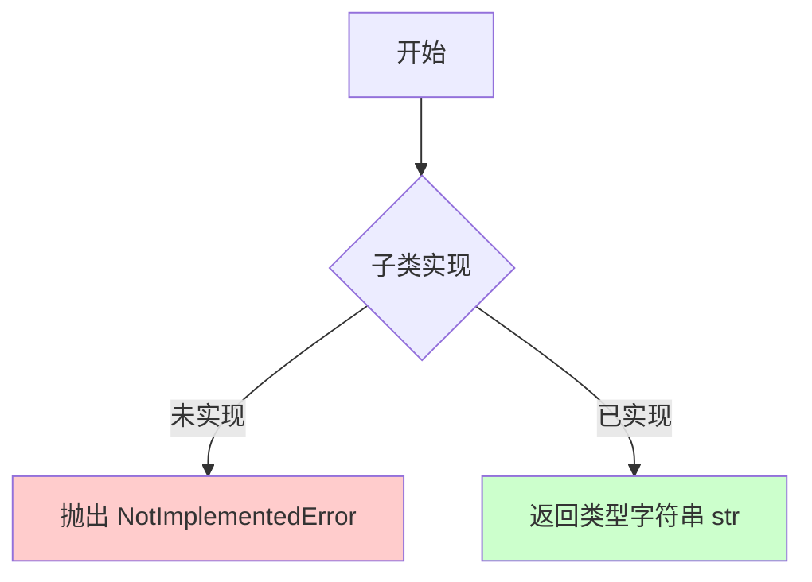

#### 带注释源码

```python
@classmethod
@abstractmethod
def get_type(cls) -> str:
    """
    获取平台适配器工具的类型标识符。
    
    这是一个抽象类方法，要求子类必须实现此方法以提供
    具体的平台适配器类型标识，用于系统中的工具类型识别
    和路由决策。
    
    Returns:
        str: 平台适配器的类型字符串标识
        例如：可能是 "code_interpreter", "drawing_tool", "web_browser" 等
    
    Raises:
        NotImplementedError: 当子类未实现此方法时抛出
    """
    raise NotImplementedError
```


### `AdapterAllTool._to_args_and_kwargs`

该方法负责将工具输入参数转换为位置参数和关键字参数元组的形式，用于适配不同格式的工具输入（字符串或字典），并保持向后兼容性。

参数：

- `self`：`AdapterAllTool`，当前类实例
- `tool_input`：`Union[str, Dict]`，工具输入参数，可以是字符串或字典类型

返回值：`Tuple[Tuple, Dict]`，返回包含位置参数元组和关键字参数字典的元组

#### 流程图

```mermaid
flowchart TD
    A[开始 _to_args_and_kwargs] --> B{tool_input is None?}
    B -->|Yes| C[返回空元组和空字典: (), {}]
    B -->|No| D{tool_input 是字符串?}
    D -->|Yes| E[返回单元素元组和空字典: (tool_input,), {}]
    D -->|No| F{tool_input 包含 'args' 键?}
    F -->|Yes| G{args is None?}
    G -->|Yes| H[移除 'args' 键, 返回空元组和 tool_input]
    G -->|No| I{args 是元组?}
    I -->|Yes| J[移除 'args' 键, 返回 args 和 tool_input]
    I -->|No| K[返回空元组和 tool_input]
    F -->|No| L[返回空元组和 tool_input]
    C --> M[结束]
    E --> M
    H --> M
    J --> M
    K --> M
    L --> M
```

#### 带注释源码

```python
def _to_args_and_kwargs(self, tool_input: Union[str, Dict]) -> Tuple[Tuple, Dict]:
    """
    将工具输入转换为位置参数和关键字参数。
    
    为了保持向后兼容性，如果 run_input 是字符串，
    则将其作为位置参数传递。
    """
    # 如果输入为空，直接返回空元组和空字典
    if tool_input is None:
        return (), {}
    
    # 如果输入是字符串，包装为单元素元组返回
    if isinstance(tool_input, str):
        return (tool_input,), {}
    else:
        # 对于使用 *args 参数定义的工具
        # args_schema 有一个名为 'args' 的字段
        # 它应该展开为实际的 *args
        # 例如: test_tools.test_named_tool_decorator_return_direct.search_api
        if "args" in tool_input:
            args = tool_input["args"]
            if args is None:
                # 如果 args 为 None，移除该键并返回
                tool_input.pop("args")
                return (), tool_input
            elif isinstance(args, tuple):
                # 如果 args 是元组，展开为位置参数
                tool_input.pop("args")
                return args, tool_input
        # 默认情况：返回空位置参数和原始关键字参数
        return (), tool_input
```


### `AdapterAllTool._run`

该方法是平台适配器工具的核心执行方法，负责根据传入的代理动作（AgentAction）的类型（代码解释器、绘图工具、网页浏览器），将相应的参数传递给底层的适配器执行器（AllToolExecutor）执行，并返回执行结果。如果遇到未知工具类型，则抛出 KeyError 异常。

参数：

- `agent_action`：`AgentAction`，代理动作对象，包含工具名称、工具输入、日志和输出等信息
- `run_manager`：`Optional[AsyncCallbackManagerForChainRun]`，可选的异步回调管理器，用于链式运行的回调管理
- `**tool_run_kwargs`：`Any`，其他可变参数，用于传递额外的工具运行参数

返回值：`Any`，返回适配器执行器（AllToolExecutor）的运行结果

#### 流程图

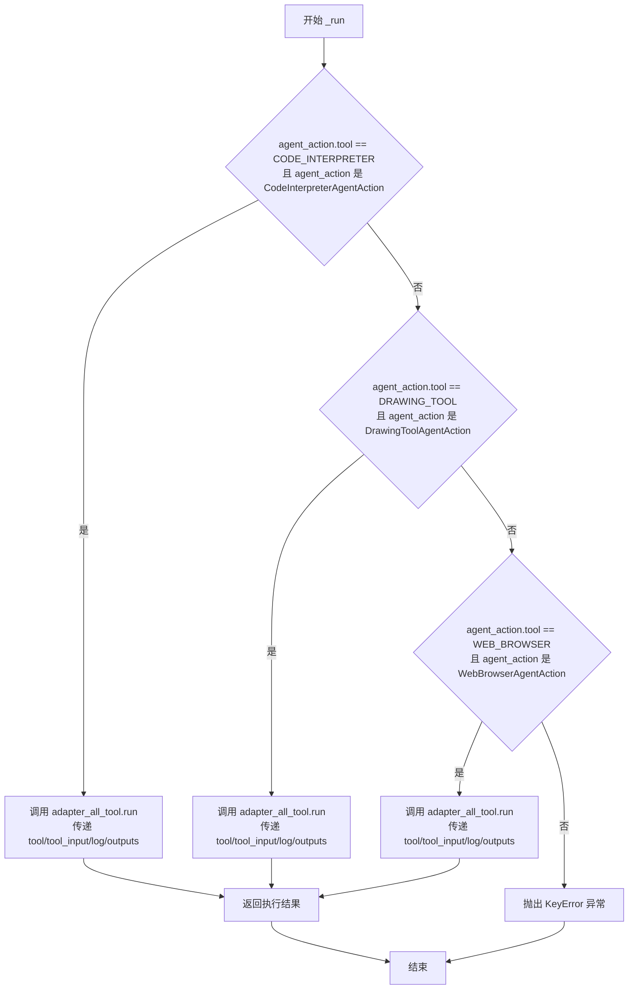

#### 带注释源码

```python
def _run(
    self,
    agent_action: AgentAction,
    run_manager: Optional[AsyncCallbackManagerForChainRun] = None,
    **tool_run_kwargs: Any,
) -> Any:
    """
    执行适配器工具的核心方法
    
    根据 agent_action.tool 的类型判断需要执行哪种工具，
    并将相应的参数传递给 adapter_all_tool.run 方法执行
    
    Args:
        agent_action: AgentAction 对象，包含以下属性：
            - tool: 工具名称字符串
            - tool_input: 工具输入参数
            - log: 执行日志
            - outputs: 执行输出结果
        run_manager: 可选的异步回调管理器，用于链式运行的回调管理
        **tool_run_kwargs: 其他可选的工具运行参数
    
    Returns:
        Any: 返回适配器执行器的执行结果
    
    Raises:
        KeyError: 当工具类型不匹配已知的三种类型时抛出
    """
    # 判断是否为代码解释器类型
    if (
        AdapterAllToolStructType.CODE_INTERPRETER == agent_action.tool
        and isinstance(agent_action, CodeInterpreterAgentAction)
    ):
        # 提取代码解释器相关的参数并调用执行器
        return self.adapter_all_tool.run(
            **{
                "tool": agent_action.tool,          # 工具名称
                "tool_input": agent_action.tool_input,  # 工具输入参数
                "log": agent_action.log,            # 执行日志
                "outputs": agent_action.outputs,    # 执行输出
            },
            **tool_run_kwargs,  # 合并额外的运行参数
        )
    # 判断是否为绘图工具类型
    elif AdapterAllToolStructType.DRAWING_TOOL == agent_action.tool and isinstance(
        agent_action, DrawingToolAgentAction
    ):
        # 提取绘图工具相关的参数并调用执行器
        return self.adapter_all_tool.run(
            **{
                "tool": agent_action.tool,
                "tool_input": agent_action.tool_input,
                "log": agent_action.log,
                "outputs": agent_action.outputs,
            },
            **tool_run_kwargs,
        )
    # 判断是否为网页浏览器类型
    elif AdapterAllToolStructType.WEB_BROWSER == agent_action.tool and isinstance(
        agent_action, WebBrowserAgentAction
    ):
        # 提取网页浏览器相关的参数并调用执行器
        return self.adapter_all_tool.run(
            **{
                "tool": agent_action.tool,
                "tool_input": agent_action.tool_input,
                "log": agent_action.log,
                "outputs": agent_action.outputs,
            },
            **tool_run_kwargs,
        )
    # 工具类型不匹配已知类型，抛出异常
    else:
        raise KeyError()
```


### `AdapterAllTool._arun`

异步执行工具适配器的核心方法，根据工具类型（代码解释器、绘图工具、网页浏览器）将代理动作转发给相应的适配器执行，并返回执行结果。

参数：

- `agent_action`：`AgentAction` 类型，代理动作对象，包含工具名称、工具输入、日志和输出等信息
- `run_manager`：`Optional[AsyncCallbackManagerForChainRun]` 类型，可选的异步回调管理器，用于链式运行过程中的回调
- `**tool_run_kwargs`：`Any` 类型，额外的关键字参数，会传递给底层适配器

返回值：`Any` 类型，返回底层适配器异步执行的结果

#### 流程图

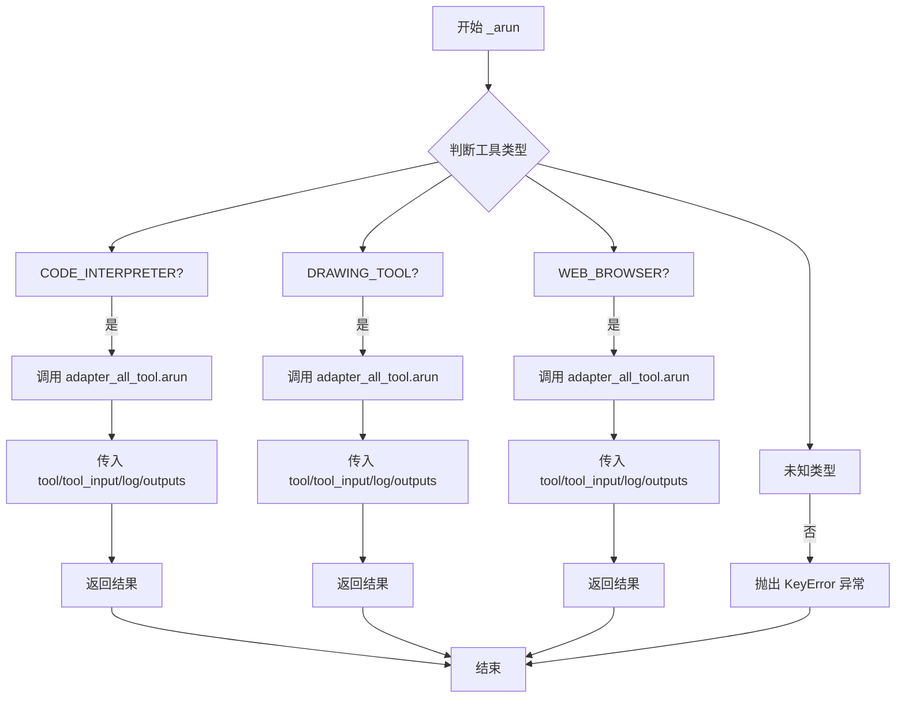

#### 带注释源码

```python
async def _arun(
    self,
    agent_action: AgentAction,
    run_manager: Optional[AsyncCallbackManagerForChainRun] = None,
    **tool_run_kwargs: Any,
) -> Any:
    """
    异步运行工具适配器。
    
    根据 agent_action.tool 的类型判断要执行哪种工具，
    并将相应的参数传递给 adapter_all_tool.arun 执行。
    
    参数:
        agent_action: 代理动作，包含工具名称、输入、日志和输出
        run_manager: 可选的异步回调管理器
        **tool_run_kwargs: 额外的关键字参数
    
    返回:
        Any: 底层适配器的异步执行结果
    
    异常:
        KeyError: 当工具类型未知时抛出
    """
    # 判断是否为代码解释器工具
    if (
        AdapterAllToolStructType.CODE_INTERPRETER == agent_action.tool
        and isinstance(agent_action, CodeInterpreterAgentAction)
    ):
        # 调用适配器的异步执行方法，传递工具相关信息
        return await self.adapter_all_tool.arun(
            **{
                "tool": agent_action.tool,           # 工具名称
                "tool_input": agent_action.tool_input,  # 工具输入参数
                "log": agent_action.log,             # 执行日志
                "outputs": agent_action.outputs,     # 输出结果
            },
            **tool_run_kwargs,  # 额外的运行时参数
        )

    # 判断是否为绘图工具
    elif AdapterAllToolStructType.DRAWING_TOOL == agent_action.tool and isinstance(
        agent_action, DrawingToolAgentAction
    ):
        return await self.adapter_all_tool.arun(
            **{
                "tool": agent_action.tool,
                "tool_input": agent_action.tool_input,
                "log": agent_action.log,
                "outputs": agent_action.outputs,
            },
            **tool_run_kwargs,
        )
    
    # 判断是否为网页浏览器工具
    elif AdapterAllToolStructType.WEB_BROWSER == agent_action.tool and isinstance(
        agent_action, WebBrowserAgentAction
    ):
        return await self.adapter_all_tool.arun(
            **{
                "tool": agent_action.tool,
                "tool_input": agent_action.tool_input,
                "log": agent_action.log,
                "outputs": agent_action.outputs,
            },
            **tool_run_kwargs,
        )
    
    # 工具类型不匹配，抛出异常
    else:
        raise KeyError()
```

## 关键组件


### BaseToolOutput

工具输出封装类，允许工具在保持结构化数据返回能力的同时，满足LLM对字符串输出的要求。通过format参数支持JSON格式化或自定义格式化函数。

### AllToolExecutor

抽象执行器基类，定义了工具执行的同步和异步接口。负责实际工具逻辑的执行，需要实现run和arun方法。

### AdapterAllTool

平台适配器工具泛型类，继承自BaseTool和Generic。核心职责是根据平台参数动态构建适配器，并将AgentAction路由到对应的工具执行器。支持CODE_INTERPRETER、DRAWING_TOOL、WEB_BROWSER三种工具类型。

### platform_params

平台参数字典，用于配置不同工具平台的参数，如API端点、认证信息、超时设置等。

### AdapterAllToolStructType

工具结构类型枚举，定义了三种支持的工具类型：CODE_INTERPRETER（代码解释器）、DRAWING_TOOL（绘图工具）、WEB_BROWSER（网页浏览器），用于工具类型的识别和路由。

### AgentAction路由机制

根据agent_action的tool字段和类型信息，将请求路由到对应的适配器执行器。实现了对CodeInterpreterAgentAction、DrawingToolAgentAction、WebBrowserAgentAction三种Action类型的支持。

### _to_args_and_kwargs

工具输入转换方法，将tool_input（字符串或字典）转换为位置参数和关键字参数。支持向后兼容和args字段的展开处理。

### 序列化支持

通过继承Serializable和DataClassJsonMixin，提供了LangChain序列化能力，支持工具对象的持久化和传输。


## 问题及建议


### 已知问题

- **代码重复**: `_run` 和 `_arun` 方法中存在大量重复的代码逻辑，每个分支都在构建相同的参数字典 `{"tool": agent_action.tool, "tool_input": agent_action.tool_input, "log": agent_action.log, "outputs": agent_action.outputs}`，可提取为私有方法复用。
- **硬编码的工具类型**: 使用硬编码的 `AdapterAllToolStructType` 枚举值判断工具类型，新增工具类型时需要修改多个方法，违反开闭原则。
- **错误处理不完善**: 当工具类型不匹配时仅抛出空的 `KeyError()`，缺乏有意义的错误信息和具体的异常类型。
- **magic方法潜在问题**: `BaseToolOutput.__str__` 方法中访问 `self._format_callable` 属性，但该属性未在类中定义，仅在 `__init__` 中动态传递时可能存在（当 `format` 是 Callable 时），逻辑不够清晰。
- **类型注解不完整**: `AllToolExecutor` 的 `run` 和 `arun` 方法使用 `*args: Any, **kwargs: Any`，缺乏具体的参数类型定义和返回值类型注解。
- **DataClass 与抽象类混用**: `AllToolExecutor` 同时使用 `@dataclass` 装饰器和抽象方法，可能导致实例化问题，且抽象方法与 dataclass 的特性结合不够自然。
- **参数验证缺失**: `AdapterAllTool.__init__` 和 `BaseToolOutput.__init__` 缺少对传入参数的校验（如 `platform_params` 是否为空、`name` 是否合法等）。

### 优化建议

- 提取 `_run` 和 `_arun` 中的公共逻辑，创建一个私有方法来构建参数字典。
- 使用策略模式或映射字典替代硬编码的 if-elif 分支，通过注册机制动态支持新的工具类型。
- 自定义异常类（如 `UnsupportedToolTypeError`），并在匹配失败时提供更有意义的错误信息。
- 重新设计 `BaseToolOutput` 的格式化逻辑，明确 `_format_callable` 的设置和使用方式，确保代码逻辑清晰。
- 为 `AllToolExecutor` 的抽象方法添加具体的类型注解，定义标准的接口契约。
- 考虑将 `AllToolExecutor` 改为普通的抽象基类（不使用 `@dataclass`），或提供默认的 `run`/`arun` 实现。
- 添加参数校验逻辑，确保必要的参数（如 `name`、`platform_params`）有效。
- 考虑使用 `@property` 封装对 `agent_action` 属性的访问，减少代码中的重复访问。


## 其它


### 设计目标与约束

本模块的设计目标是为LangChain Agent提供统一的平台工具适配能力，使得同一套工具能够在不同平台环境下使用，同时满足LLM对字符串输出的要求以及开发者对结构化数据的需求。约束条件包括：必须继承LangChain的BaseTool类以保持兼容性；工具输入输出必须支持同步和异步两种模式；需要支持CodeInterpreter、DrawingTool和WebBrowser三种特定工具类型；输出格式必须兼容LangChain的序列化机制。

### 错误处理与异常设计

在`_run`和`_arun`方法中，当工具类型不匹配时抛出KeyError异常。BaseToolOutput的__str__方法中，当format为json时使用json.dumps转换，当format为可调用对象时调用格式化函数，其他情况直接转字符串。建议增加更详细的异常类型定义，如InvalidToolTypeError、OutputFormatError等，并提供具体的错误码和错误信息以便调试。

### 数据流与状态机

数据流为：AgentAction（包含tool、tool_input、log、outputs）-> AdapterAllTool._run/_arun -> 适配器类型检查 -> AllToolExecutor.run/arun -> BaseToolOutput封装结果。状态机相对简单，主要状态包括：工具类型识别、参数转换、执行调用、结果封装。不涉及复杂的状态转换逻辑。

### 外部依赖与接口契约

主要依赖包括：langchain_core的BaseTool、Serializable、AgentAction；dataclasses_json的DataClassJsonMixin；typing泛型类型。AdapterAllTool需要由子类实现_build_adapter_all_tool方法构建具体执行器，get_type方法返回平台类型。AllToolExecutor的run和arun方法返回BaseToolOutput对象。调用方需传入符合AdapterAllToolStructType枚举值的tool名称。

### 性能考虑

当前实现中，每次调用都会进行instanceof类型检查，可以使用字典映射来优化判断逻辑。BaseToolOutput的字符串转换在format为json时会调用json.dumps，对于大型数据可能存在性能问题，可考虑流式处理或lazy evaluation。异步实现使用了async/await但未体现并发优势，可考虑连接池或批量执行优化。

### 安全性考虑

BaseToolOutput的extras字段接受任意关键字参数，可能导致安全风险，建议增加参数白名单验证。platform_params字典包含平台参数，需要确保敏感信息（如API密钥）不被序列化或泄露。tool_input和log字段来自AgentAction，需要防范注入攻击。

### 测试策略

建议覆盖以下测试场景：BaseToolOutput的字符串格式化（json格式、callable格式、默认格式）；AdapterAllTool的_run和_arun对三种工具类型的处理；无效工具类型抛出KeyError；AllToolExecutor子类的同步和异步执行；序列化/反序列化兼容性测试。

### 版本兼容性

代码使用from __future__ import annotations实现Python 3.7+的向后兼容。类型注解使用了Python 3.10+的联合类型语法（str | Callable），但由于import了from __future__ import annotations，这会被转换为向前引用。platform_params使用Dict而非dict，保持与旧版本Python的兼容。

### 配置管理

platform_params作为Dict[str, Any]传入，包含平台相关的配置信息。建议在文档中明确约定必须包含的配置字段，如平台标识、认证信息、超时设置等。可以考虑使用pydantic或dataclass定义配置Schema以增强类型安全和配置校验。

### 使用示例

```python
# 创建自定义执行器
class MyToolExecutor(AllToolExecutor):
    def run(self, *args, **kwargs):
        return BaseToolOutput(data={"result": "success"}, format="json")
    
    async def arun(self, *args, **kwargs):
        return BaseToolOutput(data={"result": "async_success"}, format="json")

# 创建适配器
class MyAdapterTool(AdapterAllTool[MyToolExecutor]):
    def _build_adapter_all_tool(self, platform_params):
        return MyToolExecutor(platform_params=platform_params)
    
    @classmethod
    def get_type(cls):
        return "my_platform"
```

    