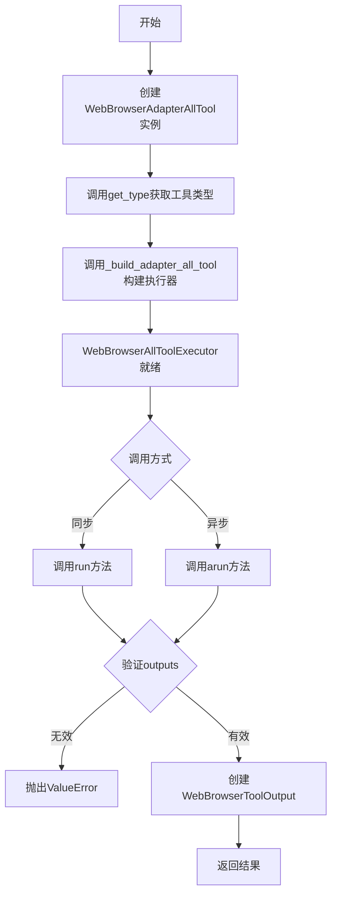
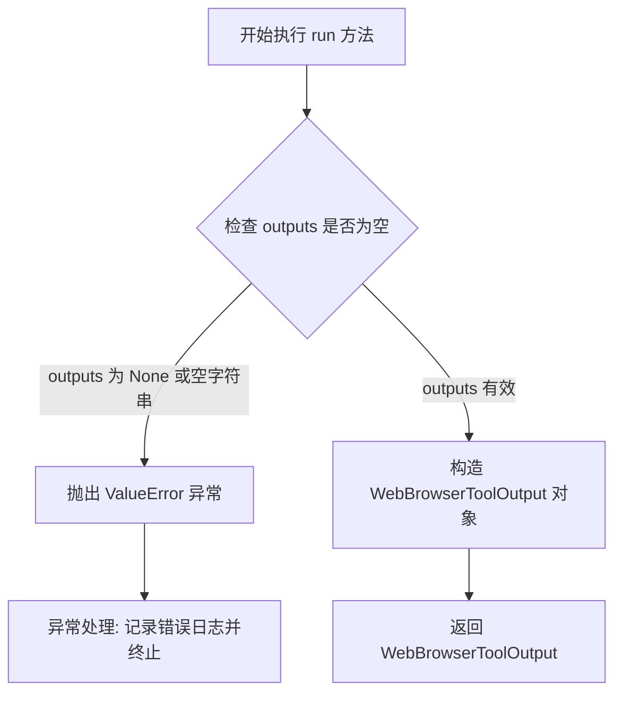
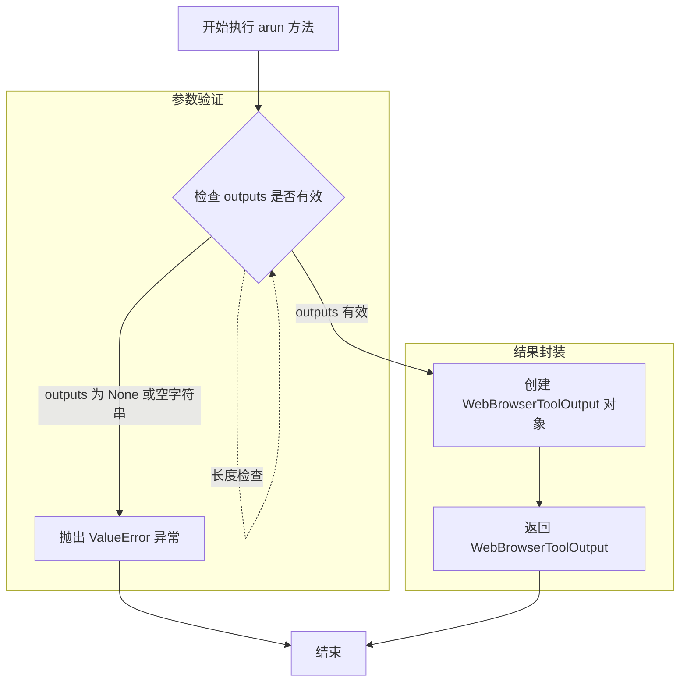
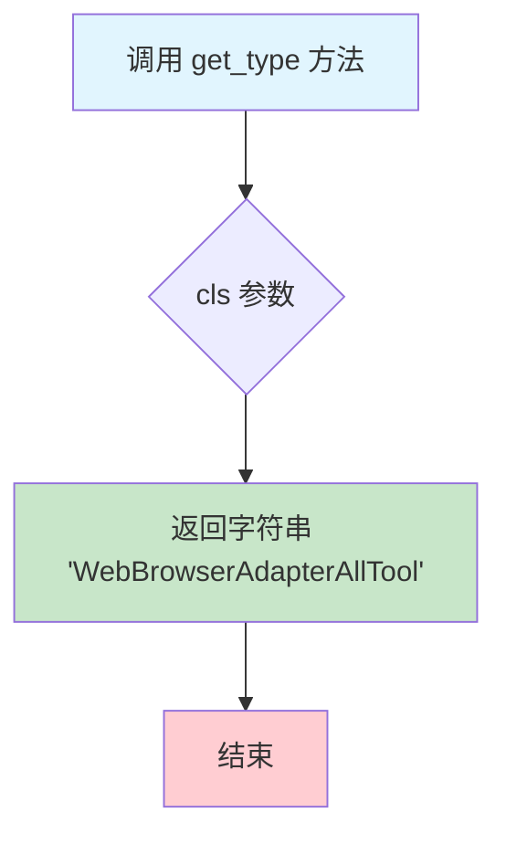
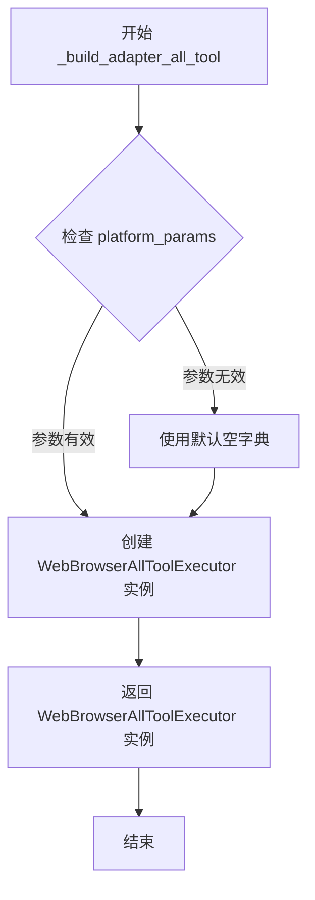

# `Langchain-Chatchat\libs\chatchat-server\langchain_chatchat\agent_toolkits\all_tools\web_browser_tool.py` 详细设计文档

这是一个LangChain的Web浏览器工具适配器模块，用于在AI Agent中执行Web浏览器相关操作，通过AdapterAllTool架构提供平台参数适配，支持同步和异步执行，并返回包含平台参数的WebBrowserToolOutput结果。

## 整体流程



## 类结构

```
BaseToolOutput (抽象基类)
└── WebBrowserToolOutput
AllToolExecutor (基类)
└── WebBrowserAllToolExecutor
AdapterAllTool (基类)
└── WebBrowserAdapterAllTool
```

## 全局变量及字段


### `logger`
    
模块级日志记录器，用于记录工具执行过程中的日志信息

类型：`logging.Logger`
    


### `WebBrowserToolOutput.platform_params`
    
平台参数字典，用于传递平台特定的配置参数

类型：`Dict[str, Any]`
    


### `WebBrowserAllToolExecutor.name`
    
工具名称，标识当前执行的工具类型

类型：`str`
    


### `WebBrowserAllToolExecutor.platform_params`
    
平台参数（继承自父类AllToolExecutor），用于传递平台特定的配置参数

类型：`Dict[str, Any]`
    
    

## 全局函数及方法


### `WebBrowserToolOutput.__init__`

初始化WebBrowserToolOutput类实例，用于封装工具执行结果数据，包含数据和平台参数。

参数：

-  `self`：隐式参数，WebBrowserToolOutput实例本身
-  `data`：`Any`，要存储的工具执行结果数据
-  `platform_params`：`Dict[str, Any]`，平台相关参数字典，用于传递平台特定的配置信息
-  `**extras`：`Any`，可选的额外关键字参数，用于扩展或传递额外的配置项

返回值：`None`，无返回值（构造函数）

#### 流程图

```mermaid
flowchart TD
    A[开始 __init__] --> B[调用父类构造函数 super().__init__]
    B --> C[传入 data, 空字符串, 空字符串, **extras]
    C --> D[设置实例属性 self.platform_params = platform_params]
    D --> E[结束初始化]
```

#### 带注释源码

```python
def __init__(
    self,
    data: Any,
    platform_params: Dict[str, Any],
    **extras: Any,
) -> None:
    """
    初始化WebBrowserToolOutput实例
    
    参数:
        data: 工具执行的结果数据，可以是任意类型
        platform_params: 平台相关参数字典，用于传递平台特定配置
        extras: 额外的关键字参数，会传递给父类
    """
    # 调用父类BaseToolOutput的构造函数
    # 父类接受data和一个空的callback提示参数
    super().__init__(data, "", "", **extras)
    
    # 将平台参数字典保存为实例属性
    self.platform_params = platform_params
```


### `WebBrowserAllToolExecutor.run`

该方法是 `WebBrowserAllToolExecutor` 类的同步执行工具方法，用于在 Web 浏览器平台适配器场景下执行工具调用，验证输出结果并构造包含平台参数的统一工具输出对象。

**参数：**

- `tool`：`str`，要执行的工具名称
- `tool_input`：`str`，工具输入参数
- `log`：`str`，执行日志信息
- `outputs`：`List[Union[str, dict]]`，可选，工具执行后的输出结果列表，默认为 None
- `run_manager`：`Optional[CallbackManagerForToolRun]`，可选，工具运行的回调管理器，默认为 None

**返回值：** `WebBrowserToolOutput`，返回包含访问信息、工具名称、输入消息、日志以及平台参数的输出对象

#### 流程图



#### 带注释源码

```python
def run(
    self,
    tool: str,                      # 工具名称标识
    tool_input: str,                # 工具输入内容
    log: str,                       # 执行过程日志
    outputs: List[Union[str, dict]] = None,  # 工具执行结果列表
    run_manager: Optional[CallbackManagerForToolRun] = None,  # 回调管理器
) -> WebBrowserToolOutput:
    """
    同步执行工具方法
    
    参数:
        tool: 工具名称
        tool_input: 工具输入
        log: 执行日志
        outputs: 工具输出结果
        run_manager: 回调管理器
    
    返回:
        WebBrowserToolOutput: 包含平台参数的输出对象
    
    异常:
        ValueError: 当 outputs 为空或 None 时抛出
    """
    # 检查 outputs 是否有效，若为空则抛出服务器错误
    if outputs is None or str(outputs).strip() == "":
        raise ValueError(f"Tool {self.name}  is server error")

    # 构造并返回包含完整信息的 WebBrowserToolOutput 对象
    return WebBrowserToolOutput(
        data=f"""Access：{tool}, Message: {tool_input},{log}""",  # 格式化输出数据
        platform_params=self.platform_params,  # 传递平台参数
    )
```


### `WebBrowserAllToolExecutor.arun`

异步执行工具方法，用于在浏览器适配器工具中异步运行Web浏览器相关的工具，并将工具执行结果封装为`WebBrowserToolOutput`对象返回。

参数：

- `tool`：`str`，工具名称，指定要执行的Web浏览器工具类型
- `tool_input`：`str`，工具输入，包含传递给工具的输入参数或请求数据
- `log`：`str`，日志信息，记录工具执行过程中的日志或调试信息
- `outputs`：`List[Union[str, dict]]`，输出列表（可选），工具执行后返回的结果数据，默认为None
- `run_manager`：`Optional[AsyncCallbackManagerForToolRun]`，异步回调管理器（可选），用于处理异步工具执行过程中的回调事件，默认为None

返回值：`WebBrowserToolOutput`，封装了工具执行结果的输出对象，包含执行数据（工具名称、输入消息、日志）和平台参数信息

#### 流程图



#### 带注释源码

```python
async def arun(
    self,
    tool: str,                          # 工具名称，指定要执行的Web浏览器工具类型
    tool_input: str,                    # 工具输入，包含传递给工具的输入参数
    log: str,                           # 日志信息，记录执行过程中的调试信息
    outputs: List[Union[str, dict]] = None,  # 输出列表，工具执行结果，默认为None
    run_manager: Optional[AsyncCallbackManagerForToolRun] = None,  # 异步回调管理器，用于处理回调事件
) -> WebBrowserToolOutput:
    """Use the tool asynchronously."""
    # 参数验证：检查outputs是否为None、空字符串或空列表
    # 如果 outputs 为 None、空字符串或空列表，则抛出 ValueError 异常
    if outputs is None or str(outputs).strip() == "" or len(outputs) == 0:
        raise ValueError(f"Tool {self.name}  is server error")

    # 创建并返回 WebBrowserToolOutput 对象
    # 将工具名称、输入消息和日志信息组合成data字符串
    # platform_params 从类继承的属性中获取，用于传递平台特定参数
    return WebBrowserToolOutput(
        data=f"""Access：{tool}, Message: {tool_input},{log}""",  # 格式化工具执行数据
        platform_params=self.platform_params,  # 平台参数字典
    )
```


### `WebBrowserAdapterAllTool.get_type`

获取当前适配器工具的类型标识字符串，用于在工具注册和路由时识别 WebBrowserAdapterAllTool 工具类型。

参数：

- `cls`：`Class[WebBrowserAdapterAllTool]`，类方法隐含的类本身参数，用于访问类属性和方法

返回值：`str`，返回工具类型字符串 "WebBrowserAdapterAllTool"，标识该适配器为 Web 浏览器工具适配器

#### 流程图



#### 带注释源码

```python
@classmethod
def get_type(cls) -> str:
    """
    获取工具类型字符串
    
    Returns:
        str: 返回当前适配器工具的类型标识字符串 'WebBrowserAdapterAllTool'
              用于工具注册表中的类型识别和路由分发
    """
    return "WebBrowserAdapterAllTool"
```


### `WebBrowserAdapterAllTool._build_adapter_all_tool`

构建并返回一个配置好的 `WebBrowserAllToolExecutor` 实例，用于处理 Web 浏览器相关的工具适配，接收平台参数并初始化工具执行器。

参数：

- `self`：隐含的实例参数，代表 `WebBrowserAdapterAllTool` 类的当前实例
- `platform_params`：`Dict[str, Any]`，平台参数字典，包含适配器所需的平台相关配置信息

返回值：`WebBrowserAllToolExecutor`，返回一个配置好的 Web 浏览器工具执行器实例，该实例包含工具名称和平台参数

#### 流程图



#### 带注释源码

```python
def _build_adapter_all_tool(
    self, platform_params: Dict[str, Any]
) -> WebBrowserAllToolExecutor:
    """
    构建 Web 浏览器适配器的工具执行器实例
    
    该方法接收平台参数，创建一个配置好的 WebBrowserAllToolExecutor 实例，
    用于后续的工具调用执行。WebBrowserAllToolExecutor 会继承 AllToolExecutor
    的基本功能，并添加 Web 浏览器特定的处理逻辑。
    
    参数:
        platform_params: Dict[str, Any]
            平台参数字典，包含适配器所需的配置信息，如 API 端点、认证信息等
    
    返回:
        WebBrowserAllToolExecutor
            返回配置好的工具执行器实例，其中:
            - name: 固定为 AdapterAllToolStructType.WEB_BROWSER，表示 Web 浏览器工具类型
            - platform_params: 传递平台参数给执行器
    
    示例:
        >>> adapter = WebBrowserAdapterAllTool()
        >>> executor = adapter._build_adapter_all_tool({"api_key": "xxx"})
        >>> isinstance(executor, WebBrowserAllToolExecutor)
        True
    """
    return WebBrowserAllToolExecutor(
        # 使用预定义的 Web 浏览器工具类型常量作为名称
        name=AdapterAllToolStructType.WEB_BROWSER,
        # 将平台参数传递给执行器，供后续工具调用时使用
        platform_params=platform_params
    )
```

## 关键组件


### WebBrowserToolOutput

工具输出数据类，继承自BaseToolOutput，用于封装Web浏览器工具的执行结果，包含平台相关参数platform_params。

### WebBrowserAllToolExecutor

核心执行器类，继承自AllToolExecutor，负责同步和异步执行Web浏览器工具，包含run和arun两个方法进行工具调用。

### WebBrowserAdapterAllTool

适配器工具类，继承自AdapterAllTool，负责构建WebBrowserAllToolExecutor实例并提供工具类型标识，是整个模块的入口点。

### platform_params

平台参数字典，用于在不同平台间传递配置信息，在工具执行时作为platform_params属性传递给输出结果。

### AllToolExecutor

基类，执行工具的核心抽象，WebBrowserAllToolExecutor继承此类以获得标准执行器行为。

### AdapterAllTool

工具适配器基类，提供构建具体执行器的模板方法，WebBrowserAdapterAllTool继承此类以实现具体工具的构建逻辑。


## 问题及建议


### 已知问题

-   **重复代码**：run() 和 arun() 方法的业务逻辑几乎完全相同，存在代码重复，可通过提取公共方法或模板模式优化
-   **错误信息语法错误**：`f"Tool {self.name}  is server error"` 中的 "is server error" 语法不通顺，应为 "server error occurred" 或其他更准确的表述
-   **条件判断不一致**：arun() 方法多了一个 `len(outputs) == 0` 的判断，与 run() 方法的判断逻辑不完全一致，可能导致行为差异
-   **类型注解缺失**：WebBrowserAllToolExecutor 类中 platform_params 字段未在类定义中声明类型，依赖于父类或外部注入
-   **父类初始化不完整**：WebBrowserAllToolExecutor 继承自 AllToolExecutor 但未显式调用 super().__init__()，可能导致父类属性未正确初始化
-   **输出数据格式不一致**：日志中使用了中英文混合的 "Access" 和 "Message"，且格式可能不符合标准日志规范

### 优化建议

-   将 run() 和 arun() 中的公共逻辑抽取为私有方法，如 _validate_outputs() 和 _create_output()，减少重复代码
-   统一 run() 和 arun() 的输入验证逻辑，确保行为一致
-   在类定义中显式声明 platform_params 的类型注解，并添加必要的类型检查
-   修复错误信息的语法错误，使用更清晰准确的错误描述
-   考虑添加日志记录功能，而非仅依赖返回值传递信息
-   检查并确保父类 AllToolExecutor 的初始化逻辑被正确调用
-   将输出数据的格式化逻辑抽离为独立方法，便于后续扩展和维护


## 其它


### 设计目标与约束

本模块作为langchain_chatchat项目中的Web浏览器平台适配器工具，核心目标是封装Web浏览器工具的执行逻辑，提供统一的工具输出格式，并通过AdapterAllTool抽象层实现平台参数的无缝传递。设计约束包括：必须继承langchain_chatchat的AllToolExecutor基类、必须实现同步run和异步arun方法、输出必须包装为WebBrowserToolOutput对象、平台参数platform_params必须贯穿整个执行流程。

### 错误处理与异常设计

主要异常场景包括：1）outputs参数为空或仅包含空白字符串时，抛出ValueError异常，错误信息格式为"Tool {self.name} is server error"；2）异步方法中额外检查outputs列表长度为零的情况。当前错误处理采用快速失败策略，异常信息简洁但缺乏具体的错误分类和恢复建议。建议增加自定义异常类如WebBrowserToolExecutionError，区分服务器错误、参数错误和平台参数错误，并提供更丰富的错误上下文信息。

### 数据流与状态机

数据流方向：调用方传入tool（工具名）、tool_input（工具输入）、log（日志）、outputs（输出列表）以及可选的run_manager → WebBrowserAllToolExecutor.run/arun方法接收参数 → 验证outputs有效性 → 构建WebBrowserToolOutput对象 → 返回给调用方。状态机相对简单，主要包含空闲状态、执行中状态和完成状态（成功或异常）。平台参数platform_params从WebBrowserAdapterAllTool._build_adapter_all_tool方法传入，在WebBrowserAllToolExecutor实例化时绑定，贯穿整个执行生命周期。

### 外部依赖与接口契约

核心依赖包括：langchain_core.agents.AgentAction（类型提示）、langchain_core.callbacks中的回调管理器、langchain_chatchat.agent_toolkits模块下的AdapterAllTool、AllToolExecutor、BaseToolOutput等基类。接口契约方面：WebBrowserAllToolExecutor必须实现run和arun方法签名与基类兼容、返回值必须是WebBrowserToolOutput或其子类、platform_params必须是Dict[str, Any]类型。WebBrowserAdapterAllTool必须实现get_type返回字符串"WebBrowserAdapterAllTool"、_build_adapter_all_tool必须返回WebBrowserAllToolExecutor实例。

### 安全性考虑

当前代码未包含敏感信息处理机制。潜在安全风险包括：tool和tool_input参数直接拼接到输出字符串中，可能存在注入风险；log参数未经校验直接使用；platform_params未经安全验证即传递。建议增加：输入参数的白名单校验、敏感信息脱敏处理、平台参数的结构化验证（定义schema）、日志输出的人员信息过滤。

### 性能要求

同步方法run和异步方法arun的实现逻辑基本相同，均为O(1)时间复杂度，主要性能开销在于字符串格式化操作。建议：如果工具调用频率很高，考虑缓存WebBrowserToolOutput对象或使用__slots__减少内存开销。异步实现目前未体现异步优势（无IO操作），如后续有网络请求需求可真正实现异步化。

### 配置管理

当前硬编码配置包括：AdapterAllToolStructType.WEB_BROWSER作为工具名称常量。平台参数platform_params通过Dict动态传入，提供了灵活性但缺乏默认配置。建议引入配置类或配置文件管理默认平台参数，定义平台参数的结构化schema，便于配置验证和文档化。

### 测试策略建议

建议补充的测试用例包括：1）正常流程测试：给定有效outputs，验证返回的WebBrowserToolOutput数据正确性；2）异常场景测试：outputs为空、空白字符串、None、长度为0列表等边界情况；3）平台参数传递测试：验证platform_params正确传递到输出对象；4）异步方法测试：验证arun方法与run方法行为一致性；5）集成测试：与AdapterAllTool的集成验证。

### 版本兼容性

代码使用Python 3.8+语法（dataclass、typing.Optional），依赖langchain_core和langchain_chatchat库。需要明确支持的langchain版本范围，建议在文档中注明与langchain_core不同版本的兼容性矩阵。当前无版本号标识，建议添加__version__常量或使用pyproject.toml管理版本。

### 监控与日志

当前使用Python标准库logging，logger名称为__name__。建议增加：关键操作节点的日志记录（如方法入口、异常抛出）、性能指标埋点（执行时长）、结构化日志输出便于日志分析平台解析。WebBrowserToolOutput中的data字段可考虑作为结构化日志的一部分，便于后续查询分析。

### 部署相关

本模块作为langchain_chatchat的插件工具模块，无独立部署需求。部署时需确保langchain_chatchat及其依赖正确安装，Python环境满足版本要求。建议在项目依赖文件中明确声明版本约束。


    