# `Langchain-Chatchat\libs\chatchat-server\langchain_chatchat\agent_toolkits\mcp_kit\client.py` 详细设计文档

MultiServerMCPClient是一个用于连接多个MCP（Model Context Protocol）服务器的客户端，支持stdio和SSE两种传输方式，能够从这些服务器加载LangChain兼容的工具、提示和会话管理。

## 整体流程

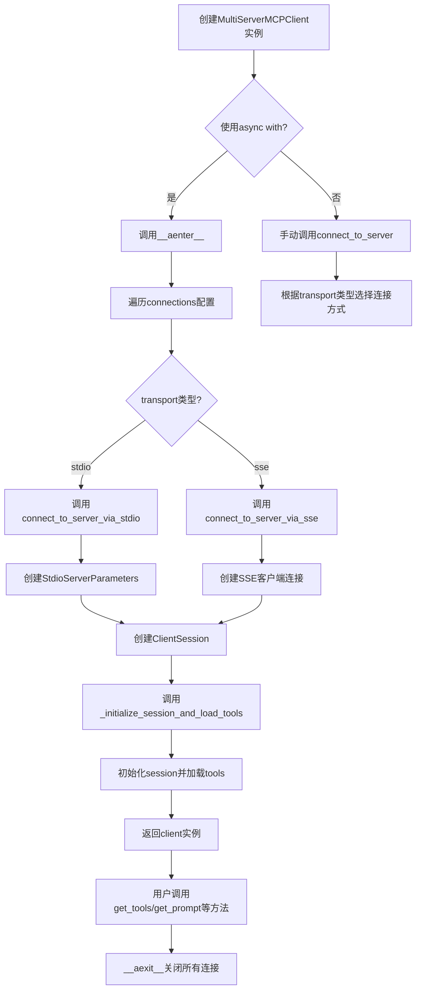

## 类结构

```
TypedDict
├── StdioConnection (stdio连接配置)
└── SSEConnection (SSE连接配置)

MultiServerMCPClient (主客户端类)
├── 初始化方法: __init__
├── 连接方法: connect_to_server
│   ├── connect_to_server_via_stdio
│   └── connect_to_server_via_sse
├── 内部方法: _initialize_session_and_load_tools
├── 会话获取: session
├── 工具获取: get_tools, get_tools_from_server, get_tool
└── 提示获取: list_prompts, get_prompt
```

## 全局变量及字段


### `DEFAULT_ENCODING`
    
默认文本编码格式

类型：`str`
    


### `DEFAULT_ENCODING_ERROR_HANDLER`
    
默认编码错误处理方式

类型：`str`
    


### `DEFAULT_HTTP_TIMEOUT`
    
默认HTTP请求超时时间（秒）

类型：`int`
    


### `DEFAULT_SSE_READ_TIMEOUT`
    
默认SSE读取超时时间（秒）

类型：`int`
    


### `StdioConnection.transport`
    
传输类型为stdio

类型：`Literal['stdio']`
    


### `StdioConnection.command`
    
可执行命令

类型：`str`
    


### `StdioConnection.args`
    
命令行参数列表

类型：`list[str]`
    


### `StdioConnection.env`
    
环境变量字典

类型：`dict[str, str] | None`
    


### `StdioConnection.encoding`
    
文本编码格式

类型：`str`
    


### `StdioConnection.encoding_error_handler`
    
编码错误处理方式

类型：`Literal['strict', 'ignore', 'replace']`
    


### `SSEConnection.transport`
    
传输类型为sse

类型：`Literal['sse']`
    


### `SSEConnection.url`
    
SSE端点URL

类型：`str`
    


### `SSEConnection.headers`
    
HTTP请求头

类型：`dict[str, Any] | None`
    


### `SSEConnection.timeout`
    
HTTP请求超时时间

类型：`float`
    


### `SSEConnection.sse_read_timeout`
    
SSE读取超时时间

类型：`float`
    


### `MultiServerMCPClient.connections`
    
服务器连接配置字典

类型：`dict[str, StdioConnection | SSEConnection]`
    


### `MultiServerMCPClient.exit_stack`
    
异步上下文管理器栈

类型：`AsyncExitStack`
    


### `MultiServerMCPClient.sessions`
    
服务器名称到会话的映射

类型：`dict[str, ClientSession]`
    


### `MultiServerMCPClient.server_name_to_tools`
    
服务器名称到工具列表的映射

类型：`dict[str, list[BaseTool]]`
    
    

## 全局函数及方法


### MultiServerMCPClient.__init__

初始化一个 MultiServerMCPClient 实例，用于管理多个 MCP 服务器连接并从这些服务器加载 LangChain 兼容的工具。该构造函数接收一个可选的服务器连接配置字典，初始化异步上下文管理所需的资源，并准备用于存储会话和工具的数据结构。

参数：

- `connections`：`dict[str, StdioConnection | SSEConnection] | None`，服务器名称到连接配置的映射字典。每个配置可以是 StdioConnection（标准输入/输出传输）或 SSEConnection（服务器发送事件传输）。如果为 None，则不建立初始连接。

返回值：`None`，该方法为构造函数，不返回任何值。

#### 流程图

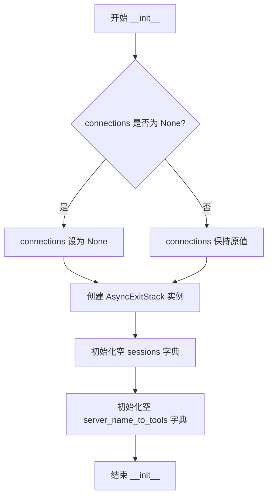

#### 带注释源码

```python
def __init__(self, connections: dict[str, StdioConnection | SSEConnection] = None) -> None:
    """Initialize a MultiServerMCPClient with MCP servers connections.

    Args:
        connections: A dictionary mapping server names to connection configurations.
            Each configuration can be either a StdioConnection or SSEConnection.
            If None, no initial connections are established.

    Example:

        ```python
        async with MultiServerMCPClient(
            {
                "math": {
                    "command": "python",
                    # Make sure to update to the full absolute path to your math_server.py file
                    "args": ["/path/to/math_server.py"],
                    "transport": "stdio",
                },
                "weather": {
                    # make sure you start your weather server on port 8000
                    "url": "http://localhost:8000/sse",
                    "transport": "sse",
                }
            }
        ) as client:
            all_tools = client.get_tools()
            ...
        ```
    """
    # 存储服务器连接配置，供 __aenter__ 方法中使用
    self.connections = connections
    
    # 创建异步上下文管理器栈，用于管理多个异步上下文的生命周期
    # 可以在单个 with 语句中管理多个异步资源（如连接、会话等）
    self.exit_stack = AsyncExitStack()
    
    # 存储服务器名称到 ClientSession 的映射
    # 用于维护与每个 MCP 服务器的会话连接
    self.sessions: dict[str, ClientSession] = {}
    
    # 存储服务器名称到工具列表的映射
    # 每个服务器可能提供多个工具，这些工具已转换为 LangChain 兼容格式
    self.server_name_to_tools: dict[str, list[BaseTool]] = {}
```


### `MultiServerMCPClient._initialize_session_and_load_tools`

该方法负责初始化 MCP 服务器的 ClientSession 并从该服务器加载可用的 LangChain 工具，将会话和工具存储在客户端实例中以供后续使用。

参数：

- `server_name`：`str`，用于标识此服务器连接的名称
- `session`：`ClientSession`，要初始化的 MCP 客户端会话实例

返回值：`None`，该方法直接修改实例状态，不返回任何值

#### 流程图

```mermaid
flowchart TD
    A[开始] --> B[调用 session.initialize&#40;&#41; 初始化会话]
    B --> C[将 session 存储到 self.sessions[server_name]]
    C --> D[调用 load_mcp_tools&#40;server_name, session&#41; 加载工具]
    D --> E[将工具列表存储到 self.server_name_to_tools[server_name]]
    E --> F[结束]
```

#### 带注释源码

```python
async def _initialize_session_and_load_tools(
        self, server_name: str, session: ClientSession
) -> None:
    """Initialize a session and load tools from it.

    Args:
        server_name: Name to identify this server connection
        session: The ClientSession to initialize
    """
    # Initialize the session
    # 通过调用 MCP 协议的 initialize 方法完成会话的握手和初始化
    await session.initialize()
    # 将初始化后的会话存储到实例的 sessions 字典中，以 server_name 为键
    self.sessions[server_name] = session

    # Load tools from this server
    # 使用专门的工具加载函数从 MCP 服务器获取可用的工具列表
    server_tools = await load_mcp_tools(server_name, session)
    # 将获取到的工具列表存储到 server_name_to_tools 字典中，供后续 get_tools 等方法使用
    self.server_name_to_tools[server_name] = server_tools
```


### `MultiServerMCPClient.connect_to_server`

该方法是一个通用的服务器连接方法，根据传入的 `transport` 参数动态选择使用 stdio 或 SSE 传输方式连接到 MCP 服务器，并传递相应的配置参数。

参数：

-  `server_name`：`str`，用于标识此服务器连接的名称
-  `transport`：`Literal["stdio", "sse"]`，传输类型，默认为 "stdio"
-  `**kwargs`：`Any`，传递给具体连接方法的额外参数（如 stdio 需要 command/args，SSE 需要 url/headers 等）

返回值：`None`，该方法为异步方法，无返回值

#### 流程图

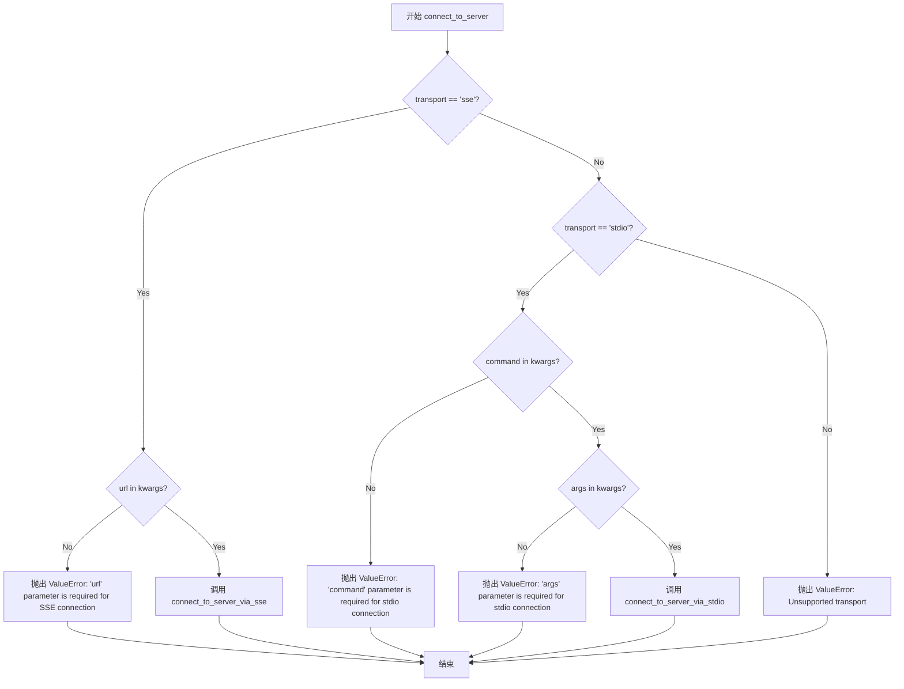

#### 带注释源码

```python
async def connect_to_server(
        self,
        server_name: str,
        *,
        transport: Literal["stdio", "sse"] = "stdio",
        **kwargs,
) -> None:
    """Connect to an MCP server using either stdio or SSE.

    This is a generic method that calls either connect_to_server_via_stdio or connect_to_server_via_sse
    based on the provided transport parameter.

    Args:
        server_name: Name to identify this server connection
        transport: Type of transport to use ("stdio" or "sse"), defaults to "stdio"
        **kwargs: Additional arguments to pass to the specific connection method

    Raises:
        ValueError: If transport is not recognized
        ValueError: If required parameters for the specified transport are missing
    """
    # 判断传输类型是否为 SSE
    if transport == "sse":
        # SSE 连接必须提供 url 参数
        if "url" not in kwargs:
            raise ValueError("'url' parameter is required for SSE connection")
        # 调用 SSE 连接方法，传递参数并使用默认值
        await self.connect_to_server_via_sse(
            server_name,
            url=kwargs["url"],
            headers=kwargs.get("headers"),
            timeout=kwargs.get("timeout", DEFAULT_HTTP_TIMEOUT),
            sse_read_timeout=kwargs.get("sse_read_timeout", DEFAULT_SSE_READ_TIMEOUT),
        )
    # 判断传输类型是否为 stdio
    elif transport == "stdio":
        # stdio 连接必须提供 command 参数
        if "command" not in kwargs:
            raise ValueError("'command' parameter is required for stdio connection")
        # stdio 连接必须提供 args 参数
        if "args" not in kwargs:
            raise ValueError("'args' parameter is required for stdio connection")
        # 调用 stdio 连接方法，传递参数并使用默认值
        await self.connect_to_server_via_stdio(
            server_name,
            command=kwargs["command"],
            args=kwargs["args"],
            env=kwargs.get("env"),
            encoding=kwargs.get("encoding", DEFAULT_ENCODING),
            encoding_error_handler=kwargs.get(
                "encoding_error_handler", DEFAULT_ENCODING_ERROR_HANDLER
            ),
        )
    # 不支持的传输类型
    else:
        raise ValueError(f"Unsupported transport: {transport}. Must be 'stdio' or 'sse'")
```


### `MultiServerMCPClient.connect_to_server_via_stdio`

通过标准输入输出（stdio）方式连接到指定的 MCP 服务器，建立通信会话并加载该服务器提供的工具。

参数：

- `self`：`MultiServerMCPClient`，当前客户端实例
- `server_name`：`str`，用于标识此服务器连接的名称
- `command`：`str`，要执行的命令（如 python、node 等可执行程序）
- `args`：`list[str]`，传递给命令的命令行参数列表
- `env`：`dict[str, str] | None`，执行命令时使用的环境变量，默认为 None
- `encoding`：`str`，发送/接收消息时使用的文本编码，默认为 "utf-8"
- `encoding_error_handler`：`Literal["strict", "ignore", "replace"]`，文本编码错误处理方式，默认为 "strict"

返回值：`None`，该方法为异步方法，通过副作用完成连接和工具加载

#### 流程图

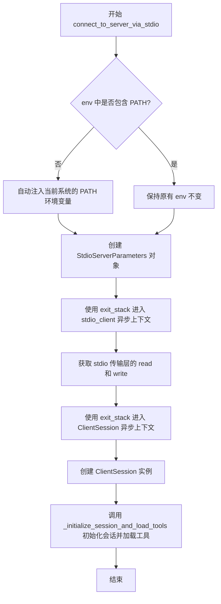

#### 带注释源码

```python
async def connect_to_server_via_stdio(
        self,
        server_name: str,
        *,
        command: str,
        args: list[str],
        env: dict[str, str] | None = None,
        encoding: str = DEFAULT_ENCODING,
        encoding_error_handler: Literal[
            "strict", "ignore", "replace"
        ] = DEFAULT_ENCODING_ERROR_HANDLER,
) -> None:
    """Connect to a specific MCP server using stdio

    Args:
        server_name: Name to identify this server connection
        command: Command to execute
        args: Arguments for the command
        env: Environment variables for the command
        encoding: Character encoding
        encoding_error_handler: How to handle encoding errors
    """
    # NOTE: execution commands (e.g., `uvx` / `npx`) require PATH envvar to be set.
    # To address this, we automatically inject existing PATH envvar into the `env` value,
    # if it's not already set.
    # 注意：执行命令（如 uvx / npx）需要 PATH 环境变量。
    # 为解决此问题，如果 env 中未设置 PATH，则自动注入当前系统的 PATH 环境变量。
    env = env or {}
    if "PATH" not in env:
        env["PATH"] = os.environ.get("PATH", "")

    # 创建 StdioServerParameters 对象，用于配置 stdio 服务器连接参数
    # 包括要执行的命令、参数、环境变量、编码方式及编码错误处理方式
    server_params = StdioServerParameters(
        command=command,
        args=args,
        env=env,
        encoding=encoding,
        encoding_error_handler=encoding_error_handler,
    )

    # Create and store the connection
    # 创建 stdio 客户端传输层并进入异步上下文管理器
    # stdio_client 返回一个元组 (read, write)，分别用于读取和写入数据
    stdio_transport = await self.exit_stack.enter_async_context(stdio_client(server_params))
    read, write = stdio_transport
    
    # 创建 MCP ClientSession 并进入异步上下文管理器
    # ClientSession 是与 MCP 服务器通信的核心会话对象
    # 使用 cast 确保类型安全
    session = cast(
        ClientSession,
        await self.exit_stack.enter_async_context(ClientSession(read, write)),
    )

    # 初始化会话并从该服务器加载工具
    # 这会调用 session.initialize() 并通过 load_mcp_tools 加载可用的工具
    await self._initialize_session_and_load_tools(server_name, session)
```


### `MultiServerMCPClient.connect_to_server_via_sse`

该方法用于通过 SSE（Server-Sent Events）传输协议连接到指定的 MCP 服务器，建立连接后会初始化会话并从服务器加载可用的工具。

参数：

-  `self`：`MultiServerMCPClient`，MultiServerMCPClient 实例本身
-  `server_name`：`str`，用于标识此服务器连接的名称
-  `url`：`str`，SSE 服务器的 URL 地址
-  `headers`：`dict[str, Any] | None`，要发送到 SSE 端点的 HTTP 请求头，默认为 None
-  `timeout`：`float`，HTTP 请求超时时间，默认为 DEFAULT_HTTP_TIMEOUT（5 秒）
-  `sse_read_timeout`：`float`，SSE 读取超时时间，默认为 DEFAULT_SSE_READ_TIMEOUT（300 秒）

返回值：`None`，该方法不返回任何值，仅建立连接并初始化会话和加载工具

#### 流程图

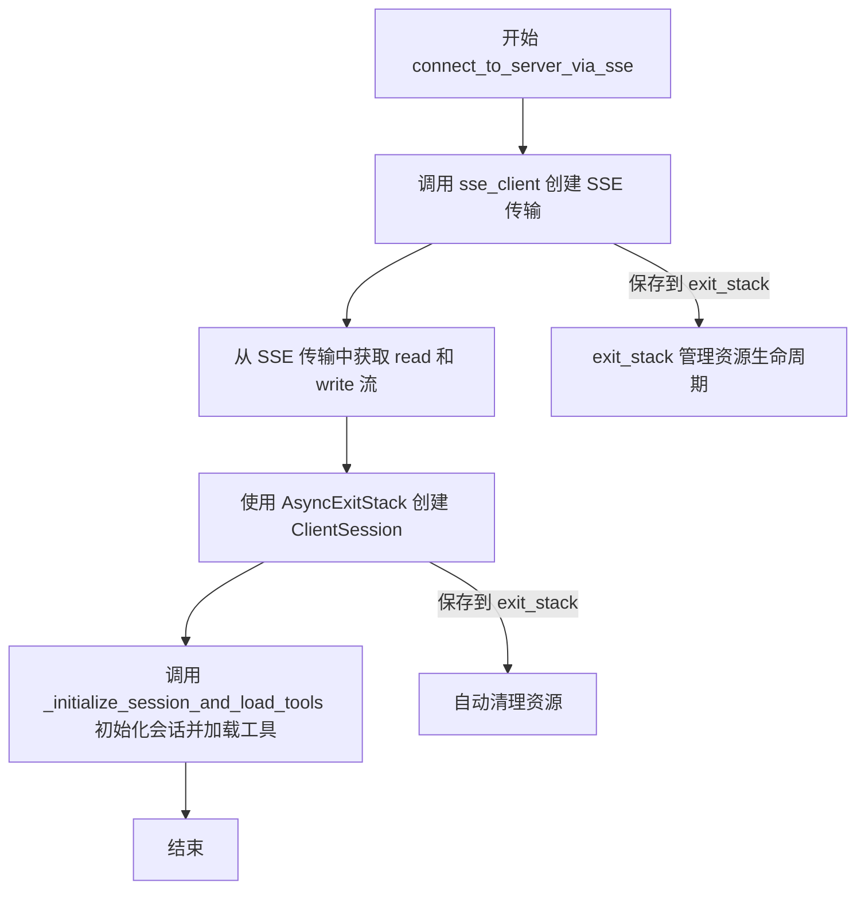

#### 带注释源码

```python
async def connect_to_server_via_sse(
        self,
        server_name: str,
        *,
        url: str,
        headers: dict[str, Any] | None = None,
        timeout: float = DEFAULT_HTTP_TIMEOUT,
        sse_read_timeout: float = DEFAULT_SSE_READ_TIMEOUT,
) -> None:
    """Connect to a specific MCP server using SSE

    Args:
        server_name: Name to identify this server connection
        url: URL of the SSE server
        headers: HTTP headers to send to the SSE endpoint
        timeout: HTTP timeout
        sse_read_timeout: SSE read timeout
    """
    # 使用 exit_stack 异步上下文管理器创建 SSE 客户端连接
    # sse_client 返回一个异步上下文管理器，接受 url、headers、timeout 和 sse_read_timeout 参数
    sse_transport = await self.exit_stack.enter_async_context(
        sse_client(url, headers, timeout, sse_read_timeout)
    )
    
    # 从 SSE 传输中解包获取读取和写入流
    # sse_client 返回 (read_stream, write_stream) 元组
    read, write = sse_transport
    
    # 使用 exit_stack 创建 ClientSession，用于与 MCP 服务器通信
    # cast 用于类型断言，确保返回的 ClientSession 类型正确
    session = cast(
        ClientSession,
        await self.exit_stack.enter_async_context(ClientSession(read, write)),
    )

    # 调用内部方法初始化会话并从服务器加载工具
    # 这会执行 session.initialize() 并调用 load_mcp_tools 加载该服务器提供的工具
    await self._initialize_session_and_load_tools(server_name, session)
```


### `MultiServerMCPClient.session`

获取指定 MCP 服务器的会话对象。

参数：

- `self`：`MultiServerMCPClient`，MultiServerMCPClient 实例本身
- `server_name`：`str`，服务器名称，用于标识要获取会话的 MCP 服务器

返回值：`ClientSession`，返回指定服务器对应的 ClientSession 会话对象

#### 流程图

```mermaid
flowchart TD
    A[开始获取 session] --> B{检查 server_name 是否在 sessions 字典中}
    B -->|存在| C[获取 session 对象]
    B -->|不存在| D[抛出 ValueError 异常]
    C --> E[返回 ClientSession]
    D --> F[异常: Session for server '{server_name}' not found.]
    
    style A fill:#f9f,stroke:#333
    style C fill:#9f9,stroke:#333
    style D fill:#f99,stroke:#333
    style E fill:#9f9,stroke:#333
    style F fill:#f99,stroke:#333
```

#### 带注释源码

```python
async def session(
        self, server_name: str) -> ClientSession:
    """Get the session for a given MCP server.
    
    根据服务器名称从已连接的会话字典中获取对应的 ClientSession。
    如果指定服务器名称的会话不存在，则抛出 ValueError 异常。
    
    Args:
        server_name: Name to identify this server connection
        
    Returns:
        ClientSession: The session for the specified MCP server
        
    Raises:
        ValueError: If no session exists for the given server_name
    """
    # 从 sessions 字典中尝试获取指定 server_name 对应的 session
    session = self.sessions.get(server_name)
    
    # 检查 session 是否存在
    if session is None:
        # 会话不存在时抛出详细的错误信息
        raise ValueError(f"Session for server '{server_name}' not found.")
    
    # 找到对应的 session，直接返回
    return session
```


### `MultiServerMCPClient.get_tools`

获取所有已连接 MCP 服务器的工具列表，将各服务器的工具合并后返回。

参数：
- 无（仅包含隐式参数 `self`）

返回值：`list[BaseTool]`，返回所有已连接服务器上可用的工具列表，如果没有任何服务器连接则返回空列表。

#### 流程图

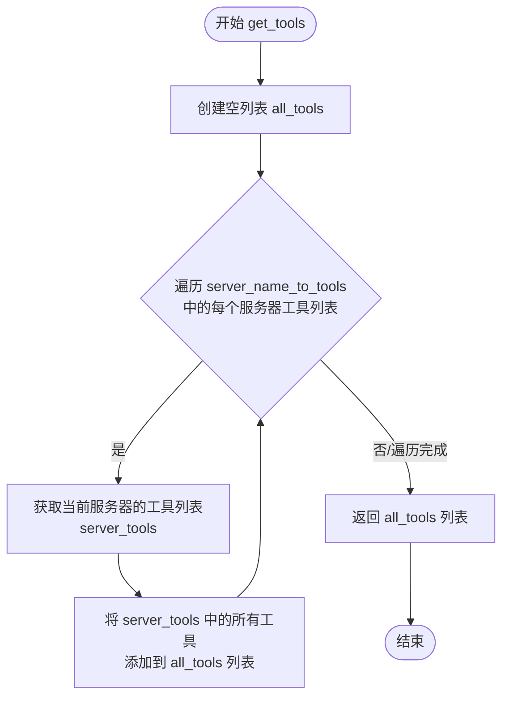

#### 带注释源码

```python
def get_tools(self) -> list[BaseTool]:
    """Get a list of all tools from all connected servers."""
    # 初始化一个空列表，用于存储所有服务器的工具
    all_tools: list[BaseTool] = []
    # 遍历 server_name_to_tools 字典中的每个值（即每个服务器的工具列表）
    for server_tools in self.server_name_to_tools.values():
        # 将当前服务器的工具列表展开并添加到 all_tools 中
        all_tools.extend(server_tools)
    # 返回合并后的所有工具列表
    return all_tools
```


### `MultiServerMCPClient.get_tools_from_server`

从指定 MCP 服务器获取对应的工具列表，如果服务器不存在则返回空列表。

参数：

- `server_name`：`str`，服务器名称，用于标识要从中获取工具的 MCP 服务器

返回值：`list[BaseTool]`，从指定服务器获取的工具列表，如果服务器不存在则返回空列表

#### 流程图

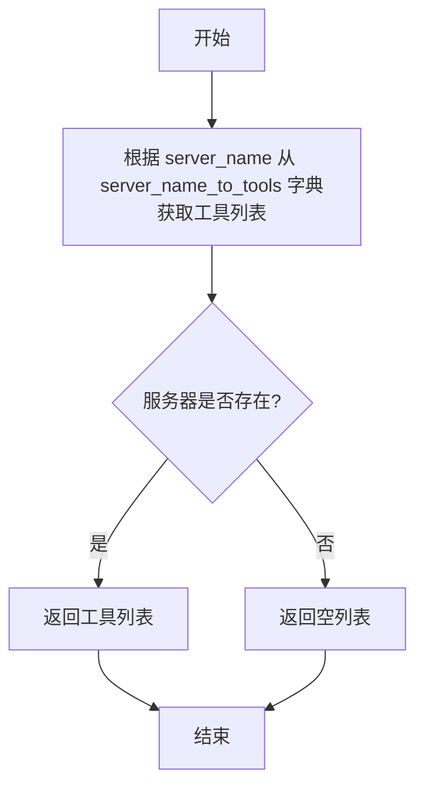

#### 带注释源码

```python
async def get_tools_from_server(self, server_name: str) -> list[BaseTool]:
    """Get tools from a specific MCP server.
    
    从指定的 MCP 服务器获取已加载的工具列表。
    这是一个便捷方法，用于从多服务器客户端中筛选特定服务器的 tools。
    
    Args:
        server_name: 服务器名称，用于标识要获取工具的 MCP 服务器
        
    Returns:
        list[BaseTool]: 从指定服务器获取的工具列表，如果服务器不存在则返回空列表
    """
    # 使用字典的 get 方法安全获取，如果键不存在则返回默认值空列表
    return self.server_name_to_tools.get(server_name, [])
```


### `MultiServerMCPClient.get_tool`

获取指定 MCP 服务器上名称匹配的特定工具。

参数：

- `server_name`：`str`，服务器名称，用于定位从哪个 MCP 服务器获取工具
- `tool_name`：`str`，工具名称，用于在服务器的工具列表中匹配目标工具

返回值：`BaseTool | None`，如果找到名称匹配的 Tool 则返回该 BaseTool 对象，否则返回 None

#### 流程图

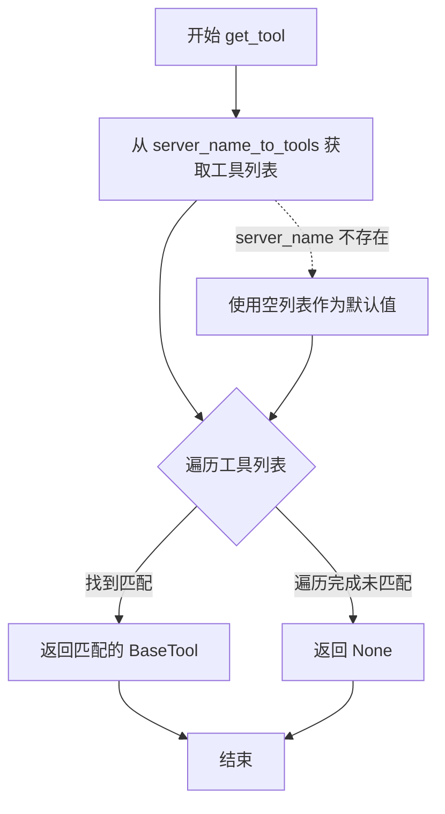

#### 带注释源码

```python
async def get_tool(
        self, server_name: str, tool_name: str
) -> BaseTool | None:
    """Get a specific tool from a given MCP server."""
    # 从 server_name_to_tools 字典中获取指定服务器的工具列表
    # 如果 server_name 不存在，则返回空列表作为默认值
    tools = self.server_name_to_tools.get(server_name, [])
    
    # 遍历该服务器的所有可用工具
    for tool in tools:
        # 检查当前工具的名称是否与请求的工具名称匹配
        if tool.name == tool_name:
            # 找到匹配的工具，返回该 BaseTool 对象
            return tool
    
    # 遍历完所有工具均未匹配，返回 None
    return None
```


### `MultiServerMCPClient.list_prompts`

列出给定MCP服务器的所有提示（Prompts），通过会话获取服务器提供的提示列表并返回。

参数：

- `server_name`：`str`，MCP服务器的名称，用于从已连接的会话中检索提示

返回值：`list[Prompt]`，返回从MCP服务器获取的提示列表

#### 流程图

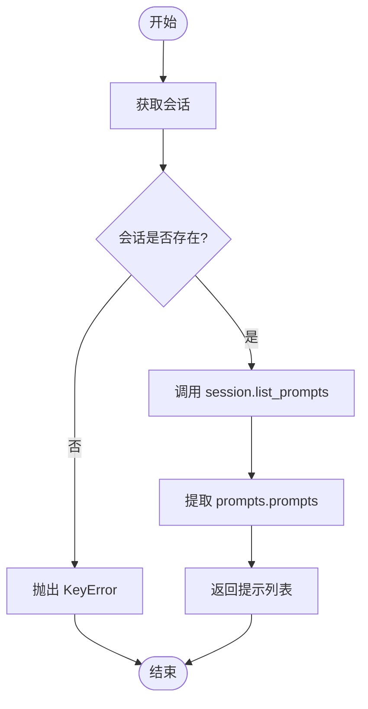

#### 带注释源码

```python
async def list_prompts(
        self, server_name: str  # 服务器名称，用于标识MCP服务器
) -> list[Prompt]:  # 返回MCP服务器提供的提示列表
    """List all prompts from a given MCP server."""
    # 从已存储的会话字典中获取指定服务器的会话对象
    session = self.sessions[server_name]
    # 异步调用MCP会话的list_prompts方法获取服务器上的所有提示
    prompts = await session.list_prompts()
    # 从PromptsResult对象中提取prompts列表并返回
    return [prompt for prompt in prompts.prompts]
```


# MultiServerMCPClient.get_prompt 详细设计文档

## 一段话描述

`MultiServerMCPClient.get_prompt` 是一个异步方法，用于从指定的 MCP 服务器获取预定义的提示词（Prompt），并将其转换为 LangChain 兼容的消息格式列表（HumanMessage 或 AIMessage），使得 AI 代理能够使用 MCP 服务器提供的提示模板。

## 参数

- `server_name`：`str`，服务器名称，用于标识要从中获取提示的 MCP 服务器连接
- `prompt_name`：`str`，提示词名称，指定要获取的提示词模板的唯一标识符
- `arguments`：`Optional[dict[str, Any]]`，可选参数字典，包含传递给提示词模板的参数变量

## 返回值

`list[HumanMessage | AIMessage]`，返回从 MCP 服务器获取的提示词转换后的人类消息或 AI 消息列表

## 流程图

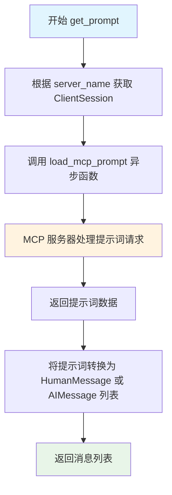

## 带注释源码

```python
async def get_prompt(
        self, server_name: str, prompt_name: str, arguments: Optional[dict[str, Any]]
) -> list[HumanMessage | AIMessage]:
    """Get a prompt from a given MCP server.
    
    此方法从指定的 MCP 服务器获取预定义的提示词模板，
    并将其转换为 LangChain 兼容的消息格式。
    
    Args:
        server_name: 服务器名称，用于从已连接的会话中获取对应的 ClientSession
        prompt_name: 提示词名称，MCP 服务器上注册的提示词模板标识符
        arguments: 可选的参数字典，用于填充提示词模板中的占位符变量
    
    Returns:
        list[HumanMessage | AIMessage]: 转换后的消息列表，可直接用于 LangChain 代理
    """
    # 从会话字典中获取对应服务器的 ClientSession
    # 注意：此处未做 session 为空的检查，可能抛出 KeyError
    session = self.sessions[server_name]
    
    # 调用工具函数加载 MCP 提示词，该函数会：
    # 1. 通过 session 调用 MCP 服务器的 get_prompt 方法
    # 2. 获取提示词模板及参数
    # 3. 使用传入的 arguments 填充模板
    # 4. 将结果转换为 HumanMessage 或 AIMessage 格式
    return await load_mcp_prompt(session, prompt_name, arguments)
```

---

## 类详细信息

### MultiServerMCPClient

**描述**：用于连接多个 MCP 服务器并从中加载 LangChain 兼容工具的客户端类

**类字段**：

| 字段名称 | 类型 | 描述 |
|---------|------|------|
| `connections` | `dict[str, StdioConnection \| SSEConnection]` | 服务器连接配置字典 |
| `exit_stack` | `AsyncExitStack` | 异步上下文管理器栈，用于资源清理 |
| `sessions` | `dict[str, ClientSession]` | 服务器名称到会话对象的映射 |
| `server_name_to_tools` | `dict[str, list[BaseTool]]` | 服务器名称到工具列表的映射 |

---

## 关键组件信息

| 组件名称 | 描述 |
|---------|------|
| `ClientSession` | MCP 客户端会话，用于与 MCP 服务器通信 |
| `load_mcp_prompt` | 工具函数，将 MCP 服务器的提示词转换为 LangChain 消息格式 |
| `StdioConnection` | 标准输入/输出连接配置类型 |
| `SSEConnection` | Server-Sent Events 连接配置类型 |
| `BaseTool` | LangChain 基础工具抽象类 |

---

## 潜在技术债务与优化空间

1. **缺少会话存在性检查**：在 `get_prompt` 方法中直接通过 `self.sessions[server_name]` 访问会话，若会话不存在会抛出 `KeyError` 异常，建议改为使用 `.get()` 方法并抛出更友好的 `ValueError`。

2. **异常处理缺失**：`get_prompt` 方法未处理 MCP 服务器可能抛出的异常（如网络超时、服务器不可用、提示词不存在等），建议添加 try-catch 块并提供有意义的错误信息。

3. **参数验证不足**：未对 `prompt_name` 进行空值校验，未对 `arguments` 的格式进行验证。

4. **类型提示可改进**：返回值类型 `list[HumanMessage | AIMessage]` 可以考虑使用 `list[BaseMessage]` 以提高通用性。

---

## 其它项目

### 设计目标与约束
- 支持通过 stdio 和 SSE 两种传输协议连接多个 MCP 服务器
- 统一加载工具和提示词接口，与 LangChain 生态系统兼容

### 错误处理与异常设计
- 连接失败时通过 `__aenter__` 中的异常处理调用 `exit_stack.aclose()` 清理资源
- 会话不存在时抛出 `ValueError`（在 `session()` 方法中）

### 数据流
```
MCP Server → ClientSession → load_mcp_prompt() → HumanMessage/AIMessage → 返回给调用者
```

### 外部依赖
- `langchain_core.messages`: 消息类型定义
- `mcp`: MCP 协议客户端库
- `langchain_chatchat.agent_toolkits.mcp_kit.prompts`: 提示词加载工具函数


### `MultiServerMCPClient.__aenter__`

异步上下文管理器的入口方法，用于在进入 `async with` 语句时初始化并连接到所有配置的 MCP 服务器。

参数：此方法无显式参数（`self` 为隐式参数）。

返回值：`MultiServerMCPClient`，返回客户端自身实例，以便在 `async with` 块中使用。

#### 流程图

```mermaid
flowchart TD
    A[开始 __aenter__] --> B{获取 connections}
    B --> C[connections 为 None?]
    C -->|是| D[使用空字典 {}]
    C -->|否| E[使用 self.connections]
    D --> F[遍历 connections.items]
    E --> F
    F --> G[复制当前连接配置]
    G --> H[提取 transport 类型]
    H --> I{transport == 'stdio'?}
    I -->|是| J[调用 connect_to_server_via_stdio]
    I -->|否| K{transport == 'sse'?}
    K -->|是| L[调用 connect_to_server_via_sse]
    K -->|否| M[抛出 ValueError]
    J --> N[连接成功, 继续遍历]
    L --> N
    M --> O[关闭 exit_stack]
    O --> P[重新抛出异常]
    N --> Q{还有更多服务器?}
    Q -->|是| G
    Q -->|否| R[返回 self]
    R --> S[结束 __aenter__]
```

#### 带注释源码

```python
async def __aenter__(self) -> "MultiServerMCPClient":
    """异步上下文管理器入口方法，在进入 async with 时调用。
    
    该方法会遍历所有配置的连接，逐个建立与 MCP 服务器的连接。
    使用 try-except 块确保即使连接失败也能正确清理资源。
    
    Returns:
        MultiServerMCPClient: 返回自身实例，允许链式调用和直接访问工具
    """
    try:
        # 获取连接配置，如果为 None 则使用空字典
        # 这样可以处理未传入 connections 参数的情况
        connections = self.connections or {}
        
        # 遍历所有配置的服务器连接
        for server_name, connection in connections.items():
            # 复制连接配置，避免修改原始字典
            # 因为后续需要 pop 移除 transport 字段
            connection_dict = connection.copy()
            
            # 从配置中提取传输类型，并从字典中移除
            # transport 可以是 'stdio' 或 'sse'
            transport = connection_dict.pop("transport")
            
            # 根据传输类型选择对应的连接方法
            if transport == "stdio":
                # 使用标准输入输出方式连接服务器
                # connection_dict 包含 command, args, env 等参数
                await self.connect_to_server_via_stdio(server_name, **connection_dict)
            elif transport == "sse":
                # 使用 Server-Sent Events 方式连接服务器
                # connection_dict 包含 url, headers, timeout 等参数
                await self.connect_to_server_via_sse(server_name, **connection_dict)
            else:
                # 不支持的传输类型，抛出明确的错误信息
                raise ValueError(
                    f"Unsupported transport: {transport}. Must be 'stdio' or 'sse'"
                )
        
        # 所有服务器连接成功后，返回自身实例
        # 这样 async with 块可以直接使用 client 对象
        return self
    
    except Exception:
        # 任何连接过程中的异常都会被捕获
        # 先关闭 AsyncExitStack 清理已分配的资源（如已打开的连接、进程等）
        await self.exit_stack.aclose()
        # 然后重新抛出原始异常，让调用者知道发生了什么错误
        raise
```


### `MultiServerMCPClient.__aexit__`

这是异步上下文管理器的退出方法，在 `async with` 语句块结束时自动调用，负责清理所有已建立的 MCP 服务器连接和资源。

参数：

- `exc_type`：`type[BaseException] | None`，如果发生异常则为异常类型，否则为 None
- `exc_val`：`BaseException | None`，如果发生异常则为异常实例，否则为 None
- `exc_tb`：`TracebackType | None`，如果发生异常则为回溯对象，否则为 None

返回值：`None`，无返回值

#### 流程图

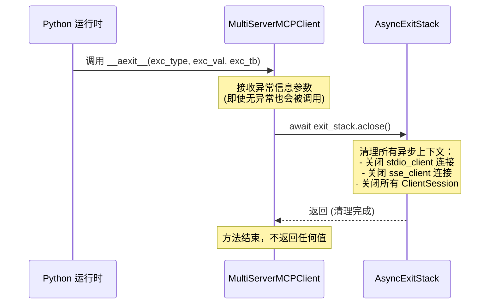

#### 带注释源码

```python
async def __aexit__(
        self,
        exc_type: type[BaseException] | None,
        exc_val: BaseException | None,
        exc_tb: TracebackType | None,
) -> None:
    """异步上下文管理器退出方法，在 async with 块结束时自动调用。
    
    此方法负责清理所有已建立的 MCP 服务器连接，包括：
    - 关闭所有通过 stdio 建立的服务器连接
    - 关闭所有通过 SSE 建立的服务器连接
    - 关闭所有 ClientSession 对象
    
    Args:
        exc_type: 异常类型，如果 with 块中发生异常则为异常类，否则为 None
        exc_val: 异常实例，如果 with 块中发生异常则为异常对象，否则为 None
        exc_tb: 异常回溯对象，如果 with 块中发生异常则为 TracebackType，否则为 None
    
    Returns:
        None: 此方法不返回任何值，也不抑制异常
    """
    # 调用 AsyncExitStack 的 aclose() 方法清理所有异步上下文资源
    # 这会按照创建顺序的逆序依次退出所有 entered 的异步上下文：
    # 1. 关闭所有 ClientSession
    # 2. 关闭 stdio_client 的读写流
    # 3. 关闭 sse_client 的连接
    await self.exit_stack.aclose()
```

## 关键组件


### StdioConnection

TypedDict 定义，用于配置通过 stdio 传输的 MCP 服务器连接参数，包含命令、参数、环境变量和编码等配置。

### SSEConnection

TypedDict 定义，用于配置通过 SSE（Server-Sent Events）传输的 MCP 服务器连接参数，包含 URL、请求头、超时设置等配置。

### MultiServerMCPClient

主客户端类，负责管理多个 MCP 服务器连接并从中加载 LangChain 兼容的工具。支持 stdio 和 SSE 两种传输协议，提供异步上下文管理器接口进行连接管理。

### 传输层抽象

支持两种传输协议：stdio（标准输入输出）和 SSE（Server-Sent Events），通过 `connect_to_server` 方法进行统一调度，根据传入的 transport 参数选择具体实现。

### 会话管理

通过 `sessions` 字典管理各服务器的 `ClientSession` 实例，提供 `session()` 方法获取特定服务器的会话，支持会话的创建、存储和检索。

### 工具加载机制

使用惰性加载模式，通过 `server_name_to_tools` 字典缓存各服务器的工具，提供 `get_tools()`、`get_tools_from_server()` 和 `get_tool()` 方法获取工具，支持按服务器名称和工具名称查询。

### 提示词管理

提供 `list_prompts()` 和 `get_prompt()` 方法从 MCP 服务器列出和获取提示词，返回 LangChain 消息格式。

### 环境变量注入

在 stdio 连接时自动注入 PATH 环境变量，确保执行命令（如 uvx/npx）能够正确找到可执行文件。

### 异步上下文管理

实现 `__aenter__` 和 `__aexit__` 方法，支持 async with 语法，自动管理连接生命周期和资源清理，使用 `AsyncExitStack` 确保所有连接正确关闭。


## 问题及建议


### 已知问题

- **类型注解不一致**：`__init__`方法中`connections`参数默认为`None`，但类型注解为`dict[str, StdioConnection | SSEConnection] = None`，应使用`Optional[...]`包装
- **session获取缺少错误处理**：`list_prompts`和`get_prompt`方法直接通过`self.sessions[server_name]`访问，未检查session是否存在，若session不存在会抛出KeyError而非更友好的ValueError
- **类型安全风险**：使用`cast`强制类型转换可能掩盖潜在的运行时错误，隐藏类型不匹配问题
- **资源泄漏风险**：当`__aenter__`中连接多个服务器时，如果中途某个服务器连接失败，已成功建立的连接资源可能无法正确释放
- **并发安全问题**：`_initialize_session_and_load_tools`方法在并发调用时可能存在竞态条件，缺少线程安全保护
- **重复代码模式**：stdio和SSE连接初始化逻辑存在重复，可抽取公共基类或组合逻辑
- **API设计不一致**：`get_tools()`是同步方法但其他方法都是异步的，调用方需要特别注意上下文切换
- **默认值处理逻辑问题**：在`connect_to_server`中使用`kwargs.get("timeout", DEFAULT_HTTP_TIMEOUT)`，但对于SSE连接默认超时为5秒可能过短
- **字典复制开销**：`__aenter__`中使用`connection.copy()`复制整个连接字典，在连接数量多时有不必要的性能开销

### 优化建议

- 修正`connections`参数的类型注解为`Optional[dict[str, StdioConnection | SSEConnection]] = None`
- 在`list_prompts`和`get_prompt`方法中使用`session`方法获取session，利用其已有的错误检查逻辑
- 考虑移除`cast`调用，改为在`stdio_client`和`sse_client`返回后进行类型验证
- 在`__aenter__`的异常处理中记录已成功连接的服务器，确保资源清理完整性
- 对于`_initialize_session_and_load_tools`考虑添加异步锁或使用线程安全的数据结构
- 抽取`StdioConnection`和`SSEConnection`的公共连接逻辑到私有方法中
- 考虑将`get_tools`改为异步方法，或提供异步版本`async def get_tools`
- SSE连接默认超时5秒可能不适合复杂请求，建议增大默认值或移除默认值强制要求调用方指定
- 可考虑使用`dataclasses`或`pydantic`替代TypedDict以获得更强的类型检查和验证能力

## 其它


### 设计目标与约束

**设计目标**：提供一个统一的客户端来连接和管理多个MCP（Model Context Protocol）服务器，支持通过stdio和SSE两种传输协议连接，并从这些服务器加载LangChain兼容的工具（BaseTool）。

**约束**：
- 仅支持stdio和SSE两种传输协议
- 连接配置必须在客户端初始化时或通过connect_to_server方法提供
- 所有MCP服务器交互都是异步的
- 客户端必须作为异步上下文管理器使用（async with）

### 错误处理与异常设计

**异常类型**：
- `ValueError`：当传输类型不支持、缺少必需参数（如stdio的command/args或SSE的url）时抛出
- `KeyError`：当请求不存在的服务器会话时可能抛出（通过sessions字典访问）
- `TypeError`：当连接配置类型不匹配时可能抛出

**异常传播**：
- 在`__aenter__`方法中，如果连接任何服务器失败，会调用`exit_stack.aclose()`清理已创建的资源，然后重新抛出异常
- 在`__aexit__`方法中，总是调用`exit_stack.aclose()`确保资源释放

### 数据流与状态机

**状态转换**：
1. **初始状态**：客户端创建，`sessions`和`server_name_to_tools`为空字典
2. **连接中**：调用`__aenter__`或`connect_to_server`方法，与服务器建立连接
3. **已连接**：会话已初始化，工具已加载，可用于查询
4. **已关闭**：调用`__aexit__`或显式关闭后，资源已释放

**数据流**：
- 连接配置 → `connect_to_server` → 创建传输层 → 创建ClientSession → 初始化会话 → 加载工具 → 存储会话和工具
- 获取工具请求 → `get_tools`/`get_tools_from_server`/`get_tool` → 查询`server_name_to_tools`字典 → 返回结果

### 外部依赖与接口契约

**主要依赖**：
- `langchain_core.messages`：AIMessage、HumanMessage
- `langchain_core.tools`：BaseTool
- `mcp`：ClientSession、StdioServerParameters、stdio_client、sse_client、sse_client
- `langchain_chatchat.agent_toolkits.mcp_kit.prompts`：load_mcp_prompt
- `langchain_chatchat.agent_toolkits.mcp_kit.tools`：load_mcp_tools

**接口契约**：
- StdioConnection必须包含：transport、command、args
- SSEConnection必须包含：transport、url
- 所有连接配置可选包含：env、encoding、encoding_error_handler（stdio）、headers、timeout、sse_read_timeout（sse）

### 并发与线程安全性

**异步设计**：
- 所有MCP交互方法都是async函数
- 使用AsyncExitStack管理多个异步上下文的生命周期
- sessions和server_name_to_tools字典在单个事件循环中访问，无需额外锁

**限制**：
- 非线程安全，不应在多线程环境中直接共享同一个客户端实例
- 每个服务器连接是独立的，可以并行连接多个服务器

### 资源管理与生命周期

**资源类型**：
- 进程资源：stdio连接启动的子进程
- 网络资源：SSE连接的HTTP连接
- 内存资源：sessions和server_name_to_tools字典

**生命周期管理**：
- 通过async上下文管理器（`__aenter__`/`__aexit__`）自动管理
- `exit_stack`确保所有异步上下文正确关闭
- 客户端关闭时，所有服务器连接自动断开

### 配置与扩展性

**可配置项**：
- 默认编码：utf-8
- 默认编码错误处理：strict
- 默认HTTP超时：5秒
- 默认SSE读取超时：300秒（5分钟）

**扩展点**：
- 支持自定义传输协议（通过扩展connect_to_server方法）
- 连接配置通过字典传入，便于动态配置
- 可通过继承MultiServerMCPClient添加自定义功能

### 安全性考虑

**环境变量处理**：
- 自动将系统PATH环境变量注入stdio连接的环境变量中（如果未设置）
- 允许用户通过env参数自定义环境变量

**输入验证**：
- 在connect_to_server方法中验证必需参数（command、args、url）
- 验证传输类型是否为支持的类型（stdio或sse）

**潜在风险**：
- stdio模式直接执行命令，需确保command和args来源可信
- SSE模式通过HTTP连接，需考虑网络安全性

### 性能考量

**性能特性**：
- 连接建立是惰性的（在`__aenter__`或显式调用connect_to_server时）
- 工具加载在连接时完成，后续查询无需重新加载
- 使用字典存储会话和工具，查找效率为O(1)

**优化建议**：
- 对于大量服务器场景，可考虑并行连接（使用asyncio.gather）
- 对于长时间运行的SSE连接，注意sse_read_timeout配置

### 测试策略

**测试范围**：
- 单元测试：测试各个方法的输入输出
- 集成测试：测试与实际MCP服务器的连接
- 异常测试：测试各种错误场景

**测试重点**：
- 验证不同传输协议（stdio、SSE）的连接
- 验证工具加载功能
- 验证资源清理（上下文管理器退出）
- 验证错误处理（缺少参数、不支持的传输类型等）


    