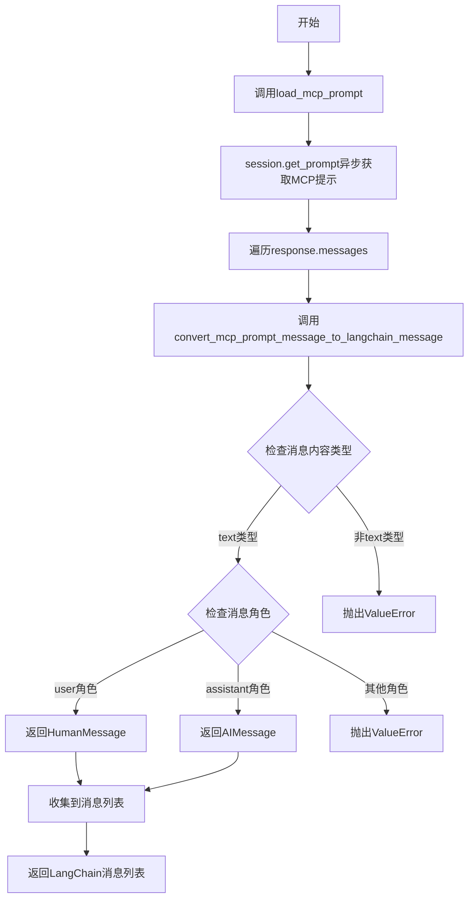
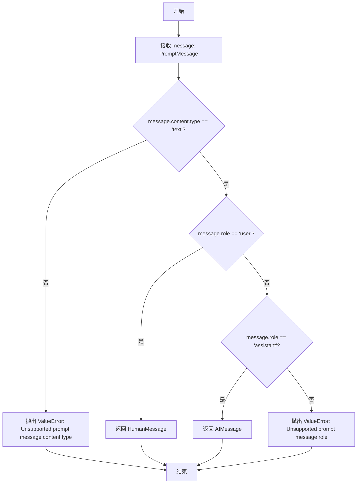
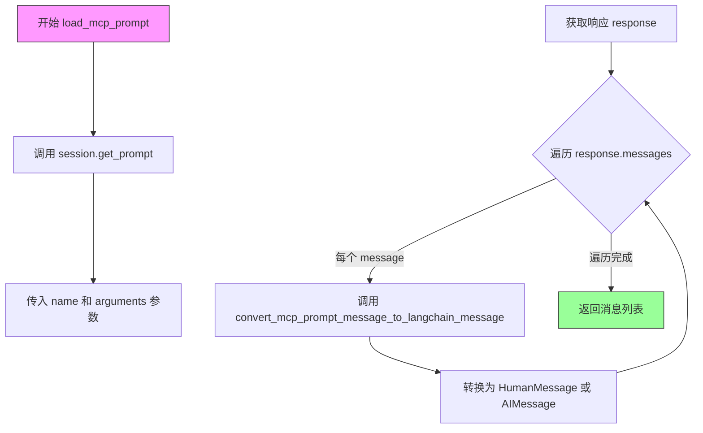

# `Langchain-Chatchat\libs\chatchat-server\langchain_chatchat\agent_toolkits\mcp_kit\prompts.py` 详细设计文档

该代码是一个MCP（Model Context Protocol）到LangChain的消息转换适配器模块，主要功能是将MCP协议的提示消息（PromptMessage）转换为LangChain框架的HumanMessage或AIMessage对象，支持文本类型的消息内容和用户/助手角色识别，并提供异步加载MCP提示的便捷函数。

## 整体流程



## 类结构

```
无类层次结构（纯函数模块）
└── 模块级别函数
    ├── convert_mcp_prompt_message_to_langchain_message
    └── load_mcp_prompt
```

## 全局变量及字段


### `convert_mcp_prompt_message_to_langchain_message`
    
将 MCP prompt 消息转换为 LangChain 的 HumanMessage 或 AIMessage

类型：`function(message: PromptMessage) -> HumanMessage | AIMessage`
    


### `load_mcp_prompt`
    
异步加载 MCP prompt 并将其转换为 LangChain 消息列表

类型：`async function(session: ClientSession, name: str, arguments: Optional[dict[str, Any]] = None) -> list[HumanMessage | AIMessage]`
    


### `message`
    
MCP prompt 消息输入参数

类型：`PromptMessage`
    


### `session`
    
MCP 客户端会话实例

类型：`ClientSession`
    


### `name`
    
要加载的 MCP prompt 名称

类型：`str`
    


### `arguments`
    
传递给 MCP prompt 的可选参数

类型：`Optional[dict[str, Any]]`
    


### `response`
    
MCP session.get_prompt 返回的响应对象

类型：`Any`
    


    

## 全局函数及方法


### `convert_mcp_prompt_message_to_langchain_message`

将 MCP（Model Context Protocol）提示消息转换为 LangChain 消息对象。该函数接收一个 MCP 的 PromptMessage，根据其内容类型和角色信息，转换为对应的 LangChain 的 HumanMessage 或 AIMessage。

参数：

- `message`：`PromptMessage`，MCP 协议中的提示消息对象，包含角色和内容信息

返回值：`HumanMessage | AIMessage`，LangChain 消息类型，根据 MCP 消息的角色返回人类消息或 AI 消息

#### 流程图



#### 带注释源码

```python
def convert_mcp_prompt_message_to_langchain_message(
        message: PromptMessage,
) -> HumanMessage | AIMessage:
    """Convert an MCP prompt message to a LangChain message.

    Args:
        message: MCP prompt message to convert

    Returns:
        a LangChain message
    """
    # 仅支持文本类型的消息内容
    if message.content.type == "text":
        # 根据角色决定转换为哪种LangChain消息类型
        if message.role == "user":
            # 用户角色转换为HumanMessage
            return HumanMessage(content=message.content.text)
        elif message.role == "assistant":
            # 助手角色转换为AIMessage
            return AIMessage(content=message.content.text)
        else:
            # 不支持的角色的错误处理
            raise ValueError(f"Unsupported prompt message role: {message.role}")

    # 不支持的内容类型的错误处理
    raise ValueError(f"Unsupported prompt message content type: {message.content.type}")
```


### `load_mcp_prompt`

加载 MCP prompt 并将其转换为 LangChain 消息列表。

参数：

- `session`：`ClientSession`，MCP 客户端会话，用于获取 prompt
- `name`：`str`，要加载的 MCP prompt 的名称
- `arguments`：`Optional[dict[str, Any]]`，可选的参数字典，用于 prompt 渲染

返回值：`list[HumanMessage | AIMessage]`，转换后的 LangChain 消息列表

#### 流程图



#### 带注释源码

```python
async def load_mcp_prompt(
        session: ClientSession, name: str, arguments: Optional[dict[str, Any]] = None
) -> list[HumanMessage | AIMessage]:
    """Load MCP prompt and convert to LangChain messages.
    
    该异步函数执行以下操作：
    1. 通过 MCP ClientSession 获取指定名称的 prompt
    2. 将 MCP 格式的 prompt 消息转换为 LangChain 的消息对象
    3. 返回转换后的消息列表供后续使用
    
    Args:
        session: MCP 客户端会话实例，用于与 MCP 服务器通信
        name: 要加载的 prompt 的标识名称
        arguments: 可选的参数字典，用于动态渲染 prompt 模板
    
    Returns:
        包含 HumanMessage 和 AIMessage 的列表，可直接用于 LangChain 链式调用
    """
    # 调用 MCP ClientSession 的 get_prompt 方法获取 prompt
    # 这是一个异步调用，会等待 MCP 服务器返回 prompt 结果
    response = await session.get_prompt(name, arguments)
    
    # 遍历响应中的所有消息，将每个 MCP 消息转换为 LangChain 消息格式
    # 使用列表推导式简洁地完成批量转换
    return [
        convert_mcp_prompt_message_to_langchain_message(message) for message in response.messages
    ]
```

## 关键组件


### 消息类型转换组件

负责将MCP协议的PromptMessage转换为LangChain的HumanMessage或AIMessage，支持text类型的消息内容，根据消息角色区分用户和助手消息。

### 异步提示加载组件

异步加载MCP提示的接口封装，通过ClientSession获取提示并将返回的MCP消息列表批量转换为LangChain消息格式。

### 类型支持与验证组件

处理MCP消息的内容类型和角色验证，对不支持的消息类型和角色抛出明确的ValueError异常，确保类型安全。


## 问题及建议


### 已知问题

- **错误处理不完善**：只支持"text"内容类型和"user"/"assistant"角色，对于其他类型（如"image"、"resource"）和其他角色（如"system"）会直接抛出异常，缺乏更友好的错误处理和日志记录
- **类型提示不够精确**：使用旧版`Optional[dict[str, Any]]`而非Python 3.10+的`dict[str, Any] | None`语法；缺少对返回消息列表的TypeAlias定义
- **缺少输入验证**：未对`session`、`name`参数进行空值校验，对`arguments`字典内容也无验证
- **功能可扩展性不足**：无法处理MCP消息中可能存在的多模态内容（如图片、文件等），限制了与更复杂MCP工具的集成能力
- **缺少日志记录**：没有任何日志输出，线上问题排查困难

### 优化建议

- **完善错误处理**：添加try-except包装，区分不同错误类型；引入日志模块记录转换过程；为不支持的类型提供更详细的错误信息或降级方案
- **改进类型注解**：定义`LangChainMessage = HumanMessage | AIMessage`作为类型别名；更新参数类型为现代语法；添加返回类型注解
- **增强输入校验**：使用Pydantic或自定义验证器对输入参数进行校验，确保`session`有效、`name`非空
- **扩展内容类型支持**：增加对`image`、`resource`等其他MCP内容类型的处理支持，或预留扩展接口
- **添加日志记录**：使用`logging`模块记录关键操作，便于调试和监控
- **完善文档注释**：为模块级添加docstring，说明模块职责和主要导出接口


## 其它


### 设计目标与约束

本模块旨在实现MCP (Model Context Protocol) 与 LangChain 之间的消息格式转换，使LangChain能够消费MCP协议定义的提示消息。主要约束包括：仅支持文本类型的消息内容，不支持其他MCP内容类型（如图像、工具调用等）；依赖langchain-core和mcp两个核心库；函数设计为纯转换逻辑，无状态依赖。

### 错误处理与异常设计

异常处理策略采用明确的消息抛出机制。当遇到不支持的prompt message role时，抛出ValueError并包含具体的role信息；当遇到不支持的content type时，同样抛出ValueError并包含type信息。这种设计使得调用方能够根据异常信息进行针对性处理。load_mcp_prompt函数本身不捕获异常，将底层ClientSession.get_prompt的异常直接向上传播。

### 数据流与状态机

数据流为单向转换流程：MCP PromptMessage对象 → convert_mcp_prompt_message_to_langchain_message转换 → LangChain Message (HumanMessage/AIMessage)。load_mcp_prompt函数额外增加了一层：ClientSession.get_prompt返回的PromptResult → 遍历messages列表 → 逐个转换 → 返回消息列表。无状态机设计，函数均为无状态函数。

### 外部依赖与接口契约

核心依赖包括：(1) langchain_core.messages模块的HumanMessage和AIMessage类；(2) mcp包的ClientSession类；(3) mcp.types模块的PromptMessage类型。接口契约方面：convert_mcp_prompt_message_to_langchain_message接收PromptMessage返回HumanMessage|AIMessage；load_mcp_prompt接收ClientSession、name (str) 和 arguments (Optional[dict])，返回list[HumanMessage | AIMessage]。

### 性能考虑

当前实现无明显性能瓶颈，因为转换逻辑为O(n)时间复杂度，其中n为消息数量。建议在高频调用场景下考虑批量转换优化，或对重复调用的prompt进行缓存。

### 安全性考虑

当前实现不涉及敏感数据处理，但建议在生产环境中对传入的message内容进行必要的验证和清理，防止潜在的注入攻击。

### 兼容性考虑

版本兼容性需关注：langchain-core和mcp库的版本匹配；MCP协议版本的兼容性。当前代码仅支持MCP协议中的text类型内容，对于未来可能扩展的内容类型需要相应扩展转换逻辑。

### 使用示例

```python
# 基本用法
messages = await load_mcp_prompt(session, "my_prompt", {"param": "value"})
for msg in messages:
    print(f"Role: {msg.type}, Content: {msg.content}")

# 单独转换
from mcp.types import PromptMessage, Content, TextContent
msg = PromptMessage(role="user", content=TextContent(type="text", text="Hello"))
langchain_msg = convert_mcp_prompt_message_to_langchain_message(msg)
```

### 局限性说明

当前实现存在以下局限：不支持content type为非text的消息（如image、resource等）；不支持MCP协议中的tool角色消息；不支持自定义消息属性的透传；当MCP协议升级时可能需要同步更新转换逻辑。

### 测试策略建议

建议补充单元测试覆盖：正常文本消息转换（user和assistant角色）；异常场景测试（不支持的role、不支持的content type）；load_mcp_prompt的异步测试；边界条件测试（空消息列表、特殊字符内容等）。

    