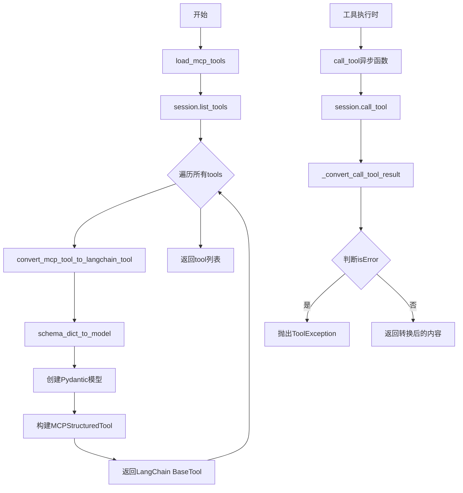
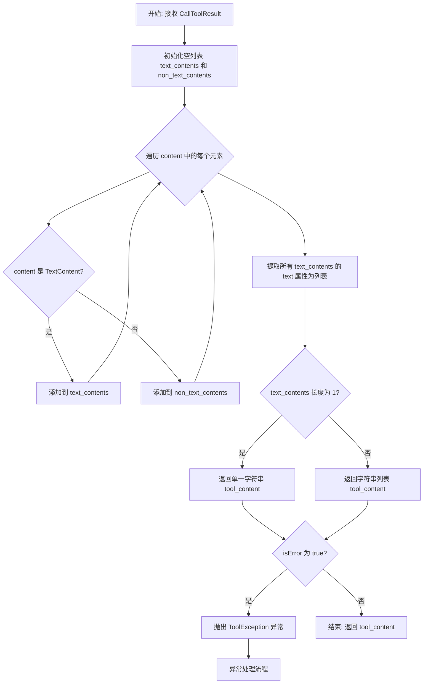
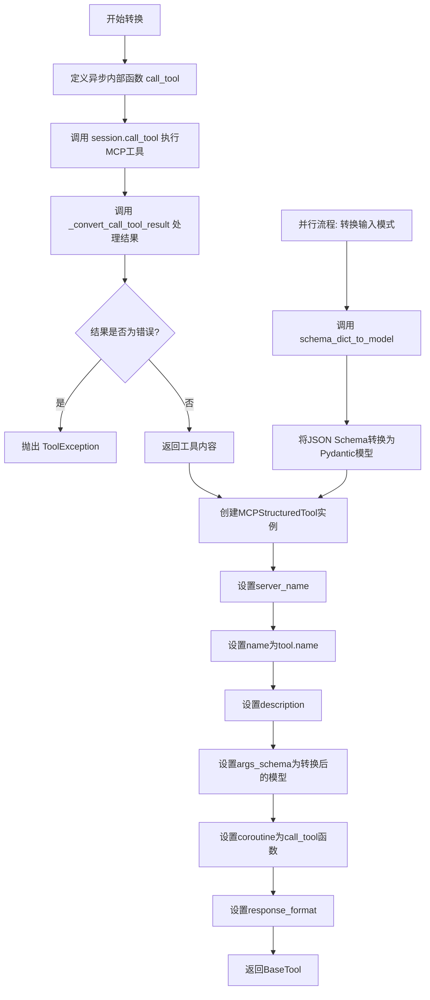
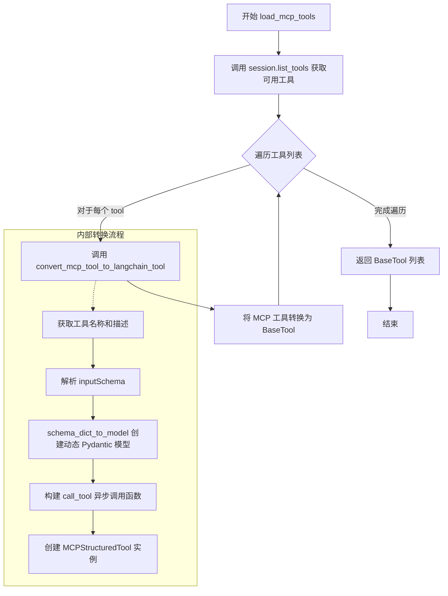

# `Langchain-Chatchat\libs\chatchat-server\langchain_chatchat\agent_toolkits\mcp_kit\tools.py` 详细设计文档

该代码实现了MCP（Model Context Protocol）工具到LangChain工具的转换适配器，支持将MCP服务器上的工具动态转换为LangChain可用的工具，包括JSON schema到Pydantic模型的转换、工具调用结果的格式化处理，以及批量工具加载功能。

## 整体流程



## 类结构

```
MCPStructuredTool (继承StructuredTool)
└── server_name: str (类字段)
```

## 全局变量及字段


### `NonTextContent`
    
类型别名，表示ImageContent或EmbeddedResource

类型：`ImageContent | EmbeddedResource`
    


### `MCPStructuredTool.server_name`
    
MCP服务器名称

类型：`str`
    
    

## 全局函数及方法


### `schema_dict_to_model`

将JSON schema转换为Pydantic模型，并进行必填字段验证。该函数解析JSON schema的properties和required定义，动态创建具有适当类型注解和验证规则的Pydantic模型类，支持string、integer、number、boolean等基础类型，必填字段会添加相应的约束条件。

参数：

- `schema`：`Dict[str, Any]`，JSON schema字典，包含工具参数定义

返回值：`Any`，动态Pydantic模型类，带有proper字段验证

#### 流程图

```mermaid
flowchart TD
    A[开始: schema_dict_to_model] --> B[获取properties字段]
    B --> C[获取required字段列表]
    C --> D[遍历fields中的每个字段]
    D --> E{还有字段需要处理?}
    E -->|是| F[获取字段类型字符串 field_type_str]
    F --> G[获取字段描述 field_description]
    G --> H{字段类型判断}
    H -->|integer| I[field_type = int]
    H -->|string| J[field_type = str]
    H -->|number| K[field_type = float]
    H -->|boolean| L[field_type = bool]
    H -->|other| M[field_type = Any]
    I --> N{field_name in required_fields?}
    J --> N
    K --> N
    L --> N
    M --> N
    N -->|是 必填字段| O{field_type == str?}
    N -->|否 可选字段| P[创建可选字段: Field(None, required=False)]
    O -->|是| Q[创建str必填字段: Field(..., min_length=1, required=True)]
    O -->|否| R{field_type in (int, float)?}
    R -->|是| S[创建数值必填字段: Field(..., required=True)]
    R -->|否| T{field_type == bool?}
    T -->|是| U[创建bool必填字段: Field(..., required=True)]
    T -->|否| V[创建其他必填字段: Field(..., required=True)]
    Q --> W[添加字段到model_fields]
    S --> W
    U --> W
    V --> W
    P --> W
    W --> X[继续遍历下一字段]
    X --> E
    E -->|否| Y[create_model动态创建Pydantic模型]
    Y --> Z[返回动态模型类 DynamicSchema]
```

#### 带注释源码

```python
def schema_dict_to_model(schema: Dict[str, Any]) -> Any:
    """
    Convert JSON schema to Pydantic model with required field validation.
    
    Args:
        schema: JSON schema dictionary containing tool parameter definitions
        
    Returns:
        Dynamic Pydantic model class with proper field validation
        
    Note:
        Required fields are marked with required=True to ensure they have actual content,
        empty or null values are strictly prohibited for required parameters.
    """
    # 从schema中获取properties字段定义
    fields = schema.get('properties', {})
    # 获取必填字段列表
    required_fields = schema.get('required', [])

    # 用于存储模型字段定义的字典
    model_fields = {}
    
    # 遍历schema中的每个字段定义
    for field_name, details in fields.items():
        # 获取字段类型字符串（如 "string", "integer" 等）
        field_type_str = details['type']
        
        # 获取字段描述信息（用于文档和验证消息）
        field_description = details.get('description', '')

        # 根据JSON schema类型映射到Python类型
        if field_type_str == 'integer':
            field_type = int
        elif field_type_str == 'string':
            field_type = str
        elif field_type_str == 'number':
            field_type = float
        elif field_type_str == 'boolean':
            field_type = bool
        else:
            field_type = Any  # 可扩展更多类型

        # 判断是否为必填字段
        if field_name in required_fields:
            # 必填字段：确保有实际内容，不允许空值/null
            if field_type == str:
                # 字符串必填字段：添加min_length=1确保不为空字符串
                model_fields[field_name] = (
                    field_type, 
                    Field(
                        ...,  # ... 表示必填
                        min_length=1,  # 最小长度1，防止空字符串
                        required=True, 
                        description=field_description or f"Required string parameter: {field_name}"
                    )
                )
            elif field_type in (int, float):
                # 数值必填字段
                model_fields[field_name] = (
                    field_type, 
                    Field(
                        ..., 
                        required=True, 
                        description=field_description or f"Required numeric parameter: {field_name}"
                    )
                )
            elif field_type == bool:
                # 布尔必填字段
                model_fields[field_name] = (
                    field_type, 
                    Field(
                        ..., 
                        required=True, 
                        description=field_description or f"Required boolean parameter: {field_name}"
                    )
                )
            else:
                # 其他类型的必填字段
                model_fields[field_name] = (
                    field_type, 
                    Field(
                        ..., 
                        required=True, 
                        description=field_description or f"Required parameter: {field_name}"
                    )
                )
        else:
            # 可选字段：允许为None
            model_fields[field_name] = (
                field_type, 
                Field(
                    None,  # 默认值为None
                    required=False, 
                    description=field_description or f"Optional parameter: {field_name}"
                )
            )

    # 使用pydantic的create_model动态创建模型类
    # 使用schema的title作为模型名称，默认为'DynamicSchema'
    DynamicSchema = create_model(schema.get('title', 'DynamicSchema'), **model_fields)
    return DynamicSchema
```


### `_convert_call_tool_result`

将 MCP 工具调用结果（CallToolResult）转换为 LangChain 工具返回格式，分离文本内容与非文本内容，并处理错误结果。

参数：

- `call_tool_result`：`CallToolResult`，MCP 工具调用返回的结果对象，包含内容列表和错误标志

返回值：`tuple[str | list[str], list[NonTextContent] | None]`，返回转换后的文本内容（字符串或字符串列表）以及非文本内容列表

#### 流程图



#### 带注释源码

```python
def _convert_call_tool_result(
        call_tool_result: CallToolResult,
) -> tuple[str | list[str], list[NonTextContent] | None]:
    """
    将 MCP 工具调用结果转换为 LangChain 格式。
    
    Args:
        call_tool_result: MCP 工具调用返回的结果对象
        
    Returns:
        转换后的文本内容（单个字符串或字符串列表）以及非文本内容
    """
    # 初始化文本内容和非文本内容的存储列表
    text_contents: list[TextContent] = []
    non_text_contents = []
    
    # 遍历结果内容，分离文本和非文本内容
    for content in call_tool_result.content:
        if isinstance(content, TextContent):
            text_contents.append(content)
        else:
            non_text_contents.append(content)

    # 提取所有文本内容中的 text 字段
    tool_content: str | list[str] = [content.text for content in text_contents]
    
    # 如果只有一个文本内容，返回字符串而非列表
    if len(text_contents) == 1:
        tool_content = tool_content[0]

    # 如果工具调用返回错误，抛出 LangChain 工具异常
    if call_tool_result.isError:
        raise ToolException(tool_content)

    # 返回转换后的内容（非文本内容列表未被返回，存在潜在技术债务）
    return tool_content
```


### `convert_mcp_tool_to_langchain_tool`

该函数将单个MCP（Model Context Protocol）工具转换为LangChain工具，通过创建一个异步调用函数并利用Pydantic模型验证输入参数，最终返回可执行的LangChain StructuredTool实例。

参数：

- `server_name`：`str`，MCP服务器名称，用于标识工具所属的MCP服务器
- `session`：`ClientSession`，MCP客户端会话，用于在活动会话上下文中执行工具调用
- `tool`：`MCPTool`，MCP工具对象，包含工具名称、描述和输入模式（inputSchema）

返回值：`BaseTool`，转换后的LangChain工具实例，可直接在LangChain框架中使用

#### 流程图



#### 带注释源码

```python
def convert_mcp_tool_to_langchain_tool(
        server_name: str,
        session: ClientSession,
        tool: MCPTool,
) -> BaseTool:
    """Convert an MCP tool to a LangChain tool.

    NOTE: this tool can be executed only in a context of an active MCP client session.

    Args:
        server_name: MCP server name
        session: MCP client session
        tool: MCP tool to convert

    Returns:
        a LangChain tool
    """

    async def call_tool(
            **arguments: dict[str, Any],
    ) -> tuple[str | list[str], list[NonTextContent] | None]:
        # 调用MCP工具，通过session.call_tool方法执行工具
        # 参数：工具名称和arguments字典
        call_tool_result = await session.call_tool(tool.name, arguments)
        # 处理工具返回结果，提取文本内容或处理错误
        return _convert_call_tool_result(call_tool_result)

    # 将MCP工具的JSON Schema转换为Pydantic模型，用于参数验证
    tool_input_model = schema_dict_to_model(tool.inputSchema)
    
    # 创建并返回MCPStructuredTool实例，封装为LangChain工具
    return MCPStructuredTool(
        server_name=server_name,           # 标识所属MCP服务器
        name=tool.name,                    # 工具名称
        description=tool.description or "", # 工具描述
        args_schema=tool_input_model,      # Pydantic输入模型
        coroutine=call_tool,               # 异步调用函数
        response_format="content_and_artifact", # 返回格式配置
    )
```


### `load_mcp_tools`

该函数是 MCP 工具加载的核心入口，异步获取 MCP 服务器上所有可用的工具列表，并将每个 MCP 工具转换为 LangChain 格式的 `BaseTool`，最终返回包含所有转换后工具的列表。

参数：

- `server_name`：`str`，MCP 服务器的名称，用于标识工具来源
- `session`：`ClientSession`，MCP 客户端会话实例，用于与 MCP 服务器通信以列出和调用工具

返回值：`list[BaseTool]`，转换后的 LangChain 工具列表

#### 流程图



#### 带注释源码

```python
async def load_mcp_tools(server_name: str, session: ClientSession) -> list[BaseTool]:
    """
    加载所有可用的 MCP 工具并将其转换为 LangChain 工具。
    
    这是 MCP 工具集成的入口函数，执行以下操作：
    1. 通过 MCP ClientSession 获取服务器上所有已注册的工具
    2. 遍历工具列表，对每个工具调用转换函数
    3. 将转换后的 LangChain BaseTool 集合返回给调用者
    
    Args:
        server_name: MCP 服务器名称，用于标识工具来源服务器
        session: MCP 客户端会话实例，提供与 MCP 服务器通信的能力
        
    Returns:
        包含所有转换后 LangChain 工具的列表，可直接用于 LangChain 代理或工具调用链
        
    Note:
        - 该函数依赖 session.list_tools() 返回的工具列表
        - 转换过程中使用 schema_dict_to_model 动态生成 Pydantic 输入模型
        - 每个转换后的工具都绑定了对应的 session，可执行实际调用
    """
    # 调用 MCP 会话的 list_tools 方法获取服务器上所有可用工具
    # 返回值是一个包含 tools 属性的对象，tools 是 MCPTool 列表
    tools = await session.list_tools()
    
    # 使用列表推导式遍历每个 MCP 工具，调用转换函数进行格式转换
    # convert_mcp_tool_to_langchain_tool 返回 BaseTool 实例
    # 最终返回一个 LangChain 兼容的工具列表
    return [convert_mcp_tool_to_langchain_tool(server_name, session, tool) for tool in tools.tools]
```

## 关键组件


### MCPStructuredTool

继承自LangChain的StructuredTool的自定义工具类，通过添加server_name字段标识MCP服务器名称，用于在多服务器场景下追踪工具来源。

### schema_dict_to_model

将MCP工具的JSON Schema转换为Pydantic动态模型的函数，支持integer、string、number、boolean类型的映射，并对必需字段添加min_length=1和required=True验证，确保必需参数具有实际内容。

### _convert_call_tool_result

处理MCP工具调用结果的内部函数，将CallToolResult拆分为文本内容和非文本内容（图片、嵌入资源），当isError为True时抛出ToolException，否则返回工具内容。

### convert_mcp_tool_to_langchain_tool

核心转换函数，将MCP工具(MCPTool)适配为LangChain工具(BaseTool)，内部创建异步调用函数call_tool，使用动态生成的Pydantic模型作为参数验证schema，返回支持content_and_artifact响应格式的StructuredTool。

### load_mcp_tools

异步工具加载函数，通过MCP客户端会话获取所有可用工具列表，遍历并调用convert_mcp_tool_to_langchain_tool将每个MCP工具转换为LangChain工具，最终返回工具列表。

### NonTextContent类型联合

MCP非文本内容类型的联合类型，包含ImageContent和EmbeddedResource，用于在工具返回结果中携带图片、文件等二进制或结构化资源数据。

### 类型映射逻辑

schema_dict_to_model中的类型转换逻辑，将JSON Schema的type字段（integer、string、number、boolean）映射为Python原生类型（int、str、float、bool），未知类型默认为Any。


## 问题及建议


### 已知问题

- **类型转换不完整**：`schema_dict_to_model`函数仅支持`integer`、`string`、`number`、`boolean`四种基础类型，数组(array)、对象(object)、枚举(enum)、可空(nullable)等复杂类型均被归类为`Any`，导致类型安全性和IDE智能提示失效
- **错误处理不完善**：当MCP工具返回非TextContent且无TextContent时，`_convert_call_tool_result`会返回空内容而无任何警告或日志；`session.call_tool`调用缺少异常捕获机制
- **Pydantic版本兼容性**：显式使用`pydantic.v1`导入，与当前主流的Pydantic v2不兼容，存在未来迁移风险
- **模型重复创建**：每次调用`convert_mcp_tool_to_langchain_tool`都会通过`schema_dict_to_model`动态创建新的Pydantic模型，无缓存机制，存在性能开销
- **类型注解不精确**：多处使用`Any`类型（如`field_type = Any`），削弱了静态类型检查的保护作用
- **注释语言不一致**：代码中混用中英文注释（如"可扩展更多类型"），影响代码可读性和维护性
- **日志缺失**：整个代码库无任何日志记录，运行时行为难以追踪和调试

### 优化建议

- **扩展类型支持**：增加对`array`、`object`、`enum`、`nullable`等JSON Schema类型的处理逻辑，提升类型覆盖率
- **完善错误处理**：为`_convert_call_tool_result`添加空内容检测和日志记录；对`session.call_tool`添加try-except包装并抛出结构化异常
- **引入模型缓存**：使用字典缓存已转换的Pydantic模型，以`schema.get('title', '')`或schema哈希值为key，避免重复创建
- **迁移至Pydantic v2**：检查并升级至Pydantic v2原生API，使用`pydantic`而非`pydantic.v1`导入
- **强化类型注解**：为关键变量和返回值提供精确类型声明，减少`Any`使用
- **统一注释规范**：全代码库统一使用英文注释，或分离国际化资源文件
- **添加日志模块**：引入Python标准`logging`或结构化日志，记录关键操作节点和异常信息
- **考虑MCPStructuredTool设计**：当前类仅用于存储`server_name`，可考虑是否需要继承或使用组合模式替代继承

## 其它


### 设计目标与约束

本代码的设计目标是将MCP（Model Context Protocol）工具无缝集成到LangChain框架中，使LangChain能够调用MCP服务器提供的工具。核心约束包括：1）只能在活跃的MCP客户端会话上下文中执行工具；2）需要将MCP的JSON Schema格式转换为Pydantic模型进行参数验证；3）保持与LangChain StructuredTool接口的兼容性。

### 错误处理与异常设计

代码采用LangChain的ToolException机制处理工具执行错误。当MCP工具返回isError标志时，会将错误内容转换为ToolException抛出。参数验证由Pydantic模型自动处理，缺失必需参数或类型不匹配会触发ValidationError。对于不可识别的JSON Schema类型，默认使用Any类型以保持灵活性但可能导致运行时类型错误。

### 数据流与状态机

数据流从MCP服务器开始：1）load_mcp_tools获取服务器工具列表；2）convert_mcp_tool_to_langchain_tool逐个转换工具；3）schema_dict_to_model将JSON Schema转换为Pydantic模型；4）call_tool执行时调用session.call_tool；5）_convert_call_tool_result处理结果并处理错误状态。无复杂状态机，主要依赖MCP ClientSession的会话状态。

### 外部依赖与接口契约

主要依赖包括：langchain_core.tools（BaseTool, StructuredTool, ToolException）、mcp包（ClientSession, Tool, CallToolResult等类型）、pydantic.v1（BaseModel, create_model, Field）。接口契约方面，convert_mcp_tool_to_langchain_tool接受server_name(str)、session(ClientSession)、tool(MCPTool)三个参数，返回BaseTool；load_mcp_tools接受server_name和session，返回list[BaseTool]。

### 性能考虑

当前实现采用同步转换、异步执行模式。每个工具转换时都会创建新的Pydantic模型类，可能导致类数量增长。schema_dict_to_model对每个工具都会动态创建模型，频繁调用时存在一定的性能开销。建议缓存已创建的模型类以提升性能。

### 安全性考虑

代码本身不直接处理敏感数据，但需注意：1）工具参数通过Pydantic验证，可防止注入攻击；2）server_name作为字符串传入，需确保来源可信；3）ToolException可能暴露错误信息给下游，需评估是否需要包装；4）依赖外部MCP服务器通信，需确保网络通信安全。

### 使用示例

```python
async def main():
    async with ClientSession(stdio_server_params) as session:
        # 加载MCP工具
        tools = await load_mcp_tools("my_mcp_server", session)
        
        # 使用LangChain工具
        for tool in tools:
            result = await tool.ainvoke({"param1": "value1"})
```

### 配置说明

代码无显式配置项，主要通过MCP服务器参数和工具的JSON Schema定义进行配置。schema_dict_to_model的field_type_str分支可扩展以支持更多JSON Schema类型。


    