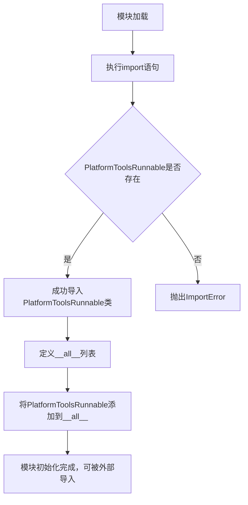

# `Langchain-Chatchat\libs\chatchat-server\langchain_chatchat\agents\__init__.py` 详细设计文档

这是一个模块重导出文件，通过从langchain_chatchat.agents.platform_tools包导入PlatformToolsRunnable类，并利用__all__机制将其暴露为模块公共接口，实现模块间的解耦和统一导出。

## 整体流程



## 类结构

```
该文件为模块重导出文件，无本地类定义
PlatformToolsRunnable为外部导入类，定义于langchain_chatchat.agents.platform_tools
```

## 全局变量及字段


### `__all__`
    
定义模块的公开接口，指定from module import *时导出的符号列表

类型：`list`
    


    

## 全局函数及方法


## 关键组件


### PlatformToolsRunnable

这是一个平台工具可运行类，负责执行平台相关的工具操作，是LangChain ChatChat项目中 agents 模块的核心组件之一。

### 关键组件信息

#### PlatformToolsRunnable

负责封装平台工具的执行逻辑，提供统一的Runnable接口以集成到LangChain的链式调用中。


## 问题及建议


### 已知问题

-   **导入路径依赖风险**：代码依赖 `langchain_chatchat.agents.platform_tools` 模块，若该模块路径或 `PlatformToolsRunnable` 类名发生变化，将导致此模块不可用
-   **缺乏异常处理**：导入语句没有任何 try-except 保护，若依赖模块不存在会直接抛出 `ImportError`
-   **无文档说明**：模块级别缺少 docstring，无法快速了解该模块的职责和用途
-   **无版本与元数据**：缺少模块版本、作者、维护状态等元信息
-   **潜在的循环导入风险**：若 `langchain_chatchat.agents.platform_tools` 模块反向导入当前模块，可能触发循环导入问题

### 优化建议

-   **添加模块级文档字符串**：说明该模块为重导出模块，用于暴露 `PlatformToolsRunnable` 作为公共 API
-   **添加异常处理**：使用 try-except 捕获导入异常，提供更友好的错误提示或降级方案
-   **考虑添加类型注解**：虽然此处仅为重导出，但可考虑添加 `from __future__ import annotations` 或类型提示
-   **添加版本信息**：在模块 docstring 中包含版本号、作者、依赖说明等元数据
-   **依赖验证**：可在模块加载时验证 `PlatformToolsRunnable` 是否具有必要的属性或方法，确保接口契约正确

## 其它


### 设计目标与约束

本模块作为langchain_chatchat项目的平台工具运行器封装层，提供统一的工具执行接口。设计目标包括：解耦工具调用逻辑、提供可扩展的工具执行框架、兼容LangChain的Runnable接口规范。约束条件为必须继承自LangChain的Runnable基类，保持与LangChain生态的兼容性。

### 错误处理与异常设计

本模块的错误处理主要依赖于langchain_chatchat.agents.platform_tools模块中PlatformToolsRunnable类的异常机制。预期可能出现的异常包括：工具执行超时异常、平台服务不可用异常、参数校验异常等。异常传播遵循LangChain的标准异常处理规范，向上层调用者传递具体的异常信息。

### 数据流与状态机

数据流方向：外部调用者 -> PlatformToolsRunnable.invoke() -> 平台工具执行器 -> 返回执行结果。状态机流转包括：初始状态（Ready）-> 执行中（Running）-> 完成（Completed）或失败（Failed）。PlatformToolsRunnable作为LangChain的Runnable组件，遵循其标准的输入->处理->输出数据流模型。

### 外部依赖与接口契约

主要外部依赖：
1. langchain_core.runnables - 提供Runnable接口规范
2. langchain_chatchat.agents.platform_tools - PlatformToolsRunnable类定义

接口契约：
- invoke方法：接收任意类型输入，返回工具执行结果
- batch方法：支持批量处理多个输入
- ainvoke方法：支持异步调用

### 性能要求

本模块作为轻量级封装层，自身不涉及复杂计算。性能瓶颈主要取决于底层PlatformToolsRunnable的实际执行效率。建议在生产环境中设置合理的超时时间（默认30秒），并实现必要的连接池管理。

### 安全性考虑

代码层面未涉及敏感信息处理。安全性主要依赖于：
1. 底层platform_tools模块的输入验证
2. LangChain框架的安全机制
3. 运行时环境的访问控制

### 兼容性设计

本模块兼容Python 3.8+版本，与LangChain 0.1.x版本兼容。由于采用LangChain标准Runnable接口，可无缝集成到LangChain的LCEL（LangChain Expression Language）链式调用中。

### 测试策略

建议包含以下测试用例：
1. 单元测试：验证PlatformToolsRunnable的导入和基本属性
2. 集成测试：验证与LangChain框架的兼容性
3. _mock测试：验证异常情况下的错误处理

### 部署配置

无需独立部署配置，本模块作为langchain_chatchat项目的内部组件，通过项目主入口进行加载和使用。


    