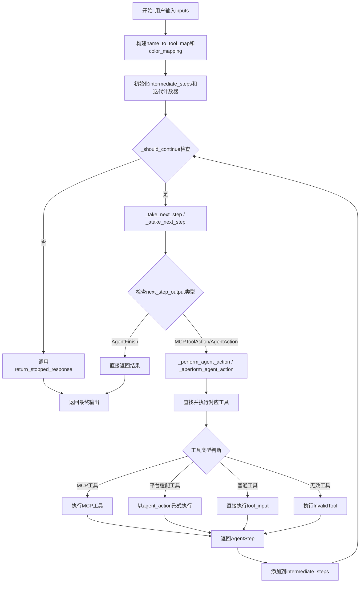
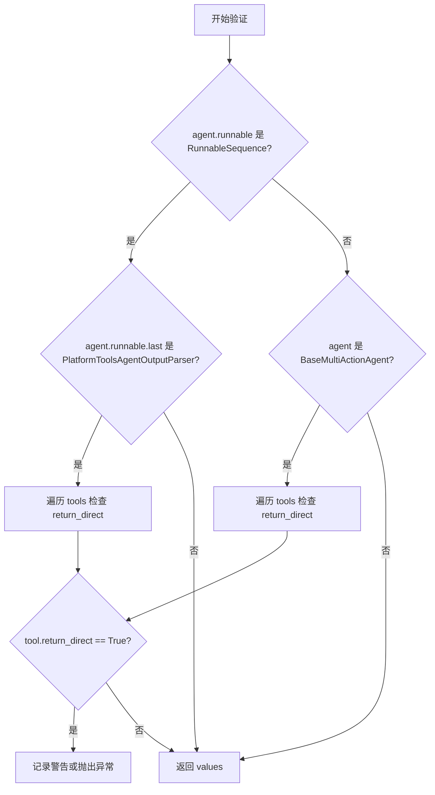
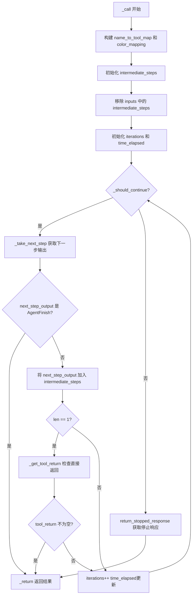
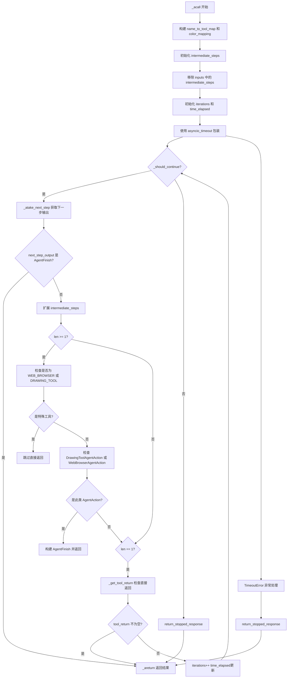
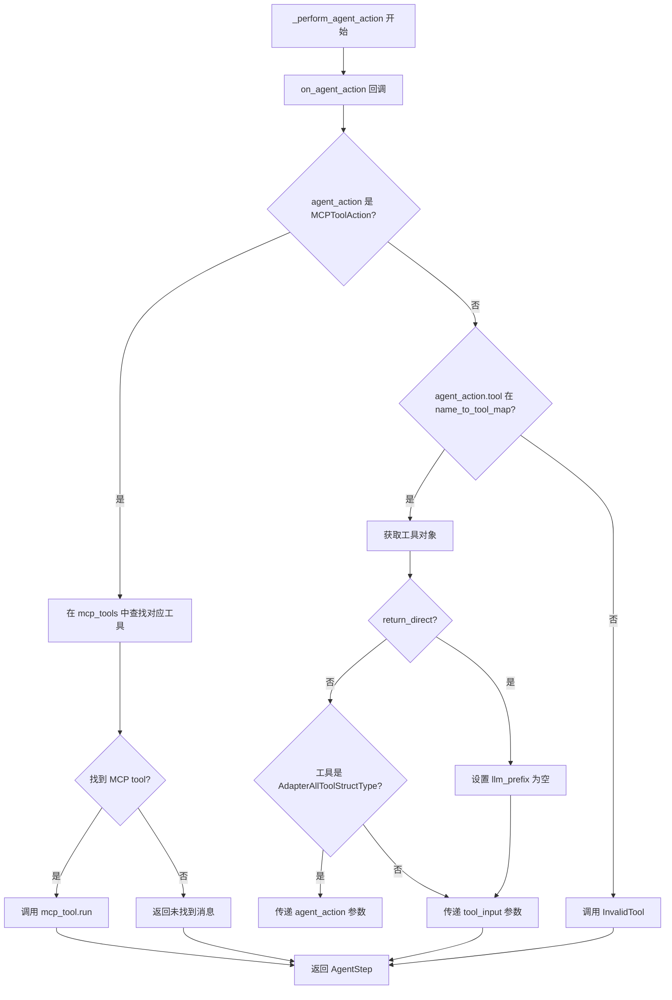
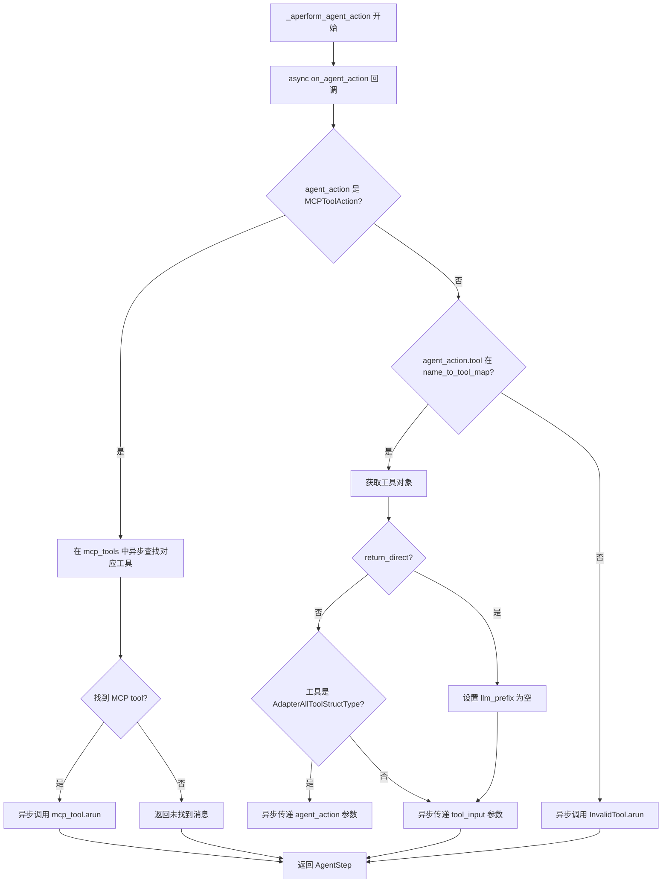
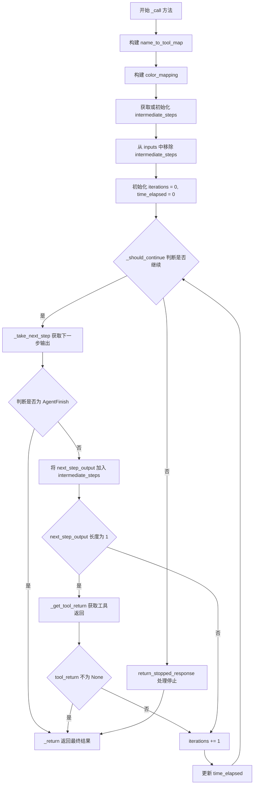
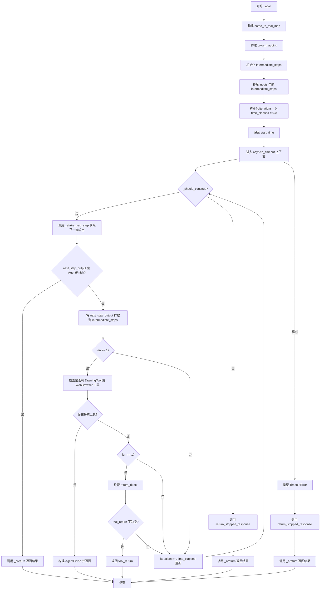

# `Langchain-Chatchat\libs\chatchat-server\langchain_chatchat\agents\all_tools_agent.py` 详细设计文档

PlatformToolsAgentExecutor是一个扩展自LangChain AgentExecutor的代理执行器，专门用于处理MCP（Model Control Protocol）工具和平台特定工具（如绘图工具和网页浏览器），支持同步和异步执行，并提供工具路由、状态管理和早停机制。

## 整体流程



## 类结构

```
AgentExecutor (LangChain基类)
└── PlatformToolsAgentExecutor (自定义扩展)
    ├── 字段: mcp_tools (Sequence[MCPStructuredTool])
    ├── 验证器: validate_return_direct_tool
    ├── 同步方法: _call, _perform_agent_action, _consume_next_step
    └── 异步方法: _acall, _aperform_agent_action
```

## 全局变量及字段


### `logger`
    
日志记录器，用于记录模块运行过程中的日志信息

类型：`logging.Logger`
    


### `NextStepOutput`
    
类型别名，表示agent下一步输出的联合类型，包含多种可能的动作结果

类型：`List[Union[AgentFinish, MCPToolAction, AgentAction, AgentStep]]`
    


### `PlatformToolsAgentExecutor.mcp_tools`
    
MCP工具列表，用于存储和执行支持MCP协议的工具

类型：`Sequence[MCPStructuredTool]`
    
    

## 全局函数及方法


# PlatformToolsAgentExecutor 详细设计文档

## 一段话描述

PlatformToolsAgentExecutor 是一个继承自 LangChain AgentExecutor 的平台工具代理执行器，专门用于执行支持 MCP（Model Context Protocol）工具和平台适配工具的代理任务，提供同步和异步两种执行模式，并处理特殊的工具返回逻辑。

---

## 文件的整体运行流程

```
1. 初始化 PlatformToolsAgentExecutor
   ↓
2. 验证工具兼容性 (validate_return_direct_tool)
   ↓
3. 根据调用方式选择执行路径:
   ├─ 同步调用 (_call) → _take_next_step → _perform_agent_action → _return
   └─ 异步调用 (_acall) → _atake_next_step → _aperform_agent_action → _areturn
   ↓
4. 循环执行直到满足停止条件或返回 AgentFinish
```

---

## 类的详细信息

### 类字段

| 字段名称 | 类型 | 描述 |
|---------|------|------|
| mcp_tools | Sequence[MCPStructuredTool] | MCP工具列表，用于执行MCP协议的工具 |
| tools | Sequence[BaseTool] | 继承自AgentExecutor，平台工具列表 |
| agent | BaseSingleActionAgent | 继承自AgentExecutor，代理实例 |
| max_execution_time | float | 继承自AgentExecutor，最大执行时间 |
| early_stopping_method | str | 继承自AgentExecutor，早停方法 |
| verbose | bool | 继承自AgentExecutor， verbose 模式 |

### 类方法

| 方法名称 | 描述 |
|---------|------|
| validate_return_direct_tool | 验证工具与代理的兼容性 |
| _call | 同步执行代理的核心方法 |
| _acall | 异步执行代理的核心方法 |
| _perform_agent_action | 同步执行工具动作 |
| _consume_next_step | 处理下一步输出 |
| _aperform_agent_action | 异步执行工具动作 |

---

## 方法详细文档

### PlatformToolsAgentExecutor.validate_return_direct_tool

验证工具与代理的兼容性，确保 return_direct 配置正确。

参数：

- `values`：`Dict`，包含 agent 和 tools 的字典

返回值：`Dict`，验证后的值字典

#### 流程图



#### 带注释源码

```python
@root_validator()
def validate_return_direct_tool(cls, values: Dict) -> Dict:
    """验证工具与代理的兼容性。
        TODO: 平台适配工具需要适配所有工具,
    """
    # 获取 agent 和 tools
    agent = values["agent"]
    tools = values["tools"]
    
    # 如果是 RunnableSequence 类型且最后一个是 PlatformToolsAgentOutputParser
    if isinstance(agent.runnable, RunnableSequence):
        if isinstance(agent.runnable.last, PlatformToolsAgentOutputParser):
            for tool in tools:
                if tool.return_direct:
                    logger.warning(
                        f"Tool {tool.name} has return_direct set to True, but it is not compatible with the "
                        f"current agent."
                    )
    # 如果是多动作代理
    elif isinstance(agent, BaseMultiActionAgent):
        for tool in tools:
            if tool.return_direct:
                raise ValueError(
                    "Tools that have `return_direct=True` are not allowed "
                    "in multi-action agents"
                )

    return values
```

---

### PlatformToolsAgentExecutor._call

同步方式运行文本输入并获取代理响应。

参数：

- `inputs`：`Dict[str, str]`，包含输入参数的字典
- `run_manager`：`Optional[CallbackManagerForChainRun]`，可选的回调管理器

返回值：`Dict[str, Any]`，包含代理执行结果的字典

#### 流程图



#### 带注释源码

```python
def _call(
    self,
    inputs: Dict[str, str],
    run_manager: Optional[CallbackManagerForChainRun] = None,
) -> Dict[str, Any]:
    """运行文本输入并获取代理响应。"""
    # 构建工具名称到工具对象的映射，便于查找
    name_to_tool_map = {tool.name: tool for tool in self.tools}
    # 为每个工具构建颜色映射，用于日志记录
    color_mapping = get_color_mapping(
        [tool.name for tool in self.tools], excluded_colors=["green", "red"]
    )
    # 获取中间步骤，如果不存在则初始化为空列表
    intermediate_steps: List[Tuple[AgentAction, str]] = inputs.get("intermediate_steps") if inputs.get("intermediate_steps") is not None else []
    # 确保 inputs 里不包含 intermediate_steps
    if "intermediate_steps" in inputs:
        inputs = dict(inputs)
        inputs.pop("intermediate_steps")
    # 开始跟踪迭代次数和耗时
    iterations = 0
    time_elapsed = 0.0
    start_time = time.time()
    # 进入代理循环（直到返回结果）
    while self._should_continue(iterations, time_elapsed):
        # 获取下一步输出
        next_step_output = self._take_next_step(
            name_to_tool_map,
            color_mapping,
            inputs,
            intermediate_steps,
            run_manager=run_manager,
        )
        # 如果是 AgentFinish，直接返回
        if isinstance(next_step_output, AgentFinish):
            return self._return(
                next_step_output, intermediate_steps, run_manager=run_manager
            )

        # 扩展中间步骤
        intermediate_steps.extend(next_step_output)
        # 如果只有一个输出，检查工具是否应该直接返回
        if len(next_step_output) == 1:
            next_step_action = next_step_output[0]
            tool_return = self._get_tool_return(next_step_action)
            if tool_return is not None:
                return self._return(
                    tool_return, intermediate_steps, run_manager=run_manager
                )
        # 更新迭代计数和耗时
        iterations += 1
        time_elapsed = time.time() - start_time
    # 获取停止响应并返回
    output = self.agent.return_stopped_response(
        self.early_stopping_method, intermediate_steps, **inputs
    )
    return self._return(output, intermediate_steps, run_manager=run_manager)
```

---

### PlatformToolsAgentExecutor._acall

异步方式运行文本输入并获取代理响应。

参数：

- `inputs`：`Dict[str, str]`，包含输入参数的字典
- `run_manager`：`Optional[AsyncCallbackManagerForChainRun]`，可选的异步回调管理器

返回值：`Dict[str, str]`，包含代理执行结果的字典

#### 流程图



#### 带注释源码

```python
async def _acall(
    self,
    inputs: Dict[str, str],
    run_manager: Optional[AsyncCallbackManagerForChainRun] = None,
) -> Dict[str, str]:
    """异步运行文本输入并获取代理响应。"""
    # 构建工具名称到工具对象的映射
    name_to_tool_map = {tool.name: tool for tool in self.tools}
    # 为每个工具构建颜色映射
    color_mapping = get_color_mapping(
        [tool.name for tool in self.tools], excluded_colors=["green"]
    )
    # 获取中间步骤
    intermediate_steps: List[Tuple[AgentAction, str]] = inputs.get("intermediate_steps") if inputs.get("intermediate_steps") is not None else []
    # 确保 inputs 里不包含 intermediate_steps
    if "intermediate_steps" in inputs:
        inputs = dict(inputs)
        inputs.pop("intermediate_steps")
    # 初始化迭代计数和耗时
    iterations = 0
    time_elapsed = 0.0
    start_time = time.time()
    # 使用 asyncio_timeout 包装执行
    try:
        async with asyncio_timeout(self.max_execution_time):
            while self._should_continue(iterations, time_elapsed):
                # 异步获取下一步输出
                next_step_output = await self._atake_next_step(
                    name_to_tool_map,
                    color_mapping,
                    inputs,
                    intermediate_steps,
                    run_manager=run_manager,
                )
                # 如果是 AgentFinish，直接返回
                if isinstance(next_step_output, AgentFinish):
                    return await self._areturn(
                        next_step_output,
                        intermediate_steps,
                        run_manager=run_manager,
                    )

                # 扩展中间步骤
                intermediate_steps.extend(next_step_output)
                if len(next_step_output) >= 1:
                    # TODO: 平台适配状态控制，但 langchain 不输出消息信息，
                    #   所以在解析实例对象后让 DrawingToolAgentAction WebBrowserAgentAction
                    #   总是输出 AgentFinish 实例
                    continue_action = False
                    list1 = list(name_to_tool_map.keys())
                    list2 = [
                        AdapterAllToolStructType.WEB_BROWSER,
                        AdapterAllToolStructType.DRAWING_TOOL,
                    ]

                    # 计算存在的工具（排除特殊工具）
                    exist_tools = list(set(list1) - set(list2))
                    for next_step_action, observation in next_step_output:
                        if next_step_action.tool in exist_tools:
                            continue_action = True
                            break

                    # 如果不是特殊工具，检查是否是绘图或浏览器工具
                    if not continue_action:
                        for next_step_action, observation in next_step_output:
                            if isinstance(next_step_action, DrawingToolAgentAction):
                                tool_return = AgentFinish(
                                    return_values={"output": str(observation)},
                                    log=str(observation),
                                )
                                return await self._areturn(
                                    tool_return,
                                    intermediate_steps,
                                    run_manager=run_manager,
                                )
                            elif isinstance(
                                next_step_action, WebBrowserAgentAction
                            ):
                                tool_return = AgentFinish(
                                    return_values={"output": str(observation)},
                                    log=str(observation),
                                )
                                return await self._areturn(
                                    tool_return,
                                    intermediate_steps,
                                    run_manager=run_manager,
                                )

                # 检查是否需要直接返回
                if len(next_step_output) == 1:
                    next_step_action = next_step_output[0]
                    tool_return = self._get_tool_return(next_step_action)
                    if tool_return is not None:
                        return await self._areturn(
                            tool_return, intermediate_steps, run_manager=run_manager
                        )

                # 更新迭代计数和耗时
                iterations += 1
                time_elapsed = time.time() - start_time
            # 获取停止响应
            output = self.agent.return_stopped_response(
                self.early_stopping_method, intermediate_steps, **inputs
            )
            return await self._areturn(
                output, intermediate_steps, run_manager=run_manager
            )
    except (TimeoutError, asyncio.TimeoutError):
        # 超时时提前停止
        output = self.agent.return_stopped_response(
            self.early_stopping_method, intermediate_steps, **inputs
        )
        return await self._areturn(
            output, intermediate_steps, run_manager=run_manager
        )
```

---

### PlatformToolsAgentExecutor._perform_agent_action

同步执行单个工具动作。

参数：

- `name_to_tool_map`：`Dict[str, BaseTool]`，工具名称到工具的映射
- `color_mapping`：`Dict[str, str]`，工具名称到颜色的映射
- `agent_action`：`AgentAction`，代理动作
- `run_manager`：`Optional[CallbackManagerForChainRun]`，可选的回调管理器

返回值：`AgentStep`，包含动作和观察结果的步骤

#### 流程图



#### 带注释源码

```python
def _perform_agent_action(
    self,
    name_to_tool_map: Dict[str, BaseTool],
    color_mapping: Dict[str, str],
    agent_action: AgentAction,
    run_manager: Optional[CallbackManagerForChainRun] = None,
) -> AgentStep:
    """执行单个代理动作并返回观察结果。"""
    if run_manager:
        # 触发代理动作回调
        run_manager.on_agent_action(agent_action, color="green")
    
    # 如果是 MCP 工具动作
    if isinstance(agent_action, MCPToolAction): 
        tool_run_kwargs = self.agent.tool_run_logging_kwargs()
        # 通过名称和服务器名称在 self.mcp_tools 中查找 MCP 工具
        mcp_tool = None
        for tool in self.mcp_tools:
            if tool.name == agent_action.tool and tool.server_name == agent_action.server_name:
                mcp_tool = tool
                break
        
        if mcp_tool:
            # 执行 MCP 工具
            observation = mcp_tool.run(
                agent_action.tool_input,
                verbose=self.verbose,
                color="blue",
                callbacks=run_manager.get_child() if run_manager else None,
                **tool_run_kwargs,
            )
        else:
            # 返回未找到的消息
            observation = f"MCP tool '{agent_action.tool}' from server '{agent_action.server_name}' not found in available MCP tools"

    # 否则在本地工具中查找
    elif agent_action.tool in name_to_tool_map:
        tool = name_to_tool_map[agent_action.tool]
        return_direct = tool.return_direct
        color = color_mapping[agent_action.tool]
        tool_run_kwargs = self.agent.tool_run_logging_kwargs()
        if return_direct:
            tool_run_kwargs["llm_prefix"] = ""
        
        # TODO: 平台适配工具需要适配所有工具,
        #       查看工具绑定 langchain_chatchat/agents/platform_tools/base.py:188
        # 检查是否是平台适配工具类型
        if agent_action.tool in AdapterAllToolStructType.__members__.values():
            # 传递 agent_action 参数
            observation = tool.run(
                {
                    "agent_action": agent_action,
                },
                verbose=self.verbose,
                color="red",
                callbacks=run_manager.get_child() if run_manager else None,
                **tool_run_kwargs,
            )
        else:
            # 传递 tool_input 参数
            observation = tool.run(
                agent_action.tool_input,
                verbose=self.verbose,
                color=color,
                callbacks=run_manager.get_child() if run_manager else None,
                **tool_run_kwargs,
            )
    else:
        # 工具不存在，调用 InvalidTool
        tool_run_kwargs = self.agent.tool_run_logging_kwargs()
        observation = InvalidTool().run(
            {
                "requested_tool_name": agent_action.tool,
                "available_tool_names": list(name_to_tool_map.keys()),
            },
            verbose=self.verbose,
            color=None,
            callbacks=run_manager.get_child() if run_manager else None,
            **tool_run_kwargs,
        )
    return AgentStep(action=agent_action, observation=observation)
```

---

### PlatformToolsAgentExecutor._consume_next_step

处理下一步输出，将其转换为统一格式。

参数：

- `values`：`NextStepOutput`，下一步输出列表

返回值：`Union[AgentFinish, List[Tuple[AgentAction, str]]]`，处理后的输出

#### 带注释源码

```python
def _consume_next_step(
        self, values: NextStepOutput
) -> Union[AgentFinish, List[Tuple[AgentAction, str]]]:
    """消费下一步输出并转换为统一格式。"""
    # 如果最后一个是 AgentFinish，直接返回
    if isinstance(values[-1], AgentFinish):
        return values[-1]
    else:
        # 将 AgentStep 转换为元组列表
        return [
            (a.action, a.observation) for a in values if isinstance(a, AgentStep)
        ]
```

---

### PlatformToolsAgentExecutor._aperform_agent_action

异步执行单个工具动作。

参数：

- `name_to_tool_map`：`Dict[str, BaseTool]`，工具名称到工具的映射
- `color_mapping`：`Dict[str, str]`，工具名称到颜色的映射
- `agent_action`：`AgentAction`，代理动作
- `run_manager`：`Optional[AsyncCallbackManagerForChainRun]`，可选的异步回调管理器

返回值：`AgentStep`，包含动作和观察结果的步骤

#### 流程图



#### 带注释源码

```python
async def _aperform_agent_action(
    self,
    name_to_tool_map: Dict[str, BaseTool],
    color_mapping: Dict[str, str],
    agent_action: AgentAction,
    run_manager: Optional[AsyncCallbackManagerForChainRun] = None,
) -> AgentStep:
    """异步执行单个代理动作并返回观察结果。"""
    if run_manager:
        # 异步触发代理动作回调
        await run_manager.on_agent_action(
            agent_action, verbose=self.verbose, color="green"
        )
    
    # 如果是 MCP 工具动作
    if isinstance(agent_action, MCPToolAction): 
        tool_run_kwargs = self.agent.tool_run_logging_kwargs()
        # 通过名称和服务器名称在 self.mcp_tools 中查找 MCP 工具
        mcp_tool = None
        for tool in self.mcp_tools:
            if tool.name == agent_action.tool and tool.server_name == agent_action.server_name:
                mcp_tool = tool
                break
        
        if mcp_tool:
            # 异步执行 MCP 工具
            observation = await mcp_tool.arun(
                agent_action.tool_input,
                verbose=self.verbose,
                color="blue",
                callbacks=run_manager.get_child() if run_manager else None,
                **tool_run_kwargs,
            )
        else:
            # 返回未找到的消息
            observation = f"MCP tool '{agent_action.tool}' from server '{agent_action.server_name}' not found in available MCP tools"

    # 否则在本地工具中查找
    elif agent_action.tool in name_to_tool_map:
        tool = name_to_tool_map[agent_action.tool]
        return_direct = tool.return_direct
        color = color_mapping[agent_action.tool]
        tool_run_kwargs = self.agent.tool_run_logging_kwargs()
        if return_direct:
            tool_run_kwargs["llm_prefix"] = ""
        
        # TODO: 平台适配工具需要适配所有工具,
        #       查看工具绑定
        #       langchain_chatchat.agents.platform_tools.base.PlatformToolsRunnable.paser_all_tools
        # 检查是否是平台适配工具类型
        if agent_action.tool in AdapterAllToolStructType.__members__.values():
            # 异步传递 agent_action 参数
            observation = await tool.arun(
                {
                    "agent_action": agent_action,
                },
                verbose=self.verbose,
                color="red",
                callbacks=run_manager.get_child() if run_manager else None,
                **tool_run_kwargs,
            )
        else:
            # 异步传递 tool_input 参数
            observation = await tool.arun(
                agent_action.tool_input,
                verbose=self.verbose,
                color=color,
                callbacks=run_manager.get_child() if run_manager else None,
                **tool_run_kwargs,
            )
    else:
        # 工具不存在，异步调用 InvalidTool
        tool_run_kwargs = self.agent.tool_run_logging_kwargs()
        observation = await InvalidTool().arun(
            {
                "requested_tool_name": agent_action.tool,
                "available_tool_names": list(name_to_tool_map.keys()),
            },
            verbose=self.verbose,
            color=None,
            callbacks=run_manager.get_child() if run_manager else None,
            **tool_run_kwargs,
        )
    return AgentStep(action=agent_action, observation=observation)
```

---

## 关键组件信息

| 组件名称 | 描述 |
|---------|------|
| MCPStructuredTool | MCP协议工具的封装类 |
| PlatformToolsAgentOutputParser | 平台工具代理输出解析器 |
| AdapterAllToolStructType | 平台适配工具的枚举类型 |
| DrawingToolAgentAction | 绘图工具的代理动作 |
| WebBrowserAgentAction | 网页浏览器的代理动作 |
| MCPToolAction | MCP工具的代理动作 |

---

## 潜在的技术债务或优化空间

1. **重复代码**：`_perform_agent_action` 和 `_aperform_agent_action` 存在大量重复代码，可以考虑提取公共逻辑

2. **TODO 注释**：代码中有多个 TODO 标记，表示平台适配工具功能尚未完全实现

3. **类型注解不一致**：`_acall` 返回类型标注为 `Dict[str, str]`，但实际返回 `Dict[str, Any]`

4. **硬编码的工具类型**：WEB_BROWSER 和 DRAWING_TOOL 硬编码在逻辑中，扩展性不佳

5. **异常处理不完善**：MCP 工具未找到时返回字符串而非抛出异常，可能导致静默失败

---

## 其它项目

### 设计目标与约束

- 继承 LangChain 的 AgentExecutor 基类，保持与 LangChain 生态的兼容性
- 支持 MCP 协议工具和平台适配工具的混合执行
- 提供同步和异步两种执行模式
- 支持工具的直接返回（return_direct）机制

### 错误处理与异常设计

- 工具不存在时使用 InvalidTool 返回错误信息
- MCP 工具未找到时返回错误消息字符串
- 异步执行支持超时处理（asyncio_timeout）
- 验证器中检查工具兼容性，不兼容时抛出 ValueError 或记录警告

### 数据流与状态机

- 代理循环执行模型：输入 → 代理决策 → 工具执行 → 观察结果 → 判断是否继续
- 中间步骤（intermediate_steps）用于记录历史执行轨迹
- 支持提前终止：AgentFinish 返回、return_direct 触发、超时触发

### 外部依赖与接口契约

- **langchain.agents.agent.AgentExecutor**：基类
- **langchain_core.runnables.base.RunnableSequence**：代理可运行对象类型
- **langchain_core.tools.BaseTool**：工具基类
- **langchain_chatchat**：项目内部模块，包含平台特定工具实现


### `PlatformToolsAgentExecutor.validate_return_direct_tool`

该方法是一个 Pydantic `root_validator`，用于验证工具与代理的兼容性。具体功能如下：
1. 当代理是 `RunnableSequence` 且其最后部分是 `PlatformToolsAgentOutputParser` 时，如果工具设置了 `return_direct=True`，则记录警告日志（因为不兼容）。
2. 当代理是 `BaseMultiActionAgent` 时，如果任何工具设置了 `return_direct=True`，则抛出 `ValueError` 异常（多动作代理不允许直接返回）。

参数：

- `cls`：类本身（Pydantic root_validator 装饰器隐式传入）
- `values`：`Dict`，包含 Pydantic 模型的所有字段值，其中 `agent` 和 `tools` 是必需字段

返回值：`Dict`，返回经过验证后的 `values` 字典

#### 流程图

```mermaid
flowchart TD
    A[开始验证] --> B[获取 values 中的 agent 和 tools]
    B --> C{agent.runnable 是否为 RunnableSequence?}
    C -->|是| D{agent.runnable.last 是否为 PlatformToolsAgentOutputParser?}
    C -->|否| E{agent 是否为 BaseMultiActionAgent?}
    D -->|是| F{遍历 tools 寻找 return_direct=True 的工具}
    D -->|否| E
    F --> G{找到 return_direct=True?}
    G -->|是| H[记录警告日志: Tool {tool.name} has return_direct set to True, but it is not compatible]
    G -->|否| I[继续检查下一个工具]
    H --> I
    I --> J{还有更多工具?}
    J -->|是| F
    J -->|否| K[返回 values]
    E -->|是| L{遍历 tools 寻找 return_direct=True 的工具}
    E -->|否| K
    L --> M{找到 return_direct=True?}
    M -->|是| N[抛出 ValueError: Tools that have return_direct=True are not allowed in multi-action agents]
    M -->|否| O[继续检查下一个工具]
    N --> P[异常终止]
    O --> Q{还有更多工具?}
    Q -->|是| L
    Q -->|否| K
```

#### 带注释源码

```python
@root_validator()
def validate_return_direct_tool(cls, values: Dict) -> Dict:
    """Validate that tools are compatible with agent.
        TODO: platform adapter tool for all  tools,
    """
    # 从 values 字典中提取 agent 和 tools 字段
    agent = values["agent"]
    tools = values["tools"]
    
    # 检查 agent 是否为 RunnableSequence 类型
    if isinstance(agent.runnable, RunnableSequence):
        # 检查 RunnableSequence 的最后一个组件是否为 PlatformToolsAgentOutputParser
        if isinstance(agent.runnable.last, PlatformToolsAgentOutputParser):
            # 遍历所有工具，检查是否有设置 return_direct=True 的工具
            for tool in tools:
                if tool.return_direct:
                    # 记录警告日志：当前代理不支持 return_direct=True 的工具
                    logger.warning(
                        f"Tool {tool.name} has return_direct set to True, but it is not compatible with the "
                        f"current agent."
                    )
    # 检查 agent 是否为 BaseMultiActionAgent（多动作代理）
    elif isinstance(agent, BaseMultiActionAgent):
        # 遍历所有工具，检查是否有设置 return_direct=True 的工具
        for tool in tools:
            if tool.return_direct:
                # 抛出 ValueError：多动作代理不允许使用 return_direct=True 的工具
                raise ValueError(
                    "Tools that have `return_direct=True` are not allowed "
                    "in multi-action agents"
                )

    # 返回验证后的 values 字典
    return values
```


### `PlatformToolsAgentExecutor._call`

该方法是 `PlatformToolsAgentExecutor` 类的同步执行主循环，负责任务驱动的 agent 交互处理。通过构建工具映射和颜色映射，维护中间步骤状态，在迭代循环中不断获取下一步行动并执行，直到 agent 返回最终结果或达到停止条件（如迭代次数、时间限制），最终返回包含 agent 输出和中间步骤的字典。

参数：

- `self`：类的实例本身，包含工具列表、执行配置等。
- `inputs`：`Dict[str, str]`，输入字典，包含用户输入的任务描述等，必须包含 `input` 键，可选包含 `intermediate_steps` 键。
- `run_manager`：`Optional[CallbackManagerForChainRun]`，可选的回调管理器，用于在执行过程中触发回调事件（如日志记录）。

返回值：`Dict[str, Any]`，返回包含 agent 执行结果的字典，通常包含 `output` 键存储最终输出，以及 `intermediate_steps` 键存储中间步骤列表。

#### 流程图



#### 带注释源码

```python
def _call(
    self,
    inputs: Dict[str, str],
    run_manager: Optional[CallbackManagerForChainRun] = None,
) -> Dict[str, Any]:
    """Run text through and get agent response."""
    # 构建工具名称到工具对象的映射字典，方便后续快速查找
    name_to_tool_map = {tool.name: tool for tool in self.tools}
    # 为每个工具分配一个颜色，用于日志输出时的颜色区分（排除 green 和 red）
    color_mapping = get_color_mapping(
        [tool.name for tool in self.tools], excluded_colors=["green", "red"]
    )
    # 从输入中获取中间步骤，如果不存在则初始化为空列表
    intermediate_steps: List[Tuple[AgentAction, str]] = inputs.get("intermediate_steps") if inputs.get("intermediate_steps") is not None else []
    # 确保 inputs 字典中不包含 intermediate_steps，避免重复处理
    if "intermediate_steps" in inputs:
        inputs = dict(inputs)
        inputs.pop("intermediate_steps")
    # 开始追踪迭代次数和已用时间
    iterations = 0
    time_elapsed = 0.0
    start_time = time.time()
    # 进入 agent 循环，持续执行直到满足停止条件
    while self._should_continue(iterations, time_elapsed):
        # 调用 _take_next_step 方法获取下一步的输出（可能是动作或完成信号）
        next_step_output = self._take_next_step(
            name_to_tool_map,
            color_mapping,
            inputs,
            intermediate_steps,
            run_manager=run_manager,
        )
        # 如果返回的是 AgentFinish，说明 agent 已完成任务
        if isinstance(next_step_output, AgentFinish):
            return self._return(
                next_step_output, intermediate_steps, run_manager=run_manager
            )

        # 将下一步输出添加到中间步骤列表中
        intermediate_steps.extend(next_step_output)
        # 如果只有单步输出，检查是否需要直接返回工具结果
        if len(next_step_output) == 1:
            next_step_action = next_step_output[0]
            # 检查工具是否配置了 return_direct
            tool_return = self._get_tool_return(next_step_action)
            if tool_return is not None:
                return self._return(
                    tool_return, intermediate_steps, run_manager=run_manager
                )
        # 迭代次数加一，更新已用时间
        iterations += 1
        time_elapsed = time.time() - start_time
    # 达到停止条件后，调用 agent 的停止响应方法处理剩余中间步骤
    output = self.agent.return_stopped_response(
        self.early_stopping_method, intermediate_steps, **inputs
    )
    return self._return(output, intermediate_steps, run_manager=run_manager)
```


### `PlatformToolsAgentExecutor._acall`

该方法是 `PlatformToolsAgentExecutor` 类的异步执行入口，实现了代理的异步主循环执行逻辑。通过 `asyncio_timeout` 实现超时控制，遍历执行工具直到代理返回 `AgentFinish` 或达到终止条件。方法特别处理了 `DrawingToolAgentAction` 和 `WebBrowserAgentAction`，将其直接转换为 `AgentFinish` 返回，同时支持 MCP 工具调用和平台适配器工具的特殊处理。

参数：

- `inputs`：`Dict[str, str]` - 用户输入字典，包含需要处理的文本输入和可选的 `intermediate_steps`（中间步骤）
- `run_manager`：`Optional[AsyncCallbackManagerForChainRun]` - 可选的异步回调管理器，用于追踪执行过程中的事件

返回值：`Dict[str, str]` - 代理执行后的输出结果字典，包含 `output` 和 `log` 等键值

#### 流程图



#### 带注释源码

```python
async def _acall(
    self,
    inputs: Dict[str, str],
    run_manager: Optional[AsyncCallbackManagerForChainRun] = None,
) -> Dict[str, str]:
    """Run text through and get agent response."""
    
    # 构建工具名称到工具对象的映射，便于后续快速查找
    name_to_tool_map = {tool.name: tool for tool in self.tools}
    
    # 为每个工具分配一个颜色，用于日志输出时的可视化区分
    # 排除 green 和 red 颜色以避免与特定日志级别冲突
    color_mapping = get_color_mapping(
        [tool.name for tool in self.tools], excluded_colors=["green"]
    )
    
    # 从输入中获取中间步骤，如果不存在则初始化为空列表
    intermediate_steps: List[Tuple[AgentAction, str]] = (
        inputs.get("intermediate_steps") 
        if inputs.get("intermediate_steps") is not None 
        else []
    )
    
    # 确保 inputs 字典中不包含 intermediate_steps，避免重复处理
    if "intermediate_steps" in inputs:
        inputs = dict(inputs)
        inputs.pop("intermediate_steps")
    
    # 初始化迭代计数器和时间追踪
    iterations = 0
    time_elapsed = 0.0
    start_time = time.time()
    
    # 进入异步主循环，使用超时控制
    try:
        async with asyncio_timeout(self.max_execution_time):
            # 持续执行直到满足终止条件
            while self._should_continue(iterations, time_elapsed):
                # 异步获取下一步的输出结果
                next_step_output = await self._atake_next_step(
                    name_to_tool_map,
                    color_mapping,
                    inputs,
                    intermediate_steps,
                    run_manager=run_manager,
                )
                
                # 如果返回的是 AgentFinish，表示代理已完成任务
                if isinstance(next_step_output, AgentFinish):
                    return await self._areturn(
                        next_step_output,
                        intermediate_steps,
                        run_manager=run_manager,
                    )

                # 将下一步输出添加到中间步骤列表
                intermediate_steps.extend(next_step_output)
                
                # 如果至少有一个输出
                if len(next_step_output) >= 1:
                    # 特殊处理：检查是否存在 WebBrowser 或 DrawingTool 类型工具
                    # 这些工具需要特殊处理逻辑
                    # TODO: platform adapter status control, but langchain not output message info,
                    #   so where after paser instance object to let's DrawingToolAgentAction WebBrowserAgentAction
                    #   always output AgentFinish instance
                    
                    continue_action = False
                    list1 = list(name_to_tool_map.keys())
                    list2 = [
                        AdapterAllToolStructType.WEB_BROWSER,
                        AdapterAllToolStructType.DRAWING_TOOL,
                    ]

                    # 计算不在特殊工具列表中的工具
                    exist_tools = list(set(list1) - set(list2))
                    
                    # 检查下一步动作中是否包含非特殊工具
                    for next_step_action, observation in next_step_output:
                        if next_step_action.tool in exist_tools:
                            continue_action = True
                            break

                    # 如果没有需要继续执行的动作
                    if not continue_action:
                        # 遍历检查 DrawingToolAgentAction 类型
                        for next_step_action, observation in next_step_output:
                            if isinstance(next_step_action, DrawingToolAgentAction):
                                # 将绘图工具的结果转换为 AgentFinish 返回
                                tool_return = AgentFinish(
                                    return_values={"output": str(observation)},
                                    log=str(observation),
                                )
                                return await self._areturn(
                                    tool_return,
                                    intermediate_steps,
                                    run_manager=run_manager,
                                )
                            elif isinstance(
                                next_step_action, WebBrowserAgentAction
                            ):
                                # 将浏览器工具的结果转换为 AgentFinish 返回
                                tool_return = AgentFinish(
                                    return_values={"output": str(observation)},
                                    log=str(observation),
                                )
                                return await self._areturn(
                                    tool_return,
                                    intermediate_steps,
                                    run_manager=run_manager,
                                )

                # 单步输出时的 return_direct 处理
                if len(next_step_output) == 1:
                    next_step_action = next_step_output[0]
                    # 检查工具是否配置了直接返回
                    tool_return = self._get_tool_return(next_step_action)
                    if tool_return is not None:
                        return await self._areturn(
                            tool_return, intermediate_steps, run_manager=run_manager
                        )

                # 更新迭代计数和时间消耗
                iterations += 1
                time_elapsed = time.time() - start_time
            
            # 达到终止条件后的处理
            output = self.agent.return_stopped_response(
                self.early_stopping_method, intermediate_steps, **inputs
            )
            return await self._areturn(
                output, intermediate_steps, run_manager=run_manager
            )
    
    # 超时异常处理：提前终止执行
    except (TimeoutError, asyncio.TimeoutError):
        # 当被异步超时中断时，提前停止
        output = self.agent.return_stopped_response(
            self.early_stopping_method, intermediate_steps, **inputs
        )
        return await self._areturn(
            output, intermediate_steps, run_manager=run_manager
        )
```


### `PlatformToolsAgentExecutor._perform_agent_action`

同步执行单个工具动作的核心方法，负责根据代理动作查找并调用对应的工具，获取执行结果并封装为 AgentStep 返回。

参数：

- `name_to_tool_map`：`Dict[str, BaseTool]`，工具名到工具对象的映射字典，用于根据工具名称快速查找对应的工具实例
- `color_mapping`：`Dict[str, str]`，工具名到日志颜色的映射，用于在日志输出时区分不同工具的执行信息
- `agent_action`：`AgentAction`，代理动作对象，包含要执行的工具名称、工具输入参数等信息
- `run_manager`：`Optional[CallbackManagerForChainRun]`，可选的回调管理器，用于在工具执行过程中触发回调事件

返回值：`AgentStep`，封装了执行动作和观察结果的代理步骤对象，包含原始的 agent_action 和工具执行返回的 observation

#### 流程图

```mermaid
flowchart TD
    A[开始 _perform_agent_action] --> B{run_manager 是否存在}
    B -->|是| C[调用 run_manager.on_agent_agent]
    B -->|否| D{agent_action 是否为 MCPToolAction}
    
    C --> D
    D -->|是| E[从 mcp_tools 中查找匹配的 MCP 工具]
    E --> F{找到匹配的 mcp_tool?}
    F -->|是| G[使用 mcp_tool.run 执行工具]
    F -->|否| H[生成错误消息: 找不到 MCP 工具]
    G --> I
    H --> I
    
    D -->|否| J{agent_action.tool 是否在 name_to_tool_map 中}
    J -->|是| K[获取对应工具 tool]
    J -->|否| L[调用 InvalidTool().run 生成错误观察]
    K --> M{tool 是否为适配器工具类型}
    M -->|是| N[以 {agent_action: ...} 方式调用 tool.run]
    M -->|否| O[以 tool_input 方式调用 tool.run]
    N --> P
    O --> P
    
    L --> P
    
    I --> P[返回 AgentStep 对象]
```

#### 带注释源码

```python
def _perform_agent_action(
    self,
    name_to_tool_map: Dict[str, BaseTool],
    color_mapping: Dict[str, str],
    agent_action: AgentAction,
    run_manager: Optional[CallbackManagerForChainRun] = None,
) -> AgentStep:
    """同步执行单个工具动作
    
    Args:
        name_to_tool_map: 工具名到工具对象的映射字典
        color_mapping: 工具名到日志颜色的映射
        agent_action: 代理动作，包含工具名和输入参数
        run_manager: 可选的回调管理器
        
    Returns:
        AgentStep: 包含动作和观察结果的代理步骤
    """
    # 如果提供了回调管理器，触发代理动作开始的回调事件
    if run_manager:
        run_manager.on_agent_action(agent_action, color="green")
    
    # 判断是否为 MCP 工具动作
    if isinstance(agent_action, MCPToolAction): 
        # 获取工具运行日志参数
        tool_run_kwargs = self.agent.tool_run_logging_kwargs()
        
        # 从 self.mcp_tools 中根据工具名和服务器名查找对应的 MCP 工具
        mcp_tool = None
        for tool in self.mcp_tools:
            if tool.name == agent_action.tool and tool.server_name == agent_action.server_name:
                mcp_tool = tool
                break
        
        # 找到匹配的 MCP 工具则执行
        if mcp_tool:
            observation = mcp_tool.run(
                agent_action.tool_input,
                verbose=self.verbose,
                color="blue",
                callbacks=run_manager.get_child() if run_manager else None,
                **tool_run_kwargs,
            )
        else:
            # 未找到匹配的 MCP 工具，生成错误信息作为观察结果
            observation = f"MCP tool '{agent_action.tool}' from server '{agent_action.server_name}' not found in available MCP tools"

    # 非 MCP 工具，查找普通工具
    elif agent_action.tool in name_to_tool_map:
        tool = name_to_tool_map[agent_action.tool]
        
        # 检查工具是否配置为直接返回
        return_direct = tool.return_direct
        color = color_mapping[agent_action.tool]
        tool_run_kwargs = self.agent.tool_run_logging_kwargs()
        
        # 如果直接返回，清空 LLM 前缀
        if return_direct:
            tool_run_kwargs["llm_prefix"] = ""
        
        # 判断是否为平台适配器工具类型
        # 平台适配器工具需要特殊处理：将 agent_action 作为参数传递
        if agent_action.tool in AdapterAllToolStructType.__members__.values():
            observation = tool.run(
                {
                    "agent_action": agent_action,
                },
                verbose=self.verbose,
                color="red",
                callbacks=run_manager.get_child() if run_manager else None,
                **tool_run_kwargs,
            )
        else:
            # 普通工具直接使用 tool_input 执行
            observation = tool.run(
                agent_action.tool_input,
                verbose=self.verbose,
                color=color,
                callbacks=run_manager.get_child() if run_manager else None,
                **tool_run_kwargs,
            )
    else:
        # 工具不存在，调用 InvalidTool 生成错误信息
        tool_run_kwargs = self.agent.tool_run_logging_kwargs()
        observation = InvalidTool().run(
            {
                "requested_tool_name": agent_action.tool,
                "available_tool_names": list(name_to_tool_map.keys()),
            },
            verbose=self.verbose,
            color=None,
            callbacks=run_manager.get_child() if run_manager else None,
            **tool_run_kwargs,
        )
    
    # 将执行结果封装为 AgentStep 返回
    return AgentStep(action=agent_action, observation=observation)
```


### PlatformToolsAgentExecutor._aperform_agent_action

该方法是 PlatformToolsAgentExecutor 类的异步方法，用于异步执行单个工具动作。它首先通过回调管理器记录代理动作，然后根据动作类型（MCP 工具或普通工具）查找并执行对应的工具，最后返回包含动作和观察结果的 AgentStep 对象。

参数：

- `name_to_tool_map`：`Dict[str, BaseTool]`，工具名称到工具对象的映射字典，用于根据工具名称快速查找对应的工具
- `color_mapping`：`Dict[str, str]`，工具名称到颜色的映射字典，用于日志输出时的颜色区分
- `agent_action`：`AgentAction`，代理动作对象，包含要执行的工具名称和输入参数
- `run_manager`：`Optional[AsyncCallbackManagerForChainRun]`，可选的异步回调管理器，用于处理链运行过程中的回调事件

返回值：`AgentStep`，返回包含代理动作和工具执行观察结果的 AgentStep 对象

#### 流程图

```mermaid
flowchart TD
    A[开始执行 _aperform_agent_action] --> B{run_manager 是否存在}
    B -->|是| C[调用 run_manager.on_agent_action 记录动作]
    B -->|否| D{agent_action 是否为 MCPToolAction}
    C --> D
    
    D -->|是| E[在 self.mcp_tools 中查找匹配的 MCP 工具]
    D -->|否| F{agent_action.tool 是否在 name_to_tool_map 中}
    
    E --> G{MCP 工具是否找到}
    G -->|是| H[调用 mcp_tool.arun 执行工具]
    G -->|否| I[生成错误观察结果]
    H --> J[返回 AgentStep]
    I --> J
    
    F -->|是| K[获取工具对象并检查 return_direct 属性]
    F -->|否| L[调用 InvalidTool().arun 生成错误]
    L --> J
    
    K --> M{工具是否在 AdapterAllToolStructType 中}
    M -->|是| N[调用 tool.arun 传入 agent_action 包装]
    M -->|否| O[调用 tool.arun 传入原始 tool_input]
    N --> J
    O --> J
```

#### 带注释源码

```python
async def _aperform_agent_action(
    self,
    name_to_tool_map: Dict[str, BaseTool],
    color_mapping: Dict[str, str],
    agent_action: AgentAction,
    run_manager: Optional[AsyncCallbackManagerForChainRun] = None,
) -> AgentStep:
    """异步执行单个工具动作
    
    参数:
        name_to_tool_map: 工具名称到工具对象的映射字典
        color_mapping: 工具名称到颜色的映射字典
        agent_action: 代理动作对象，包含要执行的工具名称和输入参数
        run_manager: 可选的异步回调管理器
    
    返回:
        AgentStep: 包含代理动作和工具执行观察结果的 AgentStep 对象
    """
    # 如果存在回调管理器，则通过它记录代理动作（绿色显示）
    if run_manager:
        await run_manager.on_agent_action(
            agent_action, verbose=self.verbose, color="green"
        )
    
    # 判断是否为 MCP 工具动作
    if isinstance(agent_action, MCPToolAction): 
        # 获取工具运行日志参数
        tool_run_kwargs = self.agent.tool_run_logging_kwargs()
        
        # 从 self.mcp_tools 中根据工具名称和服务器名称查找对应的 MCP 工具
        mcp_tool = None
        for tool in self.mcp_tools:
            if tool.name == agent_action.tool and tool.server_name == agent_action.server_name:
                mcp_tool = tool
                break
        
        # 如果找到 MCP 工具，则异步执行该工具
        if mcp_tool:
            observation = await mcp_tool.arun(
                agent_action.tool_input,
                verbose=self.verbose,
                color="blue",
                callbacks=run_manager.get_child() if run_manager else None,
                **tool_run_kwargs,
            )
        else:
            # 如果未找到 MCP 工具，生成错误观察结果
            observation = f"MCP tool '{agent_action.tool}' from server '{agent_action.server_name}' not found in available MCP tools"

    # 否则在普通工具映射中查找工具
    elif agent_action.tool in name_to_tool_map:
        # 获取对应的工具对象
        tool = name_to_tool_map[agent_action.tool]
        
        # 检查工具是否配置为直接返回结果
        return_direct = tool.return_direct
        color = color_mapping[agent_action.tool]
        
        # 获取工具运行日志参数
        tool_run_kwargs = self.agent.tool_run_logging_kwargs()
        
        # 如果工具配置为直接返回，则清空 LLM 前缀
        if return_direct:
            tool_run_kwargs["llm_prefix"] = ""
        
        # 判断工具是否属于平台适配工具类型
        # TODO: platform adapter tool for all  tools,
        #       view tools binding
        #       langchain_chatchat.agents.platform_tools.base.PlatformToolsRunnable.paser_all_tools
        if agent_action.tool in AdapterAllToolStructType.__members__.values():
            # 对于平台适配工具，将 agent_action 作为参数传入
            observation = await tool.arun(
                {
                    "agent_action": agent_action,
                },
                verbose=self.verbose,
                color="red",
                callbacks=run_manager.get_child() if run_manager else None,
                **tool_run_kwargs,
            )
        else:
            # 对于普通工具，直接传入 tool_input
            observation = await tool.arun(
                agent_action.tool_input,
                verbose=self.verbose,
                color=color,
                callbacks=run_manager.get_child() if run_manager else None,
                **tool_run_kwargs,
            )
    else:
        # 工具名称不在映射中，调用 InvalidTool 生成错误信息
        tool_run_kwargs = self.agent.tool_run_logging_kwargs()
        observation = await InvalidTool().arun(
            {
                "requested_tool_name": agent_action.tool,
                "available_tool_names": list(name_to_tool_map.keys()),
            },
            verbose=self.verbose,
            color=None,
            callbacks=run_manager.get_child() if run_manager else None,
            **tool_run_kwargs,
        )
    
    # 返回包含动作和观察结果的 AgentStep 对象
    return AgentStep(action=agent_action, observation=observation)
```


### `PlatformToolsAgentExecutor._consume_next_step`

该方法用于处理 Agent 执行过程中的下一步输出，将其转换为标准格式。如果最后一步是 AgentFinish（表示 agent 已完成任务），则直接返回；否则将所有的 AgentStep 转换为 (AgentAction, observation) 元组列表形式，以便于后续处理。

参数：

- `values`：`NextStepOutput`，即 `List[Union[AgentFinish, MCPToolAction, AgentAction, AgentStep]]`，表示 agent 执行过程中的下一步输出列表

返回值：`Union[AgentFinish, List[Tuple[AgentAction, str]]]`，如果最后一步是 AgentFinish 则返回该对象，否则返回由 AgentStep 转换成的 (action, observation) 元组列表

#### 流程图

```mermaid
flowchart TD
    A[开始: _consume_next_step] --> B{values[-1] 是 AgentFinish?}
    B -->|是| C[返回 AgentFinish]
    B -->|否| D[遍历 values 中的元素]
    D --> E{当前元素是 AgentStep?}
    E -->|是| F[提取 action 和 observation]
    E -->|否| G[跳过该元素]
    F --> H[添加到结果列表]
    G --> D
    D --> I{遍历完成?}
    I -->|否| D
    I -->|是| J[返回结果列表]
```

#### 带注释源码

```python
def _consume_next_step(
        self, values: NextStepOutput
) -> Union[AgentFinish, List[Tuple[AgentAction, str]]]:
    """
    处理下一步输出，转换为标准格式
    
    参数:
        values: 包含 AgentFinish, MCPToolAction, AgentAction 或 AgentStep 的列表
    
    返回:
        如果最后一步是 AgentFinish 直接返回
        否则返回由 AgentStep 转换成的 (action, observation) 元组列表
    """
    # 检查最后一步是否是 AgentFinish（表示 agent 已完成执行）
    if isinstance(values[-1], AgentFinish):
        # 如果是 AgentFinish，直接返回该结果
        return values[-1]
    else:
        # 否则，遍历 values 中的所有元素，将 AgentStep 转换为元组
        # AgentStep 包含 action (AgentAction) 和 observation (str)
        return [
            # 提取每个 AgentStep 的 action 和 observation
            (a.action, a.observation) for a in values if isinstance(a, AgentStep)
        ]
```

## 关键组件


### PlatformToolsAgentExecutor

核心代理执行器类，继承自LangChain的AgentExecutor，用于执行平台工具代理。该类支持MCP工具调用、普通工具调用，并处理不同类型的代理动作（AgentAction、AgentFinish、MCPToolAction），同时提供同步和异步两种执行方式。

### mcp_tools (类字段)

MCP工具列表，类型为Sequence[MCPStructuredTool]，用于存储可用的MCP（Model Context Protocol）结构化工具。

### validate_return_direct_tool

验证工具是否与代理兼容，参数values为Dict类型，返回Dict类型。检查具有return_direct=True的工具是否与当前代理类型兼容，并在不适配时发出警告或抛出异常。

### _call (同步执行方法)

同步执行代理的主要方法，参数inputs为Dict[str, str]类型，run_manager为Optional[CallbackManagerForChainRun]类型，返回Dict[str, Any]类型。构建工具名称到工具的映射，执行代理循环直到满足停止条件，处理中间步骤并返回最终结果。

### _acall (异步执行方法)

异步执行代理的主要方法，参数inputs为Dict[str, str]类型，run_manager为Optional[AsyncCallbackManagerForChainRun]类型，返回Dict[str, str]类型。使用asyncio_timeout控制最大执行时间，处理Web浏览器和绘图工具的特殊返回逻辑，支持MCP工具和普通工具的异步调用。

### _perform_agent_action (同步工具执行)

同步执行单个代理动作，参数name_to_tool_map为Dict[str, BaseTool]类型，color_mapping为Dict[str, str]类型，agent_action为AgentAction类型，run_manager为Optional[CallbackManagerForChainRun]类型，返回AgentStep类型。根据动作类型（MCP工具或普通工具）调用相应工具并返回观察结果。

### _aperform_agent_action (异步工具执行)

异步执行单个代理动作，参数name_to_tool_map为Dict[str, BaseTool]类型，color_mapping为Dict[str, str]类型，agent_action为AgentAction类型，run_manager为Optional[AsyncCallbackManagerForChainRun]类型，返回AgentStep类型。与同步版本类似但使用异步工具调用。

### _consume_next_step

处理下一步输出，参数values为NextStepOutput类型，返回Union[AgentFinish, List[Tuple[AgentAction, str]]]类型。提取最后一步的AgentFinish或转换AgentStep列表为动作-观察元组列表。

### MCPToolAction

MCP工具动作类型，来自langchain_chatchat.agents.output_parsers模块，表示需要通过MCP协议执行的工具动作。

### DrawingToolAgentAction

绘图工具动作类型，来自langchain_chatchat.agents.output_parsers.tools_output.drawing_tool模块，用于标识需要执行绘图工具的动作。

### WebBrowserAgentAction

网页浏览器工具动作类型，来自langchain_chatchat.agents.output_parsers.tools_output.web_browser模块，用于标识需要执行网页浏览器工具的动作。

### AdapterAllToolStructType

适配器工具结构类型枚举，来自langchain_chatchat.agent_toolkits.all_tools.struct_type模块，定义了WEB_BROWSER和DRAWING_TOOL等工具类型。


## 问题及建议


### 已知问题

-   **同步/异步方法大量重复代码**：`_call` 与 `_acall`、`_perform_agent_action` 与 `_aperform_agent_action` 方法结构几乎完全相同，仅同步/异步区别，违反了 DRY 原则。
-   **TODO 标记的功能未完成**：代码中多处 TODO 注释提及"platform adapter tool for all tools"和"platform adapter status control"，说明有计划功能尚未实现。
-   **类型注解不一致**：`_acall` 方法声明返回 `Dict[str, str]`，但实际返回 `Dict[str, Any]`，与父类方法签名不匹配。
-   **硬编码颜色配置不一致**：`_call` 中排除 `["green", "red"]`，`_acall` 中仅排除 `["green"]`，导致日志输出行为不一致。
-   **MCP 工具查找效率低**：每次调用都通过线性遍历 `self.mcp_tools` 列表查找工具，时间复杂度 O(n)。
-   **异常处理不完整**：捕获 `TimeoutError` 后未做资源清理；缺少对其他潜在异常（如 `KeyError`、`AttributeError`）的处理。
-   **magic string 分散使用**：工具名称如 `"WEB_BROWSER"`、`"DRAWING_TOOL"` 以及颜色值 `"green"`、`"red"`、`"blue"` 散落在代码中，应提取为常量。
-   **中间步骤处理冗余**：对 `intermediate_steps` 的获取和 pop 操作在多处重复，且直接在循环中修改 `inputs` 字典可能产生副作用。

### 优化建议

-   **抽取基类或工具类**：将 `_perform_agent_action` 和 `_aperform_agent_action` 的公共逻辑抽取到基类或辅助类中，减少重复。
-   **统一类型注解**：修正 `_acall` 的返回类型为 `Dict[str, Any]`，确保与父类一致。
-   **提取常量**：定义 `EXCLUDED_COLORS_SYNC`、`EXCLUDED_COLORS_ASYNC`、`SPECIAL_TOOL_TYPES` 等常量类，集中管理配置值。
-   **建立工具索引**：在初始化时构建 `name_to_tool_map` 和 `server_name_to_mcp_tool_map`，将查找时间从 O(n) 降至 O(1)。
-   **完善异常处理**：增加通用异常捕获并记录日志；考虑使用上下文管理器管理资源。
-   **重构中间步骤处理**：在方法入口处统一处理 `intermediate_steps`，避免在循环中修改输入参数。
-   **实现 TODO 功能**：根据代码中的 TODO 注释，完成 platform adapter tool 的集成设计。
-   **增加单元测试**：针对核心逻辑（如 `_consume_next_step`、`_should_continue`）编写测试用例，确保边界条件覆盖。

## 其它


### 设计目标与约束

本模块的设计目标是实现一个支持多种工具类型（本地工具、MCP工具、平台适配工具）的Agent执行器，能够在同步和异步环境下运行，并支持工具的直接返回、多action代理等复杂场景。核心约束包括：必须继承自LangChain的AgentExecutor以保持兼容性；需要支持PlatformToolsAgentOutputParser类型的agent；工具的return_direct属性需要特殊验证；异步执行需要支持超时控制。

### 错误处理与异常设计

代码中的错误处理主要体现在以下几个方面：1）工具未找到时返回InvalidTool的观察结果；2）MCP工具未找到时返回描述性错误字符串；3）异步执行支持asyncio.TimeoutError和TimeoutError捕获，在超时时调用return_stopped_response；4）_consume_next_step方法对输入类型进行判断，返回AgentFinish或AgentStep列表。当工具名称不在name_to_tool_map中时，会调用InvalidTool返回错误信息而非抛出异常，这种设计保证了agent循环的继续执行。

### 数据流与状态机

同步执行流程（_call方法）：初始化阶段构建name_to_tool_map和color_mapping，设置intermediate_steps和迭代计数器；循环阶段调用_take_next_step获取下一步输出，判断是否为AgentFinish或需要直接返回，否则添加到intermediate_steps并继续迭代；结束条件为_should_continue返回False或遇到return_direct的工具。异步执行流程（_acall方法）类似，但增加了超时控制和对DrawingToolAgentAction、WebBrowserAgentAction的特殊处理——这两种工具action会直接转换为AgentFinish返回。状态变量包括iterations（迭代次数）、time_elapsed（已用时间）、intermediate_steps（中间步骤列表）。

### 外部依赖与接口契约

本类依赖以下外部组件：langchain.agents.agent.AgentExecutor作为基类；langchain_core.runnables.base.RunnableSequence用于类型检查；langchain_core.tools.BaseTool定义工具接口；langchain_chatchat.agent_toolkits.mcp_kit.tools.MCPStructuredTool提供MCP工具支持；langchain_chatchat.agents.output_parsers.platform_tools.PlatformToolsAgentOutputParser用于判断agent类型；langchain_chatchat.agent_toolkits.all_tools.struct_type.AdapterAllToolStructType用于识别平台适配工具类型。输入契约要求inputs为Dict[str, str]，可选包含intermediate_steps；输出为Dict[str, Any]包含agent执行结果。

### 并发与异步处理设计

异步实现使用asyncio_timeout上下文管理器控制最大执行时间，内部通过await调用_atake_next_step和_aperform_agent_action实现异步工具执行。同步和异步方法基本对应：_call对应_acall，_take_next_step对应_atake_next_step，_perform_agent_action对应_aperform_agent_action，_return对应_areturn。MCP工具同时实现了run和arun方法以支持两种调用模式。需要注意的是异步方法中的循环没有使用await而是直接在while循环中await，这是正确的设计。

### 安全性设计

代码中的安全考虑包括：1）工具执行时使用run_manager.get_child()创建子回调管理器，实现日志和监控的隔离；2）MCP工具查找时通过name和server_name双重匹配，避免工具名冲突；3）InvalidTool处理未知工具请求时返回可用工具列表而非抛出敏感信息；4）工具输入通过BaseTool的run/arun方法处理，默认有安全校验。尚需改进：工具参数验证、用户输入清理、敏感信息过滤等安全措施可以在工具层面加强。

### 配置与扩展性设计

可配置项通过AgentExecutor的父类属性提供，包括max_execution_time（最大执行时间）、early_stopping_method（提前停止方法）、verbose（详细输出）等。mcp_tools作为类字段声明，支持通过构造器注入MCP工具列表。扩展点包括：1）可以通过继承并重写_perform_agent_action或_aperform_agent_action添加自定义工具处理逻辑；2）validate_return_return_direct方法可扩展工具验证规则；3）_consume_next_step方法可定制输出解析逻辑。AdapterAllToolStructType枚举可用于注册新的平台适配工具类型。

### 测试策略建议

建议编写以下测试用例：1）单元测试：validate_return_direct_tool的验证逻辑测试；_consume_next_step的类型转换测试；工具查找的name_to_tool_map构建测试。2）集成测试：同步/异步执行完整流程测试；MCP工具调用测试；平台适配工具调用测试；return_direct工具的提前返回测试。3）边界测试：空工具列表执行；超长迭代执行超时测试；无效工具名称的InvalidTool调用测试。4）Mock测试：Mock BaseTool和MCPStructuredTool验证参数传递正确性。

### 版本兼容性考虑

代码使用pydantic_v1的root_validator装饰器确保与Pydantic v1兼容；typing导入使用Union而非|操作符以兼容Python 3.9以下版本；from __future__ import annotations启用延迟注解解析。需要关注LangChain主版本升级可能带来的API变化，特别是AgentExecutor的接口变更、AgentAction/AgentStep的类型定义变化、BaseTool的run/arun方法签名变化等。建议在requirements中锁定langchain-core和langchain的版本范围。

    