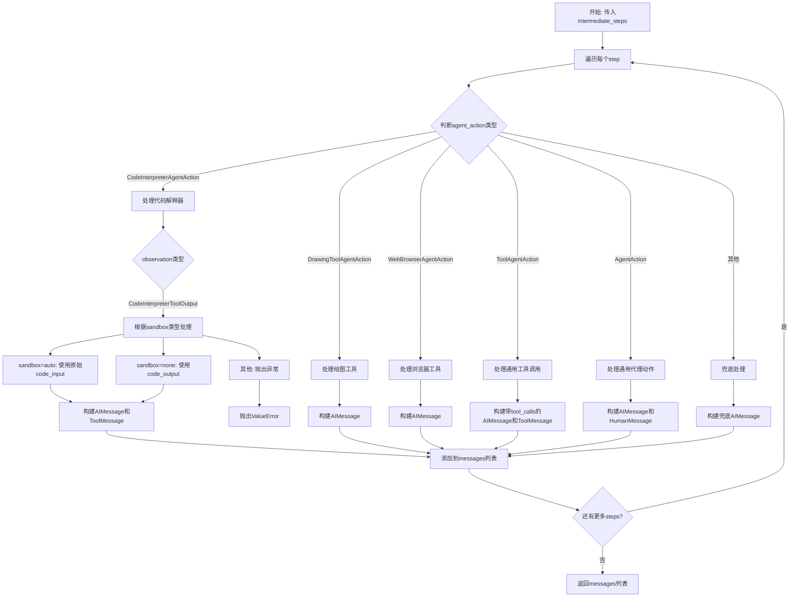
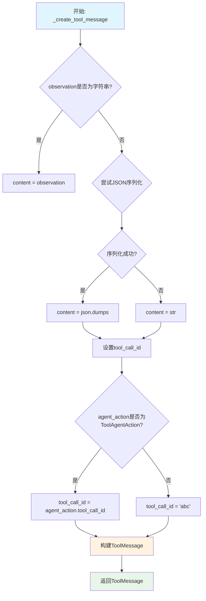
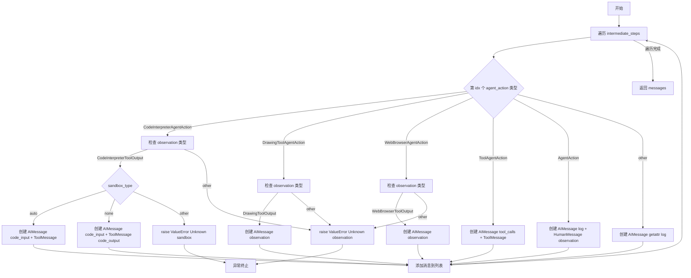

# `Langchain-Chatchat\libs\chatchat-server\langchain_chatchat\agents\format_scratchpad\all_tools.py` 详细设计文档

该模块是LangChain Chatchat项目中的代理输出解析工具，主要功能是将代理在执行工具过程中产生的中间步骤（AgentAction和ToolOutput）转换为平台兼容的消息格式，以便于后续的代理继续推理或结果展示。

## 整体流程



## 类结构

```
无类定义
├── 全局函数
│   ├── _create_tool_message (内部函数，以下划线开头)
│   └── format_to_platform_tool_messages (公开函数)
└── 导入的类型（用于类型注解）
    ├── ToolAgentAction
    ├── AgentAction
    ├── BaseMessage
    ├── AIMessage
    ├── HumanMessage
    ├── ToolMessage
    ├── BaseToolOutput
    ├── CodeInterpreterToolOutput
    ├── DrawingToolOutput
    ├── WebBrowserToolOutput
    ├── CodeInterpreterAgentAction
    ├── DrawingToolAgentAction
    └── WebBrowserAgentAction
```

## 全局变量及字段


### `agent_action`
    
代理的工具调用请求

类型：`Union[ToolAgentAction, AgentAction]`
    


### `observation`
    
工具调用的结果

类型：`Union[str, BaseToolOutput]`
    


### `content`
    
工具消息的内容

类型：`str`
    


### `tool_call_id`
    
工具调用的唯一标识符

类型：`str`
    


### `intermediate_steps`
    
代理到目前为止执行的步骤及观察结果

类型：`Sequence[Tuple[AgentAction, BaseToolOutput]]`
    


### `messages`
    
用于返回给LLM的消息列表

类型：`List[BaseMessage]`
    


### `idx`
    
中间步骤的索引

类型：`int`
    


### `sandbox_type`
    
代码解释器的沙箱类型(auto/none)

类型：`str`
    


### `new_messages`
    
新创建的消息列表

类型：`List[BaseMessage]`
    


### `ai_msgs`
    
AI生成的消息对象

类型：`AIMessage`
    


    

## 全局函数及方法


### `_create_tool_message`

该函数是LangChain ChatChat代理工具消息创建的核心辅助函数，负责将代理的ToolAgentAction或AgentAction与工具执行结果observation转换为标准化的LangChain ToolMessage对象，以支持多轮对话中工具调用历史的正确传递。

参数：

- `agent_action`：`Union[ToolAgentAction, AgentAction]`，代理发出的工具调用请求，包含工具名称、工具输入参数等信息
- `observation`：`Union[str, BaseToolOutput]`，工具执行后的观察结果，可以是字符串或自定义的BaseToolOutput对象

返回值：`ToolMessage`，LangChain标准的工具消息对象，包含工具调用ID、内容以及工具名称等元信息

#### 流程图



#### 带注释源码

```python
def _create_tool_message(
    agent_action: Union[ToolAgentAction, AgentAction], observation: Union[str, BaseToolOutput]
) -> ToolMessage:
    """Convert agent action and observation into a function message.
    
    Args:
        agent_action: the tool invocation request from the agent
        observation: the result of the tool invocation
        
    Returns:
        FunctionMessage that corresponds to the original tool invocation
    """
    # 处理observation：如果是BaseToolOutput对象，需要序列化
    # 如果是字符串直接使用，否则尝试JSON序列化，失败则转为字符串
    if not isinstance(observation, str):
        try:
            # 使用ensure_ascii=False保留中文等非ASCII字符
            content = json.dumps(observation, ensure_ascii=False)
        except Exception:
            # 序列化失败时降级为字符串表示
            content = str(observation)
    else:
        content = observation

    # 初始化tool_call_id，默认为'abc'
    # 只有ToolAgentAction类型才有tool_call_id属性
    tool_call_id = "abc"
    if isinstance(agent_action, ToolAgentAction):
        tool_call_id = agent_action.tool_call_id

    # 构建ToolMessage对象
    # - tool_call_id: 工具调用ID，用于关联请求和响应
    # - content: 工具执行结果内容
    # - additional_kwargs: 附加参数，包含工具名称
    return ToolMessage(
        tool_call_id=tool_call_id,
        content=content,
        additional_kwargs={"name": agent_action.tool},
    )
```


### `format_to_platform_tool_messages`

将 Agent 的中间步骤（AgentAction 与 tool output 的元组序列）转换为消息列表（BaseMessage），以便发送给 LLM 进行下一步预测。

参数：

- `intermediate_steps`：`Sequence[Tuple[AgentAction, BaseToolOutput]]`，LLM 迄今为止采取的步骤及其对应的观察结果

返回值：`List[BaseMessage]`，发送给 LLM 进行下一步预测的消息列表

#### 流程图



#### 带注释源码

```python
def format_to_platform_tool_messages(
    intermediate_steps: Sequence[Tuple[AgentAction, BaseToolOutput]],
) -> List[BaseMessage]:
    """Convert (AgentAction, tool output) tuples into FunctionMessages.

    Args:
        intermediate_steps: Steps the LLM has taken to date, along with observations

    Returns:
        list of messages to send to the LLM for the next prediction
    """
    # 初始化消息列表，用于存储转换后的消息
    messages = []

    # 遍历每一个中间步骤（agent_action, observation）
    for idx, (agent_action, observation) in enumerate(intermediate_steps):
        # === 处理 CodeInterpreter 工具 ===
        # 检查 agent_action 是否为代码解释器动作
        if isinstance(agent_action, CodeInterpreterAgentAction):
            # 验证 observation 类型是否为代码解释器输出
            if isinstance(observation, CodeInterpreterToolOutput):
                # 从平台参数获取沙箱类型，默认为 "auto"
                sandbox_type = observation.platform_params.get("sandbox", "auto")
                
                # 根据沙箱类型创建不同的消息
                if sandbox_type == "auto":
                    # 自动模式：发送代码输入作为 AI 消息
                    new_messages = [
                        AIMessage(content=str(observation.code_input)),
                        _create_tool_message(agent_action, observation),
                    ]
                elif sandbox_type == "none":
                    # 无沙箱模式：发送代码输入和代码输出
                    new_messages = [
                        AIMessage(content=str(observation.code_input)),
                        _create_tool_message(agent_action, observation.code_output),
                    ]
                else:
                    # 未知沙箱类型，抛出异常
                    raise ValueError(f"Unknown sandbox type: {sandbox_type}")
                
                # 将新消息添加到列表，避免重复
                messages.extend([m for m in new_messages if m not in messages])
            else:
                # 观察结果类型不匹配，抛出异常
                raise ValueError(f"Unknown observation type: {type(observation)}")

        # === 处理 DrawingTool 工具 ===
        # 检查 agent_action 是否为绘图工具动作
        elif isinstance(agent_action, DrawingToolAgentAction):
            if isinstance(observation, DrawingToolOutput):
                # 将绘图工具输出转换为 AI 消息并添加
                messages.append(AIMessage(content=str(observation)))
            else:
                raise ValueError(f"Unknown observation type: {type(observation)}")

        # === 处理 WebBrowser 工具 ===
        # 检查 agent_action 是否为网页浏览器工具动作
        elif isinstance(agent_action, WebBrowserAgentAction):
            if isinstance(observation, WebBrowserToolOutput):
                # 将网页浏览器工具输出转换为 AI 消息并添加
                messages.append(AIMessage(content=str(observation)))
            else:
                raise ValueError(f"Unknown observation type: {type(observation)}")

        # === 处理 ToolAgentAction ===
        # 检查是否为标准的工具代理动作（LangChain 内置）
        elif isinstance(agent_action, ToolAgentAction):
            # 创建包含工具调用信息的 AI 消息
            ai_msgs = AIMessage(
                content=f"arguments='{agent_action.tool_input}', name='{agent_action.tool}'",
                additional_kwargs={
                    "tool_calls": [
                        {
                            "index": idx,
                            "id": agent_action.tool_call_id,
                            "type": "function",
                            "function": {
                                "name": agent_action.tool,
                                "arguments": json.dumps(agent_action.tool_input, ensure_ascii=False),
                            },
                        }
                    ]
                },
            )
            # 添加 AI 消息和工具结果消息
            messages.extend([ai_msgs, _create_tool_message(agent_action, observation)])

        # === 处理通用 AgentAction ===
        # 处理非特定的代理动作（通常为自定义 prompt tools）
        elif isinstance(agent_action, AgentAction):
            # 这里假设 observation 是本项目自定义 prompt tools，而不是模型侧的 tools
            # 创建包含日志的 AI 消息和包含观察结果的人类消息
            ai_msgs = AIMessage(
                content=f"{agent_action.log}"
            )
            messages.extend([ai_msgs, HumanMessage(content=str(observation))])

        # === Fallback 处理 ===
        # 兜底处理未知类型的 agent_action
        else:
            messages.append(AIMessage(content=getattr(agent_action, "log", str(agent_action))))

    # 返回转换后的消息列表
    return messages
```

## 关键组件


### 工具消息转换组件 (_create_tool_message)

负责将代理动作（AgentAction）和工具执行结果（observation）转换为平台统一的ToolMessage格式，支持JSON序列化与非字符串观测值的处理。

### 平台工具消息格式化器 (format_to_platform_tool_messages)

核心组件，遍历中间步骤元组列表，根据不同的AgentAction类型（CodeInterpreterAgentAction、DrawingToolAgentAction、WebBrowserAgentAction、ToolAgentAction、AgentAction）创建相应的AIMessage和ToolMessage组合，支持沙箱类型（auto/none）的代码解释器输出处理。

### 代码解释器支持 (CodeInterpreterAgentAction + CodeInterpreterToolOutput)

针对代码解释器工具的特殊处理逻辑，支持自动沙箱和无需沙箱两种模式，将代码输入和输出转换为AIMessage和ToolMessage对。

### 绘图工具支持 (DrawingToolAgentAction + DrawingToolOutput)

将绘图工具的执行结果封装为AIMessage，支持将绘图输出作为内容传递。

### 网页浏览器支持 (WebBrowserAgentAction + WebBrowserToolOutput)

处理网页浏览器工具的输出，将WebBrowserToolOutput转换为AIMessage格式。

### 通用工具代理动作处理 (ToolAgentAction)

处理标准的LangChain ToolAgentAction类型，构造包含tool_calls的AIMessage和对应的ToolMessage，支持工具调用ID传递和JSON格式参数序列化。

### 通用代理动作处理 (AgentAction)

处理非工具类型的通用代理动作，将agent日志和观测结果分别转换为AIMessage和HumanMessage。

### 消息去重机制

在CodeInterpreter处理中使用列表推导式去重，确保相同消息不会重复添加。


## 问题及建议


### 已知问题

-   **硬编码的 tool_call_id**：在 `_create_tool_message` 函数中，`tool_call_id = "abc"` 是硬编码的，当 agent_action 不是 ToolAgentAction 实例时会使用此默认值，可能导致消息追踪问题
-   **低效的重复消息过滤**：`messages.extend([m for m in new_messages if m not in messages])` 使用列表的 `not in` 操作是 O(n²) 复杂度，当消息数量增加时性能会显著下降
-   **异常处理过于宽泛**：在 JSON 序列化失败时使用 `except Exception` 捕获所有异常，缺乏针对性的错误处理，可能隐藏潜在问题
-   **缺少日志记录**：整个模块没有任何日志输出，难以追踪调试和监控运行时状态
-   **Magic Strings 分散**：字符串字面量如 `"abc"`、`"auto"`、`"none"` 散落在代码中，应提取为常量提高可维护性
-   **注释与代码逻辑不符**：代码注释声称"observation 是本项目自定义prompt tools，而不是模型测tools"，但实际未使用 observation 内容，注释可能过时或误导
-   **类型安全不足**：在处理 `AgentAction` 分支时，直接访问 `agent_action.tool` 和 `agent_action.tool_input` 属性，假设这些属性存在但未做防御性检查

### 优化建议

-   使用 UUID 或哈希函数生成唯一的 tool_call_id，替换硬编码的 "abc"
-   使用 `set` 或 `dict` 来追踪已添加的消息，过滤重复消息的时间复杂度可从 O(n²) 降至 O(n)
-   针对不同异常类型进行具体捕获，如 `TypeError`、`ValueError`，并记录详细错误信息
-   引入标准日志模块（`logging`），在关键路径添加日志记录
-   在模块顶部定义常量类，如 `SANDBOX_TYPES = {"auto", "none"}`，避免魔法字符串
-   修正或删除与代码逻辑不符的注释，确保文档与实现一致
-   使用 `getattr()` 带默认值或 hasattr() 进行防御性检查，确保属性访问安全

## 其它


### 设计目标与约束

本模块的核心设计目标是将LangChain agent的中间执行步骤（AgentAction 与 BaseToolOutput 的元组序列）转换为平台兼容的消息格式（AIMessage、ToolMessage、HumanMessage），以便将执行上下文完整地传递回大语言模型进行下一轮推理。主要约束包括：1）必须支持多种工具类型的输出格式化，包括 CodeInterpreter、DrawingTool、WebBrowser 以及通用的 ToolAgentAction；2）需要处理不同 sandbox 模式（auto/none）下的代码解释器输出差异；3）要求保持消息去重以避免重复发送相同内容。

### 错误处理与异常设计

本模块采用分层异常处理策略。在 `_create_tool_message` 函数中，当 observation 对象无法序列化为 JSON 时，捕获异常并降级为字符串转换。在主函数 `format_to_platform_tool_messages` 中，针对每种工具类型进行类型校验：若 observation 类型与 agent_action 类型不匹配，抛出 ValueError 并包含具体的类型信息。对于未知的 sandbox_type，抛出 ValueError 异常提示。所有异常均携带足够的上下文信息，便于调用方进行调试和日志记录。

### 数据流与状态机

数据流从 `intermediate_steps` 参数输入开始，该参数为 Sequence[Tuple[AgentAction, BaseToolOutput]] 类型。流程首先遍历每个中间步骤，然后根据 agent_action 的类型进行分支处理：CodeInterpreterAgentAction 需要根据 platform_params 判断 sandbox 类型并生成不同的消息组合；DrawingToolAgentAction 和 WebBrowserAgentAction 直接将 observation 转换为 AIMessage；ToolAgentAction 生成包含 tool_calls 的 AIMessage 和对应的 ToolMessage；Generic AgentAction 生成纯文本的 AIMessage 和 HumanMessage。最终返回 List[BaseMessage] 供下游 LLM 调用。

### 外部依赖与接口契约

本模块依赖以下外部接口：langchain.agents.output_parsers.tools 中的 ToolAgentAction 和 langchain_core.agents 中的 AgentAction 定义了 agent 动作的数据结构；langchain_core.messages 中的 BaseMessage、AIMessage、HumanMessage、ToolMessage 定义了消息格式；langchain_chatchat.agent_toolkits 中的 BaseToolOutput 及各工具输出类定义了工具执行结果的结构。输入契约要求 intermediate_steps 为非空序列，元素为二元组；输出契约返回消息列表，可为空列表。所有工具输出类型均需实现 __str__ 方法以支持内容转换。

### 性能考虑

在消息生成过程中存在列表去重操作 `[m for m in new_messages if m not in messages]`，该操作的时间复杂度为 O(n²)。当 intermediate_steps 数量较大时，建议改用集合或字典进行去重。此外，每次循环都进行 isinstance 类型检查，可考虑使用字典映射表（Type -> Handler）来优化分支逻辑。JSON 序列化操作在 observation 为非字符串时每次都会执行，应考虑缓存或提前判断是否需要序列化。

### 安全性考虑

代码中存在硬编码的 tool_call_id = "abc"，这可能导致多工具调用场景下消息 ID 重复，应从 agent_action 中提取真实的 tool_call_id。对于 ToolAgentAction 类型，tool_input 和 tool 参数直接用于构建消息内容，需要确保来源可信。JSON 序列化时设置 ensure_ascii=False 允许非 ASCII 字符，但需注意潜在的编码问题。日志输出方面，Generic AgentAction 的 log 字段直接作为消息内容，可能包含敏感信息。

### 兼容性考虑

当前代码假设所有 BaseToolOutput 子类都实现了 __str__ 方法，调用方需确保此契约。CodeInterpreterToolOutput 的 platform_params.get("sandbox", "auto") 使用了默认值 "auto"，需与下游代码保持一致。observation 的类型检查采用精确匹配而非duck typing，新工具类型加入时需要同步更新本模块。版本兼容性方面，需确保 langchain_core 和 langchain_chatchat 的版本与本模块兼容。

### 配置说明

本模块无显式配置项，但隐含依赖以下配置：CodeInterpreter 的 sandbox 模式配置（通过 observation.platform_params 获取）；各工具的输出格式配置（通过工具类的 __str__ 实现）。建议在项目文档中明确 sandbox 选项的合法值（auto/none）以及自定义工具的输出要求。

### 使用示例

```python
# 示例：处理 CodeInterpreter 中间步骤
intermediate_steps = [
    (CodeInterpreterAgentAction(...), CodeInterpreterToolOutput(code_input="print(1+1)", code_output="2", platform_params={"sandbox": "auto"}))
]
messages = format_to_platform_tool_messages(intermediate_steps)
# 输出：[AIMessage(content="print(1+1)"), ToolMessage(...)]
```

    