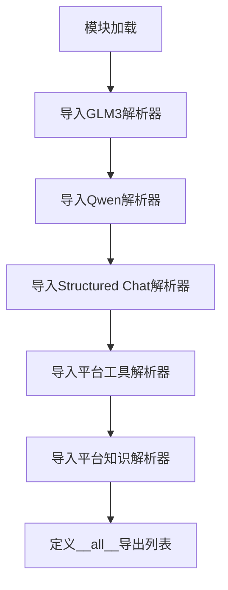

# `Langchain-Chatchat\libs\chatchat-server\langchain_chatchat\agents\output_parsers\__init__.py` 详细设计文档

一个输出解析器工具模块，用于将字符串解析为AgentAction（包含工具名称、输入和日志）或AgentFinish（包含返回值和日志），支持GLM3、Qwen、Structured Chat等多种模型的输出解析，以及平台工具和平台知识的自定义解析。

## 整体流程



## 类结构

```
Output Parsers (输出解析器模块)
├── StructuredGLM3ChatOutputParser (GLM3模型解析器)
├── QwenChatAgentOutputParserCustom (Qwen自定义解析器)
├── StructuredChatOutputParserLC (Structured Chat解析器)
├── PlatformToolsAgentOutputParser (平台工具解析器)
├── PlatformKnowledgeOutputParserCustom (平台知识解析器)
└── MCPToolAction (MCP工具动作)
```

## 全局变量及字段


### `__all__`
    
定义模块公开导出的API名称列表，包含所有可被外部访问的类和变量

类型：`List[str]`
    


    

## 全局函数及方法


## 关键组件


### MCPToolAction

MCP工具动作类，用于表示代理执行的具体工具操作，包含工具名称、输入参数和执行日志信息。

### PlatformKnowledgeOutputParserCustom

平台知识输出解析器自定义实现，负责将模型输出解析为平台知识相关的结构化结果，支持自定义解析逻辑。

### PlatformToolsAgentOutputParser

平台工具代理输出解析器，解析代理输出中的工具调用部分，提取工具名称、参数并生成可执行的AgentAction对象。

### QwenChatAgentOutputParserCustom

Qwen聊天代理输出解析器自定义实现，专门针对Qwen模型输出格式进行解析，支持结构化输出和工具调用识别。

### StructuredGLM3ChatOutputParser

GLM3结构化聊天输出解析器，解析GLM3模型的结构化输出，支持多轮对话和工具使用场景的输出解析。

### StructuredChatOutputParserLC

结构化聊天输出解析器LangChain版本实现，提供标准化的聊天输出解析能力，将文本输出转换为结构化的代理动作或完成结果。


## 问题及建议


### 已知问题

-   **缺少统一的基类或接口定义**：导入了多个不同的输出解析器（StructuredGLM3ChatOutputParser、QwenChatAgentOutputParserCustom、StructuredChatOutputParserLC、PlatformToolsAgentOutputParser、PlatformKnowledgeOutputParserCustom），但没有统一的基类或接口来规范它们的实现，增加了维护和扩展的复杂性
-   **类型注解缺失**：代码注释中提到了 AgentAction 和 AgentFinish 类型，但没有从 langchain 导入这些类型供模块使用，导致类型检查不完整
-   **命名不一致**：部分解析器类名带有 "Custom" 后缀（如 QwenChatAgentOutputParserCustom、PlatformKnowledgeOutputParserCustom），命名规范不统一，可能表明这些是定制版本但缺乏版本管理
-   **导入冗余**：PlatformKnowledgeOutputParserCustom 和 MCPToolAction 被导入但可能未在模块中直接使用，只通过 __all__ 导出
-   **缺少错误处理**：模块级别的导入没有 try-except 包装，如果某个解析器模块依赖缺失，会导致整个包无法导入

### 优化建议

-   **引入统一的基类或协议**：定义一个抽象基类 `BaseOutputParser` 或协议，包含 `parse` 方法签名，所有解析器继承该基类，便于类型检查和动态调用
-   **添加类型导入**：从 langchain 核心模块导入 AgentAction 和 AgentFinish 类型，并使用 from __future__ import annotations 或显式类型注解
-   **统一命名规范**：移除 "Custom" 后缀，改用更描述性的命名（如 QwenChatAgentOutputParser、PlatformKnowledgeOutputParser），或使用版本号区分
-   **优化导入结构**：使用 try-except 处理可选依赖的导入，使用 lazy import 延迟加载非核心解析器
-   **添加工厂模式**：考虑实现一个解析器工厂类或函数，根据模型类型或配置动态选择合适的解析器，减少调用方代码复杂度


## 其它


### 设计目标与约束

本模块作为LangChain ChatChat框架的核心输出解析组件，负责将大语言模型的文本输出解析为结构化的AgentAction（需要执行工具调用的动作）或AgentFinish（需要返回最终结果）对象。设计目标包括：1）支持多种主流大语言模型（GLM3、Qwen等）的输出格式解析；2）提供统一的接口抽象，便于扩展新的解析器；3）支持平台工具调用和知识库查询等特殊场景。约束条件包括：依赖langchain_chatchat项目内部模块，无法独立使用；解析器实现类必须继承自LangChain的BaseOutputParser基类。

### 错误处理与异常设计

模块本身未实现显式的异常处理机制，主要通过导入的各解析器类内部处理解析错误。当输入文本无法匹配任何预期的输出格式时，各解析器通常会抛出OutputParserException异常。设计上采用"快速失败"原则，解析失败时会保留原始输入日志（log变量）以便调试。建议在调用层捕获OutputParserException并根据日志内容进行降级处理或友好提示。

### 数据流与状态机

数据流从外部输入（LLM生成的字符串）开始，依次经过：1）导入的解析器实例选择（由外部调度器根据模型类型选择）；2）parse()方法调用；3）正则表达式匹配或结构化解析；4）转换为AgentAction或AgentFinish对象；5）返回给调用方。没有复杂的状态机设计，解析过程是无状态的纯函数操作。解析结果的状态流转由外部Agent框架控制。

### 外部依赖与接口契约

主要外部依赖包括：langchain_core.output_parsers（基类BaseOutputParser）、langchain_chatchat.agents.output_parsers下的各具体解析器实现。接口契约规定：所有导出类必须实现parse方法，接收字符串输入，返回AgentAction或AgentFinish对象；所有导出类必须实现get_format_instructions方法，返回格式说明字符串供LLM生成符合预期的输出格式。

### 配置与参数说明

本模块为纯导入模块，不包含配置参数。各解析器类的配置由调用方在实例化时传入，例如StructuredChatOutputParserLC可能接受regex、output_parser_key等参数。具体参数说明需参考各解析器实现类的构造函数文档。

### 使用示例

```python
from langchain_chatchat.agents.output_parsers import (
    StructuredChatOutputParserLC,
    QwenChatAgentOutputParserCustom
)

# 创建解析器实例
parser = QwenChatAgentOutputParserCustom()

# 解析LLM输出
llm_output = "Thought: 需要调用搜索工具\nAction: search\nAction Input: Python教程"
result = parser.parse(llm_output)

# result为AgentAction或AgentFinish对象
print(result.tool, result.tool_input)
```

### 性能考虑

解析过程主要涉及正则表达式匹配和字符串处理，计算复杂度为O(n)，其中n为输入字符串长度。模块本身未实现缓存机制，重复解析相同内容时会有性能损耗。建议在高频调用场景下对解析器实例进行复用，避免重复创建开销。

### 安全性考虑

模块本身不涉及敏感数据处理，但解析结果（AgentAction）可能包含执行危险操作的风险。调用方需对解析出的tool和tool_input进行安全校验，特别是在工具调用功能开放给终端用户的场景中，必须实施权限控制和输入过滤。

### 版本历史与变更记录

当前版本基于初始设计，各解析器独立实现。主要变更新增PlatformKnowledgeOutputParserCustom以支持MCP工具调用动作的解析。后续可考虑统一基类抽象，减少代码重复。

    