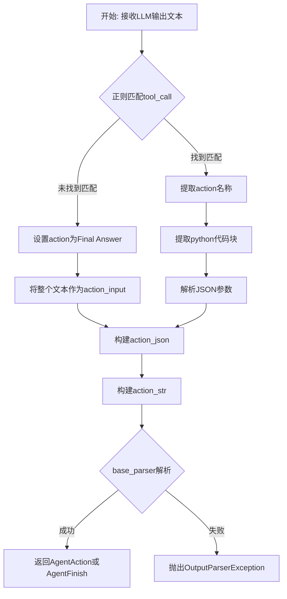
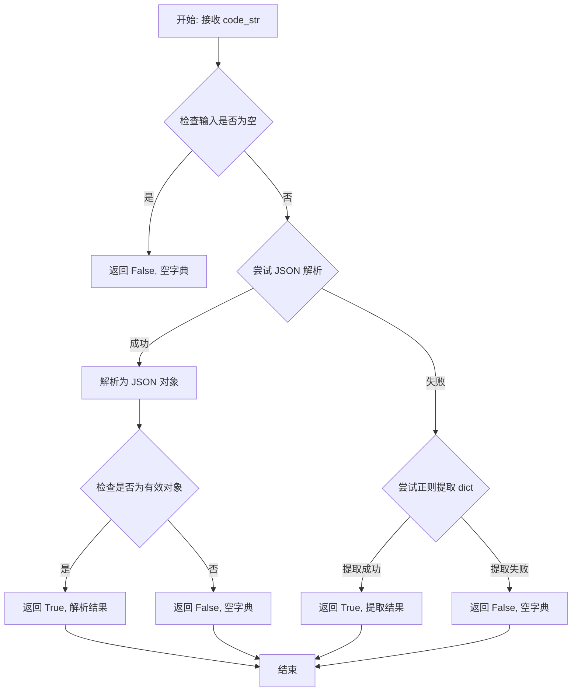
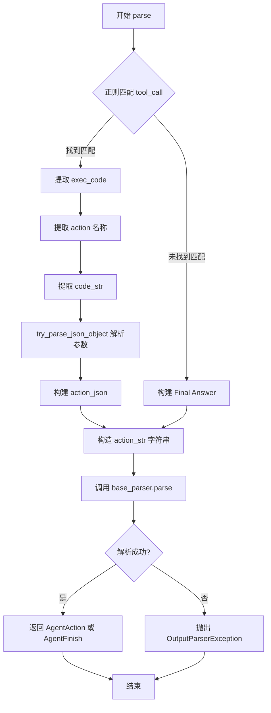
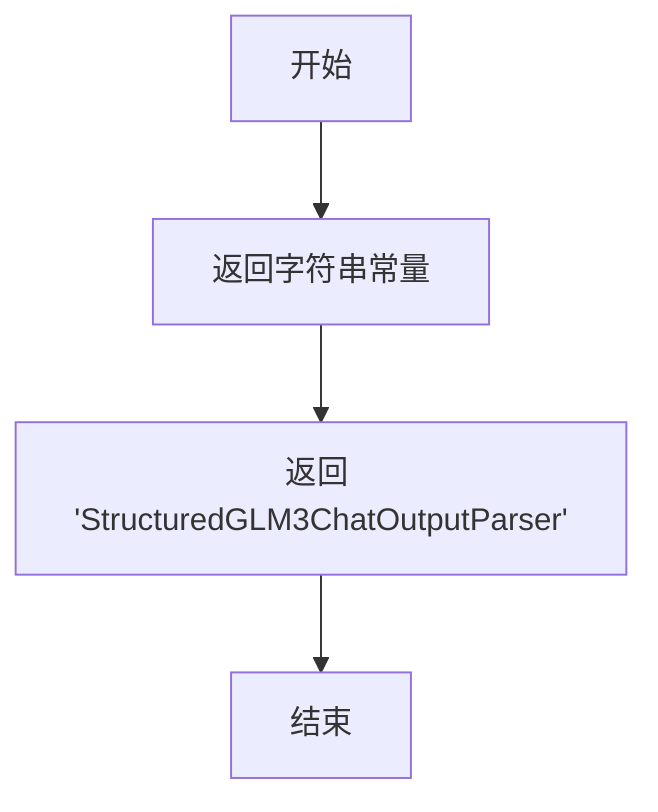

# `Langchain-Chatchat\libs\chatchat-server\langchain_chatchat\agents\output_parsers\glm3_output_parsers.py` 详细设计文档

这是一个用于ChatGLM3-6B模型的结构化聊天输出解析器，继承自langchain的AgentOutputParser类，主要功能是解析大语言模型输出的文本，提取其中包含的tool_call代码块，将其转换为Agent可执行的Action或Final Answer，并支持通过base_parser进行进一步解析和重试机制。

## 整体流程



## 类结构

```
AgentOutputParser (抽象基类)
└── StructuredGLM3ChatOutputParser (本类)
```

## 全局变量及字段


### `json`
    
用于处理JSON数据的标准库模块

类型：`module`
    


### `logging`
    
用于记录日志的标准库模块

类型：`module`
    


### `re`
    
用于正则表达式匹配的标准库模块

类型：`module`
    


### `langchain_core.messages`
    
LangChain核心消息模块

类型：`module`
    


### `langchain_core.prompts`
    
LangChain核心提示词模块

类型：`module`
    


### `AgentOutputParser`
    
LangChain代理输出解析器基类

类型：`class`
    


### `StructuredChatOutputParser`
    
LangChain结构化聊天输出解析器，用于解析结构化聊天代理的输出

类型：`class`
    


### `OutputFixingParser`
    
LangChain输出修复解析器，用于自动修复解析错误的输出

类型：`class`
    


### `AgentAction`
    
LangChain代理动作类，表示代理要执行的行动

类型：`class`
    


### `AgentFinish`
    
LangChain代理完成类，表示代理任务完成

类型：`class`
    


### `OutputParserException`
    
LangChain输出解析异常类

类型：`class`
    


### `Field`
    
Pydantic字段定义类，用于定义模型字段元数据

类型：`class`
    


### `model_schema`
    
获取Pydantic模型的schema信息

类型：`function`
    


### `typing`
    
Python类型提示模块

类型：`module`
    


### `try_parse_json_object`
    
尝试解析JSON对象的工具函数

类型：`function`
    


### `StructuredGLM3ChatOutputParser.base_parser`
    
基础解析器，默认使用StructuredChatOutputParser，用于进一步解析action

类型：`AgentOutputParser`
    
    

## 全局函数及方法


### `try_parse_json_object`

该函数是 ChatChat 工具模块中的一个 JSON 解析工具函数，用于尝试解析 LLM 输出的 Python 代码字符串，提取其中的参数并转换为字典格式。在 `StructuredGLM3ChatOutputParser.parse` 方法中被调用，用于从 `tool_call(...)` 格式的代码字符串中提取函数参数。

参数：

- `code_str`：`str`，需要解析的 Python 代码字符串，通常是从 LLM 输出中提取的 `tool_call(...)` 部分

返回值：`(bool, dict)` 元组，第一个元素表示解析是否成功，第二个元素是解析后的参数字典

#### 流程图



#### 带注释源码

```python
# chatchat/utils/try_parse_json_object.py

def try_parse_json_object(code_str: str) -> tuple[bool, dict]:
    """
    尝试解析代码字符串为 JSON 对象/字典
    
    Args:
        code_str: 包含 tool_call(...) 的代码字符串
        
    Returns:
        tuple: (是否成功, 解析后的参数字典)
    """
    
    # 检查输入是否为空
    if not code_str or not code_str.strip():
        return False, {}
    
    # 方法1: 尝试直接 JSON 解析
    try:
        # 去除可能存在的 Python 函数调用包装
        # 例如: tool_call(name="xxx", args={...})
        result = json.loads(code_str)
        
        # 验证解析结果是否为字典类型
        if isinstance(result, dict):
            return True, result
    except (json.JSONDecodeError, ValueError):
        pass
    
    # 方法2: 使用正则表达式从代码中提取字典
    # 匹配 tool_call(...) 或直接的大括号字典
    match = re.search(r'\{[^{}]*\}', code_str)
    if match:
        try:
            # 尝试解析提取的字典字符串
            result = json.loads(match.group())
            return True, result
        except (json.JSONDecodeError, ValueError):
            pass
    
    # 方法3: 尝试提取 tool_call 的参数
    # 匹配 tool_call(name="xxx", args={...}) 格式
    args_match = re.search(r'tool_call\s*\(\s*name\s*=\s*["\']([^"\']+)["\']\s*,\s*args\s*=\s*(\{[^}]+\})', code_str)
    if args_match:
        try:
            # 提取 args 部分并解析为字典
            args_str = args_match.group(2)
            result = json.loads(args_str)
            return True, result
        except (json.JSONDecodeError, ValueError):
            pass
    
    # 所有方法都失败，返回空字典
    return False, {}
```

---

### 调用上下文：`StructuredGLM3ChatOutputParser.parse`

在 `StructuredGLM3ChatOutputParser` 类中的调用方式：

```python
def parse(self, text: str) -> Union[AgentAction, AgentFinish]:
    # ... 省略前序代码 ...
    
    if exec_code:
        action = str(exec_code.split("```python")[0]).replace("\n", "").strip()

        code_str = str("```" + exec_code.split("```python")[1]).strip()

        # 调用 try_parse_json_object 解析代码字符串
        _, params = try_parse_json_object(code_str)

        action_json = {"action": action, "action_input": params}
    else:
        action_json = {"action": "Final Answer", "action_input": text}

    # ... 后续处理 ...
```

**使用场景说明**：
- LLM 输出可能包含 `tool_call(Name(...))` 格式的函数调用
- `try_parse_json_object` 负责将这种格式的字符串解析为结构化的参数字典
- 解析结果用于构建 `AgentAction` 的 `action_input` 字段


# StructuredGLM3ChatOutputParser 详细设计文档

## 一段话描述

StructuredGLM3ChatOutputParser 是 ChatGLM3-6B 模型专用的 Agent 输出解析器，通过正则表达式从 LLM 原始输出中提取包含 `tool_call` 的代码块，解析并转换为 LangChain 的 AgentAction 或 AgentFinish 对象，支持重试机制和异常处理。

## 文件的整体运行流程

```
┌─────────────────────────────────────────────────────────────────┐
│                        输入：LLM原始文本                         │
└─────────────────────────────────────────────────────────────────┘
                                │
                                ▼
┌─────────────────────────────────────────────────────────────────┐
│           正则匹配：查找 ```python tool_call(...) ```           │
└─────────────────────────────────────────────────────────────────┘
                                │
                    ┌───────────┴───────────┐
                    ▼                       ▼
            【找到匹配】              【未找到匹配】
                    │                       │
                    ▼                       ▼
    ┌───────────────────────────┐  ┌───────────────────────────┐
    │ 1. 提取action名称          │  │ 1. 构建Final Answer       │
    │ 2. 提取code_str            │  │     action_json           │
    │ 3. 解析JSON参数            │  │ 2. 构造action_str         │
    │ 4. 构建action_json         │  └───────────┬───────────────┘
    │ 5. 构造action_str          │              │
    └───────────┬───────────────┘              │
                │                              │
                └──────────────┬───────────────┘
                               ▼
                ┌─────────────────────────────┐
                │   base_parser.parse()       │
                │   (StructuredChatOutputParser)│
                └─────────────┬───────────────┘
                              │
              ┌───────────────┴───────────────┐
              ▼                               ▼
        【解析成功】                     【解析失败】
              │                               │
              ▼                               ▼
    ┌─────────────────┐           ┌─────────────────────┐
    │ 返回AgentAction │           │ 抛出OutputParser   │
    │ 或AgentFinish   │           │ Exception           │
    └─────────────────┘           └─────────────────────┘
```

## 类的详细信息

### StructuredGLM3ChatOutputParser

| 字段/方法 | 类型 | 描述 |
|-----------|------|------|
| **类字段** |||
| base_parser | AgentOutputParser | 基础解析器，默认使用 StructuredChatOutputParser |
| **类方法** |||
| parse(self, text: str) | Union[AgentAction, AgentFinish] | 主解析方法，从 LLM 输出中提取 tool_call 并转换为 AgentAction |
| _type(self) | str | 返回解析器类型标识符 |

### 全局变量和全局函数

| 名称 | 类型 | 描述 |
|------|------|------|
| json | module | Python 标准库，用于 JSON 序列化 |
| logging | module | Python 标准库，用于日志记录 |
| re | module | Python 标准库，用于正则表达式匹配 |
| langchain_core.messages | module | LangChain 核心消息模块 |
| langchain_core.prompts | module | LangChain 核心提示词模块 |
| langchain.agents.agent.AgentOutputParser | class | LangChain Agent 输出解析器基类 |
| langchain.agents.structured_chat.output_parser.StructuredChatOutputParser | class | LangChain 结构化聊天输出解析器 |
| langchain.output_parsers.OutputFixingParser | class | LangChain 输出修复解析器 |
| langchain.schema.AgentAction | class | LangChain Agent 动作 schema |
| langchain.schema.AgentFinish | class | LangChain Agent 完成 schema |
| langchain.schema.OutputParserException | class | LangChain 输出解析异常 |
| chatchat.server.pydantic_v1.Field | class | Pydantic 字段定义 |
| chatchat.server.pydantic_v1.model_schema | function | Pydantic 模型 schema |
| chatchat.server.pydantic_v1.typing | module | Pydantic 类型定义 |
| try_parse_json_object | function | 尝试解析 JSON 对象的工具函数 |

---

## 给定函数详细说明

### `StructuredGLM3ChatOutputParser.parse`

主要解析方法，从 LLM 输出中提取 tool_call 并转换为 AgentAction

参数：

- `self`：StructuredGLM3ChatOutputParser，当前实例
- `text`：`str`，LLM输出的原始文本

返回值：`Union[AgentAction, AgentFinish]`，解析后的Agent动作或完成信号

#### 流程图



#### 带注释源码

```python
def parse(self, text: str) -> Union[AgentAction, AgentFinish]:
    """
    从 LLM 输出文本中解析出 Agent 动作或完成信号
    
    处理流程：
    1. 使用正则表达式查找包含 tool_call 的代码块
    2. 如果找到，提取 action 和参数，构造 action_json
    3. 如果未找到，构造 Final Answer 类型的 action_json
    4. 委托给 base_parser 进行最终解析
    """
    exec_code = None  # 初始化：存储匹配到的可执行代码
    
    # 正则匹配：查找 ```python tool_call(...) ``` 格式的代码块
    # 匹配模式：任意非空白字符 + 空白 + ```python + tool_call + 任意内容 + ``` 
    # re.DOTALL 使 . 匹配换行符
    if s := re.search(r'(\S+\s+```python\s+tool_call\(.*?\)\s+```)', text, re.DOTALL):
        exec_code = s[0]  # 获取匹配到的完整代码块

    if exec_code:
        # ========== 找到 tool_call 代码块 ==========
        
        # 1. 提取 action 名称：取 ```python 之前的部分，去除换行和空格
        action = str(exec_code.split("```python")[0]).replace("\n", "").strip()

        # 2. 提取 code_str：取 ```python 和最后一个 ``` 之间的内容
        # 注意：前面加 ``` 是为了保持 JSON 格式完整性
        code_str = str("```" + exec_code.split("```python")[1]).strip()

        # 3. 解析参数：使用 try_parse_json_object 解析 code_str
        # 返回值：(_, params) 元组，params 为解析后的参数字典
        _, params = try_parse_json_object(code_str)

        # 4. 构建 action_json：包含 action 名称和解析后的参数
        action_json = {"action": action, "action_input": params}
    else:
        # ========== 未找到 tool_call ==========
        # 直接将文本作为 Final Answer 返回
        action_json = {"action": "Final Answer", "action_input": text}

    # 5. 构造 action_str：包装成 base_parser 可解析的格式
    # 格式：Action:\n```json\n{...}\n```
    action_str = f"""
Action:
```
{json.dumps(action_json, ensure_ascii=False)}
```"""
    
    try:
        # 6. 委托给 base_parser 进行最终解析
        # base_parser 是 StructuredChatOutputParser 的实例
        parsed_obj = self.base_parser.parse(action_str)
        return parsed_obj
    except Exception as e:
        # 异常处理：捕获解析异常，重新抛出更明确的异常
        raise OutputParserException(f"Could not parse LLM output: {text}") from e
```

---

## 关键组件信息

| 组件名称 | 一句话描述 |
|----------|------------|
| StructuredGLM3ChatOutputParser | ChatGLM3 专用的 Agent 输出解析器，支持提取 tool_call 并转换为 AgentAction |
| base_parser (StructuredChatOutputParser) | LangChain 标准结构化聊天输出解析器，作为最终解析的委托对象 |
| try_parse_json_object | JSON 对象解析工具函数，用于从字符串中提取 JSON 参数 |
| AgentAction | LangChain Agent 动作表示，包含 action 和 action_input |
| AgentFinish | LangChain Agent 完成信号，表示任务已完成 |
| OutputParserException | 输出解析异常，用于处理解析失败的情况 |

---

## 潜在的技术债务或优化空间

### 1. 正则表达式鲁棒性不足
- **问题**：正则 `r'(\S+\s+```python\s+tool_call\(.*?\)\s+```)'` 对格式要求严格，无法处理多行 tool_call 或不同缩进
- **优化**：考虑使用更灵活的正则或 AST 解析

### 2. 错误处理不够细致
- **问题**：所有异常统一抛出 OutputParserException，丢失了具体的错误类型信息
- **优化**：区分不同异常类型，提供更具体的错误信息

### 3. 缺少日志记录
- **问题**：没有任何 logging 语句，难以追踪解析过程和调试
- **优化**：添加适当的日志记录，特别是在解析失败时

### 4. 正则匹配可能漏匹配
- **问题**：如果 LLM 输出中没有明确的 ```python 标记，会直接返回 Final Answer，可能丢失有效信息
- **优化**：增加备选解析策略或多级降级机制

### 5. 参数解析容错性
- **问题**：try_parse_json_object 解析失败时，params 可能为 None 或空
- **优化**：增加参数验证和默认值处理

### 6. 硬编码字符串
- **问题**："Final Answer" 字符串硬编码在不同位置
- **优化**：提取为常量或配置

---

## 其它项目

### 设计目标与约束

| 目标/约束 | 说明 |
|-----------|------|
| 设计目标 | 将 ChatGLM3-6B 的非结构化输出转换为 LangChain Agent 可执行的结构化动作 |
| 兼容性 | 兼容 LangChain 的 AgentOutputParser 接口 |
| 输入格式 | 支持 LLM 输出的 markdown 代码块格式 |
| 输出格式 | 输出 LangChain标准的 AgentAction 或 AgentFinish 对象 |

### 错误处理与异常设计

```python
# 主要异常处理策略
try:
    parsed_obj = self.base_parser.parse(action_str)
    return parsed_obj
except Exception as e:
    # 捕获所有异常，统一转换为 OutputParserException
    # 保留原始异常作为 cause，便于调试
    raise OutputParserException(f"Could not parse LLM output: {text}") from e
```

- **异常传播**：解析失败时异常向上传播，不做静默处理
- **异常信息**：包含原始 LLM 输出文本，便于问题定位
- **根因保留**：使用 `from e` 保留原始异常堆栈

### 数据流与状态机

```
LLM Output (str)
    │
    ▼ 正则匹配
┌─────────────┐
│ exec_code   │──────┬──▶ 提取 action + code_str ──▶ 解析 JSON ──▶ action_json
│   found?    │      │
└─────────────┘      │
    │ No             │
    ▼                │
Final Answer ────────┘
    │
    ▼
构造 action_str (JSON format)
    │
    ▼
base_parser.parse()
    │
    ▼
AgentAction / AgentFinish
```

### 外部依赖与接口契约

| 依赖模块 | 接口契约 |
|----------|----------|
| langchain.agents.agent.AgentOutputParser | 必须继承，实现 parse() 方法 |
| langchain.agents.structured_chat.output_parser.StructuredChatOutputParser | 作为 base_parser，提供标准解析逻辑 |
| langchain.schema.AgentAction | 返回类型之一，表示要执行的工具动作 |
| langchain.schema.AgentFinish | 返回类型之一，表示任务完成 |
| try_parse_json_object | 输入 code_str 字符串，返回 (_, params) 元组 |

### 版本与兼容性

- **LangChain 版本**：适用于 LangChain 0.1.x 版本
- **Python 版本**：3.8+ (依赖类型注解)
- **Model**：ChatGLM3-6B 专用


### `StructuredGLM3ChatOutputParser._type`

返回解析器的类型标识符，用于标识当前解析器的类型。

参数： 无

返回值：`str`，解析器类型标识符

#### 流程图



#### 带注释源码

```python
@property
def _type(self) -> str:
    """
    返回解析器的类型名称。
    
    这是一个property方法，用于标识当前输出解析器的类型，
    在langchain框架中通常用于序列化/反序列化过程中识别解析器类型。
    
    Returns:
        str: 解析器的类型名称，固定返回 "StructuredGLM3ChatOutputParser"
    """
    return "StructuredGLM3ChatOutputParser"
```

## 关键组件


### StructuredGLM3ChatOutputParser

用于ChatGLM3-6B模型的Agent输出解析器，继承自langchain的AgentOutputParser基类，负责解析LLM生成的文本输出并转换为结构化的AgentAction或AgentFinish对象，支持工具调用的提取和重试机制。

### base_parser (Field)

类型：AgentOutputParser，默认工厂为StructuredChatOutputParser。基础解析器，用于最终的结构化输出解析，当自定义解析失败时作为备选方案。

### parse 方法

参数：text (str) - LLM生成的原始输出文本。
返回值：Union[AgentAction, AgentFinish] - 解析后的Agent动作或完成信号。
功能：使用正则表达式匹配python代码块中的tool_call调用，提取动作名称和参数，构造JSON格式的行动对象，然后委托给base_parser进行最终解析。

### try_parse_json_object

外部工具函数，用于解析JSON对象字符串，返回解析后的键值对。在本代码中用于提取tool_call中的参数信息。

### 正则表达式匹配逻辑

使用re.search配合DOTALL标志匹配\S+到```python tool_call(.*?) ```之间的内容，支持多行匹配，用于捕获工具调用的完整代码块。

### 异常处理机制

当base_parser解析失败时，捕获异常并重新抛出OutputParserException，保留原始LLM输出文本用于调试，包含从异常到原始错误的原因链。


## 问题及建议


### 已知问题

-   **正则表达式过于脆弱**：使用硬编码的正则`r'(\S+\s+```python\s+tool_call\(.*?\)\s+```)'`匹配特定格式，对LLM输出格式变化敏感，任何格式偏差都可能导致无法提取工具调用
-   **异常处理过于简单**：当正则匹配失败时，直接将整个文本作为"Final Answer"返回，丢失了可能有价值的工具调用信息
-   **重试机制未实现**：类文档注释提到"Output parser with retries"，且导入了`OutputFixingParser`，但实际代码中并未使用，违背了设计意图
-   **JSON解析错误不透明**：`try_parse_json_object`解析失败时，`params`可能为异常或空值，但未做有效校验即传入`action_json`
-   **字符串操作低效**：多次调用`str()`、`.split()`和`.replace()`，且使用`json.dumps`序列化后又通过基础解析器重新解析，流程冗余
-   **缺少日志记录**：没有任何日志输出，无法追踪解析失败的具体原因，不利于线上问题排查
-   **类型注解不完整**：`action_json`字典的键值类型未做约束，`action`字段应明确为字符串类型

### 优化建议

-   将正则表达式和关键字符串（如"python"、"tool_call"）提取为可配置参数，提高灵活性
-   增加多轮匹配策略或降级处理机制，避免直接丢弃可能的工具调用信息
-   集成`OutputFixingParser`实现重试逻辑，或移除相关导入以避免误导
-   为`try_parse_json_object`添加错误处理和默认值，增强容错能力
-   简化解析流程，避免不必要的序列化和反序列化操作
-   添加`logging`模块进行关键节点日志记录
-   完善类型注解，使用`TypedDict`或`dataclass`定义`action_json`结构

## 其它


### 设计目标与约束

本模块的设计目标是实现一个适配ChatGLM3-6B模型的LangChain Agent输出解析器，能够正确解析LLM生成的包含工具调用信息的文本，并将其转换为标准的AgentAction或AgentFinish对象。约束条件包括：必须继承LangChain的AgentOutputParser接口，保持与LangChain生态系统的兼容性，支持重试机制处理解析失败的情况。

### 错误处理与异常设计

错误处理主要体现在parse方法的异常捕获逻辑中。当base_parser解析失败时，会捕获异常并抛出新的OutputParserException，携带原始LLM输出文本作为上下文信息。异常设计的原则是保留原始错误信息以便调试，同时提供清晰的错误描述。目前仅对解析异常进行处理，对于格式不正确的LLM输出（如既无工具调用也无Final Answer的情况）缺少额外的验证和预处理机制。

### 数据流与状态机

数据流处理分为两个主要状态分支：工具调用状态和最终答案状态。当LLM输出包含python代码块时，系统进入工具调用状态，提取代码块中的函数调用信息并构造action_json；当不包含代码块时，系统进入最终答案状态，将整个文本作为action_input。状态转换由正则表达式匹配结果决定，不存在中间状态或回退机制。数据流向：原始文本 → 正则匹配 → 代码提取 → JSON解析 → base_parser → AgentAction/AgentFinish。

### 外部依赖与接口契约

本模块依赖以下外部组件：langchain_core.messages和langchain_core.prompts提供基础类型定义；langchain.agents.agent.AgentOutputParser定义解析器接口规范；langchain.agents.structured_chat.output_parser.StructuredChatOutputParser作为默认的base_parser实现；langchain.output_parsers.OutputFixingParser提供自动修复解析错误的能力；chatchat.server.pydantic_v1提供Field和model_schema等工具；自定义模块try_parse_json_object用于JSON解析。接口契约要求：parse方法接受字符串参数返回Union[AgentAction, AgentFinish]；_type属性返回字符串类型的解析器标识符。

### 关键组件信息

**StructuredGLM3ChatOutputParser类**：核心解析器实现类，负责将ChatGLM3的输出格式转换为LangChain标准格式。**base_parser字段**：默认的StructuredChatOutputParser实例，用于完成最终的JSON到Agent对象转换。**try_parse_json_object函数**：自定义JSON解析工具，用于从代码字符串中提取函数调用参数。

### 潜在的技术债务与优化空间

当前实现存在以下可优化点：正则表达式仅支持python代码块格式，对其他语言或格式的工具调用支持不足；缺少对提取结果的验证逻辑，可能导致无效数据传入base_parser；错误处理较为简单，未提供重试机制或降级策略；代码中使用了type hint的精简写法（如s := re.search）可能影响代码可读性；缺少单元测试覆盖和边界条件测试（如空字符串、超长输入等）。

    