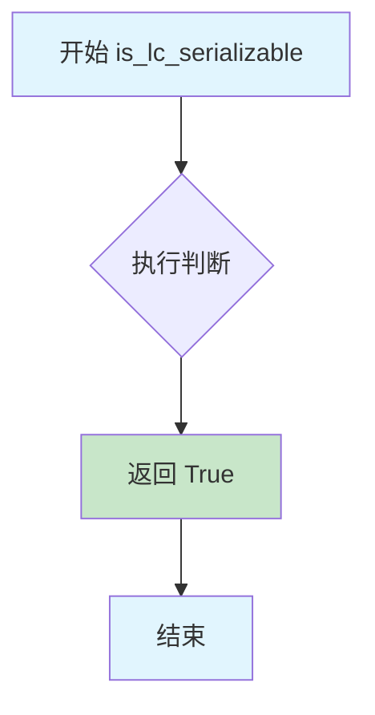
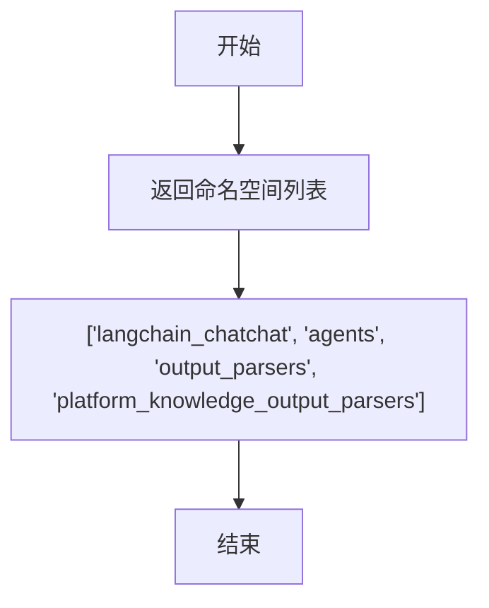
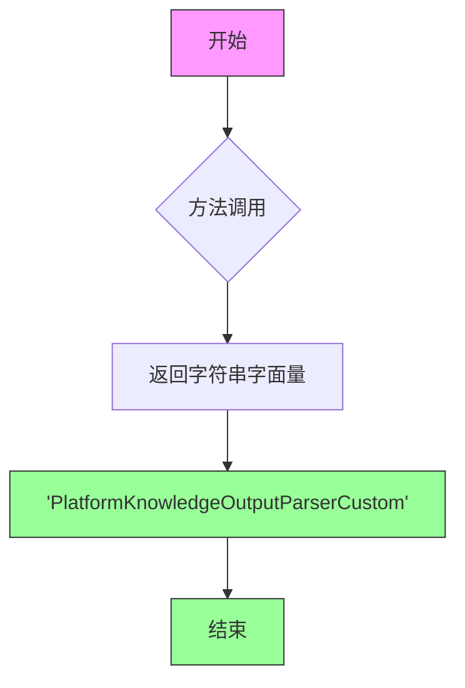

# `Langchain-Chatchat\libs\chatchat-server\langchain_chatchat\agents\output_parsers\platform_knowledge_output_parsers.py` 详细设计文档

这是一个自定义的 LangChain Agent 输出解析器，用于解析 LLM 返回的 XML 格式输出，特别支持 MCP (Model Control Protocol) 工具调用，包含对多种工具类型的处理、重试机制和异常处理。

## 整体流程

```mermaid
graph TD
    A[开始 parse_result] --> B[调用父类 parse_result 解析基础工具]
    B --> C[获取 message.content 并清理 XML]
    C --> D[使用 ET.fromstring 解析 XML]
    D --> E[调用 collect_plain_text 收集日志文本]
    E --> F{遍历 XML 顶层元素}
    F -->|use_mcp_tool| G[提取 server_name, tool_name, arguments]
    G --> G1[调用 try_parse_json_object 解析参数]
    G1 --> G2[创建 MCPToolAction 并添加到列表]
    F -->|thinking| H[跳过继续]
    F -->|use_mcp_resource| I[跳过继续]
    F -->|其他工具| J[提取子标签作为参数]
    J --> J1[创建 AgentAction 并添加到列表]
    F --> K{处理完成}
    K --> L{tools 是 AgentFinish 且无 temp_tools?}
    L -->|是 --> M[返回 tools]
    L -->|否 --> N{tools 不是 AgentFinish?}
    N -->|是 --> O[合并 temp_tools 和 tools]
    N -->|否 --> P[仅返回 temp_tools]
    O --> Q[返回最终结果]
    P --> Q
    M --> Q
    D -->|异常| R[记录错误日志]
    R --> S[返回 AgentFinish 包含原始内容]
```

## 类结构

```
AgentAction (langchain.schema)
└── MCPToolAction (自定义扩展)
ToolsAgentOutputParser (langchain.agents)
└── PlatformKnowledgeOutputParserCustom (自定义实现)
```

## 全局变量及字段


### `logger`
    
模块级日志记录器，用于记录错误和调试信息

类型：`logging.Logger`
    


### `MCPToolAction.server_name`
    
MCP 服务器名称

类型：`str`
    
    

## 全局函数及方法


### `collect_plain_text`

该函数用于递归收集 XML 元素的所有文本内容，包括元素的 text 属性和所有子元素的 tail 属性，并将这些文本内容连接成一个字符串返回。

参数：

- `root`：`Element`（来自 xml.etree.ElementTree），XML 元素根节点

返回值：`str`，所有文本内容连接后的字符串

#### 流程图

```mermaid
flowchart TD
    A[开始] --> B[初始化空列表 texts]
    B --> C{root.text 存在且非空?}
    C -->|是| D[将 root.text.strip() 添加到 texts]
    C -->|否| E[遍历 root 的所有后代元素]
    D --> E
    E --> F{当前元素 tail 存在且非空?}
    F -->|是| G[将当前元素 tail.strip() 添加到 texts]
    F -->|否| H{是否还有更多元素?}
    G --> H
    H -->|是| F
    H -->|否| I[将 texts 连接成字符串]
    I --> J[返回结果]
```

#### 带注释源码

```python
def collect_plain_text(root):
    """
    递归收集 XML 元素的所有文本内容
    
    参数:
        root: Element, XML 元素根节点
        
    返回值:
        str, 所有文本内容连接后的字符串
    """
    texts = []  # 用于存储收集到的所有文本片段
    
    # 检查根元素的 text 属性是否存在且不为空
    if root.text and root.text.strip():
        texts.append(root.text.strip())
    
    # 遍历所有后代元素（包括根元素）
    for elem in root.iter():
        # 检查每个元素的 tail 属性是否存在且不为空
        # tail 属性表示元素标签之后的文本内容
        if elem.tail and elem.tail.strip():
            texts.append(elem.tail.strip())
    
    # 将所有文本片段连接成一个字符串并返回
    return "".join(texts)
```


### `MCPToolAction.is_lc_serializable`

判断当前类是否可被 LangChain 序列化，用于 LangChain 的序列化机制验证。

参数：

- `cls`：`type`，隐式参数，表示类本身（classmethod 的第一个参数）

返回值：`bool`，返回 `True` 表示该类可以被 LangChain 序列化

#### 流程图



#### 带注释源码

```python
@classmethod
def is_lc_serializable(cls) -> bool:
    """
    Return whether or not the class is serializable.
    
    LangChain 序列化机制会调用此方法来判断类是否支持序列化。
    当返回 True 时，LangChain 会将该类纳入序列化支持范围。
    
    Returns:
        bool: 始终返回 True，表示 MCPToolAction 类支持 LangChain 序列化
    """
    return True
```


### `MCPToolAction.get_lc_namespace`

获取 langchain 对象的命名空间，用于 langchain 序列化机制。

参数：

- 无显式参数（`cls` 为类方法隐含参数）

返回值：`List[str]`，返回 langchain 对象的命名空间路径列表

#### 流程图



#### 带注释源码

```python
@classmethod
def get_lc_namespace(cls) -> List[str]:
    """Get the namespace of the langchain object."""
    # 返回该类在 langchain 序列化系统中的命名空间路径
    # 用于 langchain 的序列化/反序列化机制，标识对象的类型层级
    return ["langchain_chatchat", "agents", "output_parsers", "platform_knowledge_output_parsers"]
```


### `PlatformKnowledgeOutputParserCustom.parse_result`

该方法是自定义输出解析器的核心实现，负责解析语言模型生成的XML格式输出。它首先调用父类解析器获取基础工具，然后从模型输出的XML标签中提取MCP工具调用和普通工具调用，将其转换为`AgentAction`或`MCPToolAction`对象，最终返回动作列表或完成结果。

参数：

- `result`：`List[Generation]`，语言模型生成的候选Generation对象列表
- `partial`：`bool`，标志位，表示是否为部分解析（默认为False）

返回值：`Union[List[Union[AgentAction, MCPToolAction]], AgentFinish]`，返回解析后的工具动作列表或代理完成结果

#### 流程图

```mermaid
flowchart TD
    A[开始 parse_result] --> B[调用父类 parse_result 获取基础 tools]
    B --> C[获取 result[0].message.content 并清理]
    C --> D[包装为 XML 格式 <root>标签]
    D --> E[解析 XML 并提取纯文本日志]
    E --> F[遍历 XML 顶层标签]
    
    F --> G{标签类型判断}
    G -->|use_mcp_tool| H[提取 server_name, tool_name, arguments]
    H --> I[解析 arguments 为 JSON 对象]
    I --> J[创建 MCPToolAction 并加入 temp_tools]
    
    G -->|thinking| K[跳过，继续下一标签]
    G -->|use_mcp_resource| L[跳过，继续下一标签]
    G -->|其他标签| M[提取子标签作为工具参数]
    M --> N[创建 AgentAction 并加入 temp_tools]
    
    J --> O{是否还有更多标签}
    K --> O
    L --> O
    N --> O
    
    O -->|是| F
    O -->|否| P{tools 是 AgentFinish 且 temp_tools 为空?}
    P -->|是| Q[直接返回 tools]
    P -->|否| R[将 tools 扩展到 temp_tools 并返回]
    
    R --> S[异常处理: 返回 AgentFinish]
    
    style H fill:#e1f5fe
    style M fill:#e8f5e8
    style S fill:#ffebee
```

#### 带注释源码

```python
def parse_result(
        self, result: List[Generation], *, partial: bool = False
) -> Union[List[Union[AgentAction, MCPToolAction]], AgentFinish]:
    """
    解析模型生成的 Generation 列表为特定格式。
    
    参数:
        result: 语言模型生成的候选Generation对象列表，每个Generation包含message
        partial: 布尔标志，表示是否为部分解析模式
    
    返回:
        Union类型: 
            - List[Union[AgentAction, MCPToolAction]]: 工具动作列表
            - AgentFinish: 代理完成结果
    """
    
    # 第一步：调用父类解析器获取基础工具动作
    # 父类ToolsAgentOutputParser会处理标准的LangChain工具输出格式
    tools = super().parse_result(result, partial=partial)
    
    # 获取模型生成的消息内容
    message = result[0].message
    
    # 初始化临时工具列表用于存储自定义解析的工具
    temp_tools = []
    
    try:
        # 第二步：清理和包装XML内容
        # 移除换行符以统一格式
        cleaned_content = str(message.content).replace("\n", "")
        
        # 包装为有效的XML根标签，便于解析
        wrapped_xml = f"<root>{cleaned_content}</root>"
        
        # 使用ElementTree解析XML
        root = ET.fromstring(wrapped_xml)
        
        # 收集所有纯文本内容作为日志记录
        log_text = collect_plain_text(root)
        
        # 第三步：遍历XML中的所有顶层标签进行处理
        for elem in root:
            # 处理MCP工具调用标签
            if elem.tag == 'use_mcp_tool':
                # 提取MCP服务器名称
                server_name = elem.find("server_name").text.strip()
                # 提取工具名称
                tool_name = elem.find("tool_name").text.strip()
                # 提取参数字符串（JSON格式）
                arguments_raw = elem.find("arguments").text.strip()
                
                # 解析参数JSON字符串为Python对象
                _, json_input = try_parse_json_object(arguments_raw)
                
                # 创建MCP工具动作对象
                act = MCPToolAction(
                    server_name=server_name,
                    tool=tool_name,
                    tool_input=json_input,
                    log=str(log_text)
                )
                temp_tools.append(act)
                
            # 跳过思考标签（模型内部推理过程）
            elif elem.tag == 'thinking':
                continue
                
            # 跳过MCP资源标签（暂不支持）
            elif elem.tag in ['use_mcp_resource']:
                continue
                
            # 处理其他工具标签（如calculate等通用工具）
            else:
                tool_name = elem.tag
                tool_input = {}
                
                # 遍历子标签提取工具参数
                for child in elem:
                    if child.text and child.text.strip():
                        tool_input[child.tag] = child.text.strip()
                
                # 创建标准AgentAction对象
                act = AgentAction(
                    tool=tool_name,
                    tool_input=tool_input,
                    log=str(log_text)
                )
                temp_tools.append(act)

        # 第四步：组合结果
        # 如果父类返回的是完成结果且没有自定义工具，返回完成结果
        if isinstance(tools, AgentFinish) and len(temp_tools) == 0:
            return tools 
        # 否则合并所有工具动作并返回
        elif not isinstance(tools, AgentFinish):
            temp_tools.extend(tools)
            
    except Exception as e:
        # 异常处理：返回包含原始内容的AgentFinish
        logger.error(e)
        return AgentFinish(
            return_values={"output": str(message.content)}, 
            log=str(message.content)
        )
        
    return temp_tools
```


### `PlatformKnowledgeOutputParserCustom._type`

该方法是一个属性方法，用于返回当前输出解析器的类型标识字符串，以便在LangChain框架中识别和注册该自定义解析器。

参数：此方法无显式参数（隐式参数 `self` 为类的实例）

返回值：`str`，返回解析器的类型标识符 "PlatformKnowledgeOutputParserCustom"

#### 流程图



#### 带注释源码

```python
@property
def _type(self) -> str:
    """
    返回解析器的类型标识符。
    
    此方法用于LangChain框架内部机制，
    以便在序列化、注册和识别输出解析器时
    能够正确识别PlatformKnowledgeOutputParserCustom的类型。
    
    Returns:
        str: 解析器的类型标识字符串 "PlatformKnowledgeOutputParserCustom"
    """
    return "PlatformKnowledgeOutputParserCustom"
```

## 关键组件


### MCPToolAction

一个继承自AgentAction的自定义动作类，添加了server_name字段用于标识MCP服务器名称，支持LangChain的序列化机制。

### collect_plain_text

XML文本提取辅助函数，遍历XML根节点及其所有子元素的text和tail属性，收集并合并所有纯文本内容，返回拼接后的字符串。

### PlatformKnowledgeOutputParserCustom

核心输出解析器类，继承自ToolsAgentOutputParser，负责将模型生成的XML格式响应解析为AgentAction或MCPToolAction对象，支持MCP工具调用、通用工具调用和思考过程的处理。

### XML解析模块

使用Python内置的xml.etree.ElementTree模块将模型输出的文本内容包装成XML根节点进行解析，支持遍历和查找子元素。

### JSON参数解析模块

调用try_parse_json_object函数将MCP工具调用中的arguments字段从字符串解析为JSON对象，作为工具输入参数。

### 错误处理与日志模块

使用try-except捕获解析过程中的异常，通过logging模块记录错误信息，并返回包含原始内容的AgentFinish对象作为降级处理。

### 日志记录模块

通过collect_plain_text函数收集XML中的所有文本内容，作为log字段记录到AgentAction中，便于追踪和调试工具调用过程。


## 问题及建议


### 已知问题

- **XML解析缺乏防御性编程**：直接使用 `ET.fromstring()` 解析用户输入的XML内容，没有处理无效XML的情况，可能导致解析失败时返回不完整结果
- **空值访问风险**：多处使用 `.text.strip()` 而未先检查 `elem.find()` 的返回值是否为 `None`，如 `server_name`、`tool_name`、`arguments` 等字段访问
- **异常处理过于宽泛**：捕获所有 `Exception` 后仅记录日志，然后返回包含原始内容的 `AgentFinish`，可能导致隐藏的错误难以追踪
- **重复解析问题**：每次调用 `parse_result` 都会重新解析整个XML字符串，对于批量处理场景性能较差
- **日志变量重复计算**：`log_text` 在循环外部通过 `collect_plain_text(root)` 完整遍历一次XML树，但实际只在创建 `AgentAction` 时使用一次，造成不必要的计算开销
- **未完成的功能占位符**：代码中 `use_mcp_resource` 标签被注释为"暂时跳过"，`thinking` 标签被静默忽略，这些未实现的功能可能影响系统完整性
- **类型注解不完整**：部分变量缺少类型注解，如 `json_input`、`arguments_raw`、`cleaned_content` 等，影响代码可读性和IDE支持
- **硬编码字符串**：如 `"<root>"`、标签名 `'use_mcp_tool'` 等散落在代码各处，不利于维护和国际化
- **变量命名不一致**：同时使用 `temp_tools` 和 `tools` 两种命名风格，且在某些分支中语义混淆（如 `isinstance(tools, AgentFinish)` 的判断逻辑）

### 优化建议

- 在访问 XML 元素前添加 None 检查，例如使用 `elem.find("server_name") is not None and elem.find("server_name").text`
- 将异常处理细分为具体异常类型（`ET.ParseError`、`KeyError` 等），并根据异常类型返回不同策略的结果
- 考虑在类初始化时缓存或预处理重复使用的数据，减少每次解析时的计算量
- 将硬编码的标签名提取为类常量或配置常量
- 为未实现的功能添加明确的 TODO 注释或抛出 `NotImplementedError`，避免静默跳过导致的行为不一致
- 完善类型注解，使用 `Optional` 类型明确标注可能为 None 的变量

## 其它


### 设计目标与约束

本代码旨在实现一个自定义的LangChain Agent输出解析器，专门用于解析包含MCP（Model Control Protocol）工具调用和知识平台相关指令的XML格式响应。设计约束包括：必须继承LangChain的`ToolsAgentOutputParser`类以保持兼容性；支持解析`use_mcp_tool`、`use_mcp_resource`、通用工具标签（如`calculate`）以及`thinking`标签；需要处理XML解析、JSON解析和文本清理等多项任务；解析失败时需要返回`AgentFinish`作为降级方案。

### 错误处理与异常设计

代码采用分层错误处理策略。在`parse_result`方法中，使用`try-except`块捕获所有异常，包括XML解析异常（`ET.fromstring`）、JSON解析异常（`try_parse_json_object`）、属性访问异常（`.text.strip()`）等。任何解析阶段的异常都会被记录到日志（`logger.error(e)`），并返回一个包含原始消息内容的`AgentFinish`对象，确保Agent不会因解析失败而中断执行。对于`use_mcp_tool`标签，要求必须包含`server_name`、`tool_name`和`arguments`三个子标签，缺失任何字段都会导致异常被捕获并触发降级流程。

### 数据流与状态机

数据流遵循以下流程：接收LangChain Agent输出的`List[Generation]` → 提取第一个Generation的消息内容 → 清理换行符并包装为XML根节点 → 解析XML结构 → 遍历顶层元素判断标签类型 → 根据标签类型创建相应的`AgentAction`或`MCPToolAction`对象 → 合并解析出的工具动作与父类解析结果 → 返回动作列表或`AgentFinish`。状态转换包括：正常解析状态（返回工具动作列表）、父类返回`AgentFinish`且无自定义工具时（直接返回`AgentFinish`）、解析异常状态（返回包含原始内容的`AgentFinish`）。

### 外部依赖与接口契约

主要外部依赖包括：`langchain.agents.agent`（`AgentExecutor`, `RunnableAgent`）、`langchain.agents.output_parsers`（`ToolsAgentOutputParser`）、`langchain.agents.structured_chat.output_parser`（`StructuredChatOutputParser`）、`langchain.prompts.chat`（`BaseChatPromptTemplate`）、`langchain.schema`（`AgentAction`, `AgentFinish`）、`langchain_core.outputs`（`Generation`）、`langchain_chatchat.utils.try_parse_json_object`（`try_parse_json_object`）。接口契约方面，`parse_result`方法接受`result: List[Generation]`和可选的`partial: bool`参数，返回`Union[List[Union[AgentAction, MCPToolAction]], AgentFinish]`类型。`MCPToolAction`类继承自`AgentAction`，添加了`server_name`字段并实现了`is_lc_serializable`和`get_lc_namespace`方法以支持LangChain序列化。

### 兼容性考虑

本代码需要Python 3.9+（因使用`from __future__ import annotations`），并依赖LangChain 0.1.x及以上版本。由于继承自`ToolsAgentOutputParser`，需要确保与LangChain的输出解析器接口版本兼容。`MCPToolAction`实现了LangChain的序列化接口（`is_lc_serializable`和`get_lc_namespace`），支持在LangChain的Agent执行链中进行序列化和反序列化。代码使用了`typing`模块的`Union`和`Sequence`等特性，确保类型注解的向前兼容性。

### 性能考虑与优化空间

当前实现的主要性能瓶颈包括：每次解析都创建新的XML解析树（`ET.fromstring`），对于大量请求可能导致性能下降；使用字符串替换清理换行符效率较低；`collect_plain_text`函数遍历所有元素可能产生额外开销。优化建议包括：对于简单的XML内容可以使用正则表达式进行预处理以减少解析开销；可以考虑缓存已解析的XML结构（如果输入相同）；使用`itertext()`方法替代手动遍历可能提高文本提取效率。

### 日志与监控设计

代码使用`logging.getLogger()`获取默认Logger实例，当前仅在异常发生时记录错误日志（`logger.error(e)`）。建议增强日志记录策略：添加DEBUG级别日志记录解析成功的工具数量和类型；添加INFO级别日志记录进入解析流程的时间戳；对于关键的`use_mcp_tool`调用可以记录server_name和tool_name用于审计；考虑使用结构化日志记录解析输入输出的关键字段，便于后续分析。

### 安全考虑

代码处理来自模型输出的内容，需要注意以下安全风险：XML解析可能存在XXE（XML外部实体）攻击风险，当前实现使用`ET.fromstring`默认不解析外部实体，相对安全但建议显式禁用；模型输出可能包含恶意指令，需要在上游Agent层面进行指令验证；日志记录可能泄露敏感信息，建议对日志内容进行脱敏处理；`tool_input`直接使用解析后的JSON对象，可能存在代码注入风险，建议对工具参数进行schema验证。

### 测试策略建议

建议为该模块编写以下测试用例：正常流程测试（包含`use_mcp_tool`标签的XML解析）、父类AgentFinish处理测试（当模型返回最终答案时）、异常流程测试（ malformed XML、缺失必需标签、无效JSON参数等）、多工具调用测试（同时包含多种工具标签）、通用工具标签测试（如`calculate`标签）、边界条件测试（空内容、仅whitespace、超大XML等）。测试数据应覆盖LangChain不同版本的可能输出格式变化。

### 版本历史与兼容性声明

当前版本为初始实现，版本号可定为v0.1.0。已知兼容性说明：依赖于LangChain的`ToolsAgentOutputParser`内部实现，当LangChain版本升级时可能需要调整；`MCPToolAction`的命名空间声明为`["langchain_chatchat", "agents", "output_parsers", "platform_knowledge_output_parsers"]`，需要与项目整体命名空间保持一致；未来可能需要支持更多的MCP协议标签（如资源订阅、工具列表查询等）。
    