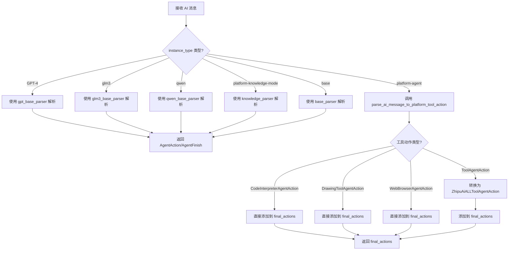
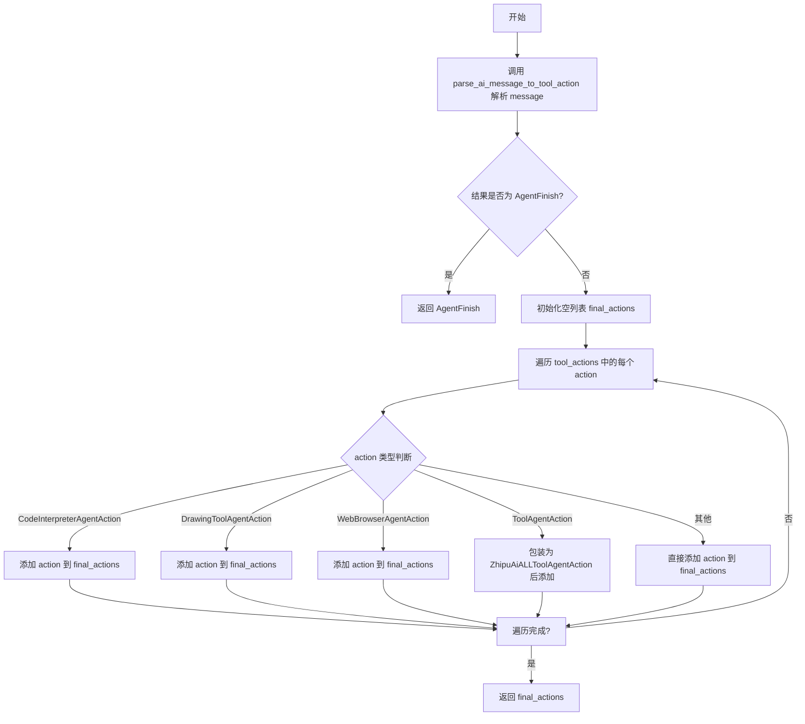
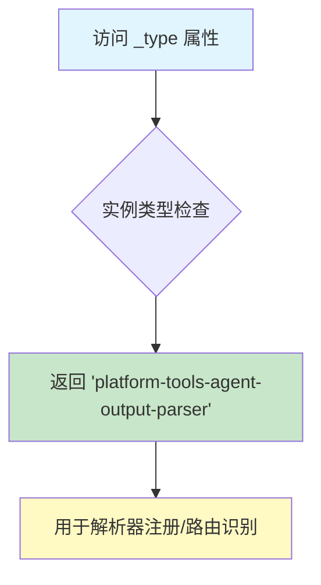
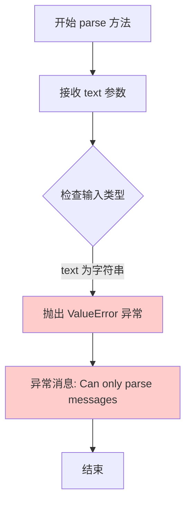

# `Langchain-Chatchat\libs\chatchat-server\langchain_chatchat\agents\output_parsers\platform_tools.py` 详细设计文档

这是一个 langchain 代理输出解析器，用于解析不同 AI 模型（如 GPT-4、GLM3、Qwen、Platform 等）的输出消息，将其转换为 AgentAction 列表或 AgentFinish 结果，支持多种工具调用（代码解释器、绘图工具、网页浏览器等）的解析。

## 整体流程



## 类结构

```
MultiActionAgentOutputParser (langchain.agents.agent)
└── PlatformToolsAgentOutputParser (当前类)
```

## 全局变量及字段


### `ZhipuAiALLToolAgentAction`
    
ToolAgentAction 类型别名，用于统一工具动作格式

类型：`ToolAgentAction`
    


### `PlatformToolsAgentOutputParser.instance_type`
    
代理实例类型

类型：`Literal['GPT-4', 'glm3', 'qwen', 'platform-agent', 'platform-knowledge-mode', 'base']`
    


### `PlatformToolsAgentOutputParser.gpt_base_parser`
    
GPT-4 解析器

类型：`AgentOutputParser`
    


### `PlatformToolsAgentOutputParser.glm3_base_parser`
    
GLM3 解析器

类型：`AgentOutputParser`
    


### `PlatformToolsAgentOutputParser.qwen_base_parser`
    
Qwen 解析器

类型：`AgentOutputParser`
    


### `PlatformToolsAgentOutputParser.knowledge_parser`
    
知识模式解析器

类型：`AgentOutputParser`
    


### `PlatformToolsAgentOutputParser.base_parser`
    
基础解析器

类型：`AgentOutputParser`
    
    

## 全局函数及方法


### `parse_ai_message_to_platform_tool_action`

该函数将 BaseMessage 解析为平台工具动作列表，如果是结束消息则返回 AgentFinish。

参数：
- `message`：`BaseMessage`，需要解析的 AI 消息

返回值：`Union[List[AgentAction], AgentFinish]`，平台工具动作列表或代理结束动作

#### 流程图



#### 带注释源码

```python
def parse_ai_message_to_platform_tool_action(
        message: BaseMessage,
) -> Union[List[AgentAction], AgentFinish]:
    """Parse an AI message potentially containing tool_calls."""
    # 调用通用的工具动作解析函数，将消息解析为工具动作或结束动作
    tool_actions = parse_ai_message_to_tool_action(message)
    # 如果解析结果是结束动作，直接返回
    if isinstance(tool_actions, AgentFinish):
        return tool_actions
    # 初始化最终动作列表，用于存放处理后的动作
    final_actions: List[AgentAction] = []
    # 遍历解析出的每个工具动作
    for action in tool_actions:
        # 如果动作是代码解释器动作，直接添加
        if isinstance(action, CodeInterpreterAgentAction):
            final_actions.append(action)
        # 如果动作是绘图工具动作，直接添加
        elif isinstance(action, DrawingToolAgentAction):
            final_actions.append(action)
        # 如果动作是网页浏览器动作，直接添加
        elif isinstance(action, WebBrowserAgentAction):
            final_actions.append(action)
        # 如果动作是通用工具动作，包装为智谱AI全工具动作后添加
        elif isinstance(action, ToolAgentAction):
            final_actions.append(
                ZhipuAiALLToolAgentAction(
                    tool=action.tool,
                    tool_input=action.tool_input,
                    log=action.log,
                    message_log=action.message_log,
                    tool_call_id=action.tool_call_id,
                )
            )
        # 其他类型的动作直接添加
        else:
            final_actions.append(action)
    # 返回处理后的动作列表
    return final_actions
```


### `PlatformToolsAgentOutputParser._type`

这是一个类属性（property），用于返回当前解析器的类型标识符，以便在多模态代理系统中识别和路由到正确的输出解析器。

参数：无（仅隐式包含 `self` 参数）

返回值：`str`，返回字符串 `"platform-tools-agent-output-parser"`，标识该解析器为平台工具代理输出解析器。

#### 流程图



#### 带注释源码

```python
@property
def _type(self) -> str:
    """返回解析器类型标识符
    
    该属性用于在LangChain代理系统中注册和识别输出解析器。
    返回值是一个唯一的字符串标识符，用于解析器工厂或注册表中
    定位对应的解析器实现。
    
    Returns:
        str: 解析器的类型标识，固定返回 "platform-tools-agent-output-parser"
    """
    return "platform-tools-agent-output-parser"
```

---

## 完整类设计文档

### 一句话描述

`PlatformToolsAgentOutputParser` 是一个多动作代理输出解析器，支持根据不同的模型实例类型（GPT-4、GLM-3、Qwen、Platform-Agent、Platform-Knowledge-Mode）选择对应的解析策略，将 AI 消息解析为工具调用动作或最终完成结果。

### 文件整体运行流程

```
1. 外部调用 parse_result() 或 parse() 方法
2. 根据 instance_type 确定使用的解析策略
3. 选择对应的基础解析器（gpt_base_parser/glm3_base_parser/qwen_base_parser/knowledge_parser/base_parser）
4. 或调用 parse_ai_message_to_platform_tool_action() 处理平台工具动作
5. 返回 AgentAction 列表或 AgentFinish 结果
```

### 类详细信息

#### 类字段

| 字段名称 | 类型 | 描述 |
|---------|------|------|
| `instance_type` | `Literal["GPT-4", "glm3", "qwen", "platform-agent", "platform-knowledge-mode", "base"]` | 代理实例类型，决定使用哪个解析器 |
| `gpt_base_parser` | `AgentOutputParser` | GPT-4 模型的输出解析器，默认 `StructuredChatOutputParser` |
| `glm3_base_parser` | `AgentOutputParser` | GLM-3 模型的输出解析器，默认 `StructuredGLM3ChatOutputParser` |
| `qwen_base_parser` | `AgentOutputParser` | Qwen 模型的输出解析器，默认 `QwenChatAgentOutputParserCustom` |
| `knowledge_parser` | `AgentOutputParser` | 知识模式输出解析器，默认 `PlatformKnowledgeOutputParserCustom` |
| `base_parser` | `AgentOutputParser` | 基础解析器，默认 `StructuredChatOutputParserLC` |

#### 类方法

| 方法名称 | 参数 | 返回值 | 描述 |
|---------|------|--------|------|
| `_type` (property) | 无 | `str` | 返回解析器类型标识 `"platform-tools-agent-output-parser"` |
| `parse_result` | `result: List[Generation]`, `partial: bool = False` | `Union[List[AgentAction], AgentFinish]` | 解析 ChatGeneration 结果，根据 instance_type 选择对应解析器 |
| `parse` | `text: str` | `Union[List[AgentAction], AgentFinish]` | 抛出异常，不支持直接解析文本 |

### 关键组件信息

| 组件名称 | 描述 |
|---------|------|
| `parse_ai_message_to_platform_tool_action` | 将 AI 消息转换为平台工具动作，支持 CodeInterpreter、DrawingTool、WebBrowser 等工具类型 |
| `ZhipuAiALLToolAgentAction` | 智谱 AI 全工具代理动作的别名 |
| `ToolAgentAction` | LangChain 工具代理动作基类 |

### 潜在的技术债务或优化空间

1. **硬编码类型字符串**：`instance_type` 使用字面量类型限制，可考虑使用枚举类替代，提高可维护性
2. **解析器实例化**：使用 `Field(default_factory=...)` 创建解析器实例，每次访问都会调用工厂方法，可考虑缓存
3. **类型转换开销**：`parse_ai_message_to_platform_tool_action` 中存在多次 isinstance 检查和对象转换，可优化
4. **缺少日志记录**：解析过程中没有日志记录，调试困难
5. **错误处理不足**：`parse_result` 仅检查第一个元素类型，缺少对空列表、消息格式异常的防御

### 其它项目

#### 设计目标与约束
- 支持多种大语言模型（GPT-4、GLM-3、Qwen）的输出解析
- 支持平台特定工具调用（CodeInterpreter、DrawingTool、WebBrowser）
- 遵循 LangChain 的 `MultiActionAgentOutputParser` 接口

#### 错误处理与异常设计
- `parse_result()`: 检查 `ChatGeneration` 类型，不符合则抛出 `ValueError`
- `parse()`: 始终抛出 `ValueError`，表明仅支持消息解析
- 建议增加对无效 `instance_type` 的校验

#### 数据流与状态机
```
输入: List[Generation] (ChatGeneration)
    ↓
判断 instance_type
    ↓
选择解析路径:
    - GPT-4 → gpt_base_parser
    - glm3 → glm3_base_parser
    - qwen → qwen_base_parser
    - platform-agent → parse_ai_message_to_platform_tool_action
    - platform-knowledge-mode → knowledge_parser
    - base → base_parser
    ↓
输出: Union[List[AgentAction], AgentFinish]
```

#### 外部依赖与接口契约
- 依赖 `langchain.agents.agent.MultiActionAgentOutputParser` 接口
- 返回值需符合 `AgentAction` 或 `AgentFinish` 类型
- 与 `parse_ai_message_to_tool_action` 配合处理平台工具调用


### `PlatformToolsAgentOutputParser.parse_result`

解析 ChatGeneration 结果，根据实例类型分发到不同的解析器，最终返回 AgentAction 列表或 AgentFinish 对象。

参数：

- `self`：隐式参数，PlatformToolsAgentOutputParser 实例，当前解析器对象
- `result`：`List[Generation]` (typing.List[langchain_core.outputs.Generation])，需要解析的生成结果列表，通常包含 ChatGeneration 对象
- `partial`：`bool` = False，可选参数，表示是否进行部分解析，仅在 knowledge_parser 中使用

返回值：`Union[List[AgentAction], AgentFinish]` (typing.Union[typing.List[langchain_core.agents.AgentAction], langchain_core.agents.AgentFinish])，返回代理动作列表（包含多个工具调用）或代理完成对象（表示任务已完成）

#### 流程图

```mermaid
flowchart TD
    A[开始 parse_result] --> B{检查 result[0] 是否为 ChatGeneration}
    B -->|否| C[抛出 ValueError: 只支持 ChatGeneration 输出]
    B -->|是| D{instance_type == 'GPT-4'?}
    D -->|是| E[调用 gpt_base_parser.parse]
    D -->|否| F{instance_type == 'glm3'?}
    F -->|是| G[调用 glm3_base_parser.parse]
    F -->|否| H{instance_type == 'qwen'?}
    H -->|是| I[调用 qwen_base_parser.parse]
    H -->|否| J{instance_type == 'platform-agent'?}
    J -->|是| K[获取 message 并调用 parse_ai_message_to_platform_tool_action]
    J -->|否| L{instance_type == 'platform-knowledge-mode'?}
    L -->|是| M[调用 knowledge_parser.parse_result]
    L -->|否| N[调用 base_parser.parse]
    E --> O[返回 AgentAction/AgentFinish]
    G --> O
    I --> O
    K --> O
    M --> O
    N --> O
```

#### 带注释源码

```python
def parse_result(
        self, result: List[Generation], *, partial: bool = False
) -> Union[List[AgentAction], AgentFinish]:
    """Parse the result from a model call into agent actions or finish.
    
    根据 instance_type 将生成结果路由到不同的解析器:
    - GPT-4: 使用 StructuredChatOutputParser
    - glm3: 使用 StructuredGLM3ChatOutputParser
    - qwen: 使用 QwenChatAgentOutputParserCustom
    - platform-agent: 解析工具调用消息为平台工具动作
    - platform-knowledge-mode: 使用知识库专用解析器
    - 其他: 使用基础解析器 StructuredChatOutputParserLC
    
    Args:
        result: LangChain Generation 列表，通常为 ChatGeneration 类型
        partial: 是否为部分解析模式，仅 knowledge_parser 使用
    
    Returns:
        AgentAction 列表（多个工具调用）或 AgentFinish（任务完成）
    
    Raises:
        ValueError: 当 result[0] 不是 ChatGeneration 实例时
    """
    # 第一步：类型检查 - 确保输入是 ChatGeneration 类型
    # 因为这个解析器专门设计用于处理聊天模型的输出
    if not isinstance(result[0], ChatGeneration):
        raise ValueError("This output parser only works on ChatGeneration output")

    # 第二步：根据 instance_type 分发到不同的解析器
    if self.instance_type == "GPT-4":
        # GPT-4 模型：使用结构化聊天输出解析器
        return self.gpt_base_parser.parse(result[0].text)
    elif self.instance_type == "glm3":
        # GLM3 模型：使用 GLM3 专用解析器
        return self.glm3_base_parser.parse(result[0].text)
    elif self.instance_type == "qwen":
        # Qwen 模型：使用 Qwen 自定义解析器
        return self.qwen_base_parser.parse(result[0].text)
    elif self.instance_type == "platform-agent":
        # 平台代理：解析 AI 消息中的工具调用
        # 从 ChatGeneration 中获取底层的 AIMessage
        message = result[0].message
        # 调用专门处理平台工具动作的解析函数
        return parse_ai_message_to_platform_tool_action(message)
    elif self.instance_type == "platform-knowledge-mode":
        # 知识库模式：使用专用知识库解析器，支持部分解析
        return self.knowledge_parser.parse_result(result, partial=partial)
    else:
        # 兜底：使用基础解析器处理未知或默认类型
        return self.base_parser.parse(result[0].text)
```


### `PlatformToolsAgentOutputParser.parse`

该方法用于解析文本输出，但当前实现中仅抛出异常，表明该解析器只支持消息（Message）解析，不支持直接的文本解析。

参数：

- `text`：`str`，需要解析的文本字符串

返回值：`Union[List[AgentAction], AgentFinish]`，由于该方法总是抛出异常，实际上不会返回任何值

#### 流程图



#### 带注释源码

```python
def parse(self, text: str) -> Union[List[AgentAction], AgentFinish]:
    """Parse text output from the agent.
    
    This method is not supported for this parser as it only supports
    parsing messages (AIMessage with tool_calls), not raw text.
    
    Args:
        text: The text string to parse (not used)
        
    Returns:
        Never returns - always raises ValueError
        
    Raises:
        ValueError: Always raised to indicate parsing text is not supported
    """
    # 抛出异常，表明该解析器只支持消息解析，不支持文本解析
    raise ValueError("Can only parse messages")
```

## 关键组件


### parse_ai_message_to_platform_tool_action

该函数是核心的工具动作解析函数，负责将AI消息解析为具体的代理动作。它首先调用parse_ai_message_to_tool_action获取基础工具动作，然后根据动作类型进行过滤和转换，特别处理了CodeInterpreterAgentAction、DrawingToolAgentAction和WebBrowserAgentAction，并将通用的ToolAgentAction转换为ZhipuAiALLToolAgentAction格式。

### PlatformToolsAgentOutputParser

这是一个多动作代理输出解析器类，设计用于支持多种AI模型（GPT-4、GLM3、Qwen、platform-agent、platform-knowledge-mode和base）的输出解析。核心功能是根据instance_type字段选择不同的解析器来解析聊天结果，支持知识模式、平台代理模式等多种场景的输出解析。

### instance_type字段

该字段是PlatformToolsAgentOutputParser类的核心配置属性，用于指定当前代理的实例类型。不同的实例类型会触发不同的解析策略，包括GPT-4模式、GLM3模式、Qwen模式、平台代理模式、知识模式以及基础模式，是整个解析器的路由控制核心。

### 多解析器架构

该组件包含五个内置解析器实例：gpt_base_parser（GPT-4专用）、glm3_base_parser（GLM3专用）、qwen_base_parser（Qwen专用）、knowledge_parser（知识模式专用）和base_parser（基础模式专用）。这种设计实现了解析逻辑的解耦和可扩展性，每种模型类型都有对应的专用解析器处理。

### 工具动作类型过滤

该组件负责识别和处理不同类型的工具动作，包括CodeInterpreterAgentAction（代码解释器动作）、DrawingToolAgentAction（绘图工具动作）和WebBrowserAgentAction（网页浏览器动作）。通过isinstance检查实现类型分流，将不同工具的动作分别添加到最终动作列表中。

### ZhipuAiALLToolAgentAction类型别名

该组件是ToolAgentAction的类型别名，用于在平台特定的工具动作处理中保持类型一致性。它封装了工具名称、工具输入、日志、消息日志和工具调用ID等属性，确保跨不同工具类型的统一操作。

### parse_result方法

该方法是PlatformToolsAgentOutputParser的核心解析方法，负责将Generation结果列表解析为AgentAction列表或AgentFinish。它首先验证输入类型，然后根据instance_type选择对应的解析器执行实际的解析工作，是整个输出解析流程的入口点。

### 平台代理模式解析

该组件专门处理platform-agent类型的实例，通过调用parse_ai_message_to_platform_tool_action函数来解析消息中的工具调用，是实现平台自有代理能力的关键路径。


## 问题及建议


### 已知问题

-   **硬编码的实例类型判断**：使用多个`if-elif`语句检查`instance_type`字段（"GPT-4", "glm3", "qwen"等），这种方式不易于扩展，新增实例类型需要修改`parse_result`方法
-   **魔法字符串（Magic Strings）**：实例类型名称使用字符串字面量定义，没有提取为枚举或常量，导致维护困难且易产生拼写错误
-   **parse方法未完整实现**：`parse(text: str)`方法直接抛出`ValueError`，只支持`parse_result`方式，限制了类的使用场景
-   **类型别名使用不当**：`ZhipuAiALLToolAgentAction = ToolAgentAction`这种别名定义容易造成代码理解混淆，且使用场景不明确
-   **平台工具动作重复包装**：在`parse_ai_message_to_platform_tool_action`函数中，ToolAgentAction被重新包装为ZhipuAiALLToolAgentAction，但两者类型相同，这种转换逻辑冗余
-   **缺失错误处理**：当`instance_type`为"platform-agent"时，直接调用`parse_ai_message_to_platform_tool_action`，没有对该函数可能返回的异常进行处理
-   **日志和监控缺失**：整个模块没有任何日志记录，难以追踪解析过程中的问题
-   **typing模块使用混乱**：同时导入了`typing`和`typing_extensions`，且部分类型提示使用了旧式的`typing`模块导入方式

### 优化建议

-   **使用字典映射替代if-elif**：将不同实例类型对应的解析器存储在字典中，通过字典查找替代多分支判断，提高可维护性和执行效率
-   **定义枚举或常量类**：创建枚举类或常量类来定义所有支持的实例类型，避免魔法字符串
-   **完善parse方法实现**：根据实际需求实现`parse`方法，或将其设计为抽象方法并在文档中明确说明
-   **移除冗余的类型别名**：直接使用`ToolAgentAction`，或明确注释该别名的业务含义
-   **添加异常处理和日志**：在关键位置添加try-except捕获和日志记录，便于问题排查
-   **统一类型提示风格**：统一使用`typing_extensions`中的类型提示，或完全迁移到Python 3.10+的原生类型提示
-   **考虑策略模式**：将不同解析器的选择逻辑抽象为策略模式，提高代码的可扩展性和SOLID原则符合度
-   **添加单元测试和类型注解检查**：确保新增实例类型时能通过测试发现潜在问题


## 其它


### 设计目标与约束

该代码的设计目标是提供一个统一的输出解析框架，能够处理多种AI模型（如GPT-4、GLM-3、Qwen等）的输出，并将解析结果转换为统一的代理动作格式。核心约束包括：必须继承自MultiActionAgentOutputParser以保持与LangChain框架的兼容性；支持instance_type字段来动态选择解析策略；所有解析方法必须返回AgentAction列表或AgentFinish对象。

### 错误处理与异常设计

代码中的异常处理主要包括两处：parse_result方法中对非ChatGeneration类型的检查（抛出ValueError）和parse方法中明确抛出不支持文本解析的ValueError。当前错误处理较为简单，建议增强的错误场景包括：tool_actions为None时的处理、解析结果为空时的默认行为、解析失败的降级策略、网络异常或模型返回格式不标准时的容错处理。

### 数据流与状态机

数据流主要分为两条路径：对于GPT-4/glm3/qwen/base类型，通过对应base_parser直接解析文本；对于platform-agent类型，通过parse_ai_message_to_platform_tool_action将消息中的tool_calls转换为具体工具动作；对于platform-knowledge-mode类型，使用专用知识库解析器。状态机表现为：输入ChatGeneration → 判断instance_type → 选择对应解析器 → 输出AgentAction列表或AgentFinish。

### 外部依赖与接口契约

主要外部依赖包括：langchain.agents.agent中的MultiActionAgentOutputParser和AgentOutputParser、langchain_core中的AgentAction/AgentFinish/BaseMessage、各类自定义解析器（StructuredGLM3ChatOutputParser、QwenChatAgentOutputParserCustom等）、工具动作类（CodeInterpreterAgentAction、DrawingToolAgentAction、WebBrowserAgentAction）。接口契约要求：parse_result接受List[Generation]和partial参数、返回Union[List[AgentAction], AgentFinish]、parse方法仅支持消息解析不支持文本解析。

### 配置与初始化

PlatformToolsAgentOutputParser类通过Pydantic的Field定义提供以下可配置字段：instance_type（默认为"platform-agent"）用于指定使用的模型类型、各类base_parser通过default_factory工厂方法初始化。配置方式为代码内硬编码默认解析器，如需自定义解析器需在实例化时通过构造参数传入。

### 性能考虑与优化空间

当前实现中每次parse_result调用都会进行instance_type的条件判断，对于高频调用场景可考虑使用字典映射替代if-elif链以提升性能。另外，parse_ai_message_to_platform_tool_action函数中对tool_actions的遍历和类型检查可以优化，建议使用isinstance的元组形式进行多类型匹配减少判断次数。

### 安全性考虑

代码本身不直接处理敏感数据，但解析器处理的AI输出可能包含用户输入的敏感信息。建议在文档中明确要求对AgentFinish输出进行内容过滤和脱敏处理，特别是在日志记录tool_input和log字段时需注意敏感信息泄露风险。

### 版本兼容性

代码依赖langchain-core和langchain_chatchat等库，需明确标注兼容的版本范围。MultiActionAgentOutputParser接口在不同版本的langchain中可能存在差异，建议在文档中注明测试通过的langchain版本。

### 测试策略

建议补充的测试用例包括：各instance_type的解析结果正确性验证、parse方法调用时的异常抛出测试、parse_result中传入非ChatGeneration类型时的异常测试、空结果列表的处理、多种工具动作类型的解析完整性测试。

    