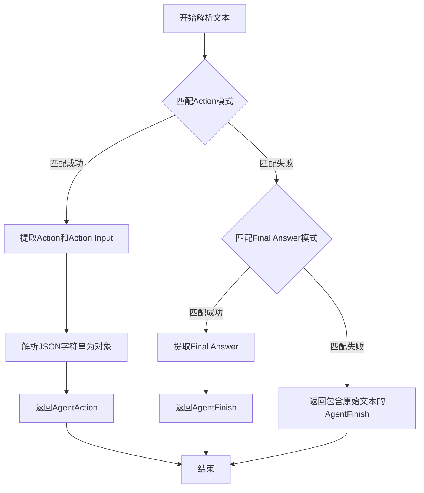
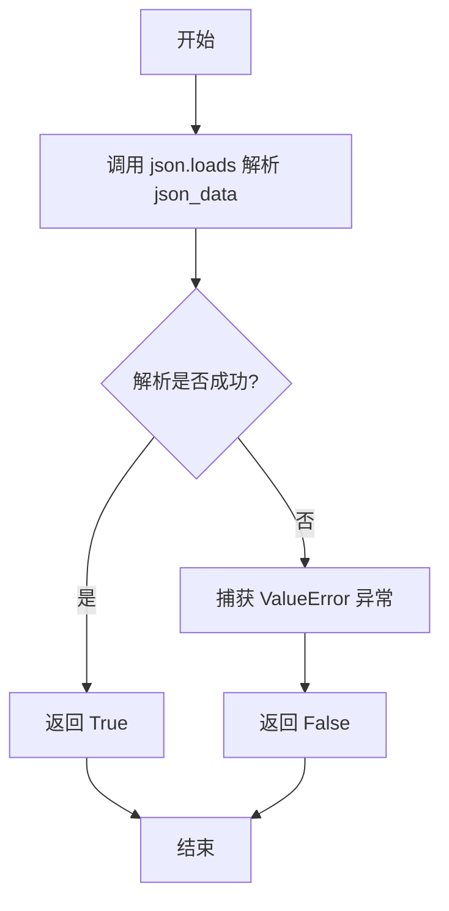
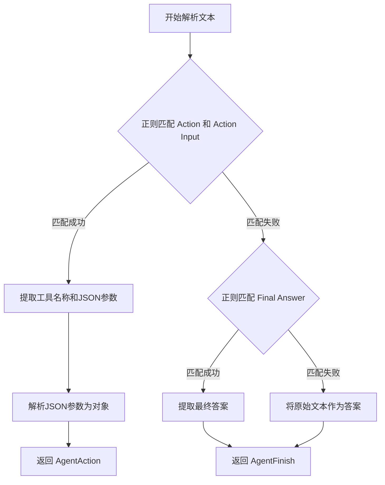

# `Langchain-Chatchat\libs\chatchat-server\langchain_chatchat\agents\output_parsers\qwen_output_parsers.py` 详细设计文档

这是一个自定义的LangChain代理输出解析器，专门用于Qwen聊天模型的输出解析。它继承自StructuredChatOutputParser，能够从模型生成的文本中通过正则表达式提取结构化的Action和Action Input，或者提取Final Answer，并返回AgentAction或AgentFinish对象，支持Agent执行循环的输出解析需求。

## 整体流程



## 类结构

```
StructuredChatOutputParser (LangChain基类)
└── QwenChatAgentOutputParserCustom (自定义实现)
```

## 全局变量及字段


### `validate_json`
    
验证给定的字符串是否为有效的JSON格式

类型：`function(json_data: str) -> bool`
    


    

## 全局函数及方法


### `validate_json`

该函数用于验证输入的字符串是否为有效的JSON格式，通过尝试使用 `json.loads()` 解析字符串并捕获可能的异常来返回布尔值结果。

参数：

- `json_data`：`str`，需要验证的JSON格式字符串

返回值：`bool`，如果输入字符串可以被成功解析为JSON则返回 `True`，否则返回 `False`

#### 流程图



#### 带注释源码

```python
def validate_json(json_data: str):
    """
    验证JSON字符串是否有效
    
    参数:
        json_data: str - 要验证的JSON字符串
        
    返回:
        bool - 如果是有效JSON返回True，否则返回False
    """
    try:
        # 尝试解析JSON字符串
        json.loads(json_data)
        # 解析成功，返回True
        return True
    except ValueError:
        # 解析失败（无效的JSON格式），返回False
        return False
```


# 分析结果

### `try_parse_json_object`

从提供的代码中，`try_parse_json_object` 函数**并未在此文件中定义**，而是从外部模块导入使用。

```python
from langchain_chatchat.utils.try_parse_json_object import try_parse_json_object
```

该函数在 `QwenChatAgentOutputParserCustom.parse` 方法中被调用：

```python
_, json_input = try_parse_json_object(json_string)
```

---

## 基于使用方式的推断分析

**描述**：一个 JSON 解析工具函数，用于尝试解析字符串为 JSON 对象，返回解析结果（可能包含解析后的对象和状态信息）。

参数：

-  `json_string`：`str`，需要解析的 JSON 字符串

返回值：`(Tuple[bool, Any])` 或类似结构，返回一个元组，其中第二个元素是解析后的 JSON 对象（字典）

#### 流程图

```mermaid
flowchart TD
    A[开始] --> B[接收 json_string 参数]
    B --> C{尝试调用 json.loads 解析}
    C -->|成功| D[返回 (True, 解析后的对象)]
    C -->|失败| E[返回 (False, 原始字符串或空)]
    D --> F[结束]
    E --> F
```

#### 源码（基于使用方式推断）

```python
# 注意：此为基于调用方式的推断源码，非原始定义
def try_parse_json_object(json_string: str) -> Tuple[bool, Any]:
    """
    尝试解析 JSON 字符串为 Python 对象
    
    参数:
        json_string: 需要解析的 JSON 字符串
        
    返回:
        Tuple[bool, Any]: (是否成功, 解析结果或原始数据)
    """
    try:
        parsed_obj = json.loads(json_string)
        return True, parsed_obj
    except (json.JSONDecodeError, ValueError):
        return False, json_string  # 或返回空字典 {}
```

---

## 重要说明

⚠️ **函数定义不在提供的代码中**。实际定义位于 `langchain_chatchat/utils/try_parse_json_object.py` 模块中。如需完整的函数源码和详细文档，建议查看该源文件。

---

## 在调用方中的使用上下文

```python
# QwenChatAgentOutputParserCustom.parse 方法中的调用
json_string: str = s[1]  # 从正则匹配结果中获取 JSON 字符串
_, json_input = try_parse_json_object(json_string)  # 解析为字典

# 返回 AgentAction
return AgentAction(tool=s[0].strip(), tool_input=json_input, log=text)
```

---

## 潜在优化建议

1. **缺少源码访问**：建议直接查看 `langchain_chatchat/utils/try_parse_json_object.py` 获取精确实现
2. **错误处理**：当前调用未检查返回值中的状态标志（`_`），建议添加错误处理逻辑
3. **类型注解**：可考虑在调用处添加类型检查以确保 `json_input` 为字典类型


### `QwenChatAgentOutputParserCustom.parse`

该方法是自定义的输出解析器，用于解析 Qwen 聊天智能体的文本输出。它通过正则表达式匹配两种常见的输出格式：包含 Action 和 Action Input 的工具调用格式，或包含 Final Answer 的最终答案格式。如果都无法匹配，则将原始文本作为最终答案返回。

参数：

- `text`：`str`，需要解析的 LLM 输出文本

返回值：`Union[AgentAction, AgentFinish]`，解析后得到的智能体动作或完成结果

#### 流程图



#### 带注释源码

```python
def parse(self, text: str) -> Union[AgentAction, AgentFinish]:
    """解析 LLM 输出的文本，提取智能体动作或完成结果
    
    参数:
        text: LLM 生成的原始文本
        
    返回:
        AgentAction: 当包含工具调用时返回
        AgentFinish: 当包含最终答案或无法解析时返回
    """
    # 使用正则表达式匹配 "Action: xxx\nAction Input: xxx" 格式
    if s := re.findall(
            r"\nAction:\s*(.+)\nAction\sInput:\s*(.+)", text, flags=re.DOTALL
    ):
        # 取最后一个匹配（处理多轮对话场景）
        s = s[-1]
        # 提取第二个捕获组作为 JSON 字符串
        json_string: str = s[1]

        # 尝试将 JSON 字符串解析为 Python 对象
        _, json_input = try_parse_json_object(json_string)

        # TODO 注释: 有概率 key 为 command 而非 query，需修改
        # 此处预留了处理 command 字段的代码，目前被注释
        # if "command" in json_input:
        #     json_input["query"] = json_input.pop("command")

        # 返回 AgentAction，包含工具名、工具输入和完整日志
        return AgentAction(tool=s[0].strip(), tool_input=json_input, log=text)
    # 使用正则表达式匹配 "Final Answer: xxx" 格式
    elif s := re.findall(r"\nFinal\sAnswer:\s*(.+)", text, flags=re.DOTALL):
        # 取最后一个匹配
        s = s[-1]
        # 返回 AgentFinish，包含答案输出和完整日志
        return AgentFinish({"output": s}, log=text)
    else:
        # 无法匹配任何格式时，将原始文本作为最终答案返回
        return AgentFinish({"output": text}, log=text)
        # 注释: 原计划抛出异常，但为了鲁棒性改为返回原始文本
        # raise OutputParserException(f"Could not parse LLM output: {text}")
```


### `QwenChatAgentOutputParserCustom._type`

这是一个属性方法，用于返回当前输出解析器的类型标识符，主要用于系统内部识别和序列化反序列化操作。

参数： 无

返回值：`str`，返回解析器的类型标识符 "StructuredQWenChatOutputParserCustom"

#### 流程图

```mermaid
flowchart TD
    A[开始] --> B{访问 _type 属性}
    B --> C[返回字符串 "StructuredQWenChatOutputParserCustom"]
    C --> D[结束]
```

#### 带注释源码

```python
@property
def _type(self) -> str:
    """
    返回输出解析器的类型标识符
    
    该属性用于LangChain框架内部识别解析器类型，
    主要用于序列化/反序列化过程中标识解析器类型。
    
    Returns:
        str: 解析器的类型名称，用于框架内部识别
    """
    return "StructuredQWenChatOutputParserCustom"
```

## 关键组件


### validate_json 函数

用于验证字符串是否为有效的JSON格式，内部使用json.loads进行验证，返回布尔值。

### QwenChatAgentOutputParserCustom 类

继承自StructuredChatOutputParser的自定义输出解析器，专门用于解析Qwen聊天代理的输出。支持解析Action和Action Input以及Final Answer，采用正则表达式匹配和JSON解析提取关键信息。

### try_parse_json_object 工具函数

从langchain_chatchat.utils.try_parse_json_object模块导入的JSON解析辅助函数，用于从字符串中解析JSON对象。

### 正则表达式匹配组件

使用re.findall配合正则表达式r"\nAction:\s*(.+)\nAction\sInput:\s*(.+)"提取Action和Action Input，使用r"\nFinal\sAnswer:\s*(.+)"提取最终答案。

### 索引与惰性加载机制

通过s[-1]获取最后一个匹配项，避免处理可能存在的多个匹配结果中的错误匹配，这是一种优化策略。

### AgentAction 和 AgentFinish 构建

根据解析结果构建LangChain代理的Action或Finish对象，包含tool名称、tool_input参数和完整的log信息。

### 类型注解与类型检查

使用Union类型标注返回AgentAction或AgentFinish，使用类型注解提高代码可读性和IDE支持。


## 问题及建议


### 已知问题

-   **TODO 待处理**：代码中存在 TODO 注释，指出 JSON 输入"有概率key为command而非query，需修改"，但该逻辑目前被注释掉，未实际处理
-   **正则表达式贪心匹配风险**：使用 `.+` 进行匹配可能产生贪心行为，在复杂输入情况下可能匹配到非预期内容
-   **解析失败静默处理**：当正则无法匹配时，直接返回原始文本作为 AgentFinish，没有抛出异常或记录日志，可能导致静默失败难以调试
-   **validate_json 函数设计缺陷**：该函数只返回布尔值，未返回解析后的 JSON 对象，调用方需要额外调用 json.loads，造成重复解析
-   **缺少输入验证**：parse 方法未对输入 text 做空值或类型校验，可能导致运行时错误
-   **魔法数字与硬编码**：正则模式中的一些匹配规则缺乏文档说明，后续维护困难

### 优化建议

-   **补充 TODO 逻辑**：根据实际业务需求，实现对 "command" 键的支持，或在文档中明确说明仅支持 "query"
-   **改进正则表达式**：考虑使用非贪心匹配 `.*?` 或更精确的模式，提升解析健壮性
-   **添加日志记录**：引入 logging 模块记录解析失败、异常情况，便于问题追踪
-   **增强 validate_json 函数**：返回解析后的 JSON 对象或解析错误信息，避免重复解析
-   **完善输入校验**：在 parse 方法入口添加参数校验，处理空字符串、None 等边界情况
-   **提取正则模式为常量**：将正则表达式模式定义为类常量或配置文件，提升可读性和可维护性
-   **考虑异常抛出策略**：对于明确解析失败的情况，建议抛出自定义异常而非静默返回，提高错误可见性


## 其它


### 设计目标与约束

本代码旨在为聊天代理提供灵活、自定义的输出解析能力，支持解析Action/Action Input格式和Final Answer格式两种输出类型。设计约束包括：必须继承自StructuredChatOutputParser以保持与LangChain框架的兼容性；解析逻辑需要处理多种可能的输出格式变体；需要兼容Qwen模型的输出特点。

### 错误处理与异常设计

本代码采用宽松的错误处理策略。当无法匹配预定义的输出格式时，不会抛出OutputParserException，而是返回包含原始文本的AgentFinish对象。validate_json函数用于验证JSON格式有效性，返回布尔值而非抛出异常。TODO注释标注了潜在问题：代码有概率遇到key为command而非query的情况，需要后续修改。

### 数据流与状态机

数据流主要分为三路：
1. 输入：原始模型输出文本（text参数）
2. 处理：通过正则表达式匹配Action/Action Input或Final Answer模式
3. 输出：AgentAction或AgentFinish对象

状态机转换：
- 初始状态：接收原始文本
- 匹配状态：尝试正则匹配Action格式
- 解析状态：提取JSON格式的tool_input
- 结束状态：返回AgentAction或AgentFinish对象

### 外部依赖与接口契约

主要外部依赖：
- langchain.agents.structured_chat.output_parser.StructuredChatOutputParser：父类
- langchain.schema.AgentAction, AgentFinish：返回类型
- langchain_chatchat.utils.try_parse_json_object.try_parse_json_object：JSON解析工具

接口契约：
- parse(text: str) -> Union[AgentAction, AgentFinish]：核心解析方法，输入模型输出文本，返回代理动作或完成结果
- _type属性：返回解析器类型标识符"StructuredQWenChatOutputParserCustom"

### 性能考虑与优化建议

性能优化点：
- re.findall返回列表后使用s[-1]获取最后一次匹配，可以考虑在匹配到第一个有效结果后即返回，减少不必要的遍历
- try_parse_json_object可能涉及复杂的JSON解析逻辑，需关注其实现效率
- 当前使用re.DOTALL标志进行多行匹配，正则表达式编译可考虑预编译以提升性能

### 安全性考虑

当前代码安全性风险较低，因其主要处理文本解析而不涉及敏感操作。但需注意：
- tool_input来自模型输出，需要确保后续处理流程对输入进行充分验证
- 如果模型输出被恶意构造，可能导致注入风险，建议在AgentAction使用处增加输入验证

### 测试策略建议

应覆盖以下测试场景：
1. 正确解析标准Action/Action Input格式
2. 正确解析多组Action时返回最后一个
3. 正确解析Final Answer格式
4. 无法匹配格式时返回包含原始文本的AgentFinish
5. JSON解析失败时的降级处理
6. 空字符串、特殊字符等边界情况

### 版本兼容性说明

代码明确要求from __future__ import annotations以支持类型注解的向前兼容。依赖LangChain框架，当前版本对LangChain的具体版本可能有要求，建议在项目依赖中明确指定兼容版本范围。

### 使用示例与调用上下文

本解析器通常与AgentExecutor配合使用，作为输出解析组件嵌入到聊天代理流程中。典型调用链：模型输出文本 -> QwenChatAgentOutputParserCustom.parse() -> AgentAction/AgentFinish -> 代理执行后续动作或返回最终结果。
</think>
    