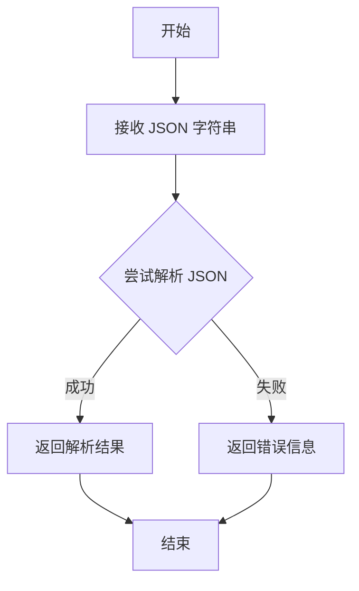
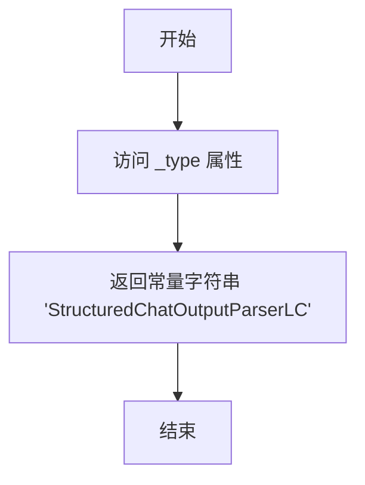

# `Langchain-Chatchat\libs\chatchat-server\langchain_chatchat\agents\output_parsers\structured_chat_output_parsers.py` 详细设计文档

一个继承自LangChain的StructuredChatOutputParser的输出解析器类，专门用于结构化聊天代理(Structured Chat Agent)，通过正则表达式解析LLM输出中的Action块，提取JSON格式的action和action_input，并返回AgentAction或AgentFinish对象，支持对LLM输出的重试解析。

## 整体流程

```mermaid
graph TD
    A[开始: parse(text)] --> B{正则匹配Action块}
    B -- 匹配成功 --> C[提取JSON字符串]
    B -- 匹配失败 --> D[抛出OutputParserException]
C --> E[调用try_parse_json_object解析JSON]
E --> F{提取action字段}
F --> G{action == 'Final Answer'}
G -- 是 --> H[返回AgentFinish对象]
G -- 否 --> I[返回AgentAction对象]
H --> J[结束]
I --> J
```

## 类结构

```
StructuredChatOutputParser (LangChain基类)
└── StructuredChatOutputParserLC (自定义实现)
```

## 全局变量及字段


### `json`
    
Python标准库JSON处理模块

类型：`module`
    


### `re`
    
Python标准库正则表达式模块

类型：`module`
    


### `Any`
    
类型注解，表示任意类型

类型：`typing.Type`
    


### `List`
    
类型注解，表示列表类型

类型：`typing.Type`
    


### `Sequence`
    
类型注解，表示序列类型

类型：`typing.Type`
    


### `Tuple`
    
类型注解，表示元组类型

类型：`typing.Type`
    


### `Union`
    
类型注解，表示联合类型

类型：`typing.Type`
    


### `StructuredChatOutputParser`
    
LangChain结构化聊天输出解析器基类

类型：`class`
    


### `AgentAction`
    
LangChain代理动作类

类型：`class`
    


### `AgentFinish`
    
LangChain代理完成类

类型：`class`
    


### `AIMessage`
    
LangChain AI消息类

类型：`class`
    


### `HumanMessage`
    
LangChain人类消息类

类型：`class`
    


### `OutputParserException`
    
LangChain输出解析异常类

类型：`class`
    


### `SystemMessage`
    
LangChain系统消息类

类型：`class`
    


### `try_parse_json_object`
    
尝试解析JSON对象的工具函数

类型：`function`
    


### `StructuredChatOutputParserLC.parse`
    
解析LLM输出文本，提取动作或最终答案

类型：`method`
    


### `StructuredChatOutputParserLC._type`
    
返回解析器类型标识符

类型：`method`
    
    

## 全局函数及方法


# 文档生成

由于提供的代码文件中**并未包含 `try_parse_json_object` 函数的实际实现**（仅导入了该函数并在 `parse` 方法中调用），因此无法提取该函数的完整源码。

根据代码中的使用方式，可以推断该函数的基本特征：

### `try_parse_json_object`

JSON 解析函数，用于安全解析 JSON 字符串并返回解析结果。

参数：

-  `json_string`：`str`，待解析的 JSON 字符串（来自 LLM 输出的 Action 内容）

返回值：`Tuple[Any, Any]`，通常为 (是否成功, 解析后的 JSON 对象) 或 (错误信息, 解析结果)

#### 流程图



#### 带注释源码

```
# 源码未在提供的代码文件中定义
# 该函数从 langchain_chatchat.utils.try_parse_json_object 导入
# 根据使用处的代码推断：
# _, parsed_json = try_parse_json_object(s[0])
# 其中 s[0] 是通过正则表达式提取的 JSON 字符串
```

---

## 补充说明

**注意**：要获取 `try_parse_json_object` 函数的完整详细信息（包括完整源码），需要查看 `langchain_chatchat/utils/try_parse_json_object.py` 文件的实际内容。当前提供的代码文件仅包含对该函数的使用，未包含其实现。


### `StructuredChatOutputParserLC.parse`

该方法是结构化聊天输出解析器的增强版本，负责解析大语言模型的文本输出，通过正则表达式提取 Action 块中的 JSON 数据，区分最终答案和工具调用动作，并返回相应的 AgentAction 或 AgentFinish 对象。

参数：

- `text`：`str`，待解析的文本，包含大语言模型输出的内容

返回值：`Union[AgentAction, AgentFinish]`，根据解析结果返回 AgentAction（执行工具调用）或 AgentFinish（返回最终答案）

#### 流程图

```mermaid
flowchart TD
    A[开始 parse 方法] --> B{正则匹配 \nAction:\s*```(.+)```}
    B -->|匹配成功| C[提取第一个匹配组 s[0]]
    B -->|匹配失败| D[抛出 OutputParserException]
    C --> E[调用 try_parse_json_object 解析 s[0]]
    E --> F[获取 action JSON 对象]
    F --> G{action.get('action') == 'Final Answer'}
    G -->|是| H[返回 AgentFinish output=action_input]
    G -->|否| I[返回 AgentAction tool=tool tool_input=action_input]
    H --> J[结束]
    I --> J
    D --> J
```

#### 带注释源码

```
def parse(self, text: str) -> Union[AgentAction, AgentFinish]:
    """
    解析大语言模型输出的文本，提取结构化的工具调用或最终答案
    
    参数:
        text: 大语言模型输出的原始文本
        
    返回:
        AgentAction: 当需要执行工具调用时返回
        AgentFinish: 当返回最终答案时返回
        
    异常:
        OutputParserException: 当无法解析文本时抛出
    """
    # 使用正则表达式匹配 Action 块，提取 JSON 内容
    # 匹配模式: 换行符 + "Action: " + ``` + 任意内容 + ```
    if s := re.findall(r"\nAction:\s*```(.+)```", text, flags=re.DOTALL):
        # 解析提取的 JSON 字符串为 Python 对象
        _, parsed_json = try_parse_json_object(s[0])
        action = parsed_json
    else:
        # 无法匹配时抛出解析异常
        raise OutputParserException(f"Could not parse LLM output: {text}")
    
    # 从 action 对象中获取要执行的工具名称
    tool = action.get("action")
    
    # 判断是否为最终答案
    if tool == "Final Answer":
        # 返回 AgentFinish，output 为最终答案内容
        return AgentFinish({"output": action.get("action_input", "")}, log=text)
    else:
        # 返回 AgentAction，执行指定的工具调用
        return AgentAction(
            tool=tool,           # 工具名称
            tool_input=action.get("action_input", {}),  # 工具输入参数
            log=text             # 原始日志
        )
```


### `StructuredChatOutputParserLC._type`

这是一个属性方法（property），返回输出解析器的类型标识符，用于在 LangChain 系统中标识该解析器的具体类型。

参数：

- （无显式参数，`self` 为隐式参数）

返回值：`str`，返回 `"StructuredChatOutputParserLC"` 字符串，表示该解析器的类型名称。

#### 流程图



#### 带注释源码

```python
@property
def _type(self) -> str:
    """
    返回解析器的类型标识符。
    
    此属性用于 LangChain 内部对输出解析器进行类型识别和反序列化。
    返回的字符串需要与解析器注册时的类型名称匹配。
    
    Returns:
        str: 解析器的类型名称字符串 'StructuredChatOutputParserLC'
    """
    return "StructuredChatOutputParserLC"
```

## 关键组件


### StructuredChatOutputParserLC 类

继承自 langchain 的 StructuredChatOutputParser，用于结构化聊天代理的输出解析，支持重试机制和标准 lc 提示词格式。

### parse 方法

核心解析方法，通过正则表达式从文本中提取 Action 块，调用 try_parse_json_object 解析 JSON，并根据 action 类型返回 AgentAction 或 AgentFinish。

### _type 属性

返回解析器的类型标识符 "StructuredChatOutputParserLC"，用于框架识别。

### try_parse_json_object 工具函数

从 langchain_chatchat.utils 导入的 JSON 解析辅助函数，用于将字符串解析为 JSON 对象。

### 正则表达式匹配模式

使用 `r"\nAction:\s*```(.+)```"` 模式匹配多行 Action 块，支持 DOTALL 标志以匹配跨行内容。

### AgentAction 和 AgentFinish 返回逻辑

根据解析出的 action 名称判断：若为 "Final Answer" 则返回 AgentFinish，否则返回 AgentAction 并携带 tool 和 tool_input 信息。


## 问题及建议


### 已知问题

-   **正则表达式只取第一个匹配项**：代码使用 `s[0]` 只处理第一个 Action 块，当文本中包含多个 Action 时会丢失后续信息
-   **JSON 解析结果未验证有效性**：`try_parse_json_object` 返回的 `parsed_json` 可能为 `None` 或空字典，但代码直接调用 `.get()` 方法，可能导致后续逻辑异常
-   **action_input 默认值不一致**：当 tool == "Final Answer" 时使用空字符串作为默认值 `action.get("action_input", "")`，而其他情况使用空字典 `action.get("action_input", {})`，这种不一致可能导致类型错误
-   **缺少对 tool 字段的 None 检查**：如果 `action.get("action")` 返回 `None`，直接比较 `tool == "Final Answer"` 会返回 `False`，可能产生意外行为
-   **完全重写父类方法未复用逻辑**：重写了整个 `parse` 方法而未调用父类实现，可能丢失父类中的一些边界处理和验证逻辑
-   **正则表达式匹配模式单一**：仅匹配 `\nAction:\s*```.+\``` 格式，对其他可能的输出格式（如单行格式、无代码块格式）不支持
-   **异常信息不够详细**：`OutputParserException` 抛出时未区分是正则匹配失败还是 JSON 解析失败，不利于问题定位

### 优化建议

-   增加对 `parsed_json` 为 `None` 或空字典的校验，抛出更明确的异常信息
-   统一 `action_input` 的类型处理，可以添加类型转换逻辑或要求调用方保证数据类型一致
-   在提取 Action 列表后遍历处理，而非只取第一个，增强对多 Action 的支持
-   添加对 `tool` 字段的空值检查，避免 `None` 比较导致的逻辑错误
-   考虑在解析失败时提供更多上下文信息，如区分正则匹配失败和 JSON 解析失败的具体原因
-   可以添加日志记录或调试开关，帮助追踪原始输出和解析过程

## 其它


### 设计目标与约束

**设计目标**：实现一个自定义的LangChain输出解析器，能够从LLM输出中提取结构化的Action信息，支持工具调用和最终答案两种返回类型，提供与LangChain生态系统的良好兼容性。

**约束条件**：必须继承自LangChain的StructuredChatOutputParser类，保持接口一致性；仅支持JSON格式的Action提取；正则表达式匹配模式固定为`\nAction:\s*```(.+)````；仅支持"Final Answer"和工具调用两种Action类型。

### 错误处理与异常设计

**异常类型**：
- `OutputParserException`：当LLM输出无法匹配预期的Action格式时抛出
- `KeyError`：当解析的JSON中缺少必要的键（如"action"）时可能抛出

**异常处理策略**：
- 正则匹配失败时抛出带有原始文本的OutputParserException，提供调试信息
- JSON解析失败时由try_parse_json_object函数处理
- 缺少必需字段时通过.get()方法提供默认值，避免直接异常中断

**边界情况处理**：
- 多个Action匹配时仅处理第一个匹配的Action
- action_input字段缺失时使用空字符串或空字典作为默认值

### 数据流与状态机

**数据处理流程**：
1. **输入阶段**：接收LLM生成的原始文本字符串
2. **提取阶段**：使用正则表达式从文本中提取Action JSON代码块
3. **解析阶段**：调用try_parse_json_object解析JSON字符串为Python字典
4. **路由阶段**：根据action字段值判断返回类型
5. **输出阶段**：构建AgentAction或AgentFinish对象返回

**状态转换**：
- 初始状态 → 文本输入 → 提取状态 → 解析状态 → 路由状态 → 最终状态（返回AgentAction或AgentFinish）
- 提取失败 → 异常状态 → 抛出OutputParserException

### 外部依赖与接口契约

**外部依赖**：
- `langchain.agents.structured_chat.output_parser.StructuredChatOutputParser`：父类，提供基础解析功能
- `langchain.schema`：提供AgentAction、AgentFinish、OutputParserException等数据模型
- `langchain_chatchat.utils.try_parse_json_object.try_parse_json_object`：自定义JSON解析工具，用于安全解析JSON字符串

**接口契约**：
- `parse(text: str) -> Union[AgentAction, AgentFinish]`：核心方法，接收字符串返回Agent动作对象
- `_type: str`属性：返回解析器类型标识符"StructuredChatOutputParserLC"

**兼容性说明**：与LangChain 0.1.x版本兼容，需要langchain.schema中的数据类型支持

    