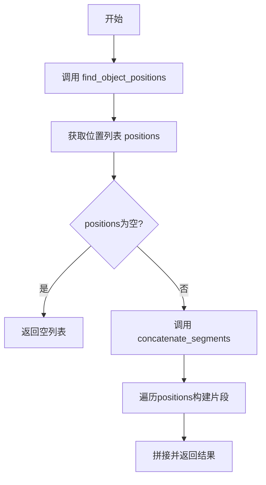
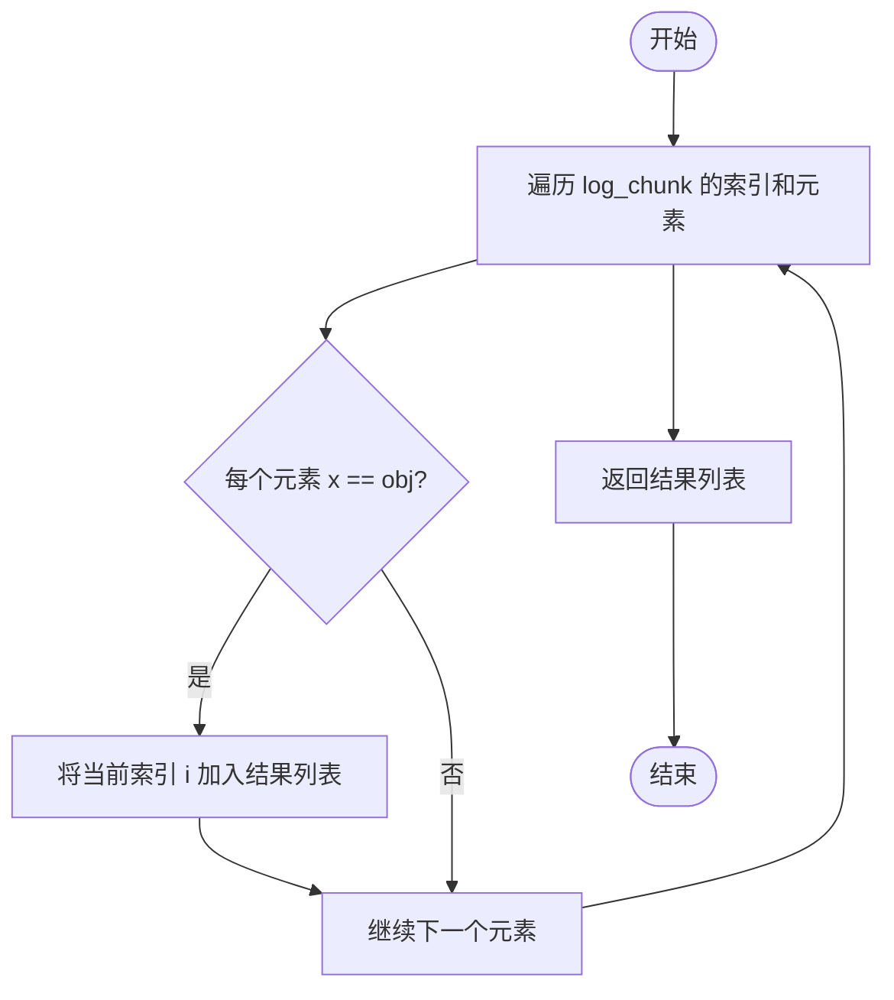
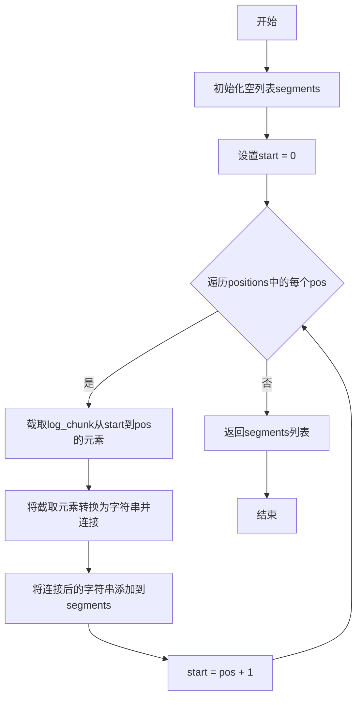

# `Langchain-Chatchat\libs\chatchat-server\langchain_chatchat\agents\output_parsers\tools_output\_utils.py` 详细设计文档

该代码提供了两个工具函数，用于日志处理场景：一个函数用于在日志块中查找特定对象实例的所有位置索引，另一个函数根据这些位置将日志块分割成多个字符串片段并拼接返回。

## 整体流程



## 类结构

```
该代码为模块级函数集合，无类层次结构
```

## 全局变量及字段


    

## 全局函数及方法


### `find_object_positions`

在日志块（列表）中查找所有与指定对象相等的元素，并返回这些元素所在位置的索引列表。

参数：
- `log_chunk`：`list`，要搜索的日志块列表，包含多个元素。
- `obj`：`任意类型`，要查找的目标对象，用于与列表中的每个元素进行相等性比较。

返回值：`list`，返回日志块中所有等于指定对象的元素的索引（索引从0开始）。

#### 流程图



#### 带注释源码

```python
def find_object_positions(log_chunk, obj):
    """
    在 log_chunk 中查找所有等于 obj 的元素的索引。
    
    参数:
        log_chunk (list): 要搜索的日志块列表。
        obj (任意类型): 要匹配的对象。
    
    返回:
        list: 包含所有匹配元素索引的列表。
    """
    # 使用 enumerate 遍历 log_chunk，返回索引 i 和元素 x
    # 列表推导式筛选出所有 x == obj 的索引 i
    return [i for i, x in enumerate(log_chunk) if x == obj]
```


### `concatenate_segments`

该函数根据给定的位置索引列表，将日志块（log_chunk）分割成多个字符串片段，并返回这些片段组成的列表。函数通过遍历位置索引，在每个位置处截断日志块生成子字符串，最后返回所有片段的集合。

参数：

- `log_chunk`：`list`，日志块列表，包含需要被分割的原始数据元素
- `positions`：`list`，位置索引列表，包含用于分割日志块的索引位置

返回值：`list`，返回分割后的字符串片段列表

#### 流程图



#### 带注释源码

```python
def concatenate_segments(log_chunk, positions):
    """
    根据位置索引将日志块分割成多个字符串片段
    
    参数:
        log_chunk: 日志块列表，包含需要被分割的原始数据
        positions: 位置索引列表，指定分割点的索引位置
    
    返回:
        分割后的字符串片段列表
    """
    segments = []          # 存储分割后的片段
    start = 0              # 初始起始位置为0
    
    # 遍历每个位置索引
    for pos in positions:
        # 从start位置截取到pos位置的所有元素
        segment = log_chunk[start:pos]
        # 将元素转换为字符串并连接成一个大字符串
        joined_segment = "".join(map(str, segment))
        # 将连接后的字符串添加到片段列表
        segments.append(joined_segment)
        # 更新起始位置为当前位置+1（跳过分割点）
        start = pos + 1
    
    # 返回所有分割后的片段列表
    return segments
```

### 关键组件信息

| 组件名称 | 描述 |
|---------|------|
| `find_object_positions` | 辅助函数，用于查找日志块中特定对象的所有位置索引 |
| `concatenate_segments` | 核心函数，根据位置索引分割日志块为字符串片段 |
| `log_chunk` | 输入数据列表，包含待处理的日志元素 |
| `positions` | 分割位置索引列表 |

### 潜在的技术债务或优化空间

1. **参数验证缺失**：函数未对输入参数进行有效性检查（如 `log_chunk` 为空、`positions` 超出范围等情况）
2. **边界条件处理**：当 `positions` 包含最后一个元素索引时，可能导致最后一个片段为空的情况未被妥善处理
3. **性能优化**：使用 `map(str, ...)` 每次调用可能产生额外开销，可考虑列表推导式替代
4. **类型提示缺失**：建议添加类型注解提高代码可读性和可维护性
5. **错误处理不足**：未处理 `positions` 包含负数或非整数的情况

### 其它项目

**设计目标与约束**：
- 该函数专注于将列表数据按索引位置分割并转换为字符串
- 假设 `positions` 已排序且不包含重复值

**错误处理与异常设计**：
- 当 `positions` 为空列表时，返回空列表
- 当 `log_chunk` 长度小于最大 `positions` 值时，可能引发索引越界

**数据流与状态机**：
- 输入：日志块列表 + 位置索引列表
- 处理：遍历位置、截取子列表、字符串转换、累积结果
- 输出：字符串片段列表

**外部依赖与接口契约**：
- 无外部依赖，仅使用 Python 内置函数
- 依赖于调用者正确传入已排序的位置索引列表


## 关键组件


### 位置查找功能 (find_object_positions)

该函数通过枚举日志块中的元素，找出与目标对象匹配的所有索引位置，返回一个位置列表。主要用于定位日志中的特定标记对象（如object()实例）的位置。

### 分段拼接功能 (concatenate_segments)

该函数根据给定的位置列表，将日志块从起始位置到每个位置之间的元素进行字符串拼接，形成多个独立的片段。主要用于将包含标记对象的日志数据分割成有意义的文本段落。

### 日志数据参数 (log_chunk)

输入的日志块，可以是任意可迭代对象列表，包含需要处理的原始数据元素。

### 目标对象参数 (obj)

要查找的特定对象，函数会比较日志块中的每个元素是否与该对象相等。

### 位置列表参数 (positions)

由find_object_positions返回的位置索引列表，定义了日志块中的分割点。

### 片段结果 (segments)

拼接后的字符串片段列表，每个片段对应两个相邻位置之间的日志内容。


## 问题及建议


### 已知问题

-   **参数未使用**：`concatenate_segments` 函数接收 `log_chunk` 参数但未在函数体中使用，该参数冗余，可能导致调用者困惑
-   **类型提示缺失**：两个函数均缺少类型注解（Type Hints），无法在静态分析阶段进行类型检查，降低了代码的可维护性
-   **文档字符串缺失**：函数没有 docstring，无法通过 `help()` 或 IDE 获取函数用途、参数说明和返回值描述
-   **边界条件未处理**：`positions` 中的索引值未进行有效性验证，若索引超出 `log_chunk` 范围会引发 `IndexError` 异常
-   **空输入未处理**：当 `positions` 为空列表时，`concatenate_segments` 返回空列表，未明确这是预期行为还是潜在问题

### 优化建议

-   **移除冗余参数**：如果 `concatenate_segments` 不需要 `log_chunk`，考虑移除该参数以保持接口简洁；或者重新审视函数设计，确认是否应使用该参数
-   **添加类型注解**：为两个函数添加类型提示，例如：
  ```python
  def find_object_positions(log_chunk: list, obj: object) -> list[int]: ...
  def concatenate_segments(log_chunk: list, positions: list[int]) -> list[str]: ...
  ```
-   **添加文档字符串**：为每个函数编写 docstring，说明功能、参数和返回值
-   **添加边界检查**：在 `concatenate_segments` 中添加索引范围验证，防止越界访问
-   **优化字符串拼接**：使用列表推导式或 `join` 方法直接拼接，减少中间字符串对象的创建，提升性能

## 其它


### 设计目标与约束

本代码的设计目标是在日志块（log_chunk）中定位特定对象（obj）的所有索引位置，并根据这些位置信息将日志块分割成多个字符串片段。主要约束包括：1）输入的log_chunk应为列表类型；2）obj对象需要支持相等性比较；3）函数应能处理空列表和未找到目标对象的情况。

### 错误处理与异常设计

代码缺乏显式的错误处理机制。需要增加的异常处理包括：1）当log_chunk不是可迭代对象时抛出TypeError；2）当positions列表包含无效索引时抛出IndexError；3）当obj为None时的处理逻辑；4）空列表输入的边界情况处理。建议添加输入验证函数并为每种异常情况提供明确的错误信息。

### 数据流与状态机

数据流如下：输入（log_chunk, obj）→ find_object_positions处理 → 输出positions列表 → concatenate_segments处理 → 输出segments列表。状态机逻辑：初始状态start=0，遍历positions列表，每次迭代将log_chunk[start:pos]范围内的元素拼接为字符串，然后更新start=pos+1，直到遍历完成。

### 外部依赖与接口契约

本代码无外部依赖，仅使用Python内置函数。接口契约：find_object_positions接收list类型的log_chunk和任意类型的obj，返回list类型的索引列表；concatenate_segments接收list类型的log_chunk和list类型的positions，返回list类型的字符串片段列表。建议添加函数文档字符串（docstring）明确接口规范。

### 性能考虑

当前实现使用列表推导式和map函数，性能尚可。潜在优化：1）对于大型log_chunk，考虑使用生成器替代列表；2）concatenate_segments中的字符串拼接可考虑使用join的优化形式；3）如需频繁调用，可考虑缓存positions结果；4）可添加可选参数控制是否返回空片段。

### 安全性考虑

代码本身无明显安全风险，因其仅为数据处理函数。需注意：1）如果log_chunk包含敏感信息，处理后的segments也可能包含敏感数据；2）obj参数的对象比较使用==运算符，需确保obj实现了正确的__eq__方法；3）建议在文档中明确说明数据处理过程中的信息安全责任。

### 可测试性设计

建议增加单元测试覆盖：1）基本功能测试（正常输入）；2）空列表测试；3）未找到目标对象的测试；4）单个对象位置的测试；5）连续对象位置的测试；6）边界位置（首尾）测试；7）类型错误输入测试。可使用pytest框架编写测试用例，建议添加assert语句验证返回值的正确性。

### 配置管理

当前代码无配置参数，如需扩展可考虑：1）添加可选的分割符参数（当前固定为空字符串）；2）添加是否去除空片段的选项；3）添加是否保留原始类型（不转换为字符串）的选项。建议使用函数默认参数或配置类的方式管理这些选项。

### 版本兼容性

代码使用Python 3语法（列表推导式、map函数），兼容Python 3.6+版本。建议：1）添加类型提示（type hints）以提高代码可读性和IDE支持；2）如需兼容Python 2，需将列表推导式改为生成器表达式或map对象；3）考虑使用typing模块的List类型标注。

### 使用示例与调用模式

典型调用模式：首先调用find_object_positions获取位置列表，然后将结果传递给concatenate_segments。示例代码：positions = find_object_positions(log_chunk, object())；segments = concatenate_segments(log_chunk, positions)。建议在文档中提供完整的调用示例和使用场景说明。


    