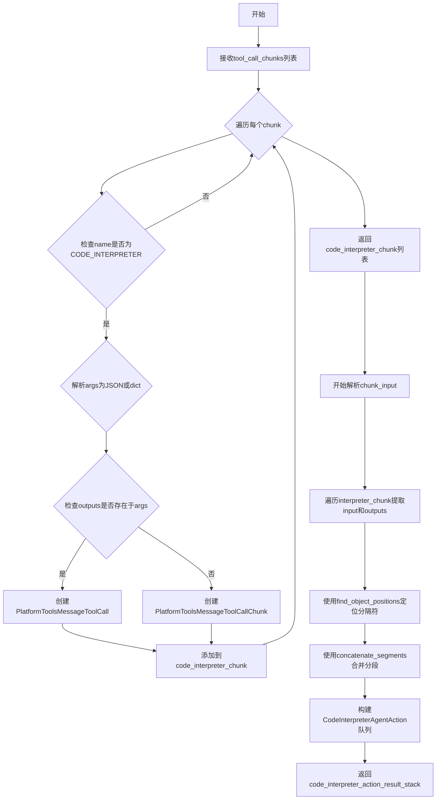
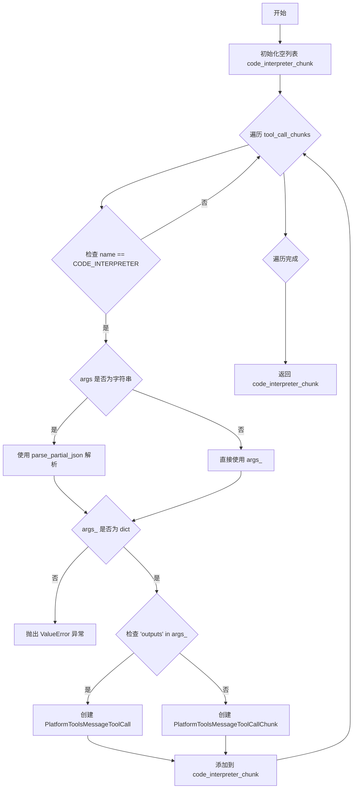

# `Langchain-Chatchat\libs\chatchat-server\langchain_chatchat\agents\output_parsers\tools_output\code_interpreter.py` 详细设计文档

该代码是一个代码解释器（Code Interpreter）的工具调用解析器，负责解析和转换LangChain代理产生的代码解释器工具调用，将其转换为结构化的AgentAction对象，包含工具输入、执行输出和日志信息。

## 整体流程



## 类结构

```
CodeInterpreterAgentAction (继承ToolAgentAction)
├── fields: outputs, platform_params
└── methods: (继承父类)

全局函数:
├── _best_effort_parse_code_interpreter_tool_calls
└── _paser_code_interpreter_chunk_input
```

## 全局变量及字段


### `logger`
    
模块级日志记录器，用于记录代码解析过程中的错误和调试信息

类型：`logging.Logger`
    


### `CodeInterpreterAgentAction.outputs`
    
工具调用的输出结果，包含代码解释器执行后的返回数据

类型：`List[Union[str, dict]]`
    


### `CodeInterpreterAgentAction.platform_params`
    
平台参数字典，用于传递平台特定的配置或上下文信息

类型：`dict`
    
    

## 全局函数及方法


### `_best_effort_parse_code_interpreter_tool_calls`

该函数是一个最佳努力（best-effort）解析器，用于解析工具调用块（tool_call_chunks）列表，筛选出 CODE_INTERPRETER 类型的工具调用，并根据参数中是否包含 `outputs` 字段来返回 `PlatformToolsMessageToolCall` 或 `PlatformToolsMessageToolCallChunk` 对象。

参数：

- `tool_call_chunks`：`List[dict]`，待解析的工具调用块列表，每个字典包含 `name`、`args`、`id` 等字段

返回值：`List[Union[PlatformToolsMessageToolCall, PlatformToolsMessageToolCallChunk]]`，解析后的工具调用对象列表，若包含 `outputs` 则返回完整调用，否则返回分块调用

#### 流程图



#### 带注释源码

```python
def _best_effort_parse_code_interpreter_tool_calls(
    tool_call_chunks: List[dict],
) -> List[Union[PlatformToolsMessageToolCall, PlatformToolsMessageToolCallChunk]]:
    # 初始化用于存储解析后的 Code Interpreter 工具调用结果列表
    code_interpreter_chunk: List[
        Union[PlatformToolsMessageToolCall, PlatformToolsMessageToolCallChunk]
    ] = []
    # Best-effort parsing allready parsed tool calls
    # 遍历所有工具调用块，筛选并解析 CODE_INTERPRETER 类型的调用
    for code_interpreter in tool_call_chunks:
        # 判断当前工具调用是否为 Code Interpreter 类型
        if AdapterAllToolStructType.CODE_INTERPRETER == code_interpreter["name"]:
            # 如果 args 是字符串格式（JSON 字符串），则尝试解析为 JSON 对象
            if isinstance(code_interpreter["args"], str):
                args_ = parse_partial_json(code_interpreter["args"])
            else:
                # 否则直接使用（应为字典类型）
                args_ = code_interpreter["args"]
            # 校验解析后的 args 是否为字典类型
            if not isinstance(args_, dict):
                raise ValueError("Malformed args.")

            # 根据 args 中是否包含 outputs 字段，决定创建完整调用还是分块调用
            if "outputs" in args_:
                # 包含执行结果，创建完整的 PlatformToolsMessageToolCall 对象
                code_interpreter_chunk.append(
                    PlatformToolsMessageToolCall(
                        name=code_interpreter["name"],
                        args=args_,
                        id=code_interpreter["id"],
                    )
                )
            else:
                # 仅包含输入参数，创建分块调用对象 PlatformToolsMessageToolCallChunk
                # 可能包含 index 字段用于标识顺序
                code_interpreter_chunk.append(
                    PlatformToolsMessageToolCallChunk(
                        name=code_interpreter["name"],
                        args=args_,
                        id=code_interpreter["id"],
                        index=code_interpreter.get("index"),
                    )
                )

    # 返回解析后的 Code Interpreter 工具调用列表
    return code_interpreter_chunk
```


### `_paser_code_interpreter_chunk_input`

该函数负责解析 Code Interpreter 工具调用的块输入，从消息中提取输入日志和输出日志，通过分段拼接的方式构建 CodeInterpreterAgentAction 序列，并返回一个包含所有动作的 Deque 队列。

参数：

-  `message`：`BaseMessage`，原始消息对象，用于构建 message_log
-  `code_interpreter_chunk`：`List[Union[PlatformToolsMessageToolCall, PlatformToolsMessageToolCallChunk]]`，Code Interpreter 工具调用块列表

返回值：`Deque[CodeInterpreterAgentAction]`，解析后生成的 Code Interpreter 代理动作队列

#### 流程图

```mermaid
flowchart TD
    A[开始解析 code_interpreter_chunk] --> B[初始化 input_log_chunk 和 outputs 列表]
    B --> C{遍历 interpreter_chunk}
    C -->|提取 input| D[将 input 添加到 input_log_chunk]
    C -->|提取 outputs| E[将 object() 添加到 input_log_chunk 并保存 outputs]
    C --> F{检查 input_log_chunk 末尾是否为 object}
    F -->|否| G[在末尾添加 object 标记]
    F -->|是| H[跳过]
    G --> I[调用 find_object_positions 找位置]
    H --> I
    I --> J[调用 concatenate_segments 拼接片段]
    J --> K[获取 tool_call_id]
    K --> L{遍历 result_actions}
    L -->|outputs 数量不足| M[在对应位置插入空列表]
    L -->|正常| N[提取 logs 并拼接为字符串]
    N --> O[创建 CodeInterpreterAgentAction]
    O --> P[添加到 deque 队列]
    P --> Q{是否还有 action}
    Q -->|是| L
    Q -->|否| R[返回 deque 队列]
    
    style A fill:#f9f,color:#000
    style R fill:#9f9,color:#000
    style Q fill:#ff9,color:#000
```

#### 带注释源码

```python
def _paser_code_interpreter_chunk_input(
    message: BaseMessage,
    code_interpreter_chunk: List[
        Union[PlatformToolsMessageToolCall, PlatformToolsMessageToolCallChunk]
    ],
) -> Deque[CodeInterpreterAgentAction]:
    """
    解析 code_interpreter_chunk，返回包含 CodeInterpreterAgentAction 的 Deque 队列
    
    参数:
        message: 原始消息对象
        code_interpreter_chunk: Code Interpreter 工具调用块列表
        
    返回:
        包含解析后动作的 Deque 队列
    """
    try:
        # 初始化输入日志块列表，用于存储所有的输入和输出标记
        input_log_chunk = []

        # 存储所有的输出结果
        outputs: List[List[dict]] = []
        # 使用 object() 作为输入和输出之间的分界标记
        obj = object()
        
        # 遍历每个 interpreter chunk，提取 input 和 outputs
        for interpreter_chunk in code_interpreter_chunk:
            interpreter_chunk_args = interpreter_chunk.args

            # 如果存在 input 字段，将其添加到 input_log_chunk
            if "input" in interpreter_chunk_args:
                input_log_chunk.append(interpreter_chunk_args["input"])
            
            # 如果存在 outputs 字段，添加分界标记并保存 outputs
            if "outputs" in interpreter_chunk_args:
                input_log_chunk.append(obj)  # 标记输入结束
                outputs.append(interpreter_chunk_args["outputs"])

        # 如果最后一个元素不是分界标记，添加分界标记
        if input_log_chunk[-1] is not obj:
            input_log_chunk.append(obj)
        
        # 根据分界标记的位置分割列表，然后将每个片段连接成字符串
        # 找到 object() 实例的位置
        positions = find_object_positions(input_log_chunk, obj)

        # 连接分段
        result_actions = concatenate_segments(input_log_chunk, positions)

        # 获取工具调用 ID，如果不存在则使用默认值 "abc"
        tool_call_id = (
            code_interpreter_chunk[0].id if code_interpreter_chunk[0].id else "abc"
        )
        
        # 初始化结果队列
        code_interpreter_action_result_stack: Deque[
            CodeInterpreterAgentAction
        ] = deque()
        
        # 遍历每个动作，为其创建 CodeInterpreterAgentAction
        for i, action in enumerate(result_actions):
            # 如果动作数量多于输出数量，在对应位置插入空列表
            if len(result_actions) > len(outputs):
                outputs.insert(i, [])

            # 从输出中提取 logs 字段
            out_logs = [logs["logs"] for logs in outputs[i] if "logs" in logs]
            # 将 logs 连接成字符串
            out_str = "\n".join(out_logs)
            # 组合动作和输出日志
            log = f"{action}\r\n{out_str}"
            
            # 创建 CodeInterpreterAgentAction 对象
            code_interpreter_action = CodeInterpreterAgentAction(
                tool=AdapterAllToolStructType.CODE_INTERPRETER,  # 工具类型
                tool_input=action,  # 工具输入
                outputs=outputs[i],  # 工具输出
                log=log,  # 组合日志
                message_log=[message],  # 消息日志
                tool_call_id=tool_call_id,  # 工具调用 ID
            )

            # 将动作添加到队列
            code_interpreter_action_result_stack.append(code_interpreter_action)
        
        return code_interpreter_action_result_stack

    except Exception as e:
        # 记录错误日志并抛出解析异常
        logger.error(f"Error parsing code_interpreter_chunk: {e}", exc_info=True)
        raise OutputParserException(
            f"Could not parse tool input: code_interpreter because {e}"
        )
```

---

### 关键组件信息

| 名称 | 一句话描述 |
|------|-----------|
| `CodeInterpreterAgentAction` | 继承自 ToolAgentAction 的工具调用动作类，包含 outputs 和 platform_params 额外字段 |
| `PlatformToolsMessageToolCall` | 平台工具消息调用完整对象 |
| `PlatformToolsMessageToolCallChunk` | 平台工具消息调用块对象（可能未完成） |
| `find_object_positions` | 查找列表中特定对象位置的辅助函数 |
| `concatenate_segments` | 根据位置分割列表并将各片段连接成字符串的辅助函数 |
| `AdapterAllToolStructType.CODE_INTERPRETER` | Code Interpreter 工具类型枚举值 |

---

### 潜在的技术债务或优化空间

1. **异常处理过于宽泛**：使用 `except Exception` 捕获所有异常并重新抛出，虽然记录了日志，但可能掩盖了具体的编程错误类型，建议区分不同异常类型进行针对性处理。

2. **硬编码默认值**：`tool_call_id` 默认值为 `"abc"`，这是一个魔数（Magic Number），缺乏明确的语义，建议抽取为常量或配置项。

3. **类型注解可以更精确**：`outputs` 变量类型声明为 `List[List[dict]]`，但实际使用中假设了字典结构，建议定义明确的数据模型类。

4. **函数名称拼写错误**：函数名 `_paser_code_interpreter_chunk_input` 中 "paser" 应为 "parser"，这是一个技术债务。

5. **缺乏输入验证**：函数未对输入参数进行充分验证，例如 `code_interpreter_chunk` 为空列表时可能导致索引越界。

---

### 其它项目

#### 设计目标与约束

- **设计目标**：将 LangChain 的 Code Interpreter 工具调用块解析为标准化的 AgentAction 格式，便于后续代理引擎处理
- **约束条件**：依赖 `AdapterAllToolStructType.CODE_INTERPRETER` 枚举值进行工具类型匹配，输出格式需符合 `CodeInterpreterAgentAction` 定义

#### 错误处理与异常设计

- 函数外层使用 try-except 捕获所有异常，记录完整堆栈信息后抛出 `OutputParserException`
- 内部对 `args_` 进行类型检查，确保为字典类型
- `find_object_positions` 和 `concatenate_segments` 函数的异常未在本层捕获，可能向上传播

#### 数据流与状态机

1. **输入状态**：接收原始消息和解析后的 tool call 块
2. **处理状态**：提取 input/outputs → 分段标记 → 片段拼接 → 构建动作对象
3. **输出状态**：返回包含多个 CodeInterpreterAgentAction 的 Deque 队列

#### 外部依赖与接口契约

- **输入依赖**：
  - `message`: 来自 LangChain 的 BaseMessage
  - `code_interpreter_chunk`: 来自 `_best_effort_parse_code_interpreter_tool_calls` 函数
- **输出依赖**：返回的 Deque 被下游的代理执行器消费
- **关键依赖**：
  - `find_object_positions` 和 `concatenate_segments`：来自 `_utils` 模块的列表处理工具函数
  - `AdapterAllToolStructType`：工具类型枚举定义

## 关键组件


### CodeInterpreterAgentAction 类

继承自 ToolAgentAction 的自定义代理动作类，用于表示代码解释器的执行结果，包含额外的 outputs 字段存储工具输出和 platform_params 字段存储平台参数。

### _best_effort_parse_code_interpreter_tool_calls 函数

负责解析 CODE_INTERPRETER 类型的工具调用，将原始的工具调用块转换为 PlatformToolsMessageToolCall 或 PlatformToolsMessageToolCallChunk 对象，支持部分 JSON 解析和异常处理。

### _paser_code_interpreter_chunk_input 函数

核心解析函数，负责将代码解释器的输入日志和输出日志进行分段、合并处理，生成 CodeInterpreterAgentAction 对象队列，使用 object() 作为分隔标记来区分输入和输出。

### find_object_positions 函数

从外部导入的工具函数，用于在列表中查找特定对象（如 object() 实例）的位置索引，用于后续的列表分段处理。

### concatenate_segments 函数

从外部导入的工具函数，根据位置索引将列表分割成多个片段，然后将每个片段拼接成字符串，用于组合输入日志和输出日志。

### PlatformToolsMessageToolCall 和 PlatformToolsMessageToolCallChunk 类

从外部导入的基类，分别表示完整的工具调用消息和工具调用块（包含 index 字段用于流式处理）。

### AdapterAllToolStructType.CODE_INTERPRETER

枚举值，用于标识代码解释器工具的类型，作为工具名称匹配和类型判断的依据。


## 问题及建议


### 已知问题

-   **函数名拼写错误**：函数名 `_paser_code_interpreter_chunk_input` 中的 `paser` 应为 `parser`，存在拼写错误。
-   **类型注解不规范**：`CodeInterpreterAgentAction` 类中 `outputs` 和 `platform_params` 字段的默认值 `= None` 与类型注解 `List[Union[str, dict]]` 和 `dict` 不匹配，应使用 `| None` 或 `Optional` 进行标注（如 `outputs: List[Union[str, dict]] | None = None`）。
-   **边界检查缺失**：代码中多处直接访问列表索引（如 `code_interpreter_chunk[0]`、`input_log_chunk[-1]`），未进行空列表检查，可能导致 `IndexError`。
-   **硬编码默认值**：`tool_call_id` 在缺失时使用硬编码字符串 `"abc"` 作为默认值，缺乏实际意义且可能导致追踪困难。
-   **异常信息丢失**：捕获异常后抛出新异常时，原始异常堆栈信息可能丢失，不利于调试。
-   **魔法对象使用**：`obj = object()` 作为分隔标记使用语义不明确，可读性较差，建议使用具有明确语义的常量或枚举。
-   **变量命名混淆**：`interpreter_chunk` 与 `code_interpreter_chunk` 命名相似度过高，容易造成理解和维护上的混淆。

### 优化建议

-   修正函数名拼写，将 `_paser_code_interpreter_chunk_input` 改为 `_parser_code_interpreter_chunk_input`。
-   修正类型注解，使用 `outputs: List[Union[str, dict]] | None = None` 和 `platform_params: dict | None = None`。
-   在访问列表元素前添加边界检查，如 `if code_interpreter_chunk:` 和 `if input_log_chunk:`。
-   移除硬编码的 `"abc"`，改为返回 `None` 或抛出更明确的异常。
-   在异常处理时保留原始异常信息，可使用 `raise ... from e` 语法。
-   使用明确的常量或类属性替代 `object()` 作为分隔标记，提高代码可读性。
-   重构变量命名，如将 `interpreter_chunk` 改为 `chunk_item` 以避免混淆。

## 其它


### 设计目标与约束

本模块的核心设计目标是解析和转换Code Interpreter工具调用结果为标准化的Agent Action格式，支持流式处理（chunk）和完整的工具调用两种模式。设计约束包括：1）必须兼容langchain的ToolAgentAction基类；2）依赖langchain_core的异常体系；3）输出格式需适配PlatformToolsMessageToolCall类；4）仅处理CODE_INTERPRETER类型的工具调用，不处理其他工具。

### 错误处理与异常设计

主要异常处理机制包括：1）在`_best_effort_parse_code_interpreter_tool_calls`中，当args不是dict类型时抛出ValueError("Malformed args.")；2）在`_paser_code_interpreter_chunk_input`中使用try-except捕获所有异常，记录错误日志后重新抛出OutputParserException；3）对于解析失败的JSON字符串，使用parse_partial_json进行最佳努力解析；4）日志记录使用logger.error带exc_info=True以保留完整堆栈信息。

### 数据流与状态机

数据流处理分为两个阶段：第一阶段`_best_effort_parse_code_interpreter_tool_calls`接收tool_call_chunks列表，筛选CODE_INTERPRETER类型，解析JSON参数，区分有outputs（完整调用）和无outputs（chunk调用）两种情况，输出PlatformToolsMessageToolCall或PlatformToolsMessageToolCallChunk列表；第二阶段`_paser_code_interpreter_chunk_input`接收BaseMessage和chunk列表，提取input和outputs字段，使用object()作为分隔符标记segments，通过concatenate_segments合并input片段，与outputs逐一对齐生成CodeInterpreterAction序列，最终输出Deque[CodeInterpreterAction]。

### 外部依赖与接口契约

关键外部依赖包括：1）langchain.agents.output_parsers.tools中的ToolAgentAction基类；2）langchain_core.exceptions中的OutputParserException；3）langchain_core.messages中的BaseMessage；4）langchain_core.utils.json中的parse_partial_json；5）自定义的AdapterAllToolStructType枚举和PlatformToolsMessageToolCall/ToolCallChunk类；6）自定义的concatenate_segments和find_object_positions工具函数。接口契约要求tool_call_chunks中每项需包含name、args、id字段，args可以是字符串或字典，chunk模式需包含index字段。

### 性能考虑与优化点

性能优化考虑：1）使用deque而非list作为返回类型以支持高效的头部操作；2）parse_partial_json采用最佳努力解析避免完全失败；3）outputs列表通过索引直接访问而非遍历；4）日志字符串使用f-string一次性拼接而非多次字符串操作。潜在优化点：当处理大量chunk时，可以考虑批量处理减少循环开销；可以添加缓存机制避免重复解析相同内容。

### 安全考虑

安全相关设计：1）代码解释器输入（tool_input）直接来自模型输出，需依赖上游的沙箱执行环境保证安全；2）outputs字段包含执行日志，可能包含敏感信息，需在下游处理中注意保密；3）工具调用ID使用可选值，默认填充"abc"为占位符，实际使用中应确保ID唯一性；4）parse_partial_json可能解析任意JSON，需评估其对恶意输入的容忍度。

### 使用示例

典型使用场景：首先调用`_best_effort_parse_code_interpreter_tool_calls`解析模型输出的tool_calls得到标准化工具调用对象列表，然后判断是否存在outputs区分完整调用与chunk调用，对于chunk调用可进一步调用`_paser_code_interpreter_chunk_input`将多个chunk合并为连续的AgentAction序列，最终结果可传递给后续的Agent处理流程。

    