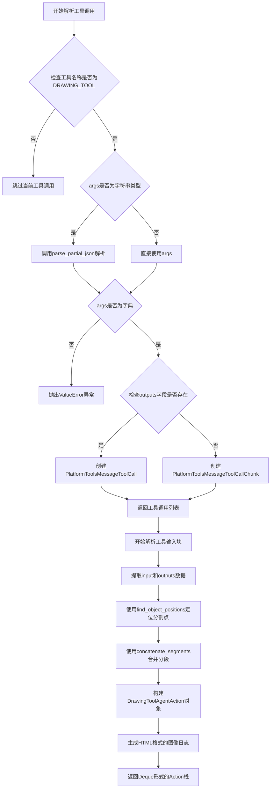
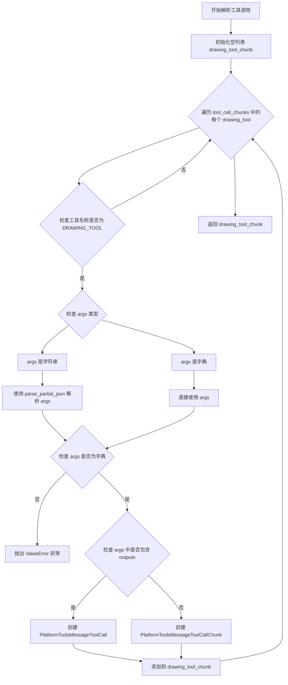
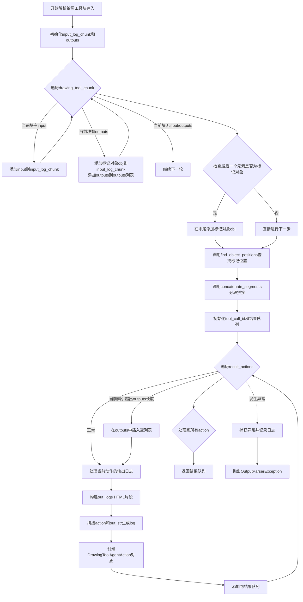

# `Langchain-Chatchat\libs\chatchat-server\langchain_chatchat\agents\output_parsers\tools_output\drawing_tool.py` 详细设计文档

该模块是LangChain Chatchat的输出解析器，专门用于解析和转换绘图工具(Drawing Tool)的调用结果，将工具输出转换为可处理的Agent Action对象，支持部分JSON解析和图像日志生成

## 整体流程



## 类结构

```
ToolAgentAction (langchain.agents.output_parsers.tools)
└── DrawingToolAgentAction (自定义扩展类)
    ├── outputs: List[Union[str, dict]]
    └── platform_params: dict
```

## 全局变量及字段


### `logger`
    
模块级日志记录器，采用__name__命名空间

类型：`logging.Logger`
    


### `drawing_tool_chunk`
    
存储解析后的绘图工具调用块列表

类型：`List[Union[PlatformToolsMessageToolCall, PlatformToolsMessageToolCallChunk]]`
    


### `input_log_chunk`
    
存储从工具参数中提取的输入日志片段

类型：`list`
    


### `outputs`
    
存储工具执行输出的二维列表

类型：`List[List[dict]]`
    


### `obj`
    
用于标记输入日志中输出位置的哨兵对象

类型：`object`
    


### `positions`
    
存储需要分割的位置索引列表

类型：`list`
    


### `result_actions`
    
存储合并后的操作字符串列表

类型：`list`
    


### `tool_call_id`
    
工具调用的唯一标识符

类型：`str`
    


### `drawing_tool_action_result_stack`
    
最终的Action对象双端队列

类型：`Deque[DrawingToolAgentAction]`
    


### `out_logs`
    
HTML格式的图像日志列表

类型：`list`
    


### `out_str`
    
拼接后的日志字符串

类型：`str`
    


### `log`
    
最终的完整日志字符串

类型：`str`
    


### `DrawingToolAgentAction.outputs`
    
工具调用的输出结果

类型：`List[Union[str, dict]] = None`
    


### `DrawingToolAgentAction.platform_params`
    
平台参数配置

类型：`dict = None`
    
    

## 全局函数及方法


### `_best_effort_parse_drawing_tool_tool_calls`

尝试解析绘图工具调用列表，对每个工具调用进行类型检查和JSON解析，根据是否包含outputs字段分别返回PlatformToolsMessageToolCall或PlatformToolsMessageToolCallChunk列表。

参数：

- `tool_call_chunks`：`List[dict]`，工具调用块列表，每个元素包含name、args、id等字段

返回值：`List[Union[PlatformToolsMessageToolCall, PlatformToolsMessageToolCallChunk]]`，解析后的平台工具消息调用或平台工具消息调用块列表

#### 流程图



#### 带注释源码

```python
def _best_effort_parse_drawing_tool_tool_calls(
    tool_call_chunks: List[dict],
) -> List[Union[PlatformToolsMessageToolCall, PlatformToolsMessageToolCallChunk]]:
    """
    最佳努力解析绘图工具调用列表
    
    参数:
        tool_call_chunks: 工具调用块列表，每个元素包含name、args、id等字段
        
    返回:
        解析后的平台工具消息调用或平台工具消息调用块列表
    """
    
    # 初始化存储解析结果的列表
    drawing_tool_chunk: List[
        Union[PlatformToolsMessageToolCall, PlatformToolsMessageToolCallChunk]
    ] = []
    
    # 遍历所有工具调用块
    for drawing_tool in tool_call_chunks:
        # 判断是否为绘图工具类型
        if AdapterAllToolStructType.DRAWING_TOOL == drawing_tool["name"]:
            
            # 解析参数：如果是字符串则尝试解析为JSON，否则直接使用
            if isinstance(drawing_tool["args"], str):
                args_ = parse_partial_json(drawing_tool["args"])
            else:
                args_ = drawing_tool["args"]
            
            # 验证参数必须是字典类型
            if not isinstance(args_, dict):
                raise ValueError("Malformed args.")

            # 根据是否包含outputs字段决定创建完整调用还是分块
            if "outputs" in args_:
                # 创建完整的工具消息调用（包含输出结果）
                drawing_tool_chunk.append(
                    PlatformToolsMessageToolCall(
                        name=drawing_tool["name"],
                        args=args_,
                        id=drawing_tool["id"],
                    )
                )
            else:
                # 创建工具消息调用分块（不包含输出结果）
                drawing_tool_chunk.append(
                    PlatformToolsMessageToolCallChunk(
                        name=drawing_tool["name"],
                        args=args_,
                        id=drawing_tool["id"],
                        index=drawing_tool.get("index"),
                    )
                )

    return drawing_tool_chunk
```

#### 关键组件信息

| 组件名称 | 描述 |
|---------|------|
| `AdapterAllToolStructType.DRAWING_TOOL` | 枚举类型，用于标识绘图工具的类型 |
| `parse_partial_json` | langchain_core.utils.json模块中的函数，用于解析部分JSON字符串 |
| `PlatformToolsMessageToolCall` | 平台工具消息调用完整对象，包含name、args、id字段 |
| `PlatformToolsMessageToolCallChunk` | 平台工具消息调用分块对象，包含name、args、id、index字段 |

#### 潜在的技术债务或优化空间

1. **缺少参数验证**：函数未对`tool_call_chunks`的基本结构（如是否存在"name"、"args"、"id"字段）进行验证，可能导致KeyError异常
2. **异常处理不足**：如果解析过程中出现其他异常情况（如index字段缺失），函数会直接抛出原始异常而非友好的错误提示
3. **硬编码索引获取**：`drawing_tool_chunk[0].id`的获取方式假设列表非空且第一个元素有id字段，缺乏防御性编程
4. **最佳努力解析的边界**：函数名为"best_effort"但实际只处理DRAWING_TOOL类型，对于其他工具类型直接忽略，这种隐式行为可能导致调试困难

#### 其它项目

**设计目标与约束**：
- 该函数是LangChain Agent输出解析器的一部分，用于处理特定类型的工具调用
- 仅处理`AdapterAllToolStructType.DRAWING_TOOL`类型的工具调用，忽略其他类型
- 使用"最佳努力"策略，尽可能解析而不严格要求完全符合预期格式

**错误处理与异常设计**：
- 当args解析后不是字典类型时，抛出`ValueError("Malformed args.")`
- 异常信息较为简洁，可能需要增强以帮助调试

**数据流与状态机**：
- 输入：原始工具调用块列表（可能包含多个工具调用）
- 处理流程：遍历→过滤→解析→转换→分类
- 输出：分类后的工具调用对象列表（完整调用或分块）

**外部依赖与接口契约**：
- 依赖`langchain_core.utils.json.parse_partial_json`进行JSON解析
- 依赖`AdapterAllToolStructType`枚举进行类型判断
- 返回类型为`Union[PlatformToolsMessageToolCall, PlatformToolsMessageToolCallChunk]`，调用方需处理这两种类型


### `_paser_drawing_tool_chunk_input`

解析绘图工具块的输入数据，从消息和工具调用块中提取input和outputs，使用分段拼接方式生成DrawingToolAgentAction对象队列。

参数：

- `message`：`BaseMessage`，原始消息对象，包含上下文信息
- `drawing_tool_chunk`：`List[Union[PlatformToolsMessageToolCall, PlatformToolsMessageToolCallChunk]]`，绘图工具调用块列表，包含多个工具调用的参数和元数据

返回值：`Deque[DrawingToolAgentAction]`，绘图工具代理动作的队列，每个元素包含工具名、工具输入、输出、日志和消息历史

#### 流程图



#### 带注释源码

```python
def _paser_drawing_tool_chunk_input(
    message: BaseMessage,
    drawing_tool_chunk: List[
        Union[PlatformToolsMessageToolCall, PlatformToolsMessageToolCallChunk]
    ],
) -> Deque[DrawingToolAgentAction]:
    """
    解析绘图工具块的输入数据，从消息和工具调用块中提取input和outputs，
    使用分段拼接方式生成DrawingToolAgentAction对象队列
    
    参数:
        message: BaseMessage - 原始消息对象，用于构建message_log
        drawing_tool_chunk: List[Union[PlatformToolsMessageToolCall, PlatformToolsMessageToolCallChunk]] 
                          - 绘图工具调用块列表
    
    返回:
        Deque[DrawingToolAgentAction] - 绘图工具代理动作的队列
    """
    try:
        # 初始化输入日志片段列表，用于收集所有input字段
        input_log_chunk = []
        
        # 初始化输出列表，用于收集所有outputs字段
        outputs: List[List[dict]] = []
        # 标记对象，用于标识outputs在input_log_chunk中的位置边界
        obj = object()
        
        # 遍历每个绘图工具调用块，提取input和outputs
        for interpreter_chunk in drawing_tool_chunk:
            interpreter_chunk_args = interpreter_chunk.args
            
            # 如果存在input字段，添加到input_log_chunk
            if "input" in interpreter_chunk_args:
                input_log_chunk.append(interpreter_chunk_args["input"])
            
            # 如果存在outputs字段，添加标记对象并记录outputs
            if "outputs" in interpreter_chunk_args:
                input_log_chunk.append(obj)  # 添加边界标记
                outputs.append(interpreter_chunk_args["outputs"])
        
        # 确保最后一个元素是标记对象，作为结束边界
        if input_log_chunk[-1] is not obj:
            input_log_chunk.append(obj)
            
        # 根据标记对象的位置，对input_log_chunk进行分段
        # 找到所有object()实例的位置
        positions = find_object_positions(input_log_chunk, obj)
        
        # 拼接每个分段，形成完整的action字符串列表
        result_actions = concatenate_segments(input_log_chunk, positions)
        
        # 获取工具调用ID，如果为空则使用默认值"abc"
        tool_call_id = drawing_tool_chunk[0].id if drawing_tool_chunk[0].id else "abc"
        
        # 初始化结果队列
        drawing_tool_action_result_stack: Deque[DrawingToolAgentAction] = deque()
        
        # 为每个action创建DrawingToolAgentAction对象
        for i, action in enumerate(result_actions):
            # 如果actions数量多于outputs数量，在对应位置插入空列表
            if len(result_actions) > len(outputs):
                outputs.insert(i, [])
            
            # 从outputs中提取image字段，生成HTML img标签
            out_logs = [
                f''
                for logs in outputs[i]
                if "image" in logs
            ]
            
            # 将所有图片日志连接成字符串
            out_str = "\n".join(out_logs)
            
            # 组合action和输出日志形成完整日志
            log = f"{action}\r\n{out_str}"
            
            # 创建DrawingToolAgentAction对象
            drawing_tool_action = DrawingToolAgentAction(
                tool=AdapterAllToolStructType.DRAWING_TOOL,
                tool_input=action,
                outputs=outputs[i],
                log=log,
                message_log=[message],
                tool_call_id=tool_call_id,
            )
            
            # 添加到结果队列
            drawing_tool_action_result_stack.append(drawing_tool_action)
            
        return drawing_tool_action_result_stack

    except Exception as e:
        # 捕获异常并记录详细错误信息
        logger.error(f"Error parsing drawing_tool_chunk: {e}", exc_info=True)
        raise OutputParserException(
            f"Could not parse tool input: drawing_tool because  {e}"
        )
```

## 关键组件


### DrawingToolAgentAction

继承自ToolAgentAction的绘图工具代理动作类，用于表示绘图工具的执行动作，包含工具名称、工具输入、输出结果、日志和消息日志等字段。

### _best_effort_parse_drawing_tool_tool_calls

尽力解析已解析的工具调用，识别DRAWING_TOOL类型的工具调用，通过parse_partial_json支持部分JSON解析，根据是否有outputs字段返回PlatformToolsMessageToolCall或PlatformToolsMessageToolCallChunk实例。

### _paser_drawing_tool_chunk_input

解析绘图工具块输入的核心函数，将工具调用块转换为DrawingToolAgentAction队列，使用find_object_positions定位分割点，通过concatenate_segments拼接片段，支持图像日志生成和输出与输入的对应匹配。

### PlatformToolsMessageToolCall / PlatformToolsMessageToolCallChunk

平台工具消息调用类及块类，用于表示工具调用的结构化数据，包含name、args、id字段，Chunk版本额外包含index字段支持流式处理中的索引定位，实现惰性加载和增量解析。

### 图像日志生成逻辑

从outputs中提取image字段，生成HTML img标签格式的日志字符串，支持在日志中嵌入图像预览，宽度固定为300像素。

### 异常处理机制

捕获解析过程中的异常，记录错误日志并抛出OutputParserException，提供友好的错误信息描述。


## 问题及建议


### 已知问题

- **类型注解不完整**：`outputs` 和 `platform_params` 字段使用 `= None` 作为默认值，但类型注解未使用 `Optional`（如 `Optional[List[Union[str, dict]]]`），会导致类型检查器警告
- **硬编码默认值**：使用 `"abc"` 作为 `tool_call_id` 的后备值，缺乏明确的业务逻辑说明，应定义为常量或使用 UUID
- **函数名拼写错误**：`_paser_drawing_tool_chunk_input` 应为 `_parser_drawing_tool_chunk_input`（paser → parser）
- **缺少空值检查**：直接访问 `drawing_tool_chunk[0]`，若输入列表为空会导致 `IndexError`
- **重复创建对象**：在循环内每次迭代都执行 `obj = object()`，应在循环外定义一次
- **异常处理过于宽泛**：捕获通用 `Exception`，建议拆分为更具体的异常类型（如 `KeyError`、`IndexError`、`ValueError`）
- **魔法字符串和数字**：`` 中的 HTML 模板和 `width="300"` 硬编码，应提取为常量或配置
- **日志输出格式耦合**：HTML 格式构建逻辑与业务逻辑混合在循环中，难以复用或修改输出格式

### 优化建议

- **修复类型注解**：将 `outputs: List[Union[str, dict]] = None` 改为 `outputs: Optional[List[Union[str, dict]]] = None`
- **修复拼写错误**：重命名函数为 `_parser_drawing_tool_chunk_input`
- **添加空值保护**：在访问 `drawing_tool_chunk[0]` 前检查 `if not drawing_tool_chunk: raise ValueError(...)`
- **提取常量**：定义 `DEFAULT_TOOL_CALL_ID = "abc"` 或使用 `uuid.uuid4().hex`，将 HTML 模板提取为 `DRAWING_IMAGE_TEMPLATE`
- **优化对象创建**：将 `obj = object()` 移至循环外，避免重复分配内存
- **细化异常处理**：分别捕获 `KeyError`、`IndexError`、`ValueError` 等具体异常，提供更有针对性的错误信息
- **解耦输出格式**：将 HTML 构建逻辑抽取为独立函数 `format_drawing_output(outputs: List[dict]) -> str`

## 其它


### 设计目标与约束

本模块旨在为LangChain聊天机器人框架提供绘图工具（Drawing Tool）的输出解析能力，将非结构化的工具调用转换为标准化的Agent Action对象。主要设计目标包括：1）支持流式输出解析，能够处理不完整的JSON片段；2）将绘图工具的输出（包含图像信息）格式化为HTML img标签；3）与LangChain的Agent系统无缝集成。约束条件包括：依赖langchain-core和langchain-chatchat内部模块，Python版本需支持类型注解。

### 错误处理与异常设计

当解析过程中出现错误时，模块采用分层异常处理策略：1）参数验证错误（如args非字典类型）抛出ValueError；2）解析过程中的通用异常被捕获并记录日志，随后抛出OutputParserException并携带原始错误信息；3）所有异常都会记录完整的堆栈信息（exc_info=True）以便调试。建议调用方捕获OutputParserException并提供用户友好的错误提示。

### 数据流与状态机

数据流主要分为两个阶段：第一阶段`_best_effort_parse_drawing_tool_tool_calls`接收原始工具调用块列表，筛选出DRAWING_TOOL类型，解析JSON参数，区分完整输出（PlatformToolsMessageToolCall）和部分输出（PlatformToolsMessageToolCallChunk）。第二阶段`_paser_drawing_tool_chunk_input`接收解析后的工具调用块，通过标记对象（object()）分割输入流和输出流，使用find_object_positions定位分割点，concatenate_segments合并输入片段，最终生成DrawingToolAgentAction队列。整个过程是单向流动的，不涉及状态回滚。

### 外部依赖与接口契约

核心依赖包括：langchain.agents.output_parsers.tools.ToolAgentAction（基类）、langchain_core.messages.BaseMessage（消息类型）、langchain_core.utils.json.parse_partial_json（JSON解析）、langchain_chatchat的AdapterAllToolStructType（工具类型枚举）、PlatformToolsMessageToolCall和PlatformToolsMessageToolCallChunk（工具调用对象）。输入契约：tool_call_chunks为包含name、args、id、index字段的字典列表；message为BaseMessage类型。输出契约：返回Deque[DrawingToolAgentAction]对象队列。

### 性能考虑

当前实现采用朴素算法，潜在性能瓶颈包括：1）find_object_positions和concatenate_segments可能因列表遍历导致O(n)复杂度；2）parse_partial_json在处理大型JSON字符串时可能较慢；3）循环中的字符串格式化（f-string）和列表推导式可能产生额外开销。优化建议：对于高频场景可考虑缓存解析结果，或使用生成器替代列表操作。

### 安全性考虑

模块存在以下安全风险：1）图像URL直接拼接至HTML img标签，存在XSS风险，建议对logs.get("image")返回值进行URL验证；2）parse_partial_json可能执行任意JSON内容，需确保输入可信；3）异常信息可能泄露内部实现细节，生产环境应脱敏处理。建议增加输入白名单验证机制。

### 测试策略

建议采用单元测试和集成测试相结合的方式：单元测试覆盖各函数独立逻辑，包括正常流程、分支条件（有无outputs字段）、边界情况（空列表、缺失字段）；集成测试验证与LangChain框架的兼容性。关键测试用例：1）解析完整的工具调用块；2）解析不完整的chunk；3）处理无outputs的绘图工具；4）异常场景（args为非字典、image字段缺失）。

### 配置与参数说明

模块无显式配置参数，行为受以下隐式因素影响：AdapterAllToolStructType.DRAWING_TOOL的枚举值决定工具识别逻辑；find_object_positions和concatenate_segments的实现决定分段策略；HTML img标签的width="300"为硬编码值，如需自定义可通过修改源码实现。

### 使用示例

```python
# 示例：解析绘图工具调用
tool_call_chunks = [
    {"name": "drawing_tool", "args": '{"input": "绘制图表", "outputs": [{"image": "http://example.com/chart.png"}]}', "id": "call_123"}
]
result = _best_effort_parse_drawing_tool_tool_calls(tool_call_chunks)
actions = _paser_drawing_tool_chunk_input(message, result)
# actions为Deque[DrawingToolAgentAction]，包含解析后的绘图操作
```


    