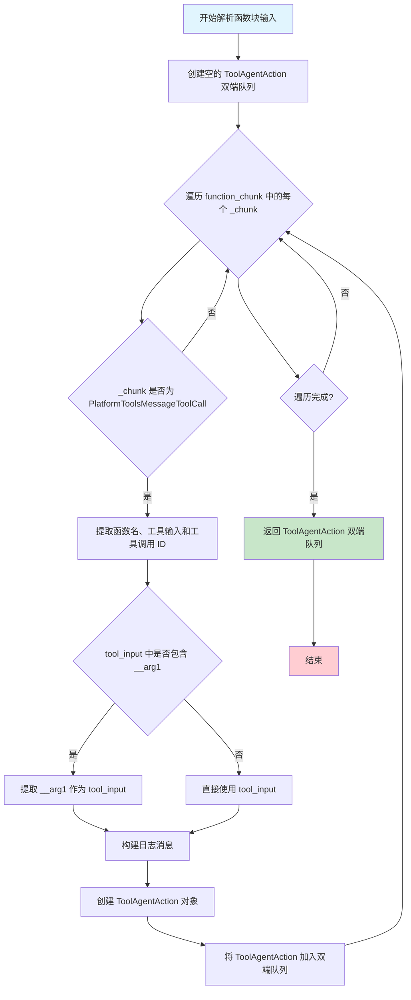

# `Langchain-Chatchat\libs\chatchat-server\langchain_chatchat\agents\output_parsers\tools_output\function.py` 详细设计文档

该代码是一个LangChain工具调用输出解析器，核心功能是解析语言模型返回的工具调用信息（tool calls），将其转换为LangChain可执行的ToolAgentAction队列，支持最佳努力解析策略和错误处理。

## 整体流程

```mermaid
graph TD
    A[开始解析工具调用] --> B{检查工具名称是否在AdapterAllToolStructType中}
    B -- 否 --> C[解析args为JSON或使用原args]
    C --> D{args是否为字典类型?}
    D -- 是 --> E{字典keys数量 > 0?}
    E -- 是 --> F[创建PlatformToolsMessageToolCall]
    E -- 否 --> G[创建PlatformToolsMessageToolCallChunk]
    D -- 否 --> H[抛出ValueError: Malformed args]
    B -- 是 --> I[跳过该工具调用]
    F --> J[返回解析后的function_chunk列表]
    G --> J
    J --> K[开始解析function_chunk输入]
    K --> L[遍历function_chunk]
    L --> M{检查是否为PlatformToolsMessageToolCall}
    M -- 是 --> N[提取tool_name, tool_input, tool_call_id]
    N --> O{tool_input是否包含__arg1?}
    O -- 是 --> P[提取__arg1作为tool_input]
    O -- 否 --> Q[使用原tool_input]
    P --> R[构建日志信息]
    Q --> R
    R --> S[创建ToolAgentAction并加入队列]
    M -- 否 --> T[跳过该chunk]
    S --> U{是否还有更多chunk?}
    U -- 是 --> L
    U -- 否 --> V[返回Deque[ToolAgentAction]]
    K --> W[捕获异常并记录日志]
    W --> X[抛出OutputParserException]
```

## 类结构

```
该文件为工具函数模块，无类定义
主要包含两个全局函数:
├── _best_effort_parse_function_tool_calls (工具调用解析函数)
└── _paser_function_chunk_input (函数块输入解析函数)
```

## 全局变量及字段


### `logger`
    
模块级日志记录器，用于记录解析过程中的错误和信息

类型：`logging.Logger`
    


    

## 全局函数及方法


### `_best_effort_parse_function_tool_calls`

该函数用于最佳努力（best-effort）解析工具调用块列表，将原始的工具调用数据转换为 `PlatformToolsMessageToolCall` 或 `PlatformToolsMessageToolCallChunk` 对象。它遍历输入的 `tool_call_chunks`，检查函数名是否在 `AdapterAllToolStructType` 枚举值中，对于已解析的调用，根据参数是否为空来决定创建哪种工具调用对象。

参数：

- `tool_call_chunks`：`List[dict]`，包含原始工具调用数据的字典列表，每个字典应包含 `name`、`args`、`id` 等字段

返回值：`List[Union[PlatformToolsMessageToolCall, PlatformToolsMessageToolCallChunk]]`，转换后的工具调用对象列表

#### 流程图

```mermaid
flowchart TD
    A[开始] --> B[创建空列表 function_chunk]
    B --> C{遍历 tool_call_chunks}
    C --> D{检查 function['name'] 是否在 AdapterAllToolStructType 枚举值中}
    D -->|是| C
    D -->|否| E{function['args'] 是字符串?}
    E -->|是| F[使用 parse_partial_json 解析 args]
    E -->|否| G[直接使用 args_ = function['args']]
    F --> H{args_ 是 dict?}
    G --> H
    H -->|否| I[抛出 ValueError: Malformed args.]
    H -->|是| J{args_ 长度 > 0?}
    J -->|是| K[创建 PlatformToolsMessageToolCall 对象]
    J -->|否| L[创建 PlatformToolsMessageToolCallChunk 对象]
    K --> M[将对象添加到 function_chunk]
    L --> M
    M --> C
    C --> N{遍历结束?}
    N -->|否| C
    N -->|是| O[返回 function_chunk]
    O --> P[结束]
```

#### 带注释源码

```python
def _best_effort_parse_function_tool_calls(
    tool_call_chunks: List[dict],
) -> List[Union[PlatformToolsMessageToolCall, PlatformToolsMessageToolCallChunk]]:
    """最佳努力解析工具调用块列表
    
    Args:
        tool_call_chunks: 包含原始工具调用数据的字典列表
        
    Returns:
        转换后的 PlatformToolsMessageToolCall 或 PlatformToolsMessageToolCallChunk 对象列表
    """
    # 存储解析后的工具调用对象
    function_chunk: List[
        Union[PlatformToolsMessageToolCall, PlatformToolsMessageToolCallChunk]
    ] = []
    
    # 遍历每个工具调用块进行解析
    for function in tool_call_chunks:
        # 检查函数名是否在适配器所有工具结构类型枚举中
        if function["name"] not in AdapterAllToolStructType.__members__.values():
            # 处理参数，可能是JSON字符串或字典
            if isinstance(function["args"], str):
                # 尝试解析JSON字符串
                args_ = parse_partial_json(function["args"])
            else:
                # 直接使用字典形式的参数
                args_ = function["args"]
            
            # 验证参数格式
            if not isinstance(args_, dict):
                raise ValueError("Malformed args.")

            # 根据参数是否为空决定创建哪种类型的工具调用对象
            if len(args_.keys()) > 0:
                # 参数非空，创建完整的工具调用消息
                function_chunk.append(
                    PlatformToolsMessageToolCall(
                        name=function["name"],
                        args=args_,
                        id=function["id"],
                    )
                )
            else:
                # 参数为空，创建工具调用块（用于流式处理）
                function_chunk.append(
                    PlatformToolsMessageToolCallChunk(
                        name=function["name"],
                        args=args_,
                        id=function["id"],
                        index=function.get("index"),
                    )
                )

    return function_chunk
```

---

### `_paser_function_chunk_input`

该函数用于将工具调用块解析为 `ToolAgentAction` 队列。它接收消息和已解析的函数块，遍历 `PlatformToolsMessageToolCall` 对象，提取函数名、参数和调用ID，处理特殊参数 `__arg1`，构建包含详细日志信息的 `ToolAgentAction` 对象并加入队列。

参数：

- `message`：`BaseMessage`，原始消息对象
- `function_chunk`：`List[Union[PlatformToolsMessageToolCall, PlatformToolsMessageToolCallChunk]]`，已解析的工具调用块列表

返回值：`Deque[ToolAgentAction]`，包含所有工具代理动作的 deque 队列

#### 流程图

```mermaid
flowchart TD
    A[开始] --> B[创建空的 ToolAgentAction deque]
    B --> C{遍历 function_chunk}
    C --> D{当前 _chunk 是 PlatformToolsMessageToolCall?}
    D -->|否| C
    D -->|是| E[提取 function_name = _chunk.name]
    E --> F[提取 _tool_input = _chunk.args]
    F --> G[提取 tool_call_id, 默认 'abc']
    G --> H{__arg1 在 _tool_input 中?}
    H -->|是| I[tool_input = _tool_input['__arg1']]
    H -->|否| J[tool_input = _tool_input]
    I --> K[构建 content_msg 日志消息]
    J --> K
    K --> L[构建完整 log 字符串]
    L --> M[创建 ToolAgentAction 并添加到队列]
    M --> C
    C --> N{遍历结束?}
    N -->|否| C
    N -->|是| O[返回 function_action_result_stack]
    O --> P{发生异常?}
    P -->|是| Q[记录错误日志并抛出 OutputParserException]
    P -->|否| R[结束]
    Q --> R
```

#### 带注释源码

```python
def _paser_function_chunk_input(
    message: BaseMessage,
    function_chunk: List[Union[PlatformToolsMessageToolCall, PlatformToolsMessageToolCallChunk]],
) -> Deque[ToolAgentAction]:
    """解析函数块输入为工具代理动作队列
    
    Args:
        message: 包含工具调用结果的原始消息
        function_chunk: 已解析的工具调用块列表
        
    Returns:
        包含所有 ToolAgentAction 的双端队列
    """
    try:
        # 存储解析后的工具代理动作
        function_action_result_stack: Deque[ToolAgentAction] = deque()
        
        # 遍历所有函数块
        for _chunk in function_chunk:
            # 只处理完整的工具调用消息，跳过 chunk
            if isinstance(_chunk, PlatformToolsMessageToolCall):
                # 提取函数名称
                function_name = _chunk.name
                # 提取工具输入参数
                _tool_input = _chunk.args
                # 提取调用ID，默认值为 'abc'
                tool_call_id = _chunk.id if _chunk.id else "abc"
                
                # 处理特殊参数 __arg1（用于单个参数场景）
                if "__arg1" in _tool_input:
                    tool_input = _tool_input["__arg1"]
                else:
                    tool_input = _tool_input

                # 构建日志内容消息
                content_msg = (
                    f"responded: {message.content}\n" if message.content else "\n"
                )
                # 完整的调用日志信息
                log = f"\nInvoking: `{function_name}` with `{tool_input}`\n{content_msg}\n"

                # 创建工具代理动作对象并添加到队列
                function_action_result_stack.append(
                    ToolAgentAction(
                        tool=function_name,
                        tool_input=tool_input,
                        log=log,
                        message_log=[message],
                        tool_call_id=tool_call_id,
                    )
                )

        return function_action_result_stack

    except Exception as e:
        # 捕获并记录解析过程中的错误
        logger.error(f"Error parsing function_chunk: {e}", exc_info=True)
        raise OutputParserException(f"Error parsing function_chunk: {e} ")
```

---

## 关键组件信息

| 组件名称 | 一句话描述 |
|---------|-----------|
| `AdapterAllToolStructType` | 工具结构类型枚举类，用于判断工具调用是否已解析 |
| `PlatformToolsMessageToolCall` | 完整的平台工具调用消息对象，包含名称、参数和ID |
| `PlatformToolsMessageToolCallChunk` | 平台工具调用块对象，用于流式处理场景 |
| `ToolAgentAction` | LangChain代理动作对象，用于执行工具调用 |
| `parse_partial_json` | 部分JSON解析工具，处理不完整的JSON字符串 |

---

## 潜在技术债务与优化空间

1. **硬编码默认值**：函数中 `tool_call_id` 的默认值为 `"abc"`，这是一个硬编码的占位符，应该考虑更合理的ID生成策略。

2. **异常处理粒度**：当前的异常捕获较为宽泛（捕获所有 `Exception`），可以考虑对不同类型的错误进行更精细的处理。

3. **日志格式**：日志构建使用字符串拼接，可以考虑使用更结构化的日志方式（如 f-string 或日志模板）。

4. **缺乏输入验证**：函数对输入的 `tool_call_chunks` 缺乏深层验证，例如缺少对必需字段（`name`、`args`）存在性的检查。

5. **魔法字符串**：`"__arg1"` 是一个特殊的参数名，这种硬编码可能影响代码的可维护性。

---

## 其它项目

### 设计目标与约束

- **目标**：将原始工具调用数据可靠地转换为LangChain可处理的 `ToolAgentAction` 对象
- **约束**：依赖 `langchain_chatchat` 项目内部类型和 `langchain` 生态系统

### 错误处理与异常设计

- 在 `_best_effort_parse_function_tool_calls` 中，当 `args_` 不是字典时抛出 `ValueError`
- 在 `_paser_function_chunk_input` 中，使用 try-except 捕获所有异常并重新抛出为 `OutputParserException`
- 使用 `logger` 记录错误日志，包含完整的异常堆栈信息

### 数据流与状态机

1. **第一阶段**：原始工具调用数据（dict） → `_best_effort_parse_function_tool_calls` → 转换为 `PlatformToolsMessageToolCall/PlatformToolsMessageToolCallChunk`
2. **第二阶段**：转换后的对象 + 原始消息 → `_paser_function_chunk_input` → 转换为 `ToolAgentAction` 队列

### 外部依赖与接口契约

- 依赖 `langchain.agents.output_parsers.tools.ToolAgentAction`
- 依赖 `langchain_core.messages.BaseMessage`
- 依赖 `langchain_core.utils.json.parse_partial_json`
- 依赖 `langchain_chatchat` 项目内部定义的类型


### `_paser_function_chunk_input`

该函数用于解析函数块输入，将工具调用信息转换为 `ToolAgentAction` 队列。它遍历函数块列表，提取工具名称、输入参数、日志信息和消息历史，然后返回包含这些信息的 `Deque[ToolAgentAction]` 队列。

参数：

- `message`：`BaseMessage`，包含消息内容的基类对象，用于生成日志和消息历史
- `function_chunk`：`List[Union[PlatformToolsMessageToolCall, PlatformToolsMessageToolCallChunk]]`，工具调用的块列表，包含工具名称、参数和 ID 等信息

返回值：`Deque[ToolAgentAction]`，`ToolAgentAction` 对象的双端队列，包含工具名称、工具输入、日志和消息历史

#### 流程图



#### 带注释源码

```python
def _paser_function_chunk_input(
    message: BaseMessage,
    function_chunk: List[Union[PlatformToolsMessageToolCall, PlatformToolsMessageToolCallChunk]],
) -> Deque[ToolAgentAction]:
    """
    解析函数块输入，将工具调用信息转换为 ToolAgentAction 队列
    
    参数:
        message: BaseMessage - 包含消息内容的基类对象
        function_chunk: List[Union[PlatformToolsMessageToolCall, PlatformToolsMessageToolCallChunk]] - 工具调用块列表
    
    返回:
        Deque[ToolAgentAction] - ToolAgentAction 对象的双端队列
    """
    try:
        # 创建一个空的双端队列用于存储 ToolAgentAction 结果
        function_action_result_stack: Deque[ToolAgentAction] = deque()
        
        # 遍历函数块列表中的每个块
        for _chunk in function_chunk:
            # 只处理 PlatformToolsMessageToolCall 类型的块
            if isinstance(_chunk, PlatformToolsMessageToolCall):
                # 提取工具名称
                function_name = _chunk.name
                # 提取工具输入参数
                _tool_input = _chunk.args
                # 获取工具调用 ID，如果不存在则使用默认值 "abc"
                tool_call_id = _chunk.id if _chunk.id else "abc"
                
                # 处理特殊参数 __arg1（用于单参数函数调用）
                if "__arg1" in _tool_input:
                    tool_input = _tool_input["__arg1"]
                else:
                    tool_input = _tool_input

                # 构建日志消息内容，包含响应信息
                content_msg = (
                    f"responded: {message.content}\n" if message.content else "\n"
                )
                # 格式化日志字符串，包含函数名、工具输入和消息内容
                log = f"\nInvoking: `{function_name}` with `{tool_input}`\n{content_msg}\n"

                # 创建 ToolAgentAction 对象，包含工具名、输入、日志、消息历史和工具调用 ID
                function_action_result_stack.append(
                    ToolAgentAction(
                        tool=function_name,
                        tool_input=tool_input,
                        log=log,
                        message_log=[message],
                        tool_call_id=tool_call_id,
                    )
                )

        # 返回包含所有 ToolAgentAction 的双端队列
        return function_action_result_stack

    # 异常处理：捕获解析过程中的错误
    except Exception as e:
        # 记录错误日志，包含完整的堆栈信息
        logger.error(f"Error parsing function_chunk: {e}", exc_info=True)
        # 抛出输出解析器异常
        raise OutputParserException(f"Error parsing function_chunk: {e} ")
```

## 关键组件


### 函数工具调用解析器

负责解析大语言模型返回的工具调用块（tool call chunks），支持最佳努力解析策略，能够处理不同格式的参数（字符串或字典），并根据参数是否为空返回不同的消息工具调用对象。

### 函数块输入转换器

将解析后的函数块转换为 LangChain 的 ToolAgentAction 对象队列，支持单参数（__arg1）处理和日志生成，用于构建代理动作栈。

### 最佳努力解析策略

采用宽松的解析策略，即使遇到格式不规范的参数也能尝试解析，支持 JSON 字符串的_partial_json 解析，并在解析失败时抛出明确的错误信息。

### 工具调用验证机制

通过 AdapterAllToolStructType 枚举成员验证工具名称的合法性，确保只有注册过的工具才会被处理，防止未知工具调用。

### 异常处理与日志记录

统一的异常捕获和日志记录机制，使用 logger.error 记录详细错误信息并保留堆栈跟踪，最后抛出 OutputParserException 供上层捕获处理。


## 问题及建议


### 已知问题

-   **拼写错误**：函数名 `_paser_function_chunk_input` 中的 "paser" 应为 "parser"，注释中的 "allready" 应为 "already"
-   **硬编码值**：默认 tool_call_id 使用硬编码字符串 "abc"，缺乏明确的常量定义
-   **异常处理不完整**：`_best_effort_parse_function_tool_calls` 函数没有任何异常处理，解析失败时直接抛出原始异常，调用方难以精准捕获和处理特定错误
-   **类型注解冗长**：`List[Union[PlatformToolsMessageToolCall, PlatformToolsMessageToolCallChunk]]` 重复出现，可使用 TypeAlias 简化
-   **空值检查冗余**：`if len(args_.keys()) > 0:` 可简化为 `if args_:`
-   **日志与异常重复**：捕获异常后记录日志再重新抛出，在某些调用场景下可能造成日志重复
-   **缺少输入验证**：函数未对 `tool_call_chunks` 和 `message` 参数进行空值或类型校验
-   **API稳定性风险**：直接依赖 `langchain` 内部模块如 `AdapterAllToolStructType.__members__.values()`，可能因依赖库版本升级而失效
-   **魔法字符串**：日志格式字符串缺乏参数化封装，复用性差

### 优化建议

-   **修正拼写**：将 `_paser_function_chunk_input` 重命名为 `_parser_function_chunk_input`，修正注释中的拼写错误
-   **提取常量**：定义常量 `DEFAULT_TOOL_CALL_ID = "abc"` 替代硬编码值
-   **添加类型别名**：在文件顶部定义 `ToolCallType = Union[PlatformToolsMessageToolCall, PlatformToolsMessageToolCallChunk]` 简化类型注解
-   **增强异常处理**：为 `_best_effort_parse_function_tool_calls` 添加 try-except 块，提供更友好的错误信息或返回空列表而非直接崩溃
-   **简化空值检查**：使用 Pythonic 的 `if args_:` 替代 `if len(args_.keys()) > 0:`
-   **添加参数校验**：在函数入口添加 `if not tool_call_chunks: return []` 等守卫语句
-   **封装日志逻辑**：将日志构建逻辑提取为独立函数 `_build_invocation_log`，提高可测试性和复用性
-   **考虑返回Result模式**：对于可能的解析失败场景，可考虑返回 `Result[Deque[ToolAgentAction], Error]` 而非直接抛异常
-   **依赖版本锁定**：在项目依赖中明确 langchain 相关版本，减少因 API 变更导致的潜在风险


## 其它


### 设计目标与约束

本模块旨在为LangChain聊天应用提供工具调用（Tool Call）的解析能力，将大语言模型输出的JSON格式工具调用转换为可执行的ToolAgentAction对象。设计约束包括：1) 依赖langchain-core和langchain-chatchat内部组件；2) 仅支持AdapterAllToolStructType中定义的工具类型；3) 解析过程采用尽力而为（best-effort）策略，对部分合法的工具调用进行容错处理。

### 错误处理与异常设计

异常处理主要包含两类：1) ValueError：当args解析后不是字典类型时抛出；2) OutputParserException：当function_chunk解析过程中发生任何异常时抛出并记录完整堆栈。日志记录使用Python标准logging模块，错误级别为error并开启exc_info=True以输出完整堆栈信息。

### 数据流与状态机

数据流遵循以下路径：tool_call_chunks（原始字典列表） → _best_effort_parse_function_tool_calls（转换为PlatformToolsMessageToolCall/PlatformToolsMessageToolCallChunk列表） → _paser_function_chunk_input（转换为Deque[ToolAgentAction]）。状态机表现为：对于包含有效参数字典的调用创建PlatformToolsMessageToolCall，对于空参数字典创建PlatformToolsMessageToolCallChunk。

### 外部依赖与接口契约

主要依赖包括：langchain.agents.output_parsers.tools.ToolAgentAction（输出类型）、langchain_core.exceptions.OutputParserException（异常类型）、langchain_core.messages.BaseMessage（消息类型）、langchain_core.utils.json.parse_partial_json（JSON解析）、langchain_chatchat.agent_toolkits.all_tools.struct_type.AdapterAllToolStructType（工具类型枚举）、langchain_chatchat.agents.output_parsers.tools_output.base（平台工具消息类型）。

### 性能考虑

1) 使用deque作为结果容器，提供O(1)的append操作；2) 循环遍历tool_call_chunks列表，时间复杂度为O(n)，n为工具调用数量；3) parse_partial_json支持流式JSON解析，对不完整的JSON字符串具有容错能力。

### 安全性考虑

1) 对function["name"]进行成员值校验，仅允许白名单工具类型；2) 解析args时进行类型检查，确保为dict类型；3) tool_call_id提供默认值"abc"防止空值。

### 测试策略建议

建议补充单元测试覆盖：1) 正常场景下工具调用解析；2) 空参数工具调用场景；3) 非白名单工具名称的拒绝；4) 非法args格式的异常抛出；5) message.content为空或非空时的日志生成。

### 配置说明

当前模块无外部配置参数，完全依赖代码硬编码的默认值和 AdapterAllToolStructType 枚举定义。tool_call_id的默认值"abc"可通过后续配置参数化。

### 使用示例

```python
# 示例：调用解析函数
tool_call_chunks = [
    {"name": "calculator", "args": '{"expression": "1+1"}', "id": "call_123"}
]
result = _best_effort_parse_function_chunks(tool_call_chunks)
# result: List[PlatformToolsMessageToolCall]

# 示例：转换为ToolAgentAction
message = AIMessage(content="计算结果")
actions = _parser_function_chunk_input(message, result)
# actions: Deque[ToolAgentAction]
```

### 参考资料

LangChain官方文档 - Tool calling：https://python.langchain.com/docs/modules/agents/tools/how_to/tool_calling
LangChain Core源码 - output_parsers模块
langchain-chatchat项目文档

    