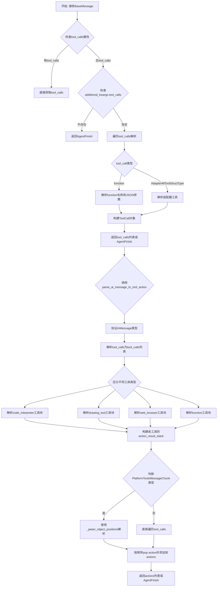
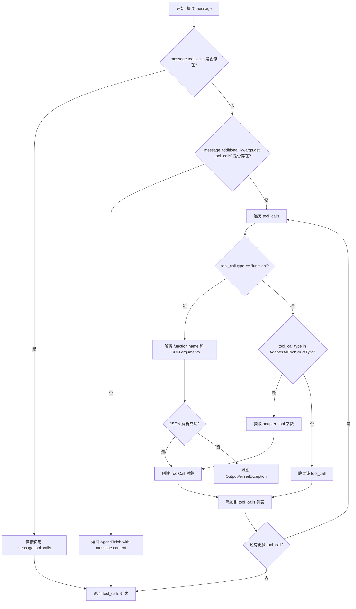
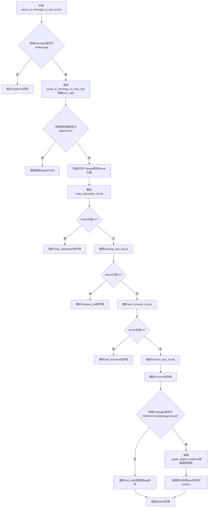

# `Langchain-Chatchat\libs\chatchat-server\langchain_chatchat\agents\output_parsers\tools_output\tools.py` 详细设计文档

该模块是LangChain Chatchat项目中工具调用输出的解析器基类，核心功能是将AI消息（ AIMessage）中的tool_calls字段解析为LangChain的AgentAction列表或AgentFinish对象，支持function、code_interpreter、web_browser、drawing_tool等多种工具类型的解析和转换。

## 整体流程



## 类结构

```
该文件为工具输出解析模块，无类定义
主要包含3个函数:
├── paser_ai_message_to_tool_calls (主解析函数)
├── parse_ai_message_to_tool_action (动作转换函数)
└── _paser_object_positions (内部辅助函数)
```

## 全局变量及字段


### `logger`
    
用于记录模块日志的Logger实例

类型：`logging.Logger`
    


### `code_interpreter_action_result_stack`
    
存储code_interpreter工具调用解析结果的双端队列

类型：`deque`
    


### `web_browser_action_result_stack`
    
存储web_browser工具调用解析结果的双端队列

类型：`deque`
    


### `drawing_tool_result_stack`
    
存储drawing_tool工具调用解析结果的双端队列

类型：`deque`
    


### `function_tool_result_stack`
    
存储function工具调用解析结果的双端队列

类型：`deque`
    


    

## 全局函数及方法


### `paser_ai_message_to_tool_calls`

该函数用于将 BaseMessage 对象解析为 ToolCall 列表或 AgentFinish 对象，实现对 AI 消息中工具调用的提取和标准化处理，支持 function 类型和适配器类型的工具调用解析。

参数：

- `message`：`BaseMessage`，输入的 AI 消息对象，包含内容、工具调用等信息

返回值：`Union[List[ToolCall], AgentFinish]`，返回解析后的 ToolCall 列表或 AgentFinish（当无工具调用时）

#### 流程图



#### 带注释源码

```python
def paser_ai_message_to_tool_calls(
    message: BaseMessage,
):
    """
    将 BaseMessage 解析为 ToolCall 列表或 AgentFinish 对象
    
    参数:
        message: BaseMessage，输入的 AI 消息对象
        
    返回:
        Union[List[ToolCall], AgentFinish]，ToolCall 列表或 AgentFinish
    """
    # 初始化空列表存储工具调用
    tool_calls = []
    
    # 优先使用 message.tool_calls（已解析的工具调用）
    if message.tool_calls:
        tool_calls = message.tool_calls
    else:
        # 检查 additional_kwargs 中是否包含 tool_calls（原始格式）
        if not message.additional_kwargs.get("tool_calls"):
            # 无工具调用，返回 AgentFinish
            return AgentFinish(
                return_values={"output": message.content}, log=str(message.content)
            )
        
        # 尝试解析 additional_kwargs 中的 tool_calls
        for tool_call in message.additional_kwargs["tool_calls"]:
            # 处理 function 类型的工具调用
            if "function" == tool_call["type"]:
                function = tool_call["function"]
                function_name = function["name"]
                try:
                    # 解析 JSON 格式的参数
                    args = json.loads(function["arguments"] or "{}")
                    tool_calls.append(
                        ToolCall(
                            name=function_name,
                            args=args,
                            id=tool_call["id"] if tool_call["id"] else "abc",
                        )
                    )
                except JSONDecodeError:
                    # 参数解析失败时抛出异常
                    raise OutputParserException(
                        f"Could not parse tool input: {function} because "
                        f"the `arguments` is not valid JSON."
                    )
            # 处理适配器类型的工具调用（如 code_interpreter, web_browser 等）
            elif tool_call["type"] in AdapterAllToolStructType.__members__.values():
                adapter_tool = tool_call[tool_call["type"]]
                
                tool_calls.append(
                    ToolCall(
                        name=tool_call["type"],
                        args=adapter_tool if adapter_tool else {},
                        id=tool_call["id"] if tool_call["id"] else "abc",
                    )
                )

    return tool_calls
```


### `parse_ai_message_to_tool_action`

该函数是LangChain ChatChat代理系统的核心输出解析器，负责将AIMessage对象解析为AgentAction列表或AgentFinish信号，支持多种工具类型（代码解释器、网页浏览器、绘图工具、函数调用）的并行处理和状态管理。

参数：

- `message`：`BaseMessage`，输入的AI消息对象，可能是普通AIMessage或PlatformToolsMessageChunk类型

返回值：`Union[List[AgentAction], AgentFinish]`，返回解析后的工具动作列表或AgentFinish（当没有工具调用时）

#### 流程图



#### 带注释源码

```python
def parse_ai_message_to_tool_action(
    message: BaseMessage,
) -> Union[List[AgentAction], AgentFinish]:
    """Parse an AI message potentially containing tool_calls."""
    # 参数检查：确保输入是AIMessage类型
    if not isinstance(message, AIMessage):
        raise TypeError(f"Expected an AI message got {type(message)}")

    # TODO: parse platform tools built-in @langchain_chatchat.agents.platform_tools.base._get_assistants_tool
    #   type in the future "function" or "code_interpreter"
    #   for @ToolAgentAction from langchain.agents.output_parsers.tools
    #   import with langchain.agents.format_scratchpad.tools.format_to_tool_messages
    
    # 初始化actions列表用于存储解析后的AgentAction
    actions: List = []
    
    # 第一步：提取工具调用列表
    tool_calls = paser_ai_message_to_tool_calls(message)
    
    # 如果返回的是AgentFinish（无工具调用），直接返回
    if isinstance(tool_calls, AgentFinish):
        return tool_calls
    
    # 初始化四个deque栈用于存储不同类型工具的解析结果
    code_interpreter_action_result_stack: deque = deque()
    web_browser_action_result_stack: deque = deque()
    drawing_tool_result_stack: deque = deque()
    function_tool_result_stack: deque = deque()
    
    # 初始化code_interpreter的chunk列表
    code_interpreter_chunk: List[
        Union[PlatformToolsMessageToolCall, PlatformToolsMessageToolCallChunk]
    ] = []
    
    # 根据message类型选择不同的解析路径
    if message.tool_calls:
        # 优先使用tool_call_chunks（流式增量数据）
        if isinstance(message, PlatformToolsMessageChunk):
            code_interpreter_chunk = _best_effort_parse_code_interpreter_tool_calls(
                message.tool_call_chunks
            )
    else:
        # 备用：从已解析的tool_calls中解析
        code_interpreter_chunk = _best_effort_parse_code_interpreter_tool_calls(
            tool_calls
        )

    # 如果code_interpreter chunk数量>1，解析为动作栈
    if code_interpreter_chunk and len(code_interpreter_chunk) > 1:
        code_interpreter_action_result_stack = _paser_code_interpreter_chunk_input(
            message, code_interpreter_chunk
        )

    # 初始化drawing_tool的chunk列表
    drawing_tool_chunk: List[
        Union[PlatformToolsMessageToolCall, PlatformToolsMessageToolCallChunk]
    ] = []
    
    # 解析drawing_tool
    if message.tool_calls:
        if isinstance(message, PlatformToolsMessageChunk):
            drawing_tool_chunk = _best_effort_parse_drawing_tool_tool_calls(
                message.tool_call_chunks
            )
    else:
        drawing_tool_chunk = _best_effort_parse_drawing_tool_tool_calls(tool_calls)

    if drawing_tool_chunk and len(drawing_tool_chunk) > 1:
        drawing_tool_result_stack = _paser_drawing_tool_chunk_input(
            message, drawing_tool_chunk
        )

    # 初始化web_browser的chunk列表
    web_browser_chunk: List[
        Union[PlatformToolsMessageToolCall, PlatformToolsMessageToolCallChunk]
    ] = []
    
    # 解析web_browser
    if message.tool_calls:
        if isinstance(message, PlatformToolsMessageChunk):
            web_browser_chunk = _best_effort_parse_web_browser_tool_calls(
                message.tool_call_chunks
            )
    else:
        web_browser_chunk = _best_effort_parse_web_browser_tool_calls(tool_calls)

    if web_browser_chunk and len(web_browser_chunk) > 1:
        web_browser_action_result_stack = _paser_web_browser_chunk_input(
            message, web_browser_chunk
        )

    # TODO: parse platform tools built-in @langchain_chatchat
    # delete AdapterAllToolStructType from tool_calls
    
    # 解析function_tool（通用函数调用）
    function_tool_chunk = _best_effort_parse_function_tool_calls(tool_calls)

    function_tool_result_stack = _paser_function_chunk_input(
        message, function_tool_chunk
    )

    # 根据message类型选择处理方式
    if isinstance(message, PlatformToolsMessageChunk):
        # 流式消息：从tool_call_chunks中获取调用顺序
        call_chunks = _paser_object_positions(message.tool_call_chunks)

        # 按解析出的调用顺序依次从各栈中取出动作
        for too_call_name in call_chunks:
            if too_call_name == AdapterAllToolStructType.CODE_INTERPRETER:
                actions.append(code_interpreter_action_result_stack.popleft())
            elif too_call_name == AdapterAllToolStructType.WEB_BROWSER:
                actions.append(web_browser_action_result_stack.popleft())
            elif too_call_name == AdapterAllToolStructType.DRAWING_TOOL:
                actions.append(drawing_tool_result_stack.popleft())
            else:
                # 默认为function tool
                actions.append(function_tool_result_stack.popleft())
    else:
        # 非流式消息：从原始tool_calls中按类型取动作
        for too_call in tool_calls:
            if too_call["name"] not in AdapterAllToolStructType.__members__.values():
                actions.append(function_tool_result_stack.popleft())
            elif too_call["name"] == AdapterAllToolStructType.CODE_INTERPRETER:
                actions.append(code_interpreter_action_result_stack.popleft())
            elif too_call["name"] == AdapterAllToolStructType.WEB_BROWSER:
                actions.append(web_browser_action_result_stack.popleft())
            elif too_call["name"] == AdapterAllToolStructType.DRAWING_TOOL:
                actions.append(drawing_tool_result_stack.popleft())

    return actions
```


### `_paser_object_positions`

该函数是一个内部函数，用于解析 `tool_call_chunks` 中的对象位置。它遍历工具调用块列表，识别不同类型的工具调用（如代码解释器、网页浏览器、绘图工具等），过滤重复的名称，并返回按顺序排列的工具调用名称列表。当列表为空或最后一项与已有项不同时，会进行特殊处理以确保至少返回一个工具调用名称。

参数：

-  `tool_call_chunks`：`List[ToolCallChunk]`，待解析的工具调用块列表

返回值：`List`，解析后的工具调用名称列表

#### 流程图

```mermaid
flowchart TD
    A[开始] --> B{tool_call_chunks 是否为空}
    B -->|是| C[返回空列表 call_chunks]
    B -->|否| D[初始化 call_chunks = [], last_name = None]
    D --> E{遍历 call_chunk in tool_call_chunks}
    
    E --> F{call_chunk.name 是否在 AdapterAllToolStructType 中}
    F -->|是| G{args 是否为字符串}
    G -->|是| H[args_ = parse_partial_json(args)]
    G -->|否| I[args_ = args]
    H --> J{args_ 是否为字典}
    I --> J
    J -->|否| K[抛出 ValueError: Malformed args.]
    J -->|是| L{"outputs" 是否在 args_ 中}
    L -->|是| M[call_chunks.append name, last_name = name]
    L -->|否| N[继续下一次循环]
    
    F -->|否| O{call_chunk.name != last_name}
    O -->|是| P[call_chunks.append name, last_name = name]
    O -->|否| N
    
    N --> E
    M --> E
    
    E --> Q{遍历结束}
    Q --> R{call_chunks 长度是否为 0}
    R -->|是| S[call_chunks.append tool_call_chunks[-1].name]
    R -->|否| T{tool_call_chunks[-1].name != call_chunks[-1]}
    T -->|是| U[call_chunks.append tool_call_chunks[-1].name]
    T -->|否| V[返回 call_chunks]
    S --> V
    U --> V
```

#### 带注释源码

```python
def _paser_object_positions(tool_call_chunks: List[ToolCallChunk]):
    """
    解析 tool_call_chunks 中的对象位置，返回工具调用名称列表
    
    参数:
        tool_call_chunks: 工具调用块列表，每个元素包含 name 和 args 等信息
        
    返回:
        工具调用名称列表，按调用顺序排列
    """
    call_chunks = []  # 存储解析后的工具调用名称
    last_name = None  # 记录上一个处理的工具调用名称，用于去重
    
    # 如果输入为空，直接返回空列表
    if not tool_call_chunks:
        return call_chunks
    
    # 遍历每个工具调用块
    for call_chunk in tool_call_chunks:
        # 检查当前调用名称是否属于预定义的工具类型
        if call_chunk["name"] in AdapterAllToolStructType.__members__.values():
            # 处理 args 参数，可能是字符串或字典
            if isinstance(call_chunk["args"], str):
                # 如果是字符串，尝试解析为 JSON
                args_ = parse_partial_json(call_chunk["args"])
            else:
                # 直接使用字典形式的 args
                args_ = call_chunk["args"]
            
            # 验证 args 必须是字典类型
            if not isinstance(args_, dict):
                raise ValueError("Malformed args.")
            
            # 如果 args 中包含 "outputs"，说明是工具执行结果
            if "outputs" in args_:
                call_chunks.append(call_chunk["name"])
                last_name = call_chunk["name"]
        else:
            # 对于非预定义类型的工具调用，检查是否与上一个重复
            if call_chunk["name"] != last_name:
                call_chunks.append(call_chunk["name"])
                last_name = call_chunk["name"]
    
    # 处理边界情况：如果没有解析出任何工具调用
    if len(call_chunks) == 0:
        # 取最后一个 tool_call_chunks 的名称作为默认值
        call_chunks.append(tool_call_chunks[-1]["name"])
    # 检查最后一个 tool_call_chunks 是否需要追加
    elif tool_call_chunks[-1]["name"] != call_chunks[-1]:
        call_chunks.append(tool_call_chunks[-1]["name"])
    
    return call_chunks
```

## 关键组件


### 张量索引与惰性加载

代码使用`collections.deque`作为栈结构来存储工具调用的结果（code_interpreter_action_result_stack、web_browser_action_result_stack、drawing_tool_result_stack、function_tool_result_stack），通过popleft()方法实现惰性加载，按需取出元素而不是一次性处理所有数据。

### 反量化支持

`parse_ai_message_to_tool_action`函数支持多种工具类型的反量化解析，包括CODE_INTERPRETER、WEB_BROWSER、DRAWING_TOOL和FUNCTION四种平台内置工具，通过适配器类型枚举`AdapterAllToolStructType`进行识别和分类处理。

### 量化策略

实现了四种最佳努力解析策略函数：`_best_effort_parse_code_interpreter_tool_calls`、`_best_effort_parse_drawing_tool_tool_calls`、`_best_effort_parse_web_browser_tool_calls`和`_best_effort_parse_function_tool_calls`，分别处理不同工具调用块的解析。

### 平台工具消息处理

使用`PlatformToolsMessageChunk`类来处理特定平台的工具消息，并配合`PlatformToolsMessageToolCall`和`PlatformToolsMessageToolCallChunk`类型进行类型提示和类型检查。

### 工具调用解析主函数

`paser_ai_message_to_tool_calls`函数是核心入口，负责将BaseMessage对象解析为ToolCall列表，支持从message.tool_calls或message.additional_kwargs["tool_calls"]中提取工具调用信息。

### 工具动作解析

`parse_ai_message_to_tool_action`函数是主解析函数，将AI消息转换为AgentAction列表或AgentFinish对象，协调各类工具调用解析器的工作流程。

### 对象位置解析

`_paser_object_positions`函数用于解析tool_call_chunks中各工具调用的位置和顺序，通过遍历chunk列表并识别工具名称来实现位置的标定。


## 问题及建议


### 已知问题

-   **函数名拼写错误**：函数名使用"paser"而非"parser"（如`paser_ai_message_to_tool_calls`、`_paser_code_interpreter_chunk_input`等），影响代码可读性和搜索体验。
-   **类型注解不完整**：`actions: List = []` 缺少具体类型注解，应为 `actions: List[AgentAction] = []`。
-   **重复代码模式**：code_interpreter、web_browser、drawing_tool、function四类工具的解析逻辑高度相似，存在大量重复代码（如`if message.tool_calls: ... else: ...`的结构重复四次），违反DRY原则。
-   **硬编码默认值**：使用`"abc"`作为工具调用的默认ID (`id=tool_call["id"] if tool_call["id"] else "abc"`)，缺乏明确的常量定义。
-   **空队列风险**：多处直接调用`popleft()`而未检查队列是否为空，可能导致`IndexError`异常。
-   **TODO未完成**：代码中存在两处TODO注释，表明平台工具解析功能不完整，未来需要补充。
-   **重复类型检查**：`isinstance(message, PlatformToolsMessageChunk)`在代码中被多次重复检查，可提取为单一变量。
-   **变量名拼写错误**：`too_call_name`应为`tool_call_name`，影响代码可读性。
-   **魔法数字**：`len(code_interpreter_chunk) > 1`中的`1`未定义为有意义的常量。
-   **性能隐患**：在循环中多次调用`AdapterAllToolStructType.__members__.values()`，可缓存结果以提升性能。

### 优化建议

-   **修正拼写**：将所有"paser"改为"parser"，"too_call"改为"tool_call"。
-   **完善类型注解**：为所有List类型添加具体元素类型注解。
-   **提取公共逻辑**：使用策略模式或工厂模式重构重复的工具解析逻辑，创建通用的解析器类。
-   **定义常量**：提取硬编码的默认值和魔法数字为具名常量。
-   **添加空值检查**：在调用`popleft()`前检查队列是否为空，或使用异常处理。
-   **缓存枚举值**：将`AdapterAllToolStructType.__members__.values()`的结果缓存为类或模块级变量。
-   **消除重复检查**：将`isinstance`检查结果存储在变量中，避免重复判断。
-   **补充TODO实现**：根据TODO注释完善平台工具的解析逻辑。


## 其它


### 设计目标与约束

本模块的核心设计目标是实现一个灵活的工具调用解析器，能够将AI消息转换为结构化的AgentAction或AgentFinish对象。设计约束包括：1）必须支持多种工具类型（function、code_interpreter、web_browser、drawing_tool）；2）需要处理不完整的JSON参数（best-effort parsing）；3）需要兼容不同类型的消息格式（BaseMessage和PlatformToolsMessageChunk）。

### 错误处理与异常设计

本模块涉及多种错误处理场景：1）JSONDecodeError：当function.arguments不是有效JSON时抛出OutputParserException；2）TypeError：当传入消息不是AIMessage时抛出；3）ValueError：当解析的参数不是dict类型时抛出。异常设计采用逐层传递模式，底层解析错误会在parse_ai_message_to_tool_action函数中汇总处理。

### 数据流与状态机

数据流主要分为三阶段：输入阶段接收BaseMessage；处理阶段通过paser_ai_message_to_tool_calls提取原始tool_calls，然后根据消息类型分别调用不同解析器（code_interpreter、web_browser、drawing_tool、function）处理；输出阶段将处理结果组装为AgentAction列表或AgentFinish对象返回。状态机表现为对不同工具类型的条件分支处理逻辑。

### 外部依赖与接口契约

本模块依赖以下外部包：1）langchain_core.agents提供AgentAction和AgentFinish类；2）langchain_core.messages提供消息相关类型；3）langchain_chatchat.agent_toolkits.all_tools.struct_type提供AdapterAllToolStructType枚举；4）langchain_chatchat.agents.output_parsers.tools_output.*提供各类型工具解析器。接口契约方面：paser_ai_message_to_tool_calls输入BaseMessage输出List[ToolCall]或AgentFinish；parse_ai_message_to_tool_action输入BaseMessage输出Union[List[AgentAction], AgentFinish]。

### 版本兼容性考虑

代码中使用了TODO注释标注了待完成的兼容性改进：1）未来需要解析platform tools内置的function和code_interpreter类型；2）需要支持将ToolAgentAction从langchain.agents.format_scratchpad.tools格式化。这些TODO反映了与langchain框架版本的潜在兼容性问题。

### 性能考虑与优化空间

当前实现中存在重复解析逻辑（message.tool_calls和message.additional_kwargs["tool_calls"]的分支处理），且多个独立解析器可能产生性能开销。优化方向包括：1）缓存解析结果避免重复计算；2）使用懒加载方式处理tool_call_chunks；3）考虑将不同工具类型的解析逻辑解耦为独立策略类。

    