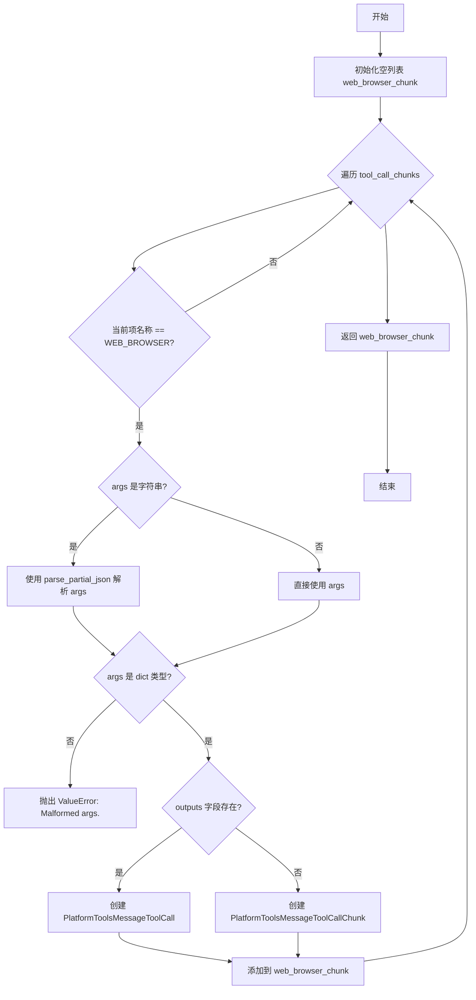
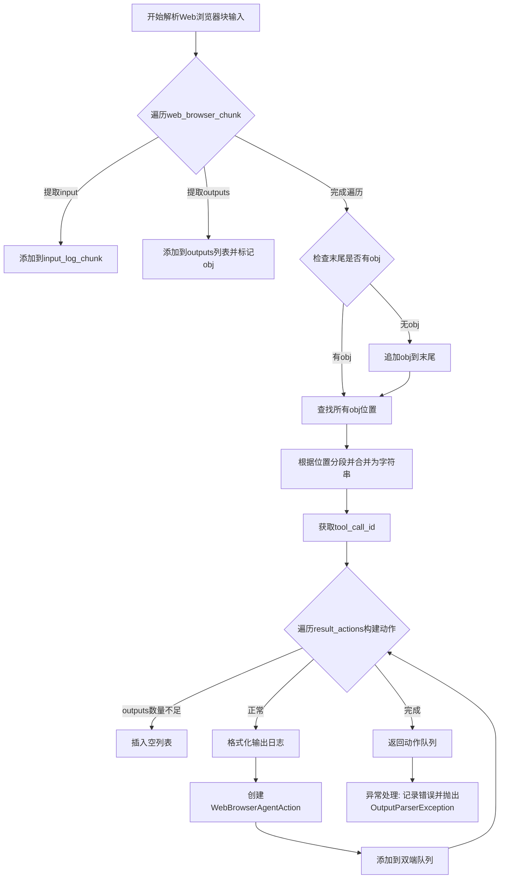
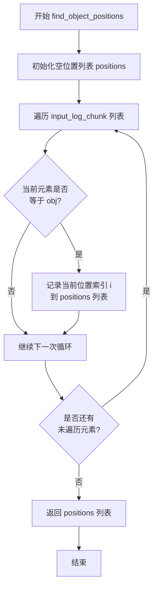
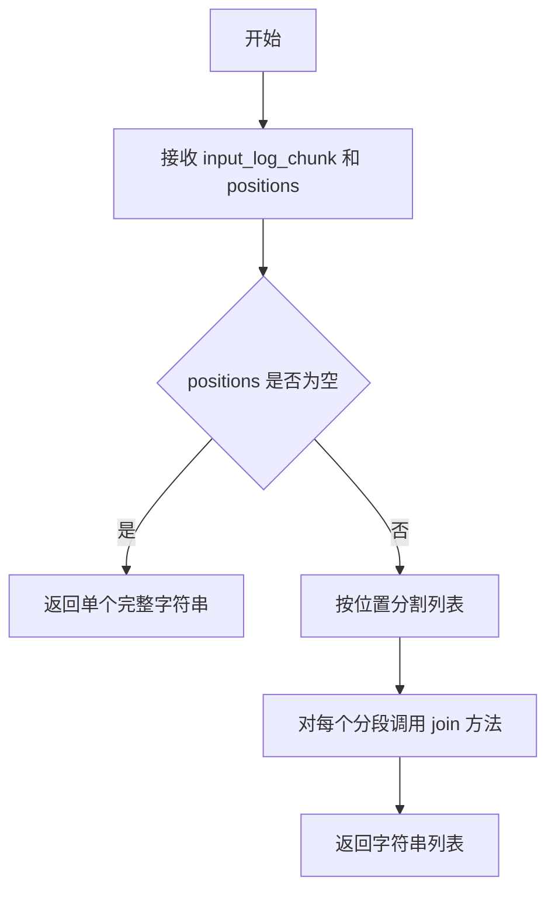

# `Langchain-Chatchat\libs\chatchat-server\langchain_chatchat\agents\output_parsers\tools_output\web_browser.py` 详细设计文档

该模块用于解析Web浏览器工具调用，将LangChain的ToolAgentAction转换为包含输入输出日志的WebBrowserAgentAction对象，支持流式处理和最佳努力解析

## 整体流程

```mermaid
graph TD
A[开始] --> B[调用 _best_effort_parse_web_browser_tool_calls]
B --> C{遍历 tool_call_chunks}
C --> D{判断是否为 WEB_BROWSER}
D -- 否 --> C
D -- 是 --> E{解析 args (JSON或dict)}
E --> F{检查 args_ 类型}
F -- 非dict --> G[抛出 ValueError]
F -- 是dict --> H{检查是否有 outputs}
H -- 有 --> I[创建 PlatformToolsMessageToolCall]
H -- 无 --> J[创建 PlatformToolsMessageToolCallChunk]
I --> K[返回 web_browser_chunk 列表]
J --> K
K --> L[调用 _paser_web_browser_chunk_input]
L --> M[提取 input_log_chunk 和 outputs]
M --> N[使用 find_object_positions 定位分割点]
N --> O[使用 concatenate_segments 拼接分段]
O --> P[遍历 result_actions]
P --> Q[构建格式化日志字符串]
Q --> R[创建 WebBrowserAgentAction]
R --> S[加入 deque 队列]
S --> T[返回 web_browser_action_result_stack]
```

## 类结构

```
ToolAgentAction (langchain基类)
└── WebBrowserAgentAction (自定义扩展类)
```

## 全局变量及字段


### `logger`
    
模块级日志记录器，用于记录解析过程中的错误和调试信息

类型：`logging.Logger`
    


### `web_browser_chunk`
    
Web浏览器工具调用块列表，存储解析后的工具调用信息

类型：`List[Union[PlatformToolsMessageToolCall, PlatformToolsMessageToolCallChunk]]`
    


### `input_log_chunk`
    
输入日志块列表，用于累积解析过程中的输入日志

类型：`list`
    


### `outputs`
    
输出结果列表，存储工具调用的输出结果（二维列表结构）

类型：`List[List[dict]]`
    


### `positions`
    
object()实例位置列表，用于标记输入日志中的分隔位置

类型：`list`
    


### `result_actions`
    
拼接后的动作列表，通过分段拼接生成的最终动作序列

类型：`list`
    


### `web_browser_action_result_stack`
    
最终结果队列，存储解析完成的Web浏览器代理动作

类型：`Deque[WebBrowserAgentAction]`
    


### `WebBrowserAgentAction.outputs`
    
工具调用的输出结果

类型：`List[Union[str, dict]]`
    


### `WebBrowserAgentAction.platform_params`
    
平台参数

类型：`dict`
    
    

## 全局函数及方法


### `_best_effort_parse_web_browser_tool_calls`

该函数是一个"最佳努力"解析器，用于解析Web浏览器工具调用。它遍历工具调用块列表，针对每个名称为`WEB_BROWSER`的调用进行参数解析，根据参数中是否包含`outputs`字段来创建不同类型的`PlatformToolsMessageToolCall`或`PlatformToolsMessageToolCallChunk`对象，最终返回解析后的工具调用列表。

参数：

- `tool_call_chunks`：`List[dict]`，待解析的Web浏览器工具调用块列表，每个字典包含工具调用的名称、参数和ID等信息

返回值：`List[Union[PlatformToolsMessageToolCall, PlatformToolsMessageToolCallChunk]]`，解析后的平台工具消息调用列表，根据参数中是否包含`outputs`字段决定返回的类型

#### 流程图



#### 带注释源码

```python
def _best_effort_parse_web_browser_tool_calls(
    tool_call_chunks: List[dict],
) -> List[Union[PlatformToolsMessageToolCall, PlatformToolsMessageToolCallChunk]]:
    """
    最佳努力解析Web浏览器工具调用
    
    该函数尝试解析传入的工具调用块，对于每个名称为WEB_BROWSER的调用，
    如果参数是字符串则尝试解析为JSON，然后根据参数中是否包含outputs字段
    来决定创建完整工具调用还是工具调用块（chunk）
    
    参数:
        tool_call_chunks: 包含工具调用信息的字典列表，每个字典应有name、args、id等字段
        
    返回:
        解析后的PlatformToolsMessageToolCall或PlatformToolsMessageToolCallChunk列表
    """
    # 初始化存储解析后工具调用的列表
    web_browser_chunk: List[
        Union[PlatformToolsMessageToolCall, PlatformToolsMessageToolCallChunk]
    ] = []
    
    # 遍历所有工具调用块，尝试解析WEB_BROWSER类型的调用
    for web_browser in tool_call_chunks:
        # 只处理WEB_BROWSER类型的工具调用
        if AdapterAllToolStructType.WEB_BROWSER == web_browser["name"]:
            # 如果参数是字符串，尝试解析为JSON；否则直接使用
            if isinstance(web_browser["args"], str):
                args_ = parse_partial_json(web_browser["args"])
            else:
                args_ = web_browser["args"]
            
            # 验证解析后的参数是字典类型
            if not isinstance(args_, dict):
                raise ValueError("Malformed args.")

            # 根据参数中是否包含outputs字段决定创建哪种类型的工具调用
            if "outputs" in args_:
                # 有outputs字段表示完整的工具调用结果
                web_browser_chunk.append(
                    PlatformToolsMessageToolCall(
                        name=web_browser["name"],
                        args=args_,
                        id=web_browser["id"],
                    )
                )
            else:
                # 没有outputs字段表示是工具调用块（可能还在进行中）
                web_browser_chunk.append(
                    PlatformToolsMessageToolCallChunk(
                        name=web_browser["name"],
                        args=args_,
                        id=web_browser["id"],
                        index=web_browser.get("index"),
                    )
                )

    return web_browser_chunk
```


### `_paser_web_browser_chunk_input`

该函数负责解析Web浏览器块输入并构建动作队列，接收消息和Web浏览器块列表，提取输入日志和输出结果，通过分段合并机制构建WebBrowserAgentAction对象队列并返回。

参数：

- `message`：`BaseMessage`，输入的消息对象，包含对话上下文信息
- `web_browser_chunk`：`List[Union[PlatformToolsMessageToolCall, PlatformToolsMessageToolCallChunk]]`，Web浏览器块的列表，每个块包含工具调用的参数和元数据

返回值：`Deque[WebBrowserAgentAction]`，Web浏览器代理动作的双端队列，每个动作包含工具名称、工具输入、输出结果、日志信息和消息日志

#### 流程图



#### 带注释源码

```python
def _paser_web_browser_chunk_input(
    message: BaseMessage,
    web_browser_chunk: List[
        Union[PlatformToolsMessageToolCall, PlatformToolsMessageToolCallChunk]
    ],
) -> Deque[WebBrowserAgentAction]:
    """
    解析Web浏览器块输入并构建动作队列
    
    Args:
        message: 包含对话上下文的消息对象
        web_browser_chunk: Web浏览器工具调用的块列表
        
    Returns:
        包含WebBrowserAgentAction对象的双端队列
    """
    try:
        # 初始化输入日志列表，用于存储从块中提取的输入内容
        input_log_chunk = []

        # 初始化输出列表，用于存储工具执行的输出结果
        outputs: List[List[dict]] = []
        # 创建一个标记对象，用于分隔不同的输入片段
        obj = object()
        
        # 遍历每个Web浏览器块，提取input和outputs
        for interpreter_chunk in web_browser_chunk:
            interpreter_chunk_args = interpreter_chunk.args

            # 提取输入内容并添加到日志
            if "input" in interpreter_chunk_args:
                input_log_chunk.append(interpreter_chunk_args["input"])
            
            # 提取输出结果，添加标记对象并存储输出
            if "outputs" in interpreter_chunk_args:
                input_log_chunk.append(obj)  # 使用obj作为分隔符
                outputs.append(interpreter_chunk_args["outputs"])

        # 确保列表末尾有标记对象，用于分段处理
        if input_log_chunk[-1] is not obj:
            input_log_chunk.append(obj)
            
        # 查找所有标记对象(object())的位置，用于分段
        positions = find_object_positions(input_log_chunk, obj)

        # 根据位置信息合并分段，得到动作列表
        result_actions = concatenate_segments(input_log_chunk, positions)

        # 获取第一个块的tool_call_id，如果为空则使用默认值"abc"
        tool_call_id = web_browser_chunk[0].id if web_browser_chunk[0].id else "abc"
        
        # 初始化动作队列
        web_browser_action_result_stack: Deque[WebBrowserAgentAction] = deque()
        
        # 遍历每个动作，构建WebBrowserAgentAction对象
        for i, action in enumerate(result_actions):
            # 如果outputs数量少于actions数量，插入空列表
            if len(result_actions) > len(outputs):
                outputs.insert(i, [])

            # 格式化输出日志，将字典转换为字符串格式
            out_logs = [
                f"title:{logs['title']}\nlink:{logs['link']}\ncontent:{logs['content']}"
                for logs in outputs[i]
                if "title" in logs
            ]
            # 合并日志内容
            out_str = "\n".join(out_logs)
            # 组合动作和输出作为完整日志
            log = f"{action}\r\n{out_str}"
            
            # 创建WebBrowserAgentAction对象
            web_browser_action = WebBrowserAgentAction(
                tool=AdapterAllToolStructType.WEB_BROWSER,  # 工具类型
                tool_input=action,  # 工具输入
                outputs=outputs[i],  # 工具输出
                log=log,  # 完整日志
                message_log=[message],  # 关联的消息
                tool_call_id=tool_call_id,  # 工具调用ID
            )
            # 添加到队列
            web_browser_action_result_stack.append(web_browser_action)
            
        return web_browser_action_result_stack
        
    except Exception as e:
        # 捕获异常并记录错误日志
        logger.error(f"Error parsing web_browser_chunk: {e}", exc_info=True)
        # 抛出解析异常
        raise OutputParserException(f"Could not parse tool input: web_browser {e} ")
```


### `find_object_positions`

该函数用于在列表中查找特定对象实例（`object()`）的位置索引，以便后续根据这些位置对列表进行分段处理。在 Web 浏览器代理操作解析过程中，它帮助区分输入日志和输出日志的边界。

参数：

-  `input_log_chunk`：`List`，包含字符串和 `object()` 实例的混合列表，需要在其中查找对象位置
-  `obj`：`object`，在列表中用作标记的 `object()` 实例，用于标识分段点

返回值：`List[int]`，返回 `obj` 实例在列表中的位置索引列表

#### 流程图



#### 带注释源码

```python
# 由于源代码在外部模块中，以下是基于调用上下文的推断实现

def find_object_positions(input_log_chunk: List, obj: object) -> List[int]:
    """
    在列表中查找特定对象实例的位置索引
    
    参数:
        input_log_chunk: 包含字符串和 object() 实例的混合列表
        obj: 用作标记的 object() 实例
    
    返回:
        obj 实例在列表中的位置索引列表
    """
    positions = []
    
    # 遍历列表，查找所有 obj 实例的位置
    for i, item in enumerate(input_log_chunk):
        if item is obj:  # 使用 is 进行身份比较，而非 == 进行值比较
            positions.append(i)
    
    return positions

# 示例用法：
# input_log_chunk = ["input1", obj, "input2", "input3", obj, "input4"]
# positions = find_object_positions(input_log_chunk, obj)
# 返回: [1, 4]
```


### `concatenate_segments`

该函数用于将输入列表根据指定的位置标记进行分段，并将每个分段合并成字符串。这是 `_utils` 模块中的工具函数，用于处理 Web 浏览器代理的输入日志，将包含对象标记的列表分割成多个段落。

参数：

-  `input_log_chunk`：`List`，包含字符串和 `object()` 标记的列表，用于表示需要合并的日志段
-  `positions`：`List[int]`，通过 `find_object_positions` 找到的 `object()` 实例的位置索引列表，用于标识分段边界

返回值：`List[str]`，返回合并后的字符串列表，每个元素对应一个分段的内容

#### 流程图



#### 带注释源码

```python
# 该函数定义位于 langchain_chatchat/agents/output_parsers/tools_output/_utils.py
# 当前代码文件仅导入并使用该函数，函数实现位于外部模块

# 在当前代码中的使用方式：
# Find positions of object() instances
positions = find_object_positions(input_log_chunk, obj)

# Concatenate segments
result_actions = concatenate_segments(input_log_chunk, positions)

# 函数功能说明：
# 1. 接收一个混合了字符串和标记对象(object())的列表
# 2. 接收标记对象的位置索引列表
# 3. 根据位置索引将列表分割成多个段
# 4. 将每个段合并成单独的字符串
# 5. 返回合并后的字符串列表

# 示例逻辑：
# input_log_chunk = ["input1", obj(), "input2", obj(), "input3"]
# positions = [1, 3]
# result_actions = ["input1", "input2", "input3"]
```

---

**注意**：该函数的完整实现源码位于 `langchain_chatchat/agents/output_parsers/tools_output/_utils.py` 模块中，当前提供的代码文件仅导入并使用了该函数，未包含其具体实现代码。从调用方式可以推断，该函数接收一个列表和位置索引，返回按位置分割后的字符串列表。

## 关键组件


### WebBrowserAgentAction 类

用于表示Web浏览器代理动作的类，继承自 ToolAgentAction，包含工具调用输入、输出结果、日志信息和消息历史。

### _best_effort_parse_web_browser_tool_calls 函数

采用尽力而为(Best-Effort)策略解析Web浏览器工具调用，支持部分JSON解析，根据是否包含"outputs"字段区分完整调用和分块调用。

### _paser_web_browser_chunk_input 函数

核心解析逻辑，通过find_object_positions定位分隔符位置，使用concatenate_segments拼接分段内容，将Web浏览器工具调用的参数转换为WebBrowserAgentAction队列，支持输入日志和输出结果的关联处理。

### 工具输出格式化组件

将Web浏览器返回的搜索结果格式化为"title:xxx\nlink:xxx\ncontent:xxx"格式的字符串，用于日志记录和结果展示。

### 异常处理机制

捕获解析过程中的异常，使用logger记录错误堆栈信息，抛出OutputParserException提示解析失败。


## 问题及建议


### 已知问题

-   **函数名拼写错误**：函数 `_paser_web_browser_chunk_input` 应为 `_parser_web_browser_chunk_input`（parser 拼写错误），影响代码可读性和可维护性
-   **类型注解与默认值不匹配**：`WebBrowserAgentAction` 类中 `outputs` 字段类型注解为 `List[Union[str, dict]]`，默认值却是 `None`，存在类型不一致问题
-   **空列表访问风险**：代码 `outputs[i]` 在 `outputs` 列表长度不足时会触发 IndexError，虽然有 `if len(result_actions) > len(outputs): outputs.insert(i, [])` 的保护逻辑，但逻辑顺序存在竞态条件风险
-   **硬编码默认值**：`tool_call_id = web_browser_chunk[0].id if web_browser_chunk[0].id else "abc"` 使用硬编码字符串 "abc" 作为后备值，缺乏配置机制
-   **输入验证缺失**：函数 `_paser_web_browser_chunk_input` 未对 `message` 和 `web_browser_chunk` 参数进行空值或类型校验，可能导致运行时异常
-   **日志字段访问无保护**：`logs['title']`、`logs['link']`、`logs['content']` 直接访问字典键，若字段缺失会抛出 KeyError
-   **类型注解错误**：`find_object_positions` 和 `concatenate_segments` 函数的调用无法从代码中确认其类型签名，但使用了 `object()` 作为标记物的做法不符合类型安全最佳实践

### 优化建议

-   修正函数名拼写，将 `_paser_web_browser_chunk_input` 改为 `_parser_web_browser_chunk_input`
-   为 `WebBrowserAgentAction` 类字段提供合理的默认值为空列表 `[]` 而非 `None`，或使用 `Optional[List]` 类型注解
-   在函数入口处添加参数校验：`if not web_browser_chunk or not message: raise ValueError(...)`
-   将硬编码的 "abc" 提取为常量或配置项，提高可维护性
-   使用 `logs.get('title', '')` 等安全访问方式，避免 KeyError
-   考虑将工具调用解析逻辑与消息解析逻辑解耦，提高函数单一职责性
-   添加完整的类型注解和返回类型声明，提升代码可读性和 IDE 支持


## 其它


### 设计目标与约束

本模块的设计目标是解析和转换Web浏览器工具调用（Web Browser Tool Calls），将其转换为结构化的Agent Action对象，以便后续的代理流程处理。核心约束包括：1）必须兼容LangChain框架的ToolAgentAction基类；2）需要支持部分JSON解析以处理流式输出；3）输出格式需要适配PlatformToolsMessageToolCall和PlatformToolsMessageToolCallChunk两种类型；4）需要处理input和outputs字段的分离与合并逻辑。

### 错误处理与异常设计

错误处理采用分层设计：1）函数内部使用try-except捕获异常，并通过logger.error记录详细错误信息；2）捕获的异常重新抛出为OutputParserException，附带原始错误信息以便上游调用者进行错误定位；3）针对特定错误情况（如args_不是dict类型）抛出ValueError；4）所有异常都会记录完整的堆栈信息（exc_info=True）便于调试。

### 数据流与状态机

数据流分为两个主要阶段：首先是解析阶段，_best_effort_parse_web_browser_tool_calls将原始工具调用块解析为PlatformToolsMessageToolCall/PlatformToolsMessageToolCallChunk对象；其次是转换阶段，_paser_web_browser_chunk_input将解析结果转换为WebBrowserAgentAction对象的双端队列。状态转换通过find_object_positions定位输入输出分隔符，使用concatenate_segments合并分段内容，最终生成包含action和outputs对应关系的结果栈。

### 外部依赖与接口契约

本模块依赖以下外部组件：1）langchain.agents.output_parsers.tools.ToolAgentAction作为基类；2）langchain_core.exceptions.OutputParserException用于异常抛出；3）langchain_core.messages.BaseMessage用于消息类型；4）langchain_core.utils.json.parse_partial_json用于部分JSON解析；5）langchain_chatchat.agent_toolkits.all_tools.struct_type.AdapterAllToolStructType用于工具类型枚举；6）langchain_chatchat.agents.output_parsers.tools_output.base中的平台工具消息类。接口契约要求：tool_call_chunks必须包含name、args、id字段；args可以是字符串或字典；WebBrowserAgentAction必须包含tool、tool_input、outputs、log、message_log、tool_call_id属性。

### 性能考虑与资源消耗

性能关键点：1）parse_partial_json在处理大字符串时可能存在性能瓶颈，建议对超长输入进行长度限制；2）concatenate_segments和find_object_positions的时间复杂度为O(n)，其中n为input_log_chunk长度；3）outputs列表的insert操作在循环中可能导致O(n²)复杂度，建议改用预分配或追加后反转的方式；4）字符串格式化操作（f"title:{logs['title']}..."）在大数据量时建议使用join或模板方式优化。

### 安全性与输入验证

安全考量：1）args_字段的dict类型验证防止反序列化攻击；2）logs['title']、logs['link']、logs['content']的访问未进行空值检查，可能抛出KeyError；3）web_browser_chunk[0].id的默认值"abc"是硬编码，可能导致多会话场景下的ID冲突；4）日志输出包含完整的工具输出内容，需注意敏感信息泄露风险，建议在生产环境对log字段进行脱敏处理。

### 版本兼容性与演化考虑

LangChain框架版本兼容性：代码使用了langchain.agents.output_parsers.tools和langchain_core模块，这些模块的API在不同版本间可能存在差异，建议在requirements中锁定兼容版本。演化方向：1）可考虑将"abc"默认值改为UUID生成；2）outputs为空时的默认空列表处理逻辑可抽象为通用方法；3）日志格式化逻辑可配置化以支持不同输出格式需求。

    