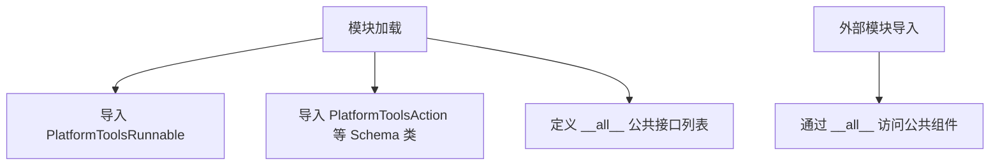

# `Langchain-Chatchat\libs\chatchat-server\langchain_chatchat\agents\platform_tools\__init__.py` 详细设计文档

该文件是 langchain_chatchat 平台工具模块的导出入口，主要重新导出 platform_tools.base 和 platform_tools.schema 中的核心类和类型定义，包括可运行工具基类、消息类型、工具动作、工具状态等，为上层调用者提供统一的公共接口。

## 整体流程



## 类结构

```
PlatformToolsBaseComponent (基类)
├── PlatformToolsRunnable (可运行工具基类)
├── PlatformToolsAction (工具动作)
├── PlatformToolsFinish (工具完成)
├── PlatformToolsActionToolStart (工具开始)
├── PlatformToolsActionToolEnd (工具结束)
├── PlatformToolsLLMStatus (LLM状态)
└── MsgType (消息类型枚举)
```

## 全局变量及字段


### `__all__`
    
定义模块的公共API接口，列出所有可导出的类和函数

类型：`List[str]`
    


    

## 全局函数及方法


## 关键组件


### PlatformToolsRunnable

平台工具的可运行基类，提供了执行平台工具的核心接口和能力。

### PlatformToolsBaseComponent

平台工具的基础组件类，定义了平台工具组件的通用属性和方法。

### PlatformToolsAction

平台工具的动作定义，用于描述工具执行的具体操作和行为。

### PlatformToolsFinish

平台工具完成状态表示，用于标识工具执行结束并返回结果。

### PlatformToolsActionToolStart

平台工具动作开始状态，表示工具开始执行的阶段。

### PlatformToolsActionToolEnd

平台工具动作结束状态，表示工具执行完成的阶段。

### PlatformToolsLLMStatus

平台工具调用LLM的状态枚举，定义了与大语言模型交互时的各种状态。

### MsgType

消息类型枚举，定义了平台工具中使用的不同消息类别。


## 问题及建议


### 已知问题

- **缺乏模块文档字符串**：该模块缺少模块级别的文档说明（docstring），无法快速了解该模块的用途和功能
- **导入语句可读性差**：多个导入语句集中在单行，影响代码可读性和维护性
- **缺少版本控制**：模块未定义 `__version__` 或版本相关信息，无法追踪版本变更
- **潜在的导入失败风险**：直接导入外部包（langchain_chatchat）如果该包未安装会导致 ImportError，缺乏适当的错误处理或依赖说明
- **暴露内部实现细节**：虽然通过 `__all__` 控制了导出内容，但可能需要更明确的公共API和内部API区分
- **类型注解定义缺失**：导入了类型相关的类（MsgType等），但未包含对应的类型定义文件或类型注解文件

### 优化建议

- 为模块添加文档字符串，说明该模块是平台工具的公共API导出模块
- 将导入语句拆分成多行，提高可读性：
  ```python
  from langchain_chatchat.agents.platform_tools.base import (
      PlatformToolsRunnable,
  )
  from langchain_chatchat.agents.platform_tools.schema import (
      PlatformToolsAction,
      PlatformToolsActionToolEnd,
      PlatformToolsActionToolStart,
      PlatformToolsBaseComponent,
      PlatformToolsFinish,
      PlatformToolsLLMStatus,
      MsgType,
  )
  ```
- 添加版本信息和许可证说明
- 考虑添加类型提示文件（.pyi）或使用 stub 文件提供完整的类型定义
- 在模块级别添加 try-except 处理，提供更友好的导入错误信息
- 定期审查 `__all__` 列表，确保导出的API稳定且必要


## 其它


### 设计目标与约束

本模块作为langchain_chatchat平台工具系统的公共导出接口模块，旨在统一暴露平台工具相关的核心类和数据结构，便于其他模块导入使用。设计约束包括：必须与langchain_chatchat.agents.platform_tools包下的base和schema子模块保持版本同步，所有导出类型需遵循平台工具框架的接口规范。

### 错误处理与异常设计

本模块为纯导入导出模块，不涉及业务逻辑处理，错误处理依赖于底层base和schema模块的实现。导入时可能出现的错误包括：ImportError（依赖模块未安装或路径错误）、AttributeError（导出成员不存在）。建议使用方在导入时进行异常捕获，或确保依赖包完整安装。

### 数据流与状态机

本模块不涉及数据流处理或状态机实现。作为接口层，其数据流方向为：外部模块 → 本模块导入 → base/schema子模块 → 具体业务逻辑。平台工具的执行流程由PlatformToolsRunnable类控制，包含工具启动（ToolStart）、工具执行（Action）、工具结束（ToolEnd）三个主要状态。

### 外部依赖与接口契约

本模块直接依赖langchain_chatchat.agents.platform_tools.base和langchain_chatshet.agents.platform_tools.schema两个子模块。接口契约如下：
- PlatformToolsRunnable：平台工具可运行基类
- PlatformToolsBaseComponent：平台工具基础组件
- PlatformToolsAction：平台工具动作定义
- PlatformToolsFinish：平台工具完成状态
- PlatformToolsActionToolStart：工具启动事件
- PlatformToolsActionToolEnd：工具结束事件
- PlatformToolsLLMStatus：LLM状态枚举
- MsgType：消息类型枚举

### 使用示例

```python
# 方式一：从本模块直接导入
from langchain_chatchat.agents.platform_tools import (
    PlatformToolsRunnable,
    PlatformToolsAction,
    MsgType,
)

# 方式二：从子模块导入（需要更多路径）
from langchain_chatchat.agents.platform_tools.base import PlatformToolsRunnable
from langchain_chatchat.agents.platform_tools.schema import PlatformToolsAction, MsgType
```

### 版本信息

当前模块版本与langchain_chatchat项目版本保持一致。建议使用方通过setup.py或pyproject.toml指定兼容版本，接口稳定性：主要版本（MAJOR）变更时可能不兼容。

### 安全考虑

本模块为接口导出模块，无敏感数据处理。建议使用方确保导入来源可信，避免通过动态导入执行未知代码。在生产环境中使用PlatformToolsRunnable时需验证工具来源和参数合法性。

### 性能考虑

本模块仅包含import语句，性能开销可忽略不计。首次导入时需加载base和schema子模块，建议在应用启动阶段完成导入以避免运行时延迟。

### 测试策略

测试重点包括：导入完整性测试（验证__all__导出列表与实际可用成员一致）、依赖可用性测试（验证base和schema模块可正常导入）、接口兼容性测试（验证各导出类的属性和方法签名符合预期）。

    