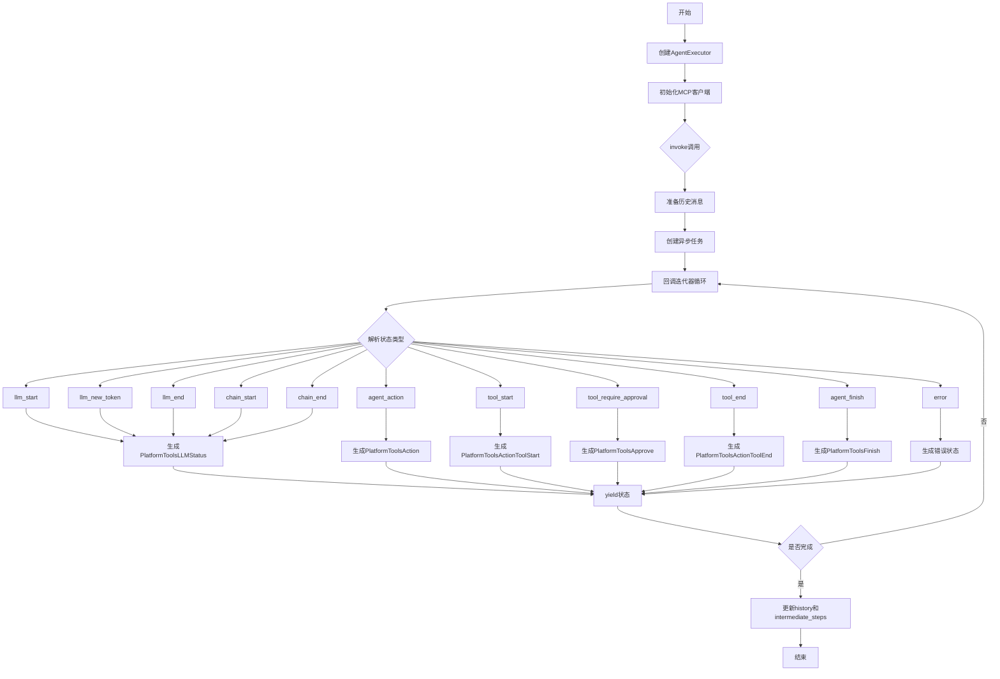
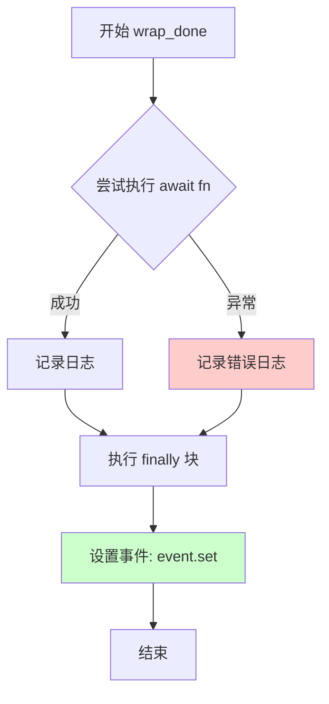
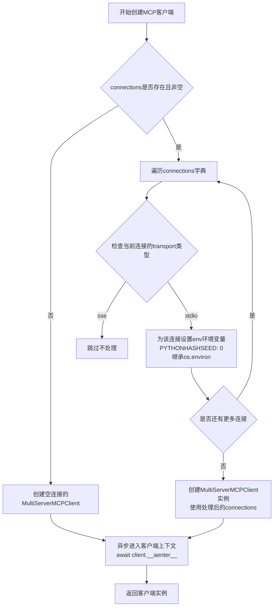
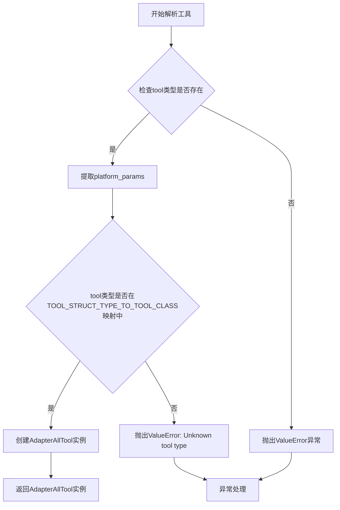
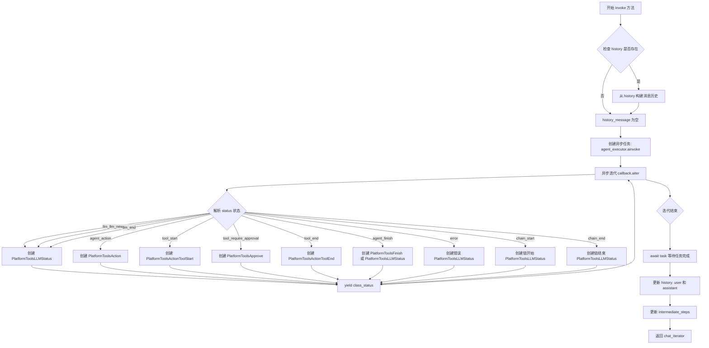

# `Langchain-Chatchat\libs\chatchat-server\langchain_chatchat\agents\platform_tools\base.py` 详细设计文档

该代码实现了一个基于LangChain的异步Agent运行框架PlatformToolsRunnable，支持平台工具和MCP（Multi-Server Model Context Protocol）工具的集成，通过流式输出各种执行状态（LLM调用、工具调用、代理动作等），实现与AI代理的实时交互。

## 整体流程



## 类结构

```
RunnableSerializable (langchain_core)
└── PlatformToolsRunnable (本类)
```

## 全局变量及字段


### `OutputType`
    
输出类型联合类型

类型：`Union[PlatformToolsAction, PlatformToolsActionToolStart, PlatformToolsActionToolEnd, PlatformToolsFinish, PlatformToolsLLMStatus]`
    


### `logger`
    
日志记录器

类型：`logging.Logger`
    


### `PlatformToolsRunnable.agent_executor`
    
平台AgentExecutor实例

类型：`AgentExecutor`
    


### `PlatformToolsRunnable.agent_type`
    
代理类型

类型：`str`
    


### `PlatformToolsRunnable.callback`
    
AgentExecutor回调处理器

类型：`AgentExecutorAsyncIteratorCallbackHandler`
    


### `PlatformToolsRunnable.intermediate_steps`
    
存储待处理数据的中介步骤

类型：`List[Tuple[AgentAction, Union[BaseToolOutput, str]]]`
    


### `PlatformToolsRunnable.history`
    
用户消息历史

类型：`List[Union[List, Tuple, Dict]]`
    


### `PlatformToolsRunnable.mcp_connections`
    
MCP连接配置

类型：`dict[str, StdioConnection | SSEConnection]`
    
    

## 全局函数及方法


### `_is_assistants_builtin_tool`

判断是否为平台内置工具。该函数通过检查工具对象的结构及其 `type` 字段是否属于 `AdapterAllToolStructType` 枚举定义的范畴，来识别平台预置的工具。

参数：
- `tool`：`Union[Dict[str, Any], Type[BaseModel], Callable, BaseTool]`，待检测的工具对象，支持字典、BaseModel 类、Callable 或 BaseTool 实例。

返回值：`bool`，如果工具是平台内置工具则返回 `True`，否则返回 `False`。

#### 流程图

```mermaid
flowchart TD
    A([Start _is_assistants_builtin_tool]) --> B[Get assistants_builtin_tools from AdapterAllToolStructType]
    B --> C{Is tool an instance of dict?}
    C -- No --> D[Return False]
    C -- Yes --> E{Does tool contain key 'type'?}
    E -- No --> D
    E -- Yes --> F{Is tool['type'] in assistants_builtin_tools?}
    F -- No --> D
    F -- Yes --> G[Return True]
```

#### 带注释源码

```python
def _is_assistants_builtin_tool(
        tool: Union[Dict[str, Any], Type[BaseModel], Callable, BaseTool],
) -> bool:
    """platform tools built-in"""
    # 获取 AdapterAllToolStructType 枚举中所有的内置工具类型值
    assistants_builtin_tools = AdapterAllToolStructType.__members__.values()
    
    # 判断逻辑：
    # 1. 首先检查 tool 是否为字典类型（平台内置工具通常以字典形式定义）
    # 2. 检查字典中是否包含 'type' 字段
    # 3. 检查 'type' 字段的值是否属于平台内置工具枚举集合
    return (
            isinstance(tool, dict)
            and ("type" in tool)
            and (tool["type"] in assistants_builtin_tools)
    )
```


### `_get_assistants_tool`

将原始函数/类转换为 ZhipuAI（智谱AI）工具格式，识别是否为平台内置工具，内置工具直接返回，自定义工具则转换为 OpenAI 工具格式。

参数：

- `tool`：`Union[Dict[str, Any], Type[BaseModel], Callable, BaseTool]`，待转换的工具，可以是字典、BaseModel 类型、Callable（函数）或 BaseTool 实例

返回值：`Dict[str, Any]`，转换后的 ZhipuAI 工具格式字典

#### 流程图

```mermaid
flowchart TD
    A[开始: 接收 tool 参数] --> B{调用 _is_assistants_builtin_tool<br/>判断是否为内置工具?}
    B -->|是| C[直接返回原始 tool]
    B -->|否| D[调用 convert_to_openai_tool<br/>转换为 OpenAI 工具格式]
    C --> E[结束: 返回工具字典]
    D --> E
    
    F[_is_assistants_builtin_tool 内部逻辑] --> F1{tool 是 dict<br/>且包含 'type' 键?}
    F1 -->|否| F2[返回 False]
    F1 -->|是| F3{tool['type'] 在<br/>AdapterAllToolStructType 成员中?}
    F3 -->|否| F2
    F3 -->|是| F4[返回 True]
```

#### 带注释源码

```python
def _get_assistants_tool(
        tool: Union[Dict[str, Any], Type[BaseModel], Callable, BaseTool],
) -> Dict[str, Any]:
    """Convert a raw function/class to an ZhipuAI tool.
    
    将原始函数/类转换为 ZhipuAI 工具格式。
    如果工具是平台内置工具，则直接返回；
    否则使用 langchain 的 convert_to_openai_tool 转换为标准工具格式。
    
    Args:
        tool: 待转换的工具，支持以下类型:
            - Dict[str, Any]: 工具定义的字典形式
            - Type[BaseModel]: Pydantic 模型类
            - Callable: 可调用函数
            - BaseTool: langchain 的 BaseTool 实例
    
    Returns:
        Dict[str, Any]: 转换后的 ZhipuAI 工具格式字典
    """
    # 检查是否为平台内置工具（AdapterAllToolStructType 中定义的工具）
    if _is_assistants_builtin_tool(tool):
        return tool  # type: ignore
    else:
        # 对于自定义工具，使用 langchain 的 convert_to_openai_tool 转换为 OpenAI 工具格式
        return convert_to_openai_tool(tool)
```

---

### `_is_assistants_builtin_tool`（辅助函数）

判断给定的工具是否为平台内置工具。

参数：

- `tool`：`Union[Dict[str, Any], Type[BaseModel], Callable, BaseTool]`，待判断的工具

返回值：`bool`，是否为内置工具

#### 带注释源码

```python
def _is_assistants_builtin_tool(
        tool: Union[Dict[str, Any], Type[BaseModel], Callable, BaseTool],
) -> bool:
    """Check if the tool is a platform built-in tool.
    
    判断工具是否为平台内置工具。
    内置工具定义在 AdapterAllToolStructType 枚举中。
    
    Args:
        tool: 待判断的工具
    
    Returns:
        bool: 如果是内置工具返回 True，否则返回 False
    """
    # 获取所有平台内置工具类型
    assistants_builtin_tools = AdapterAllToolStructType.__members__.values()
    
    # 判断条件：
    # 1. tool 必须是字典类型
    # 2. 字典中必须包含 'type' 键
    # 3. tool['type'] 必须在内置工具列表中
    return (
            isinstance(tool, dict)
            and ("type" in tool)
            and (tool["type"] in assistants_builtin_tools)
    )
```


### `wrap_done`

该函数是一个异步函数包装器，用于包装任意异步函数（Awaitable），并在异步函数执行完成或抛出异常时设置一个 `asyncio.Event` 事件，以通知调用者任务已完成。

参数：

- `fn`：`Awaitable`，要包装的异步函数/协程
- `event`：`asyncio.Event`，用于信号通知的异步事件对象

返回值：`None`，无返回值（该函数不返回任何值，仅通过副作用生效）

#### 流程图



#### 带注释源码

```python
async def wrap_done(fn: Awaitable, event: asyncio.Event):
    """
    Wrap an awaitable with a event to signal when it's done or an exception is raised.
    
    参数:
        fn: 要等待的异步函数/协程
        event: 用于通知完成状态的 asyncio.Event 事件对象
    
    返回值:
        无返回值
    
    异常处理:
        捕获所有异常并记录日志，但不阻止 finally 块执行
    """
    # 使用 try-except-finally 确保 event 一定会被设置
    try:
        # 等待异步函数执行完成
        await fn
    except Exception as e:
        # 捕获异常并记录错误日志
        msg = f"Caught exception: {e}"
        logger.error(f"{e.__class__.__name__}: {msg}", exc_info=e)
    finally:
        # 无论成功或失败，都设置事件信号，通知迭代器停止
        # 这是异步迭代器的关键退出机制
        event.set()
```

#### 设计意图与使用场景

该函数在 `PlatformToolsRunnable.invoke()` 方法中被使用，用于：

1. **异步任务管理**：将 `agent_executor.ainvoke()` 包装为后台任务
2. **流式输出控制**：通过 `event` 事件控制异步迭代器的生命周期
3. **异常容错**：确保即使 Agent 执行过程中发生异常，流式响应也能正常结束

#### 潜在优化空间

1. **返回值设计**：可以考虑在异常情况下返回错误信息，而不仅仅依赖日志
2. **事件重置**：如果该函数可能被复用，考虑在调用前重置事件状态（`event.clear()`）
3. **超时处理**：可添加可选的超时参数，避免无限等待


### `PlatformToolsRunnable.create_mcp_client`

该静态异步方法用于创建MCP（Multi-Server Protocol）客户端，遍历传入的MCP服务器连接配置，针对传输协议为`stdio`的连接设置环境变量（添加`PYTHONHASHSEED`以确保一致性），然后实例化`MultiServerMCPClient`并手动进入异步上下文以保持会话活跃。

参数：

- `connections`：`dict[str, StdioConnection | SSEConnection]`，可选参数，MCP服务器的连接配置字典，键为服务器名称，值为连接配置（包含transport类型等信息）

返回值：`MultiServerMCPClient`，创建完成的MCP客户端实例

#### 流程图



#### 带注释源码

```python
@staticmethod
async def create_mcp_client(connections: dict[str, StdioConnection | SSEConnection] = None) -> MultiServerMCPClient:
    """
    创建MCP客户端的静态异步方法
    
    更新协议 transport == "stdio" 的 config，增加env变量
    "env": {
        **os.environ,
        "PYTHONHASHSEED": "0",
    },
    """
    # 遍历所有MCP服务器连接配置
    for server_name, connection in connections.items():
        # 仅对stdio传输类型的连接进行处理
        if connection["transport"] == "stdio":
            # 设置环境变量，包含当前系统环境变量
            # 并强制设置PYTHONHASHSEED为"0"以保证Python哈希算法的确定性
            connection["env"] = {
                **os.environ,
                "PYTHONHASHSEED": "0",
            }
          
    # 创建客户端而不使用上下文管理器，以保持会话持续活跃
    # 这样可以避免客户端在with语句结束后自动关闭
    client = MultiServerMCPClient(connections)
    # 手动调用异步上下文进入方法，确保客户端连接被正确初始化
    await client.__aenter__()
    # 返回已初始化的MCP客户端实例
    return client
```


### `PlatformToolsRunnable.paser_all_tools`

解析平台工具，将工具字典转换为适配器工具实例

参数：

- `tool`：`Dict[str, Any]`，待解析的平台工具字典，包含工具类型和相关配置
- `callbacks`：`List[BaseCallbackHandler] = []`，可选的回调处理器列表，用于传递回调事件

返回值：`AdapterAllTool`，解析后的适配器工具实例

#### 流程图



#### 带注释源码

```python
@staticmethod
def paser_all_tools(
        tool: Dict[str, Any], callbacks: List[BaseCallbackHandler] = []
) -> AdapterAllTool:
    """
    静态方法 - 解析平台工具
    
    将包含工具类型和配置的字典转换为适配器工具实例。
    该方法是平台工具注册表的核心组件，负责工具的解析和实例化。
    
    参数:
        tool: 工具字典，应包含"type"字段标识工具类型，
              以及对应类型的配置参数
        callbacks: 可选的回调处理器列表，用于工具执行过程中的事件通知
    
    返回:
        AdapterAllTool: 解析后的适配器工具实例
    
    异常:
        ValueError: 当工具类型未知或不在支持列表中时抛出
    """
    # 初始化平台参数字典，用于存储工具的特定配置
    platform_params = {}
    
    # 检查工具类型是否在工具字典本身中存在（用于提取该类型下的配置）
    # 例如: tool = {"type": "calculator", "calculator": {...}}
    if tool["type"] in tool:
        platform_params = tool[tool["type"]]
    
    # 判断工具类型是否在预定义的工具类型映射表中
    if tool["type"] in TOOL_STRUCT_TYPE_TO_TOOL_CLASS:
        # 从映射表中获取对应的工具类并实例化
        # 传入工具名称、平台参数和回调处理器
        all_tool = TOOL_STRUCT_TYPE_TO_TOOL_CLASS[tool["type"]](
            name=tool["type"],           # 使用工具类型作为名称
            platform_params=platform_params,  # 平台特定配置参数
            callbacks=callbacks         # 回调处理器列表
        )
        return all_tool
    else:
        # 工具类型不在支持列表中，抛出明确的错误信息
        raise ValueError(f"Unknown tool type: {tool['type']}")
```


### `PlatformToolsRunnable.create_agent_executor`

创建 AgentExecutor 和 Runnable 实例，用于构建一个支持平台工具和 MCP（Multi-Server Communication Protocol）连接的异步 Agent 运行环境。

参数：

- `cls`：`type`（类方法隐式参数），代表类本身
- `agent_type`：`str`，指定要创建的 Agent 类型
- `agents_registry`：`Callable`，用于注册和创建 AgentExecutor 的可调用对象
- `llm`：`BaseLanguageModel`，语言模型实例，必须是 ChatPlatformAI 类型
- `intermediate_steps`：`List[Tuple[AgentAction, BaseToolOutput]]`（默认值 `[]`），存储中间步骤数据
- `history`：`List[Union[List, Tuple, Dict]]`（默认值 `[]`），用户消息历史记录
- `tools`：`Sequence[Union[Dict[str, Any], Type[BaseModel], Callable, BaseTool]]`（默认值 `None`），工具序列
- `mcp_connections`：`dict[str, StdioConnection | SSEConnection]`（默认值 `None`），MCP 服务器连接配置
- `callbacks`：`List[BaseCallbackHandler]`（默认值 `None`），回调处理器列表
- `**kwargs`：`Any`，传递给 AgentExecutor 的额外关键字参数

返回值：`PlatformToolsRunnable`，返回创建的 Runnable 实例

#### 流程图

```mermaid
flowchart TD
    A[开始 create_agent_executor] --> B{验证 llm 是否为 ChatPlatformAI}
    B -->|是| C[创建 AgentExecutorAsyncIteratorCallbackHandler]
    B -->|否| Z[抛出 ValueError 异常]
    
    C --> D[合并回调: callback + llm.callbacks + 额外 callbacks]
    D --> E{检查 tools 是否存在}
    
    E -->|是| F[遍历 tools 转换为 ZhipuAI 工具格式]
    E -->|否| G[跳过工具处理]
    
    F --> H[区分内置工具和自定义工具]
    H --> I[内置工具调用 paser_all_tools 解析]
    H --> J[自定义工具添加到 temp_tools]
    
    I --> K
    J --> K[应用 nest_asyncio]
    
    K --> L[获取或创建事件循环]
    L --> M[异步创建 MCP 客户端]
    M --> N[获取 MCP 工具: client.get_tools()]
    
    N --> O[调用 agents_registry 创建 AgentExecutor]
    O --> P[实例化 PlatformToolsRunnable]
    P --> Q[返回 PlatformToolsRunnable 实例]
```

#### 带注释源码

```python
@classmethod
def create_agent_executor(
        cls,
        agent_type: str,
        agents_registry: Callable,
        llm: BaseLanguageModel,
        *,
        intermediate_steps: List[Tuple[AgentAction, BaseToolOutput]] = [],
        history: List[Union[List, Tuple, Dict]] = [],
        tools: Sequence[
            Union[Dict[str, Any], Type[BaseModel], Callable, BaseTool]
        ] = None,
        mcp_connections: dict[str, StdioConnection | SSEConnection] = None,
        callbacks: List[BaseCallbackHandler] = None,
        **kwargs: Any,
) -> "PlatformToolsRunnable":
    """Create an ZhipuAI Assistant and instantiate the Runnable."""
    # 验证语言模型必须是 ChatPlatformAI 类型
    if not isinstance(llm, ChatPlatformAI):
        raise ValueError

    # 创建异步迭代器回调处理器，用于流式返回 Agent 执行状态
    callback = AgentExecutorAsyncIteratorCallbackHandler()
    
    # 合并回调列表：主回调 + LLM回调 + 额外传入的回调
    final_callbacks = [callback] + llm.callbacks
    if callbacks:
        final_callbacks.extend(callbacks)

    # 将合并后的回调设置回 LLM
    llm.callbacks = final_callbacks
    llm_with_all_tools = None

    # 初始化临时工具列表
    temp_tools = []
    if tools:
        # 将所有工具转换为 OpenAI 工具格式
        llm_with_all_tools = [_get_assistants_tool(tool) for tool in tools]

        # 为非内置工具添加回调处理器并复制
        temp_tools.extend(
            [
                t.copy(update={"callbacks": final_callbacks})
                for t in tools
                if not _is_assistants_builtin_tool(t)
            ]
        )

        # 处理内置平台工具
        assistants_builtin_tools = []
        for t in tools:
            # TODO: platform tools built-in for all tools,
            #       load with langchain_chatchat/agents/all_tools_agent.py:108
            # AdapterAllTool implements it
            if _is_assistants_builtin_tool(t):
                # 解析内置工具并添加回调
                assistants_builtin_tools.append(cls.paser_all_tools(t, final_callbacks))
        # 将内置工具添加到临时工具列表
        temp_tools.extend(assistants_builtin_tools)

    # 应用 nest_asyncio 以支持嵌套事件循环
    import nest_asyncio
    nest_asyncio.apply()
    
    # 处理 Python 版本兼容性和事件循环获取
    if sys.version_info < (3, 10):
        loop = asyncio.get_event_loop()
    else:
        try:
            loop = asyncio.get_running_loop()
        except RuntimeError:
            loop = asyncio.new_event_loop()

        # 设置事件循环
        asyncio.set_event_loop(loop)
    
    # 异步创建 MCP 客户端并等待完成
    client = loop.run_until_complete(cls.create_mcp_client(mcp_connections))
    
    # 从 MCP 客户端获取工具列表
    mcp_tools = client.get_tools()
    
    # 通过注册器创建 AgentExecutor
    agent_executor = agents_registry(
        agent_type=agent_type,
        llm=llm,
        callbacks=final_callbacks,
        tools=temp_tools,
        mcp_tools=mcp_tools,
        llm_with_platform_tools=llm_with_all_tools,
        verbose=True,
        **kwargs,
    )

    # 返回配置好的 PlatformToolsRunnable 实例
    return cls(
        agent_type=agent_type,
        agent_executor=agent_executor,
        callback=callback,
        intermediate_steps=intermediate_steps,
        history=history,
        **kwargs,
    )
```


### `PlatformToolsRunnable.invoke`

这是一个主调用方法，用于执行平台工具代理并通过异步迭代器流式输出各种代理执行状态，包括LLM开始/结束、工具执行、代理动作、代理完成等状态。

参数：

- `chat_input`：`str`，用户输入的聊天内容
- `config`：`Optional[RunnableConfig]`，[可选] 运行时配置参数

返回值：`AsyncIterable[OutputType]`，[异步迭代器] 流式输出平台工具执行过程中的各种状态对象

#### 流程图



#### 带注释源码

```python
def invoke(
        self, chat_input: str,
        config: Optional[RunnableConfig] = None
) -> AsyncIterable[OutputType]:
    """主调用方法 - 返回异步迭代器流式输出"""
    
    async def chat_iterator() -> AsyncIterable[OutputType]:
        """内部异步生成器函数"""
        history_message = []
        
        # 如果存在历史记录，则将历史数据转换为消息格式
        if self.history:
            # 从原始历史数据创建 History 对象列表
            _history = [History.from_data(h) for h in self.history]
            # 将 History 对象转换为消息元组列表
            _chat_history = [h.to_msg_tuple() for h in _history]
            # 转换为消息对象并扩展到历史消息列表
            history_message.extend(convert_to_messages(_chat_history))

        # 创建异步任务执行 agent executor
        # 使用 wrap_done 包装以处理异常和信号完成事件
        task = asyncio.create_task(
            wrap_done(
                self.agent_executor.ainvoke(
                    {
                        "input": chat_input,              # 用户输入
                        "chat_history": history_message, # 聊天历史
                        "intermediate_steps": self.intermediate_steps  # 中间步骤
                    }
                ),
                self.callback.done,  # 完成事件信号
            )
        )

        # 异步迭代 callback 中的数据块
        async for chunk in self.callback.aiter():
            # 解析 JSON 数据
            data = json.loads(chunk)
            class_status = None
            
            # 根据不同的 agent 状态创建相应的状态对象
            if data["status"] == AgentStatus.llm_start:
                # LLM 开始生成
                class_status = PlatformToolsLLMStatus(
                    run_id=data["run_id"],
                    status=data["status"],
                    text=data["text"],
                )

            elif data["status"] == AgentStatus.llm_new_token:
                # LLM 生成新 token（流式输出）
                class_status = PlatformToolsLLMStatus(
                    run_id=data["run_id"],
                    status=data["status"],
                    text=data["text"],
                )
            elif data["status"] == AgentStatus.llm_end:
                # LLM 生成结束
                class_status = PlatformToolsLLMStatus(
                    run_id=data["run_id"],
                    status=data["status"],
                    text=data["text"],
                )
            elif data["status"] == AgentStatus.agent_action:
                # 代理执行动作
                class_status = PlatformToolsAction(
                    run_id=data["run_id"], 
                    status=data["status"], 
                    **data["action"]
                )

            elif data["status"] == AgentStatus.tool_start:
                # 工具开始执行
                class_status = PlatformToolsActionToolStart(
                    run_id=data["run_id"],
                    status=data["status"],
                    tool_input=data["tool_input"],
                    tool=data["tool"],
                )

            elif data["status"] == AgentStatus.tool_require_approval:
                # 工具需要用户批准
                class_status = PlatformToolsApprove(
                    run_id=data["run_id"],
                    status=data["status"],
                    tool_input=data["tool_input"],
                    tool=data["tool"],
                )

            elif data["status"] in [AgentStatus.tool_end]:
                # 工具执行结束
                class_status = PlatformToolsActionToolEnd(
                    run_id=data["run_id"],
                    status=data["status"],
                    tool=data["tool"],
                    tool_output=str(data["tool_output"]),
                )
            elif data["status"] == AgentStatus.agent_finish:
                # 代理执行完成（第一种情况）
                class_status = PlatformToolsFinish(
                    run_id=data["run_id"],
                    status=data["status"],
                    **data["finish"],
                )

            elif data["status"] == AgentStatus.agent_finish:
                # 代理执行完成（第二种情况）
                class_status = PlatformToolsLLMStatus(
                    run_id=data["run_id"],
                    status=data["status"],
                    text=data["outputs"]["output"],
                )

            elif data["status"] == AgentStatus.error:
                # 执行出错
                class_status = PlatformToolsLLMStatus(
                    run_id=data.get("run_id", "abc"),
                    status=data["status"],
                    text=json.dumps(data, ensure_ascii=False),
                )
            elif data["status"] == AgentStatus.chain_start:
                # 链开始执行
                class_status = PlatformToolsLLMStatus(
                    run_id=data["run_id"],
                    status=data["status"],
                    text="",
                )
            elif data["status"] == AgentStatus.chain_end:
                # 链执行结束
                class_status = PlatformToolsLLMStatus(
                    run_id=data["run_id"],
                    status=data["status"],
                    text=data["outputs"]["output"],
                )

            # 流式输出状态对象
            yield class_status

        # 等待异步任务完全完成
        await task

        # 更新历史记录：添加用户输入和助手回复
        self.history.append({"role": "user", "content": chat_input})
        self.history.append(
            {"role": "assistant", "content": self.callback.outputs["output"]}
        )
        # 更新中间步骤
        self.intermediate_steps.extend(self.callback.intermediate_steps)

    # 返回异步迭代器
    return chat_iterator()
```

## 关键组件


### PlatformToolsRunnable

核心类，继承自RunnableSerializable，用于执行平台代理（Platform Agent）。该类封装了AgentExecutor、回调处理器和中间步骤，通过异步迭代器方式流式返回Agent执行过程中的各种状态（LLM生成、工具调用、工具结束、代理完成等）。

### create_mcp_client

静态方法，用于创建MultiServerMCPClient。根据连接配置中的transport类型（stdio或SSE），设置环境变量并初始化MCP客户端，返回支持多服务器MCP协议的客户端实例。

### paser_all_tools

静态方法，用于解析工具配置。根据工具类型从TOOL_STRUCT_TYPE_TO_TOOL_CLASS映射中获取对应的AdapterAllTool实例，支持平台内置工具的加载和回调配置。

### create_agent_executor

类方法，工厂方法，用于创建PlatformToolsRunnable实例。负责初始化LLM、解析工具、创建MCP客户端、配置回调链，并调用agents_registry生成AgentExecutor，是整个代理初始化的核心入口。

### invoke

实例方法，接收聊天输入和配置，返回AsyncIterable异步迭代器。核心业务方法，将用户输入转换为Agent执行任务，通过回调处理器流式获取执行状态（LLM生成、工具调用、错误等），并维护历史记录和中间步骤。

### _is_assistants_builtin_tool

辅助函数，用于判断传入的工具是否为平台内置工具。通过检查工具字典中type字段是否存在于AdapterAllToolStructType枚举中来确定。

### _get_assistants_tool

辅助函数，用于将原始函数/类转换为ZhipuAI工具格式。如果是内置工具直接返回，否则调用convert_to_openai_tool转换为OpenAI工具格式。

### wrap_done

异步辅助函数，用于包装awaitable并在其完成或异常时发送信号。通过try-except捕获异常并记录日志，最后设置asyncio.Event来通知迭代器停止。

### AgentExecutorAsyncIteratorCallbackHandler

回调处理器类，负责监听AgentExecutor执行过程中的各种事件（LLM开始/结束、工具开始/结束、代理完成等），并将状态转换为JSON格式供前端流式消费。

### MultiServerMCPClient

MCP（Model Context Protocol）客户端，支持与多个MCP服务器建立连接（stdio或SSE传输方式），获取可用的MCP工具供Agent使用。

### OutputType

类型别名，联合类型包括PlatformToolsAction、PlatformToolsActionToolStart、PlatformToolsActionToolEnd、PlatformToolsFinish、PlatformToolsLLMStatus，用于描述Agent执行过程中可能输出的各种状态类型。

### MCP连接配置（StdioConnection/SSEConnection）

MCP服务器连接配置类，支持stdio和SSE两种传输协议，用于配置与外部MCP工具服务器的通信参数。


## 问题及建议


### 已知问题

- **重复导入**：`ChatPlatformAI`被导入了两次，分别从`langchain_chatchat.chat_models`和`langchain_chatchat.chat_models.base`，导致模块冗余
- **可变默认参数**：`mcp_connections`字段使用`None`作为默认值但类型注解为`dict`，违反了类型安全最佳实践，应使用`Optional[Dict[str, Union[StdioConnection, SSEConnection]]]`
- **事件循环处理复杂且不安全**：手动创建和设置事件循环的逻辑（特别是Python 3.10前后的差异处理）容易导致状态混乱，`nest_asyncio.apply()`可能与项目中其他代码产生冲突
- **冗余的状态判断**：在`invoke`方法的`chat_iterator`中，`AgentStatus.agent_finish`被检查了两次，第二次实际上永远不会执行
- **重复代码**：多个`PlatformToolsLLMStatus`对象的创建逻辑高度重复，可以提取为私有方法
- **缺少MCP客户端错误处理**：`create_mcp_client`方法中没有异常捕获，如果MCP连接失败会直接抛出未处理的异常
- **连接未正确管理**：MCP客户端创建后未在类中保存引用，也没有提供关闭连接的方法，可能导致资源泄漏
- **类型注解不一致**：`intermediate_steps`参数在不同方法中使用不同的类型定义，存在类型不匹配风险

### 优化建议

- 移除重复的`ChatPlatformAI`导入，统一使用一个导入来源
- 将所有使用`None`作为默认值的可变参数类型改为`Optional[...]`并设置`None`默认值，或使用空容器作为默认值
- 重新设计事件循环管理逻辑，考虑使用`asyncio.run()`或在类初始化时统一管理生命周期，避免手动嵌套和设置事件循环
- 修复重复的`agent_finish`状态检查，第二次应返回不同的状态类型或移除冗余判断
- 提取重复的状态对象创建逻辑为私有方法，如`_create_llm_status(data)`，提高代码可维护性
- 在`create_mcp_client`中添加try-except异常处理，并提供清晰的错误信息
- 在类中添加MCP客户端的引用存储和`close()`方法，确保资源能够正确释放
- 统一类型注解定义，可在类级别定义类型别名提高可读性
- 考虑添加日志级别的配置，支持更细粒度的日志控制


## 其它


### 设计目标与约束

该代码旨在构建一个基于LangChain的异步Agent执行框架，支持多种工具集成（包括平台内置工具和MCP外部工具），提供实时流式输出和状态回调能力。核心约束包括：必须使用ChatPlatformAI作为LLM、依赖Python 3.10+的asyncio事件循环管理、支持stdio和SSE两种MCP连接传输协议。

### 错误处理与异常设计

代码采用多层次错误处理机制：1）工具类型验证通过`_is_assistants_builtin_tool`函数检查，Unknown tool type时抛出ValueError；2）LLM类型检查在`create_agent_executor`中强制要求ChatPlatformAI实例；3）异步任务异常通过`wrap_done`包装捕获并记录日志；4）状态解析异常（如JSON解析失败、未知status）会导致yield None但不影响主流程；5）MCP客户端初始化异常会在`create_mcp_client`中向上传播。建议增加：重试机制、更多具体异常类型定义、错误状态码体系。

### 数据流与状态机

核心数据流：用户输入→invoke()创建异步任务→agent_executor.ainvoke()执行→CallbackHandler捕获各阶段事件→JSON解析为PlatformTools*类型→流式yield给调用方。状态机包含：agent_start→llm_start→llm_new_token(多次)→llm_end→agent_action(多次)→tool_start→tool_require_approval→tool_end→agent_finish，中间可能穿插chain_start/chain_end事件，异常时触发error状态。

### 外部依赖与接口契约

主要依赖：langchain-core(0.1.x)、langchain-openai、pydantic、openai、nest_asyncio；内部依赖langchain_chatchat的agent_toolkits、agents、callbacks、chat_models、utils等模块。接口契约：create_agent_executor为工厂方法，返回PlatformToolsRunnable实例；invoke()返回AsyncIterable[OutputType]流式迭代器；MCP客户端需实现get_tools()方法返回工具列表。

### 并发与异步设计

使用asyncio事件循环管理并发，nest_asyncio解决Jupyter环境嵌套问题；通过AgentExecutorAsyncIteratorCallbackHandler的aiter()实现流式输出；每个invoke调用创建独立asyncio.Task，通过Event信号控制任务生命周期；MCP客户端使用__aenter__保持长连接。

### 安全性考虑

MCP stdio连接注入环境变量时使用os.environ复制；JSON解析时设置ensure_ascii=False处理中文；callback数据中run_id可能缺失需使用get()提供默认值；暂无用户输入校验和工具权限控制机制。

### 配置与扩展性

通过Tool Struct Type注册表TOOL_STRUCT_TYPE_TO_TOOL_CLASS支持动态工具类型扩展；AgentExecutor创建支持传入任意kwargs；支持通过callbacks参数注入自定义BaseCallbackHandler；MCP连接配置支持动态服务器注册。

### 性能考量

使用intermediate_steps缓存中间结果避免重复执行；history存储采用List追加模式，长对话需考虑内存优化；流式输出降低首字节延迟但增加请求次数；MCP客户端复用连接减少握手开销。

### 测试与可观测性

代码依赖logging模块记录异常，logger配置需外部注入；CallbackHandler捕获详细执行轨迹便于调试；缺少内置指标采集和分布式追踪支持；建议增加单元测试覆盖工具解析、状态转换逻辑。

    