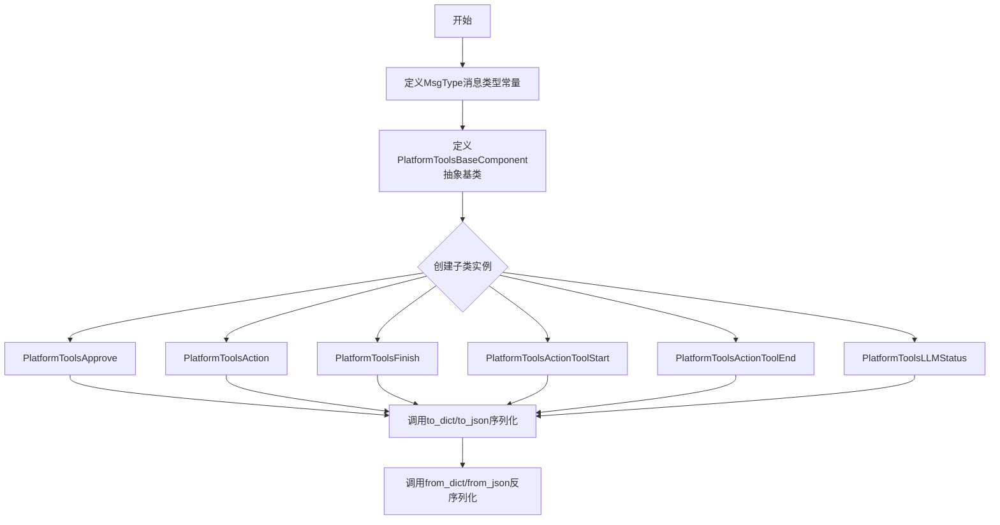
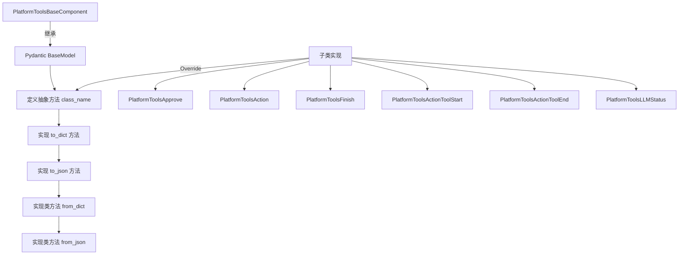
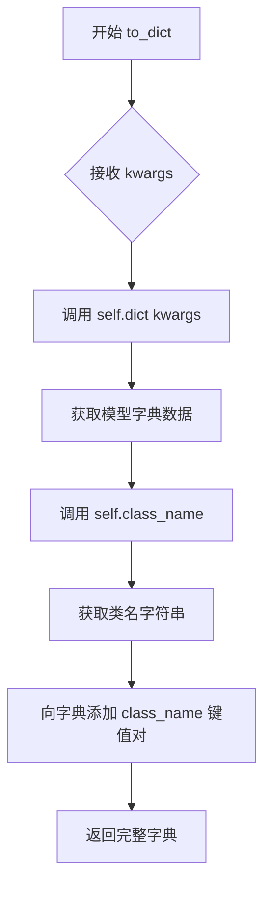
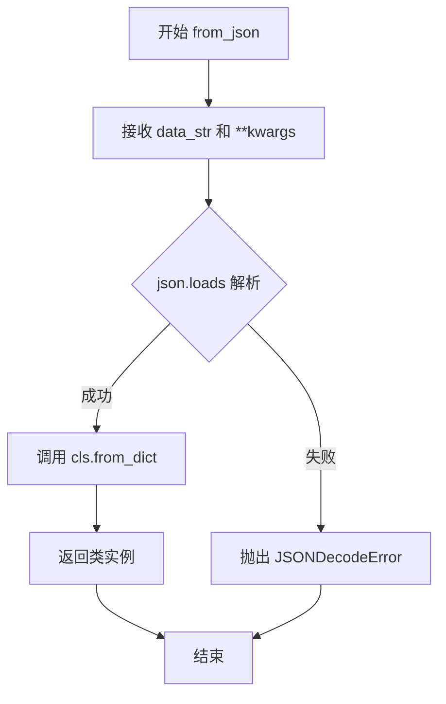
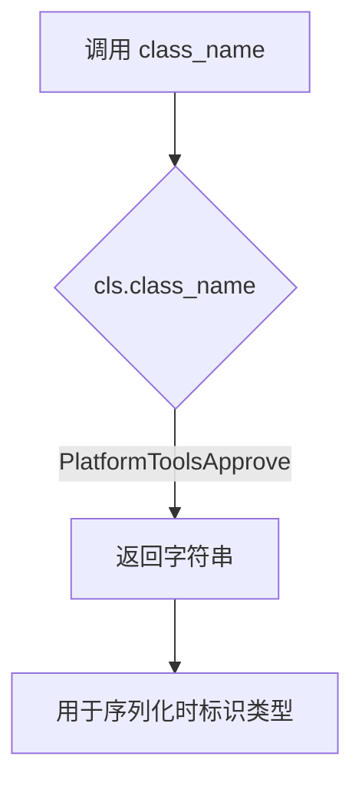
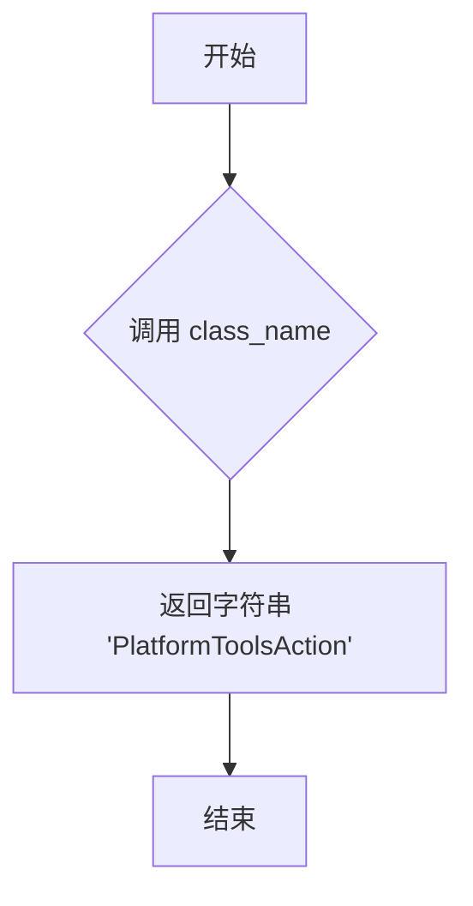
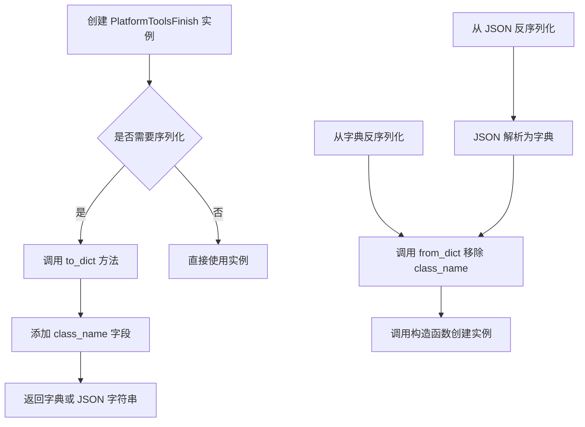
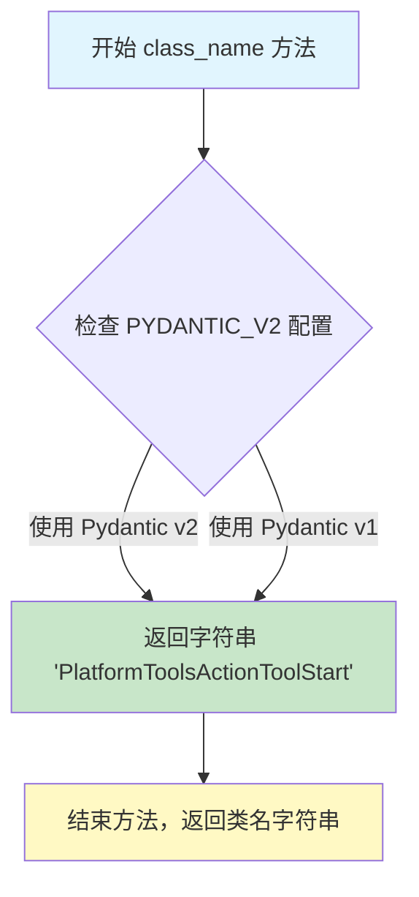
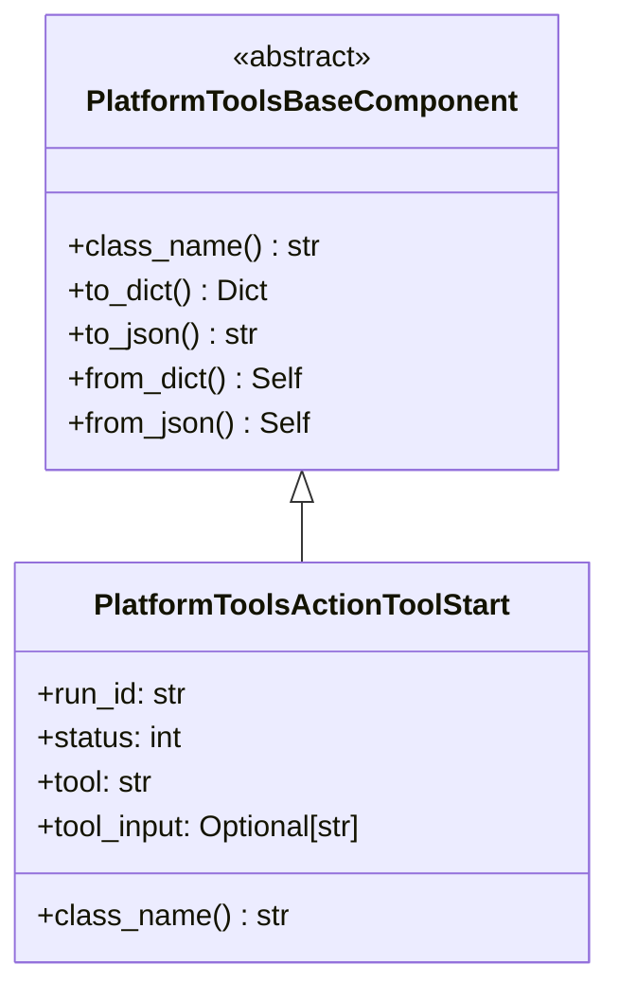
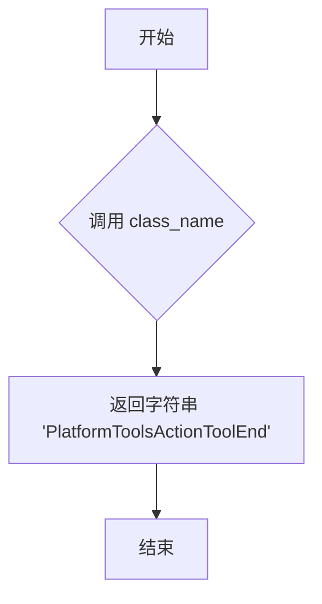

# `Langchain-Chatchat\libs\chatchat-server\langchain_chatchat\agents\platform_tools\schema.py` 详细设计文档

该代码定义了一套用于LLM Agent平台的消息传递和工具调用相关的Pydantic数据模型，包含审批、操作、完成、工具启动/结束、LLM状态等多种工具类型，通过抽象基类实现统一的序列化/反序列化方法。

## 整体流程



## 类结构

```
MsgType (消息类型常量类)
PlatformToolsBaseComponent (抽象基类)
├── PlatformToolsApprove (审批工具)
├── PlatformToolsAction (动作工具)
├── PlatformToolsFinish (完成工具)
├── PlatformToolsActionToolStart (工具启动)
├── PlatformToolsActionToolEnd (工具结束)
└── PlatformToolsLLMStatus (LLM状态)
```

## 全局变量及字段


### `PYDANTIC_V2`
    
标志位，表示是否使用 Pydantic V2 版本

类型：`bool`
    


### `MsgType.TEXT`
    
文本消息类型常量，值为1

类型：`int`
    


### `MsgType.IMAGE`
    
图片消息类型常量，值为2

类型：`int`
    


### `MsgType.AUDIO`
    
音频消息类型常量，值为3

类型：`int`
    


### `MsgType.VIDEO`
    
视频消息类型常量，值为4

类型：`int`
    


### `PlatformToolsBaseComponent.model_config`
    
Pydantic V2 的模型配置，支持任意类型

类型：`ClassVar[ConfigDict]`
    


### `PlatformToolsApprove.run_id`
    
工具执行的运行ID标识符

类型：`str`
    


### `PlatformToolsApprove.status`
    
代理执行状态码，对应 AgentStatus 枚举值

类型：`int`
    


### `PlatformToolsApprove.tool`
    
被审批的工具名称

类型：`str`
    


### `PlatformToolsApprove.tool_input`
    
工具的输入参数，可以是字符串或字典

类型：`Union[str, Dict[str, Any]]`
    


### `PlatformToolsApprove.log`
    
工具审批相关的日志信息

类型：`str`
    


### `PlatformToolsAction.run_id`
    
工具执行动作的运行ID标识符

类型：`str`
    


### `PlatformToolsAction.status`
    
代理执行状态码，对应 AgentStatus 枚举值

类型：`int`
    


### `PlatformToolsAction.tool`
    
执行的动作所属的工具名称

类型：`str`
    


### `PlatformToolsAction.tool_input`
    
工具动作的输入参数，可以是字符串或字典

类型：`Union[str, Dict[str, Any]]`
    


### `PlatformToolsAction.log`
    
工具动作执行的日志信息

类型：`str`
    


### `PlatformToolsFinish.run_id`
    
工具完成执行的运行ID标识符

类型：`str`
    


### `PlatformToolsFinish.status`
    
代理执行完成时的状态码，对应 AgentStatus 枚举值

类型：`int`
    


### `PlatformToolsFinish.return_values`
    
工具执行完成后的返回值字典

类型：`Dict[str, str]`
    


### `PlatformToolsFinish.log`
    
工具完成执行的日志信息

类型：`str`
    


### `PlatformToolsActionToolStart.run_id`
    
工具开始执行时的运行ID标识符

类型：`str`
    


### `PlatformToolsActionToolStart.status`
    
工具开始执行时的代理状态码

类型：`int`
    


### `PlatformToolsActionToolStart.tool`
    
开始执行的工具名称

类型：`str`
    


### `PlatformToolsActionToolStart.tool_input`
    
工具开始执行时的输入参数，可选字段

类型：`Optional[str]`
    


### `PlatformToolsActionToolEnd.run_id`
    
工具结束执行时的运行ID标识符

类型：`str`
    


### `PlatformToolsActionToolEnd.status`
    
工具结束执行时的代理状态码

类型：`int`
    


### `PlatformToolsActionToolEnd.tool`
    
结束执行的工具名称

类型：`str`
    


### `PlatformToolsActionToolEnd.tool_output`
    
工具执行完成后的输出结果

类型：`str`
    


### `PlatformToolsLLMStatus.run_id`
    
LLM状态更新对应的运行ID标识符

类型：`str`
    


### `PlatformToolsLLMStatus.status`
    
LLM当前执行的状态码

类型：`int`
    


### `PlatformToolsLLMStatus.text`
    
LLM生成或处理的文本内容

类型：`str`
    


### `PlatformToolsLLMStatus.message_type`
    
消息类型，默认为文本类型(MsgType.TEXT)

类型：`int`
    
    

## 全局函数及方法


### `PlatformToolsBaseComponent`

这是平台工具的 Pydantic 基础组件类，继承自 `BaseModel`，提供了序列化和反序列化的通用方法，以及抽象的 `class_name()` 方法供子类实现。

参数：暂无实例参数（除继承自 Pydantic BaseModel 的配置）

返回值：暂无返回值

#### 流程图



#### 带注释源码

```python
class PlatformToolsBaseComponent(BaseModel):
    """平台工具基础组件类，继承 Pydantic BaseModel，提供序列化/反序列化能力"""
    
    # Pydantic V2 配置：在 V2 版本下启用任意类型允许
    if PYDANTIC_V2:
        model_config: ClassVar[ConfigDict] = ConfigDict(arbitrary_types_allowed=True)
    else:
        # Pydantic V1 配置
        class Config:
            arbitrary_types_allowed = True

    @classmethod
    @abstractmethod
    def class_name(cls) -> str:
        """获取类名，供子类实现，用于标识组件类型"""

    def to_dict(self, **kwargs: Any) -> Dict[str, Any]:
        """将组件实例转换为字典，包含 class_name 字段"""
        data = self.dict(**kwargs)  # 调用 Pydantic 的 dict 方法
        data["class_name"] = self.class_name()  # 添加类名标识
        return data

    def to_json(self, **kwargs: Any) -> str:
        """将组件实例转换为 JSON 字符串"""
        data = self.to_dict(**kwargs)
        return json.dumps(data, ensure_ascii=False)  # 确保中文正常显示

    # TODO: 返回类型注解在当前 mypy 版本不支持
    @classmethod
    def from_dict(cls, data: Dict[str, Any], **kwargs: Any) -> Self:
        """从字典数据创建组件实例，移除 class_name 后实例化"""
        if isinstance(kwargs, dict):
            data.update(kwargs)

        data.pop("class_name", None)  # 移除 class_name 避免与模型字段冲突
        return cls(**data)

    @classmethod
    def from_json(cls, data_str: str, **kwargs: Any) -> Self:
        """从 JSON 字符串创建组件实例"""
        data = json.loads(data_str)
        return cls.from_dict(data, **kwargs)
```


### PlatformToolsBaseComponent.to_dict

将当前平台工具组件实例转换为字典格式，并在字典中附加类名称信息。

参数：

- `**kwargs`：`Any`，可选关键字参数，这些参数会直接传递给 Pydantic 模型的 `dict()` 方法，用于控制字典输出的格式（如是否包含默认值、排除字段等）

返回值：`Dict[str, Any]`，返回包含模型所有字段值的字典，并在键 `"class_name"` 中存储当前类的名称字符串

#### 流程图



#### 带注释源码

```python
def to_dict(self, **kwargs: Any) -> Dict[str, Any]:
    """
    将当前组件实例转换为字典格式。
    
    内部实现分为两步：
    1. 调用 Pydantic 基类的 dict 方法将模型字段序列化为字典
    2. 动态添加 class_name 字段，用于标识当前对象的类型
    
    参数:
        **kwargs: 传递给 Pydantic dict() 的可选参数，如 exclude、include 等
        
    返回:
        包含所有字段值及 class_name 的字典
    """
    # Step 1: 调用 Pydantic 模型的 dict 方法，将所有字段转为字典
    # kwargs 会传递给 dict 方法，如可以传入 exclude={'field_name'} 来排除特定字段
    data = self.dict(**kwargs)
    
    # Step 2: 获取当前类的名称，用于在序列化后标识对象类型
    # 由子类实现，返回如 'PlatformToolsApprove' 等字符串
    data["class_name"] = self.class_name()
    
    # 返回包含 class_name 的完整字典数据
    return data
```


### `PlatformToolsBaseComponent.to_json`

将平台工具基础组件对象序列化为 JSON 字符串。该方法首先调用 `to_dict` 方法将对象转换为字典，然后使用 `json.dumps` 将字典序列化为 JSON 字符串，支持任意关键字参数传递到底层转换方法中。

参数：

- `**kwargs`：`Any`，可选关键字参数，这些参数会传递给 `to_dict` 方法，用于控制字典序列化行为（例如排除某些字段、包含额外字段等）

返回值：`str`，返回序列化后的 JSON 字符串，确保中文字符不被转义（`ensure_ascii=False`）

#### 流程图

```mermaid
flowchart TD
    A[开始 to_json] --> B[接收 kwargs 参数]
    B --> C[调用 self.to_dict(**kwargs)]
    C --> D[获取包含 class_name 的字典数据]
    D --> E[调用 json.dumps 将字典序列化为JSON字符串]
    E --> F[ensure_ascii=False 保持中文显示]
    F --> G[返回 JSON 字符串]
```

#### 带注释源码

```python
def to_json(self, **kwargs: Any) -> str:
    """
    将组件实例序列化为 JSON 字符串。
    
    该方法是平台工具组件的序列化入口点，通过组合 to_dict 方法和 json.dumps
    实现对象的 JSON 序列化。支持任意关键字参数传递给底层 to_dict 方法，
    以满足不同的序列化需求。
    
    参数:
        **kwargs: Any - 可变关键字参数，将直接传递给 to_dict 方法
                   常见的 kwargs 包括：
                   - exclude: 排除的字段集合
                   - include: 只包含的字段集合
                   - by_alias: 是否使用别名等
    
    返回:
        str: JSON 格式的字符串，使用 ensure_ascii=False 确保非 ASCII 
            字符（如中文）能够正常显示而不被转义
    
    示例:
        >>> component = PlatformToolsFinish(...)
        >>> json_str = component.to_json()
        >>> json_str = component.to_json(exclude={'log'})  # 排除 log 字段
    """
    # 第一步：调用 to_dict 方法将 Pydantic 模型转换为字典
    # to_dict 内部会调用 self.dict(**kwargs) 并添加 class_name 字段
    data = self.to_dict(**kwargs)
    
    # 第二步：使用 json.dumps 将字典序列化为 JSON 字符串
    # ensure_ascii=False 确保中文字符不被转义为 Unicode 编码
    return json.dumps(data, ensure_ascii=False)
```


### `PlatformToolsBaseComponent.from_dict`

该类方法用于将字典数据反序列化为平台工具基类实例，通过合并额外参数、移除类名字段后调用Pydantic模型构造器创建对象实例。

参数：

- `cls`：隐含的类参数，表示调用该方法的类本身
- `data`：`Dict[str, Any]`，包含待反序列化的字典数据
- `kwargs`：`**Any`，可选的额外关键字参数，将被合并到data中

返回值：`Self`，返回调用类的新实例（PlatformToolsBaseComponent或其子类）

#### 流程图

```mermaid
flowchart TD
    A[开始 from_dict] --> B{kwargs 是 dict?}
    B -->|是| C[将 kwargs 更新到 data]
    B -->|否| D[跳过更新]
    C --> E[从 data 中移除 class_name 键]
    D --> E
    E --> F[调用 cls(**data) 创建实例]
    F --> G[返回实例]
```

#### 带注释源码

```python
@classmethod
def from_dict(cls, data: Dict[str, Any], **kwargs: Any) -> Self:  # type: ignore
    """
    从字典数据创建类实例的反序列化方法
    
    Args:
        cls: 类方法隐含参数，代表调用此方法的类
        data: 包含实例数据的字典
        **kwargs: 额外的关键字参数，会合并到data中
    
    Returns:
        Self: 返回类的新实例
    """
    # 检查kwargs是否为字典类型，若是则将其合并到data中
    if isinstance(kwargs, dict):
        data.update(kwargs)

    # 移除class_name字段，该字段用于序列化时标识类名，反序列化时不需要
    data.pop("class_name", None)
    
    # 使用处理后的data字典通过Pydantic的构造器创建类实例并返回
    return cls(**data)
```


### `PlatformToolsBaseComponent.from_json`

将JSON格式的字符串反序列化为类实例对象。通过解析JSON字符串为字典，再调用`from_dict`方法完成对象的构建。

参数：

-  `data_str`：`str`，待反序列化的JSON字符串
-  `**kwargs`：`Any`，传递给`from_dict`的可选关键字参数

返回值：`Self`，返回调用类（`cls`）的实例对象

#### 流程图



#### 带注释源码

```python
@classmethod
def from_json(cls, data_str: str, **kwargs: Any) -> Self:  # type: ignore
    """
    从JSON字符串反序列化创建类实例。
    
    Args:
        data_str: JSON格式的字符串，包含对象数据
        **kwargs: 额外的关键字参数，会传递给from_dict方法
        
    Returns:
        类的实例对象
    """
    # 将JSON字符串解析为Python字典
    data = json.loads(data_str)
    
    # 调用from_dict类方法，传入解析后的字典和额外参数
    return cls.from_dict(data, **kwargs)
```


# 平台工具组件设计文档

## 一、代码概述

该代码定义了一套基于Pydantic的平台工具组件体系，用于在多代理系统中传递和审批工具调用请求、动作执行、状态更新等消息，其中`PlatformToolsApprove`类专门用于表示工具输入的审批（批准或拒绝）操作。

## 二、文件整体运行流程

```
┌─────────────────────────────────────────────────────────────────┐
│                     PlatformToolsBaseComponent                  │
│  (抽象基类，定义序列化/反序列化接口 class_name/to_dict/to_json)   │
└─────────────────────────────────────────────────────────────────┘
                              │
                              ▼
┌─────────────────────────────────────────────────────────────────┐
│  PlatformToolsApprove  │  PlatformToolsAction                   │
│  工具审批组件          │  工具动作组件                            │
├─────────────────────────────────────────────────────────────────┤
│  PlatformToolsFinish   │  PlatformToolsActionToolStart          │
│  工具完成组件          │  工具开始组件                            │
├─────────────────────────────────────────────────────────────────┤
│  PlatformToolsActionToolEnd │  PlatformToolsLLMStatus           │
│  工具结束组件          │  LLM状态组件                             │
└─────────────────────────────────────────────────────────────────┘
```

## 三、类详细信息

### 3.1 全局变量和枚举

| 名称 | 类型 | 描述 |
|------|------|------|
| `MsgType` | 类 | 消息类型枚举定义，包含TEXT=1, IMAGE=2, AUDIO=3, VIDEO=4 |
| `PYDANTIC_V2` | 布尔值 | Pydantic版本标志（从langchain_chatchat导入） |

### 3.2 PlatformToolsBaseComponent 抽象基类

| 字段/方法 | 类型 | 描述 |
|-----------|------|------|
| `class_name()` | 类方法（抽象） | 获取类名的抽象方法 |
| `to_dict()` | 实例方法 | 将对象转换为字典，包含class_name |
| `to_json()` | 实例方法 | 将对象转换为JSON字符串 |
| `from_dict()` | 类方法 | 从字典创建实例 |
| `from_json()` | 类方法 | 从JSON字符串创建实例 |

### 3.3 PlatformToolsApprove 类

| 字段 | 类型 | 描述 |
|------|------|------|
| `run_id` | str | 运行时唯一标识符 |
| `status` | int | Agent状态码 |
| `tool` | str | 工具名称 |
| `tool_input` | Union[str, Dict[str, Any]] | 工具输入参数 |
| `log` | str | 日志信息 |

## 四、PlatformToolsApprove 详细信息

### `PlatformToolsApprove.class_name`

返回该类的名称标识符，用于序列化时的类型识别。

#### 参数

无

#### 返回值

- `str`，返回类名 `"PlatformToolsApprove"`

#### 流程图



#### 带注释源码

```python
@classmethod
def class_name(cls) -> str:
    """
    获取当前类的名称标识符。
    
    该方法作为工厂方法被PlatformToolsBaseComponent的to_dict/to_json
    方法调用，用于在序列化时保存实际类型信息，实现反序列化时的
    类型恢复功能。
    
    Returns:
        str: 类的字符串名称，用于类型标识和反序列化
    """
    return "PlatformToolsApprove"
```

## 五、关键组件信息

| 组件名称 | 一句话描述 |
|----------|------------|
| `PlatformToolsBaseComponent` | 所有平台工具组件的抽象基类，提供序列化/反序列化能力 |
| `PlatformToolsApprove` | 工具输入审批组件，用于批准或拒绝工具调用 |
| `PlatformToolsAction` | 工具动作执行组件，记录工具执行状态 |
| `PlatformToolsFinish` | 工具完成组件，包含返回值的最终结果 |
| `PlatformToolsActionToolStart` | 工具开始执行组件，标记工具启动 |
| `PlatformToolsActionToolEnd` | 工具结束执行组件，标记工具完成 |
| `PlatformToolsLLMStatus` | LLM状态更新组件，传递LLM生成的状态信息 |

## 六、潜在技术债务与优化空间

1. **类型注解不完整**：`from_dict`和`from_json`方法的返回值类型注解使用了`# type: ignore`注释，说明当前mypy版本不支持该返回类型，建议后续升级mypy并完善类型注解。

2. **status字段语义模糊**：代码中`status`字段注释为`# AgentStatus`，但实际类型为`int`，建议使用Enum类型替代硬编码的int，增加类型安全性。

3. **tool_input类型宽泛**：`Union[str, Dict[str, Any]]`类型较为宽泛，可能导致运行时类型不确定性，建议根据具体工具定义更精确的输入模型。

4. **缺乏验证逻辑**：各组件类中没有使用Pydantic的field_validator进行输入验证，建议添加必要的业务校验逻辑。

## 七、其它项目

### 设计目标与约束

- **设计目标**：建立统一的平台工具消息传递格式，支持序列化/反序列化，实现跨组件的类型识别
- **约束**：必须继承`PlatformToolsBaseComponent`，实现`class_name`方法

### 错误处理与异常设计

- `from_dict`和`from_json`方法未显式处理JSON解析异常和Pydantic验证错误，调用方需自行处理`ValidationError`和`JSONDecodeError`

### 数据流与状态机

- 该组件体系遵循状态流转模式：`ActionToolStart` → `ActionToolEnd` → `Action` → `Finish`
- `Approve`组件用于在`Action`执行前进行审批决策

### 外部依赖与接口契约

- **依赖库**：`pydantic`, `openai`, `typing_extensions`, `langchain_chatchat.utils`
- **接口契约**：所有子类必须实现`class_name()`类方法，返回字符串类型的类标识符


### `PlatformToolsAction.class_name`

这是一个类方法，返回当前类的名称字符串，用于标识 PlatformToolsAction 组件的类型。

参数： 无（类方法，隐式接收 `cls` 参数）

返回值： `str`，返回类名字符串 `"PlatformToolsAction"`

#### 流程图



#### 带注释源码

```python
@classmethod
def class_name(cls) -> str:
    """
    获取当前类的名称。
    
    这是一个类方法，使用 @classmethod 装饰器定义。
    它返回该类的标识名称，用于序列化/反序列化时识别数据类型。
    
    参数:
        cls: Python类方法隐式参数，代表类本身
        
    返回值:
        str: 返回类名字符串 'PlatformToolsAction'
    """
    return "PlatformToolsAction"
```


### `PlatformToolsFinish`

表示 Agent 任务完成时的工具组件，包含运行 ID、状态、返回值和日志信息。

参数：

- `run_id`：`str`，任务运行唯一标识
- `status`：`int`，代理状态（AgentStatus）
- `return_values`：`Dict[str, str]`，返回的键值对数据
- `log`：`str`，执行日志信息

返回值：`PlatformToolsFinish`，返回该类实例，表示任务完成状态

#### 流程图



#### 带注释源码

```python
class PlatformToolsFinish(PlatformToolsBaseComponent):
    """AgentFinish with run and thread metadata."""
    # 任务运行唯一标识
    run_id: str
    # 代理状态枚举值
    status: int  # AgentStatus
    # 返回的键值对数据
    return_values: Dict[str, str]
    # 执行日志信息
    log: str

    @classmethod
    def class_name(cls) -> str:
        """获取类名称"""
        return "PlatformToolsFinish"
```


### `PlatformToolsActionToolStart.class_name`

获取当前类的名称字符串，用于标识平台工具动作工具启动状态的类名。

参数：

- `cls`：`type[PlatformToolsActionToolStart]`，类本身（Python类方法的标准第一个参数）

返回值：`str`，返回类名称字符串 "PlatformToolsActionToolStart"

#### 流程图



#### 带注释源码

```python
@classmethod
def class_name(cls) -> str:
    """Get class name."""
    # 这是一个类方法（使用 @classmethod 装饰器）
    # 第一个参数 cls 代表类本身，调用时无需显式传入
    # 返回该类的字符串名称，用于序列化/反序列化时的类型标识
    return "PlatformToolsActionToolStart"
```

---

### 补充信息

#### 类整体信息

**类名**：`PlatformToolsActionToolStart`

**父类**：`PlatformToolsBaseComponent`

**描述**：平台工具动作工具启动状态类，用于在 LangChain Agent 执行过程中标识工具开始调用的状态。

**类字段**：

| 字段名称 | 类型 | 描述 |
|---------|------|------|
| `run_id` | `str` | 运行时唯一标识 ID |
| `status` | `int` | Agent 执行状态（AgentStatus 枚举值） |
| `tool` | `str` | 被调用的工具名称 |
| `tool_input` | `Optional[str] = None` | 工具输入参数（可选） |

#### 技术债务与优化空间

1. **类型提示不完整**：`tool_input` 字段在基类 `PlatformToolsAction` 中是 `Union[str, Dict[str, Any]]` 类型，但在 `PlatformToolsActionToolStart` 中被简化为 `Optional[str]`，这种不一致可能导致类型安全问题
2. **缺少文档注释**：类字段缺少详细的文档说明，建议增加字段用途、取值范围等注释
3. **抽象方法设计**：基类 `PlatformToolsBaseComponent` 中将 `class_name()` 定义为 `@abstractmethod`，但每个子类实现逻辑完全相同（仅返回硬编码的字符串），可以考虑使用 `__name__` 属性或元类自动生成，避免重复代码

#### 与基类的关系




### PlatformToolsActionToolEnd.class_name

这是一个类方法，返回当前类的名称字符串，用于类标识和序列化场景。

参数：

- `cls`：`type[PlatformToolsActionToolEnd]`，类本身（隐式参数）

返回值：`str`，返回类名字符串 "PlatformToolsActionToolEnd"

#### 流程图



#### 带注释源码

```python
@classmethod
def class_name(cls) -> str:
    """
    获取类名称的类方法
    
    该方法是一个类方法（@classmethod），无需实例化即可调用。
    主要用途：
    1. 在序列化过程中标识当前类的类型
    2. 配合 PlatformToolsBaseComponent 的 to_dict/from_dict 方法使用
    3. 用于运行时类型识别和反射
    
    Returns:
        str: 类名字符串，当前返回 "PlatformToolsActionToolEnd"
    
    Example:
        >>> PlatformToolsActionToolEnd.class_name()
        'PlatformToolsActionToolEnd'
    """
    return "PlatformToolsActionToolEnd"
```


### `PlatformToolsLLMStatus.class_name`

这是一个类方法，用于返回当前类的名称字符串 "PlatformToolsLLMStatus"，通常用于序列化时标识数据类型。

参数：

- `cls`：`<隐式>`, 类方法隐式接收的类本身参数，代表当前类 `PlatformToolsLLMStatus`

返回值：`str`，返回类名字符串 "PlatformToolsLLMStatus"

#### 流程图

```mermaid
flowchart TD
    A[方法调用] --> B{cls 参数}
    B --> C[返回字符串 "PlatformToolsLLMStatus"]
    C --> D[方法结束]
    
    style A fill:#e1f5fe
    style C fill:#c8e6c9
    style D fill:#ffcdd2
```

#### 带注释源码

```python
@classmethod
def class_name(cls) -> str:
    """
    获取当前类的名称。
    
    Returns:
        str: 类名字符串，用于标识 PlatformToolsLLMStatus 类的身份
    """
    return "PlatformToolsLLMStatus"
```

---

**补充说明：**

| 项目 | 说明 |
|------|------|
| **所属类** | `PlatformToolsLLMStatus` |
| **类定义位置** | 继承自 `PlatformToolsBaseComponent` 抽象基类 |
| **设计目的** | 实现基类定义的抽象方法，用于运行时类识别和序列化/反序列化时的类型标识 |
| **调用场景** | 通常由 `to_dict()` 和 `to_json()` 方法自动调用，将类名写入序列化数据中 |
| **技术债务** | 无明显技术债务，方法实现简洁高效 |
| **优化空间** | 当前实现已经是最优的静态字符串返回，无优化必要 |

## 关键组件


### MsgType

消息类型枚举类，定义了四种基本消息类型常量：TEXT(文本)、IMAGE(图像)、AUDIO(音频)、VIDEO(视频)，用于标识不同类型的消息内容。

### PlatformToolsBaseComponent

平台工具基础组件抽象类，继承自OpenAI的BaseModel，提供序列化与反序列化的通用功能。包括to_dict、to_json、from_dict、from_json等方法，支持将组件对象转换为字典或JSON格式，以及从字典或JSON字符串恢复对象。

### PlatformToolsApprove

工具输入审批组件，用于表示需要审批的工具输入请求。包含run_id(运行标识)、status(代理状态)、tool(工具名称)、tool_input(工具输入参数)、log(日志信息)等字段。

### PlatformToolsAction

代理动作组件，表示代理执行的工具动作。包含run_id、status、tool、tool_input、log等字段，与PlatformToolsApprove结构相似但用途不同。

### PlatformToolsFinish

代理完成组件，表示代理执行完成并返回结果。包含run_id、status、return_values(返回值字典)、log等字段，用于传递代理的最终执行结果。

### PlatformToolsActionToolStart

工具开始执行组件，表示工具开始执行的时刻。包含run_id、status、tool、tool_input等字段，用于记录工具执行的起始状态。

### PlatformToolsActionToolEnd

工具结束执行组件，表示工具执行完成。包含run_id、status、tool、tool_output(工具输出内容)等字段，用于记录工具执行的结果。

### PlatformToolsLLMStatus

LLM状态组件，用于传递大语言模型生成的状态信息。包含run_id、status、text(文本内容)、message_type(消息类型，默认为TEXT)等字段，支持实时流式输出LLM的生成内容。


## 问题及建议


### 已知问题

-   **类型定义不一致**：`MsgType` 类使用普通类属性定义整数值，但代码中已导入 `Enum` 和 `auto`，却未使用，导致常量定义不规范
-   **类注释与实际功能不匹配**：`PlatformToolsAction` 类的文档注释为 "AgentFinish with run and thread metadata"，但从字段定义看更像是动作请求而非完成状态
-   **类间代码重复**：`PlatformToolsApprove` 和 `PlatformToolsAction` 两个类的字段定义完全相同，存在明显冗余
-   **类型注解不完整**：status 字段注释为 "# AgentStatus"，表明应有对应的枚举类型，但代码中未定义或导入 AgentStatus 枚举
-   **序列化方法潜在风险**：`to_dict` 方法递归调用 `self.dict()`，对于复杂嵌套对象可能产生无限递归或丢失数据
-   **魔法数字**：多个类中使用 `status: int` 而非枚举类型，降低了代码可读性和类型安全性

### 优化建议

-   将 `MsgType` 改为正式的 `Enum` 类定义，提升类型安全性和可维护性
-   提取 `PlatformToolsApprove` 和 `PlatformToolsAction` 的公共字段到基类或混入类中，消除代码重复
-   定义 `AgentStatus` 枚举并替换所有 `status: int` 字段的类型注解
-   在 `PlatformToolsBaseComponent` 中添加深拷贝或自定义序列化方法，避免嵌套对象的序列化问题
-   补充完整的文档字符串，明确每个字段的业务含义和约束条件
-   考虑添加 `__eq__`、`__hash__` 和 `__repr__` 方法，提升调试体验
-   添加 `__all__` 变量控制模块导出接口

## 其它


### 设计目标与约束

本模块的设计目标是为AI代理平台提供一套统一的工具调用状态管理框架，通过标准化的Pydantic模型实现跨组件的状态传递和序列化。主要约束包括：1）必须兼容Pydantic v1和v2版本；2）所有工具组件类必须继承自PlatformToolsBaseComponent；3）支持JSON序列化和反序列化；4）保持类结构简洁以便于网络传输。

### 错误处理与异常设计

本模块主要依赖Pydantic的验证机制处理数据校验。当传入无效数据时，Pydantic会抛出ValidationError。from_dict和from_json方法在解析失败时会向上传播JSONDecodeError。TODO注释标注了当前mypy版本不支持返回类型注解的问题，需要在未来版本中修复。

### 数据流与状态机

各工具组件类形成了一个状态流转链条：PlatformToolsActionToolStart表示工具开始执行 → PlatformToolsLLMStatus表示LLM响应状态 → PlatformToolsAction表示工具动作 → PlatformToolsFinish表示工具完成。PlatformToolsApprove用于在执行前审批工具调用请求。每个组件都包含run_id用于追踪同一轮执行的上下文。

### 外部依赖与接口契约

主要依赖包括：1）openai.BaseModel提供Pydantic基类；2）typing_extensions.Self用于Python 3.11+的类型注解；3）langchain_chatchat.utils中的PYDANTIC_V2标志用于版本检测；4）pydantic.ConfigDict用于v2配置。所有子类必须实现class_name()抽象方法返回类名字符串。

### 安全性考虑

代码中未包含敏感数据处理逻辑，但需要注意tool_input和log字段可能包含用户输入内容，在序列化时应进行适当过滤。JSON序列化时设置ensure_ascii=False以支持Unicode字符。

### 性能考虑

to_dict和to_json方法每次调用都会创建新字典，建议在高频调用场景下缓存结果。from_dict方法中使用update合并kwargs可能产生额外内存开销。

### 配置说明

主要通过PYDANTIC_V2标志控制Pydantic版本兼容性。ConfigDict(arbitrary_types_allowed=True)允许使用复杂类型如Dict、List等。

### 使用示例

```python
# 创建工具完成对象
finish = PlatformToolsFinish(
    run_id=str(uuid.uuid4()),
    status=200,
    return_values={"result": "success"},
    log="Tool execution completed"
)

# 序列化为JSON
json_str = finish.to_json()

# 从JSON反序列化
restored = PlatformToolsFinish.from_json(json_str)
```

### 测试策略

建议测试场景包括：1）各组件类的序列化/反序列化完整性；2）Pydantic v1/v2兼容性；3）class_name()方法返回值正确性；4）from_dict方法中kwargs合并逻辑；5）无效数据类型时的验证失败处理。

### 版本历史和变更记录

当前版本为初始版本，包含6个工具组件类和1个消息类型枚举类。TODO标记了mypy类型注解的已知限制。


    