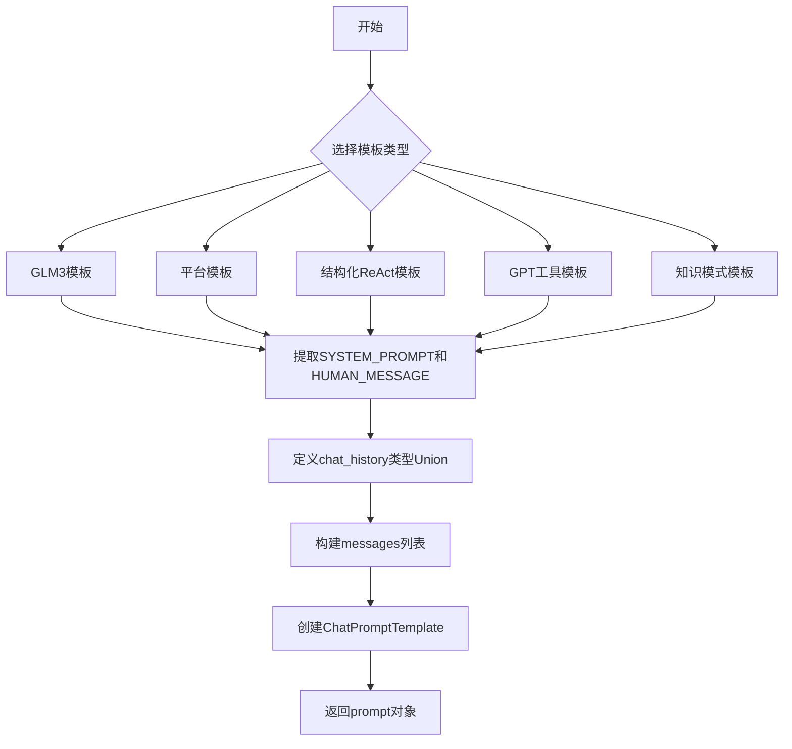
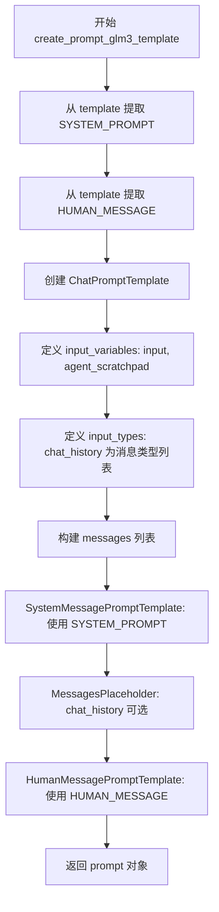
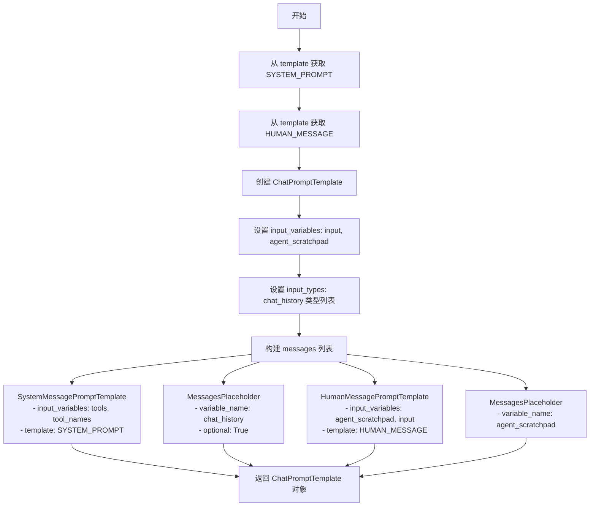
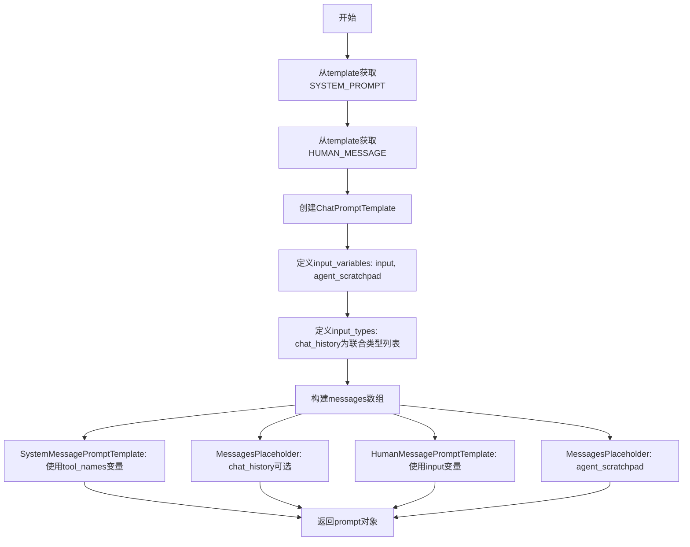
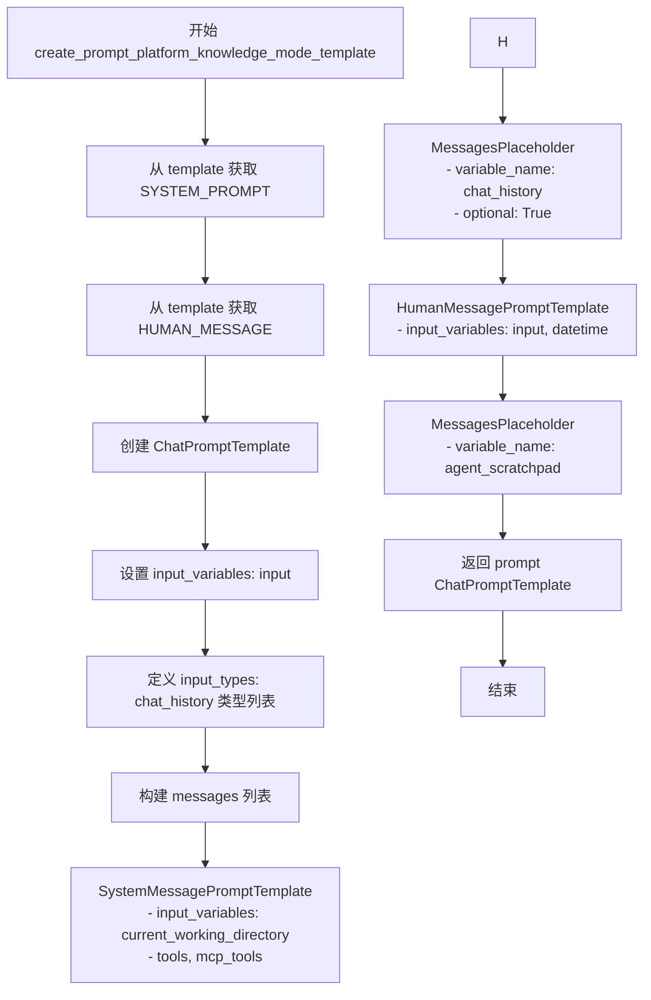

# `Langchain-Chatchat\libs\chatchat-server\langchain_chatchat\agents\react\create_prompt_template.py` 详细设计文档

该模块提供了多个用于创建不同类型聊天提示模板（ChatPromptTemplate）的工厂函数，支持GLM3模型、平台模型、结构化ReAct、GPT工具和知识模式等多种场景，每个函数通过组合SystemMessage、HumanMessage和MessagesPlaceholder来构建完整的对话提示结构。

## 整体流程



## 类结构

```
模块级函数 (无类)
├── create_prompt_glm3_template
├── create_prompt_platform_template
├── create_prompt_structured_react_template
├── create_prompt_gpt_tool_template
└── create_prompt_platform_knowledge_mode_template
```

## 全局变量及字段


### `langchain_core.messages`
    
LangChain核心消息模块，包含各种消息类型定义

类型：`module`
    


### `langchain_core.prompts`
    
LangChain核心提示模块，包含提示模板相关类

类型：`module`
    


### `ChatPromptTemplate`
    
LangChain聊天提示模板类，用于构建聊天模型的提示

类型：`class`
    


### `Field`
    
Pydantic字段定义函数，用于数据验证和 schema 生成

类型：`function`
    


### `model_schema`
    
模型 schema 生成函数

类型：`function`
    


### `typing`
    
Python类型提示模块

类型：`module`
    


### `SYSTEM_PROMPT`
    
从模板字典中提取的系统提示内容

类型：`str`
    


### `HUMAN_MESSAGE`
    
从模板字典中提取的用户消息模板内容

类型：`str`
    


### `prompt`
    
构建完成的聊天提示模板对象，用于与语言模型交互

类型：`ChatPromptTemplate`
    


    

## 全局函数及方法


### `create_prompt_glm3_template`

该函数用于创建支持 GLM3 模型的聊天提示模板（ChatPromptTemplate），通过 langchain 框架定义系统消息、聊天历史和用户输入的格式化结构，以支持多轮对话和 Agent 交互。

参数：

- `model_name`：`str`，模型名称参数，当前函数中未直接使用，仅作为接口签名保留
- `template`：`dict`，模板字典，需包含 "SYSTEM_PROMPT" 和 "HUMAN_MESSAGE" 两个键，分别定义系统提示词和用户消息模板

返回值：`ChatPromptTemplate`，langchain 的聊天提示模板对象，包含系统消息、聊天历史占位符和用户消息，用于构建完整的对话上下文

#### 流程图



#### 带注释源码

```python
def create_prompt_glm3_template(model_name: str, template: dict):
    """
    创建支持 GLM3 模型的聊天提示模板
    
    Args:
        model_name: 模型名称（当前未使用，保留接口兼容性）
        template: 模板字典，需包含 SYSTEM_PROMPT 和 HUMAN_MESSAGE 键
    
    Returns:
        ChatPromptTemplate: 配置好的 langchain 聊天提示模板
    """
    # 从模板字典中提取系统提示词
    SYSTEM_PROMPT = template.get("SYSTEM_PROMPT")
    # 从模板字典中提取用户消息模板
    HUMAN_MESSAGE = template.get("HUMAN_MESSAGE")
    
    # 创建 ChatPromptTemplate 对象
    prompt = ChatPromptTemplate(
        # 定义输入变量：用户输入和 Agent 思维过程
        input_variables=["input", "agent_scratchpad"],
        # 定义输入类型：聊天历史为多种消息类型的列表
        input_types={
            "chat_history": typing.List[
                typing.Union[
                    langchain_core.messages.ai.AIMessage,          # AI 消息
                    langchain_core.messages.human.HumanMessage,    # 人类消息
                    langchain_core.messages.chat.ChatMessage,     # 通用聊天消息
                    langchain_core.messages.system.SystemMessage,  # 系统消息
                    langchain_core.messages.function.FunctionMessage,  # 函数调用结果消息
                    langchain_core.messages.tool.ToolMessage,     # 工具调用结果消息
                ]
            ]
        },
        # 消息列表结构
        messages=[
            # 系统消息模板：包含工具信息
            langchain_core.prompts.SystemMessagePromptTemplate(
                prompt=langchain_core.prompts.PromptTemplate(
                    input_variables=["tools"],  # 工具列表作为输入变量
                    template=SYSTEM_PROMPT       # 系统提示词模板
                )
            ),
            # 聊天历史占位符（可选）
            langchain_core.prompts.MessagesPlaceholder(
                variable_name="chat_history", optional=True
            ),
            # 用户消息模板：包含输入和 Agent 思维过程
            langchain_core.prompts.HumanMessagePromptTemplate(
                prompt=langchain_core.prompts.PromptTemplate(
                    input_variables=["agent_scratchpad", "input"],
                    template=HUMAN_MESSAGE,
                )
            ),
        ],
    )
    return prompt
```


### `create_prompt_platform_template`

该函数用于创建平台特定的聊天提示模板（ChatPromptTemplate），通过提取模板字典中的系统提示和人类消息，构建包含系统消息、聊天历史占位符、人类消息和智能体工作区占位符的完整提示结构，适用于支持工具调用但不需要工具描述的模型。

参数：

- `model_name`：`str`，模型名称，当前函数中未直接使用，但作为接口参数保留以保持与其他创建提示模板函数的一致性
- `template`：`dict`，模板字典，包含 `SYSTEM_PROMPT` 和 `HUMAN_MESSAGE` 两个键，分别对应系统提示模板和人类消息模板

返回值：`ChatPromptTemplate`，langchain 的聊天提示模板对象，包含系统消息、聊天历史占位符、人类消息和智能体工作区占位符

#### 流程图

```mermaid
flowchart TD
    A[开始] --> B[从template字典提取SYSTEM_PROMPT]
    B --> C[从template字典提取HUMAN_MESSAGE]
    C --> D[创建ChatPromptTemplate<br/>input_variables=["input"]]
    D --> E[添加SystemMessagePromptTemplate<br/>使用SYSTEM_PROMPT]
    E --> F[添加MessagesPlaceholder<br/>variable_name="chat_history" optional=True]
    F --> G[添加HumanMessagePromptTemplate<br/>使用HUMAN_MESSAGE]
    G --> H[添加MessagesPlaceholder<br/>variable_name="agent_scratchpad"]
    H --> I[返回prompt对象]
    I --> J[结束]
```

#### 带注释源码

```python
def create_prompt_platform_template(model_name: str, template: dict):
    """
    创建平台特定的聊天提示模板
    
    Args:
        model_name: 模型名称（当前未使用，保留接口一致性）
        template: 包含SYSTEM_PROMPT和HUMAN_MESSAGE的模板字典
    
    Returns:
        ChatPromptTemplate: 配置好的聊天提示模板对象
    """
    
    # 从模板字典中提取系统提示内容
    # SYSTEM_PROMPT 定义了AI助手的系统行为和角色设定
    SYSTEM_PROMPT = template.get("SYSTEM_PROMPT")
    
    # 从模板字典中提取人类消息模板
    # HUMAN_MESSAGE 定义了用户输入的模板格式
    HUMAN_MESSAGE = template.get("HUMAN_MESSAGE")
    
    # 创建ChatPromptTemplate聊天提示模板
    # input_variables定义模板中需要填充的变量，此处只有"input"
    prompt = ChatPromptTemplate(
        input_variables=["input"],
        # 定义输入类型，chat_history是一个消息列表
        # 支持多种消息类型：AI消息、人类消息、聊天消息、系统消息、功能消息、工具消息
        input_types={
            "chat_history": typing.List[
                typing.Union[
                    langchain_core.messages.ai.AIMessage,           # AI回复消息
                    langchain_core.messages.human.HumanMessage,     # 人类输入消息
                    langchain_core.messages.chat.ChatMessage,      # 通用聊天消息
                    langchain_core.messages.system.SystemMessage,  # 系统消息
                    langchain_core.messages.function.FunctionMessage,  # 功能调用返回消息
                    langchain_core.messages.tool.ToolMessage,       # 工具调用返回消息
                ]
            ]
        },
        # 消息列表定义了对话的结构和顺序
        messages=[
            # 1. 系统消息模板
            # 使用SYSTEM_PROMPT作为系统提示，不包含输入变量
            langchain_core.prompts.SystemMessagePromptTemplate(
                prompt=langchain_core.prompts.PromptTemplate(
                    input_variables=[], template=SYSTEM_PROMPT
                )
            ),
            
            # 2. 聊天历史占位符
            # 可选的聊天历史，允许传入之前的对话记录
            # optional=True表示该字段可选
            langchain_core.prompts.MessagesPlaceholder(
                variable_name="chat_history", optional=True
            ),
            
            # 3. 人类消息模板
            # 使用HUMAN_MESSAGE模板，变量为"input"（用户当前输入）
            langchain_core.prompts.HumanMessagePromptTemplate(
                prompt=langchain_core.prompts.PromptTemplate(
                    input_variables=["input"],
                    template=HUMAN_MESSAGE,
                )
            ),
            
            # 4. 智能体工作区占位符
            # 用于插入智能体的中间思考过程或工具调用结果
            langchain_core.prompts.MessagesPlaceholder(variable_name="agent_scratchpad"),
        ],
    )
    
    # 返回构建好的ChatPromptTemplate对象
    return prompt
```


### `create_prompt_structured_react_template`

该函数用于创建一个基于结构化 ReAct（Reasoning and Acting）模式的聊天提示模板（ChatPromptTemplate），支持工具调用、聊天历史记录和 Agent  scratchpad，适用于需要模型进行推理并调用工具的场景。

参数：

- `model_name`：`str`，模型名称（当前函数未直接使用，但作为接口保留以适配不同模型）
- `template`：`dict`，模板字典，必须包含 `SYSTEM_PROMPT` 和 `HUMAN_MESSAGE` 键，分别定义系统提示和人类消息的模板内容

返回值：`ChatPromptTemplate`，LangChain 的聊天提示模板对象，包含系统消息、聊天历史占位符、人类消息和 Agent scratchpad 占位符

#### 流程图



#### 带注释源码

```python
def create_prompt_structured_react_template(model_name: str, template: dict):
    """
    创建结构化 ReAct 模式的聊天提示模板
    
    该模板用于支持模型进行推理并调用工具的 Agent 场景，
    与 standard ReAct 模板不同之处在于 SYSTEM_PROMPT 中包含 tools 和 tool_names 变量
    
    参数:
        model_name: 模型名称（当前未使用，保留作为接口统一性）
        template: 包含 SYSTEM_PROMPT 和 HUMAN_MESSAGE 的字典
    
    返回:
        ChatPromptTemplate: 配置好的聊天提示模板
    """
    # 从模板字典中提取系统提示和人类消息模板
    SYSTEM_PROMPT = template.get("SYSTEM_PROMPT")
    HUMAN_MESSAGE = template.get("HUMAN_MESSAGE")
    
    # 创建 ChatPromptTemplate，包含 input 和 agent_scratchpad 输入变量
    prompt = ChatPromptTemplate(
        input_variables=["input", "agent_scratchpad"],
        
        # 定义聊天历史类型，支持多种消息类型
        input_types={
            "chat_history": typing.List[
                typing.Union[
                    langchain_core.messages.ai.AIMessage,         # AI 消息
                    langchain_core.messages.human.HumanMessage,   # 人类消息
                    langchain_core.messages.chat.ChatMessage,     # 通用聊天消息
                    langchain_core.messages.system.SystemMessage, # 系统消息
                    langchain_core.messages.function.FunctionMessage,  # 函数调用结果消息
                    langchain_core.messages.tool.ToolMessage,     # 工具调用结果消息
                ]
            ]
        },
        
        # 构建消息列表，包含4个部分
        messages=[
            # 1. 系统消息模板，包含 tools 和 tool_names 变量
            langchain_core.prompts.SystemMessagePromptTemplate(
                prompt=langchain_core.prompts.PromptTemplate(
                    input_variables=["tools", "tool_names"],  # 定义工具相关的输入变量
                    template=SYSTEM_PROMPT
                )
            ),
            
            # 2. 聊天历史占位符（可选）
            langchain_core.prompts.MessagesPlaceholder(
                variable_name="chat_history", optional=True
            ),
            
            # 3. 人类消息模板
            langchain_core.prompts.HumanMessagePromptTemplate(
                prompt=langchain_core.prompts.PromptTemplate(
                    input_variables=["agent_scratchpad", "input"],
                    template=HUMAN_MESSAGE,
                )
            ),
            
            # 4. Agent scratchpad 占位符，用于记录推理过程和工具调用
            langchain_core.prompts.MessagesPlaceholder(variable_name="agent_scratchpad"),
        ],
    )
    return prompt
```


### `create_prompt_gpt_tool_template`

该函数用于创建一个针对GPT工具调用模式的LangChain聊天提示模板，包含系统消息、聊天历史占位符、人类消息和代理工作区占位符，用于支持带有工具调用能力的AI代理交互。

参数：

- `model_name`：`str`，模型名称（当前函数中未直接使用，但作为函数签名的一部分保留）
- `template`：`dict`，包含系统提示和人类消息模板的字典，应包含"SYSTEM_PROMPT"和"HUMAN_MESSAGE"键

返回值：`ChatPromptTemplate`，返回配置好的LangChain聊天提示模板对象

#### 流程图



#### 带注释源码

```python
def create_prompt_gpt_tool_template(model_name: str, template: dict):
    """
    创建用于GPT工具调用模式的聊天提示模板
    
    参数:
        model_name: str - 模型名称（当前版本未使用，保留以便接口一致性）
        template: dict - 包含SYSTEM_PROMPT和HUMAN_MESSAGE的字典
    
    返回:
        ChatPromptTemplate - 配置好的LangChain聊天提示模板
    """
    # 从模板字典中提取系统提示和人类消息模板
    SYSTEM_PROMPT = template.get("SYSTEM_PROMPT")
    HUMAN_MESSAGE = template.get("HUMAN_MESSAGE")
    
    # 创建ChatPromptTemplate，定义输入变量
    prompt = ChatPromptTemplate(
        # 定义需要用户提供的输入变量
        input_variables=["input", "agent_scratchpad"],
        
        # 定义输入类型，chat_history是一个可选的消息列表
        input_types={
            "chat_history": typing.List[
                typing.Union[
                    langchain_core.messages.ai.AIMessage,          # AI消息
                    langchain_core.messages.human.HumanMessage,     # 人类消息
                    langchain_core.messages.chat.ChatMessage,       # 通用聊天消息
                    langchain_core.messages.system.SystemMessage,   # 系统消息
                    langchain_core.messages.function.FunctionMessage, # 函数调用结果消息
                    langchain_core.messages.tool.ToolMessage,       # 工具调用结果消息
                ]
            ]
        },
        
        # 构建消息数组，定义对话流程
        messages=[
            # 系统消息模板，使用tool_names变量来插入可用的工具名称
            langchain_core.prompts.SystemMessagePromptTemplate(
                prompt=langchain_core.prompts.PromptTemplate(
                    input_variables=["tool_names"], 
                    template=SYSTEM_PROMPT
                )
            ),
            
            # 聊天历史占位符，可选，允许包含之前的对话历史
            langchain_core.prompts.MessagesPlaceholder(
                variable_name="chat_history", 
                optional=True
            ),
            
            # 人类消息模板，使用input变量接收用户输入
            langchain_core.prompts.HumanMessagePromptTemplate(
                prompt=langchain_core.prompts.PromptTemplate(
                    input_variables=["input"],
                    template=HUMAN_MESSAGE,
                )
            ),
            
            # 代理工作区占位符，用于插入代理的中间推理步骤和工具调用结果
            langchain_core.prompts.MessagesPlaceholder(variable_name="agent_scratchpad"),
        ],
    )
    
    # 返回构建好的提示模板对象
    return prompt
```


### `create_prompt_platform_knowledge_mode_template`

该函数用于创建知识模式下的聊天提示模板（ChatPromptTemplate），通过 LangChain 框架定义系统消息、聊天历史、人类消息和代理草稿本的占位符，支持工具调用、当前工作目录和日期时间等变量，适用于需要结合平台知识库的智能代理场景。

参数：

- `model_name`：`str`，模型名称参数，当前函数实现中未直接使用，但作为函数签名的一部分保留以保持接口一致性
- `template`：`dict`，模板字典，包含 "SYSTEM_PROMPT" 和 "HUMAN_MESSAGE" 键值对，分别定义系统提示和人类消息的模板内容

返回值：`ChatPromptTemplate`，LangChain 的聊天提示模板对象，包含系统消息、聊天历史占位符、人类消息和代理草稿本占位符，可用于构建完整的对话提示

#### 流程图



#### 带注释源码

```python
def create_prompt_platform_knowledge_mode_template(model_name: str, template: dict):
    """
    创建知识模式平台的提示模板
    
    Args:
        model_name: 模型名称（当前未使用，保留接口兼容性）
        template: 包含 SYSTEM_PROMPT 和 HUMAN_MESSAGE 的字典
    
    Returns:
        ChatPromptTemplate: 配置好的聊天提示模板对象
    """
    # 从模板字典中提取系统提示内容
    SYSTEM_PROMPT = template.get("SYSTEM_PROMPT")
    # 从模板字典中提取人类消息模板内容
    HUMAN_MESSAGE = template.get("HUMAN_MESSAGE")
    
    # 创建 ChatPromptTemplate 实例
    prompt = ChatPromptTemplate(
        # 定义输入变量：用户输入
        input_variables=["input"],
        # 定义输入类型：聊天历史为多种消息类型的列表
        input_types={
            "chat_history": typing.List[
                typing.Union[
                    langchain_core.messages.ai.AIMessage,          # AI 消息
                    langchain_core.messages.human.HumanMessage,    # 人类消息
                    langchain_core.messages.chat.ChatMessage,      # 通用聊天消息
                    langchain_core.messages.system.SystemMessage,  # 系统消息
                    langchain_core.messages.function.FunctionMessage,  # 函数消息
                    langchain_core.messages.tool.ToolMessage,       # 工具消息
                ]
            ]
        },
        # 定义消息序列
        messages=[
            # 系统消息模板：包含当前工作目录、工具列表、MCP工具列表
            langchain_core.prompts.SystemMessagePromptTemplate(
                prompt=langchain_core.prompts.PromptTemplate(
                    input_variables=["current_working_directory", "tools", "mcp_tools"], 
                    template=SYSTEM_PROMPT
                )
            ),
            # 聊天历史占位符（可选）
            langchain_core.prompts.MessagesPlaceholder(
                variable_name="chat_history", optional=True
            ),
            # 人类消息模板：包含用户输入和日期时间
            langchain_core.prompts.HumanMessagePromptTemplate(
                prompt=langchain_core.prompts.PromptTemplate(
                    input_variables=["input", "datetime"],
                    template=HUMAN_MESSAGE,
                )
            ),
            # 代理草稿本占位符（用于存储中间推理步骤）
            langchain_core.prompts.MessagesPlaceholder(variable_name="agent_scratchpad"),
        ],
    )
    # 返回构建好的提示模板对象
    return prompt
```


## 关键组件


### LangChain Prompt Template Factory Functions

该代码模块提供了一组用于创建不同类型LangChain聊天提示模板的工厂函数，支持GLM3模型、平台通用模板、结构化ReAct、GPT工具调用以及平台知识模式等多种提示模板的动态生成。

### ChatPromptTemplate

核心提示模板类，由langchain库提供，用于构建聊天模型的输入提示。每个模板包含系统消息、历史消息占位符和人类消息三个主要部分。

### SystemMessagePromptTemplate

系统消息模板，用于定义AI助手的系统行为和指令，支持动态注入工具相关信息。

### HumanMessagePromptTemplate

人类消息模板，用于处理用户输入，支持动态变量替换如input、agent_scratchpad等。

### MessagesPlaceholder

消息占位符，用于在提示模板中动态插入聊天历史记录或代理中间计算结果，支持可选标记。

### 消息类型联合类型

定义了一个包含AIMessage、HumanMessage、ChatMessage、SystemMessage、FunctionMessage、ToolMessage六种消息类型的联合类型，用于类型注解确保聊天历史的类型安全。

### 输入变量管理

每个模板定义了不同的输入变量集合，如input、agent_scratchpad、chat_history、tools、tool_names、current_working_directory、mcp_tools、datetime等，支持不同场景下的动态内容注入。

### 模板变体对比

| 模板函数 | 系统提示变量 | 人类消息变量 | 特殊占位符 |
|---------|------------|------------|-----------|
| glm3_template | tools | agent_scratchpad, input | chat_history |
| platform_template | 无 | input | chat_history, agent_scratchpad |
| structured_react_template | tools, tool_names | agent_scratchpad, input | chat_history, agent_scratchpad |
| gpt_tool_template | tool_names | input | chat_history, agent_scratchpad |
| platform_knowledge_mode | current_working_directory, tools, mcp_tools | input, datetime | chat_history, agent_scratchpad |

### 潜在技术债务

1. **代码重复**：五个函数存在大量重复代码，可以抽象公共逻辑
2. **类型注解冗长**：MessagesPlaceholder的input_types定义重复多次，可提取为共享类型别名
3. **model_name参数未使用**：所有函数接收model_name参数但从未使用，造成接口不一致
4. **硬编码字符串**：SYSTEM_PROMPT和HUMAN_MESSAGE的获取方式可配置化
5. **缺乏错误处理**：template字典缺少必要键时会产生KeyError异常

### 设计目标与约束

- **目标**：提供统一的接口创建不同模型和场景的聊天提示模板
- **约束**：依赖langchain_core库，需保持与LangChain生态的兼容性

### 外部依赖

- langchain_core.messages：消息类型定义
- langchain_core.prompts：提示模板组件
- langchain.prompts.chat：ChatPromptTemplate
- chatchat.server.pydantic_v1：Field和类型工具

### 错误处理与异常设计

当前实现未做显式错误处理，当template字典缺少SYSTEM_PROMPT或HUMAN_MESSAGE键时会抛出KeyError，建议添加默认值或参数校验。


## 问题及建议


### 已知问题

- **未使用的参数 `model_name`**：所有函数都接收 `model_name` 参数，但在函数体中完全没有使用，这是一个潜在的设计缺陷或遗留的死代码。
- **大量重复代码**：五个函数中 `input_types` 字典的定义完全相同，导致代码冗余，维护性差。
- **缺少错误处理**：使用 `template.get("SYSTEM_PROMPT")` 和 `template.get("HUMAN_MESSAGE")` 时未对返回值进行空值检查，如果模板中缺少这些键，函数将返回不完整的 prompt，可能导致运行时错误。
- **硬编码的消息类型联合**：所有函数中 `chat_history` 的类型定义包含相同的消息类型组合，这种硬编码不利于扩展新消息类型。
- **功能相似的函数未抽象**：这些函数的核心逻辑高度相似，只是 `input_variables` 和 `messages` 排列略有不同，可以抽象为一个通用工厂函数。

### 优化建议

- **移除未使用的参数或实现其功能**：如果 `model_name` 是预留参数，应在函数体内根据不同模型动态调整模板逻辑；如果确实不需要，应从函数签名中移除。
- **提取公共配置为常量或共享函数**：将重复的 `input_types` 字典定义为模块级常量或创建一个共享的辅助函数，避免代码重复。
- **添加参数校验和错误处理**：在函数开始时验证 `template` 参数包含必要的键，并抛出明确的异常信息或使用默认值。
- **抽象通用模板构建逻辑**：创建一个基础的模板构建函数，接受不同配置参数（如 `input_variables`、`system_variables` 等），然后由各具体函数调用，减少代码冗余。
- **考虑使用数据驱动方式**：将不同模板的配置（变量名、占位符等）存储在数据结构中，通过配置驱动的方式生成 prompt，提升可扩展性。

## 其它


### 一段话描述
该代码模块主要用于创建不同类型的LangChain聊天提示模板（ChatPromptTemplate），支持GLM3模型、平台模型、Structured ReAct、GPT工具以及知识模式等多种场景的提示词构建，通过动态组合系统消息、聊天历史和用户输入来构建完整的对话提示。

### 文件的整体运行流程
该文件是一个工具模块，不存在独立的运行流程。各个函数被设计为独立的工厂函数，接受模型名称和模板配置字典作为输入，解析出系统提示和用户消息模板，然后构建并返回对应的ChatPromptTemplate对象供外部调用。

### 类的详细信息
由于该代码文件未定义任何类，所有功能均由模块级函数实现，因此此处不适用类详细信息。

### 全局变量和全局函数信息
该文件中未定义模块级全局变量，所有功能通过以下6个函数实现：
- create_prompt_glm3_template：创建支持tools变量的GLM3模型提示模板
- create_prompt_platform_template：创建平台通用提示模板
- create_prompt_structured_react_template：创建支持tools和tool_names的Structured ReAct模板
- create_prompt_gpt_tool_template：创建GPT工具调用模板
- create_prompt_platform_knowledge_mode_template：创建平台知识模式模板，支持目录和MCP工具

### 关键组件信息
- ChatPromptTemplate：LangChain的核心提示模板类，用于构建聊天格式的提示
- SystemMessagePromptTemplate：系统消息模板构建器
- HumanMessagePromptTemplate：用户消息模板构建器
- MessagesPlaceholder：聊天历史和代理工作区的占位符

### 潜在的技术债务或优化空间
1. 代码重复：五个创建模板的函数存在大量重复代码，可以抽象出公共的模板构建逻辑
2. 类型提示不完整：部分参数如template字典的内部结构缺乏明确的类型定义
3. 硬编码的消息类型联合：chat_history支持的类型列表在每个函数中重复定义，应提取为共享类型别名
4. 缺乏输入验证：template参数缺少必要的字段校验，若缺少SYSTEM_PROMPT或HUMAN_MESSAGE会导致KeyError

### 设计目标与约束
本模块的设计目标是提供灵活的提示模板创建机制，支持不同模型架构（如GLM、平台通用模型、ReAct等）的特定提示需求。约束条件包括：必须兼容LangChain的ChatPromptTemplate接口；必须支持聊天历史（chat_history）和代理工作区（agent_scratchpad）的动态注入；所有模板必须支持系统提示、用户消息和可选的聊天历史三个核心组件。

### 错误处理与异常设计
当前实现缺乏显式的错误处理机制。若template参数缺失必需的SYSTEM_PROMPT或HUMAN_MESSAGE字段，将触发Python字典的KeyError异常。建议的改进方案包括：为template参数添加Pydantic模型定义进行结构校验；为缺失字段提供默认值或抛出自定义异常；捕获可能的导入异常（如langchain相关模块不可用）并提供友好的错误信息。

### 数据流与状态机
该模块本身不涉及复杂的状态机设计，其数据流较为简单：输入为model_name（字符串）和template（字典），处理过程为解析template中的SYSTEM_PROMPT和HUMAN_MESSAGE，然后使用LangChain的组件类构建消息列表，输出为ChatPromptTemplate对象。状态转换主要体现在ChatPromptTemplate对象被后续的LangChain Agent或LLM调用时，会经历初始化、格式化（format方法调用）、最终到模型推理的流程。

### 外部依赖与接口契约
主要外部依赖包括：langchain_core（提供messages和prompts基础组件）、langchain（提供ChatPromptTemplate）、chatchat.server.pydantic_v1（提供Field和model_schema等工具）。接口契约方面：所有create_prompt_*函数均接受(model_name: str, template: dict)参数签名，返回ChatPromptTemplate对象；template字典必须包含SYSTEM_PROMPT和HUMAN_MESSAGE两个字符串类型的键；可选支持的模板变量包括tools、tool_names、agent_scratchpad、current_working_directory、mcp_tools、datetime等。

### 安全性考虑
当前代码不直接处理敏感数据，但需要注意的是：template参数可能包含敏感的系统提示配置，应确保在生产环境中对模板配置进行访问控制；该模块生成的提示模板最终会被发送到外部LLM服务，需确保传输过程的安全性；另外，应防止通过template参数注入恶意模板内容。

### 性能考虑
该模块的性能开销主要集中在ChatPromptTemplate对象的创建上，首次创建时会进行模板解析和组件初始化。由于每个函数每次调用都会创建新的实例，如果在高并发场景下大量调用，建议对相同配置的模板进行缓存（可以使用装饰器或字典缓存机制）。另外，当前实现中重复的import语句和重复的类型定义也会带来轻微的内存开销。

### 测试策略
建议采用以下测试策略：单元测试针对每个模板创建函数，验证返回的ChatPromptTemplate包含正确的消息组件；集成测试验证创建的模板能够正确格式化输入变量（使用format方法）；边界测试验证空template、空字符串SYSTEM_PROMPT等边界情况；Mock测试模拟LangChain组件以隔离外部依赖；参数化测试覆盖不同的template配置组合。

### 部署注意事项
部署时需确保所有依赖包（langchain-core、langchain等）版本兼容；该模块作为chatchat项目的内部模块存在，部署时需与主项目一起打包；需要配置合适的日志级别以便排查模板创建相关问题；生产环境应考虑将模板配置外部化以支持热更新。

### 版本兼容性
该代码使用了from __future__ import annotations以支持Python 3.7+的延迟类型注解；依赖的langchain版本变化可能导致API变更，特别是ChatPromptTemplate的接口和MessagesPlaceholder的行为；建议锁定langchain-core和langchain的具体版本，并在版本升级时进行充分测试。

### 配置说明
该模块本身无需配置文件，配置通过template字典参数传入。建议的配置管理方式包括：在调用处定义静态模板字典；从配置文件（JSON/YAML）加载模板配置；支持通过环境变量覆盖默认模板内容。template配置示例：{"SYSTEM_PROMPT": "你是一个有帮助的AI助手", "HUMAN_MESSAGE": "{input}"}。

### 使用示例
基础用法示例：
```python
from chatchat.server.prompt_template import create_prompt_platform_template

template = {
    "SYSTEM_PROMPT": "你是一个专业的AI助手。",
    "HUMAN_MESSAGE": "用户问题：{input}"
}
prompt = create_prompt_platform_template("gpt-3.5", template)
# 格式化提示
formatted_prompt = prompt.format(input="今天天气怎么样？")
```

### 参考文献或相关文档
LangChain官方文档 - ChatPromptTemplate：https://python.langchain.com/docs/modules/model_io/prompts/chat_prompt_template
LangChain Core Messages文档：https://python.langchain.com/docs/modules/model_io/concepts#messages
ReAct Agent提示设计参考：https://python.langchain.com/docs/modules/agents/agent_types/react

    