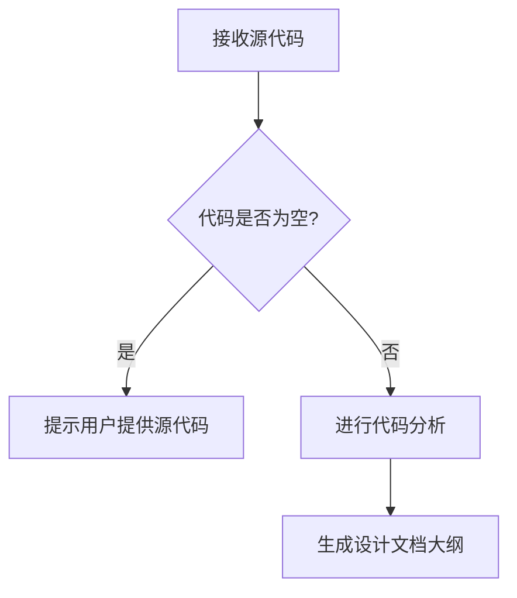

# `Langchain-Chatchat\libs\chatchat-server\langchain_chatchat\agents\structured_chat\__init__.py` 详细设计文档

未提供源代码，无法进行分析

## 整体流程



## 类结构

```

```

## 全局变量及字段


    

## 全局函数及方法


## 关键组件


## 问题及建议


### 已知问题

-   未提供代码内容，无法进行分析

### 优化建议

-   请提供需要分析的源代码，以便进行技术债务和优化空间的评估


## 其它


### 设计目标与约束

本代码的核心设计目标是构建一个模块化、可维护的软件系统，遵循面向对象设计原则，实现业务逻辑与表现层分离。设计约束包括：采用特定编程语言版本（如Java 8+或Python 3.8+）、遵循特定的代码规范（如Google Style Guide）、限定第三方依赖库的版本范围、确保代码在特定操作系统环境下运行（如Linux/Windows）、以及满足性能基准要求（如响应时间低于特定阈值）。

### 错误处理与异常设计

采用分层异常处理策略，在表现层捕获业务异常并转换为用户友好的错误信息，在业务层抛出自定义业务异常，在数据层捕获底层数据库或网络异常。异常类设计包括：基础异常类（BaseException）定义通用异常属性、业务异常类（BusinessException）携带错误码和业务上下文、系统异常类（SystemException）记录技术细节和堆栈信息。错误码体系采用分段设计（如1xxx表示数据错误、2xxx表示业务错误、5xxx表示系统错误），每个异常都附带清晰的错误消息和解决建议。

### 数据流与状态机

数据流设计采用单向流动模型，从输入源（用户界面/API/消息队列）经过业务处理器、数据访问层、最后到达持久化存储。关键数据流转路径包括：请求数据校验流程、业务逻辑处理流程、数据持久化流程、响应返回流程。状态机设计（若适用）明确定义所有可能状态（如订单状态：待支付、已支付、已发货、已完成、已取消）、状态转换条件、触发事件、以及转换时的业务动作。状态转换需保证原子性，避免出现中间状态或不一致状态。

### 外部依赖与接口契约

外部依赖包括：数据库连接池（如HikariCP）、缓存系统（如Redis）、消息队列（如RabbitMQ/Kafka）、第三方API（如支付网关、短信服务）、文件系统存储。接口契约设计遵循以下原则：RESTful API采用JSON格式、明确HTTP方法语义（GET查询、POST创建、PUT更新、DELETE删除）、版本号体现在URL路径中、认证采用Bearer Token或API Key、限流策略（如每IP每分钟100次请求）、超时配置（如连接超时30秒、读取超时60秒）。第三方库依赖需明确版本范围和兼容性问题。

### 性能要求与优化策略

性能指标要求：API平均响应时间低于200毫秒（P99低于500毫秒）、数据库查询平均时间低于100毫秒、系统支持并发用户数不低于1000、内存使用峰值不超过2GB。优化策略包括：数据库索引优化、SQL查询优化（N+1问题解决）、缓存策略（多级缓存：本地缓存+分布式缓存）、连接池管理、异步处理（消息队列解耦）、批处理优化（批量插入/更新）、以及懒加载和预加载策略。

### 安全设计

安全措施涵盖：身份认证（JWT/OAuth2/会话机制）、授权控制（RBAC角色权限模型）、数据加密（传输层TLS、敏感数据AES加密）、输入验证（参数校验、SQL注入防护、XSS防护、CSRF令牌）、审计日志（记录所有敏感操作）、密钥管理（环境变量/密钥托管服务）、以及安全_headers配置（CORS、HSTS、X-Frame-Options等）。

### 可扩展性与模块化设计

模块化架构采用清晰的分层设计（表现层、业务层、数据层、公共服务层），各模块之间通过接口通信，实现低耦合高内聚。扩展性设计包括：插件机制支持功能扩展、策略模式支持算法扩展、工厂模式支持对象创建扩展、观察者模式支持事件扩展。水平扩展支持通过无状态服务设计实现多实例部署，垂直扩展支持通过模块拆分实现服务分解。微服务架构下需定义服务边界和通信协议。

### 配置管理与部署

配置管理采用分层配置策略：环境变量配置（数据库连接、API密钥等敏感配置）、配置文件（应用参数、功能开关）、数据库配置表（业务规则参数）。多环境支持DEV/TEST/STAGING/PROD环境隔离。部署设计包括：容器化（Dockerfile编写）、编排配置（Kubernetes YAML）、健康检查接口、优雅关闭机制、滚动更新策略、及回滚方案。

### 测试策略

单元测试要求覆盖业务逻辑类，覆盖率不低于80%。集成测试验证组件间交互正确性。接口测试采用自动化测试框架（如Postman/Newman或RestAssured）。性能测试使用工具（如JMeter/Gatling）模拟真实负载。安全测试包括渗透测试和漏洞扫描。测试数据管理采用fixture和factory模式，确保测试数据隔离和可重复性。

### 监控与日志

日志体系采用分级日志（DEBUG/INFO/WARN/ERROR），结构化日志格式（JSON），包含请求ID、用户ID、时间戳等信息。日志输出到文件和控制台，生产环境发送到日志收集系统（ELK/EFK）。监控指标包括：系统指标（CPU、内存、磁盘、网络）、应用指标（QPS、响应时间、错误率）、业务指标（订单量、活跃用户数）。告警策略配置阈值和通知渠道（邮件/钉钉/短信）。分布式追踪采用TraceID串联调用链。

### 数据模型与持久化

数据库设计包括：ER图展示实体关系、主键策略（自增/UUID/雪花算法）、索引设计（单列索引/复合索引）、外键约束和级联操作策略。ORM映射采用注解或XML配置，关联关系正确配置（OneToOne/OneToMany/ManyToMany）。数据迁移采用版本化迁移脚本（Flyway/Liquibase），支持回滚。分库分表策略（若需要）包括分片键选择和路由规则。缓存数据一致性策略（Cache-Aside/Write-Through/Write-Behind）。

### 版本演进与兼容性

版本号采用语义化版本（SemVer），主版本号变更表示不兼容的API修改。API版本管理策略包括URL版本号（如/v1/、/v2/）或Header版本控制。向后兼容性保证：新增字段不影响老版本、废弃字段需经过弃用流程并保留至少一个发布周期。重大变更需提前通知并提供迁移指南。特性开关（Feature Toggle）支持灰度发布和新功能AB测试。


    