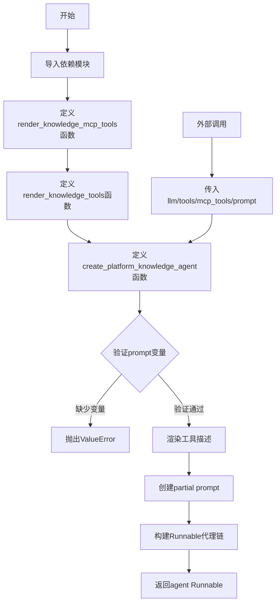
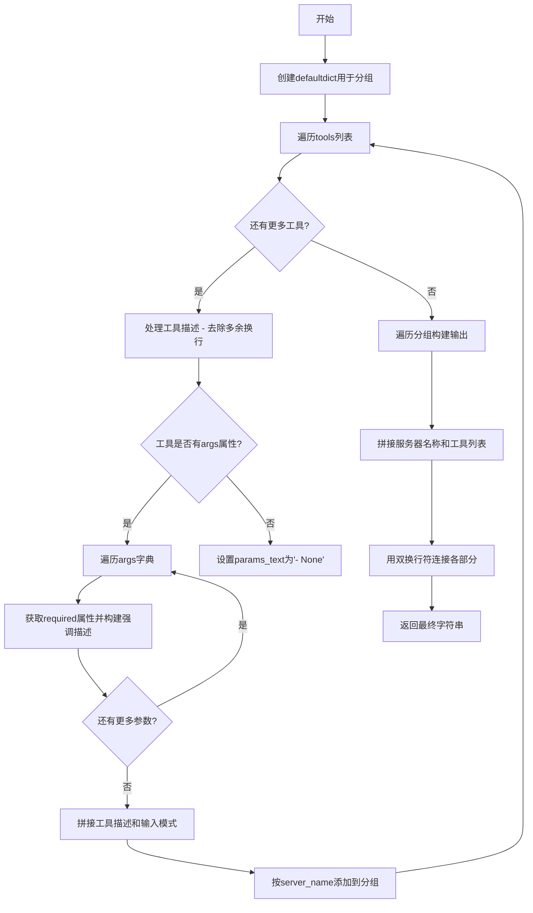
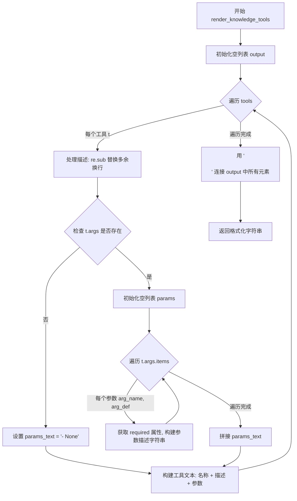
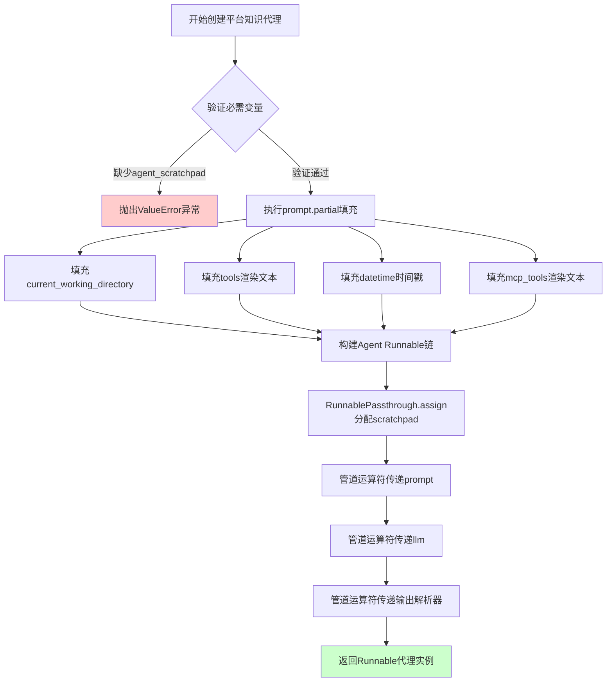
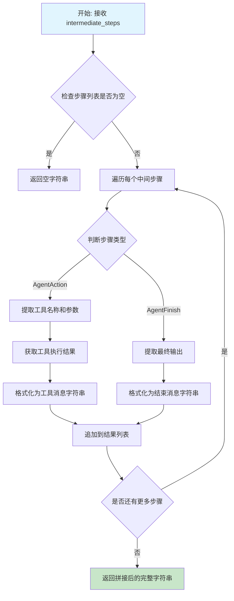
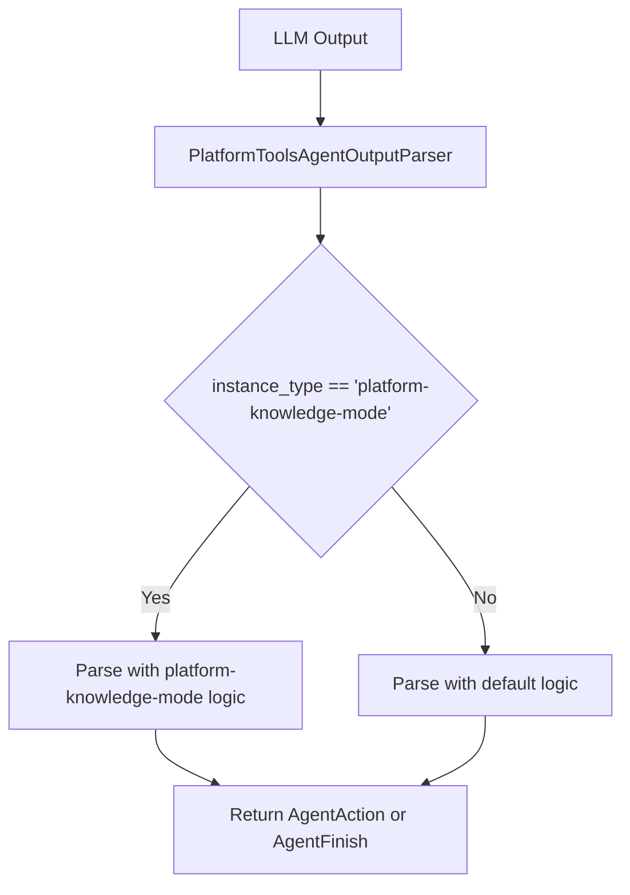

# `Langchain-Chatchat\libs\chatchat-server\langchain_chatchat\agents\structured_chat\platform_knowledge_bind.py` 详细设计文档

该代码实现了一个平台知识代理（Platform Knowledge Agent），通过结合常规LangChain工具和MCP（Model Context Protocol）结构化工具，创建一个可处理知识相关任务的Runnable代理。它提供了工具描述渲染功能，并将代理输出解析为平台知识模式。

## 整体流程



## 类结构

```
无类定义（函数式编程模块）
├── render_knowledge_mcp_tools（渲染MCP工具描述）
├── render_knowledge_tools（渲染常规工具描述）
└── create_platform_knowledge_agent（创建代理工厂函数）
```

## 全局变量及字段


### `grouped_tools`
    
用于将工具按 server_name 分组的字典，默认值为空列表

类型：`defaultdict(list)`
    


### `params`
    
存储工具参数的描述文本列表

类型：`List[str]`
    


### `params_text`
    
将参数列表用换行符连接后的字符串，用于构建工具描述

类型：`str`
    


### `text`
    
单个工具的完整描述文本，包含名称、描述和参数信息

类型：`str`
    


### `output`
    
存储所有工具或工具组描述文本的列表，最终用于拼接返回

类型：`List[str]`
    


### `server_name`
    
MCP 工具所属的服务器名称，用于分组和构建节标题

类型：`str`
    


### `tool_texts`
    
特定服务器下所有工具的描述文本列表

类型：`List[str]`
    


### `section`
    
单个服务器节的完整文本，包含服务器名和工具列表

类型：`str`
    


### `desc`
    
工具描述文本，处理掉多余换行后的结果

类型：`str`
    


### `required`
    
指示工具参数是否为必需的布尔值

类型：`bool`
    


### `required_str`
    
将 required 布尔值转换为可读字符串 '(required)' 或 '(optional)'

类型：`str`
    


### `arg_desc`
    
工具参数的描述文本，去除首尾空格

类型：`str`
    


### `missing_vars`
    
提示词中缺失的必需变量集合，用于验证提示词完整性

类型：`set[str]`
    


### `agent`
    
最终创建的可运行代理对象，包含提示词、LLM 和输出解析器的组合

类型：`Runnable`
    


    

## 全局函数及方法


### `render_knowledge_mcp_tools`

该函数接收一个MCP工具列表，按服务器名称分组，并为每个工具生成格式化的Markdown描述文本，特别强调必需参数的重要性，用于向LLM提供工具调用上下文。

参数：

- `tools`：`List[MCPStructuredTool]`，MCP结构化工具列表，每个工具包含名称、描述、参数模式和服务器名称等属性

返回值：`str`，格式化后的工具描述字符串，包含按服务器分组的工具列表，每个工具包含名称、描述和输入模式

#### 流程图



#### 带注释源码

```python
def render_knowledge_mcp_tools(tools: List[MCPStructuredTool]) -> str:
    """
    将MCP工具列表格式化为可读的Markdown文本，按服务器名称分组。
    
    Args:
        tools: MCPStructuredTool对象列表，每个包含name、description、args和server_name属性
        
    Returns:
        格式化后的字符串，包含按服务器分组的工具描述
    """
    
    # 使用defaultdict按server_name自动初始化空列表进行分组
    grouped_tools = defaultdict(list)

    # 遍历每个工具进行格式化处理
    for t in tools:
        # 使用正则表达式将多个连续换行符替换为单空格，清理描述文本
        desc = re.sub(r"\n+", " ", t.description)
        
        # 构建参数描述列表
        params = []
        
        # 检查工具是否有args属性且不为空
        if hasattr(t, "args") and t.args:
            # 遍历每个参数定义
            for arg_name, arg_def in t.args.items():
                # 获取required字段，默认为True
                required = arg_def.get("required", True)
                
                # 根据required状态生成描述文本
                required_str = "(required)" if required else "(optional)"
                
                # 获取参数描述，去除首尾空白
                arg_desc = arg_def.get("description", "").strip() 
                
                # 强调required参数的重要性，使用CRITICAL标记
                if required:
                    params.append(
                        f"- {arg_name}: {required_str} CRITICAL: "
                        f"Must provide actual content, empty/null forbidden. {arg_desc}"
                    )
                else:
                    params.append(f"- {arg_name}: {required_str} {arg_desc}")
        
        # 将参数列表转换为换行分隔的字符串，无参数时显示"- None"
        params_text = "\n".join(params) if params else "- None"
        
        # 拼接单个工具的完整描述，包含名称、描述和输入模式
        text = (
            f"- {t.name}: {desc}  \n"  # 工具名称和描述
            f"  Input Schema:\n"         # 输入模式标题
            f"  {params_text}"           # 参数列表
        )
        
        # 按服务器名称添加到对应分组
        grouped_tools[t.server_name].append(text)

    # 构建最终输出字符串
    output = []
    
    # 遍历每个服务器及其工具列表
    for server_name, tool_texts in grouped_tools.items():
        # 拼接服务器区块：服务器标题 + 可用工具列表
        section = f"## {server_name}\n### Available Tools\n" + "\n".join(tool_texts)
        output.append(section)

    # 使用双换行符分隔不同服务器的区块
    return "\n\n".join(output)
```


### `render_knowledge_tools`

该函数接收一个 BaseTool 列表，将其转换为格式化的文本描述字符串，包含每个工具的名称、描述和参数信息，特别强调 required 参数的完整性要求。

参数：

- `tools`：`List[BaseTool]`，待渲染的工具列表，每个元素为 langchain 的 BaseTool 实例

返回值：`str`，格式化后的工具描述字符串，包含工具名称、描述和参数模式

#### 流程图



#### 带注释源码

```python
def render_knowledge_tools(tools: List[BaseTool]) -> str:
    """将工具列表渲染为格式化的文本描述字符串。
    
    Args:
        tools: BaseTool 对象列表，每个工具包含 name、description 和 args 属性
        
    Returns:
        格式化字符串，包含所有工具的名称、描述和参数信息
    """
 
    output = []  # 初始化输出列表，用于收集每个工具的格式化描述
    for t in tools:  # 遍历传入的每个工具
        # 处理描述，去掉多余换行
        # 使用正则表达式将连续多个换行符替换为单个空格
        desc = re.sub(r"\n+", " ", t.description)

        # 构建参数部分
        params = []  # 初始化参数列表
        if hasattr(t, "args") and t.args:  # 确保有参数定义
            # 遍历每个参数的名称和定义
            for arg_name, arg_def in t.args.items():
                # 获取字段信息
                # 默认为 required=True，与工具定义规范保持一致
                required = arg_def.get("required", True)
                required_str = "(required)" if required else "(optional)"
                arg_desc = arg_def.get("description", "").strip() 
                # 强调 required 属性
                # 如果参数是必需的，添加 CRITICAL 标记提醒必须提供实际内容
                if required:
                    params.append(f"- {arg_name}: {required_str} CRITICAL: Must provide actual content, empty/null forbidden. {arg_desc}")
                else:
                    params.append(f"- {arg_name}: {required_str} {arg_desc}")

        # 拼接最终文本
        # 构建包含工具名称、描述和参数的完整格式化字符串
        text = (
            f"## {t.name}\n"
            f"Description: {desc}\n"
            f"Parameters:\n" +
            ("\n".join(params) if params else "- None")
        )
        output.append(text)  # 将格式化后的工具描述添加到输出列表

    # 使用双换行符连接各工具描述，形成最终输出
    return "\n\n".join(output)
```


### `create_platform_knowledge_agent`

该函数用于创建一个基于平台知识模式的代理（Agent），通过整合大语言模型、普通工具和MCP结构化工具，构建一个完整的可运行代理链。代理支持工具调用、知识库查询和平台特定的任务处理。

参数：

- `llm`：`BaseLanguageModel`，执行推理和工具调用的核心语言模型实例
- `current_working_directory`：`str`，代理运行时的工作目录，用于文件操作等场景
- `tools`：`Sequence[BaseTool]`，普通工具序列，提供基础功能如搜索、计算等
- `mcp_tools`：`Sequence[MCPStructuredTool]`，MCP协议结构化工具序列，提供平台特定的增强能力
- `prompt`：`ChatPromptTemplate`，聊天提示模板，定义代理的系统提示和用户交互格式
- `llm_with_platform_tools`：`List[Dict[str, Any]]`，可选参数，带有平台工具配置的语言模型列表，默认为空列表

返回值：`Runnable`，返回一个完整的可运行代理序列，接受与提示模板相同的输入变量，输出 AgentAction（工具调用）或 AgentFinish（完成信号）

#### 流程图



#### 带注释源码

```python
def create_platform_knowledge_agent(
        llm: BaseLanguageModel,
        current_working_directory: str,
        tools: Sequence[BaseTool],
        mcp_tools: Sequence[MCPStructuredTool],
        prompt: ChatPromptTemplate,
        *,
        llm_with_platform_tools: List[Dict[str, Any]] = [],
) -> Runnable:
    """Create an agent that uses tools.

    Returns:
        A Runnable sequence representing an agent. It takes as input all the same input
        variables as the prompt passed in does. It returns as output either an
        AgentAction or AgentFinish.


    """
    # 验证提示模板是否包含代理工作区必需的变量
    # agent_scratchpad 用于存储中间步骤的对话历史
    missing_vars = {"agent_scratchpad"}.difference(
        prompt.input_variables + list(prompt.partial_variables)
    )
    if missing_vars:
        # 如果缺少必需变量，抛出明确的错误信息
        raise ValueError(f"Prompt missing required variables: {missing_vars}")

    # 使用 partial 方法填充提示模板中的动态变量
    # 这些变量在每次代理运行时都会被固定提供
    prompt = prompt.partial(
        current_working_directory=current_working_directory,
        # 将普通工具列表渲染为文本描述，供LLM理解工具能力
        tools=render_knowledge_tools(list(tools)),
        # 添加当前时间戳，用于时间敏感的任务
        datetime=datetime.now().isoformat(),
        # 将MCP工具列表渲染为文本描述
        mcp_tools=render_knowledge_mcp_tools(list(mcp_tools)),
    ) 
    
    # 构建代理的Runnable执行链
    # 使用管道运算符 | 连接各个处理组件
    agent = (
            # 步骤1: RunnablePassthrough.assign - 传递输入并附加agent_scratchpad
            # lambda函数将中间步骤(intermediate_steps)格式化为平台工具消息
            RunnablePassthrough.assign(
                agent_scratchpad=lambda x: format_to_platform_tool_messages(
                    x["intermediate_steps"]
                )
            )
            # 步骤2: 将格式化的scratchpad传递给提示模板，生成最终prompt
            | prompt
            # 步骤3: 将prompt发送给语言模型，获取响应
            | llm
            # 步骤4: 使用平台工具输出解析器解析LLM响应
            # instance_type指定为platform-knowledge-mode，使用特定解析逻辑
            | PlatformToolsAgentOutputParser(instance_type="platform-knowledge-mode")

    )

    return agent
```


### `format_to_platform_tool_messages`

该函数是 LangChain Agent 运行时用于格式化中间步骤（工具调用结果）的关键函数。它接收 Agent 执行过程中的中间步骤列表，将 AgentAction（工具调用）和 AgentFinish（最终结果）转换为平台工具消息格式的字符串，用于填充 Agent Prompt 中的 `agent_scratchpad` 变量。

参数：

-  `intermediate_steps`：`List[Tuple[AgentAction, str]]` 或 `List[Union[AgentAction, AgentFinish]]`，Agent 执行过程中的中间步骤列表，每个元素包含工具调用动作和对应的执行结果

返回值：`str`，格式化后的平台工具消息字符串，包含工具名称、参数和执行结果，用于在 Prompt 中向 LLM 展示工具调用的历史

#### 流程图



#### 带注释源码

```
# 注意：此函数定义在 langchain_chatchat.agents.format_scratchpad.all_tools 模块中
# 以下是基于代码调用方式的推断实现

from langchain_core.agents import AgentAction, AgentFinish
from typing import List, Tuple, Union

def format_to_platform_tool_messages(
    intermediate_steps: List[Tuple[AgentAction, str]]
) -> str:
    """
    将 Agent 的中间步骤格式化为平台工具消息。
    
    此函数在 create_platform_knowledge_agent 中被调用，用于构建 agent_scratchpad 变量。
    它将工具调用的动作和结果转换为文本格式，以便在 Prompt 中向 LLM 展示执行历史。
    
    参数:
        intermediate_steps: Agent 执行过程中的中间步骤列表，每个元素是 
                           (AgentAction, str) 元组，包含工具调用和执行结果
    
    返回:
        格式化后的工具消息字符串，用于填充 Prompt 的 agent_scratchpad 变量
    """
    
    # 初始化结果列表
    messages = []
    
    # 遍历每个中间步骤
    for action, observation in intermediate_steps:
        # 检查是否是 AgentFinish（最终结果）
        if isinstance(action, AgentFinish):
            # 提取最终输出并格式化
            final_output = action.return_values.get("output", "")
            messages.append(f"Final Answer: {final_output}")
        else:
            # 处理 AgentAction（工具调用）
            # 格式化工具调用信息：工具名称
            tool_name = action.tool
            # 格式化工具调用信息：工具输入参数
            tool_input = action.tool_input
            # 格式化工具执行结果
            observation_text = observation if observation else "No output"
            
            # 构建工具消息格式
            message = f"Invoking: {tool_name}\nwith input: {tool_input}\nObservation: {observation_text}"
            messages.append(message)
    
    # 使用双换行符拼接所有消息
    return "\n\n".join(messages)
```

> **注**：由于 `format_to_platform_tool_messages` 函数的完整源码位于外部模块 `langchain_chatchat.agents.format_scratchpad.all_tools` 中，未在当前代码文件中直接定义，以上源码是基于 LangChain 标准的 Agent 中间步骤格式化逻辑和代码上下文进行的合理推断。实际实现可能略有差异，但其核心功能是将工具调用历史转换为文本格式供 LLM 理解。


### PlatformToolsAgentOutputParser

这是从外部模块 `langchain_chatchat.agents.output_parsers` 导入的输出解析器类，用于解析 LLM 输出并转换为平台工具代理可执行的操作。在 `create_platform_knowledge_agent` 中被实例化为 `PlatformToolsAgentOutputParser(instance_type="platform-knowledge-mode")`，位于 agent Runnable 链的末端，负责将语言模型的输出转换为 `AgentAction` 或 `AgentFinish` 对象。

参数：

- `instance_type`：str，指定实例类型，这里传入 `"platform-knowledge-mode"` 表示平台知识模式

返回值：`Runnable`，返回一个 Runnable 对象，可以处理 LLM 输出并返回 AgentAction 或 AgentFinish

#### 流程图



#### 带注释源码

```python
# 该类的实际定义位于 langchain_chatchat.agents.output_parsers 模块中
# 当前文件中仅为导入使用，未包含具体实现

from langchain_chatchat.agents.output_parsers import PlatformToolsAgentOutputParser

# 在 create_platform_knowledge_agent 函数中的使用方式：
agent = (
    RunnablePassthrough.assign(
        agent_scratchpad=lambda x: format_to_platform_tool_messages(
            x["intermediate_steps"]
        )
    )
    | prompt
    | llm
    | PlatformToolsAgentOutputParser(instance_type="platform-knowledge-mode")
)

# PlatformToolsAgentOutputParser 继承自 langchain_core.agents 的 AgentOutputParser
# instance_type 参数用于区分不同的解析模式
# platform-knowledge-mode 专门用于处理平台知识相关代理的输出解析
```


## 关键组件


### render_knowledge_mcp_tools

该函数用于将MCP（Model Context Protocol）结构化工具列表渲染为格式化的Markdown字符串，按服务器名称分组，并强调必填参数。接收List[MCPStructuredTool]作为输入，返回格式化的工具描述字符串。

### render_knowledge_tools

该函数用于将普通LangChain BaseTool列表渲染为格式化的Markdown字符串，详细描述每个工具的名称、描述和参数信息，特别强调必填参数。接收List[BaseTool]作为输入，返回格式化的工具描述字符串。

### create_platform_knowledge_agent

该函数是核心工厂方法，用于创建支持平台知识模式的LangChain代理。它整合LLM、普通工具和MCP工具，配置提示词模板，并通过RunnablePassthrough构建完整的代理执行链。接收LLM、工作目录、工具列表、提示词模板等参数，返回Runnable类型的代理实例。

### MCPStructuredTool

从langchain_chatchat.agent_toolkits.mcp_kit.tools导入的MCP结构化工具类，包含server_name、name、description、args等属性，用于表示MCP服务器提供的工具。

### BaseTool

LangChain核心工具基类，定义了工具的标准接口，包括name、description、args等属性，用于表示可执行的工具。

### PlatformToolsAgentOutputParser

LangChain Chatchat的自定义输出解析器，用于解析代理输出为AgentAction或AgentFinish，instance_type参数指定为"platform-knowledge-mode"。

### 工具描述渲染逻辑

代码中的参数描述构建逻辑会对必填参数（required=True）添加"CRITICAL: Must provide actual content, empty/null forbidden."的强烈提示，这是为了确保代理不会传递空值给必填参数。

### 代理链构建流程

create_platform_knowledge_agent通过RunnablePassthrough.assign方法将中间步骤（intermediate_steps）格式化为工具消息，然后依次通过提示词模板、LLM和输出解析器，形成完整的代理执行管道。


## 问题及建议


### 已知问题

-   **重复代码**：两个渲染函数 `render_knowledge_mcp_tools` 和 `render_knowledge_tools` 存在大量重复的逻辑（遍历工具、处理描述、构建参数），违反了 DRY 原则
-   **硬编码字符串**：`"agent_scratchpad"` 变量名和 `"platform-knowledge-mode"` 字符串在代码中硬编码，缺乏可配置性
-   **类型转换冗余**：函数参数声明为 `Sequence[BaseTool]`，但在函数内部使用 `list(tools)` 进行不必要的转换
-   **缺少输入验证**：没有对 `tools`、`mcp_tools` 的空值进行校验，也没有对 `t.args` 的数据结构进行验证
-   **正则表达式重复编译**：多个地方使用 `re.sub(r"\n+", " ", ...)` 但每次都重新编译正则表达式
-   **未使用的参数**：`llm_with_platform_tools` 参数在函数签名中定义但完全没有被使用
-   **参数 required 判断可能不准确**：使用 `arg_def.get("required", True)` 默认值为 True 可能与实际工具定义不符
-   **缺少错误处理**：`format_to_platform_tool_messages` 的调用没有异常处理，可能导致代理执行失败

### 优化建议

-   **抽取公共函数**：将工具渲染的公共逻辑抽取为独立的辅助函数，接受渲染器或格式化器作为参数
-   **常量提取**：将硬编码的字符串提取为模块级常量或配置参数
-   **添加输入校验**：在函数入口添加参数校验，抛出明确的异常信息
-   **缓存正则表达式**：将正则表达式预编译为模块级变量
-   **移除未使用参数**：删除 `llm_with_platform_tools` 参数或在实现中加以使用
-   **添加类型注解优化**：考虑使用 `List` 替代 `Sequence` 以减少不必要的类型转换，或在函数签名中使用 `Iterable`
-   **增强错误处理**：为 `format_to_platform_tool_messages` 调用添加 try-except 包装

## 其它


### 设计目标与约束

本模块的设计目标是创建一个支持多种工具类型的Agent系统，能够统一处理普通LangChain工具和MCP（Model Context Protocol）工具，并将这些工具渲染为可供LLM理解的文本描述格式。核心约束包括：1）必须维护与LangChain现有Agent架构的兼容性；2）工具参数描述必须清晰区分required和optional参数；3）MCP工具需要按server_name进行分组展示；4）Agent必须支持intermediate_steps来维护对话上下文。

### 错误处理与异常设计

代码中的错误处理主要体现在`create_platform_knowledge_agent`函数中，该函数会验证prompt模板是否包含必需的`agent_scratchpad`变量，若缺失则抛出`ValueError`并列出缺失的变量列表。其他潜在错误包括：工具参数格式不正确时的处理（通过`hasattr`和默认值处理）、空工具列表的容错处理（`render_knowledge_tools`中当`tools`为空列表时输出"- None"）。建议增加对MCP工具连接失败、工具渲染异常、LLM调用超时等场景的错误处理和重试机制。

### 数据流与状态机

数据流如下：1）输入阶段：接收LLM实例、当前工作目录、工具列表（普通工具和MCP工具）、prompt模板；2）渲染阶段：分别调用`render_knowledge_tools`和`render_knowledge_mcp_tools`将工具转换为文本描述；3）Prompt组装：通过`prompt.partial`注入工具描述、当前目录、时间和agent_scratchpad变量；4）Agent执行：LLM生成响应，经由`PlatformToolsAgentOutputParser`解析为`AgentAction`或`AgentFinish`；5）循环执行：intermediate_steps返回至步骤3形成循环，直到Agent输出`AgentFinish`。

### 外部依赖与接口契约

主要外部依赖包括：1）`langchain_core.language_models.BaseLanguageModel` - LLM基类；2）`langchain_core.runnables.Runnable` - 可运行对象接口；3）`langchain_core.tools.BaseTool` - 工具基类；4）`langchain_chatchat.agent_toolkits.mcp_kit.tools.MCPStructuredTool` - MCP工具类型；5）`langchain_chatchat.agents.format_scratchpad.all_tools.format_to_platform_tool_messages` - scratchpad格式化函数；6）`langchain_chatchat.agents.output_parsers.PlatformToolsAgentOutputParser` - 输出解析器。接口契约要求：tools参数需实现BaseTool接口并包含name、description、args属性；mcp_tools需包含server_name属性；prompt模板必须包含agent_scratchpad变量或partial_variables。

### 安全性考虑

代码中的安全性考量主要体现在：1）参数描述中对required参数的强制性标注（"CRITICAL: Must provide actual content, empty/null forbidden"），防止LLM生成空值；2）通过正则表达式`re.sub(r"\n+", " ", t.description)`清理多余换行符，防止Prompt注入攻击；3）工具描述的渲染在LLM调用前完成，属于Prompt工程范畴。若要增强安全性，建议对工具描述进行长度限制和内容校验，防止超长Prompt导致的服务端拒绝服务攻击。

### 性能考量

性能优化点包括：1）使用`defaultdict(list)`进行工具分组，避免嵌套循环的重复遍历；2）`list(tools)`和`list(mcp_tools)`的转换确保输入为列表类型，便于迭代；3）工具描述的渲染是一次性操作，在Agent创建时完成而非每次调用时渲染。若存在大量工具，建议对工具描述进行缓存或分页加载，避免每次Agent初始化时重复渲染。

### 配置与参数说明

`create_platform_knowledge_agent`函数参数说明：1）llm: BaseLanguageModel类型，必填，指定使用的语言模型；2）current_working_directory: str类型，必填，当前工作目录路径；3）tools: Sequence[BaseTool]类型，必填，普通LangChain工具序列；4）mcp_tools: Sequence[MCPStructuredTool]类型，必填，MCP工具序列；5）prompt: ChatPromptTemplate类型，必填，Agent使用的Prompt模板；6）llm_with_platform_tools: List[Dict[str, Any]]类型，可选，默认为空列表，用于预配置的工具绑定。返回值类型为Runnable，可直接执行或与其他组件链式组合。

### 使用示例与调用方式

典型调用流程：1）准备LLM实例（如ChatOpenAI）；2）定义或加载tools和mcp_tools；3）构建包含agent_scratchpad变量的ChatPromptTemplate；4）调用create_platform_knowledge_agent创建Agent；5）通过agent.invoke({"input": "用户问题", "intermediate_steps": []})执行。示例代码：
```python
agent = create_platform_knowledge_agent(
    llm=chat_model,
    current_working_directory="/home/user",
    tools=my_tools,
    mcp_tools=mcp_tools_list,
    prompt=custom_prompt
)
result = agent.invoke({"input": "请帮我调用XXX工具", "intermediate_steps": []})
```

### 版本历史与变更记录

当前版本为初始实现，主要功能点：1）支持MCP工具和普通工具的文本渲染；2）工具参数required属性的突出显示；3）MCP工具按server_name分组展示；4）与LangChain Agent架构的集成。未来可能的变更方向：1）增加工具缓存机制；2）支持流式输出；3）增强错误恢复能力；4）支持自定义工具渲染模板。

### 关键组件信息

1. **render_knowledge_mcp_tools** - 将MCP工具列表渲染为分组的文本描述，按server_name组织，强调required参数
2. **render_knowledge_tools** - 将普通LangChain工具渲染为文本描述，格式化为Markdown结构
3. **create_platform_knowledge_agent** - 核心工厂函数，创建支持工具调用的Runnable Agent
4. **PlatformToolsAgentOutputParser** - 输出解析器，将LLM响应转换为AgentAction或AgentFinish
5. **format_to_platform_tool_messages** - 将中间步骤格式化为消息，用于维护对话状态

    