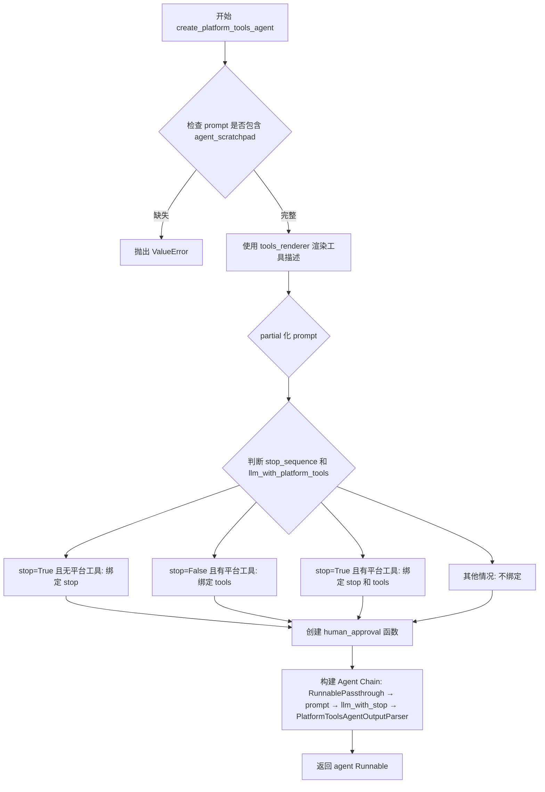
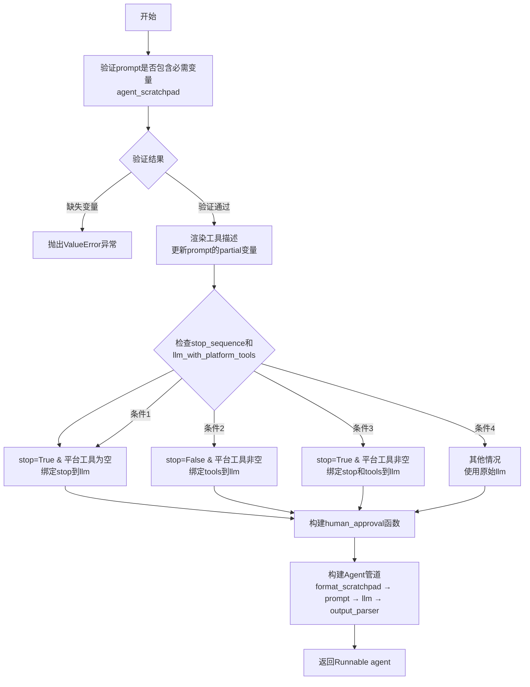
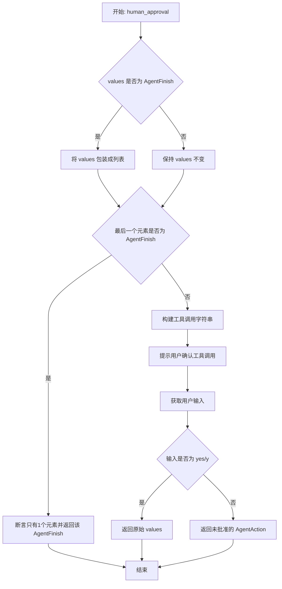

# `Langchain-Chatchat\libs\chatchat-server\langchain_chatchat\agents\structured_chat\platform_tools_bind.py` 详细设计文档

该代码创建了一个基于 LangChain 的平台工具代理，支持通过 LLM 调用工具、处理中间步骤、并可选地添加人工审批流程，用于实现可控制的大模型工具调用系统。

## 整体流程



## 类结构

```
本文件无自定义类
langchain_core.runnables.Runnable (导入的基类)
langchain_core.agents.AgentAction (导入的数据类)
langchain_core.agents.AgentFinish (导入的数据类)
langchain.agents.agent.NextStepOutput (导入的类型)
```

## 全局变量及字段


### `missing_vars`
    
用于检查 prompt 缺少的变量集合，此处检查 agent_scratchpad 是否在 prompt 的输入变量或部分变量中

类型：`Set[str]`
    


### `stop`
    
停止标记列表，用于控制 LLM 生成何时停止，默认包含 '\nObservation:' 或用户指定的停止序列

类型：`List[str]`
    


### `llm_with_stop`
    
绑定停止序列和平台工具后的 LLM，用于后续的链式调用

类型：`BaseLanguageModel`
    


### `agent`
    
最终构建的代理 Runnable 对象，包含提示模板、LLM 和输出解析器的完整执行链

类型：`Runnable`
    


    

## 全局函数及方法


### `create_platform_tools_agent`

创建平台工具代理的主函数，用于构建一个基于LangChain的代理，该代理能够使用指定的工具与语言模型交互。

参数：

- `llm`：`BaseLanguageModel`，用于作为代理的语言模型
- `tools`：`Sequence[BaseTool]`，代理可访问的工具序列
- `prompt`：`ChatPromptTemplate`，使用的提示模板，必须包含`tools`和`agent_scratchpad`输入键
- `tools_renderer`：`ToolsRenderer`，控制工具如何转换为字符串并传递给LLM，默认为`render_text_description`
- `stop_sequence`：`Union[bool, List[str]]`，停止序列配置。True时添加`</tool_input>`停止标记，False时不添加，自定义列表则使用提供的列表作为停止标记，默认为True
- `llm_with_platform_tools`：`List[Dict[str, Any]]`，平台工具的字典列表，长度≥0，默认为空列表

返回值：`Runnable`，表示代理的Runnable序列，接收与提示模板相同的输入变量作为输入，返回`AgentAction`或`AgentFinish`

#### 流程图



#### 带注释源码

```python
def create_platform_tools_agent(
        llm: BaseLanguageModel,                    # 语言模型实例
        tools: Sequence[BaseTool],                 # 可用工具列表
        prompt: ChatPromptTemplate,                # 提示模板
        tools_renderer: ToolsRenderer = render_text_description,  # 工具渲染器
        *,
        stop_sequence: Union[bool, List[str]] = True,  # 停止序列配置
        llm_with_platform_tools: List[Dict[str, Any]] = [],  # 平台工具配置
) -> Runnable:
    """Create an agent that uses tools.

    Args:
        llm: LLM to use as the agent.
        tools: Tools this agent has access to.
        prompt: The prompt to use, must have input keys
            `tools`: contains descriptions for each tool.
            `agent_scratchpad`: contains previous agent actions and tool outputs.
        tools_renderer: This controls how the tools are converted into a string and
            then passed into the LLM. Default is `render_text_description`.
        stop_sequence: bool or list of str.
            If True, adds a stop token of "</tool_input>" to avoid hallucinates.
            If False, does not add a stop token.
            If a list of str, uses the provided list as the stop tokens.
            Default is True. You may to set this to False if the LLM you are using
            does not support stop sequences.
        llm_with_platform_tools: length ge 0 of dict tools for platform

    Returns:
        A Runnable sequence representing an agent. It takes as input all the same input
        variables as the prompt passed in does. It returns as output either an
        AgentAction or AgentFinish.
    """
    # 步骤1: 验证prompt是否包含必需的变量
    # 检查prompt是否包含agent_scratchpad变量，这是代理工作所必需的
    missing_vars = {"agent_scratchpad"}.difference(
        prompt.input_variables + list(prompt.partial_variables)
    )
    if missing_vars:
        raise ValueError(f"Prompt missing required variables: {missing_vars}")

    # 步骤2: 渲染工具描述并更新prompt的partial变量
    # 使用tools_renderer将工具列表转换为字符串描述
    prompt = prompt.partial(
        tools=tools_renderer(list(tools)),
        tool_names=", ".join([t.name for t in tools]),
    )

    # 步骤3: 根据stop_sequence和llm_with_platform_tools的配置
    # 决定如何绑定LLM的参数
    if stop_sequence and len(llm_with_platform_tools) == 0:
        # 情况1: 需要stop且无平台工具 - 只绑定stop
        stop = ["\nObservation:"] if stop_sequence is True else stop_sequence
        llm_with_stop = llm.bind(stop=stop)
    elif stop_sequence is False and len(llm_with_platform_tools) > 0:
        # 情况2: 不需要stop但有平台工具 - 只绑定tools
        llm_with_stop = llm.bind(tools=llm_with_platform_tools)
    elif stop_sequence and len(llm_with_platform_tools) > 0:
        # 情况3: 需要stop且有平台工具 - 同时绑定stop和tools
        stop = ["\nObservation:"] if stop_sequence is True else stop_sequence
        llm_with_stop = llm.bind(
            stop=stop,
            tools=llm_with_platform_tools
        )
    else:
        # 情况4: 不需要stop且无平台工具 - 使用原始llm
        llm_with_stop = llm

    # 步骤4: 定义human_approval函数（目前被注释未使用）
    # 用于在执行工具前请求人工审批
    def human_approval(values: NextStepOutput) -> NextStepOutput:
        if isinstance(values, AgentFinish):
            values = [values]
        else:
            values = values
        if isinstance(values[-1], AgentFinish):
            assert len(values) == 1
            return values[-1]
        tool_strs = "\n\n".join(
            tool_call.tool for tool_call in values
        )
        input_msg = (
            f"Do you approve of the following tool invocations\n\n{tool_strs}\n\n"
            "Anything except 'Y'/'Yes' (case-insensitive) will be treated as a no."
        )
        resp = input(input_msg)
        if resp.lower() not in ("yes", "y"):
            return [AgentAction(tool="approved", tool_input=resp, log= f"Tool invocations not approved:\n\n{tool_strs}")]
        return values

    # 步骤5: 构建Agent的Runnable管道
    # 使用LangChain的管道操作符 | 连接各个组件
    agent = (
            # 1. 将中间步骤格式化为平台工具消息
            RunnablePassthrough.assign(
                agent_scratchpad=lambda x: format_to_platform_tool_messages(
                    x["intermediate_steps"]
                )
            )
            # 2. 应用prompt模板
            | prompt
            # 3. 调用LLM（已绑定stop和/或tools）
            | llm_with_stop
            # 4. 解析LLM输出为AgentAction或AgentFinish
            | PlatformToolsAgentOutputParser(instance_type="platform-agent")
            # | human_approval  # 可选的人工审批步骤（当前被注释）
    )

    return agent
```


### `human_approval`

该函数是代理内部的人工审批处理函数，用于在代理执行工具调用前请求用户确认。当代理生成工具调用时，该函数会将待执行的工具信息展示给用户，要求用户输入"y"或"yes"来批准，否则拒绝并返回一个表示未批准的 AgentAction。

参数：

-  `values`：`NextStepOutput`，代理的输出结果，可能是 AgentFinish 或 AgentAction 列表

返回值：`NextStepOutput`，如果用户批准则返回原始值，否则返回包含未批准信息的 AgentAction 列表

#### 流程图



#### 带注释源码

```python
def human_approval(values: NextStepOutput) -> NextStepOutput:
    """
    内部函数，用于处理人工审批逻辑
    
    Args:
        values: 代理的输出，可以是 AgentFinish 或 AgentAction 列表
        
    Returns:
        如果用户批准，返回原始 values；否则返回表示未批准的 AgentAction
    """
    # 判断 values 是否为 AgentFinish，如果是则包装成列表
    if isinstance(values, AgentFinish):
        values = [values]
    else:
        values = values
    
    # 如果最后一个元素是 AgentFinish，说明代理已完成，直接返回
    if isinstance(values[-1], AgentFinish):
        assert len(values) == 1
        return values[-1]
    
    # 将所有工具调用格式化为字符串，供用户查看
    tool_strs = "\n\n".join(
        tool_call.tool for tool_call in values
    )
    
    # 构建提示信息，要求用户确认是否批准工具调用
    input_msg = (
        f"Do you approve of the following tool invocations\n\n{tool_strs}\n\n"
        "Anything except 'Y'/'Yes' (case-insensitive) will be treated as a no."
    )
    
    # 阻塞等待用户输入
    resp = input(input_msg)
    
    # 检查用户输入是否为 'y' 或 'yes'（不区分大小写）
    if resp.lower() not in ("yes", "y"):
        # 用户未批准，返回一个 AgentAction 表示拒绝
        return [AgentAction(
            tool="approved", 
            tool_input=resp, 
            log=f"Tool invocations not approved:\n\n{tool_strs}"
        )]
    
    # 用户批准，返回原始的 values
    return values
```

## 关键组件


### 平台工具代理创建器 (create_platform_tools_agent)

核心函数，负责构建一个使用工具的LangChain代理，支持stop序列控制、平台工具集成和人类审批流程。

### Prompt模板部分变量填充

使用prompt.partial()方法动态填充tools（工具描述渲染）和tool_names（工具名称列表）变量，确保代理运行时拥有最新的工具信息。

### LLM绑定与Stop序列控制

根据stop_sequence参数和llm_with_platform_tools列表，动态绑定LLM的stop参数和tools参数，支持三种模式：仅stop、仅tools、同时配置stop和tools。

### 人类审批机制 (human_approval)

在代理执行工具调用前请求人类确认的函数，将工具调用信息展示给用户，根据用户输入"Y"/"Yes"决定是否继续执行，当前被注释未启用。

### 代理链构建 (RunnablePassthrough.assign)

使用LangChain的RunnablePassthrough和管道操作符构建代理执行链，依次包含：中间步骤格式化、Prompt渲染、LLM调用、输出解析。

### 平台工具输出解析器 (PlatformToolsAgentOutputParser)

负责解析LLM输出，转换为AgentAction或AgentFinish对象，支持平台特定格式的输出解析。

### 工具消息格式化器 (format_to_platform_tool_messages)

将中间步骤（intermediate_steps）格式化为平台工具消息格式，供Prompt中的agent_scratchpad变量使用。

### 输入验证与错误处理

检查Prompt是否包含必需的agent_scratchpad变量，缺失时抛出ValueError异常。


## 问题及建议


### 已知问题

-   **冗余代码**：`human_approval`函数定义后未被使用（被注释掉），但仍保留在代码中，增加维护负担
-   **冗余赋值**：`human_approval`函数中`values = values`语句没有任何实际作用，是冗余代码
-   **条件逻辑重复**：`stop_sequence`的处理逻辑在三个分支中有重复代码（`stop = ["\nObservation:"] if stop_sequence is True else stop_sequence`），可以提取合并
-   **注释代码未清理**：管道中`# | human_approval`被注释，如不需此功能应完全移除
-   **类型提示不够精确**：`llm_with_platform_tools`参数类型为`List[Dict[str, Any]]`过于宽泛，应该定义具体结构
-   **缺少错误处理**：没有对`tools`为空、`llm`为None等边界情况的处理
-   **变量命名不一致**：使用`llm_with_platform_tools`与`llm_with_stop`两种命名风格，不够统一

### 优化建议

-   **移除未使用的代码**：删除`human_approval`函数定义及其注释掉的管道部分，保持代码整洁
-   **简化条件逻辑**：将`stop_sequence`的多个分支合并，使用更清晰的条件表达式
-   **添加边界检查**：在函数开头添加对`tools`序列为空、LLM为None等异常情况的校验
-   **提取重复代码**：将`stop`变量的赋值逻辑提取到统一位置，避免重复
-   **精化类型提示**：为`llm_with_platform_tools`定义具体的TypedDict或dataclass类型，提高代码可读性和类型安全
-   **移除冗余语句**：删除`values = values`无用赋值
-   **统一命名风格**：考虑将变量名统一为更简洁的形式，如`platform_tools`

## 其它


### 设计目标与约束

本模块的设计目标是创建一个灵活的工具代理工厂函数，支持多种大语言模型(LLM)，提供平台工具集成和人工审批能力。核心约束包括：必须使用LangChain框架的Runnable接口，确保与LangChain生态系统的兼容性；prompt模板必须包含`agent_scratchpad`变量；stop_sequence参数支持布尔值或字符串列表两种形式；llm_with_platform_tools列表长度可以为0或更多。

### 错误处理与异常设计

代码中的错误处理主要体现在以下几个方面：1) 参数验证：在函数开头检查prompt是否包含必需的`agent_scratchpad`变量，如果缺失则抛出ValueError；2) 类型检查：使用isinstance检查values类型，判断是否为AgentFinish；3) 输入验证：human_approval函数中对用户输入进行大小写不敏感的匹配。潜在异常包括：LLM绑定失败异常、工具渲染异常、输出解析异常等。

### 数据流与状态机

数据流处理流程如下：1) 输入阶段：接收llm、tools、prompt等参数；2) 预处理阶段：对prompt进行partial填充，渲染工具描述；3) LLM绑定阶段：根据stop_sequence和llm_with_platform_tools配置绑定LLM；4) 代理构建阶段：使用RunnablePassthrough.assign构建agent_scratchpad，然后依次通过prompt、llm_with_stop、PlatformToolsAgentOutputParser；5) 输出阶段：返回AgentAction或AgentFinish。状态转换：初始化 -> 参数验证 -> 代理构建 -> 就绪状态。

### 外部依赖与接口契约

主要外部依赖包括：langchain.agents.agent.NextStepOutput、langchain_core.language_models.BaseLanguageModel、langchain_core.runnables.Runnable、langchain_core.tools.BaseTool、langchain_chatchat.agents.format_scratchpad.all_tools.format_to_platform_tool_messages、langchain_chatchat.agents.output_parsers.PlatformToolsAgentOutputParser。接口契约：llm参数必须继承BaseLanguageModel；tools参数必须是BaseTool的Sequence；prompt必须是ChatPromptTemplate且包含必要变量；函数返回Runnable对象。

### 性能考虑与资源管理

性能优化点：1) 工具渲染只执行一次，通过partial提前绑定；2) 使用lambda延迟计算agent_scratchpad，避免不必要的内存占用；3) 中间步骤列表intermediate_steps采用流式处理。资源管理：LLM绑定操作只执行一次；工具列表在渲染后缓存；不维护持久化状态。

### 安全性考虑

代码中的安全考虑包括：1) human_approval函数对用户输入进行严格验证，只接受'Y'/'Yes'；2) 工具调用字符串拼接前进行验证；3) AgentAction的tool_input来自用户直接输入，存在注入风险（当用户输入被用作tool_input时）。安全建议：对用户输入进行白名单校验；敏感操作应增加额外的确认机制；考虑添加超时机制防止无限等待。

### 配置与可扩展性

可扩展性设计：1) tools_renderer参数支持自定义工具渲染方式；2) stop_sequence支持布尔值或自定义字符串列表；3) llm_with_platform_tools支持动态添加工具；4) 输出解析器通过instance_type参数支持不同类型。配置灵活性：支持完全自定义的prompt模板；支持自定义LLM绑定参数；human_approval函数可插拔（当前被注释）。

### 测试策略

建议的测试用例包括：1) 单元测试：验证参数验证逻辑、工具渲染功能、LLM绑定逻辑；2) 集成测试：测试完整代理流程，验证与不同LLM的兼容性；3) 边界测试：空tools列表、零长度llm_with_platform_tools、stop_sequence为False和True的各种组合；4) 异常测试：缺少必需prompt变量、类型错误的参数等。测试重点应放在PlatformToolsAgentOutputParser和format_to_platform_tool_messages的交互上。

### 使用示例

基础用法：agent = create_platform_tools_agent(llm=llm, tools=tools, prompt=prompt)；带平台工具：agent = create_platform_tools_agent(llm=llm, tools=tools, prompt=prompt, llm_with_platform_tools=[{"type":"function",...}])；禁用停止序列：agent = create_platform_tools_agent(llm=llm, tools=tools, prompt=prompt, stop_sequence=False)。

### 版本兼容性与依赖管理

依赖版本要求：langchain-core >= 0.1.0、langchain-chatchat对应版本、Python >= 3.8。兼容性说明：本代码基于LangChain的Runnable接口设计，具有向后兼容性；未来LangChain版本更新可能需要调整bind方法的参数格式；PlatformToolsAgentOutputParser的instance_type参数需要与langchain-chatchat版本匹配。

    