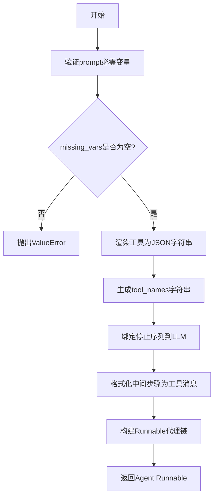
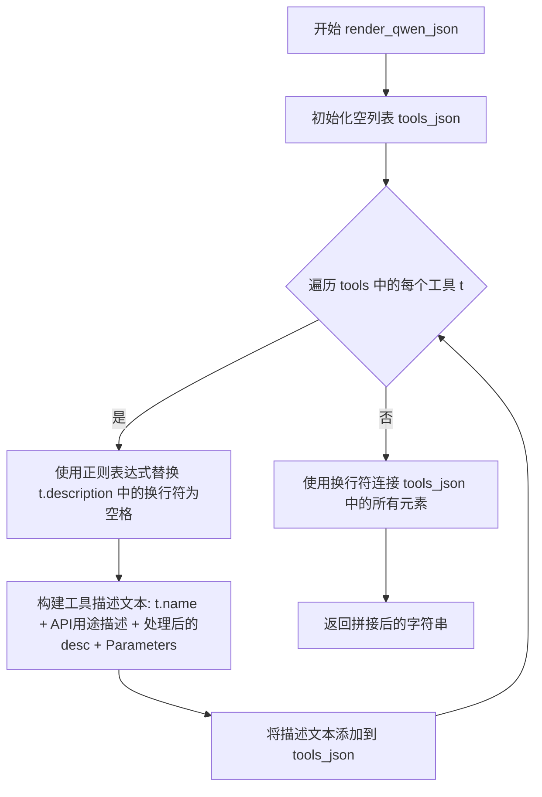
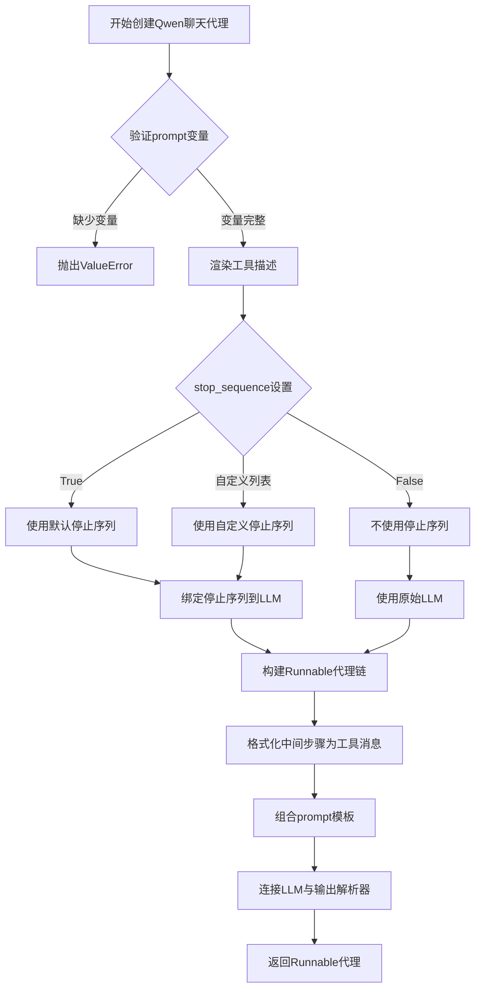
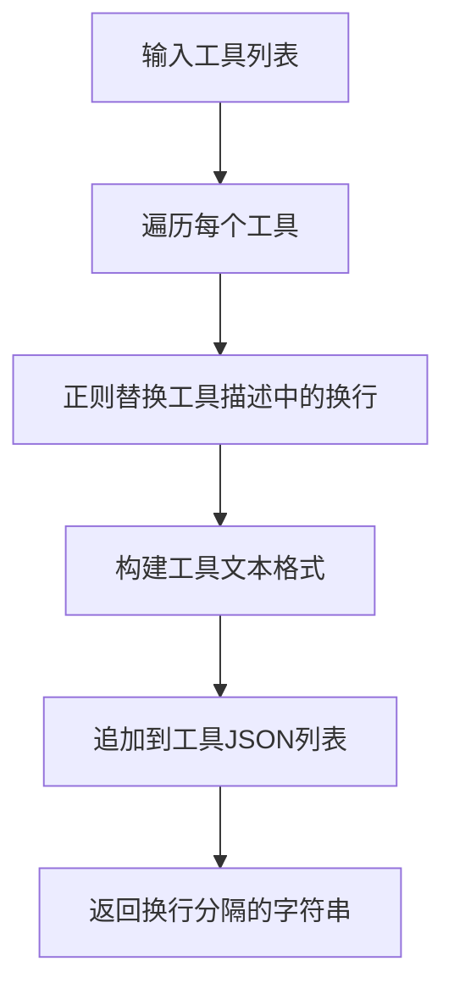
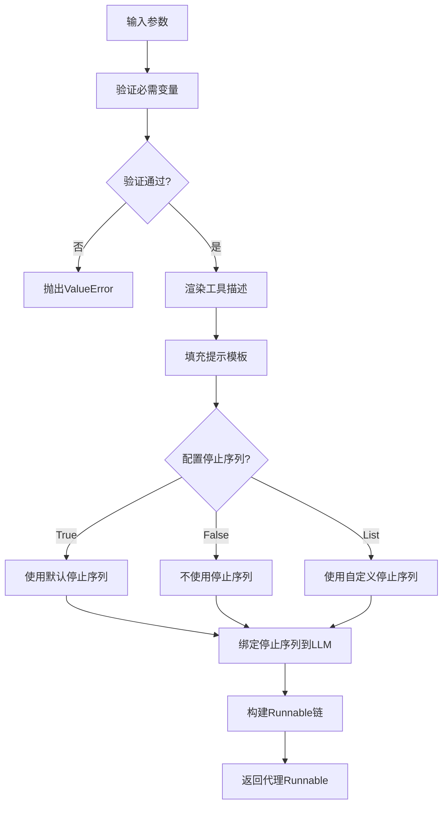

# `Langchain-Chatchat\libs\chatchat-server\langchain_chatchat\agents\structured_chat\qwen_agent.py` 详细设计文档

该模块用于创建基于Qwen模型的聊天代理（Agent），通过LangChain框架实现工具调用功能，支持渲染工具描述、绑定停止序列、处理中间步骤，并将LLM输出解析为AgentAction或AgentFinish

## 整体流程



## 类结构

```
无类定义，仅包含模块级函数
render_qwen_json (工具渲染函数)
create_qwen_chat_agent (主代理创建函数)
```

## 全局变量及字段


### `logger`
    
日志记录器实例，用于记录模块运行过程中的调试信息和错误日志

类型：`logging.Logger`
    


    

## 全局函数及方法


### `render_qwen_json`

该函数接收一个工具列表，遍历每个工具并将工具名称、描述和参数格式化为Qwen模型可读的文本描述字符串，最终返回所有工具描述的拼接结果。

参数：

- `tools`：`List[BaseTool]`，待渲染的工具列表

返回值：`str`，格式化后的Qwen工具描述字符串

#### 流程图



#### 带注释源码

```python
def render_qwen_json(tools: List[BaseTool]) -> str:
    """
    将工具列表渲染为Qwen格式的JSON描述字符串
    
    参数:
        tools: List[BaseTool] - 待渲染的工具列表
        
    返回:
        str - 格式化后的Qwen工具描述字符串
    """
    # 初始化用于存储工具描述的列表
    tools_json = []
    
    # 遍历传入的每个工具
    for t in tools:
        # 使用正则表达式将工具描述中的连续换行符替换为单个空格
        # 避免在生成的字符串中出现过多换行
        desc = re.sub(r"\n+", " ", t.description)
        
        # 构建工具的文本描述，包含：
        # 1. 工具名称和交互提示
        # 2. 工具的用途描述
        # 3. 工具的参数模式
        text = (
            f"{t.name}: Call this tool to interact with the {t.name} API. What is the {t.name} API useful for?"
            f" {desc}"
            f" Parameters: {t.args}"
        )
        
        # 将生成的描述添加到列表中
        tools_json.append(text)
    
    # 将所有工具描述用换行符连接成单一字符串并返回
    return "\n".join(tools_json)
```


### `create_qwen_chat_agent`

创建并配置一个基于Qwen模型的聊天代理（Agent），该代理能够使用工具（Tools）与外部系统交互，通过提示词模板引导LLM生成工具调用，并使用自定义输出解析器处理LLM的响应。

参数：

- `llm`：`BaseLanguageModel`，用于生成工具调用的语言模型
- `tools`：`Sequence[BaseTool]` - 代理可以访问的工具列表
- `prompt`：`ChatPromptTemplate` - 使用的提示模板，必须包含`tools`、`agent_scratchpad`等输入变量
- `tools_renderer`：`ToolsRenderer = render_qwen_json`，控制如何将工具转换为字符串传递给LLM，默认使用JSON格式渲染工具描述
- `stop_sequence`：`Union[bool, List[str]] = True`，控制停止token，True时使用默认停止序列，False禁用，自定义列表使用提供的停词
- `llm_with_platform_tools`：`List[Dict[str, Any]] = []`，平台工具列表，长度≥0的字典工具集合

返回值：`Runnable`，一个可运行的代理序列，接收与提示模板相同的输入变量，返回`AgentAction`或`AgentFinish`

#### 流程图



#### 带注释源码

```python
def create_qwen_chat_agent(
        llm: BaseLanguageModel,
        tools: Sequence[BaseTool],
        prompt: ChatPromptTemplate,
        tools_renderer: ToolsRenderer = render_qwen_json,
        *,
        stop_sequence: Union[bool, List[str]] = True,
        llm_with_platform_tools: List[Dict[str, Any]] = [],
) -> Runnable:
    """Create an agent that uses tools.

    Args:
        llm: LLM to use as the agent.
        tools: Tools this agent has access to.
        prompt: The prompt to use, must have input keys
            `tools`: contains descriptions for each tool.
            `agent_scratchpad`: contains previous agent actions and tool outputs.
        tools_renderer: This controls how the tools are converted into a string and
            then passed into the LLM. Default is `render_text_description`.
        stop_sequence: bool or list of str.
            If True, adds a stop token of "</tool_input>" to avoid hallucinates.
            If False, does not add a stop token.
            If a list of str, uses the provided list as the stop tokens.
            Default is True. You may to set this to False if the LLM you are using
            does not support stop sequences.
        llm_with_platform_tools: length ge 0 of dict tools for platform

    Returns:
        A Runnable sequence representing an agent. It takes as input all the same input
        variables as the prompt passed in does. It returns as output either an
        AgentAction or AgentFinish.

    """
    # 验证prompt是否包含代理所需的必需变量
    # 必需变量：tools（工具描述）、tool_names（工具名称）、agent_scratchpad（中间步骤）
    missing_vars = {"tools", "tool_names", "agent_scratchpad"}.difference(
        prompt.input_variables + list(prompt.partial_variables)
    )
    # 如果缺少必需变量，抛出ValueError异常
    if missing_vars:
        raise ValueError(f"Prompt missing required variables: {missing_vars}")

    # 使用tools_renderer将工具列表渲染为字符串，并填充prompt中的变量
    # partial方法允许部分填充变量，生成新的prompt实例
    prompt = prompt.partial(
        tools=tools_renderer(list(tools)),
        tool_names=", ".join([t.name for t in tools]),
    )
    
    # 处理停止序列配置
    if stop_sequence:
        # 根据stop_sequence的值确定停止token列表
        # True使用默认停止序列，False禁用，自定义列表直接使用
        stop = ["<|endoftext|>", "<|im_start|>", "<|im_end|>", "\nObservation:"] if stop_sequence is True else stop_sequence
        # 绑定停止序列到LLM，创建带停止token的LLM实例
        llm_with_stop = llm.bind(stop=stop)
    else:
        # 不使用停止序列
        llm_with_stop = llm

    # 构建Runnable代理链，使用管道操作符连接各个组件
    # 1. RunnablePassthrough.assign: 传递输入并添加agent_scratchpad字段
    # 2. format_to_platform_tool_messages: 将中间步骤格式化为平台工具消息
    # 3. prompt: 使用填充好的提示模板
    # 4. llm_with_stop: 调用LLM生成响应
    # 5. PlatformToolsAgentOutputParser: 解析LLM输出为AgentAction或AgentFinish
    agent = (
            RunnablePassthrough.assign(
                agent_scratchpad=lambda x: format_to_platform_tool_messages(x["intermediate_steps"]),
            )
            | prompt
            | llm_with_stop
            | PlatformToolsAgentOutputParser(instance_type="qwen")
    )
    return agent
```

### 关键组件信息

| 组件名称 | 一句话描述 |
|---------|-----------|
| `render_qwen_json` | 将工具列表渲染为JSON格式字符串的辅助函数 |
| `format_to_platform_tool_messages` | 将中间步骤格式化为平台工具消息的函数 |
| `PlatformToolsAgentOutputParser` | 解析LLM输出为AgentAction或AgentFinish的输出解析器 |
| `RunnablePassthrough` | LangChain的Runnable组件，用于传递输入并添加额外字段 |
| `ChatPromptTemplate` | LangChain的提示词模板类，用于构建动态提示 |

### 潜在的技术债务或优化空间

1. **参数验证不足**：`llm_with_platform_tools`参数接收了但在实际函数体中未被使用，可能存在功能未完成或遗留代码

2. **硬编码的停止序列**：默认停止序列被硬编码在函数内部，建议提取为常量或配置项

3. **缺少错误处理**：LLM调用和工具执行过程中缺少异常捕获和处理机制

4. **类型提示不完整**：`tools_renderer`参数的默认值为函数而非`ToolsRenderer`类型，建议使用`Callable`或正确定义类型

5. **日志记录缺失**：函数执行过程中没有适当的日志记录，难以追踪调试

6. **单元测试覆盖**：缺少对该核心函数的单元测试

### 其它项目

#### 设计目标与约束

- **目标**：创建一个可配置的Qwen聊天代理，支持工具调用功能
- **约束**：prompt必须包含`tools`、`tool_names`、`agent_scratchpad`变量
- **依赖**：LangChain库、langchain_chatchat项目内部模块

#### 错误处理与异常设计

- **ValueError**：当prompt缺少必需变量时抛出
- **潜在异常**：LLM调用可能抛出超时异常、网络异常，工具执行可能抛出工具特定异常

#### 数据流与状态机

```
输入变量 → 验证 → 填充prompt → 绑定LLM → 构建Runnable链
                                    ↓
                              intermediate_steps
                                    ↓
                          format_to_platform_tool_messages
                                    ↓
                          agent_scratchpad → LLM → 输出解析器 → AgentAction/AgentFinish
```

#### 外部依赖与接口契约

- **输入接口**：BaseLanguageModel、Sequence[BaseTool]、ChatPromptTemplate
- **输出接口**：Runnable（LangChain可运行对象）
- **内部依赖**：
  - `chatchat.utils.build_logger`：日志构建
  - `langchain_chatchat.agents.format_scratchpad.all_tools.format_to_platform_tool_messages`：工具消息格式化
  - `langchain_chatchat.agents.output_parsers.PlatformToolsAgentOutputParser`：输出解析


## 关键组件


### 一段话描述

该代码模块实现了创建Qwen聊天代理的核心功能，通过集成LangChain框架的工具调用能力，支持平台工具渲染、输出解析和中间步骤追踪，可构建基于Qwen模型的智能代理系统。

### 文件整体运行流程

1. **入口函数调用**：外部调用`create_qwen_chat_agent`函数，传入LLM、工具列表、提示模板等参数
2. **参数验证**：检查提示模板是否包含必需的变量（tools、tool_names、agent_scratchpad）
3. **提示模板渲染**：使用`tools_renderer`将工具列表渲染为文本描述，并填充提示模板的部分变量
4. **停止序列配置**：根据参数配置LLM的停止序列
5. **代理链构建**：通过LangChain的Runnable接口构建执行链，包含中间步骤格式化、提示模板、LLM调用和输出解析
6. **返回可运行对象**：返回配置好的代理Runnable对象供外部调用

### 全局函数详细信息

#### render_qwen_json

- **参数**：
  - `tools`: List[BaseTool] - 工具列表
- **参数描述**：需要渲染为JSON格式的工具列表
- **返回值类型**：str
- **返回值描述**：符合Qwen格式的工具描述字符串，包含每个工具的名称、用途说明和参数模式
- **mermaid流程图**：

- **带注释源码**：
```python
def render_qwen_json(tools: List[BaseTool]) -> str:
    # Create a tools variable from the list of tools provided
    # 将工具列表转换为Qwen格式的JSON字符串
    tools_json = []
    for t in tools:
        # 使用正则替换多个换行为单个空格，清理描述文本
        desc = re.sub(r"\n+", " ", t.description)
        # 构建符合Qwen工具调用格式的文本
        text = (
            f"{t.name}: Call this tool to interact with the {t.name} API. What is the {t.name} API useful for?"
            f" {desc}"
            f" Parameters: {t.args}"
        )
        tools_json.append(text)
    return "\n".join(tools_json)
```

#### create_qwen_chat_agent

- **参数**：
  - `llm`: BaseLanguageModel - 语言模型实例
  - `tools`: Sequence[BaseTool] - 可用工具序列
  - `prompt`: ChatPromptTemplate - 聊天提示模板
  - `tools_renderer`: ToolsRenderer - 工具渲染器，默认为render_qwen_json
  - `stop_sequence`: Union[bool, List[str]] - 停止序列配置
  - `llm_with_platform_tools`: List[Dict[str, Any]] - 平台工具列表
- **参数描述**：创建Qwen聊天代理所需的所有配置参数
- **返回值类型**：Runnable
- **返回值描述**：一个可运行的代理序列，可处理输入并返回AgentAction或AgentFinish
- **mermaid流程图**：

- **带注释源码**：
```python
def create_qwen_chat_agent(
        llm: BaseLanguageModel,
        tools: Sequence[BaseTool],
        prompt: ChatPromptTemplate,
        tools_renderer: ToolsRenderer = render_qwen_json,
        *,
        stop_sequence: Union[bool, List[str]] = True,
        llm_with_platform_tools: List[Dict[str, Any]] = [],
) -> Runnable:
    """Create an agent that uses tools.

    Args:
        llm: LLM to use as the agent.
        tools: Tools this agent has access to.
        prompt: The prompt to use, must have input keys
            `tools`: contains descriptions for each tool.
            `agent_scratchpad`: contains previous agent actions and tool outputs.
        tools_renderer: This controls how the tools are converted into a string and
            then passed into the LLM. Default is `render_text_description`.
        stop_sequence: bool or list of str.
            If True, adds a stop token of "</tool_input>" to avoid hallucinates.
            If False, does not add a stop token.
            If a list of str, uses the provided list as the stop tokens.
            Default is True. You may to set this to False if the LLM you are using
            does not support stop sequences.
        llm_with_platform_tools: length ge 0 of dict tools for platform

    Returns:
        A Runnable sequence representing an agent. It takes as input all the same input
        variables as the prompt passed in does. It returns as output either an
        AgentAction or AgentFinish.
    """
    # 验证提示模板是否包含必需的变量
    missing_vars = {"tools", "tool_names", "agent_scratchpad"}.difference(
        prompt.input_variables + list(prompt.partial_variables)
    )
    if missing_vars:
        raise ValueError(f"Prompt missing required variables: {missing_vars}")

    # 渲染工具描述并填充提示模板的部分变量
    prompt = prompt.partial(
        tools=tools_renderer(list(tools)),
        tool_names=", ".join([t.name for t in tools]),
    )
    
    # 配置停止序列
    if stop_sequence:
        # 默认使用多个停止标记防止幻觉
        stop = ["<|endoftext|>", "<|im_start|>", "<|im_end|>", "\nObservation:"] if stop_sequence is True else stop_sequence
        llm_with_stop = llm.bind(stop=stop)
    else:
        llm_with_stop = llm

    # 构建代理执行链：中间步骤格式化 -> 提示模板 -> LLM -> 输出解析
    agent = (
            RunnablePassthrough.assign(
                agent_scratchpad=lambda x: format_to_platform_tool_messages(x["intermediate_steps"]),
            )
            | prompt
            | llm_with_stop
            | PlatformToolsAgentOutputParser(instance_type="qwen")
    )
    return agent
```

### 关键组件信息

#### 工具渲染器 (render_qwen_json)

将BaseTool对象列表转换为Qwen模型可理解的JSON格式描述字符串，包含工具名称、API用途和参数模式。

#### 代理创建工厂 (create_qwen_chat_agent)

核心工厂函数，负责组装LLM、工具、提示模板和输出解析器，构建完整的代理执行链路。

#### 输出解析器 (PlatformToolsAgentOutputParser)

从LLM输出中解析出结构化的AgentAction或AgentFinish，支持qwen实例类型的特定解析逻辑。

#### 中间步骤格式化器 (format_to_platform_tool_messages)

将代理执行的中间步骤（工具调用和返回结果）格式化为平台工具消息，供提示模板的agent_scratchpad变量使用。

### 潜在的技术债务或优化空间

1. **硬编码的停止序列**：默认停止序列硬编码在函数内部，建议抽取为配置参数或环境变量
2. **未使用的参数**：`llm_with_platform_tools`参数在函数签名中定义但未实际使用，存在设计不完整或遗留代码问题
3. **缺乏错误处理**：LLM调用和输出解析过程中缺少异常捕获和重试机制
4. **工具描述正则处理**：使用简单的`\n+`正则替换可能无法处理复杂的工具描述格式
5. **类型注解不完整**：部分变量如内部lambda表达式缺乏类型注解，影响代码可维护性

### 其它项目

#### 设计目标与约束

- **目标**：创建支持工具调用的Qwen聊天代理，实现与平台工具的集成
- **约束**：提示模板必须包含tools、tool_names、agent_scratchpad三个变量
- **依赖**：LangChain框架、Qwen模型兼容的输出格式

#### 错误处理与异常设计

- **参数验证**：检查提示模板缺少必需变量时抛出ValueError
- **缺失处理**：运行时缺少intermediate_steps时的处理依赖format_to_platform_tool_messages的实现

#### 数据流与状态机

- **输入数据**：用户查询、工具列表、提示模板、中间步骤
- **处理流程**：工具渲染 → 提示填充 → LLM推理 → 输出解析
- **输出数据**：AgentAction（工具调用指令）或AgentFinish（最终回答）

#### 外部依赖与接口契约

- **langchain.prompts.chat.ChatPromptTemplate**：提示模板接口
- **langchain.schema.language_model.BaseLanguageModel**：语言模型抽象
- **langchain.tools.base.BaseTool**：工具抽象
- **langchain_core.runnables.Runnable**：可运行对象接口
- **langchain_chatchat.agents.format_scratchpad.all_tools.format_to_platform_tool_messages**：内部工具消息格式化函数
- **langchain_chatchat.agents.output_parsers.PlatformToolsAgentOutputParser**：平台工具输出解析器


## 问题及建议


### 已知问题

- **未使用的参数**：`llm_with_platform_tools` 参数被传入但在函数体中完全没有使用，造成函数签名与实现不匹配。
- **`render_qwen_json` 中 `t.args` 类型问题**：`t.args` 可能返回的是 JSON 对象而非字符串，直接拼接可能导致输出格式不符合预期。
- **硬编码的 Stop Tokens**：`"<|endoftext|>", "<|im_start|>", "<|im_end|>"` 这些 stop tokens 是硬编码的，与特定模型强耦合，缺乏灵活性。
- **日志记录不足**：仅依赖全局 logger，缺乏对关键路径（如参数验证失败、代理创建成功）的详细日志。
- **类型提示不完整**：lambda 函数 `agent_scratchpad` 缺少返回类型注解，参数 `stop_sequence` 的类型定义可以更精确。
- **错误处理不完善**：未对空工具列表、LLM 为空等边界情况进行处理。
- **Prompt 变量覆盖风险**：`prompt.partial()` 会覆盖 prompt 中的原有变量，如果用户自定义了 tools 或 tool_names，可能被意外替换。

### 优化建议

- **实现 `llm_with_platform_tools` 功能**：如果该参数用于将平台工具绑定到 LLM，应在代码中实际使用它，例如通过 `llm.bind(tools=llm_with_platform_tools)`。
- **添加输入验证**：在函数开头增加对 `tools` 是否为空、`llm` 是否为 `None` 等的校验。
- **解耦 Stop Tokens**：将硬编码的 stop tokens 移除到配置或默认值中，允许调用者通过参数自定义。
- **完善类型注解**：为 lambda 函数添加返回类型 `-> str`，为复杂参数添加更精确的类型定义。
- **增强日志**：在关键路径添加 `logger.info()` 或 `logger.debug()`，记录代理创建的参数和状态。
- **处理 `t.args` 类型**：在使用 `t.args` 前进行类型检查，确保其为字符串或进行适当转换。

## 其它


### 设计目标与约束

本代码的核心设计目标是创建一个能够使用工具的Qwen聊天代理（Agent），通过LangChain框架实现LLM与工具调用的集成。约束条件包括：1) 必须提供LLM、工具列表和提示模板；2) 提示模板必须包含`tools`、`tool_names`和`agent_scratchpad`变量；3) 支持自定义停止序列以减少幻觉；4) 仅支持Qwen模型（通过`PlatformToolsAgentOutputParser(instance_type="qwen")`指定）。

### 错误处理与异常设计

代码中的错误处理主要包括：1) **参数验证错误**：在`create_qwen_chat_agent`函数中检查提示模板是否包含必需变量（`tools`、`tool_names`、`agent_scratchpad`），若缺失则抛出`ValueError`异常；2) **类型错误**：通过类型提示（Type Hints）约束参数类型，如`llm`必须为`BaseLanguageModel`类型，`tools`必须为`Sequence[BaseTool]`类型；3) **平台工具解析异常**：由`PlatformToolsAgentOutputParser`内部处理，可能抛出`OutputParserException`。建议增加：工具渲染失败时的异常处理、LLM调用超时的重试机制、平台工具列表为空时的边界条件处理。

### 数据流与状态机

数据流如下：1) 输入：LLM实例、工具序列、提示模板、工具渲染器、停止序列配置、平台工具字典列表；2) 处理流程：`RunnablePassthrough.assign`收集中间步骤→`format_to_platform_tool_messages`格式化工具消息→提示模板渲染（填充tools和tool_names）→LLM绑定停止序列后调用→`PlatformToolsAgentOutputParser`解析输出；3) 输出：返回`Runnable`对象，可执行并返回`AgentAction`或`AgentFinish`。状态机方面，代理在`AgentAction`（执行工具）和`AgentFinish`（返回最终结果）之间循环，直到达到终止条件。

### 外部依赖与接口契约

主要外部依赖包括：1) **langchain**：`BaseLanguageModel`、`AgentAction`、`AgentFinish`、`OutputParserException`、`ChatPromptTemplate`、`BaseTool`、`Runnable`、`RunnablePassthrough`；2) **langchain_chatchat**：`format_to_platform_tool_messages`（格式化工具消息）、`QwenChatAgentOutputParserCustom`、`PlatformToolsAgentOutputParser`；3) **chatchat**：`build_logger`；4) **标准库**：`json`、`logging`、`re`、`typing`。接口契约：1) `llm`参数必须实现`BaseLanguageModel`接口；2) `tools`参数中的每个元素必须实现`BaseTool`接口，包含`name`、`description`、`args`属性；3) `prompt`参数必须实现`ChatPromptTemplate`接口，支持`partial`方法；4) `tools_renderer`必须是可调用对象，接收`List[BaseTool]`返回`str`。

### 性能考虑

性能优化点：1) **工具渲染缓存**：`tools_renderer`在每次调用时都会执行，对于大量工具场景可考虑缓存渲染结果；2) **停止序列绑定**：`llm.bind(stop=stop)`在代理创建时执行一次，避免重复绑定开销；3) **中间步骤处理**：`format_to_platform_tool_messages`可能存在性能瓶颈，建议评估大数据量场景下的表现；4) **提示模板部分求值**：使用`prompt.partial()`预先填充静态变量，减少运行时计算。潜在问题：平台工具列表`llm_with_platform_tools`虽然接收但未在当前代码路径中使用，可能存在设计遗漏。

### 安全性考虑

安全相关设计：1) **正则表达式处理**：使用`re.sub(r"\n+", " ", t.description)`清理工具描述，防止换行符注入；2) **停止序列配置**：默认包含多个停止序列（`<|endoftext|>`、`<|im_start|>`、`<|im_end|>`、`\nObservation:`），有助于防止LLM产生不安全的输出；3) **工具描述暴露**：通过`render_qwen_json`将工具描述以特定格式暴露给LLM，需确保工具描述不包含敏感信息。安全建议：1) 对用户输入的工具进行安全校验；2) 添加工具调用权限控制；3) 限制工具调用深度防止无限循环。

### 配置说明

主要配置参数：1) `llm`：必需，LLM模型实例，支持任何实现`BaseLanguageModel`接口的模型；2) `tools`：必需，工具列表，支持任意数量的`BaseTool`实例；3) `prompt`：必需，聊天提示模板，必须包含`tools`、`tool_names`、`agent_scratchpad`变量；4) `tools_renderer`：可选，默认`render_qwen_json`，控制工具描述的渲染方式；5) `stop_sequence`：可选，默认为`True`，可设置为`False`或自定义停止序列列表；6) `llm_with_platform_tools`：可选，默认为空列表，用于平台工具集成。

### 使用示例

```python
from langchain_openai import ChatOpenAI
from langchain.tools import Tool
from langchain.prompts import ChatPromptTemplate

# 1. 定义工具
def search_api(query: str) -> str:
    return f"Search results for: {query}"

tools = [
    Tool(
        name="search",
        func=search_api,
        description="Useful for searching information. Input should be a search query."
    )
]

# 2. 创建提示模板
prompt = ChatPromptTemplate.from_messages([
    ("system", "You are a helpful assistant."),
    ("user", "{input}"),
    ("assistant", "Scratchpad: {agent_scratchpad}"),
    ("user", "Tools: {tools}")
])

# 3. 创建代理
llm = ChatOpenAI(model="qwen-turbo")
agent = create_qwen_chat_agent(
    llm=llm,
    tools=tools,
    prompt=prompt
)

# 4. 执行代理
result = agent.invoke({"input": "Search for Python tutorials"})
```

### 版本历史与变更记录

本代码基于LangChain框架构建，与以下版本兼容：1) langchain >= 0.1.0；2) langchain-core >= 0.1.0；3) langchain_chatchat >= 0.1.0（自定义输出解析器）。主要版本变更：初始版本支持Qwen模型工具调用、引入`render_qwen_json`工具渲染器、集成平台工具输出解析器`PlatformToolsAgentOutputParser`。


    