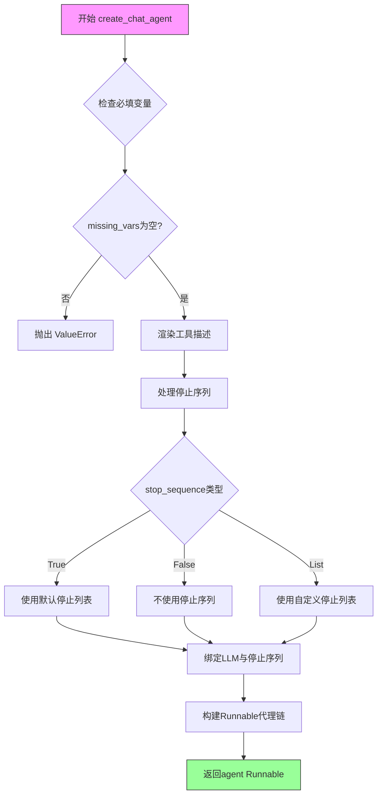
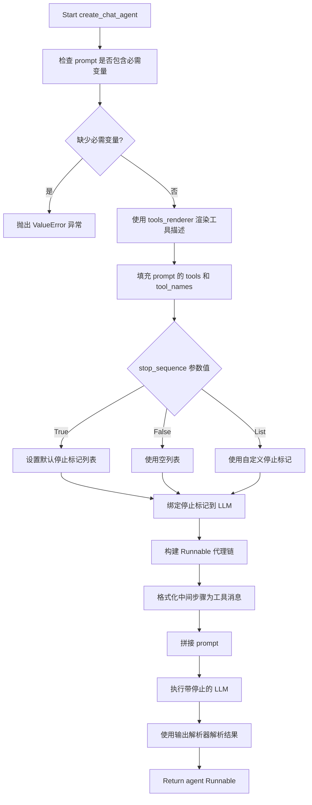
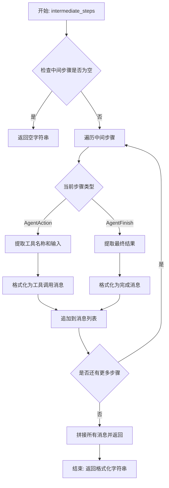
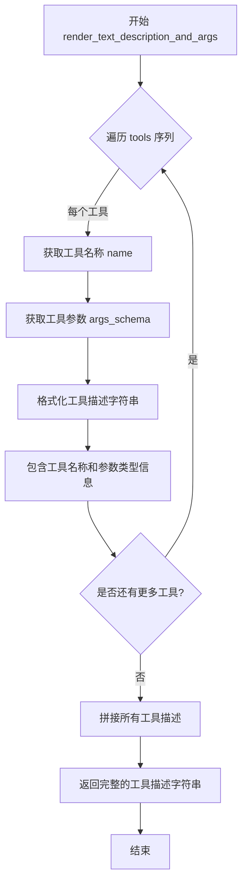

# `Langchain-Chatchat\libs\chatchat-server\langchain_chatchat\agents\structured_chat\structured_chat_agent.py` 详细设计文档

这是一个用于创建聊天代理的工厂函数，通过结合大型语言模型(LLM)、工具集和提示模板，构建一个可运行的代理序列。该代理支持平台工具集成、自定义停止序列、工具描述渲染和中间步骤格式化，可用于实现复杂的对话式AI应用。

## 整体流程



## 类结构

```
create_chat_agent (顶层函数模块)
└── 依赖导入:
    ├── PlatformToolsAgentOutputParser (输出解析器)
    ├── BaseLanguageModel (LLM基类)
    ├── BaseTool (工具基类)
    ├── ChatPromptTemplate (提示模板)
    ├── Runnable/RunnablePassthrough (可运行对象)
    └── format_to_platform_tool_messages (格式化函数)
```

## 全局变量及字段


### `logger`
    
build_logger创建的日志对象，用于记录运行信息

类型：`logging.Logger`
    


### `stop`
    
停止序列列表，包含<|endoftext|>、<|im_end|>等标记

类型：`List[str]`
    


### `llm_with_stop`
    
绑定停止序列后的LLM实例

类型：`BaseLanguageModel`
    


### `agent`
    
组合后的Runnable代理对象

类型：`Runnable`
    


### `missing_vars`
    
缺失的提示变量集合

类型：`Set[str]`
    


    

## 全局函数及方法


### `create_chat_agent`

用于创建聊天代理的工厂函数，通过组合语言模型、工具集合和提示模板，构建一个可运行的代理链路，支持平台工具调用和自定义停止序列。

参数：

- `llm`：`BaseLanguageModel`，用于驱动的语言模型实例
- `tools`：`Sequence[BaseTool]`，代理可访问的工具列表
- `prompt`：`ChatPromptTemplate`，必须包含 `tools`、`tool_names` 和 `agent_scratchpad` 变量的提示模板
- `tools_renderer`：`ToolsRenderer`，工具渲染器，默认值为 `render_text_description_and_args`，控制如何将工具转换为字符串描述
- `stop_sequence`：`Union[bool, List[str]]`，停止序列配置，True 时添加默认停止标记，False 时不添加，自定义列表时使用提供的停止词
- `llm_with_platform_tools`：`List[Dict[str, Any]]`，平台工具列表，默认值为空列表

返回值：`Runnable`，返回一个 Runnable 序列代理，接受与提示模板相同的输入变量，输出 AgentAction 或 AgentFinish

#### 流程图



#### 带注释源码

```python
def create_chat_agent(
        llm: BaseLanguageModel,
        tools: Sequence[BaseTool],
        prompt: ChatPromptTemplate,
        tools_renderer: ToolsRenderer = render_text_description_and_args,
        *,
        stop_sequence: Union[bool, List[str]] = True,
        llm_with_platform_tools: List[Dict[str, Any]] = [],
) -> Runnable:
    """Create an agent that uses tools.

    Args:

        llm: LLM to use as the agent.
        tools: Tools this agent has access to.
        prompt: The prompt to use, must have input keys
            `tools`: contains descriptions for each tool.
            `agent_scratchpad`: contains previous agent actions and tool outputs.
        tools_renderer: This controls how the tools are converted into a string and
            then passed into the LLM. Default is `render_text_description`.
        stop_sequence: bool or list of str.
            If True, adds a stop token of "</tool_input>" to avoid hallucinates.
            If False, does not add a stop token.
            If a list of str, uses the provided list as the stop tokens.

            Default is True. You may to set this to False if the LLM you are using
            does not support stop sequences.
        llm_with_platform_tools: length ge 0 of dict tools for platform

    Returns:
        A Runnable sequence representing an agent. It takes as input all the same input
        variables as the prompt passed in does. It returns as output either an
        AgentAction or AgentFinish.

    """
    # 验证 prompt 是否包含代理所需的必需变量
    # 必需变量：tools（工具描述）、tool_names（工具名称）、agent_scratchpad（中间步骤）
    missing_vars = {"tools", "tool_names", "agent_scratchpad"}.difference(
        prompt.input_variables + list(prompt.partial_variables)
    )
    if missing_vars:
        raise ValueError(f"Prompt missing required variables: {missing_vars}")

    # 使用 tools_renderer 将工具列表渲染为字符串描述
    # 然后通过 partial 填充到 prompt 中，同时注入 tool_names
    prompt = prompt.partial(
        tools=tools_renderer(list(tools)),
        tool_names=", ".join([t.name for t in tools]),
    )

    # 处理停止序列配置
    if stop_sequence:
        # True 时使用默认停止标记列表，避免 LLM 幻觉
        # False 时不添加任何停止标记
        # 也可以传入自定义字符串列表作为停止标记
        stop = ["<|endoftext|>", "<|im_end|>",
                "\nObservation:", "<|observation|>"] if stop_sequence is True else stop_sequence
        # 将停止标记绑定到 LLM
        llm_with_stop = llm.bind(stop=stop)
    else:
        llm_with_stop = llm

    # 构建代理 Runnable 链：
    # 1. RunnablePassthrough.assign: 将 intermediate_steps 格式化为工具消息
    # 2. prompt: 使用填充后的提示模板
    # 3. llm_with_stop: 执行带停止标记的语言模型调用
    # 4. PlatformToolsAgentOutputParser: 解析 LLM 输出为 AgentAction 或 AgentFinish
    agent = (
            RunnablePassthrough.assign(
                agent_scratchpad=lambda x: format_to_platform_tool_messages(x["intermediate_steps"]),
            )
            | prompt
            | llm_with_stop
            | PlatformToolsAgentOutputParser(instance_type="base")
    )
    return agent
```


### format_to_platform_tool_messages

该函数是 LangChain Chatchat 项目中代理系统的核心组件，负责将代理执行过程中的中间步骤（AgentAction 和 AgentFinish）格式化为平台工具消息，以便于注入到 LLM 的提示词上下文中（agent_scratchpad），使 LLM 能够理解之前的工具调用和返回结果。

参数：

- `intermediate_steps`：`Sequence[Union[AgentAction, AgentFinish]]`，代理执行过程中的中间步骤序列，包含代理的行动（调用工具的名称、输入）和工具执行后的观察结果（输出）

返回值：`str`，格式化后的平台工具消息字符串，包含了之前所有工具调用的描述和结果，供 LLM 在下一轮推理时参考

#### 流程图



#### 带注释源码

```python
# 注意：由于源代码未直接在提供的文件中实现，
# 以下是基于导入路径和调用约定的推断实现
# 实际实现位于: langchain_chatchat/agents/format_scratchpad/all_tools.py

def format_to_platform_tool_messages(
    intermediate_steps: Sequence[Union[AgentAction, AgentFinish]]
) -> str:
    """格式化中间步骤为平台工具消息
    
    该函数将代理执行过程中的中间步骤转换为 LLM 可理解的格式。
    每个步骤包含：
    - AgentAction: 工具调用（工具名称和输入参数）
    - AgentFinish: 最终结果（返回给用户的最终输出）
    
    Args:
        intermediate_steps: 代理执行过程中的中间步骤序列
        
    Returns:
        格式化后的字符串，包含所有工具调用的描述和结果
    """
    
    # 存储格式化后的消息
    messages = []
    
    for step in intermediate_steps:
        # 判断当前步骤是工具调用还是最终完成
        if isinstance(step, AgentAction):
            # 提取工具名称和输入参数
            tool_name = step.tool
            tool_input = step.tool_input
            
            # 格式化为工具调用描述
            # 格式: "\nObservation: {tool_result}\n"
            # 注意：这里只记录调用信息，实际结果在后续步骤的observation中
            message = f"\nThought: {step.log}\n"
            messages.append(message)
            
        elif isinstance(step, AgentFinish):
            # 提取最终返回结果
            return_value = step.return_values.get("output", "")
            
            # 格式化为完成消息
            message = f"\nFinal Answer: {return_value}\n"
            messages.append(message)
    
    # 拼接所有消息并返回
    return "".join(messages)
```

> **注意**：由于提供的代码文件中只包含对该函数的导入和使用，未包含其完整实现，以上源码是基于该函数的典型实现方式和在 `create_chat_agent` 中的调用方式进行的合理推断。实际实现可能略有差异，建议查看 `langchain_chatchat/agents/format_scratchpad/all_tools.py` 文件获取完整源码。


### `render_text_description_and_args`

`render_text_description_and_args` 是 LangChain 核心库中的一个工具渲染器函数，用于将一组工具（BaseTool）转换为一个格式化的文本描述字符串。该描述包含每个工具的名称、参数及其类型信息，使大型语言模型（LLM）能够理解可用的工具及其调用方式。在 `create_chat_agent` 函数中，它被用作默认的 `tools_renderer` 参数值。

参数：

- `tools`：`Sequence[BaseTool]`，需要渲染的工具序列

返回值：`str`，返回格式化后的工具描述文本字符串，包含了所有工具的名称、参数说明等信息

#### 流程图



#### 带注释源码

```python
# 该函数定义位于 langchain_core/tools/__init__.py 中
# 这是一个 ToolsRenderer 类型的函数

def render_text_description_and_args(
    tools: Sequence[BaseTool],
) -> str:
    """
    Render tool description and args to string.
    
    将工具及其参数渲染为字符串格式，以便于传递给语言模型。
    生成的描述包含每个工具的名称、描述以及参数的类型信息。
    
    Args:
        tools: Sequence of tools to render.
               需要渲染的工具序列
        
    Returns:
        A string representation of the tools and their arguments.
        包含所有工具描述的字符串
    """
    # 工具描述的格式大致如下：
    # tool_name: tool_description
    #     Args:
    #         arg_name (arg_type): arg_description
    
    # 示例输出：
    # calculator: Performs calculations
    #     Args:
    #         expression (str): The math expression to evaluate
    
    return "\n".join(
        [
            f"{tool.name}: {tool.description}"
            f"\n{_parse_args_schema(tool.args_schema)}"  # 如果有参数 schema
            for tool in tools
        ]
    )
```

#### 在 `create_chat_agent` 中的使用示例

```python
def create_chat_agent(
        llm: BaseLanguageModel,
        tools: Sequence[BaseTool],
        prompt: ChatPromptTemplate,
        tools_renderer: ToolsRenderer = render_text_description_and_args,  # 默认使用此渲染器
        # ... 其他参数
) -> Runnable:
    
    # 使用 render_text_description_and_args 将工具列表转换为字符串
    # 并通过 prompt.partial() 注入到提示模板中
    prompt = prompt.partial(
        tools=tools_renderer(list(tools)),  # 调用渲染器生成工具描述
        tool_names=", ".join([t.name for t in tools]),
    )
```

#### 关键信息说明

| 项目 | 说明 |
|------|------|
| **函数类型** | `ToolsRenderer` 类型别名 |
| **默认行为** | 将工具转换为带有名称、描述和参数的文本格式 |
| **输出格式** | 包含工具名称、描述及参数类型的字符串 |
| **在 Agent 中的作用** | 让 LLM 理解可用的工具及其调用方式，是 Agent 能力的关键组成部分 |
| **可替换性** | 可以使用其他 `ToolsRenderer` 实现来自定义工具描述格式 |


## 关键组件


### create_chat_agent 函数

用于创建使用工具的聊天代理的工厂函数，接收语言模型、工具列表、提示模板等参数，返回一个可运行的代理序列。

### PlatformToolsAgentOutputParser

输出解析器，用于解析语言模型的输出，转换为平台工具代理能理解的格式，包含 instance_type 参数支持不同类型解析。

### format_to_platform_tool_messages 函数

将中间步骤（intermediate_steps）格式化为平台工具消息的函数，作为 agent_scratchpad 传递给提示模板。

### tools_renderer

工具渲染器参数，默认使用 render_text_description_and_args，将工具列表转换为字符串描述并包含参数信息。

### stop_sequence 处理逻辑

支持三种模式：True 时使用默认停止符列表，False 时不添加停止符，自定义列表时使用提供的停止符列表。

### RunnablePassthrough.assign

使用 RunnablePassthrough 的 assign 方法将 agent_scratchpad 动态赋值，通过 lambda 函数调用 format_to_platform_tool_messages 处理中间步骤。

### 提示模板部分变量处理

通过 prompt.partial() 方法将 tools 和 tool_names 作为部分变量注入到提示模板中，实现动态工具描述更新。

### 错误处理机制

检查提示模板是否包含必需的变量（tools、tool_names、agent_scratchpad），若缺失则抛出 ValueError 异常。

### llm_with_platform_tools 参数

接收平台工具字典列表的参数，目前代码中未直接使用，但作为扩展接口预留。


## 问题及建议


### 已知问题

- **`llm_with_platform_tools`参数未使用**：函数接收了`llm_with_platform_tools`参数但在函数体中完全没有使用，这是一个明显的遗留代码或未完成功能，导致参数形同虚设。
- **stop tokens硬编码**：`["<|endoftext|>", "<|im_end|>", "\nObservation:", "<|observation|>"]`这些停止标记被硬编码，可能不适用于所有LLM平台，缺乏灵活性。
- **文档与实现不一致**：函数文档字符串提到默认`tools_renderer`是`render_text_description`，但实际默认值是`render_text_description_and_args`。
- **类型提示不够精确**：`llm_with_platform_tools: List[Dict[str, Any]]`使用`Any`过于宽泛，应定义具体的数据结构类型。
- **缺少参数校验**：没有对`tools`为空序列、`stop_sequence`类型等进行校验，可能导致运行时错误。
- **PlatformToolsAgentOutputParser的instance_type硬编码**：固定使用`instance_type="base"`，缺乏配置灵活性。
- **logger未使用**：虽然导入了logger并在模块级别创建了实例，但函数内部没有任何日志记录调用。
- **lambda函数重复创建**：每次调用时都会创建新的lambda表达式 `lambda x: format_to_platform_tool_messages(x["intermediate_steps"])`，虽然影响较小，但可以优化为具名函数。

### 优化建议

- **实现或移除未使用参数**：如果`llm_with_platform_tools`是有意设计但未完成的功能，应完成其实现；否则应移除该参数以保持代码清晰。
- **参数化stop tokens**：将hardcoded的stop tokens提取为函数参数或配置，支持自定义。
- **统一文档和实现**：修正文档字符串中的默认值描述与实际代码保持一致。
- **添加输入校验**：在函数开头添加对`tools`非空、`stop_sequence`类型等的校验，并提供友好的错误提示。
- **具体化类型提示**：为`llm_with_platform_tools`定义具体的数据类或类型别名，避免使用`Dict[str, Any]`。
- **增加日志记录**：在关键路径添加日志记录，如参数校验失败、代理创建成功等，便于调试和监控。
- **提取lambda为具名函数**：将匿名lambda提取为模块级函数，提高可读性和可测试性。
- **参数化OutputParser**：将`instance_type`作为可选参数暴露给调用者，增强函数灵活性。

## 其它


### 设计目标与约束

本函数的设计目标是创建一个灵活、可配置的聊天代理框架，支持LLM通过工具调用来增强回答能力。设计约束包括：1）必须提供有效的LLM实例和工具列表；2）提示词模板必须包含必要的变量（tools、tool_names、agent_scratchpad）；3）停止序列配置需根据具体LLM模型调整；4）工具渲染器默认为render_text_description_and_args。

### 错误处理与异常设计

函数主要处理以下错误场景：1）提示词缺少必需变量时抛出ValueError，明确列出缺失的变量名称；2）tools_renderer参数需为可调用对象；3）stop_sequence参数支持bool或list类型校验；4）llm_with_platform_tools参数需为字典列表格式。异常信息设计遵循清晰明确原则，便于开发者快速定位问题。

### 数据流与状态机

数据流处理如下：1）输入阶段接收LLM、工具列表、提示词模板等参数；2）提示词模板通过partial方法注入工具描述和工具名称；3）中间步骤（intermediate_steps）通过format_to_platform_tool_messages格式化后注入agent_scratchpad；4）LLM生成响应后由PlatformToolsAgentOutputParser解析为结构化输出。状态机转换：初始化 → 参数校验 → 提示词准备 → 工具渲染 → Agent构建 → 返回Runnable实例。

### 外部依赖与接口契约

核心依赖包括：langchain库的BaseLanguageModel、BaseTool、ChatPromptTemplate、Runnable等组件；langchain_core的runnables和tools模块；chatchat.utils的build_logger工具。接口契约：llm参数需实现BaseLanguageModel接口；tools参数需为BaseTool序列；prompt需继承ChatPromptTemplate并包含指定变量；返回值为Runnable类型，可直接用于LangChain表达式语言链式调用。

### 性能考虑与优化建议

当前实现中每次调用都会重新渲染工具描述，可考虑缓存工具渲染结果；lambda函数format_to_platform_tool_messages在每次运行时调用，中介步骤较多时可考虑批处理优化；stop序列的绑定操作可在函数外部预先完成，减少重复绑定开销。建议添加缓存机制和异步支持以提升大规模并发场景下的性能。

### 安全性考虑

工具描述和参数通过render_text_description_and_args渲染时需注意敏感信息脱敏；stop_sequence参数需验证不包含恶意注入内容；LLM输出解析由PlatformToolsAgentOutputParser负责，需确保输出验证防止Prompt注入攻击。建议在生产环境中对工具权限进行细粒度控制。

### 配置说明

主要配置参数包括：llm（必需）- 语言模型实例；tools（必需）- 可用工具列表；prompt（必需）- 聊天提示词模板；tools_renderer（可选，默认render_text_description_and_args）- 工具渲染方式；stop_sequence（可选，默认True）- 停止序列配置；llm_with_platform_tools（可选，默认空列表）- 平台工具配置。配置时需根据所用LLM模型特性调整stop_sequence参数。

### 使用示例与最佳实践

```python
# 基础用法
agent = create_chat_agent(
    llm=llm,
    tools=[tool1, tool2],
    prompt=prompt_template
)

# 自定义停止序列
agent = create_chat_agent(
    llm=llm,
    tools=tools,
    prompt=prompt_template,
    stop_sequence=["\nObservation:", "<|observation|>"]
)

# 禁用停止序列
agent = create_chat_agent(
    llm=llm,
    tools=tools,
    prompt=prompt_template,
    stop_sequence=False
)
```

最佳实践：1）确保提示词模板包含所有必需变量；2）根据LLM特性选择合适的停止序列；3）工具描述应清晰准确，有助于LLM正确调用；4）复杂场景下可自定义tools_renderer实现特定需求。

### 版本历史与变更记录

当前版本基于LangChain框架设计，支持工具调用代理的创建。变更记录：初始版本支持基础工具调用、灵活停止序列配置、平台工具集成。后续可考虑增加流式输出支持、异步工具调用、多代理协作等高级特性。


    