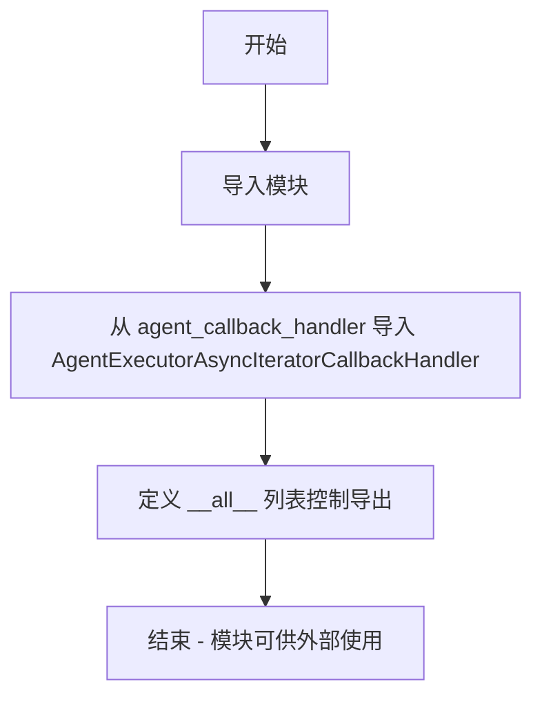
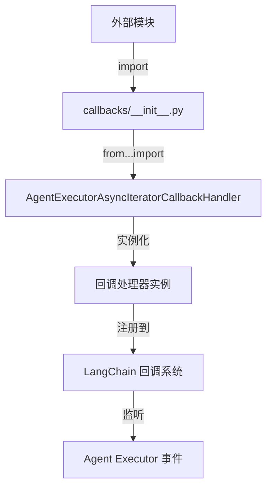

# `Langchain-Chatchat\libs\chatchat-server\langchain_chatchat\callbacks\__init__.py` 详细设计文档

这是 LangChain-ChatChat 项目的回调处理器模块初始化文件，核心功能是导出 AgentExecutorAsyncIteratorCallbackHandler 类，用于监听和处理 LangChain 代理执行器中的异步迭代器事件，实现对 Agent 执行过程的监控和回调处理。

## 整体流程



## 类结构

```
callbacks/
├── __init__.py (当前文件 - 模块入口)
└── agent_callback_handler.py (具体实现)
```

## 全局变量及字段


### `__all__`
    
定义模块的公共API接口，指定从模块导入时允许访问的名称列表

类型：`list[str]`
    


    

## 全局函数及方法


## 关键组件


## 一段话描述

该代码文件是 LangChain ChatChat 的回调处理器模块入口，仅导出了 `AgentExecutorAsyncIteratorCallbackHandler` 类，用于监听和处理代理执行器（Agent Executor）执行过程中的异步迭代事件。

## 文件的整体运行流程

该模块作为回调处理器的公共接口层，通过 `__all__` 显式导出 `AgentExecutorAsyncIteratorCallbackHandler`，供外部模块导入使用。其运行流程为：外部模块导入该入口文件 → 通过 `from...import` 获取目标回调处理器类 → 实例化该类并注册到 LangChain 的回调系统中 → 在代理执行器运行过程中接收事件通知。

## 类的详细信息

### AgentExecutorAsyncIteratorCallbackHandler

**类字段：**

- 无公开的类字段信息（需参考 agent_callback_handler.py 源码）

**类方法：**

- 无公开的类方法信息（需参考 agent_callback_handler.py 源码）

**全局变量：**

- `__all__`：list 类型，定义模块的公开 API 列表，仅包含 "AgentExecutorAsyncIteratorCallbackHandler"

**全局函数：**

- 无全局函数

**mermaid 流程图：**



**带注释源码：**

```python
# -*- coding: utf-8 -*-
"""**Callback handlers** allow listening to events in LangChain.

**Class hierarchy:**

.. code-block::

    BaseCallbackHandler --> <name>CallbackHandler  # Example: AimCallbackHandler
"""
# 从 agent_callback_handler 模块导入异步迭代器回调处理器
from langchain_chatchat.callbacks.agent_callback_handler import (
    AgentExecutorAsyncIteratorCallbackHandler,
)

# 定义模块的公开接口，仅导出异步迭代器回调处理器
__all__ = [
    "AgentExecutorAsyncIteratorCallbackHandler",
]
```

## 关键组件信息

### AgentExecutorAsyncIteratorCallbackHandler

代理执行器异步迭代器回调处理器，用于在 LangChain 代理执行过程中捕获异步迭代事件，支持流式输出和事件监听。

### BaseCallbackHandler

LangChain 回调处理器的基类（文档中提及），所有自定义回调处理器均继承自此类。

## 潜在的技术债务或优化空间

1. **导出类单一**：当前仅导出一个回调处理器类，若后续需要更多回调处理器（如 AimCallbackHandler、ChatVectorDBCallbackHandler 等），需要在此文件中逐一添加，可能导致维护成本增加
2. **文档缺失**：该模块的 docstring 仅包含类层级说明，未说明具体使用场景和参数说明
3. **依赖隐藏**：具体的实现细节被隐藏在 agent_callback_handler.py 中，入口文件未提供任何抽象或封装

## 其它项目

### 设计目标与约束

- **设计目标**：提供统一的回调处理器导出入口，遵循 LangChain 的回调机制
- **约束**：仅作为模块入口，不包含具体实现逻辑

### 错误处理与异常设计

- 未在该文件中定义错误处理逻辑，异常由底层 agent_callback_handler.py 抛出

### 数据流与状态机

- 数据流：外部导入 → 回调系统注册 → 代理执行事件 → 回调处理
- 状态机：初始化 → 注册 → 监听状态 → 事件触发

### 外部依赖与接口契约

- **依赖**：langchain_chatchat.callbacks.agent_callback_handler
- **接口**：遵循 LangChain 的 BaseCallbackHandler 接口规范


## 问题及建议


### 已知问题

-   **模块功能单一**：当前模块仅导入并导出一个回调处理器类，作为 callbacks 模块入口显得过于简单，缺乏作为统一导出入口的完整性
-   **文档与实现不一致**：docstring 描述为 "LangChain" 的回调处理器，但实际导入路径为 `langchain_chatchat`，存在上下文不匹配
-   **可扩展性不足**：`__all__` 列表仅包含单一导出项，未来扩展其他回调处理器时需要频繁修改该文件
-   **类型注解缺失**：源代码中未包含任何类型注解（Type Hints），影响代码的可读性和 IDE 支持
-   **无错误处理机制**：直接导入语句未包装在 try-except 中，若目标模块或类不存在，导入失败时错误信息不够友好

### 优化建议

-   **丰富模块导出内容**：将 `langchain_chatchat.callbacks` 目录下的其他回调处理器类统一在此文件导出，形成统一的模块入口
-   **修正文档描述**：更新 docstring 为 `langchain_chatchat` 相关的回调处理器说明，保持文档与实际实现的一致性
-   **添加类型注解**：为导入的类添加类型注解，提高代码可维护性
-   **增加导入错误处理**：对导入语句添加可选的错误处理或重新导出逻辑，提升模块的健壮性
-   **考虑使用相对导入一致性**：确保导入路径风格统一，保持模块导入的一致性

## 其它


### 设计目标与约束

该模块作为LangChain回调处理器体系的一部分，旨在提供异步迭代器形式的回调处理能力，支持对Agent执行过程中的事件进行监听和响应。设计约束包括：必须继承自BaseCallbackHandler，遵循LangChain的回调接口规范，支持异步操作，具备线程安全性。

### 错误处理与异常设计

模块未在当前文件中显式定义异常处理逻辑，异常传播依赖于导入的AgentExecutorAsyncIteratorCallbackHandler类本身的实现。预期该类会处理如连接超时、资源不可用、迭代中断等异常情况，并遵循LangChain的错误处理规范。

### 数据流与状态机

数据流主要涉及从AgentExecutor到CallbackHandler的事件传递机制。当Agent执行过程中触发特定事件（如on_agent_action、on_agent_finish等）时，事件数据通过回调链传播至AgentExecutorAsyncIteratorCallbackHandler，转化为异步迭代器的输出项供外部消费。状态机主要管理CallbackHandler的内部状态，包括是否正在监听、是否已结束等状态转换。

### 外部依赖与接口契约

核心依赖为langchain_chatchat.callbacks.agent_callback_handler模块，需要导入AgentExecutorAsyncIteratorCallbackHandler类。接口契约包括：该类必须实现BaseCallbackHandler的所有抽象方法（如on_llm_start、on_llm_end、on_tool_start、on_tool_end等），支持异步上下文管理器协议（__aenter__和__aexit__方法）。

### 使用示例

```python
from langchain_chatchat.callbacks import AgentExecutorAsyncIteratorCallbackHandler

# 创建回调处理器实例
callback_handler = AgentExecutorAsyncIteratorCallbackHandler()

# 在AgentExecutor中使用
# agent_executor = AgentExecutor(..., callbacks=[callback_handler])
# async for event in callback_handler:
#     process(event)
```

### 版本历史和变更记录

当前版本为初始版本，仅包含导出AgentExecutorAsyncIteratorCallbackHandler类的基本功能。后续可根据需求添加更多回调方法实现或性能优化。

### 性能考虑

由于涉及异步迭代器实现，需关注事件生成速率与消费速率的匹配问题，避免事件积压导致的内存压力。异步迭代器的设计应支持背压机制，确保在高并发场景下的稳定性。

### 线程安全/并发考虑

回调处理器在多线程环境下的安全性取决于AgentExecutorAsyncIteratorCallbackHandler的内部实现。预期该类需要维护线程安全的事件队列，确保并发写入和读取的正确性。

### 资源管理

需确保回调处理器在使用后正确释放资源，包括关闭异步迭代器、清理事件队列、释放底层连接等。资源管理应通过上下文管理器协议实现自动管理。

### 兼容性考虑

模块遵循LangChain的BaseCallbackHandler接口规范，具有良好的框架兼容性。API设计保持与LangChain社区版本的回调处理器接口一致，便于迁移和替换。

### 测试策略

应包含单元测试验证AgentExecutorAsyncIteratorCallbackHandler类的各项回调方法，集成测试验证在AgentExecutor中的实际使用，异步测试验证并发场景下的正确性，以及边界条件测试（如空事件流、异常事件处理等）。


    