# `Langchain-Chatchat\libs\chatchat-server\langchain_chatchat\callbacks\agent_callback_handler.py` 详细设计文档

这是一个LangChain异步回调处理器，用于在Agent执行过程中捕获和传递LLM生成、工具调用、代理决策等各阶段的状态事件，通过异步迭代器将事件流式推送给前端或后端，支持CLI和后端两种审批方式。

## 整体流程

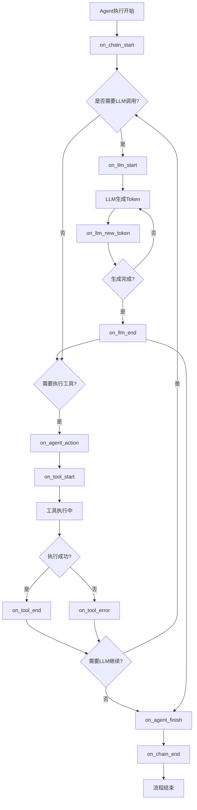

## 类结构

```
AsyncIteratorCallbackHandler (langchain基类)
└── AgentExecutorAsyncIteratorCallbackHandler (自定义实现)
    ├── ApprovalMethod (Enum: CLI/BACKEND)
    └── AgentStatus (状态枚举类)
```

## 全局变量及字段


### `T`
    
输入类型

类型：`TypeVar`
    


### `R`
    
输出类型

类型：`TypeVar`
    


### `ApprovalMethod.CLI`
    
cli审批模式

类型：`ApprovalMethod`
    


### `ApprovalMethod.BACKEND`
    
后端审批模式

类型：`ApprovalMethod`
    


### `AgentStatus.chain_start`
    
链开始

类型：`int`
    


### `AgentStatus.llm_start`
    
LLM开始

类型：`int`
    


### `AgentStatus.llm_new_token`
    
LLM新token

类型：`int`
    


### `AgentStatus.llm_end`
    
LLM结束

类型：`int`
    


### `AgentStatus.agent_action`
    
代理动作

类型：`int`
    


### `AgentStatus.agent_finish`
    
代理完成

类型：`int`
    


### `AgentStatus.tool_require_approval`
    
工具需要审批

类型：`int`
    


### `AgentStatus.tool_start`
    
工具开始

类型：`int`
    


### `AgentStatus.tool_end`
    
工具结束

类型：`int`
    


### `AgentStatus.error`
    
错误

类型：`int`
    


### `AgentStatus.chain_end`
    
链结束

类型：`int`
    


### `AgentExecutorAsyncIteratorCallbackHandler.approval_method`
    
审批方法

类型：`ApprovalMethod | None`
    


### `AgentExecutorAsyncIteratorCallbackHandler.backend`
    
后端实例

类型：`AgentBackend | None`
    


### `AgentExecutorAsyncIteratorCallbackHandler.raise_error`
    
是否抛出错误

类型：`bool`
    


### `AgentExecutorAsyncIteratorCallbackHandler.queue`
    
事件队列

类型：`asyncio.Queue`
    


### `AgentExecutorAsyncIteratorCallbackHandler.done`
    
完成事件

类型：`asyncio.Event`
    


### `AgentExecutorAsyncIteratorCallbackHandler.out`
    
输出标志

类型：`bool`
    


### `AgentExecutorAsyncIteratorCallbackHandler.intermediate_steps`
    
中间步骤

类型：`List[Tuple[AgentAction, BaseToolOutput]]`
    


### `AgentExecutorAsyncIteratorCallbackHandler.outputs`
    
输出结果

类型：`Dict[str, Any]`
    
    

## 全局函数及方法


### `AgentExecutorAsyncIteratorCallbackHandler.__init__`

该方法是 `AgentExecutorAsyncIteratorCallbackHandler` 类的构造函数，负责初始化异步迭代器回调处理器实例。它设置了用于进程间通信的异步队列、事件标志、中间步骤存储字典，以及从关键字参数中获取审批方法和后端代理配置。

参数：

- `self`：隐式参数，`AgentExecutorAsyncIteratorCallbackHandler` 类的实例对象
- `**kwargs`：可变关键字参数，用于接收可选的配置参数，包含 `approval_method`（审批方法，默认为 `ApprovalMethod.CLI`）和 `backend`（后端代理，默认为 `None`）

返回值：`None`，该方法不返回任何值，仅用于对象初始化

#### 流程图

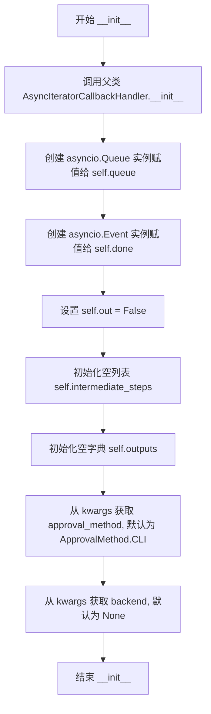

#### 带注释源码

```python
def __init__(
        self,
        **kwargs
):
    """
    初始化 AgentExecutorAsyncIteratorCallbackHandler 实例。
    
    参数:
        **kwargs: 可变关键字参数，支持以下键值对:
            - approval_method: 审批方法，默认为 ApprovalMethod.CLI
            - backend: 后端代理，默认为 None
    """
    # 调用父类 AsyncIteratorCallbackHandler 的初始化方法
    super().__init__()
    
    # 创建异步队列，用于在回调方法中存储待传递的数据
    self.queue = asyncio.Queue()
    
    # 创建异步事件标志，用于表示操作是否完成
    self.done = asyncio.Event()
    
    # 标记是否已输出，用于控制输出状态
    self.out = False
    
    # 存储代理执行过程中的中间步骤（AgentAction 和 BaseToolOutput 的元组列表）
    self.intermediate_steps: List[Tuple[AgentAction, BaseToolOutput]] = []
    
    # 存储代理执行过程中的输出结果字典
    self.outputs: Dict[str, Any] = {}
    
    # 从关键字参数中获取审批方法，默认使用 CLI 审批方式
    self.approval_method = kwargs.get("approval_method", ApprovalMethod.CLI)
    
    # 从关键字参数中获取后端代理，默认为 None
    self.backend = kwargs.get("backend", None)
```


### `AgentExecutorAsyncIteratorCallbackHandler.on_llm_start`

当大型语言模型（LLM）开始生成响应时，该回调方法会被触发，用于通知客户端LLM已启动，并将状态信息放入异步队列中供后续处理。

参数：

- `self`：`AgentExecutorAsyncIteratorCallbackHandler`，回调处理器实例，包含了队列、事件和中间步骤等状态信息
- `serialized`：`Dict[str, Any]`，序列化后的LLM模型信息，包含模型的配置、参数等元数据
- `prompts`：`List[str]`，发送给LLM的提示列表，包含一个或多个字符串提示
- `**kwargs`：`Any`，额外的关键字参数，可能包含run_id等其他上下文信息

返回值：`None`，该方法不返回任何值，主要通过修改实例状态和向队列推送数据来传递信息

#### 流程图

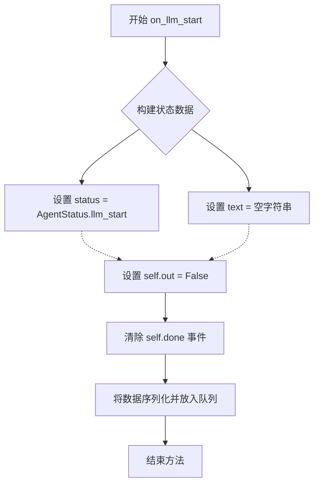

#### 带注释源码

```python
async def on_llm_start(
        self, serialized: Dict[str, Any], prompts: List[str], **kwargs: Any
) -> None:
    """
    当大型语言模型开始生成响应时调用的回调方法。
    
    该方法在LLM开始处理输入并生成输出之前被调用，
    用于通知客户端LLM已启动，并初始化相关的状态信息。
    
    参数:
        serialized: 序列化后的LLM模型信息字典，包含模型配置等元数据
        prompts: 发送给LLM的提示列表，通常包含用户输入和系统提示
        **kwargs: 额外的关键字参数，可能包含run_id、parent_run_id等
    """
    # 构建包含LLM启动状态的数据字典
    # status 标识当前为 llm_start 状态，text 为空表示刚开始
    data = {
        "status": AgentStatus.llm_start,
        "text": "",
    }
    
    # 重置输出标志，表示LLM还未产生任何输出
    self.out = False
    
    # 清除完成事件，允许消费者继续等待新数据
    self.done.clear()
    
    # 将状态数据序列化（pretty=True格式化）并放入异步队列
    # 供消费者（如API端点或WebSocket）获取并推送给客户端
    self.queue.put_nowait(dumps(data, pretty=True))
```


### `AgentExecutorAsyncIteratorCallbackHandler.on_llm_new_token`

该方法是一个异步回调函数，用于处理 LLM 生成的新 token。它会检查 token 是否包含特殊标记（如 Action、Observation 等），并将这些信息通过异步队列实时推送出去，以支持流式输出的前端展示。

参数：

- `self`：`AgentExecutorAsyncIteratorCallbackHandler`，回调处理器的实例本身
- `token`：`str`，LLM 生成的新 token 文本内容
- `**kwargs`：`Dict[str, Any]`，包含额外的关键字参数，其中 `run_id` 用于标识当前运行实例

返回值：`None`，该方法不返回任何值，通过修改内部队列状态来传递数据

#### 流程图

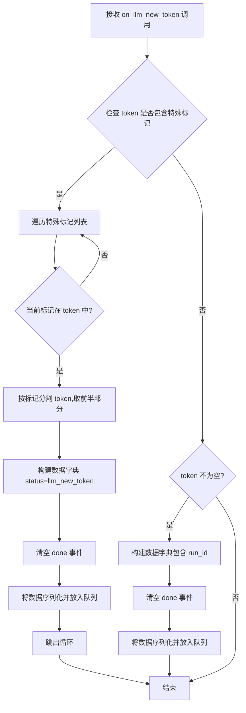

#### 带注释源码

```python
async def on_llm_new_token(self, token: str, **kwargs: Any) -> None:
    """
    LLM 生成新 token 时的回调处理方法
    
    该方法负责:
    1. 检测 token 中的特殊标记(如 Action、Observation 等)
    2. 将 token 数据流式推送到前端
    
    参数:
        token: LLM 新生成的 token 字符串
        **kwargs: 包含 run_id 等运行时信息
    """
    
    # 定义需要检测的特殊标记列表
    # 这些标记用于识别 Agent 决策点
    special_tokens = ["\nAction:", "\nObservation:", "<|observation|>"]
    
    # 遍历特殊标记,检查当前 token 是否包含这些标记
    for stoken in special_tokens:
        if stoken in token:
            # 如果包含特殊标记,则在标记处分割 token
            # 取标记之前的内容作为当前输出
            before_action = token.split(stoken)[0]
            
            # 构建状态数据
            data = {
                "status": AgentStatus.llm_new_token,  # 标记为新 token 状态
                "text": before_action + "\n",  # 添加换行符格式化输出
            }
            
            # 重置 done 事件,表示流式输出仍在进行
            self.done.clear()
            
            # 将数据序列化并放入异步队列,供消费端获取
            self.queue.put_nowait(dumps(data, pretty=True))
            
            # 找到一个特殊标记后即跳出循环
            break

    # 如果 token 不为空且不为 None,则正常推送 token 内容
    if token is not None and token != "":
        data = {
            "run_id": str(kwargs["run_id"]),  # 从 kwargs 中获取运行 ID
            "status": AgentStatus.llm_new_token,
            "text": token,  # 推送完整的 token 文本
        }
        
        # 重置 done 事件
        self.done.clear()
        
        # 将数据序列化并放入异步队列
        self.queue.put_nowait(dumps(data, pretty=True))
```


### `AgentExecutorAsyncIteratorCallbackHandler.on_chat_model_start`

这是异步迭代器回调处理器中的一个核心方法，在聊天模型（Chat Model）开始生成响应时被调用。该方法负责将LLM启动的状态信息封装成数据消息，并通过异步队列实时推送给调用方，使客户端能够感知到聊天模型已开始处理请求，从而实现流式输出和状态追踪。

参数：

- `self`：`AgentExecutorAsyncIteratorCallbackHandler`，回调处理器的实例自身
- `serialized`：`Dict[str, Any]`，序列化后的聊天模型信息，包含模型的配置、参数等元数据
- `messages`：`List[List]`，输入的聊天消息列表，通常为多轮对话的历史消息
- `run_id`：`UUID`，当前运行任务的唯一标识符，用于追踪和关联整个执行链路
- `parent_run_id`：`Optional[UUID]`，父级运行任务的ID，用于支持嵌套执行场景，可为空
- `tags`：`Optional[List[str]`，可选的标签列表，用于对运行任务进行分类和标记
- `metadata`：`Optional[Dict[str, Any]]`，可选的元数据字典，包含额外的上下文信息
- `**kwargs`：`Any`，其他可选的关键字参数，用于扩展兼容性

返回值：`None`，该方法没有返回值，仅通过异步队列进行状态消息的推送

#### 流程图

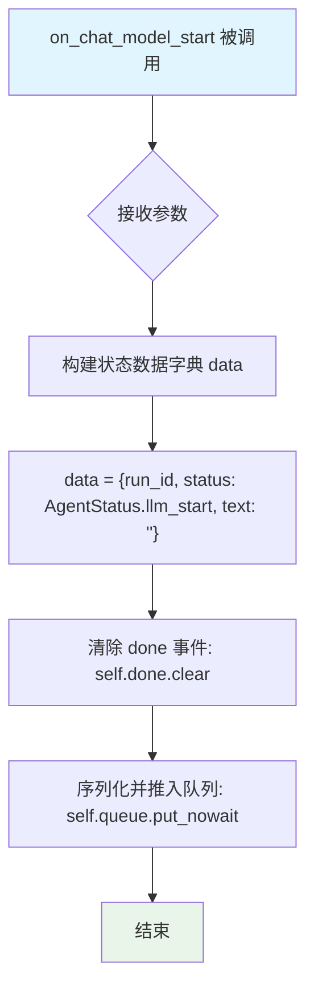

#### 带注释源码

```python
async def on_chat_model_start(
        self,
        serialized: Dict[str, Any],       # 序列化后的聊天模型信息字典
        messages: List[List],             # 输入的消息列表，二维列表结构
        *,
        run_id: UUID,                     # 当前运行的唯一UUID标识
        parent_run_id: Optional[UUID] = None,  # 可选的父运行ID
        tags: Optional[List[str]] = None, # 可选的标签列表
        metadata: Optional[Dict[str, Any]] = None, # 可选的元数据字典
        **kwargs: Any,                    # 额外的关键字参数
) -> None:
    """
    当聊天模型开始生成响应时调用的回调方法。
    该方法将LLM启动状态信息推入异步队列，供调用方实时消费。
    
    Args:
        serialized: 序列化后的模型配置信息
        messages: 输入的消息历史记录
        run_id: 当前执行的唯一标识
        parent_run_id: 父执行的ID（用于嵌套调用）
        tags: 执行相关的标签
        metadata: 执行相关的元数据
        **kwargs: 其他可选参数
    """
    # 构建状态数据字典，包含运行ID、状态和空文本
    # AgentStatus.llm_start 表示聊天模型刚开始处理
    data = {
        "run_id": str(run_id),              # 将UUID转换为字符串便于序列化
        "status": AgentStatus.llm_start,    # 标记为LLM开始状态
        "text": "",                         # 初始文本为空
    }
    
    # 清除完成事件，允许队列继续接收新数据
    # 这确保了在LLM运行期间队列处于活跃状态
    self.done.clear()
    
    # 将状态数据序列化并立即放入异步队列
    # dumps(data, pretty=True) 将字典转换为格式化的JSON字符串
    # put_nowait是非阻塞操作，立即将数据放入队列
    self.queue.put_nowait(dumps(data, pretty=True))
```


### `AgentExecutorAsyncIteratorCallbackHandler.on_llm_end`

当 LLM 完成一次推理时，此回调方法会被触发。它从 LLM 响应中提取生成的内容，并将其与运行状态信息一起序列化后放入异步队列中，以供外部调用者消费。

参数：

- `self`：`AgentExecutorAsyncIteratorCallbackHandler`，回调处理器实例本身
- `response`：`LLMResult`，LLM 的响应对象，包含多个生成结果
- `**kwargs`：`Dict[str, Any]`，可选关键字参数，其中包含 `run_id`（UUID 类型，用于标识当前运行）

返回值：`None`，该方法不返回任何值，仅通过队列传递数据

#### 流程图

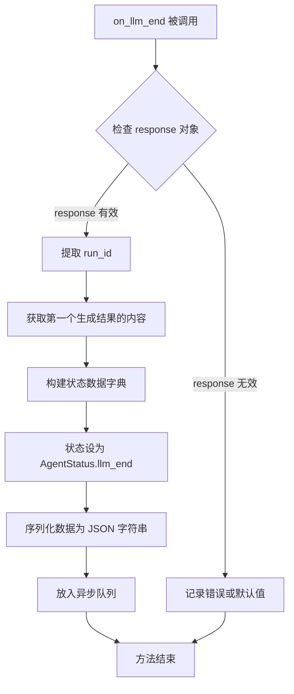

#### 带注释源码

```python
async def on_llm_end(self, response: LLMResult, **kwargs: Any) -> None:
    """
    当 LLM 推理结束时调用的异步回调方法。
    
    该方法从 LLM 响应中提取生成的文本内容，并将其与运行状态一起
    打包成 JSON 格式，通过异步队列传递给消费方。
    
    参数:
        response: LLMResult 对象，包含模型生成的完整响应结果，
                  通常包含多个 generations（候选回复）
        **kwargs: 包含额外参数的字典，必须包含 'run_id' 字段，
                  用于标识当前这次 LLM 调用的唯一标识符
    
    返回:
        None: 不直接返回值，结果通过 self.queue 异步队列传递
    """
    
    # 从 kwargs 中提取当前运行的唯一标识符
    run_id = str(kwargs["run_id"])
    
    # 访问 LLM 响应中的第一个候选生成结果
    # response.generations 是一个二维列表结构，外层代表不同的候选序列
    # 内层代表每个序列中的不同生成片段，这里取第一个候选的第一个片段
    generated_text = response.generations[0][0].message.content
    
    # 构建包含状态和内容的数据字典
    # 使用 AgentStatus.llm_end 标记当前为 LLM 结束状态
    data = {
        "run_id": run_id,                      # 当前运行的 UUID 字符串
        "status": AgentStatus.llm_end,         # 标记 LLM 推理已结束
        "text": generated_text,                # LLM 生成的文本内容
    }
    
    # 使用 langchain_core.load.dumpd 将数据序列化为格式化的 JSON 字符串
    # pretty=True 会使输出的 JSON 字符串具有缩进格式，便于调试和阅读
    serialized_data = dumps(data, pretty=True)
    
    # 将序列化后的数据放入异步队列，供外部调用者实时消费
    # put_nowait 是非阻塞操作，如果队列满会立即抛出异常
    self.queue.put_nowait(serialized_data)
```


### `AgentExecutorAsyncIteratorCallbackHandler.on_llm_error`

当 LLM（大型语言模型）调用过程中发生错误时，此异步回调方法会被触发，用于将错误信息通过异步队列传递给外部调用者，实现错误状态的实时推送和处理。

参数：

- `self`：`AgentExecutorAsyncIteratorCallbackHandler`，隐式参数，指向当前回调处理器实例本身
- `error`：`Exception | KeyboardInterrupt`，LLM 调用过程中抛出的异常对象，可以是普通异常或用户中断信号（Ctrl+C）
- `**kwargs`：`Any`，可选的关键字参数，包含运行时上下文信息（如 `run_id` 等）

返回值：`None`，该方法不返回任何值，主要通过副作用（向队列写入数据）完成功能

#### 流程图

```mermaid
flowchart TD
    A[LLM 调用发生错误] --> B[创建状态数据字典]
    B --> C{error 类型判断}
    C -->|Exception| D[使用 str(error) 获取错误文本]
    C -->|KeyboardInterrupt| D
    D --> E[构造 data 字典<br/>status: AgentStatus.error<br/>text: 错误文本]
    E --> F[调用 queue.put_nowait<br/>将数据写入异步队列]
    F --> G[流程结束]
    
    style A fill:#ffcccc
    style E fill:#ffffcc
    style G fill:#ccffcc
```

#### 带注释源码

```python
async def on_llm_error(
        self, error: Exception | KeyboardInterrupt, **kwargs: Any
) -> None:
    """
    LLM 错误回调处理方法
    
    当 LLM 调用过程中发生异常时，此方法会被框架自动调用。
    该方法将错误信息序列化后放入异步队列，供外部消费者（如 WebSocket）
    实时获取并推送给客户端。
    
    参数:
        error: 发生的异常对象，可以是 Exception 的任意子类或 KeyboardInterrupt
        **kwargs: 额外的关键字参数，可能包含 run_id 等运行时上下文信息
    
    返回:
        None: 此方法不返回值，通过副作用（队列操作）完成功能
    
    注意事项:
        - 该方法不抛出异常，确保错误信息能成功传递
        - 使用 put_nowait 而非 await put，避免阻塞事件循环
        - 错误信息会被转换为字符串存储
    """
    # 构造错误状态数据字典
    # status 字段标识为错误状态，用于前端区分处理
    data = {
        "status": AgentStatus.error,  # 错误状态枚举值
        "text": str(error),           # 将异常对象转换为字符串描述
    }
    # 使用非阻塞方式将数据放入异步队列
    # dumps(pretty=True) 会将字典序列化为格式化的 JSON 字符串
    self.queue.put_nowait(dumps(data, pretty=True))
```


### `AgentExecutorAsyncIteratorCallbackHandler.on_tool_start`

当代理工具开始执行时，此异步回调方法会被调用。它负责构建包含工具启动信息（如工具名称、输入参数、运行状态等）的数据字典，并根据配置的处理方式（CLI审批或后端审批）执行相应的逻辑，最后将数据放入异步队列供外部迭代消费。

参数：

- `self`：`AgentExecutorAsyncIteratorCallbackHandler`，当前回调处理器实例，隐式参数
- `serialized`：`Dict[str, Any]`，工具的序列化表示，通常包含工具的名称（name）、描述等信息
- `input_str`：`str`，工具执行时的输入字符串，包含工具需要处理的具体参数
- `run_id`：`UUID`（keyword-only），当前运行实例的唯一标识符，用于追踪和关联
- `parent_run_id`：`Optional[UUID]`（keyword-only，可选），父级运行的ID，用于构建运行层级关系，默认为None
- `tags`：`Optional[List[str]]`（keyword-only，可选），与当前运行关联的标签列表，默认为None
- `metadata`：`Optional[Dict[str, Any]]`（keyword-only，可选），包含运行相关的元数据字典，默认为None
- `**kwargs`：`Any`，其他未明确声明的关键字参数，用于扩展兼容性

返回值：`None`，该方法不返回任何值，仅通过异步队列传递数据

#### 流程图

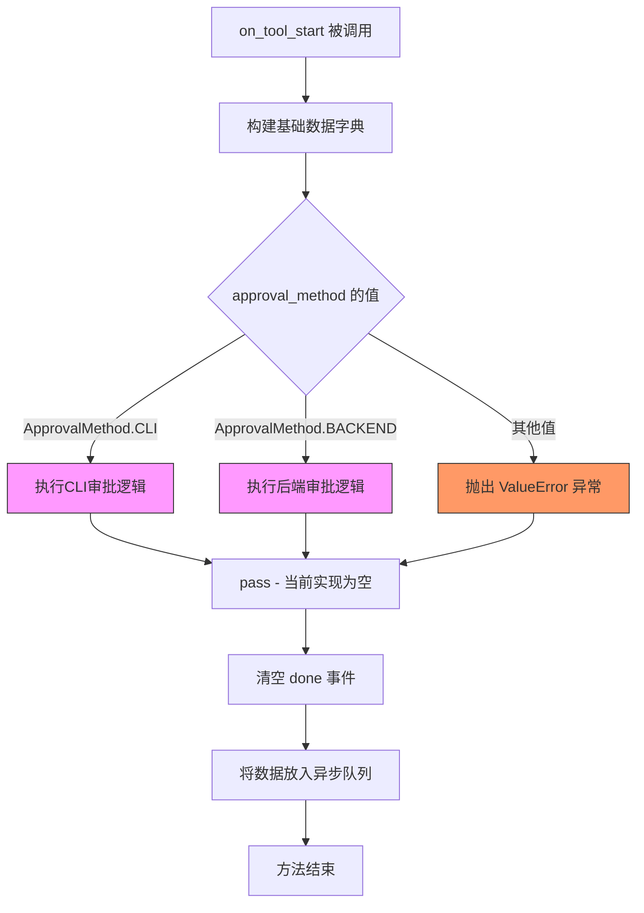

#### 带注释源码

```python
async def on_tool_start(
        self,
        serialized: Dict[str, Any],
        input_str: str,
        *,
        run_id: UUID,
        parent_run_id: Optional[UUID] = None,
        tags: Optional[List[str]] = None,
        metadata: Optional[Dict[str, Any]] = None,
        **kwargs: Any,
) -> None:
    """
    当代理工具开始执行时调用的异步回调方法。
    
    该方法负责：
    1. 构建包含工具启动信息的数据字典
    2. 根据approval_method执行相应的审批逻辑（当前实现为空/已注释）
    3. 将数据放入异步队列供外部消费者迭代使用
    
    参数:
        serialized: 工具的序列化表示，包含工具名称等元信息
        input_str: 工具的输入参数字符串
        run_id: 当前运行的唯一标识UUID
        parent_run_id: 父运行的UUID，用于追踪运行层级
        tags: 关联的标签列表
        metadata: 运行的元数据字典
        **kwargs: 其他扩展参数
    """
    
    # 构建包含工具启动信息的数据字典
    # run_id: 当前运行的唯一标识，用于客户端追踪
    # status: 设置为tool_start状态，表示工具开始执行
    # tool: 从serialized中提取工具名称
    # tool_input: 工具的实际输入参数
    data = {
        "run_id": str(run_id),
        "status": AgentStatus.tool_start,
        "tool": serialized["name"],
        "tool_input": input_str,
    }

    # 根据approval_method分支处理不同的审批逻辑
    if self.approval_method is ApprovalMethod.CLI:
        # CLI审批模式：原计划在此调用CLI交互确认
        # 但当前实现为空（pass），所有逻辑均被注释掉
        # TODO: 未来可能实现CLI交互式确认功能
        
        # 以下为原计划实现但已注释的代码：
        # self.done.clear()
        # self.queue.put_nowait(dumps(data, pretty=True))
        # if not await _adefault_approve(input_str):
        #     raise HumanRejectedException(
        #         f"Inputs {input_str} to tool {serialized} were rejected."
        #     )
        pass
        
    elif self.approval_method is ApprovalMethod.BACKEND:
        # 后端审批模式：原计划调用后端API进行审批
        # 当前实现为空（pass）
        pass
    else:
        # 如果未配置有效的审批方式，抛出错误
        raise ValueError("Approval method not recognized.")

    # 清空done事件，标记新的输出即将产生
    # 此操作确保消费者知道有新的数据可用
    self.done.clear()
    
    # 将包含工具启动信息的数据字典序列化后放入异步队列
    # 使用dumps进行序列化，pretty=True使输出更易读
    # 队列数据可供外部通过async iterator消费
    self.queue.put_nowait(dumps(data, pretty=True))
```


### `AgentExecutorAsyncIteratorCallbackHandler.on_tool_end`

该方法是一个异步回调处理器，用于在工具（Tool）执行结束后被调用，将工具执行结果封装成特定格式的数据结构并放入异步队列中，以供外部消费者（如流式响应处理器）获取工具执行的最终状态和输出。

参数：

- `output`：`Any`，工具执行后的实际输出结果，可以是任意类型
- `run_id`：`UUID`，当前执行链的唯一标识符，用于追踪和关联请求
- `parent_run_id`：`Optional[UUID]`，可选的父级执行链标识符，用于处理嵌套调用场景
- `tags`：`Optional[List[str]]`，可选的标签列表，用于对执行过程进行分类和过滤
- `**kwargs`：`Any`，额外关键字参数，其中包含工具名称（name）等信息

返回值：`None`，该方法不返回任何值，结果通过异步队列传递

#### 流程图

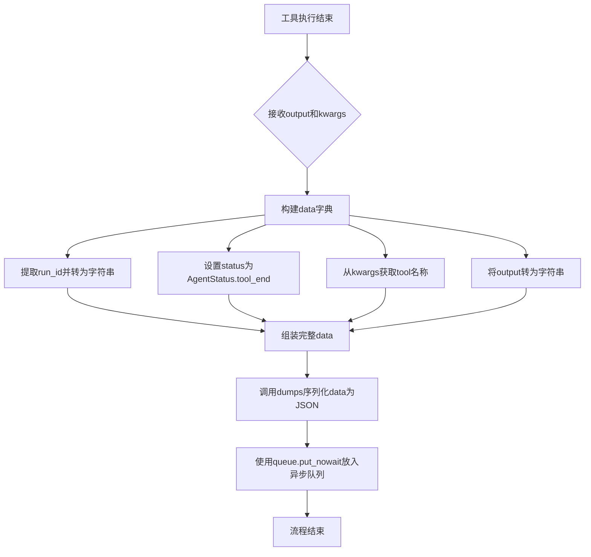

#### 带注释源码

```python
async def on_tool_end(
        self,
        output: Any,
        *,
        run_id: UUID,
        parent_run_id: Optional[UUID] = None,
        tags: Optional[List[str]] = None,
        **kwargs: Any,
) -> None:
    """Run when tool ends running."""
    # 构建包含工具执行结果的数据字典
    # run_id: 当前执行链的唯一标识，转换为字符串便于序列化
    # status: 标记当前状态为tool_end，表示工具执行完成
    # tool: 从kwargs中提取工具名称
    # tool_output: 将工具输出转换为字符串格式，确保JSON序列化兼容性
    data = {
        "run_id": str(run_id),
        "status": AgentStatus.tool_end,
        "tool": kwargs["name"],
        "tool_output": str(output),
    }
    # 将数据序列化后放入异步队列，供消费者获取
    # put_nowait是非阻塞操作，不会等待消费者消费
    self.queue.put_nowait(dumps(data, pretty=True))
```


### `AgentExecutorAsyncIteratorCallbackHandler.on_tool_error`

当 Agent 执行过程中的工具发生错误时，此回调方法会被触发，用于将错误信息序列化并放入异步队列中，以流式方式传递给调用方。

参数：

- `self`：`AgentExecutorAsyncIteratorCallbackHandler` 实例本身，当前回调处理器对象
- `error`：`BaseException`，工具执行过程中抛出的异常对象，包含错误详情
- `run_id`：`UUID`，当前工具运行的唯一标识符，用于追踪和关联
- `parent_run_id`：`Optional[UUID]`，父级运行的 UUID（可选），用于构建运行层级关系
- `tags`：`Optional[List[str]]`，与当前运行关联的标签列表（可选），用于分类和过滤
- `**kwargs`：`Any`，其他可选的关键字参数，包含运行时上下文信息

返回值：`None`，该方法不返回任何值，仅通过异步队列传递错误数据

#### 流程图

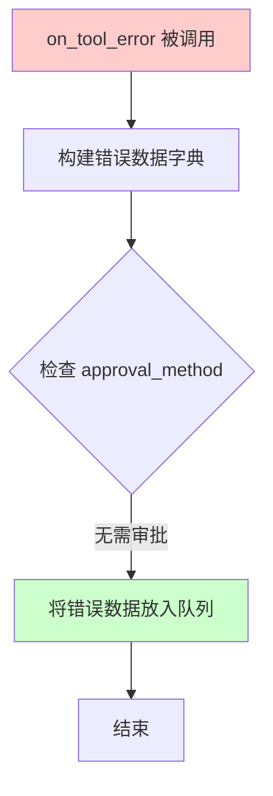

#### 带注释源码

```python
async def on_tool_error(
        self,
        error: BaseException,
        *,
        run_id: UUID,
        parent_run_id: Optional[UUID] = None,
        tags: Optional[List[str]] = None,
        **kwargs: Any,
    ) -> None:
    """Run when tool errors."""
    # 构建包含错误信息的字典
    # run_id: 当前工具运行的唯一标识
    # status: 设置为 error 状态，表示发生了错误
    # tool_output: 将异常对象转换为字符串形式存储
    # is_error: 标记为错误状态，供下游处理逻辑判断
    data = {
        "run_id": str(run_id),
        "status": AgentStatus.error,
        "tool_output": str(error),
        "is_error": True,
    }

    # 使用 dumps 将数据序列化为 JSON 字符串
    # pretty=True 使输出的 JSON 更易读
    # put_nowait 是非阻塞式写入队列操作
    self.queue.put_nowait(dumps(data, pretty=True))
```


### `AgentExecutorAsyncIteratorCallbackHandler.on_agent_action`

该方法是一个异步回调函数，用于在代理执行过程中捕获代理动作（AgentAction）事件。当代理执行工具调用时，此方法会被触发，将代理的动作信息（包括工具名称、工具输入和日志）序列化为JSON格式并放入异步队列中，以实现流式输出代理执行状态。

参数：

- `action`：`AgentAction`，代理执行的动作对象，包含工具名称、工具输入和日志信息
- `run_id`：`UUID`，当前执行的唯一标识符
- `parent_run_id`：`Optional[UUID]`，可选的父级执行ID，用于追踪执行链路
- `tags`：`Optional[List[str]]`，可选的标签列表，用于标识和分类执行
- `**kwargs`：`Any`，额外的关键字参数，用于接收LangChain回调系统的其他参数

返回值：`None`，该方法不返回值，仅通过队列进行状态传递

#### 流程图

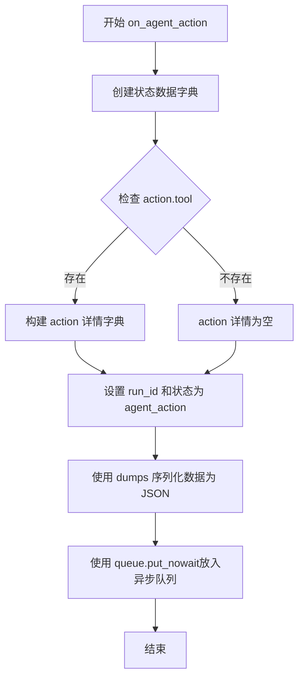

#### 带注释源码

```python
async def on_agent_action(
        self,
        action: AgentAction,
        *,
        run_id: UUID,
        parent_run_id: Optional[UUID] = None,
        tags: Optional[List[str]] = None,
        **kwargs: Any,
) -> None:
    """
    异步回调函数，当代理执行工具动作时触发
    
    参数:
        action: AgentAction对象，包含代理执行的具体动作信息
            - action.tool: str，被调用的工具名称
            - action.tool_input: Union[str, Dict]，工具的输入参数
            - action.log: str，代理的思考日志
        run_id: UUID，当前执行链的唯一标识符
        parent_run_id: Optional[UUID]，父执行的ID（可选）
        tags: Optional[List[str]]，执行相关的标签列表（可选）
        **kwargs: Any，其他可选的回调参数
    
    返回:
        None，不返回任何值，结果通过self.queue异步队列传递
    """
    # 构建包含代理动作信息的状态数据字典
    # 状态码 AgentStatus.agent_action = 4，表示代理正在执行动作
    data = {
        "run_id": str(run_id),  # 将UUID转换为字符串便于序列化
        "status": AgentStatus.agent_action,  # 设置当前状态为代理动作
        "action": {
            "tool": action.tool,  # 提取工具名称
            "tool_input": action.tool_input,  # 提取工具输入参数
            "log": action.log,  # 提取代理的思考日志
        },
    }
    # 使用langchain的dumps函数序列化数据为JSON格式
    # pretty=True参数使输出的JSON格式更易于阅读
    # 将序列化后的数据放入异步队列，供消费者获取
    self.queue.put_nowait(dumps(data, pretty=True))
```


### `AgentExecutorAsyncIteratorCallbackHandler.on_agent_finish`

该方法是异步回调处理器，当代理（Agent）完成执行时被调用。其核心功能是处理 Agent 的最终输出结果，包括清理输出中的 "Thought:" 标记、确保输出为字符串类型，并将包含运行ID、状态和返回值的完成数据序列化后放入异步队列，以供外部消费者获取。

参数：

- `self`：`AgentExecutorAsyncIteratorCallbackHandler`，类的实例方法隐式参数
- `finish`：`AgentFinish`，包含代理执行完成后的返回值的对象，封装了 `return_values`（字典，包含 output 等）和 `log` 属性
- `run_id`：`UUID`，用于标识当前运行实例的唯一标识符
- `parent_run_id`：`Optional[UUID]`，可选参数，表示父运行的标识符（如果存在）
- `tags`：`Optional[List[str]]`，可选参数，用于标记或分类此次运行的标签列表
- `**kwargs`：`Any`，接收额外的关键字参数，以应对接口变化或传递未显式声明的参数

返回值：`None`，该方法不返回任何值，主要通过修改内部队列 `self.queue` 来传递结果

#### 流程图

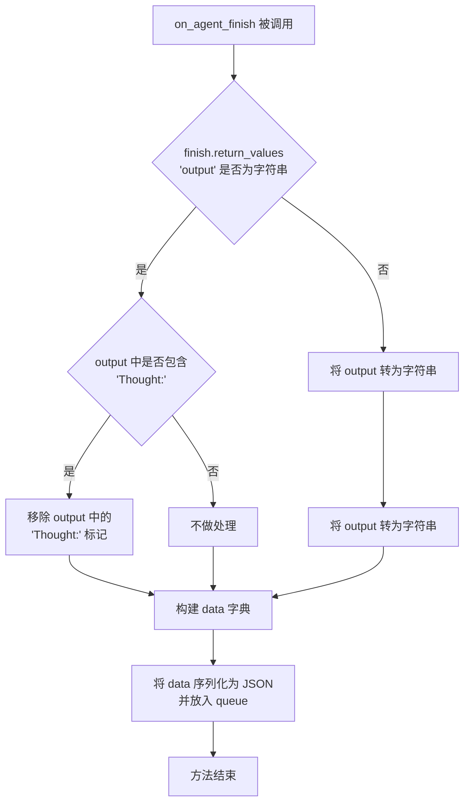

#### 带注释源码

```python
async def on_agent_finish(
        self,
        finish: AgentFinish,
        *,
        run_id: UUID,
        parent_run_id: Optional[UUID] = None,
        tags: Optional[List[str]] = None,
        **kwargs: Any,
) -> None:
    """
    当代理完成执行时调用的回调方法。
    
    参数:
        finish: AgentFinish 对象，包含 return_values（字典）和 log 属性
        run_id: 当前运行的唯一标识符
        parent_run_id: 父运行的标识符（可选）
        tags: 运行标签列表（可选）
        **kwargs: 其他关键字参数
    
    返回:
        None
    """
    
    # 检查输出是否为字符串类型
    if isinstance(finish.return_values["output"], str):
        # 检查输出中是否包含 "Thought:" 标记（来自某些 Agent 框架的输出格式）
        if "Thought:" in finish.return_values["output"]:
            # 移除 "Thought:" 标记以清理输出格式
            finish.return_values["output"] = finish.return_values["output"].replace(
                "Thought:", ""
            )

    # 确保输出始终被转换为字符串类型，便于后续处理和展示
    finish.return_values["output"] = str(finish.return_values["output"])

    # 构建包含运行状态和结果的数据字典
    data = {
        "run_id": str(run_id),                    # 将 UUID 转换为字符串便于序列化
        "status": AgentStatus.agent_finish,       # 标记当前状态为 agent_finish
        "finish": {
            "return_values": finish.return_values, # 包含处理后的 output 和其他返回值
            "log": finish.log,                      # 代理执行过程中的日志信息
        },
    }

    # 将数据序列化为 JSON 格式并放入异步队列，供外部消费者（如 WebSocket 或流式 API）获取
    self.queue.put_nowait(dumps(data, pretty=True))
```


### `AgentExecutorAsyncIteratorCallbackHandler.on_chain_start`

当 Agent 链开始执行时，此回调方法会被触发。它负责处理链的输入数据，包括清理临时的 `agent_scratchpad` 字段、转换 `chat_history` 消息为指定格式，并将其序列化为 JSON 数据放入异步队列中，以供外部调用者实时获取链的执行状态。

参数：

- `self`：隐式参数，`AgentExecutorAsyncIteratorCallbackHandler` 实例，当前回调处理器对象
- `serialized`：`Dict[str, Any]`，序列化的链对象字典，包含链的类型和配置信息
- `inputs`：`Dict[str, Any]`，链的输入参数字典，包含运行链所需的输入数据
- `run_id`：`UUID`，链运行的唯一标识符，用于跟踪和关联本次执行
- `parent_run_id`：`Optional[UUID]`，父级运行的 UUID（可选），用于关联子链与父链的执行关系
- `tags`：`Optional[List[str]]`，标签列表（可选），用于对运行进行分类和标记
- `metadata`：`Optional[Dict[str, Any]]`，元数据字典（可选），包含关于运行的额外信息
- `**kwargs`：`Any`，其他关键字参数，用于接收未来可能添加的额外参数

返回值：`None`，该方法不返回任何值，主要通过修改队列状态来传递执行信息

#### 流程图

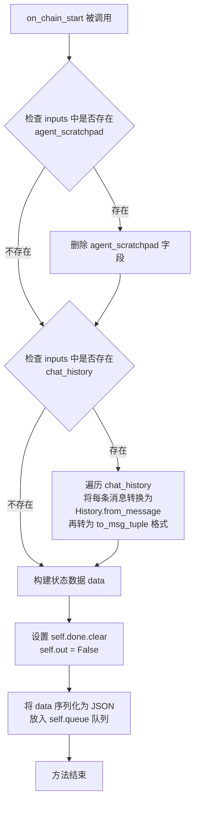

#### 带注释源码

```python
async def on_chain_start(
        self,
        serialized: Dict[str, Any],
        inputs: Dict[str, Any],
        *,
        run_id: UUID,
        parent_run_id: Optional[UUID] = None,
        tags: Optional[List[str]] = None,
        metadata: Optional[Dict[str, Any]] = None,
        **kwargs: Any,
) -> None:
    """Run when chain starts running."""
    # 如果 inputs 中存在 agent_scratchpad 临时草稿板字段，则删除它
    # 因为这是运行时临时生成的，不应作为输入传递给后续处理
    if "agent_scratchpad" in inputs:
        del inputs["agent_scratchpad"]
    
    # 如果存在 chat_history，则将其转换为消息元组格式
    # History.from_message: 将消息对象转换为 History 对象
    # to_msg_tuple: 转换为 (role, content) 元组格式，便于序列化和传输
    if "chat_history" in inputs:
        inputs["chat_history"] = [
            History.from_message(message).to_msg_tuple()
            for message in inputs["chat_history"]
        ]
    
    # 构建链启动的状态数据，包含运行 ID、状态码、输入参数等信息
    data = {
        "run_id": str(run_id),
        "status": AgentStatus.chain_start,  # 标记为链开始状态
        "inputs": inputs,                    # 处理后的输入参数
        "parent_run_id": parent_run_id,     # 父运行 ID（可能为 None）
        "tags": tags,                        # 标签列表
        "metadata": metadata,                # 元数据
    }

    # 重置完成事件，允许队列接收新的数据
    self.done.clear()
    # 重置输出标志，表示链尚未完成
    self.out = False
    # 将状态数据序列化为 JSON 格式并放入异步队列
    # dumps(..., pretty=True) 使输出的 JSON 格式化，便于调试和阅读
    self.queue.put_nowait(dumps(data, pretty=True))
```


### `AgentExecutorAsyncIteratorCallbackHandler.on_chain_error`

当 Agent 链执行过程中发生错误时，此回调方法会被调用，用于捕获错误信息并将错误状态序列化后放入异步队列中，以便前端或调用方能够获取错误详情。

参数：

- `self`：隐式参数，AgentExecutorAsyncIteratorCallbackHandler 的实例
- `error`：`BaseException`，链执行过程中抛出的异常对象
- `run_id`：`UUID`，当前链运行的唯一标识符（关键字参数）
- `parent_run_id`：`Optional[UUID]`，父级运行的 UUID，如果存在则传递（关键字参数，可选）
- `tags`：`Optional[List[str]]`，与该链运行关联的标签列表（关键字参数，可选）
- `**kwargs`：`Any`，其他可选的关键字参数

返回值：`None`，该方法不返回值，仅执行副作用（将错误信息放入队列）

#### 流程图

```mermaid
flowchart TD
    A[开始 on_chain_error] --> B{接收 error 参数}
    B --> C[创建 data 字典]
    C --> D[设置 run_id: str(run_id)]
    C --> E[设置 status: AgentStatus.error]
    C --> F[设置 error: str(error)]
    D --> G[调用 queue.put_nowait 将序列化数据放入队列]
    G --> H[结束]
```

#### 带注释源码

```python
async def on_chain_error(
        self,
        error: BaseException,
        *,
        run_id: UUID,
        parent_run_id: Optional[UUID] = None,
        tags: Optional[List[str]] = None,
        **kwargs: Any,
) -> None:
    """Run when chain errors."""
    # 创建一个包含错误信息的字典
    # run_id: 当前链运行的唯一标识，转换为字符串便于序列化
    # status: 设置为 error 状态，表示发生了错误
    # error: 将异常对象转换为字符串形式，便于传输和展示
    data = {
        "run_id": str(run_id),
        "status": AgentStatus.error,
        "error": str(error),
    }
    # 使用 dumps 将数据序列化为 JSON 字符串格式（pretty=True 表示格式化输出）
    # put_nowait 是非阻塞操作，将数据放入异步队列供消费者读取
    self.queue.put_nowait(dumps(data, pretty=True))
```


### `AgentExecutorAsyncIteratorCallbackHandler.on_chain_end`

当Agent执行链结束时调用此方法，用于处理和传递链的最终输出结果，同时提取并保存中间步骤信息。

参数：

- `self`：`AgentExecutorAsyncIteratorCallbackHandler`，回调处理程序的实例自身
- `outputs`：`Dict[str, Any]`，链执行后产生的输出字典，包含最终结果和可能的中间步骤
- `run_id`：`UUID`，链运行的唯一标识符，用于追踪和关联此次执行
- `parent_run_id`：`UUID | None`，可选的父链运行ID，用于构建执行链的层级关系
- `tags`：`List[str] | None`，可选的标签列表，用于标识和分类此次执行
- `**kwargs`：`Any`，其他可选的关键词参数，由调用方传入

返回值：`None`，该方法不返回任何值，通过队列传递数据

#### 流程图

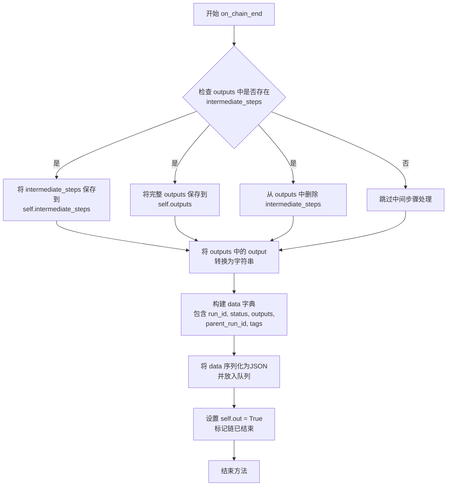

#### 带注释源码

```python
async def on_chain_end(
        self,
        outputs: Dict[str, Any],
        *,
        run_id: UUID,
        parent_run_id: UUID | None = None,
        tags: List[str] | None = None,
        **kwargs: Any,
) -> None:
    """
    当Agent执行链结束时调用的回调方法。
    该方法处理链的最终输出，提取中间步骤，并将结果放入异步队列供外部消费。
    
    注意: 这是LangChain异步回调协议的一部分，用于流式传输Agent执行状态。
    """
    
    # TODO: agent params of PlatformToolsAgentExecutor or AgentExecutor 
    # enable return_intermediate_steps=True,
    # 检查输出中是否包含中间步骤信息
    if "intermediate_steps" in outputs:
        # 将中间步骤保存到实例变量，供后续访问
        self.intermediate_steps = outputs["intermediate_steps"]
        # 同时保存完整输出字典到实例变量
        self.outputs = outputs
        # 从输出中删除中间步骤，避免重复或冗余数据发送给前端
        del outputs["intermediate_steps"]

    # 确保输出值是字符串类型，统一输出格式
    outputs["output"] = str(outputs["output"])

    # 构建包含执行结果的数据字典
    data = {
        "run_id": str(run_id),                          # 链的唯一标识
        "status": AgentStatus.chain_end,                # 标记为链结束状态
        "outputs": outputs,                             # 处理后的输出
        "parent_run_id": parent_run_id,                 # 父运行ID（可选）
        "tags": tags,                                   # 执行标签（可选）
    }
    
    # 将数据序列化为JSON格式并放入异步队列
    # 使用dumps而非dumpd以确保JSON字符串格式
    self.queue.put_nowait(dumps(data, pretty=True))
    
    # 设置标志位，表示Agent链执行已完成
    self.out = True
    
    # 注意: 这里注释掉了 self.done.set()
    # 可能是因为需要等待更多数据或由其他机制触发完成事件
    # self.done.set()
```

## 关键组件


### AgentExecutorAsyncIteratorCallbackHandler

核心回调处理器类，继承自LangChain的AsyncIteratorCallbackHandler，用于在Agent执行过程中捕获并流式输出各类事件（LLM生成、工具调用、代理状态等），支持CLI和Backend两种审批方式。

### ApprovalMethod 枚举

定义了工具调用的审批方式枚举，包括CLI（命令行交互审批）和BACKEND（后端API审批）两种模式，用于控制Agent执行敏感操作前的用户确认流程。

### AgentStatus 枚举

定义Agent执行过程中的状态码集合，涵盖chain_start、llm_start、llm_new_token、llm_end、agent_action、agent_finish、tool_require_approval、tool_start、tool_end、error、chain_end等状态，用于前端或客户端区分和处理不同阶段的事件。

### on_chain_start / on_chain_end

链式调用的开始和结束回调，会清理agent_scratchpad和转换chat_history格式为消息元组形式，并将中间步骤(intermediate_steps)从输出中提取保存到实例变量，供后续获取。

### on_llm_new_token

LLM生成新token时的回调，实现特殊token分割逻辑（\nAction:、\nObservation:、<|observation|>），将token流式推送到异步队列供消费端实时获取。

### on_tool_start / on_tool_end

工具执行的生命周期回调，记录工具名称、输入参数和输出结果，通过队列进行事件流传递，支持审批机制（当前CLI审批逻辑被注释）。

### on_agent_action / on_agent_finish

代理动作和完成时的回调，处理AgentAction和AgentFinish对象，将动作的tool、tool_input、log等信息序列化后推送，并清理输出中的"Thought:"前缀。

### 异步队列事件流机制

通过asyncio.Queue实现事件流式输出，done Event控制流程，out标志位标记链结束，配合AsyncIteratorCallbackHandler实现生成器风格的消费模式。

### History 工具类

from langchain_chatchat.utils 导入的工具类，用于将LangChain消息对象转换为元组格式(to_msg_tuple)，在on_chain_start中处理chat_history。


## 问题及建议


### 已知问题

-   **不完整的审批逻辑实现**：`on_tool_start` 方法中的 CLI 和 BACKEND 审批方式分支均只有 `pass` 语句，实际的用户审批逻辑被注释掉或未实现，导致 `approval_method` 参数形同虚设。
-   **类型注解不一致**：`on_chain_end` 方法中 `parent_run_id` 参数类型为 `UUID | None`，而 `on_chain_start` 中为 `Optional[UUID]`，另外 `on_llm_new_token` 中直接使用 `kwargs["run_id"]` 而未做类型声明和空值检查。
-   **事件未正确设置**：`self.done` 事件在多处被 `clear()` 但从未调用 `set()`，仅在 `self.out = True` 时标记完成，可能导致调用方无限等待。
-   **硬编码的特殊 token**：`on_llm_new_token` 中的特殊 tokens (`\nAction:`、`\nObservation:`、`<|observation|>`) 被硬编码，缺乏配置灵活性。
-   **未使用的导入**：`AsyncCallbackHandler` 被导入但未使用；`TypeVar` 定义的 `T` 和 `R` 也未在类中使用。
-   **魔法数字**：`AgentStatus` 类使用整数值作为状态码（如 `chain_end: int = -999`），虽然定义为类属性但缺乏类型安全。
-   **序列化方式不统一**：代码同时使用 `dumps(data, pretty=True)` 进行 JSON 序列化，但某些地方直接传递字符串（如 `str(outputs["output"])`），可能导致消费方解析困难。
-   **TODO 未完成**：`on_chain_end` 方法中有 TODO 注释提及 `enable return_intermediate_steps=True` 功能，但该功能未实现。

### 优化建议

-   实现完整的审批流程逻辑，为 `ApprovalMethod.CLI` 和 `ApprovalMethod.BACKEND` 分别接入实际的审批接口或交互函数。
-   统一类型注解风格，使用 `Optional[UUID]` 替代 `UUID | None`，并对所有来自 `kwargs` 的参数进行空值校验。
-   在链或任务完成时调用 `self.done.set()`，确保异步消费者能够正确感知任务结束状态。
-   将特殊 token 列表提取为类属性或配置参数，支持运行时自定义。
-   清理未使用的导入（`AsyncCallbackHandler`、`T`、`R`），或将这些类型变量用于泛型方法签名。
-   考虑使用 `Enum` 的显式值或 `IntEnum` 替代魔法数字，增强类型检查和可读性。
-   统一数据序列化策略，建议始终使用 JSON 字符串并明确 `Content-Type`，或在文档中说明不同状态下的数据格式。
-   完成 TODO 中提到的 `return_intermediate_steps` 功能，或移除该 TODO 注释以避免误导。

## 其它


### 设计目标与约束

本模块的设计目标是提供一个异步迭代器回调处理器，用于在Agent执行过程中实时捕获和传递各种事件状态（如LLM生成、工具调用、链式执行等），支持CLI和BACKEND两种审批方式，并通过队列机制实现事件的异步传递。约束包括：必须继承AsyncIteratorCallbackHandler、仅支持Python异步环境、依赖langchain生态链。

### 错误处理与异常设计

代码中的错误处理主要通过以下机制实现：
1. `on_llm_error`方法：捕获LLM调用错误，生成包含错误信息的AgentStatus.error状态数据并放入队列
2. `on_tool_error`方法：捕获工具执行错误，生成包含错误详情的AgentStatus.error状态数据
3. `on_chain_error`方法：捕获链式执行错误，生成包含错误信息的AgentStatus.error状态数据
4. HumanRejectedException：当用户拒绝工具执行时抛出，由外部调用方处理
5. ValueError：当审批方法不识别时抛出
异常设计采用状态码驱动机制，通过AgentStatus枚举定义错误状态（error: int = -1），确保错误信息能够通过统一的队列机制传递到消费端。

### 数据流与状态机

数据流遵循以下路径：
1. 外部Agent/Chain调用触发各类回调方法
2. 回调方法将事件数据序列化（通过dumps）后放入asyncio.Queue队列
3. 消费端通过迭代Queue获取事件数据
状态转换流程：
- chain_start → llm_start → llm_new_token → llm_end → agent_action → tool_start → tool_end → ... → agent_finish → chain_end
- 任何阶段出错则进入error状态
- 中间可插入tool_require_approval状态（当前代码中预留但未完全实现）

### 外部依赖与接口契约

主要外部依赖：
1. langchain_core.load：dumpd/dumps/load/loads用于序列化/反序列化事件数据
2. langchain.callbacks：AsyncIteratorCallbackHandler基类
3. langchain.schema：AgentAction、AgentFinish事件类型
4. langchain_community.callbacks.human：HumanRejectedException
5. langchain_core.outputs：LLMResult类型
6. langchain_chatchat.callbacks.core.protocol：AgentBackend接口
7. langchain_chatchat.utils：History工具类
接口契约：所有回调方法接收langchain标准参数（serialized、inputs/outputs、run_id、parent_run_id、tags、metadata等），返回None或通过队列传递数据。

### 安全性考虑

1. 敏感信息处理：代码未对LLM输出、工具输入输出进行脱敏处理，建议在生产环境中对敏感数据（如API密钥、用户隐私信息）进行过滤
2. 错误信息暴露：on_llm_error等方法直接使用str(error)，可能暴露内部实现细节，建议分级处理错误信息
3. 队列积压风险：未实现队列大小限制，高并发场景下可能导致内存溢出，建议添加队列上限控制

### 性能考量

1. 异步非阻塞：所有方法均为async实现，通过asyncio.Queue实现非阻塞事件传递
2. 序列化开销：每次事件都调用dumps进行JSON序列化，高频场景下有性能损耗，建议考虑批量序列化或使用更高效的序列化方案（如msgpack）
3. 内存占用：intermediate_steps和outputs会保存完整的中间结果，大规模对话可能导致内存占用较高，建议实现结果裁剪或流式写入

### 配置与扩展性

1. 审批方法配置：通过approval_method参数支持CLI和BACKEND两种模式，扩展新的审批方式只需新增ApprovalMethod枚举值并实现对应逻辑
2. 后端接口：backend参数接受AgentBackend接口实现，支持自定义后端通信机制
3. 状态码扩展：AgentStatus枚举可扩展新的状态（如增加webhook通知、监控指标等）
4. 回调方法覆盖：继承该类可覆盖任意回调方法以实现自定义行为

### 测试策略建议

1. 单元测试：针对每个回调方法进行独立测试，验证状态码和数据结构的正确性
2. 集成测试：模拟完整的Agent执行流程，验证状态转换的正确序列
3. 异步测试：使用asyncio.testing工具测试队列操作和并发场景
4. 错误场景测试：模拟各类异常情况，验证错误处理逻辑

### 部署注意事项

1. Python版本：需要Python 3.10+以支持类型注解的联合类型语法（|）
2. 依赖管理：需确保langchain及其相关依赖版本兼容
3. 异步环境：必须在asyncio事件循环中运行，不支持同步调用
4. 队列消费者：必须有对应的消费端持续从queue中读取数据，否则队列会阻塞


    