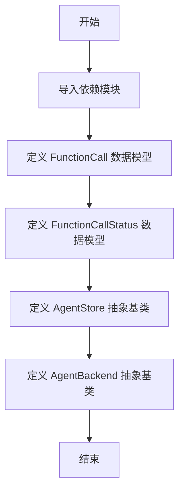
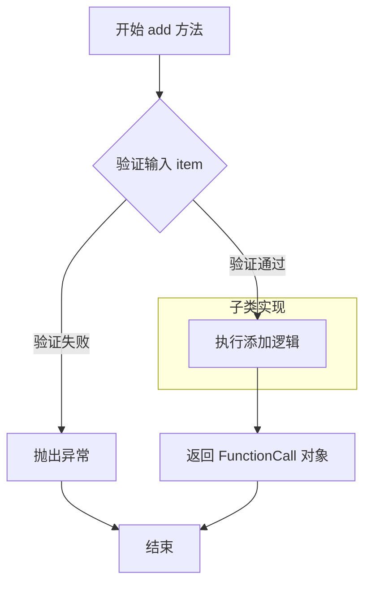
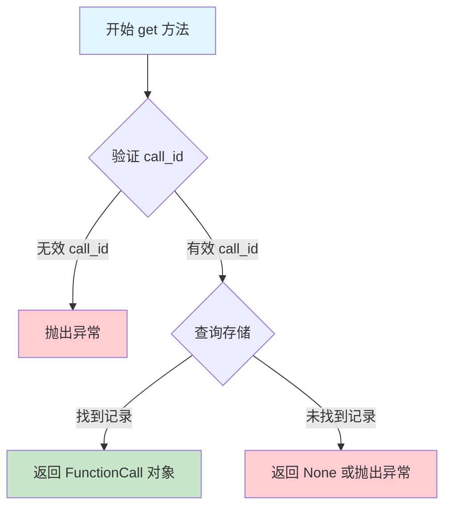
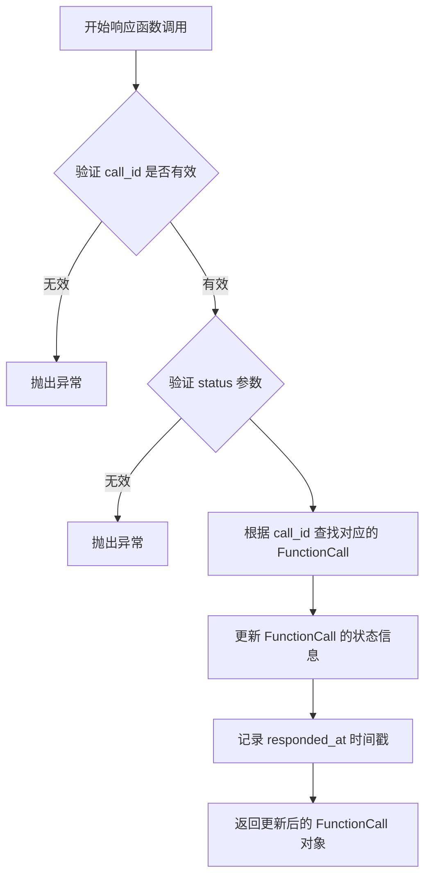
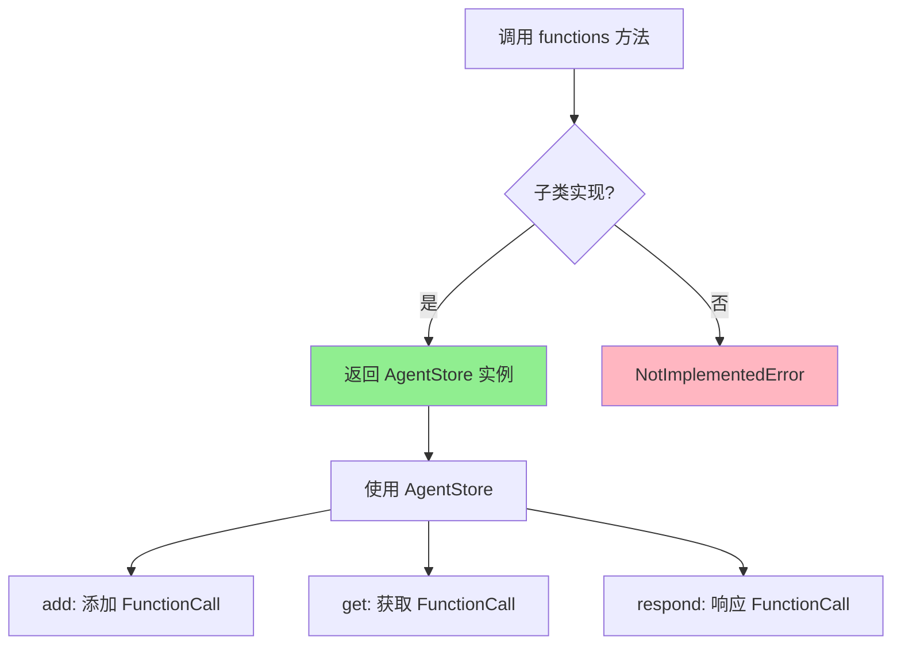

# `Langchain-Chatchat\libs\chatchat-server\langchain_chatchat\callbacks\core\protocol.py` 详细设计文档

该代码定义了一个代理系统的核心数据模型和抽象基类，用于管理函数调用的状态和后端代理功能，包括FunctionCall、FunctionCallStatus两个数据模型，以及AgentStore和AgentBackend两个抽象基类。

## 整体流程



## 类结构

```
BaseModel (pydantic)
├── FunctionCall
└── FunctionCallStatus
AgentStore (抽象基类)
AgentBackend (抽象基类)
```

## 全局变量及字段


### `FunctionCall`
    
表示函数调用的数据模型，包含运行ID和调用ID

类型：`class (BaseModel)`
    


### `FunctionCallStatus`
    
表示函数调用的状态信息，包含时间、审批状态和相关消息ID

类型：`class (BaseModel)`
    


### `AgentStore`
    
抽象类，定义函数调用存储和状态管理的基本接口

类型：`class (ABC)`
    


### `AgentBackend`
    
抽象类，定义获取AgentStore后端的接口

类型：`class (ABC)`
    


### `FunctionCall.run_id`
    
运行ID

类型：`str`
    


### `FunctionCall.call_id`
    
调用ID

类型：`str`
    


### `FunctionCallStatus.requested_at`
    
请求时间

类型：`datetime | None`
    


### `FunctionCallStatus.responded_at`
    
响应时间

类型：`datetime | None`
    


### `FunctionCallStatus.approved`
    
是否批准

类型：`bool | None`
    


### `FunctionCallStatus.comment`
    
备注信息

类型：`str | None`
    


### `FunctionCallStatus.reject_option_name`
    
拒绝选项名称

类型：`str | None`
    


### `FunctionCallStatus.slack_message_ts`
    
Slack消息时间戳

类型：`str | None`
    
    

## 全局函数及方法


### `AgentStore.add`

将指定的函数调用对象添加到存储中，并返回添加后的函数调用对象。该方法是一个抽象方法，需要子类实现具体的添加逻辑。

参数：

- `item`：`FunctionCall`，需要添加的函数调用对象，包含 `run_id` 和 `call_id` 属性

返回值：`FunctionCall`，返回添加成功的函数调用对象

#### 流程图



#### 带注释源码

```python
def add(self, item: FunctionCall) -> FunctionCall:
    """
    添加函数调用到存储中
    
    参数:
        item: FunctionCall - 需要添加的函数调用对象，包含 run_id 和 call_id
        
    返回:
        FunctionCall - 返回添加成功的函数调用对象
        
    异常:
        NotImplementedError: 当在基类中调用时抛出，子类需要实现此方法
    """
    raise NotImplementedError()
```

---

**备注**：该方法是抽象方法，在 `AgentStore` 基类中仅定义接口签名，实际的添加逻辑需要由子类实现。`FunctionCall` 是一个 Pydantic 模型，包含 `run_id` 和 `call_id` 两个字符串字段，用于标识函数调用的运行 ID 和调用 ID。


### `AgentStore.get`

获取指定 call_id 对应的函数调用记录，用于在 Agent 系统中查询特定函数调用的详细信息。

参数：

- `call_id`：`str`，要查询的函数调用唯一标识符

返回值：`FunctionCall`，返回与给定 call_id 关联的函数调用对象，包含 run_id 和 call_id 等基本信息

#### 流程图



#### 带注释源码

```python
def get(self, call_id: str) -> FunctionCall:
    """
    获取指定 call_id 对应的函数调用记录。
    
    Args:
        call_id: str，函数调用的唯一标识符，用于在 AgentStore 中查找对应的调用记录
    
    Returns:
        FunctionCall: 返回匹配 call_id 的 FunctionCall 对象，包含该次函数调用的基本信息
    
    Raises:
        NotImplementedError: 当前为抽象方法，具体实现由子类提供
        KeyError: 当找不到对应的 call_id 时（具体实现可能抛出）
    """
    raise NotImplementedError()
```


### `AgentStore.respond`

该方法用于响应特定的函数调用请求，根据传入的状态信息更新对应函数调用的状态，并返回更新后的函数调用对象。

参数：

- `call_id`：`str`，函数调用的唯一标识符，用于定位需要响应的函数调用
- `status`：`FunctionCallStatus`，包含响应状态的对象，如审批结果、审批时间、评论等信息

返回值：`FunctionCall`，更新状态后的函数调用对象

#### 流程图



#### 带注释源码

```python
def respond(self, call_id: str, status: FunctionCallStatus) -> FunctionCall:
    """
    响应函数调用
    
    根据传入的 call_id 查找对应的函数调用记录，
    并使用 status 中的信息更新该记录的状态。
    
    参数:
        call_id: 函数调用的唯一标识符
        status: 包含响应状态信息的对象，包括审批结果、时间戳等
    
    返回:
        更新后的 FunctionCall 对象
    
    异常:
        NotImplementedError: 该方法为抽象方法，需由子类实现
    """
    raise NotImplementedError()
```


### `AgentBackend.functions`

该方法是一个抽象方法，返回 AgentStore 实例，用于获取函数调用的存储接口，以便创建和检查函数调用的状态。

参数：

- （无参数）

返回值：`AgentStore`，用于管理 FunctionCall 的存储抽象层，提供添加、获取和响应函数调用的能力。

#### 流程图



#### 带注释源码

```python
class AgentBackend:
    """
    Agent 后端抽象基类，定义与 Agent 存储交互的接口
    """
    
    def functions(self) -> AgentStore:
        """
        获取 AgentStore 实例，用于管理函数调用的存储操作
        
        Returns:
            AgentStore: 函数调用存储接口，提供 add、get、respond 等方法
            用于创建和检查函数调用的状态
        
        Raises:
            NotImplementedError: 当在抽象基类中直接调用时抛出
        """
        raise NotImplementedError()
```

## 关键组件


### FunctionCall

表示函数调用的数据模型，用于追踪单个函数执行请求的基本信息

### FunctionCallStatus

表示函数调用状态的完整数据模型，涵盖从请求到响应的全生命周期状态信息

### AgentStore

定义函数调用存储和状态管理的抽象接口，提供了添加、获取和响应函数调用的能力

### AgentBackend

定义Agent后端的抽象接口，提供访问函数调用存储的能力


## 问题及建议


### 已知问题

-   **抽象类定义不规范**：`AgentStore`和`AgentBackend`使用`raise NotImplementedError()`模拟抽象方法，而不是使用`abc`模块的`@abstractmethod`装饰器，无法在编译期检测子类是否实现所有抽象方法
-   **文档字符串不完整**：`AgentStore`类的docstring被截断（"allows for creating and checking the status of"），缺少对`AgentBackend`类及其他方法的文档说明
-   **缺少异常处理**：`AgentStore.get()`和`AgentStore.respond()`方法在找不到对应`call_id`时未定义异常行为，可能导致静默失败或不一致的状态
-   **类型注解可以增强**：`FunctionCall`和`FunctionCallStatus`使用硬编码类型，缺乏泛型支持，扩展性受限
-   **字段验证缺失**：`FunctionCall`和`FunctionCallStatus`中的字段（如`run_id`、`call_id`格式）缺少业务规则验证器
-   **datetime时区未处理**：`FunctionCallStatus`使用`datetime`类型但未指定时区信息，可能导致跨时区场景下的时间比较问题
-   **命名一致性问题**：`AgentBackend.functions()`返回`AgentStore`类型但方法名使用复数"functions"，语义不够清晰
-   **pydantic配置缺失**：未定义`model_config`或`ConfigDict`，缺少对模型行为的全局配置（如严格模式、别名处理等）

### 优化建议

-   使用`abc.ABC`和`@abstractmethod`装饰器重写`AgentStore`和`AgentBackend`，确保接口契约明确
-   完成并补充所有类和方法的docstring，遵循Google或NumPy文档风格
-   为`AgentStore`方法定义自定义异常类（如`CallNotFoundError`），或在方法签名中显式声明返回值可能为`None`
-   考虑引入`TypeVar`实现泛型支持：`T = TypeVar('T')`，增强代码复用性
-   为关键字段添加`field_validator`或`model_validator`，验证`call_id`格式、`datetime`合理性等
-   使用`datetime.datetime`配合`ZoneInfo`或直接使用`pydantic`的类型如`AwareDatetime`处理时区
-   统一命名规范，将`functions()`重命名为`get_function_store()`或调整返回类型使其语义一致
-   添加`model_config = ConfigDict(strict=True)`等配置，提升模型的严格性和可预测性


## 其它


### 设计目标与约束

本代码定义了一套用于管理AI Agent函数调用（FunctionCall）及其状态（FunctionCallStatus）的抽象数据模型和存储接口，旨在支持需要审批或回调的Agent function calling场景。核心约束包括：1）AgentStore和AgentBackend为抽象接口，需由具体实现类提供持久化或远程调用能力；2）FunctionCallStatus支持时间戳、审批结果、评论、Slack消息时间戳等审批流程所需字段；3）使用Pydantic BaseModel确保数据验证和序列化。

### 错误处理与异常设计

代码中AgentStore和AgentBackend的所有方法均抛出NotImplementedError，表明当前为抽象接口定义。具体实现类需考虑以下异常场景：1）add方法可能抛出重复call_id冲突异常（建议自定义FunctionCallAlreadyExistsException）；2）get方法可能抛出call_id不存在异常（建议自定义FunctionCallNotFoundException）；3）respond方法可能针对已响应过的call_id再次响应（需定义业务规则）。建议在具体实现中定义统一的异常层次结构，继承自自定义基类AgentException。

### 数据流与状态机

FunctionCall代表一次函数调用的请求，包含唯一的run_id和call_id标识。FunctionCallStatus代表该调用的响应状态，包含请求时间（requested_at）、响应时间（responded_at）、审批结果（approved）、审批评论（comment）、拒绝选项名称（reject_option_name）和Slack消息时间戳（slack_message_ts）。数据流为：Agent通过AgentStore.add()创建FunctionCall请求 → 外部系统通过AgentStore.respond()提交FunctionCallStatus响应 → Agent通过AgentStore.get()查询调用详情和状态。状态机涉及：初始状态（requested_at有值，responded_at为None）→ 终态（responded_at有值，approved确定）。

### 外部依赖与接口契约

本代码依赖以下外部包：1）pydantic（BaseModel、field_validator）用于数据建模和验证；2）datetime（datetime类型）用于时间戳；3）typing（Generic、TypeVar、Iterable）用于类型注解。具体实现类需遵守以下接口契约：1）AgentStore.add()接收FunctionCall对象并返回添加后的FunctionCall；2）AgentStore.get()接收call_id字符串并返回对应的FunctionCall；3）AgentStore.respond()接收call_id和FunctionCallStatus并返回更新后的FunctionCall；4）AgentBackend.functions()返回AgentStore实例。

### 安全性考量

当前代码未包含身份验证、授权或加密机制。具体实现时需考虑：1）AgentStore的各方法可能需要传入执行上下文（如user_id或session_id）用于权限校验；2）FunctionCallStatus中的slack_message_ts可能涉及外部系统令牌，需确保安全存储和传输；3）call_id和run_id应使用足够长度的随机字符串或UUID防止枚举攻击。

### 版本兼容性说明

代码使用from __future__ import annotations实现PEP 563延迟注解求值，支持Python 3.7+。类型注解使用Python 3.10+的联合类型语法（datetime | None），需确保运行时Python版本支持或依赖pydantic进行类型转换。

### 使用示例与测试建议

建议在详细设计文档中补充：1）创建FunctionCall的示例代码（设置run_id和call_id）；2）创建FunctionCallStatus的示例代码（设置requested_at为当前时间，approved为True）；3）AgentStore和AgentBackend的Mock实现示例；4）单元测试建议（验证FunctionCall的序列化/反序列化、字段验证等）。

### 配置与扩展性设计

AgentStore和AgentBackend设计为抽象接口，便于扩展：1）可实现内存版AgentStore用于测试；2）可实现Redis版AgentStore用于分布式环境；3）可实现数据库持久化版AgentStore。FunctionCallStatus的reject_option_name字段支持多选项审批场景，建议在具体实现中定义选项枚举。


    