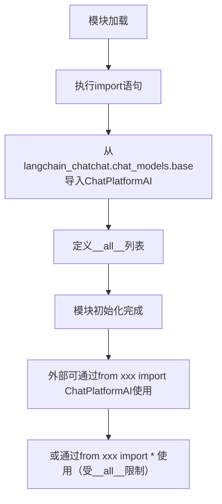

# `Langchain-Chatchat\libs\chatchat-server\langchain_chatchat\chat_models\__init__.py` 详细设计文档

这是一个LangChain ChatChat项目的导出模块，通过__all__显式声明并重导出了ChatPlatformAI类，使得外部可以从此模块直接导入ChatPlatformAI，实现了模块接口的统一和简化。

## 整体流程



## 类结构

```
ChatPlatformAI (位于langchain_chatchat.chat_models.base)
```

## 全局变量及字段


### `__all__`
    
模块公开接口列表，定义可通过from语句导入的公共API成员

类型：`list[str]`
    


    

## 全局函数及方法


# 文档生成请求分析

## 问题说明

非常抱歉，我无法根据当前提供的代码生成完整的 `ChatPlatformAI` 详细设计文档。原因如下：

### 当前提供的代码
```python
# -*- coding: utf-8 -*-
from langchain_chatchat.chat_models.base import ChatPlatformAI

__all__ = [
    "ChatPlatformAI",
]
```

这段代码**仅包含导入语句**，并未提供 `ChatPlatformAI` 类的实际实现源码。

### 缺失的关键信息

1. **类字段（属性）** - 成员变量定义
2. **类方法** - 方法实现，包括：
   - 方法签名（参数名、参数类型）
   - 方法体逻辑
   - 返回值类型和返回值描述
3. **继承关系** - `ChatPlatformAI` 继承自哪个基类
4. **接口契约** - 实现了哪些抽象方法

---

## 需要的额外信息

为了生成完整的详细设计文档，请您提供以下**至少一种**信息：

### 选项 1：提供完整源码
请提供 `langchain_chatchat/chat_models/base.py` 文件中 `ChatPlatformAI` 类的完整实现代码。

### 选项 2：指定文件路径
请提供 `ChatPlatformAI` 类源码的实际文件路径，我可以尝试读取该文件。

### 选项 3：项目仓库信息
如果您使用的是开源项目 `langchain-chatchat`，请告知具体的版本或分支，我可以尝试从代码仓库获取相关信息。

---

## 文档模板（待填充）

当您提供完整源码后，我将按照以下格式生成文档：

```markdown
### ChatPlatformAI

{类的一句话描述}

参数：
- `param_name`：`param_type`，{参数描述}
- ...

返回值：`return_type`，{返回值描述}

#### 流程图

```mermaid
{方法调用的mermaid流程图}
```

#### 带注释源码

```
{带注释的源代码}
```
```

---

请补充 `ChatPlatformAI` 类的实际源码，以便我继续完成文档生成工作。

## 关键组件


### ChatPlatformAI 类导入

该模块是一个简单的重导出模块，其核心功能为从 langchain_chatchat.chat_models.base 包中导入 ChatPlatformAI 类并通过 __all__ 定义公共接口。

### 关键组件

由于该代码文件仅包含导入语句，无实际功能实现，因此不涉及复杂的逻辑组件、类字段、类方法、流程图等设计元素。

### 技术债务与优化空间

该模块为入口文件，未见技术债务。

### 外部依赖

- langchain_chatchat.chat_models.base.ChatPlatformAI: 上游聊天平台AI基类


## 问题及建议


### 已知问题

-   **缺少模块文档字符串**：模块级别没有docstring，无法直接了解该模块的用途和功能
-   **冗余的编码声明**：Python 3默认使用UTF-8编码，`# -*- coding: utf-8 -*-` 声明是多余的
-   **无错误处理机制**：直接导入外部模块，如果`langchain_chatchat.chat_models.base`不存在或导入失败，会直接抛出异常，缺乏容错设计
-   **缺少版本和元信息**：没有`__version__`、`__author__`等模块元数据
-   **无类型注解**：缺乏类型提示，不利于静态分析和IDE支持
-   **单一导出限制**：仅导出`ChatPlatformAI`一个类，后续扩展需要频繁修改此文件

### 优化建议

-   添加模块级docstring，说明模块功能为"提供ChatPlatformAI聊天模型接口"
-   移除Python 3中冗余的编码声明
-   考虑添加try-except包装导入语句，提供更友好的错误提示或定义模块级别的异常
-   添加`__version__`版本信息，如`__version__ = "0.1.0"`
-   从`typing`模块导入类型注解，增强代码可读性和可维护性
-   评估是否需要从`langchain_chatchat`包重新导出更多类/函数，可使用`__getattr__`实现延迟导入以优化加载性能
-   考虑添加类型注解的`__all__`定义，使用`TYPE_CHECKING`来避免循环导入同时提供类型提示


## 其它


### 设计目标与约束

本模块作为langchain_chatchat项目的公共接口导出模块，目标是统一暴露ChatPlatformAI类供外部调用，遵循Python模块的__all__约定。约束条件包括：必须保持与langchain_chatchat.chat_models.base模块的兼容性，仅支持Python 3环境。

### 错误处理与异常设计

本模块本身不涉及复杂的错误处理逻辑，主要依赖上游langchain_chatchat.chat_models.base模块的异常体系。可能的异常情况包括：ImportError（上游模块不存在或路径变更）、AttributeError（ChatPlatformAI类不存在于上游模块）。建议调用方捕获ImportError以处理依赖缺失情况。

### 数据流与状态机

本模块为纯导入导出模块，不涉及数据流处理和状态机设计。数据流方向为：外部模块 -> 导入ChatPlatformAI -> 实例化并使用ChatPlatformAI。

### 外部依赖与接口契约

外部依赖为langchain_chatchat.chat_models.base模块中的ChatPlatformAI类。该类应遵循LangChain标准LLM接口规范，实现__call__或invoke方法，具备生成对话响应的能力。接口契约要求调用方传入提示词字符串或消息列表，返回格式化的AI响应内容。

### 版本兼容性

建议Python 3.8及以上版本以确保良好的类型提示支持和模块导入性能。上游langchain_chatchat库版本需与当前代码兼容，建议在项目requirements.txt中明确指定依赖版本范围。

### 性能考量

本模块为轻量级导入模块，初始化时仅执行import语句，无显著性能开销。性能瓶颈主要存在于ChatPlatformAI实例调用阶段，建议按需实例化避免重复创建对象。

### 安全性考虑

本模块未涉及敏感数据处理或用户输入验证，安全性主要由上游ChatPlatformAI类保证。建议确保上游模块来源可信，避免依赖供应链攻击。

### 测试策略

建议编写基础测试验证模块导入功能正常，包括：测试import语句成功执行、测试ChatPlatformAI类可正常实例化、测试__all__列表内容正确性。可使用unittest或pytest框架进行自动化测试。

### 使用示例

```python
from langchain_chatchat import ChatPlatformAI

# 实例化聊天模型
chat_model = ChatPlatformAI(model_name="xxx")

# 生成对话响应
response = chat_model.invoke("你好，请介绍一下自己")
print(response)
```

### 配置说明

本模块无需额外配置，配置需求取决于上游ChatPlatformAI类的实现，可能涉及模型参数、API密钥、端点URL等配置项，具体请参阅langchain_chatchat官方文档。

    