# `Langchain-Chatchat\libs\chatchat-server\langchain_chatchat\chat_models\base.py` 详细设计文档

这是一个LangChain的ChatModel封装类，用于与OpenAI兼容的API进行交互（特别是Chatchat平台），支持同步/异步调用、流式输出、函数调用和工具绑定等功能。

## 整体流程

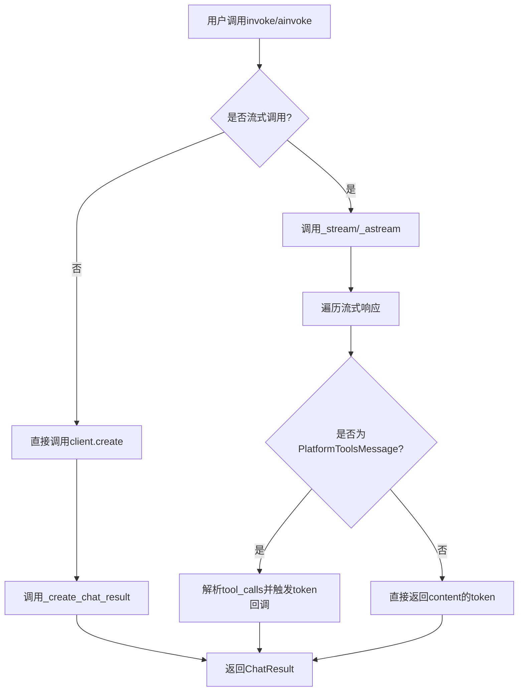

## 类结构

```
BaseChatModel (langchain_core)
└── ChatPlatformAI (主类)
```

## 全局变量及字段


### `logger`
    
模块级日志记录器，用于记录该模块的日志信息

类型：`logging.Logger`
    


### `PYDANTIC_V2`
    
标识是否使用Pydantic v2版本的布尔值

类型：`bool`
    


### `_FunctionCall.name`
    
函数调用的名称，字符串类型

类型：`str`
    


### `ChatPlatformAI.client`
    
OpenAI聊天完成客户端实例，用于发送API请求

类型：`Any`
    


### `ChatPlatformAI.model_name`
    
要使用的AI模型名称，默认为glm-4

类型：`str`
    


### `ChatPlatformAI.temperature`
    
采样温度，控制生成的随机性，默认为0.7

类型：`float`
    


### `ChatPlatformAI.model_kwargs`
    
用于存储未被显式指定的其他模型参数

类型：`Dict[str, Any]`
    


### `ChatPlatformAI.chatchat_api_key`
    
ChatChat API密钥，用于身份验证

类型：`Optional[SecretStr]`
    


### `ChatPlatformAI.chatchat_api_base`
    
ChatChat API的基础URL路径

类型：`Optional[str]`
    


### `ChatPlatformAI.chatchat_proxy`
    
用于API请求的代理服务器地址

类型：`Optional[str]`
    


### `ChatPlatformAI.request_timeout`
    
API请求的超时时间设置

类型：`Union[float, Tuple[float, float], Any, None]`
    


### `ChatPlatformAI.max_retries`
    
生成响应时的最大重试次数，默认为1

类型：`int`
    


### `ChatPlatformAI.streaming`
    
是否启用流式输出，默认为False

类型：`bool`
    


### `ChatPlatformAI.max_tokens`
    
生成的最大token数量限制

类型：`Optional[int]`
    


### `ChatPlatformAI.http_client`
    
可选的httpx.Client实例，用于自定义HTTP请求

类型：`Union[Any, None]`
    
    

## 全局函数及方法


### `_convert_dict_to_message`

将字典格式的消息（如 OpenAI API 返回的消息字典）转换为 LangChain 框架中的 BaseMessage 类型的消息对象，支持 user、assistant、system、function、tool 等角色。

参数：

- `_dict`：`Mapping[str, Any]`，包含消息角色和内容的字典，字典中应包含 `role` 字段，可能包含 `content`、`name`、`tool_call_id`、`function_call`、`tool_calls` 等字段

返回值：`BaseMessage`，根据角色类型返回对应的 LangChain 消息对象（HumanMessage、AIMessage、SystemMessage、FunctionMessage、ToolMessage 或 ChatMessage）

#### 流程图

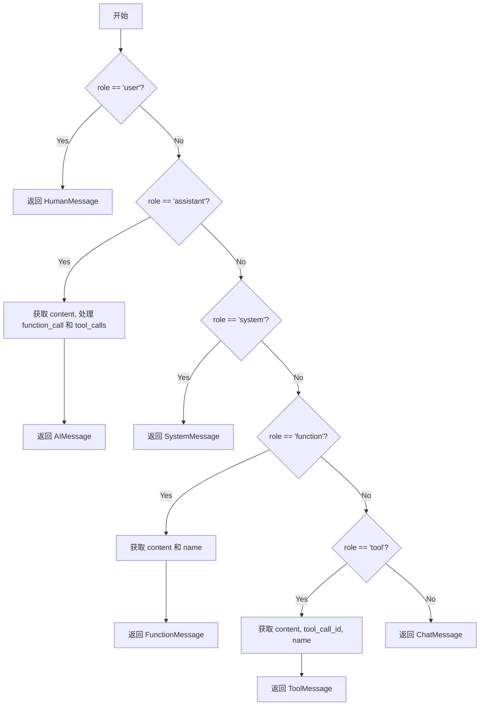

#### 带注释源码

```python
def _convert_dict_to_message(_dict: Mapping[str, Any]) -> BaseMessage:
    """Convert a dictionary to a LangChain message.

    Args:
        _dict: The dictionary.

    Returns:
        The LangChain message.
    """
    # 获取消息角色，默认为 None
    role = _dict.get("role")
    
    # 根据不同角色类型创建对应的消息对象
    if role == "user":
        # 用户消息：提取 content 内容，默认为空字符串
        return HumanMessage(content=_dict.get("content", ""))
    
    elif role == "assistant":
        # 助手消息：处理 Azure 兼容性和 OpenAI 返回 None 的情况
        # content 可能为 None 或空字符串，需要统一处理
        content = _dict.get("content", "") or ""
        
        # 初始化额外参数字典，用于存储 function_call 和 tool_calls
        additional_kwargs: Dict = {}
        
        # 处理 function_call（旧版函数调用方式）
        if function_call := _dict.get("function_call"):
            additional_kwargs["function_call"] = dict(function_call)
        
        # 处理 tool_calls（新版工具调用方式）
        if tool_calls := _dict.get("tool_calls"):
            additional_kwargs["tool_calls"] = tool_calls
        
        return AIMessage(content=content, additional_kwargs=additional_kwargs)
    
    elif role == "system":
        # 系统消息：提取 content 内容
        return SystemMessage(content=_dict.get("content", ""))
    
    elif role == "function":
        # 函数消息：需要 content 和 name 参数
        return FunctionMessage(content=_dict.get("content", ""), name=_dict.get("name"))
    
    elif role == "tool":
        # 工具消息：处理工具调用结果
        additional_kwargs = {}
        if "name" in _dict:
            additional_kwargs["name"] = _dict["name"]
        
        return ToolMessage(
            content=_dict.get("content", ""),
            tool_call_id=_dict.get("tool_call_id"),
            additional_kwargs=additional_kwargs,
        )
    
    else:
        # 未知角色：返回通用 ChatMessage，使用原始角色名
        return ChatMessage(content=_dict.get("content", ""), role=role)
```


### `_convert_message_to_dict`

该函数是 LangChain 消息转换为字典的工具函数，用于将各种类型的 LangChain 消息对象（HumanMessage、AIMessage、SystemMessage、FunctionMessage、ToolMessage、ChatMessage）序列化为标准的字典格式，以便发送给 OpenAI API。

参数：

- `message`：`BaseMessage`，待转换的 LangChain 消息对象

返回值：`dict`，包含角色（role）、内容（content）及其他相关属性的字典

#### 流程图

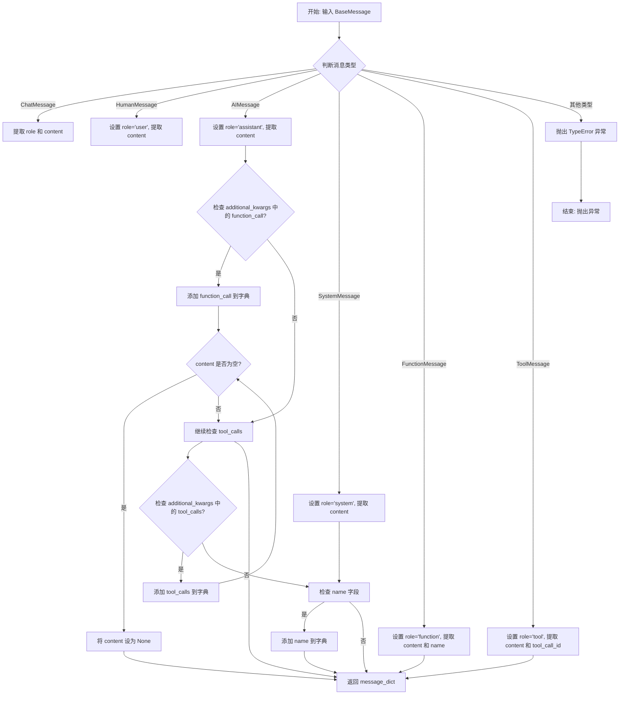

#### 带注释源码

```python
def _convert_message_to_dict(message: BaseMessage) -> dict:
    """Convert a LangChain message to a dictionary.

    Args:
        message: The LangChain message.

    Returns:
        The dictionary.
    """
    message_dict: Dict[str, Any]
    
    # 处理 ChatMessage 类型（通用聊天消息）
    if isinstance(message, ChatMessage):
        message_dict = {"role": message.role, "content": message.content}
    
    # 处理 HumanMessage 类型（用户消息）
    elif isinstance(message, HumanMessage):
        message_dict = {"role": "user", "content": message.content}
    
    # 处理 AIMessage 类型（AI 助手消息）
    elif isinstance(message, AIMessage):
        message_dict = {"role": "assistant", "content": message.content}
        
        # 如果存在 function_call（函数调用），添加到字典
        if "function_call" in message.additional_kwargs:
            message_dict["function_call"] = message.additional_kwargs["function_call"]
            # 如果仅有函数调用而内容为空，将 content 设为 None
            if message_dict["content"] == "":
                message_dict["content"] = None
        
        # 如果存在 tool_calls（工具调用），添加到字典
        if "tool_calls" in message.additional_kwargs:
            message_dict["tool_calls"] = message.additional_kwargs["tool_calls"]
            # 如果仅有工具调用而内容为空，将 content 设为 None
            if message_dict["content"] == "":
                message_dict["content"] = None
    
    # 处理 SystemMessage 类型（系统消息）
    elif isinstance(message, SystemMessage):
        message_dict = {"role": "system", "content": message.content}
    
    # 处理 FunctionMessage 类型（函数响应消息）
    elif isinstance(message, FunctionMessage):
        message_dict = {
            "role": "function",
            "content": message.content,
            "name": message.name,
        }
    
    # 处理 ToolMessage 类型（工具响应消息）
    elif isinstance(message, ToolMessage):
        message_dict = {
            "role": "tool",
            "content": message.content,
            "tool_call_id": message.tool_call_id,
        }
    
    # 未知消息类型，抛出 TypeError 异常
    else:
        raise TypeError(f"Got unknown type {message}")
    
    # 如果 additional_kwargs 中存在 name 字段，添加到字典
    if "name" in message.additional_kwargs:
        message_dict["name"] = message.additional_kwargs["name"]
    
    return message_dict
```


### `_convert_delta_to_message_chunk`

该函数是流式响应处理中的关键转换函数，负责将 OpenAI API 返回的增量响应块（delta）转换为 LangChain 的消息块对象（BaseMessageChunk）。它根据 delta 中的角色信息或默认类类型，实例化对应的消息块子类（如 HumanMessageChunk、AIMessageChunk、ToolMessageChunk 等），并处理函数调用和工具调用等额外参数。

参数：

- `_dict`：`Mapping[str, Any]`，表示从 API 返回的增量响应字典，包含 role、content、function_call、tool_calls 等字段
- `default_class`：`Type[BaseMessageChunk]`，默认的消息块类型，用于在没有明确角色时作为回退选项

返回值：`BaseMessageChunk`，根据角色或默认类类型返回对应的 LangChain 消息块对象

#### 流程图

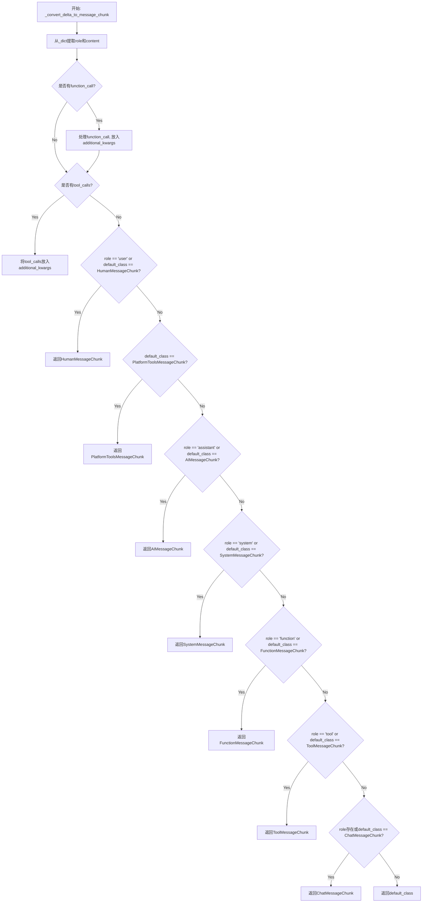

#### 带注释源码

```python
def _convert_delta_to_message_chunk(
        _dict: Mapping[str, Any], default_class: Type[BaseMessageChunk]
) -> BaseMessageChunk:
    """将增量响应字典转换为对应的消息块对象。

    Args:
        _dict: 包含增量响应数据的字典，通常包含 role、content 字段，
               可能包含 function_call 或 tool_calls 字段
        default_class: 默认的消息块类型，当无法从 role 判断时使用

    Returns:
        对应角色的消息块对象（BaseMessageChunk 的子类实例）
    """
    # 提取角色信息，使用 cast 确保类型安全
    role = cast(str, _dict.get("role"))
    # 提取内容，空字符串转为空字符串而非 None
    content = cast(str, _dict.get("content") or "")
    # 初始化额外参数字典，用于存储 function_call 和 tool_calls
    additional_kwargs: Dict = {}

    # 处理函数调用（function_call）
    # 如果 function_call 中的 name 为 None，转换为空字符串
    if _dict.get("function_call"):
        function_call = dict(_dict["function_call"])
        if "name" in function_call and function_call["name"] is None:
            function_call["name"] = ""
        additional_kwargs["function_call"] = function_call

    # 处理工具调用（tool_calls）
    if _dict.get("tool_calls"):
        additional_kwargs["tool_calls"] = _dict["tool_calls"]

    # 根据角色或默认类类型返回对应的消息块
    # 优先级：先检查 role，再检查 default_class
    if role == "user" or default_class == HumanMessageChunk:
        return HumanMessageChunk(content=content)
    elif default_class == PlatformToolsMessageChunk:
        # 平台工具消息块，带额外参数
        return PlatformToolsMessageChunk(
            content=content, additional_kwargs=additional_kwargs
        )
    elif role == "assistant" or default_class == AIMessageChunk:
        # 助手消息块，可能包含函数/工具调用
        return AIMessageChunk(content=content, additional_kwargs=additional_kwargs)
    elif role == "system" or default_class == SystemMessageChunk:
        return SystemMessageChunk(content=content)
    elif role == "function" or default_class == FunctionMessageChunk:
        # 函数消息块需要 name 参数
        return FunctionMessageChunk(content=content, name=_dict["name"])
    elif role == "tool" or default_class == ToolMessageChunk:
        # 工具消息块需要 tool_call_id 参数
        return ToolMessageChunk(content=content, tool_call_id=_dict["tool_call_id"])
    elif role or default_class == ChatMessageChunk:
        # 通用聊天消息块
        return ChatMessageChunk(content=content, role=role)
    else:
        # 最终回退：使用默认类
        return default_class(content=content)  # type: ignore
```


### `_gen_info_and_msg_metadata`

该函数用于将 ChatGeneration 对象的生成信息（generation_info）和消息响应元数据（response_metadata）合并为一个字典返回，以便在流式输出时更新消息的 response_metadata。

参数：

- `generation`：`Union[ChatGeneration, ChatGenerationChunk]`，LangChain 的生成结果对象，包含 generation_info 和 message.response_metadata

返回值：`dict`，合并后的元数据字典

#### 流程图

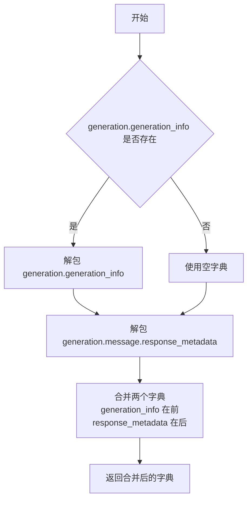

#### 带注释源码

```python
def _gen_info_and_msg_metadata(
        generation: Union[ChatGeneration, ChatGenerationChunk],
) -> dict:
    """
    合并生成信息与消息响应元数据。

    用于在流式输出场景下，将 ChatGenerationChunk 中的 generation_info
    （如 finish_reason、logprobs 等）与消息的 response_metadata
    （如 token_usage、model_name 等）合并为一个字典。

    Args:
        generation: LangChain 的生成结果对象，可以是 ChatGeneration
                    或 ChatGenerationChunk 类型

    Returns:
        dict: 合并后的元数据字典，response_metadata 会覆盖 generation_info
              中同名的键
    """
    # 使用字典解包语法合并两个字典
    # generation.generation_info 包含生成相关信息（如 finish_reason）
    # generation.message.response_metadata 包含响应元数据（如 token_usage）
    # 由于 response_metadata 在后面解包，相同键会被覆盖
    return {
        **(generation.generation_info or {}),
        **generation.message.response_metadata,
    }
```


### `ChatPlatformAI.lc_secrets`

该属性用于返回LangChain可序列化的密钥映射字典，标识需要从环境变量加载的敏感配置项（如API密钥），以便在序列化/反序列化过程中正确处理敏感信息。

参数：无

返回值：`Dict[str, str]`，返回包含密钥名称与环境变量名称映射的字典，当前映射 `{"chatchat_api_key": "CHATCHAT_API_KEY"}` 表示API密钥需从环境变量 `CHATCHAT_API_KEY` 获取。

#### 流程图

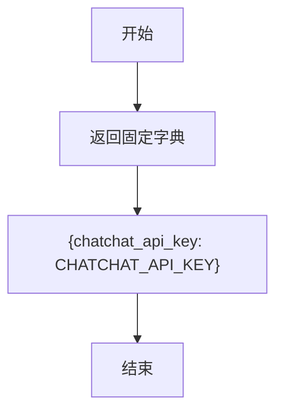

#### 带注释源码

```python
@property
def lc_secrets(self) -> Dict[str, str]:
    """返回LangChain可序列化的密钥映射字典。
    
    该属性用于LangChain的序列化机制，标识哪些字段包含敏感信息
    （如API密钥），以及这些敏感信息应该从哪个环境变量加载。
    在序列化时，LangChain会保留这个映射关系而不是直接保存密钥值；
    反序列化时，会根据映射从环境变量中读取实际的密钥值。
    
    Returns:
        Dict[str, str]: 密钥名称到环境变量名的映射字典。
                        当前映射表示'chatchat_api_key'字段对应
                        环境变量'CHATCHAT_API_KEY'。
    """
    return {"chatchat_api_key": "CHATCHAT_API_KEY"}
```


### `ChatPlatformAI.get_lc_namespace`

获取 LangChain 对象的命名空间，用于 LangChain 内部的序列化与反序列化标识。

参数：

- `cls`：`Type[ChatPlatformAI]`，类本身（隐式参数），表示调用此方法的类

返回值：`List[str]`，返回包含命名空间层级的字符串列表 `["langchain", "chat_models", "openai"]`，用于标识该聊天模型在 LangChain 对象层级中的位置。

#### 流程图

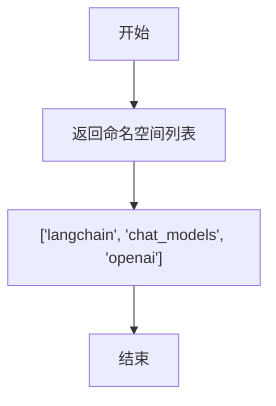

#### 带注释源码

```python
@classmethod
def get_lc_namespace(cls) -> List[str]:
    """Get the namespace of the langchain object."""
    # 返回一个表示 LangChain 对象命名空间的字符串列表
    # 该命名空间用于 LangChain 的序列化/反序列化机制
    # 标识该类属于 langchain -> chat_models -> openai 这一层级结构
    return ["langchain", "chat_models", "openai"]
```


### `ChatPlatformAI.lc_attributes`

该方法是一个属性方法（property），用于获取 LangChain 可序列化的属性字典。主要用于 LangChain 框架的序列化功能，返回包含 `chatchat_api_base` 和 `chatchat_proxy` 的属性字典，这些属性在对象序列化时被包含在内。

参数：

- `self`：`ChatPlatformAI`，隐式参数，当前 ChatPlatformAI 实例

返回值：`Dict[str, Any]`，返回包含可选属性 `chatchat_api_base` 和 `chatchat_proxy` 的字典，用于 LangChain 序列化

#### 流程图

```mermaid
flowchart TD
    A[开始 lc_attributes 属性方法] --> B{self.chatchat_api_base 是否存在?}
    B -->|是| C[attributes['chatchat_api_base'] = self.chatchat_api_base]
    B -->|否| D{self.chatchat_proxy 是否存在?}
    C --> D
    D -->|是| E[attributes['chatchat_proxy'] = self.chatchat_proxy]
    D -->|否| F[返回 attributes 字典]
    E --> F
```

#### 带注释源码

```python
@property
def lc_attributes(self) -> Dict[str, Any]:
    """获取 LangChain 可序列化的属性字典。
    
    该属性方法用于 LangChain 的序列化机制，
    返回一个包含模型配置信息的字典，
    这些信息会在对象序列化时被保存。
    
    Returns:
        Dict[str, Any]: 包含可选属性 chatchat_api_base 和 chatchat_proxy 的字典
    """
    # 初始化空字典用于存储可序列化属性
    attributes: Dict[str, Any] = {}

    # 如果 chatchat_api_base 存在，则添加到属性字典中
    # chatchat_api_base 是 API 的基础 URL 地址
    if self.chatchat_api_base:
        attributes["chatchat_api_base"] = self.chatchat_api_base

    # 如果 chatchat_proxy 存在，则添加到属性字典中
    # chatchat_proxy 是用于代理请求的 URL
    if self.chatchat_proxy:
        attributes["chatchat_proxy"] = self.chatchat_proxy

    # 返回包含可序列化属性的字典
    return attributes
```


### `ChatPlatformAI.is_lc_serializable`

该方法是一个类方法，用于指示 ChatPlatformAI 模型是否支持 Langchain 的序列化功能。

参数：

-  `cls`：类本身（Python classmethod 隐式参数），无需显式传递

返回值：`bool`，返回 `True` 表示该模型可以被 Langchain 序列化

#### 流程图

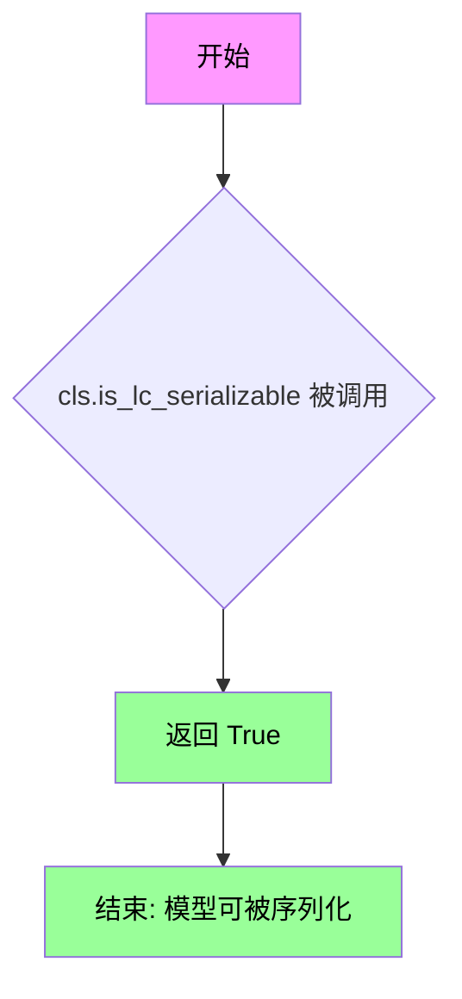

#### 带注释源码

```python
@classmethod
def is_lc_serializable(cls) -> bool:
    """Return whether this model can be serialized by Langchain."""
    return True
```

**代码说明：**

- 这是一个类方法（`@classmethod`），不需要实例化即可调用
- 该方法重写了父类 `BaseChatModel` 中的 `is_lc_serializable` 方法
- 返回值为 `True`，表明 `ChatPlatformAI` 模型实例可以通过 Langchain 的序列化机制（如 `dumpd()` 或 `dumps()`）进行持久化存储
- 这对于将模型配置保存到文件或从文件加载模型配置非常有用


### `ChatPlatformAI.build_extra`

该方法是一个 Pydantic root validator，用于在模型实例化时处理额外的参数。它从传入的 `model_kwargs` 中提取额外参数，并将其合并到模型参数中，同时过滤掉已定义的字段。

参数：

- `cls`：类型 `Type[ChatPlatformAI]`，表示类本身（隐式参数，由装饰器传入）
- `values`：类型 `Dict[str,Any]`，包含初始化时传入的参数字典

返回值：`Dict[str,Any]`，返回处理后的参数字典，其中 `model_kwargs` 已包含从额外参数中过滤出的有效参数

#### 流程图

```mermaid
flowchart TD
    A[开始 build_extra] --> B[获取类的所有必填字段名]
    B --> C[从 values 中获取 model_kwargs]
    C --> D{检查 model_kwargs 是否存在}
    D -->|是| E[调用 build_extra_kwargs 过滤额外参数]
    D -->|否| F[创建空字典]
    E --> G[将过滤后的参数更新到 values['model_kwargs']]
    F --> G
    G --> H[返回处理后的 values]
```

#### 带注释源码

```python
@root_validator(pre=True, allow_reuse=True)
def build_extra(cls, values: Dict[str, Any]) -> Dict[str, Any]:
    """Build extra kwargs from additional params that were passed in.
    
    这是一个 Pydantic root validator，在模型实例化时pre阶段执行。
    用于处理用户传入的额外参数，将它们从 model_kwargs 中提取并验证。
    
    Args:
        cls: ChatPlatformAI 类本身
        values: 初始化时传入的参数字典
        
    Returns:
        处理后的参数字典，model_kwargs 已包含有效的额外参数
    """
    # 获取 ChatPlatformAI 模型的所有必填字段名称
    # 包括 model_name, temperature, client 等定义的所有字段
    all_required_field_names = get_pydantic_field_names(cls)
    
    # 从传入的值中获取 model_kwargs 字典
    # model_kwargs 用于传递 API 支持但类中未明确定义的参数
    extra = values.get("model_kwargs", {})
    
    # 使用 langchain_core.utils 中的 build_extra_kwargs 函数
    # 将 extra 中的参数与 values 合并，并过滤掉已定义的字段
    # 确保只有额外的参数才会被添加到 model_kwargs 中
    values["model_kwargs"] = build_extra_kwargs(
        extra, values, all_required_field_names
    )
    
    # 返回处理后的完整参数字典
    return values
```


### `ChatPlatformAI.validate_environment`

该方法是 ChatPlatformAI 类的根验证器，用于在实例化时验证并初始化环境变量、API 密钥、代理配置，同时创建 OpenAI 客户端实例。

参数：

- `cls`：`<class type>`，当前类 ChatPlatformAI 的类对象
- `values`：`<class 'typing.Dict'>`，包含模型初始化参数的字典

返回值：`<class 'typing.Dict'>`，验证并处理后的参数字典

#### 流程图

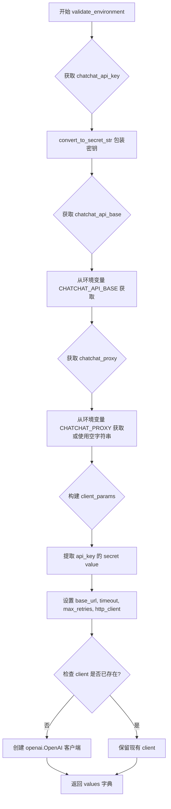

#### 带注释源码

```python
@root_validator(allow_reuse=True)
def validate_environment(cls, values: Dict) -> Dict:
    """Validate that api key and python package exists in environment."""
    
    # 1. 处理 API 密钥：从环境变量或传入值获取，并转换为 SecretStr 类型
    values["chatchat_api_key"] = convert_to_secret_str(
        get_from_dict_or_env(values, "chatchat_api_key", "CHATCHAT_API_KEY")
    )

    # 2. 处理 API 基础 URL：优先使用传入值，否则从环境变量获取
    values["chatchat_api_base"] = values["chatchat_api_base"] or os.getenv(
        "CHATCHAT_API_BASE"
    )
    
    # 3. 处理代理设置：从环境变量获取，默认空字符串
    values["chatchat_proxy"] = get_from_dict_or_env(
        values,
        "chatchat_proxy",
        "CHATCHAT_PROXY",
        default="",
    )

    # 4. 构建客户端参数字典
    client_params = {
        "api_key": (
            values["chatchat_api_key"].get_secret_value()  # 提取密钥明文
            if values["chatchat_api_key"]
            else None
        ),
        "base_url": values["chatchat_api_base"],           # API 基础 URL
        "timeout": values["request_timeout"],              # 请求超时时间
        "max_retries": values["max_retries"],              # 最大重试次数
        "http_client": values["http_client"],             # 自定义 HTTP 客户端
    }

    # 5. 如果没有外部传入 client，则创建 OpenAI 客户端实例
    if not values.get("client"):
        values["client"] = openai.OpenAI(**client_params).chat.completions

    return values
```


### `ChatPlatformAI._default_params`

该属性方法用于获取调用 OpenAI API 的默认参数，包括模型名称、流式响应开关、温度参数、模型额外参数以及最大 token 数限制，并返回一个包含这些默认参数的字典。

参数：无（该方法为属性方法，仅使用 self）

返回值：`Dict[str, Any]`，返回包含调用 OpenAI API 默认参数的字典，包含以下键值对：
- `model`: 模型名称
- `stream`: 是否启用流式响应
- `temperature`: 采样温度
- `max_tokens`（可选）: 最大生成 token 数（如果已设置）
- 以及 `model_kwargs` 中的所有额外参数

#### 流程图

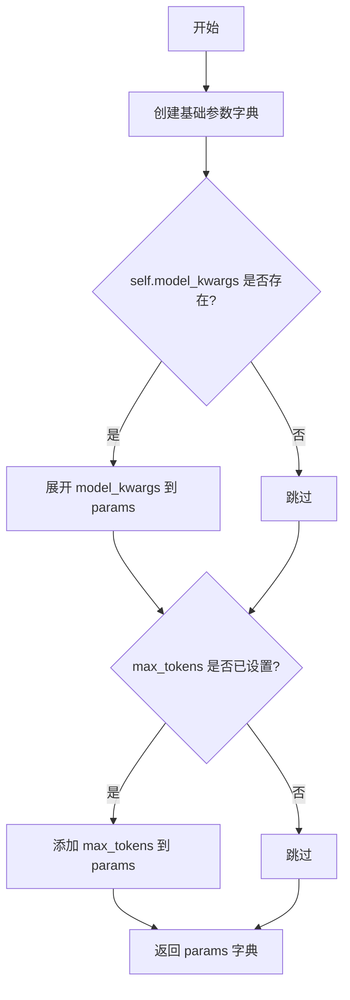

#### 带注释源码

```python
@property
def _default_params(self) -> Dict[str, Any]:
    """Get the default parameters for calling OpenAI API."""
    # 初始化基础参数字典，包含模型名、流式开关和温度
    params = {
        "model": self.model_name,       # 模型名称，如 "glm-4"
        "stream": self.streaming,       # 是否启用流式响应
        "temperature": self.temperature,  # 采样温度参数
        **self.model_kwargs,            # 展开模型额外参数（如 top_p, frequency_penalty 等）
    }
    # 仅当 max_tokens 不为 None 时才添加到参数字典中
    if self.max_tokens is not None:
        params["max_tokens"] = self.max_tokens
    # 返回完整的默认参数字典，供 API 调用使用
    return params
```


### `ChatPlatformAI._combine_llm_outputs`

该方法用于合并多个 LLM 输出的 token 使用情况和其他元数据信息，主要在批量调用或流式调用场景下聚合 token 统计和系统指纹等数据。

参数：

- `llm_outputs`：`List[Optional[dict]]`，LLM 输出列表，每个元素是一个包含 token_usage、system_fingerprint 等字段的字典，流式调用时可能为 None

返回值：`dict`，合并后的字典，包含聚合的 token_usage（包含 completion_tokens、prompt_tokens、total_tokens 等）、model_name，以及可选的 system_fingerprint

#### 流程图

```mermaid
flowchart TD
    A[Start _combine_llm_outputs] --> B[初始化 overall_token_usage = {}]
    B --> C[初始化 system_fingerprint = None]
    C --> D[遍历 llm_outputs 中的每个 output]
    D --> E{output is None?}
    E -->|是| F[继续下一次循环]
    E -->|否| G[获取 output 中的 token_usage]
    G --> H{token_usage is not None?}
    H -->|是| I[遍历 token_usage 中的每个键值对 k, v]
    I --> J{k 是否在 overall_token_usage 中?}
    J -->|是| K[overall_token_usage[k] += v]
    J -->|否| L[overall_token_usage[k] = v]
    K --> M[继续下一个键值对]
    L --> M
    M --> I
    I --> N[继续下一个 output]
    H -->|否| N
    F --> N
    N =>{system_fingerprint is None?}
    N --> O{获取 output 中的 system_fingerprint}
    O --> P{获取成功?}
    P -->|是| Q[保存 system_fingerprint]
    P -->|否| N
    Q --> N
    N --> R[构建 combined 字典]
    R --> S[combined 包含 token_usage 和 model_name]
    S --> T{system_fingerprint 存在?}
    T -->|是| U[添加 system_fingerprint 到 combined]
    T -->|否| V[返回 combined 字典]
    U --> V
```

#### 带注释源码

```python
def _combine_llm_outputs(self, llm_outputs: List[Optional[dict]]) -> dict:
    """合并多个 LLM 输出的 token 使用情况和其他元数据。
    
    该方法用于在批量生成或流式处理场景下，将多个 LLM 调用的输出
    合并为一个统一的统计结果。主要聚合 token 使用量（prompt tokens、
    completion tokens、total tokens）以及系统指纹信息。
    
    Args:
        llm_outputs: LLM 输出列表，每个元素是一个包含 'token_usage' 和 
            'system_fingerprint' 键的字典。在流式调用场景下，某些输出
            可能为 None（因为流式响应是增量生成的，初始块可能没有 token_usage）
    
    Returns:
        合并后的字典，包含:
            - token_usage: 聚合后的 token 使用统计，键包括 completion_tokens、
              prompt_tokens、total_tokens 等
            - model_name: 使用的模型名称
            - system_fingerprint: 可选的系统指纹（如果存在）
    """
    # 初始化聚合 token 使用量的字典
    overall_token_usage: dict = {}
    # 初始化系统指纹为 None
    system_fingerprint = None
    
    # 遍历每个 LLM 输出
    for output in llm_outputs:
        # 在流式调用场景下，某些输出可能为 None（初始流块没有 usage 信息）
        if output is None:
            continue
        
        # 获取当前输出的 token 使用情况
        token_usage = output["token_usage"]
        
        # 如果存在 token 使用信息，则聚合
        if token_usage is not None:
            # 遍历 token 使用量中的每个键值对
            for k, v in token_usage.items():
                if k in overall_token_usage:
                    # 累加已存在的 token 类型计数
                    overall_token_usage[k] += v
                else:
                    # 初始化新的 token 类型计数
                    overall_token_usage[k] = v
        
        # 获取系统指纹（取第一个非空值）
        if system_fingerprint is None:
            system_fingerprint = output.get("system_fingerprint")
    
    # 构建合并结果的基础字典
    combined = {
        "token_usage": overall_token_usage, 
        "model_name": self.model_name
    }
    
    # 如果存在系统指纹，则添加到结果中
    if system_fingerprint:
        combined["system_fingerprint"] = system_fingerprint
    
    return combined
```


### `ChatPlatformAI.stream`

该方法实现聊天模型的流式输出功能，支持同步迭代返回消息块。当模型未实现流式接口时，自动降级为同步调用invoke方法；否则通过回调管理器处理流式事件，解析并 yield 消息块，同时处理普通文本和平台工具消息。

参数：

- `input`：`LanguageModelInput`，输入的语言模型消息数据
- `config`：`Optional[RunnableConfig]`（关键字参数），运行配置对象，用于控制执行行为
- `stop`：`Optional[List[str]]`（关键字参数），生成停止词列表
- `**kwargs`：`Any`（关键字参数），其他传递给底层模型的参数

返回值：`Iterator[BaseMessageChunk]`，流式输出的消息块迭代器

#### 流程图

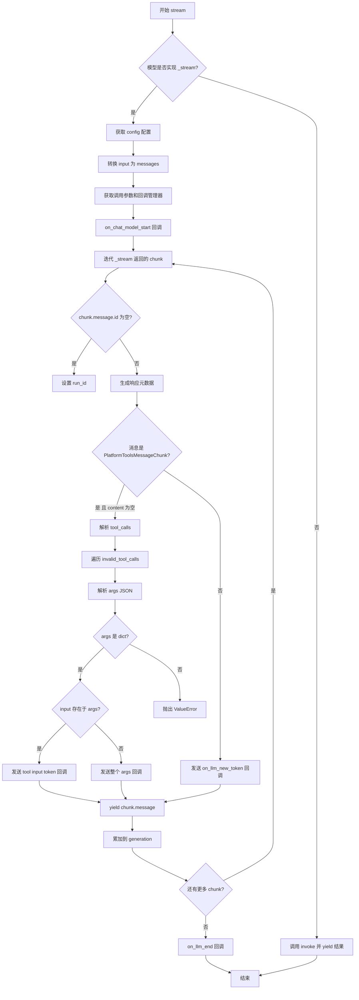

#### 带注释源码

```python
def stream(
        self,
        input: LanguageModelInput,
        config: Optional[RunnableConfig] = None,
        *,
        stop: Optional[List[str]] = None,
        **kwargs: Any,
) -> Iterator[BaseMessageChunk]:
    """同步流式生成聊天响应消息块。
    
    Args:
        input: 语言模型输入，可以是消息列表或字符串
        config: 可选的运行配置，包含回调、标签等
        stop: 可选的停止词列表
        **kwargs: 其他传递给模型的参数
        
    Yields:
        BaseMessageChunk: 流式返回的消息块
    """
    # 检查模型是否实现了流式接口，未实现则降级为同步调用
    if type(self)._stream == BaseChatModel._stream:
        # 模型不支持流式，使用默认实现（invoke）
        yield cast(
            BaseMessageChunk, self.invoke(input, config=config, stop=stop, **kwargs)
        )
    else:
        # 模型支持流式处理
        config = ensure_config(config)  # 确保配置存在
        # 将输入转换为消息列表
        messages = self._convert_input(input).to_messages()
        # 获取模型调用参数
        params = self._get_invocation_params(stop=stop, **kwargs)
        # 构建选项字典
        options = {"stop": stop, **kwargs}
        
        # 配置同步回调管理器
        callback_manager = CallbackManager.configure(
            config.get("callbacks"),      # 运行时回调
            self.callbacks,               # 实例回调
            self.verbose,                  # 详细模式
            config.get("tags"),            # 运行时标签
            self.tags,                     # 实例标签
            config.get("metadata"),        # 运行时元数据
            self.metadata,                 # 实例元数据
        )
        
        # 触发聊天模型开始回调
        (run_manager,) = callback_manager.on_chat_model_start(
            dumpd(self),                   # 序列化模型
            [messages],                    # 输入消息
            invocation_params=params,      # 调用参数
            options=options,               # 选项
            name=config.get("run_name"),   # 运行名称
            run_id=config.pop("run_id", None),  # 运行ID
            batch_size=1,
        )
        
        generation: Optional[ChatGenerationChunk] = None
        try:
            # 迭代流式响应块
            for chunk in self._stream(messages, stop=stop, **kwargs):
                # 为消息设置唯一ID
                if chunk.message.id is None:
                    chunk.message.id = f"run-{run_manager.run_id}"
                
                # 生成响应元数据和消息元数据
                chunk.message.response_metadata = _gen_info_and_msg_metadata(chunk)
                
                # 处理平台工具消息块
                if (
                        isinstance(chunk.message, PlatformToolsMessageChunk)
                        and chunk.message.content == ""
                ):
                    # 解析工具调用块
                    tool_calls, invalid_tool_calls = _paser_chunk(
                        chunk.message.tool_call_chunks
                    )

                    # 遍历无效的工具调用
                    for chunk_tool in invalid_tool_calls:
                        # 解析参数为JSON
                        if isinstance(chunk_tool["args"], str):
                            args_ = parse_partial_json(chunk_tool["args"])
                        else:
                            args_ = chunk_tool["args"]
                        
                        # 验证参数格式
                        if not isinstance(args_, dict):
                            raise ValueError("Malformed args.")
                        
                        # 如果包含 input，发送 token 回调
                        if "input" in args_:
                            run_manager.on_llm_new_token(
                                cast(str, args_["input"]), chunk=chunk
                            )
                else:
                    # 普通文本内容，发送 token 回调
                    run_manager.on_llm_new_token(
                        cast(str, chunk.message.content), chunk=chunk
                    )
                
                # 返回消息块
                yield chunk.message
                
                # 累加生成内容
                if generation is None:
                    generation = chunk
                else:
                    generation += chunk
            
            # 确保至少有一个 generation
            assert generation is not None
        except BaseException as e:
            # 错误处理，回调管理器报告错误
            run_manager.on_llm_error(
                e,
                response=LLMResult(
                    generations=[[generation]] if generation else []
                ),
            )
            raise e
        else:
            # 完成处理，回调管理器报告结束
            run_manager.on_llm_end(LLMResult(generations=[[generation]]))
```


### `ChatPlatformAI.astream`

这是一个异步流式方法，用于以流式方式生成聊天响应。该方法首先检查模型是否实现了异步流式方法（`_astream`）和同步流式方法（`_stream`），如果两者都未实现则回退到`ainvoke`；否则配置回调管理器，调用异步流式生成方法，处理每个消息块（包括工具调用解析和token处理），并通过回调管理器跟踪流式生成的进度和状态。

参数：

- `input`：`LanguageModelInput`，输入的语言模型数据，可以是字符串、消息列表或消息元组
- `config`：`Optional[RunnableConfig]`（关键字参数），可选的运行配置，包含回调、标签、元数据等
- `stop`：`Optional[List[str]]`（关键字参数），可选的停止词列表，用于提前终止生成
- `**kwargs`：`Any`（关键字参数），额外的关键字参数，会传递给底层流方法

返回值：`AsyncIterator[BaseMessageChunk]`（异步迭代器[BaseMessageChunk]），异步生成的消息块迭代器，每个块包含部分聊天响应内容

#### 流程图

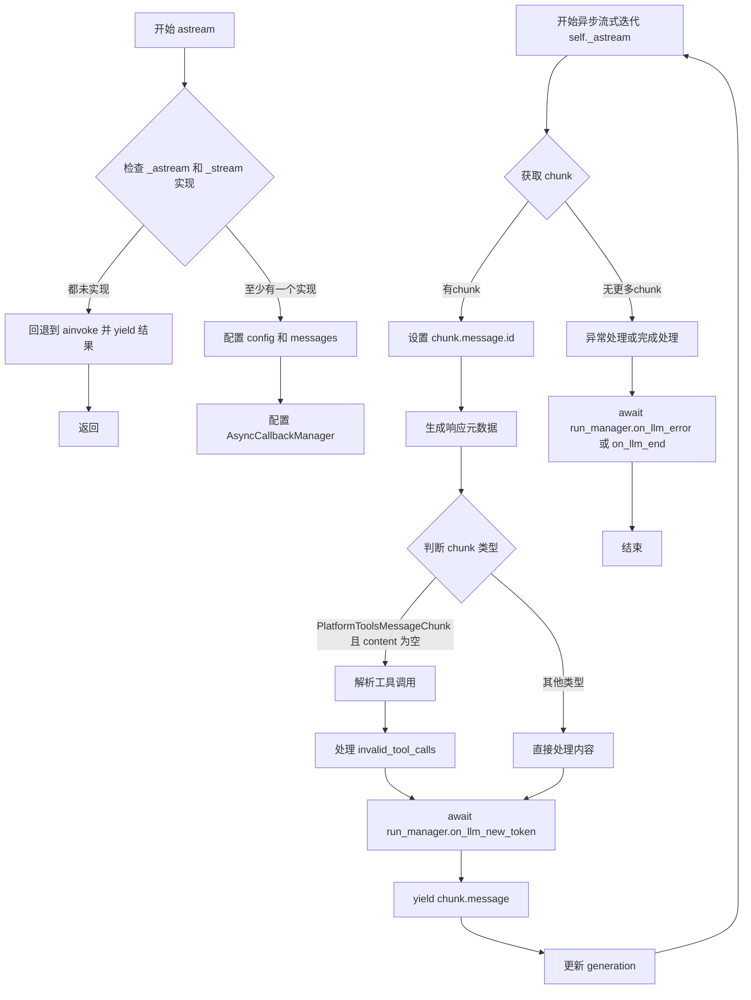

#### 带注释源码

```python
async def astream(
        self,
        input: LanguageModelInput,
        config: Optional[RunnableConfig] = None,
        *,
        stop: Optional[List[str]] = None,
        **kwargs: Any,
) -> AsyncIterator[BaseMessageChunk]:
    """以异步流式方式生成聊天响应。
    
    Args:
        input: 语言模型输入，可以是字符串、消息列表或消息元组
        config: 可选的运行配置，包含回调、标签、元数据等
        stop: 可选的停止词列表
        **kwargs: 额外的关键字参数
    
    Yields:
        异步生成的消息块，每个块包含部分聊天响应
    """
    # 检查是否实现了异步或同步流式方法
    if (
            type(self)._astream is BaseChatModel._astream
            and type(self)._stream is BaseChatModel._stream
    ):
        # 如果都没有实现，回退到同步调用 ainvoke
        yield cast(
            BaseMessageChunk,
            await self.ainvoke(input, config=config, stop=stop, **kwargs),
        )
        return

    # 确保配置存在并获取标准配置
    config = ensure_config(config)
    # 将输入转换为消息列表
    messages = self._convert_input(input).to_messages()
    # 获取调用参数
    params = self._get_invocation_params(stop=stop, **kwargs)
    # 构建选项字典
    options = {"stop": stop, **kwargs}
    
    # 配置异步回调管理器
    callback_manager = AsyncCallbackManager.configure(
        config.get("callbacks"),
        self.callbacks,
        self.verbose,
        config.get("tags"),
        self.tags,
        config.get("metadata"),
        self.metadata,
    )
    
    # 触发聊天模型开始回调
    (run_manager,) = await callback_manager.on_chat_model_start(
        dumpd(self),
        [messages],
        invocation_params=params,
        options=options,
        name=config.get("run_name"),
        run_id=config.pop("run_id", None),
        batch_size=1,
    )

    # 初始化生成对象
    generation: Optional[ChatGenerationChunk] = None
    try:
        # 异步迭代流式响应
        async for chunk in self._astream(
                messages,
                stop=stop,
                **kwargs,
        ):
            # 如果消息ID为空，生成唯一的运行ID
            if chunk.message.id is None:
                chunk.message.id = f"run-{run_manager.run_id}"
            
            # 生成响应元数据（包含finish_reason等信息）
            chunk.message.response_metadata = _gen_info_and_msg_metadata(chunk)
            
            # 判断是否为平台工具消息且内容为空（工具调用场景）
            if (
                    isinstance(chunk.message, PlatformToolsMessageChunk)
                    and chunk.message.content == ""
            ):
                # 解析工具调用块
                tool_calls, invalid_tool_calls = _paser_chunk(
                    chunk.message.tool_call_chunks
                )

                # 处理无效的工具调用
                for chunk_tool in invalid_tool_calls:
                    # 尝试解析JSON参数
                    if isinstance(chunk_tool["args"], str):
                        try:
                            args_ = parse_partial_json(chunk_tool["args"])
                        except Exception as e:
                            # 解析失败则作为原始输入处理
                            args_ = {"input": chunk_tool["args"]}
                    else:
                        args_ = chunk_tool["args"]
                    
                    # 验证参数格式
                    if not isinstance(args_, dict):
                        raise ValueError("Malformed args.")
                    
                    # 根据参数类型触发token回调
                    if "input" in args_:
                        await run_manager.on_llm_new_token(
                            cast(str, args_["input"]), chunk=chunk
                        )
                    else:
                        await run_manager.on_llm_new_token(
                            cast(str, args_), chunk=chunk
                        )
            else:
                # 普通文本内容，触发token回调
                await run_manager.on_llm_new_token(
                    cast(str, chunk.message.content), chunk=chunk
                )
            
            # 返回消息块
            yield chunk.message
            
            # 累加生成内容
            if generation is None:
                generation = chunk
            else:
                generation += chunk
        
        # 确保至少有一个生成结果
        assert generation is not None
    except BaseException as e:
        # 发生异常时触发错误回调并重新抛出
        await run_manager.on_llm_error(
            e,
            response=LLMResult(generations=[[generation]] if generation else []),
        )
        raise e
    else:
        # 正常完成时触发结束回调
        await run_manager.on_llm_end(
            LLMResult(generations=[[generation]]),
        )
```


### `ChatPlatformAI._stream`

该方法是 ChatPlatformAI 类的私有流式生成方法，负责调用底层 OpenAI 客户端的流式 API，接收增量响应并将每次迭代转换为 LangChain 的 `ChatGenerationChunk` 对象，同时处理生成元数据（如 finish_reason 和 logprobs）。

参数：

- `self`：`ChatPlatformAI`，ChatModel 实例本身
- `messages`：`List[BaseMessage]`，输入的消息列表，用于生成聊天响应
- `stop`：`Optional[List[str]]`，停止词列表，用于提前终止生成
- `run_manager`：`Optional[CallbackManagerForLLMRun]`（可选），回调管理器，用于在生成过程中触发回调事件（如新 token 事件）
- `**kwargs`：`Any`，额外的关键字参数，会合并到 API 调用参数中

返回值：`Iterator[ChatGenerationChunk]`，一个生成 `ChatGenerationChunk` 对象的迭代器，每次迭代代表一个增量响应块

#### 流程图

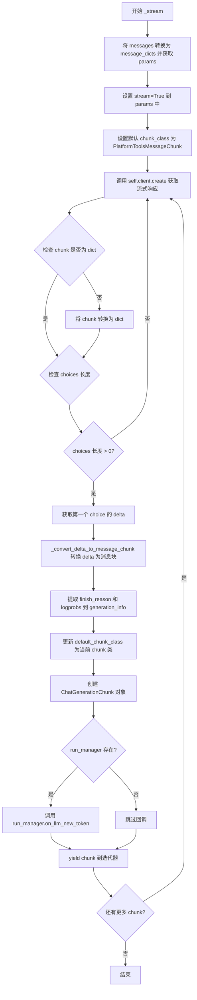

#### 带注释源码

```python
def _stream(
        self,
        messages: List[BaseMessage],
        stop: Optional[List[str]] = None,
        run_manager: Optional[CallbackManagerForLLMRun] = None,
        **kwargs: Any,
) -> Iterator[ChatGenerationChunk]:
    """Generate chat model streaming response.
    
    Args:
        messages: List of BaseMessage objects representing the conversation.
        stop: Optional list of stop words to terminate generation.
        run_manager: Optional callback manager for handling streaming events.
        **kwargs: Additional keyword arguments passed to the API.
        
    Yields:
        ChatGenerationChunk objects containing incremental response chunks.
    """
    # 将消息列表转换为 API 兼容的字典格式，并获取默认参数
    message_dicts, params = self._create_message_dicts(messages, stop)
    # 启用流式模式
    params = {**params, **kwargs, "stream": True}

    # platform_tools chunk load action exec parse tool
    # 设置默认的消息块类为 PlatformToolsMessageChunk
    default_chunk_class = PlatformToolsMessageChunk
    
    # 遍历客户端返回的流式响应块
    for chunk in self.client.create(messages=message_dicts, **params):
        # 确保 chunk 格式为字典
        if not isinstance(chunk, dict):
            chunk = chunk.dict()
        
        # 如果没有选择项，跳过此块
        if len(chunk["choices"]) == 0:
            continue
        
        # 获取第一个选择项
        choice = chunk["choices"][0]

        # 将 delta 转换为消息块对象
        chunk = _convert_delta_to_message_chunk(
            choice["delta"], default_chunk_class
        )
        
        # 初始化生成信息字典
        generation_info = {}
        # 提取完成原因
        if finish_reason := choice.get("finish_reason"):
            generation_info["finish_reason"] = finish_reason
        # 提取对数概率
        logprobs = choice.get("logprobs")
        if logprobs:
            generation_info["logprobs"] = logprobs
        
        # 更新默认块类为当前块的类（用于下一个迭代）
        default_chunk_class = chunk.__class__
        
        # 创建聊天生成块对象
        chunk = ChatGenerationChunk(
            message=chunk, generation_info=generation_info or None
        )
        
        # 如果存在运行管理器，触发新 token 回调
        if run_manager:
            run_manager.on_llm_new_token(chunk.text, chunk=chunk, logprobs=logprobs)
        
        # yield 此增量块到迭代器
        yield chunk
```


### `ChatPlatformAI._generate`

该方法是 ChatPlatformAI 类的核心生成方法，负责根据输入消息列表生成聊天回复。根据 `stream` 参数决定是流式还是非流式调用底层模型，并返回包含生成结果的 `ChatResult` 对象。

参数：

- `self`：ChatPlatformAI 实例，当前对象实例
- `messages`：`List[BaseMessage]`，输入的消息列表，包含对话历史
- `stop`：`Optional[List[str]]`，用于指定停止生成的字符串列表
- `run_manager`：`Optional[CallbackManagerForLLMRun]`（实为 `Optional[CallbackManagerForLLMRun]`），用于管理回调的运行管理器
- `stream`：`Optional[bool]`（实际为 `Optional[bool]`），是否以流式模式返回结果，None 时使用实例的 streaming 属性
- `**kwargs`：任意关键字参数，会传递给底层 API 调用

返回值：`ChatResult`，包含生成的回复消息、生成信息以及 token 使用情况等

#### 流程图

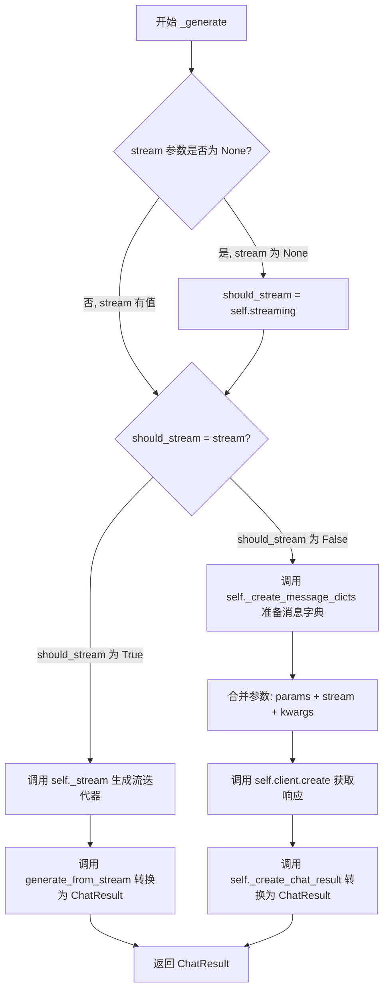

#### 带注释源码

```python
def _generate(
        self,
        messages: List[BaseMessage],
        stop: Optional[List[str]] = None,
        run_manager: Optional[CallbackManagerForLLMRun] = None,
        stream: Optional[bool] = None,
        **kwargs: Any,
) -> ChatResult:
    """根据输入消息生成聊天回复。
    
    Args:
        messages: 聊天消息列表，包含对话历史
        stop: 停止生成的字符串列表
        run_manager: 回调管理器，用于追踪生成过程
        stream: 是否使用流式输出，None 时使用实例的 streaming 属性
        **kwargs: 额外的参数，传递给底层 API
    
    Returns:
        包含生成结果的 ChatResult 对象
    """
    # 确定是否使用流式模式：如果 stream 参数有值则使用它，否则使用实例的 streaming 属性
    should_stream = stream if stream is not None else self.streaming
    
    # 如果需要流式输出
    if should_stream:
        # 调用内部流式生成方法获取流迭代器
        stream_iter = self._stream(
            messages, stop=stop, run_manager=run_manager, **kwargs
        )
        # 将流迭代器转换为 ChatResult（非流式结果）
        return generate_from_stream(stream_iter)
    
    # 非流式处理路径
    # 将消息列表转换为消息字典格式
    message_dicts, params = self._create_message_dicts(messages, stop)
    
    # 合并参数：基础参数 + 流式参数（如果有）+ 额外参数
    params = {
        **params,
        **({"stream": stream} if stream is not None else {}),
        **kwargs,
    }
    
    # 调用 OpenAI 客户端创建聊天完成
    response = self.client.create(messages=message_dicts, **params)
    
    # 将 API 响应转换为 ChatResult 对象并返回
    return self._create_chat_result(response)
```


### `ChatPlatformAI._create_message_dicts`

该方法将 LangChain 的消息对象列表转换为 API 调用的字典格式，并处理默认参数与用户输入参数的合并。

参数：

- `self`：`ChatPlatformAI`，ChatPlatformAI 实例（隐式参数）
- `messages`：`List[BaseMessage]`LangChain 消息对象列表
- `stop`：`Optional[List[str]]`，可选的停止词列表，用于控制生成何时停止

返回值：`Tuple[List[Dict[str, Any]], Dict[str, Any]]`，返回一个元组，包含转换后的消息字典列表和合并后的参数字典

#### 流程图

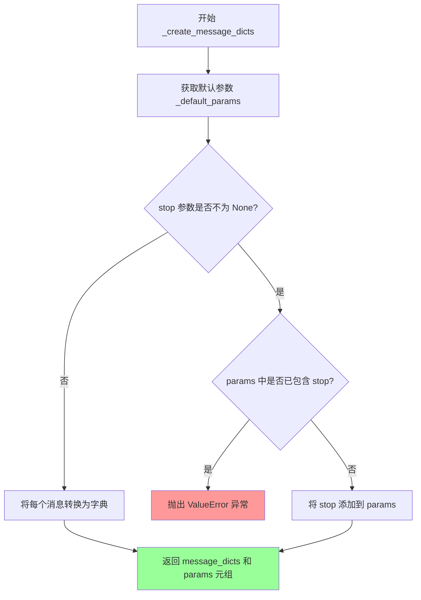

#### 带注释源码

```python
def _create_message_dicts(
        self, messages: List[BaseMessage], stop: Optional[List[str]]
) -> Tuple[List[Dict[str, Any]], Dict[str, Any]]:
    """将 LangChain 消息列表转换为 API 调用的字典格式。
    
    Args:
        messages: LangChain BaseMessage 对象列表
        stop: 可选的停止词列表
    
    Returns:
        包含消息字典列表和参数字典的元组
    
    Raises:
        ValueError: 如果 stop 参数同时出现在输入参数和默认参数中
    """
    # 获取模型的默认参数字典（包含 model、stream、temperature 等）
    params = self._default_params
    
    # 检查是否传入了 stop 参数
    if stop is not None:
        # 如果默认参数中已包含 stop，抛出错误避免冲突
        if "stop" in params:
            raise ValueError("`stop` found in both the input and default params.")
        # 将 stop 参数添加到参数字典中
        params["stop"] = stop
    
    # 将 LangChain 消息对象列表转换为字典列表
    # 使用 _convert_message_to_dict 函数进行转换
    message_dicts = [_convert_message_to_dict(m) for m in messages]
    
    # 返回转换后的消息字典和合并后的参数
    return message_dicts, params
```


### `ChatPlatformAI._create_chat_result`

该方法负责将平台API返回的原始响应转换为LangChain框架的`ChatResult`对象。它遍历API响应中的每个选择，将其转换为适当的LangChain消息对象，提取生成信息和token使用情况，并组装成标准化的输出格式供上层调用。

参数：

- `self`：`ChatPlatformAI`，ChatPlatformAI类的实例，隐式参数用于访问类属性如`model_name`
- `response`：`Union[dict, BaseModel]`，来自OpenAI API的原始响应对象，可以是字典或Pydantic BaseModel类型

返回值：`ChatResult`，包含生成结果列表和LLM输出元数据的LangChain标准结果对象

#### 流程图

```mermaid
flowchart TD
    A[开始: _create_chat_result] --> B{response是否为dict?}
    B -- 否 --> C[将response转换为dict]
    B -- 是 --> D[直接使用response]
    C --> D
    D --> E[初始化空generations列表]
    E --> F[遍历response['choices']]
    F --> G[提取message字段]
    G --> H[调用_convert_dict_to_message转换为BaseMessage]
    I[提取finish_reason和logprobs]
    H --> J[创建ChatGeneration对象]
    I --> J
    J --> K[添加到generations列表]
    K --> L{choices遍历完成?}
    L -- 否 --> F
    L -- 是 --> M[提取usage信息]
    M --> N[构建llm_output字典]
    N --> O[创建ChatResult对象]
    O --> P[返回ChatResult]
```

#### 带注释源码

```python
def _create_chat_result(self, response: Union[dict, BaseModel]) -> ChatResult:
    """将API响应转换为ChatResult对象。
    
    Args:
        response: 来自OpenAI API的响应，可以是字典或BaseModel类型
        
    Returns:
        包含生成结果和元数据的ChatResult对象
    """
    # 初始化生成结果列表
    generations = []
    
    # 如果response不是字典，则将其转换为字典
    # 这是为了统一处理不同类型的响应对象
    if not isinstance(response, dict):
        response = response.dict()
    
    # 遍历响应中的每个选择(choice)
    # 每个choice代表模型生成的一个完整回复
    for res in response["choices"]:
        # 将API消息字典转换为LangChain的BaseMessage对象
        # 支持转换user/assistant/system/function/tool等多种角色消息
        message = _convert_dict_to_message(res["message"])
        
        # 构建生成信息字典，包含finish_reason等元数据
        # finish_reason表示生成结束的原因(如stop、length等)
        generation_info = dict(finish_reason=res.get("finish_reason"))
        
        # 如果存在对数概率信息，也将其添加到生成信息中
        if "logprobs" in res:
            generation_info["logprobs"] = res["logprobs"]
        
        # 创建ChatGeneration对象，包含转换后的消息和生成信息
        gen = ChatGeneration(
            message=message,
            generation_info=generation_info,
        )
        
        # 将当前生成结果添加到列表中
        generations.append(gen)
    
    # 提取token使用情况统计信息
    # 包含prompt_tokens、completion_tokens、total_tokens等
    token_usage = response.get("usage", {})
    
    # 构建LLM输出字典，包含token使用、模型名称和系统指纹
    llm_output = {
        "token_usage": token_usage,
        "model_name": self.model_name,
        "system_fingerprint": response.get("system_fingerprint", ""),
    }
    
    # 创建并返回最终的ChatResult对象
    # 包含所有生成结果和LLM元数据输出
    return ChatResult(generations=generations, llm_output=llm_output)
```


### `ChatPlatformAI._identifying_params`

该属性方法用于获取 ChatPlatformAI 模型的识别参数，返回一个包含模型名称和默认调用参数的字典，这些参数可用于日志记录、调试或标识具体的模型调用配置。

参数：
- 无显式参数（隐式参数 `self` 为 ChatPlatformAI 实例）

返回值：`Dict[str, Any]`，返回一个字典，包含 `model_name`（模型名称）和 `_default_params`（默认参数）的合并结果，用于标识模型的调用参数。

#### 流程图

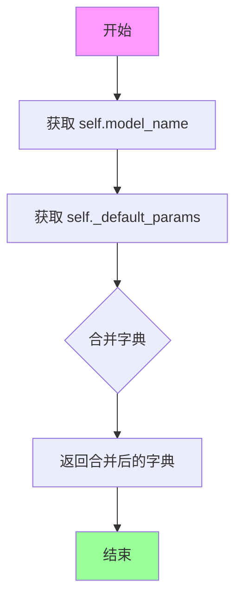

#### 带注释源码

```python
@property
def _identifying_params(self) -> Dict[str, Any]:
    """Get the identifying parameters.
    
    Returns a dictionary containing the model name and default parameters
    used for model invocation. This is useful for logging, debugging,
    and identifying specific model call configurations.
    
    Returns:
        Dict[str, Any]: A dictionary containing model identification parameters,
            including 'model_name' and all default parameters from _default_params.
    """
    # 获取当前模型的名称
    model_name = self.model_name
    
    # 获取默认调用参数（包含 temperature, streaming, max_tokens, model_kwargs 等）
    default_params = self._default_params
    
    # 合并模型名称和默认参数，返回识别参数字典
    # model_name 作为主键，default_params 作为展开的额外参数
    return {"model_name": self.model_name, **self._default_params}
```


### `ChatPlatformAI._get_invocation_params`

该方法用于收集和合并调用模型所需的参数，将模型名称、父类参数、默认参数以及额外的关键字参数合并为一个统一的字典，以供后续 API 调用使用。

参数：

- `self`：`ChatPlatformAI`，ChatPlatformAI 类实例
- `stop`：`Optional[List[str]]`，可选的停用词列表，用于控制生成内容的停止位置
- `**kwargs`：`Any`，额外的关键字参数，会合并到最终的调用参数字典中

返回值：`Dict[str, Any]`，包含所有调用参数的字典，包括模型名称、温度、最大 token 数等

#### 流程图

```mermaid
flowchart TD
    A[Start] --> B[创建字典包含 model: self.model_name]
    B --> C[调用父类 _get_invocation_params 获取基础参数]
    C --> D[合并 self._default_params 默认参数]
    D --> E[合并 **kwargs 额外参数]
    E --> F[返回合并后的完整参数字典]
```

#### 带注释源码

```python
def _get_invocation_params(
        self, stop: Optional[List[str]] = None, **kwargs: Any
) -> Dict[str, Any]:
    """Get the parameters used to invoke the model."""
    return {
        # 首先包含模型名称
        "model": self.model_name,
        # 合并父类提供的调用参数（如 temperature, max_tokens 等基础参数）
        **super()._get_invocation_params(stop=stop),
        # 合并类实例的默认参数（来自 _default_params 属性）
        **self._default_params,
        # 最后合并传入的额外关键字参数，优先级最高
        **kwargs,
    }
```


### `ChatPlatformAI._llm_type`

该属性用于返回聊天模型的类型标识符，用于标识该聊天模型是"智谱AI"（ZhipuAI）聊天模型。

参数：无（这是一个属性，不是方法）

返回值：`str`，返回聊天模型的类型标识符，固定值为 `"zhipuai-chat"`

#### 流程图

```mermaid
flowchart TD
    A[开始] --> B[返回字符串 'zhipuai-chat']
    B --> C[结束]
```

#### 带注释源码

```python
@property
def _llm_type(self) -> str:
    """Return type of chat model."""
    return "zhipuai-chat"
```


### `ChatPlatformAI.bind_functions`

该方法用于将函数（及其他可调用对象）绑定到聊天模型，使其能够调用指定的函数。它假设模型兼容 OpenAI 的函数调用 API。需要注意的是，OpenAI 已官方弃用 `functions` 和 `function_call` 参数，建议使用 `bind_tools` 方法代替。

参数：

- `self`：`ChatPlatformAI` 类的实例方法，无需显式传递
- `functions`：`Sequence[Union[Dict[str, Any], Type[BaseModel], Callable, BaseTool]]`，要绑定到聊天模型的函数定义列表，可以是字典、Pydantic 模型或可调用对象。Pydantic 模型和可调用对象会自动转换为 schema 字典表示
- `function_call`：`Optional[Union[_FunctionCall, str, Literal["auto", "none"]]]`，指定模型必须调用的函数。必须是单个提供函数的名称，或 "auto" 自动确定调用哪个函数（如果有）
- `**kwargs`：`Any`，传递给 `Runnable` 构造函数的任何其他参数

返回值：`Runnable[LanguageModelInput, BaseMessage]`，返回绑定了函数的 Runnable 对象

#### 流程图

```mermaid
flowchart TD
    A[开始 bind_functions] --> B{function_call 是否为 None?}
    B -->|否| C{function_call 是字符串且不是 'auto' 或 'none'?}
    B -->|是| F[直接传递 formatted_functions 和 kwargs]
    C -->|是| D[将 function_call 包装为 {'name': function_call}]
    C -->|否| E[保持 function_call 不变]
    D --> G{function_call 是 dict 且 functions 数量不为 1?}
    E --> G
    G -->|是| H[抛出 ValueError: 必须只提供一个函数]
    G -->|否| I{function_call 的 name 与 formatted_functions[0] 的 name 不匹配?}
    I -->|是| J[抛出 ValueError: 函数名不匹配]
    I -->|否| K[将 function_call 加入 kwargs]
    F --> L[调用父类 bind 方法]
    K --> L
    L --> M[返回 Runnable 对象]
```

#### 带注释源码

```python
def bind_functions(
        self,
        functions: Sequence[Union[Dict[str, Any], Type[BaseModel], Callable, BaseTool]],
        function_call: Optional[
            Union[_FunctionCall, str, Literal["auto", "none"]]
        ] = None,
        **kwargs: Any,
) -> Runnable[LanguageModelInput, BaseMessage]:
    """Bind functions (and other objects) to this chat model.

    Assumes model is compatible with OpenAI function-calling API.

    NOTE: Using bind_tools is recommended instead, as the `functions` and
        `function_call` request parameters are officially marked as deprecated by
        OpenAI.

    Args:
        functions: A list of function definitions to bind to this chat model.
            Can be  a dictionary, pydantic model, or callable. Pydantic
            models and callables will be automatically converted to
            their schema dictionary representation.
        function_call: Which function to require the model to call.
            Must be the name of the single provided function or
            "auto" to automatically determine which function to call
            (if any).
        **kwargs: Any additional parameters to pass to the
            :class:`~langchain.runnable.Runnable` constructor.
    """

    # 使用 convert_to_openai_function 将各种格式的函数转换为 OpenAI 函数格式
    formatted_functions = [convert_to_openai_function(fn) for fn in functions]
    
    # 如果指定了 function_call 参数，进行验证和处理
    if function_call is not None:
        # 如果 function_call 是字符串且不是 'auto' 或 'none'，则包装为字典格式
        function_call = (
            {"name": function_call}
            if isinstance(function_call, str)
               and function_call not in ("auto", "none")
            else function_call
        )
        # 验证：当指定 function_call 时，必须只提供一个函数
        if isinstance(function_call, dict) and len(formatted_functions) != 1:
            raise ValueError(
                "When specifying `function_call`, you must provide exactly one "
                "function."
            )
        # 验证：指定的函数名必须与提供的函数列表中的第一个函数名匹配
        if (
                isinstance(function_call, dict)
                and formatted_functions[0]["name"] != function_call["name"]
        ):
            raise ValueError(
                f"Function call {function_call} was specified, but the only "
                f"provided function was {formatted_functions[0]['name']}."
            )
        # 将 function_call 添加到 kwargs 中
        kwargs = {**kwargs, "function_call": function_call}
    
    # 调用父类的 bind 方法，传递格式化后的函数列表和其他参数
    return super().bind(
        functions=formatted_functions,
        **kwargs,
    )
```


### `ChatPlatformAI.bind_tools`

将工具对象绑定到聊天模型，使其能够调用指定的工具。

参数：

- `self`：隐式参数，ChatPlatformAI 实例本身
- `tools`：`Sequence[Union[Dict[str, Any], Type[BaseModel], Callable, BaseTool]]`，要绑定到聊天模型的工具定义列表，可以是字典、Pydantic 模型、可调用对象或 BaseTool
- `tool_choice`：`Optional[Union[dict, str, Literal["auto", "none"]]]`，指定模型必须调用的工具，可以是工具名称、"auto"或"none"，或者是包含工具信息的字典
- `**kwargs`：任意关键字参数，传递给 Runnable 构造函数的额外参数

返回值：`Runnable[LanguageModelInput, BaseMessage]`，绑定工具后的 Runnable 对象

#### 流程图

```mermaid
flowchart TD
    A[开始 bind_tools] --> B[将 tools 转换为 OpenAI 工具格式]
    B --> C{tool_choice 是否为 None?}
    C -->|是| F[直接调用 super().bind]
    C -->|否| D{tool_choice 是字符串且不是 'auto' 或 'none'?}
    D -->|是| E[将 tool_choice 转换为字典格式]
    D -->|否| G{tool_choice 是字典且工具数量不为 1?}
    E --> G
    G -->|是| H[抛出 ValueError]
    G -->|否| I{tool_choice 字典中的名称与格式化工具名称不匹配?}
    I -->|是| J[抛出 ValueError]
    I -->|否| K[将 tool_choice 添加到 kwargs]
    K --> F
    F --> L[返回绑定工具的 Runnable 对象]
```

#### 带注释源码

```python
def bind_tools(
        self,
        tools: Sequence[Union[Dict[str, Any], Type[BaseModel], Callable, BaseTool]],
        *,
        tool_choice: Optional[Union[dict, str, Literal["auto", "none"]]] = None,
        **kwargs: Any,
) -> Runnable[LanguageModelInput, BaseMessage]:
    """Bind tool-like objects to this chat model.

    Assumes model is compatible with OpenAI tool-calling API.

    Args:
        tools: A list of tool definitions to bind to this chat model.
            Can be  a dictionary, pydantic model, callable, or BaseTool. Pydantic
            models, callables, and BaseTools will be automatically converted to
            their schema dictionary representation.
        tool_choice: Which tool to require the model to call.
            Must be the name of the single provided function or
            "auto" to automatically determine which function to call
            (if any), or a dict of the form:
            {"type": "function", "function": {"name": <<tool_name>>}}.
        **kwargs: Any additional parameters to pass to the
            :class:`~langchain.runnable.Runnable` constructor.
    """

    # 将所有工具转换为 OpenAI 工具格式
    formatted_tools = [convert_to_openai_tool(tool) for tool in tools]
    
    # 如果指定了 tool_choice，则进行验证和转换
    if tool_choice is not None:
        # 如果 tool_choice 是字符串且不是 'auto' 或 'none'，则转换为字典格式
        if isinstance(tool_choice, str) and (tool_choice not in ("auto", "none")):
            tool_choice = {"type": "function", "function": {"name": tool_choice}}
        
        # 如果 tool_choice 是字典，则验证工具数量必须为 1
        if isinstance(tool_choice, dict) and (len(formatted_tools) != 1):
            raise ValueError(
                "When specifying `tool_choice`, you must provide exactly one "
                f"tool. Received {len(formatted_tools)} tools."
            )
        
        # 验证 tool_choice 中的工具名称与提供的工具名称匹配
        if isinstance(tool_choice, dict) and (
                formatted_tools[0]["function"]["name"]
                != tool_choice["function"]["name"]
        ):
            raise ValueError(
                f"Tool choice {tool_choice} was specified, but the only "
                f"provided tool was {formatted_tools[0]['function']['name']}."
            )
        
        # 将 tool_choice 添加到 kwargs 中
        kwargs["tool_choice"] = tool_choice
    
    # 调用父类的 bind 方法，传入格式化的工具
    return super().bind(tools=formatted_tools, **kwargs)
```

## 关键组件


### 消息转换模块

负责在 LangChain 消息对象和 API 字典格式之间进行双向转换，包含三个核心函数：`_convert_dict_to_message` 将字典转换为 BaseMessage，`_convert_message_to_dict` 将消息转换为字典，`_convert_delta_to_message_chunk` 将增量响应转换为消息块。

### ChatPlatformAI 类

继承自 BaseChatModel 的主聊天模型类，封装了与平台 AI API 的交互逻辑，支持同步/异步调用、流式输出、函数调用和工具绑定等功能。

### 平台工具消息处理

通过 `PlatformToolsMessageChunk` 和 `_paser_chunk` 实现平台特定工具消息的解析和处理，支持工具调用的流式输出和参数提取。

### 流式输出引擎

包含 `stream`、`_stream` 和 `astream` 三个方法，实现了同步和异步的流式响应处理，支持增量生成、回调管理和错误处理。

### 消息字典创建器

`_create_message_dicts` 方法负责将 LangChain 消息列表转换为 API 兼容的字典格式，并合并默认参数与用户参数。

### 聊天结果生成器

`_create_chat_result` 方法将 API 响应转换为 LangChain 的 ChatResult 对象，包含消息生成、token 使用统计和模型元数据。

### 函数与工具绑定器

`bind_functions` 和 `bind_tools` 方法实现了 OpenAI 风格函数调用和工具调用的绑定功能，支持字典、Pydantic 模型和可调用对象。

### 参数管理系统

包含 `_default_params`、`_get_invocation_params`、`_identifying_params` 和 `_combine_llm_outputs` 四个方法，负责构建和合并 API 调用参数以及汇总 token 使用情况。


## 问题及建议


### 已知问题

-   **硬编码的模型默认值**: `model_name` 默认为 "glm-4"，该默认值被硬编码在类定义中，缺乏灵活性，无法适应不同平台的默认模型
-   **函数命名拼写错误**: `_paser_chunk` 函数名中的 "paser" 应为 "parser"，存在拼写错误
-   **类型定义过于宽泛**: `http_client: Union[Any, None]` 使用 `Any` 类型过于宽松，缺乏具体的类型约束
-   **重复代码逻辑**: `stream()` 和 `astream()` 方法中存在大量重复的回调处理和消息转换逻辑，可提取为共享方法
-   **环境变量命名不一致**: 代码中使用了 "CHATCHAT_" 前缀的环境变量，但类属性和方法命名与标准 OpenAI 接口不完全对齐
-   **异常处理不完整**: 在 `_convert_delta_to_message_chunk` 中，某些分支的返回值缺少对 `name` 和 `tool_call_id` 字段的空值检查
-   **API密钥安全风险**: 虽然使用 `SecretStr` 存储 API 密钥，但在 `validate_environment` 中获取 `get_secret_value()` 后传递给客户端时可能被日志记录
-   **硬编码字符串分散**: 多个环境变量名和字符串字面量分散在代码各处，未定义为常量
-   **Pydantic 版本兼容性处理冗余**: `PYDANTIC_V2` 的条件判断和 `Config` 类配置在两个版本间切换，增加了维护成本
-   **缺失的异步流式处理**: `astream` 方法在某些情况下回退到 `ainvoke`，未实现真正的异步流式处理

### 优化建议

-   **提取常量**: 将环境变量名、默认模型名等硬编码字符串提取为模块级常量
-   **重命名函数修正拼写**: 将 `_paser_chunk` 重命名为 `_parse_chunk` 以修正拼写错误
-   **重构流式处理逻辑**: 将 `stream()` 和 `astream()` 中的公共逻辑抽取为私有辅助方法，减少代码重复
-   **增强类型注解**: 将 `http_client` 的类型定义为具体的 httpx.Client 类型而非泛型 `Any`
-   **统一版本兼容层**: 考虑使用 pydantic 的版本适配层或升级到 Pydantic v2 统一配置
-   **改进错误处理**: 在消息转换函数中增加更严格的字段验证和详细的错误信息
-   **添加日志脱敏**: 确保 API 密钥等敏感信息在日志输出时被脱敏处理
-   **考虑真正的异步实现**: 对于支持的平台，实现真正的异步流式生成而非回退到同步调用
-   **配置驱动默认值**: 允许通过环境变量配置默认模型名称，而非在代码中硬编码


## 其它


### 设计目标与约束

本模块旨在为ChatPlatformAI（智谱AI）提供LangChain兼容的Chat模型封装，支持同步/异步调用、流式输出、函数调用和工具绑定等核心功能。设计目标包括：1）完全兼容LangChain的BaseChatModel抽象；2）支持OpenAI风格的函数/工具调用接口；3）提供完整的异步和流式响应处理；4）确保与LangChain生态系统的序列化兼容性。约束条件包括：依赖OpenAI客户端进行API通信；要求API兼容OpenAI的function calling格式；必须通过环境变量或初始化参数提供API Key和Base URL。

### 错误处理与异常设计

环境验证阶段通过`validate_environment`根验证器检查API Key和Base URL配置，使用`get_from_dict_or_env`从环境变量或参数中获取配置，若缺失则抛出KeyError或ValueError。流式处理中，`stream`和`astream`方法通过try-except-except-else块捕获所有异常，调用`run_manager.on_llm_error`记录错误后重新抛出，确保错误可传播至上层调用者。消息转换函数`_convert_dict_to_message`和`_convert_message_to_dict`对未知消息类型抛出`TypeError`。参数验证中，`bind_functions`和`bind_tools`方法在函数/工具数量不匹配或名称不一致时抛出`ValueError`。建议增强：添加更多具体的异常类型定义，对API超时、网络错误和配额超限进行区分处理。

### 数据流与状态机

消息输入流程：用户通过`invoke/ainvoke`或`stream/astream`方法输入LangChain消息对象，`_convert_input`将其转换为内部消息列表，然后`_create_message_dicts`将消息转换为OpenAI格式的字典列表。生成流程（非流式）：调用`_generate`方法，通过`_create_chat_result`将API响应转换为ChatResult对象。生成流程（流式）：调用`_stream`方法，逐个处理API返回的chunk，通过`_convert_delta_to_message_chunk`将增量消息转换为对应的消息块类型。消息块类型根据role和default_class确定，包括HumanMessageChunk、AIMessageChunk、ToolMessageChunk、PlatformToolsMessageChunk等。平台工具消息使用特殊的PlatformToolsMessageChunk处理，通过`_paser_chunk`解析工具调用参数。

### 外部依赖与接口契约

核心依赖包括：1）`openai`库，用于与智谱AI API建立HTTP连接；2）`langchain-core`包，提供BaseChatModel、消息类型、回调管理等基础抽象；3）`langchain_chatchat.utils`中的PYDANTIC_V2标志，用于Pydantic版本兼容；4）`pydantic`或`pydantic_v1`，用于数据模型定义；5）`typing_extensions`，提供ClassVar支持。接口契约方面：客户端必须实现OpenAI Chat Completions API接口，支持`messages`和`**params`参数；响应格式必须遵循OpenAI的chat.completion格式，包含choices数组和usage信息；工具调用必须兼容OpenAI function calling格式。

### 配置管理

本模块通过Pydantic Field和root_validator实现配置管理，支持以下配置项：1）model_name（默认"glm-4"）指定使用的模型；2）temperature（默认0.7）控制采样随机性；3）max_tokens限制生成token数量；4）chatchat_api_key/CHATCHAT_API_KEY环境变量提供认证；5）chatchat_api_base/CHATCHAT_API_BASE环境变量指定API端点；6）chatchat_proxy/CHATCHAT_PROXY配置代理；7）request_timeout设置请求超时；8）max_retries配置重试次数；9）streaming控制是否默认流式输出；10）http_client允许自定义httpx客户端。配置优先级：显式传入参数 > 环境变量 > Pydantic默认值。

### 并发与异步处理

同步流程通过`stream`方法实现，使用Iterator生成器逐块返回消息；异步流程通过`astream`方法实现，使用AsyncIterator异步生成器处理流式响应。回调管理使用CallbackManager和AsyncCallbackManager分别处理同步和异步回调，支持在LLM开始、新token生成、结束和错误时触发钩子。执行策略使用`run_in_executor`将同步操作线程池化执行，配置通过`ensure_config`从RunnableConfig中提取。流式处理中，每个chunk都会触发on_llm_new_token回调，支持实时token级别的进度展示和中间结果处理。

### 序列化与反序列化

通过实现LangChain序列化接口支持对象持久化：`lc_secrets`属性定义敏感字段映射（chatchat_api_key映射到CHATCHAT_API_KEY）；`is_lc_serializable`方法返回True表示支持序列化；`lc_attributes`属性包含可选非敏感配置（api_base、proxy）的序列化；`get_lc_namespace`返回["langchain", "chat_models", "openai"]作为LangChain命名空间。注意：敏感信息如API Key不会直接序列化，而是通过环境变量引用机制重建。

### 工具调用机制

函数绑定通过`bind_functions`方法实现，将Python函数/字典/Pydantic模型转换为OpenAI function schema，function_call参数指定强制调用或自动选择。工具绑定通过`bind_tools`方法实现，支持更现代的OpenAI tool calling API，tool_choice参数指定工具选择。平台工具特殊处理：使用PlatformToolsMessageChunk和_paser_chunk解析工具调用chunk，当content为空时提取tool_call_chunks中的参数，递归解析JSON格式的input字段，支持工具调用中间结果的流式输出。

### 版本兼容性设计

通过PydANTIC_V2标志实现Pydantic v1/v2兼容性：PYDANTIC_V2为True时使用ConfigDict配置，否则使用内部Config类。Field的alias参数支持按名称或别名填充字段。root_validator支持pre=True的预验证模式。类型转换使用cast和isinstance进行安全类型检查，Union类型处理Optional和Any的组合。使用TYPE_CHECKING条件导入避免运行时循环依赖。

    