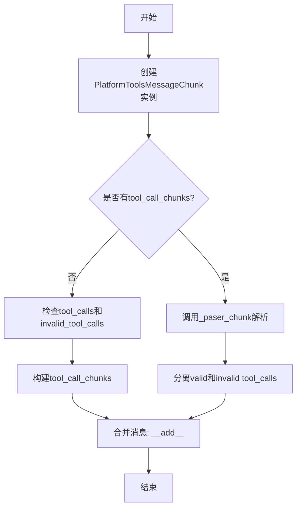
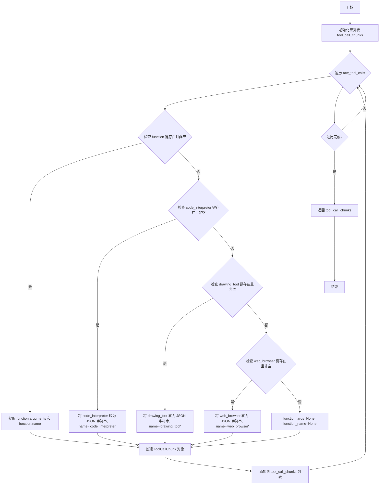
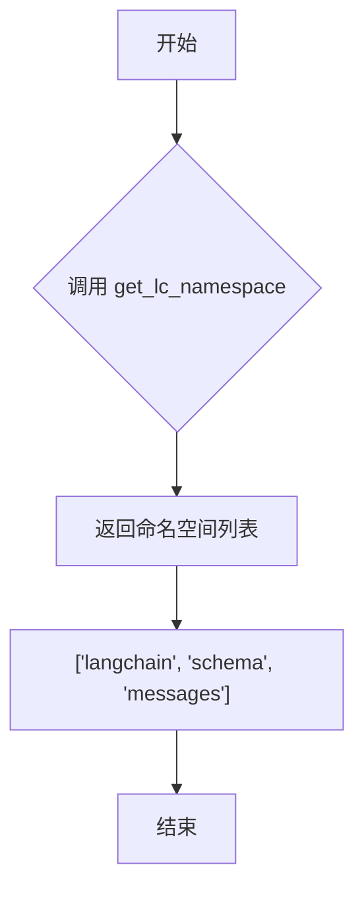

# `Langchain-Chatchat\libs\chatchat-server\langchain_chatchat\chat_models\platform_tools_message.py` 详细设计文档

该代码定义了一个自定义的LangChain消息类PlatformToolsMessageChunk，用于处理平台工具调用的消息块，支持code_interpreter、drawing_tool、web_browser等工具类型的解析、合并和向后兼容性处理。

## 整体流程



## 类结构

```
BaseMessageChunk (langchain-core)
└── AIMessage (langchain-core)
    └── PlatformToolsMessageChunk (自定义)
```

## 全局变量及字段


### `default_platform_tool_chunk_parser`
    
用于最佳效果解析所有工具块的函数，支持function、code_interpreter、drawing_tool和web_browser类型

类型：`function(raw_tool_calls: List[dict]) -> List[ToolCallChunk]`
    


### `_paser_chunk`
    
内部函数，用于解析工具调用块，根据name类型（code_interpreter、drawing_tool、web_browser或其他）进行不同处理

类型：`function(tool_call_chunks) -> Tuple[List[ToolCall], List[InvalidToolCall]]`
    


### `PlatformToolsMessageChunk.type`
    
消息类型标识符，用于区分消息块类型，值为PlatformToolsMessageChunk

类型：`Literal['PlatformToolsMessageChunk']`
    


### `PlatformToolsMessageChunk.tool_call_chunks`
    
与消息关联的工具调用块列表，存储从AI响应中解析出的工具调用信息

类型：`List[ToolCallChunk]`
    
    

## 全局函数及方法


### `default_platform_tool_chunk_parser`

该函数是一个尽力而为（best-effort）的工具调用块解析器，用于将平台返回的原始工具调用字典列表解析为结构化的`ToolCallChunk`对象列表，支持多种工具类型（function、code_interpreter、drawing_tool、web_browser）的参数提取和标准化。

参数：

- `raw_tool_calls`：`List[dict]`，原始工具调用字典列表，每个字典可能包含"function"、"code_interpreter"、"drawing_tool"或"web_browser"等键

返回值：`List[ToolCallChunk]`，解析后的工具调用块列表

#### 流程图



#### 带注释源码

```python
def default_platform_tool_chunk_parser(raw_tool_calls: List[dict]) -> List[ToolCallChunk]:
    """Best-effort parsing of all tool chunks."""
    # 初始化用于存储解析后工具调用块的空列表
    tool_call_chunks = []
    
    # 遍历每个原始工具调用字典
    for tool_call in raw_tool_calls:
        # 情况1: 检查是否存在标准 function 类型的工具调用
        if "function" in tool_call and tool_call["function"] is not None:
            # 提取函数参数和函数名称
            function_args = tool_call["function"]["arguments"]
            function_name = tool_call["function"]["name"]
            
        # 情况2: 检查是否存在 code_interpreter 类型的工具调用
        elif (
            "code_interpreter" in tool_call
            and tool_call["code_interpreter"] is not None
        ):
            # 将 code_interpreter 对象序列化为 JSON 字符串
            function_args = json.dumps(
                tool_call["code_interpreter"], ensure_ascii=False
            )
            function_name = "code_interpreter"
            
        # 情况3: 检查是否存在 drawing_tool 类型的工具调用
        elif "drawing_tool" in tool_call and tool_call["drawing_tool"] is not None:
            # 将 drawing_tool 对象序列化为 JSON 字符串
            function_args = json.dumps(tool_call["drawing_tool"], ensure_ascii=False)
            function_name = "drawing_tool"
            
        # 情况4: 检查是否存在 web_browser 类型的工具调用
        elif "web_browser" in tool_call and tool_call["web_browser"] is not None:
            # 将 web_browser 对象序列化为 JSON 字符串
            function_args = json.dumps(tool_call["web_browser"], ensure_ascii=False)
            function_name = "web_browser"
            
        # 情况5: 无法识别的工具调用类型
        else:
            function_args = None
            function_name = None
            
        # 创建 ToolCallChunk 对象，包含名称、参数、ID 和索引
        parsed = ToolCallChunk(
            name=function_name,
            args=function_args,
            id=tool_call.get("id"),
            index=tool_call.get("index"),
        )
        # 将解析后的对象添加到结果列表
        tool_call_chunks.append(parsed)
        
    # 返回解析后的工具调用块列表
    return tool_call_chunks
```


### `_paser_chunk`

该函数用于解析工具调用块（tool_call_chunks），将它们分类为有效的工具调用（ToolCall）和无效的工具调用（InvalidToolCall），根据工具名称（code_interpreter、drawing_tool、web_browser等）和参数内容进行过滤和转换。

参数：

- `tool_call_chunks`：列表（List），待解析的工具调用块列表，每个元素包含name、args、id等字段

返回值：`Tuple[List[ToolCall], List[InvalidToolCall]]`，返回两个列表的元组，第一个是有效的工具调用列表，第二个是无效的工具调用列表

#### 流程图

```mermaid
flowchart TD
    A[开始 _paser_chunk] --> B[初始化空列表 tool_calls 和 invalid_tool_calls]
    B --> C{遍历 tool_call_chunks}
    C -->|还有chunk| D{检查 chunk['name']}
    D -->|包含 code_interpreter| E[解析JSON参数 args_]
    D -->|包含 drawing_tool| F[解析JSON参数 args_]
    D -->|包含 web_browser| G[解析JSON参数 args_]
    D -->|其他| H[解析JSON参数 args_]
    
    E --> I{args_ 是 dict 且有 'outputs'?}
    F --> I
    G --> I
    
    I -->|是| J[创建 ToolCall 添加到 tool_calls]
    I -->|否| K[创建 InvalidToolCall 添加到 invalid_tool_calls]
    
    H --> L{args_ 是 dict?}
    L -->|是| M[清理参数键的空格，创建 ToolCall]
    L -->|否| N[抛出 ValueError]
    
    J --> O[继续下一个chunk]
    K --> O
    M --> O
    N --> P[捕获异常]
    P --> Q[创建 InvalidToolCall 添加到 invalid_tool_calls]
    Q --> O
    
    O --> C
    C -->|遍历完成| R[返回 (tool_calls, invalid_tool_calls)]
    
    style J fill:#90EE90
    style K fill:#FFB6C1
    style M fill:#90EE90
    style Q fill:#FFB6C1
```

#### 带注释源码

```python
def _paser_chunk(tool_call_chunks):
    """
    解析工具调用块列表，将有效的工具调用和无效的工具调用分离。
    
    参数:
        tool_call_chunks: 包含工具调用块信息的列表，每个块包含name、args、id等字段
    
    返回:
        Tuple[List[ToolCall], List[InvalidToolCall]]: 
            有效的工具调用列表和无效的工具调用列表的元组
    """
    # 初始化结果列表
    tool_calls = []          # 有效的工具调用列表
    invalid_tool_calls = []  # 无效的工具调用列表
    
    # 遍历每个工具调用块
    for chunk in tool_call_chunks:
        try:
            # 检查是否为 code_interpreter 工具
            if "code_interpreter" in chunk["name"]:
                # 解析JSON格式的参数
                args_ = parse_partial_json(chunk["args"])

                # 验证参数是否为字典类型
                if not isinstance(args_, dict):
                    raise ValueError("Malformed args.")

                # 检查是否有 outputs 字段
                if "outputs" in args_:
                    # 创建有效的 ToolCall
                    tool_calls.append(
                        ToolCall(
                            name=chunk["name"] or "",
                            args=args_,
                            id=chunk["id"],
                        )
                    )
                else:
                    # 没有 outputs，视为无效调用
                    invalid_tool_calls.append(
                        InvalidToolCall(
                            name=chunk["name"],
                            args=chunk["args"],
                            id=chunk["id"],
                            error=None,
                        )
                    )
            # 检查是否为 drawing_tool 工具
            elif "drawing_tool" in chunk["name"]:
                args_ = parse_partial_json(chunk["args"])

                if not isinstance(args_, dict):
                    raise ValueError("Malformed args.")

                if "outputs" in args_:
                    tool_calls.append(
                        ToolCall(
                            name=chunk["name"] or "",
                            args=args_,
                            id=chunk["id"],
                        )
                    )
                else:
                    invalid_tool_calls.append(
                        InvalidToolCall(
                            name=chunk["name"],
                            args=chunk["args"],
                            id=chunk["id"],
                            error=None,
                        )
                    )
            # 检查是否为 web_browser 工具
            elif "web_browser" in chunk["name"]:
                args_ = parse_partial_json(chunk["args"])

                if not isinstance(args_, dict):
                    raise ValueError("Malformed args.")

                if "outputs" in args_:
                    tool_calls.append(
                        ToolCall(
                            name=chunk["name"] or "",
                            args=args_,
                            id=chunk["id"],
                        )
                    )
                else:
                    invalid_tool_calls.append(
                        InvalidToolCall(
                            name=chunk["name"],
                            args=chunk["args"],
                            id=chunk["id"],
                            error=None,
                        )
                    )
            # 处理其他类型的工具调用
            else:
                args_ = parse_partial_json(chunk["args"])

                # 必须是字典类型
                if isinstance(args_, dict):
                    # 清理参数键的空格
                    temp_args_ = {}
                    for key, value in args_.items():
                        key = key.strip()  # 去除键名两端的空格
                        temp_args_[key] = value

                    # 创建有效的 ToolCall
                    tool_calls.append(
                        ToolCall(
                            name=chunk["name"] or "",
                            args=temp_args_,
                            id=chunk["id"],
                        )
                    )
                else:
                    raise ValueError("Malformed args.")
        # 捕获所有异常，将当前chunk标记为无效
        except Exception:
            invalid_tool_calls.append(
                InvalidToolCall(
                    name=chunk["name"],
                    args=chunk["args"],
                    id=chunk["id"],
                    error=None,
                )
            )
    
    # 返回有效和无效的工具调用列表
    return tool_calls, invalid_tool_calls
```


### `PlatformToolsMessageChunk.get_lc_namespace`

获取 langchain 对象的命名空间，用于序列化和其他 langchain 内部操作。

参数：

- `cls`：`<class method>`，类方法的隐式参数，指向当前类 `PlatformToolsMessageChunk`

返回值：`List[str]`，返回 langchain 对象的命名空间列表，包含 "langchain"、"schema"、"messages" 三个元素

#### 流程图



#### 带注释源码

```python
@classmethod
def get_lc_namespace(cls) -> List[str]:
    """Get the namespace of the langchain object."""
    # 返回 langchain 对象的命名空间
    # 用于标识该类在 langchain 类型系统中的位置
    return ["langchain", "schema", "messages"]
```


### `PlatformToolsMessageChunk.lc_attributes`

该属性是 `PlatformToolsMessageChunk` 类的一个序列化钩子，用于在消息序列化时返回需要保留的工具调用信息。它返回一个字典，包含 `tool_calls` 和 `invalid_tool_calls`，确保这些动态计算的属性能够被正确序列化。

参数：
- （无显式参数，隐式接收 `self` 实例）

返回值：`Dict`，返回一个字典，包含 `tool_calls` 和 `invalid_tool_calls` 两个键，用于序列化时保留工具调用数据。

#### 流程图

```mermaid
flowchart TD
    A[开始: 访问 lc_attributes 属性] --> B{实例化}
    B -->|self 有效| C[读取 self.tool_calls]
    B -->|self 有效| D[读取 self.invalid_tool_calls]
    C --> E[构建字典: {tool_calls: ..., invalid_tool_calls: ...}]
    D --> E
    E --> F[返回字典]
    F --> G[结束]
    
    style A fill:#f9f,color:#333
    style F fill:#9f9,color:#333
    style G fill:#9f9,color:#333
```

#### 带注释源码

```python
@property
def lc_attributes(self) -> Dict:
    """Attrs to be serialized even if they are derived from other init args."""
    # 返回一个字典，包含需要序列化的工具调用信息
    # 即使这些属性是从其他初始化参数派生出来的，也需要被序列化
    return {
        "tool_calls": self.tool_calls,          # 有效的工具调用列表
        "invalid_tool_calls": self.invalid_tool_calls,  # 无效的工具调用列表
    }
```


### `PlatformToolsMessageChunk._backwards_compat_tool_calls`

该方法是一个 `root_validator` 装饰器，用于实现向后兼容性，将存储在 `additional_kwargs.tool_calls` 中的原始工具调用解析为结构化的 `tool_call_chunks`（对于块消息）或 `tool_calls`/`invalid_tool_calls`（对于完整消息），确保旧版消息格式与新版 LangChain 消息结构兼容。

参数：

- `cls`：类型 `type`，类本身（classmethod 的第一个隐式参数）
- `values`：`Dict`，包含待验证和处理的字段值的字典，从 `additional_kwargs`、`tool_calls`、`invalid_tool_calls` 或 `tool_call_chunks` 中提取工具调用信息

返回值：`Dict`，处理后的值字典，可能包含新解析的 `tool_call_chunks`、`tool_calls` 或 `invalid_tool_calls`

#### 流程图

```mermaid
flowchart TD
    A[开始 _backwards_compat_tool_calls] --> B[从 additional_kwargs 获取 raw_tool_calls]
    B --> C[获取现有的 tool_calls / invalid_tool_calls / tool_call_chunks]
    C --> D{raw_tool_calls 存在且无现有工具调用?}
    D -->|否| L[直接返回 values]
    D -->|是| E{尝试解析}
    E --> F{cls 是否为 BaseMessageChunk 子类?}
    F -->|是| G[使用 default_platform_tool_chunk_parser 解析]
    G --> H[将解析结果存入 values['tool_call_chunks']]
    F -->|否| I[使用 default_tool_parser 解析]
    I --> J[分别存入 values['tool_calls'] 和 values['invalid_tool_calls']]
    H --> K[异常捕获: pass]
    J --> K
    K --> L
```

#### 带注释源码

```python
@root_validator(allow_reuse=True)
def _backwards_compat_tool_calls(cls, values: dict) -> dict:
    """向后兼容处理：将 additional_kwargs 中的原始 tool_calls 解析为结构化格式。
    
    该方法作为 root_validator 被调用，在 Pydantic 模型实例化时执行。
    目的：支持旧版本将工具调用存储在 additional_kwargs 中的消息格式。
    """
    # 从 additional_kwargs 中提取原始工具调用列表（字典格式）
    raw_tool_calls = values.get("additional_kwargs", {}).get("tool_calls")
    
    # 获取已解析的工具调用（可能是空值）
    tool_calls = (
        values.get("tool_calls")
        or values.get("invalid_tool_calls")
        or values.get("tool_call_chunks")
    )
    
    # 仅当存在原始工具调用且没有已解析的工具调用时才执行解析
    if raw_tool_calls and not tool_calls:
        try:
            # 检查当前类是否是 BaseMessageChunk 的子类（即是否为消息块类型）
            if issubclass(cls, BaseMessageChunk):  # type: ignore
                # 对于消息块：使用平台特定的解析器解析原始工具调用
                values["tool_call_chunks"] = default_platform_tool_chunk_parser(
                    raw_tool_calls
                )
            else:
                # 对于完整消息：使用默认工具解析器分离有效和无效的工具调用
                tool_calls, invalid_tool_calls = default_tool_parser(raw_tool_calls)
                values["tool_calls"] = tool_calls
                values["invalid_tool_calls"] = invalid_tool_calls
        except Exception as e:
            # 静默吞掉所有异常，解析失败时保持原状
            pass
    
    # 返回处理后的值字典
    return values
```


### `PlatformToolsMessageChunk.init_tool_calls`

该方法是 `PlatformToolsMessageChunk` 类的根验证器（root validator），用于在模型实例化时初始化和同步 `tool_call_chunks`、`tool_calls` 和 `invalid_tool_calls` 三个属性，确保它们之间的数据一致性。当 `tool_call_chunks` 为空时，从 `tool_calls` 和 `invalid_tool_calls` 反向构建；当存在 `tool_call_chunks` 时，则正向解析为 `tool_calls` 和 `invalid_tool_calls`。

参数：

- `cls`：类型 `Type[PlatformToolsMessageChunk]`，类本身，用于类方法调用
- `values`：类型 `dict`，包含当前验证阶段所有字段值的字典

返回值：`dict`，返回处理后的 values 字典，包含更新后的 `tool_call_chunks`、`tool_calls` 和 `invalid_tool_calls` 字段

#### 流程图

```mermaid
flowchart TD
    A[开始: init_tool_calls] --> B{tool_call_chunks 是否为空?}
    B -->|是| C{tool_calls 是否存在?}
    C -->|是| D[遍历 tool_calls]
    D --> E[为每个 tc 创建 ToolCall 对象]
    E --> F[存入 tool_call_chunks]
    C -->|否| G{invalid_tool_calls 是否存在?}
    G -->|是| H[遍历 invalid_tool_calls]
    H --> I[为每个 tc 创建 InvalidToolCall 对象]
    I --> J[追加到 tool_call_chunks]
    J --> K[返回 values]
    G -->|否| K
    B -->|否| L[调用 _paser_chunk 解析 tool_call_chunks]
    L --> M[返回 tool_calls 和 invalid_tool_calls]
    M --> N[更新 values['tool_calls']]
    N --> O[更新 values['invalid_tool_calls']]
    O --> K
```

#### 带注释源码

```python
@root_validator(allow_reuse=True)
def init_tool_calls(cls, values: dict) -> dict:
    """
    根验证器方法，用于初始化并同步工具调用相关的三个属性。
    
    该方法在 Pydantic 模型实例化时自动调用，确保:
    1. 当 tool_call_chunks 为空时，从 tool_calls 和 invalid_tool_calls 构建
    2. 当存在 tool_call_chunks 时，解析为 tool_calls 和 invalid_tool_calls
    
    参数:
        cls: 类本身，PlatformToolsMessageChunk 的类引用
        values: dict，模型初始化时的所有字段值字典，包含:
            - tool_call_chunks: List[ToolCallChunk] 类型的工具调用块列表
            - tool_calls: List[dict] 类型的有效工具调用列表
            - invalid_tool_calls: List[dict] 类型的无效工具调用列表
    
    返回:
        dict: 更新后的 values 字典，确保三个属性同步一致
    """
    
    # 检查 tool_call_chunks 是否为空
    if not values["tool_call_chunks"]:
        # 如果 tool_call_chunks 为空，尝试从 tool_calls 构建
        if values["tool_calls"]:
            # 遍历每个工具调用字典，转换为 ToolCall 对象
            values["tool_call_chunks"] = [
                ToolCall(
                    name=tc["name"] or "",  # 工具名称，空字符串兜底
                    args=json.dumps(tc["args"]) or {},  # 将 args 字典序列化为 JSON 字符串
                    id=tc.get("id")  # 工具调用 ID，可选
                )
                for tc in values["tool_calls"]
            ]
        
        # 如果存在无效工具调用，也添加到 tool_call_chunks 中
        if values["invalid_tool_calls"]:
            # 获取已存在的 tool_call_chunks（可能从上面构建）
            tool_call_chunks = values.get("tool_call_chunks", [])
            # 扩展无效工具调用列表
            tool_call_chunks.extend(
                [
                    InvalidToolCall(
                        name=tc["name"],  # 工具名称
                        args=tc["args"],  # 参数字段（可能是原始字符串）
                        id=tc.get("id"),  # 工具调用 ID
                        error=None  # 错误信息，初始化为 None
                    )
                    for tc in values["invalid_tool_calls"]
                ]
            )
            # 更新 tool_call_chunks
            values["tool_call_chunks"] = tool_call_chunks
        
        # 返回已处理的 values（此时 tool_calls 和 invalid_tool_calls 未更新）
        return values

    # 如果 tool_call_chunks 不为空，解析它以生成 tool_calls 和 invalid_tool_calls
    # 调用内部函数 _paser_chunk 进行解析
    tool_calls, invalid_tool_calls = _paser_chunk(values["tool_call_chunks"])
    
    # 将解析结果更新到 values 字典
    values["tool_calls"] = tool_calls
    values["invalid_tool_calls"] = invalid_tool_calls
    
    # 返回完整的 values
    return values
```


### `PlatformToolsMessageChunk.__add__`

该方法实现了 `PlatformToolsMessageChunk` 类的加法运算（`+` 操作符），用于将两个消息块拼接成一个。它首先检查两个消息块是否具有相同的 `example` 属性，然后合并内容、附加参数、响应元数据和工具调用块，最后返回一个新的 `PlatformToolsMessageChunk` 实例。如果另一个操作数不是 `PlatformToolsMessageChunk`，则调用父类的 `__add__` 方法处理。

参数：

- `self`：隐式参数，表示当前 `PlatformToolsMessageChunk` 实例
- `other`：`Any`，要与之拼接的另一个消息块，可以是 `PlatformToolsMessageChunk` 或其他 `BaseMessageChunk` 子类

返回值：`BaseMessageChunk`，拼接后的消息块实例（当 `other` 是 `PlatformToolsMessageChunk` 时返回 `PlatformToolsMessageChunk` 实例，否则返回父类处理的结果）

#### 流程图

```mermaid
flowchart TD
    A[开始 __add__] --> B{other 是否为 PlatformToolsMessageChunk?}
    B -->|是| C{self.example == other.example?}
    B -->|否| D[调用 super().__add__(other)]
    D --> E[返回结果]
    C -->|否| F[抛出 ValueError]
    C -->|是| G[合并 content]
    G --> H[合并 additional_kwargs]
    H --> I[合并 response_metadata]
    I --> J{存在 tool_call_chunks?}
    J -->|是| K[使用 merge_lists 合并 tool_call_chunks]
    J -->|否| L[tool_call_chunks 设为空列表]
    K --> M[构建新的 ToolCallChunk 列表]
    M --> N[创建新的 PlatformToolsMessageChunk]
    L --> N
    N --> O[返回新实例]
    F --> O
```

#### 带注释源码

```python
def __add__(self, other: Any) -> BaseMessageChunk:  # type: ignore
    """
    重载加法操作符，用于拼接两个消息块。
    
    参数:
        other: 要拼接的另一个消息块
        
    返回:
        拼接后的消息块
    """
    # 检查 other 是否为 PlatformToolsMessageChunk 实例
    if isinstance(other, PlatformToolsMessageChunk):
        # 验证两个消息块的 example 属性是否一致
        if self.example != other.example:
            raise ValueError(
                "Cannot concatenate PlatformToolsMessageChunks with different example values."
            )

        # 合并消息内容，使用 langchain_core 提供的 merge_content 函数
        content = merge_content(self.content, other.content)
        
        # 合并附加参数字典
        additional_kwargs = merge_dicts(
            self.additional_kwargs, other.additional_kwargs
        )
        
        # 合并响应元数据字典
        response_metadata = merge_dicts(
            self.response_metadata, other.response_metadata
        )

        # 处理工具调用块的合并
        if self.tool_call_chunks or other.tool_call_chunks:
            # 合并工具调用块列表
            raw_tool_calls = merge_lists(
                self.tool_call_chunks,
                other.tool_call_chunks,
            )
            if raw_tool_calls:
                # 将合并后的原始数据转换为 ToolCallChunk 对象列表
                tool_call_chunks = [
                    ToolCallChunk(
                        name=rtc.get("name"),
                        args=rtc.get("args"),
                        index=rtc.get("index"),
                        id=rtc.get("id"),
                    )
                    for rtc in raw_tool_calls
                ]
            else:
                tool_call_chunks = []
        else:
            tool_call_chunks = []

        # 创建并返回新的 PlatformToolsMessageChunk 实例
        return self.__class__(
            example=self.example,
            content=content,
            additional_kwargs=additional_kwargs,
            tool_call_chunks=tool_call_chunks,
            response_metadata=response_metadata,
            id=self.id,
        )

    # 如果 other 不是 PlatformToolsMessageChunk，交给父类处理
    return super().__add__(other)
```

## 关键组件


### default_platform_tool_chunk_parser 函数

用于解析原始工具调用块的默认解析器函数，支持function、code_interpreter、drawing_tool、web_browser等多种工具类型，将原始字典转换为ToolCallChunk对象列表。

### PlatformToolsMessageChunk 类

继承自AIMessage和BaseMessageChunk的消息块类，用于表示包含平台工具调用的AI消息，支持工具调用块的序列化、反序列化、合并以及向后兼容性处理。

### _paser_chunk 函数

内部工具调用块解析函数，解析ToolCallChunk列表，根据工具类型（code_interpreter、drawing_tool、web_browser或其他）处理参数，检查outputs字段判断有效性，区分并返回有效的tool_calls和无效的invalid_tool_calls。

### tool_call_chunks 属性

存储原始工具调用块的列表属性，用于在消息块序列化时保留完整的工具调用信息。

### tool_calls 与 invalid_tool_calls 属性

分别存储有效工具调用和无效工具调用的列表，通过_paser_chunk函数从tool_call_chunks解析生成。

### _backwards_compat_tool_calls 根验证器

处理向后兼容性的根验证器方法，将additional_kwargs中的raw_tool_calls转换为tool_call_chunks或tool_calls/invalid_tool_calls，确保旧版本数据格式的兼容性。

### init_tool_calls 根验证器

初始化工具调用的根验证器方法，将tool_calls和invalid_tool_calls转换为tool_call_chunks格式，或从现有tool_call_chunks解析出tool_calls和invalid_tool_calls。

### __add__ 方法

重载加法运算符的方法，用于合并两个PlatformToolsMessageChunk对象，包括内容、附加参数、响应元数据和工具调用块的深度合并。

### BaseMessageChunk 集成

继承自langchain_core.messages.base.BaseMessageChunk的基类集成，提供消息块的基类功能和lc_attributes序列化支持。


## 问题及建议


### 已知问题

-   **函数名拼写错误**：`_paser_chunk` 应该是 `_parser_chunk`，这是一个明显的拼写错误，会影响代码可读性和可维护性。
-   **异常被静默吞掉**：在 `_backwards_compat_tool_calls` 方法中，捕获异常后直接使用 `pass`，导致解析失败时没有任何错误日志或提示，难以调试。
-   **代码重复**：`_paser_chunk` 函数中处理 "code_interpreter"、"drawing_tool"、"web_browser" 的逻辑几乎完全相同，仅工具名称不同，造成大量代码冗余。
-   **硬编码的工具名称**：工具名称 ("code_interpreter"、"drawing_tool"、"web_browser") 在多处硬编码，如果要新增工具需要修改多处代码，违反开闭原则。
-   **字符串匹配工具名称**：使用 `"code_interpreter" in chunk["name"]` 进行字符串匹配比较脆弱，工具名称格式变化可能导致匹配失败。
-   **潜在 KeyError 风险**：在 `init_tool_calls` 方法中直接访问 `values["tool_call_chunks"]`，如果该键不存在会抛出 KeyError，虽然有前面的判断但逻辑不够健壮。
-   **不一致的参数解析**：在 `default_platform_tool_chunk_parser` 中处理不同工具时，code_interpreter/drawing_tool/web_browser 使用 `json.dumps` 序列化，而 function 类型直接取 arguments，可能导致行为不一致。

### 优化建议

-   **修复函数名拼写**：将 `_paser_chunk` 重命名为 `_parser_chunk`。
-   **改进异常处理**：在 `_backwards_compat_tool_calls` 的异常处理中添加日志记录或使用警告，而不是静默忽略。
-   **消除代码重复**：将 `_paser_chunk` 中重复的工具处理逻辑抽取为独立的辅助方法或使用配置驱动的方式。
-   **提取工具名称常量**：定义工具名称常量或枚举类，统一管理工具名称。
-   **使用字典或配置驱动**：将工具名称和处理逻辑映射到字典中，通过配置扩展新工具。
-   **增加输入验证**：在处理 chunk 前验证其结构，确保必要的键存在，使用默认值或抛出明确的错误信息。
-   **统一参数序列化逻辑**：确保所有工具的参数解析行为一致，考虑使用统一的 JSON 解析方式。

## 其它


### 设计目标与约束

本模块旨在提供一种标准化的消息格式，用于在 LangChain 框架中处理平台特定的工具调用（Tool Calls），支持 code_interpreter、drawing_tool、web_browser 等工具的消息表示和合并操作。设计约束包括：必须继承自 AIMessage 和 BaseMessageChunk 以保持与 LangChain 消息系统的兼容性；tool_call_chunks、tool_calls、invalid_tool_calls 三个字段必须保持同步；需要支持消息块的合并操作（__add__ 方法）。

### 错误处理与异常设计

代码中异常处理主要包括两部分：1) _backwards_compat_tool_calls 根验证器中使用 try-except 捕获解析异常并静默忽略（pass）；2) _paser_chunk 函数中使用 try-except 捕获解析失败并将相关工具调用标记为 invalid_tool_calls。异常处理策略采用"宽容失败"原则，将无法解析的工具调用降级为 invalid_tool_calls 而不是抛出异常中断流程。但当前实现存在捕获所有异常的宽泛问题，可能隐藏潜在的真实错误。

### 数据流与状态机

消息块的数据流分为三个层次：tool_call_chunks（原始块数据）→ tool_calls（有效工具调用）→ 执行工具。初始化时通过 init_tool_calls 验证器将 tool_call_chunks 解析为 tool_calls 和 invalid_tool_calls 两个列表。合并操作（__add__）时需要同步合并 tool_call_chunks 列表。状态转换：空 tool_call_chunks → 解析 → tool_calls/invalid_tool_calls；合并时 → 重新解析合并后的 chunks。

### 外部依赖与接口契约

主要依赖包括：langchain_core.messages.AIMessage（基类）、langchain_core.messages.base.BaseMessageChunk（消息块基类）、langchain_core.messages.tool（ToolCall、ToolCallChunk、InvalidToolCall）、langchain_core.pydantic_v1.root_validator（Pydantic 验证器）、langchain_core.utils.json.parse_partial_json（JSON 解析）。外部接口包括：default_platform_tool_chunk_parser 函数（解析原始工具调用字典）、PlatformToolsMessageChunk 类实例化接口、__add__ 方法（消息合并接口）。

### 序列化与反序列化设计

类通过 lc_attributes 属性指定了 tool_calls 和 invalid_tool_calls 为必须序列化的属性。序列化时 tool_calls 和 invalid_tool_calls 会被包含，反序列化时通过 _backwards_compat_tool_calls 验证器从 additional_kwargs.tool_calls 恢复 tool_call_chunks。设计支持部分序列化场景下的数据恢复。

### 线程安全考虑

当前代码未显式处理线程安全。PlatformToolsMessageChunk 作为不可变数据对象（消息），在多线程场景下读操作是安全的。写操作（通过 __add__ 创建新实例）由于创建新对象也不会产生竞态条件。但需注意在并发环境下对共享的原始工具调用字典进行解析时可能存在的潜在问题。

### 性能考虑

_paser_chunk 函数中对每个 chunk 都调用 parse_partial_json，可能存在重复解析开销。当前实现对 code_interpreter、drawing_tool、web_browser 三种工具类型有重复的解析逻辑（parse_partial_json + 类型检查），可以通过策略模式重构减少代码重复。此外，__add__ 方法中每次合并都创建新的 ToolCallChunk 列表，存在一定的内存分配开销。

### 兼容性考虑

代码通过 _backwards_compat_tool_calls 验证器实现了向后兼容，支持从旧版本的 additional_kwargs.tool_calls 格式转换为新格式。root_validator 的 allow_reuse=True 参数允许在子类中复用验证器逻辑。类型标注使用了 typing.Literal 确保了 Python 3.8+ 的兼容性要求。

### 使用示例

```python
from langchain_core.messages import AIMessage
from PlatformToolsMessageChunk import PlatformToolsMessageChunk, default_platform_tool_chunk_parser

# 创建包含工具调用的消息块
msg = PlatformToolsMessageChunk(
    content="我将执行代码",
    tool_call_chunks=[
        ToolCallChunk(name="code_interpreter", args='{"code": "print(1)"}', id="call_1")
    ]
)

# 合并消息块
msg1 = PlatformToolsMessageChunk(content="Hello", tool_call_chunks=[...])
msg2 = PlatformToolsMessageChunk(content="World", tool_call_chunks=[...])
merged = msg1 + msg2
```

### 安全考虑

代码中使用 json.dumps 和 parse_partial_json 处理外部输入的工具调用参数，需要注意：1) parse_partial_json 可能解析恶意构造的 JSON 输入；2) tool_call_chunks 中的 args 字段直接来自用户输入或模型输出，未进行严格的模式验证；3) 建议在生产环境中对工具调用参数进行 schema 验证，防止注入攻击。当前实现将解析失败的工具调用归类为 invalid_tool_calls 是合理的安全实践。

    