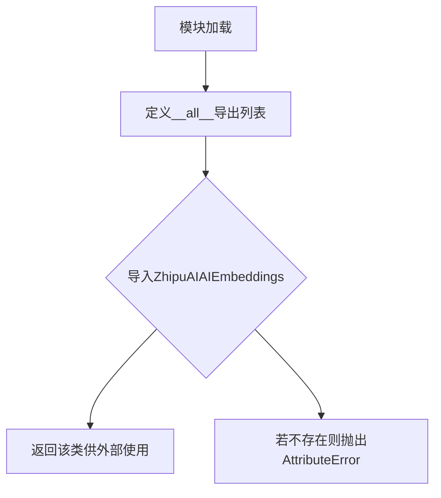

# `Langchain-Chatchat\libs\chatchat-server\langchain_chatchat\embeddings\__init__.py` 详细设计文档

该代码是一个Python模块的文件头部声明，定义了模块的编码格式和公共接口导出列表__all__，其中仅包含ZhipuAIAIEmbeddings一个类名，表明该模块主要用于提供智谱AI的文本嵌入功能。由于代码片段不完整，缺少实际类实现，无法进行更深层次的分析。

## 整体流程



## 类结构

```
ZhipuAIAIEmbeddings (仅在__all__中声明，类定义未在当前代码片段中提供)
```

## 全局变量及字段


### `__all__`
    
定义模块的公开接口，指定当使用 from module import * 时可导入的成员

类型：`list[str]`
    


    

## 全局函数及方法


## 关键组件


### ZhipuAIAIEmbeddings

智谱AI嵌入模型封装类，用于将文本转换为向量表示。该类遵循LangChain的Embeddings接口规范，提供统一的文本嵌入功能。

由于提供的源代码仅包含`__all__`声明，未包含类的实际实现代码，因此无法提供详细的类字段、方法、流程图及注释源码等信息。

---

## 完整设计文档（基于可用信息）

### 1. 一句话描述

智谱AI（ZhipuAI）文本嵌入模型的Python封装类，提供文本到向量嵌入的转换功能。

### 2. 文件的整体运行流程

由于未提供完整代码实现，无法绘制详细流程图。基于类名推断，该类应遵循LangChain标准Embeddings接口，典型流程为：初始化客户端 → 接收文本输入 → 调用智谱AI API → 返回向量结果。

### 3. 类的详细信息

**ZhipuAIAIEmbeddings 类**

由于源代码仅包含`__all__ = ["ZhipuAIAIEmbeddings"]`，无实际类实现，无法提供详细字段和方法信息。

### 4. 关键组件信息

| 组件名称 | 描述 |
|---------|------|
| ZhipuAIAIEmbeddings | 智谱AI文本嵌入类，遵循LangChain Embeddings接口规范 |

### 5. 潜在的技术债务或优化空间

由于缺乏实现代码，无法评估技术债务。需提供完整源代码后进行评估。

### 6. 其它项目

**设计目标与约束：**
- 应遵循LangChain Embeddings基类接口
- 支持批量文本嵌入处理
- 应包含API密钥管理机制

**错误处理与异常设计：**
- 需处理API调用失败、网络异常、认证失败等情况

**外部依赖与接口契约：**
- 依赖智谱AI开放平台API
- 需实现`embed_documents`和`embed_query`方法

---

**注意：** 提供的代码片段不完整，仅包含模块导出声明。如需完整的详细设计文档，请提供`ZhipuAIAIEmbeddings`类的完整实现代码。


## 问题及建议


### 已知问题

-   模块中仅定义了 `__all__` 导出列表，但实际的 `ZhipuAIAIEmbeddings` 类未在该文件中实现或导入，导致模块功能不完整
-   缺少模块级别的文档字符串（docstring），无法说明该模块的用途和功能
-   文件内容过于简单，可能是一个未完成的占位文件或 `__init__.py` 模板

### 优化建议

-   补充模块文档字符串，描述该模块的功能定位（如：提供智谱AI嵌入功能的接口）
-   实现或导入 `ZhipuAIAIEmbeddings` 类，确保模块可正常使用
-   如该文件为包初始化文件，建议添加包的版本信息和简要说明
-   考虑添加类型注解或类型提示文件（py.typed）以支持静态类型检查


## 其它


### 设计目标与约束
设计目标：实现一个通用的智谱AI嵌入向量生成类，支持文档和查询的嵌入生成。约束：需提供有效的API Key，支持特定的模型和向量维度。

### 错误处理与异常设计
定义自定义异常类ZhipuAIEmbeddingsError，用于处理API认证失败、请求超时、响应解析错误等。方法中应包含异常捕获和可选的重试机制。

### 数据流与状态机
数据流：输入文本 -> 文本预处理 -> 构建HTTP请求 -> 发送到智谱AI API -> 解析响应 -> 输出向量。状态机：初始化（未配置）-> 已配置 -> 使用中 -> 空闲。

### 外部依赖与接口契约
外部依赖：Python标准库、httpx或requests库用于HTTP请求，智谱AI开放平台。接口契约：embed_documents(texts: List[str]) -> List[List[float]]；embed_query(text: str) -> List[float]。

### 安全性考虑
API密钥应通过环境变量或安全配置注入，避免硬编码。传输层使用HTTPS确保数据安全。敏感信息不写入日志。

### 性能要求
支持连接池和并发请求控制。批量嵌入时应进行请求分批，避免超出API限制。超时设置合理。

### 配置管理
支持通过构造函数或配置文件设置参数。提供合理的默认参数值，如默认模型、维度等。

    