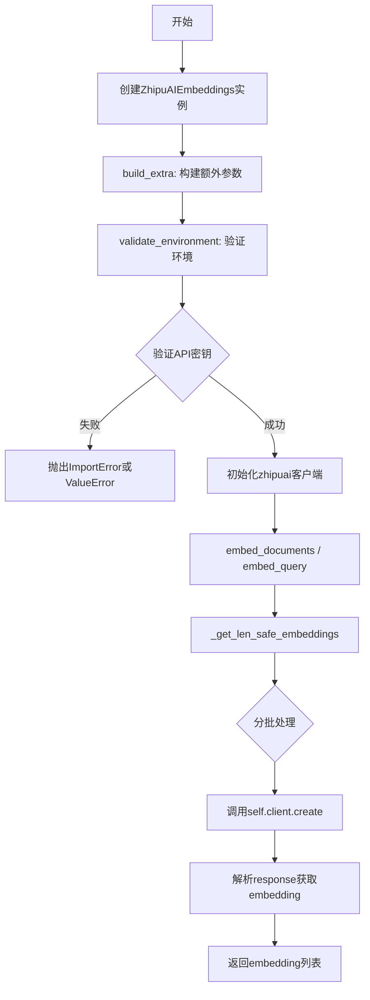
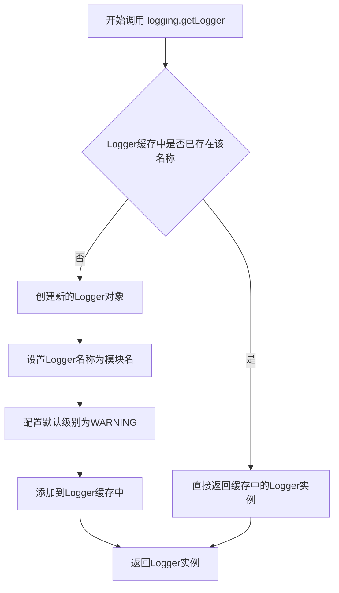
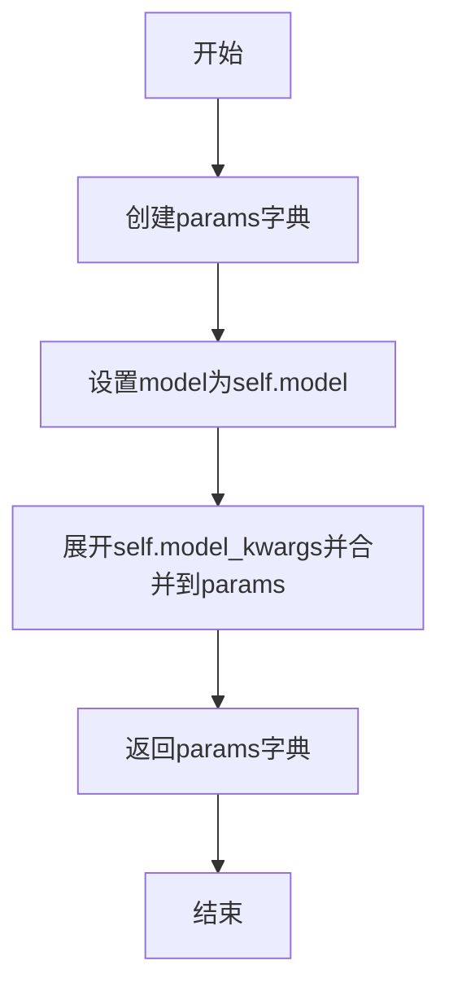
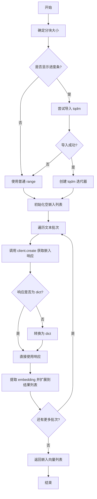

# `Langchain-Chatchat\libs\chatchat-server\langchain_chatchat\embeddings\zhipuai.py` 详细设计文档

该代码实现了智谱AI（ZhipuAI）的嵌入模型客户端，继承自LangChain的Embeddings接口，用于将文本转换为向量表示，支持文档嵌入和查询嵌入，通过环境变量或参数配置API密钥和代理，支持批量处理和错误重试。

## 整体流程



## 类结构

```
ZhipuAIEmbeddings (实现Embeddings接口)
├── BaseModel (Pydantic基类)
└── Embeddings (LangChain抽象基类)
```

## 全局变量及字段


### `logger`
    
模块级日志记录器，用于记录ZhipuAI嵌入相关的日志信息

类型：`logging.Logger`
    


### `ZhipuAIEmbeddings.client`
    
ZhipuAI嵌入客户端实例，用于与ZhipuAI API交互生成嵌入向量

类型：`Any`
    


### `ZhipuAIEmbeddings.model`
    
嵌入模型名称，默认值为embedding-2

类型：`str`
    


### `ZhipuAIEmbeddings.zhipuai_api_base`
    
API基础URL路径，用于指定ZhipuAI API的请求地址

类型：`Optional[str]`
    


### `ZhipuAIEmbeddings.zhipuai_proxy`
    
代理服务器地址，用于配置HTTP请求的代理

类型：`Optional[str]`
    


### `ZhipuAIEmbeddings.embedding_ctx_length`
    
最大token嵌入长度，默认值为8191，用于控制单次嵌入的最大token数

类型：`int`
    


### `ZhipuAIEmbeddings.zhipuai_api_key`
    
API密钥，用于认证ZhipuAI API请求，自动从环境变量ZHIPUAI_API_KEY或OPENAI_API_KEY读取

类型：`Optional[SecretStr]`
    


### `ZhipuAIEmbeddings.chunk_size`
    
每批嵌入的文本数量，默认值为1000，用于控制批量处理的大小

类型：`int`
    


### `ZhipuAIEmbeddings.max_retries`
    
生成嵌入时的最大重试次数，默认值为2，用于处理临时性网络错误

类型：`int`
    


### `ZhipuAIEmbeddings.request_timeout`
    
请求超时时间，支持浮点数、Tuple[float, float]或httpx.Timeout类型

类型：`Optional[Union[float, Tuple[float, float], Any]]`
    


### `ZhipuAIEmbeddings.headers`
    
请求头信息，用于自定义HTTP请求头

类型：`Any`
    


### `ZhipuAIEmbeddings.show_progress_bar`
    
是否显示嵌入进度条，默认值为False

类型：`bool`
    


### `ZhipuAIEmbeddings.model_kwargs`
    
其他模型参数，用于传递未明确指定的有效模型参数

类型：`Dict[str, Any]`
    


### `ZhipuAIEmbeddings.http_client`
    
可选的httpx.Client实例，用于自定义HTTP客户端配置

类型：`Union[Any, None]`
    
    

## 全局函数及方法


### logging.getLogger(__name__)

获取或创建一个与当前模块名称关联的日志记录器实例，用于后续模块级别的日志记录操作。

参数：
- `name`：`str`，日志记录器的名称，通常传入 `__name__` 以获取当前模块对应的logger

返回值：`logging.Logger`，返回对应的 Logger 对象实例

#### 流程图



#### 带注释源码

```python
# 导入标准库 logging 模块
import logging

# 导入 os 模块用于环境变量操作
import os

# 导入 warnings 模块用于警告提示
import warnings

# 从 typing 模块导入多种类型注解
from typing import (
    Any,
    Dict,
    Iterable,
    List,
    Literal,
    Mapping,
    Optional,
    Sequence,
    Set,
    Tuple,
    Union,
    cast,
)

# 从 langchain_core.embeddings 导入 Embeddings 基类
from langchain_core.embeddings import Embeddings

# 从 langchain_core.pydantic_v1 导入 Pydantic 相关类
from langchain_core.pydantic_v1 import (
    BaseModel,
    Extra,
    Field,
    SecretStr,
    root_validator,
)

# 从 langchain_core.utils 导入工具函数
from langchain_core.utils import (
    convert_to_secret_str,
    get_from_dict_or_env,
    get_pydantic_field_names,
)

# ============================================================
# 核心代码：获取当前模块的日志记录器
# ============================================================
# __name__ 是 Python 的内置变量，代表当前模块的完整路径
# 例如：对于模块 langchain_glm.embeddings，__name__ 的值为 "langchain_glm.embeddings"
# logging.getLogger 会查找或创建一个与该名称关联的 Logger 实例
# 这样可以方便地在日志中识别日志来源的模块
# ============================================================
logger = logging.getLogger(__name__)

# 后续该模块中所有需要记录日志的地方都可以使用这个 logger 对象
# 例如：logger.info("信息"), logger.warning("警告"), logger.error("错误")
```


### `ZhipuAIEmbeddings.build_extra`

该函数是一个 Pydantic `root_validator`，用于在模型实例化时构建额外的参数字典。它会检查传入的所有参数，将非标准字段（未在模型定义中声明的字段）移动到 `model_kwargs` 中，同时验证是否存在重复参数或无效的 `model_kwargs`。

参数：

- `cls`：当前类本身（类方法隐式接收）
- `values`：`Dict[str, Any]`，包含实例化时传入的所有参数字典

返回值：`Dict[str, Any]`，处理后包含标准化 `model_kwargs` 的参数字典

#### 流程图

```mermaid
flowchart TD
    A[开始: build_extra] --> B[获取所有必需字段名]
    B --> C[获取model_kwargs]
    D{遍历values中的每个field_name} --> E{field_name在extra中?}
    E -->|是| F[抛出ValueError: 参数重复]
    E -->|否| G{field_name不在必需字段中?}
    G -->|否| H[继续下一个field_name]
    G -->|是| I[发出警告: 参数转移至model_kwargs]
    I --> J[将该字段移至extra字典]
    J --> H
    D --> K{检查invalid_model_kwargs}
    K --> L{存在无效的model_kwargs?}
    L -->|是| M[抛出ValueError: 应显式指定参数]
    L -->|否| N[更新values['model_kwargs']=extra]
    N --> O[返回values]
    
    F --> O
```

#### 带注释源码

```python
@root_validator(pre=True, allow_reuse=True)
def build_extra(cls, values: Dict[str, Any]) -> Dict[str, Any]:
    """Build extra kwargs from additional params that were passed in."""
    # 获取当前模型类的所有必需字段名
    all_required_field_names = get_pydantic_field_names(cls)
    # 从values中获取已有的model_kwargs，默认为空字典
    extra = values.get("model_kwargs", {})
    
    # 遍历values中的所有字段（需要复制list以避免迭代中修改问题）
    for field_name in list(values):
        # 检查该字段是否同时存在于values和model_kwargs中（重复参数）
        if field_name in extra:
            raise ValueError(f"Found {field_name} supplied twice.")
        
        # 如果字段不在必需字段列表中，说明是额外传递的参数
        if field_name not in all_required_field_names:
            # 发出警告，提示该参数被转移到model_kwargs
            warnings.warn(
                f"""WARNING! {field_name} is not default parameter.
                {field_name} was transferred to model_kwargs.
                Please confirm that {field_name} is what you intended."""
            )
            # 将该字段从values中弹出，并添加到extra字典
            extra[field_name] = values.pop(field_name)

    # 检查extra中是否有本应显式声明的参数（即与必需字段名冲突）
    invalid_model_kwargs = all_required_field_names.intersection(extra.keys())
    if invalid_model_kwargs:
        raise ValueError(
            f"Parameters {invalid_model_kwargs} should be specified explicitly. "
            f"Instead they were passed in as part of `model_kwargs` parameter."
        )

    # 将处理后的extra字典更新回values['model_kwargs']
    values["model_kwargs"] = extra
    return values
```


### `ZhipuAIEmbeddings.validate_environment`

验证环境变量和依赖的根验证器，确保 API Key、Base URL、Proxy 等配置正确，并初始化 ZhipuAI 客户端。

参数：

- `cls`：类型 `ZhipuAIEmbeddings`，Pydantic 根验证器的类对象
- `values`：类型 `Dict`，Pydantic 模型初始化时的字段值字典

返回值：`Dict`，验证并处理后的字段值字典

#### 流程图

```mermaid
flowchart TD
    A[开始 validate_environment] --> B{获取 zhipuai_api_key}
    B --> C[从 values 或环境变量 ZHIPUAI_API_KEY 获取]
    C --> D{api_key 存在?}
    D -->|是| E[转换为 SecretStr]
    D -->|否| F[设为 None]
    E --> G[获取 zhipuai_api_base]
    F --> G
    G --> H{从 values 或环境变量 OPENAI_API_BASE 获取}
    H --> I[获取 zhipuai_api_type]
    I --> J[从 values 或环境变量 OPENAI_API_TYPE 获取]
    J --> K[获取 zhipuai_proxy]
    K --> L[从 values 或环境变量 OPENAI_PROXY 获取]
    L --> M[构建 client_params 字典]
    M --> N{client 已存在?]
    N -->|是| O[跳过客户端初始化]
    N -->|否| P{尝试导入 zhipuai}
    P --> Q[成功导入]
    Q --> R[创建 ZhipuAI 客户端实例]
    R --> S[获取 embeddings 端点]
    S --> T[返回 values]
    O --> T
    P -->|导入失败| U[抛出 ImportError]
    U --> V[提示安装 zhipuai 包]
```

#### 带注释源码

```python
@root_validator(allow_reuse=True)
def validate_environment(cls, values: Dict) -> Dict:
    """Validate that api key and python package exists in environment."""
    # 从 values 字典或环境变量 'ZHIPUAI_API_KEY' 获取 API Key
    zhipuai_api_key = get_from_dict_or_env(
        values, "zhipuai_api_key", "ZHIPUAI_API_KEY"
    )
    # 如果存在 API Key，转换为 SecretStr；否则设为 None
    values["zhipuai_api_key"] = (
        convert_to_secret_str(zhipuai_api_key) if zhipuai_api_key else None
    )
    # 获取 Base URL，优先使用 values 中的值，否则从环境变量获取
    values["zhipuai_api_base"] = values["zhipuai_api_base"] or os.getenv(
        "OPENAI_API_BASE"
    )
    # 获取 API 类型，默认值为空字符串
    values["zhipuai_api_type"] = get_from_dict_or_env(
        values,
        "zhipuai_api_type",
        "OPENAI_API_TYPE",
        default="",
    )
    # 获取代理配置，默认值为空字符串
    values["zhipuai_proxy"] = get_from_dict_or_env(
        values,
        "zhipuai_proxy",
        "OPENAI_PROXY",
        default="",
    )

    # 构建客户端参数字典
    client_params = {
        # 获取 SecretStr 中的实际密钥值
        "api_key": values["zhipuai_api_key"].get_secret_value()
        if values["zhipuai_api_key"]
        else None,
        "base_url": values["zhipuai_api_base"],
        "timeout": values["request_timeout"],
        "max_retries": values["max_retries"],
        "http_client": values["http_client"],
    }
    # 如果客户端尚未初始化，则创建新客户端
    if not values.get("client"):
        try:
            import zhipuai  # 尝试导入 zhipuai 包
        except ImportError:
            # 导入失败时抛出 ImportError，提示用户安装
            raise ImportError(
                "Please install the zhipuai package with `pip install zhipuai`"
            )
        # 创建 ZhipuAI 客户端实例并获取 embeddings 端点
        values["client"] = zhipuai.ZhipuAI(**client_params).embeddings
    return values
```


### `ZhipuAIEmbeddings._invocation_params`

这是一个属性方法，用于获取调用智谱AI嵌入API时的参数。它返回一个字典，包含当前配置的模型名称以及从 `model_kwargs` 中获取的额外参数，这些参数将直接传递给嵌入API的调用。

参数：此方法无显式参数（通过 `self` 访问实例属性）

返回值：`Dict[str, Any]`，包含模型名称（`model`）和额外模型参数（来自 `model_kwargs`）的字典，用于API调用时的参数构造。

#### 流程图



#### 带注释源码

```python
@property
def _invocation_params(self) -> Dict[str, Any]:
    """
    获取调用嵌入API时的参数。
    
    这是一个属性方法，用于构造调用智谱AI嵌入API所需的参数。
    它将模型名称与模型额外参数合并为一个字典，供内部方法使用。
    
    Returns:
        Dict[str, Any]: 包含model和model_kwargs的参数字典
    """
    # 创建一个字典，包含当前实例的模型名称
    # self.model 默认值为 "embedding-2"
    params: Dict = {"model": self.model, **self.model_kwargs}
    
    # **self.model_kwargs 会将模型额外参数字典展开并合并到params中
    # 例如：如果model_kwargs = {"temperature": 0.5}，则params = {"model": "embedding-2", "temperature": 0.5}
    
    # 返回构造好的参数字典，供 _get_len_safe_embeddings 等方法使用
    return params
```


### `ZhipuAIEmbeddings._get_len_safe_embeddings`

生成长度安全的嵌入向量，将长文本列表分批处理以避免超出模型上下文长度限制，并为每一批调用嵌入 API 获取向量表示。

参数：

- `self`：ZhipuAIEmbeddings 类实例，上下文对象
- `texts`：`List[str]`，待嵌入的文本列表
- `chunk_size`：`Optional[int]`，可选参数，每次处理的文本块大小，默认使用类实例的 chunk_size 属性

返回值：`List[List[float]]`，返回与输入文本对应的嵌入向量列表，每个内部列表代表一个文本的嵌入表示

#### 流程图



#### 带注释源码

```python
def _get_len_safe_embeddings(
        self, texts: List[str], *, chunk_size: Optional[int] = None
) -> List[List[float]]:
    """
    Generate length-safe embeddings for a list of texts.
    为文本列表生成长度安全的嵌入向量
    
    Args:
        texts (List[str]): A list of texts to embed.
            待嵌入的文本列表
        chunk_size (Optional[int]): The size of chunks for processing embeddings.
            处理嵌入时的分块大小

    Returns:
        List[List[float]]: A list of embeddings for each input text.
            每个输入文本对应的嵌入向量列表
    """

    # 确定分块大小：优先使用传入参数，否则使用类属性默认的 chunk_size
    _chunk_size = chunk_size or self.chunk_size

    # 根据 show_progress_bar 配置决定是否显示进度条
    if self.show_progress_bar:
        try:
            from tqdm.auto import tqdm

            # 使用 tqdm 包装迭代器以显示进度条
            _iter: Iterable = tqdm(range(0, len(texts), _chunk_size))
        except ImportError:
            # 如果 tqdm 未安装，回退到普通迭代器
            _iter = range(0, len(texts), _chunk_size)
    else:
        # 不显示进度条，使用普通 range 迭代
        _iter = range(0, len(texts), _chunk_size)

    # 初始化批量嵌入结果列表
    batched_embeddings: List[List[float]] = []
    
    # 按分块大小遍历文本列表
    for i in _iter:
        # 调用嵌入 API 获取当前批次的嵌入向量
        response = self.client.create(
            input=texts[i : i + _chunk_size], **self._invocation_params
        )
        
        # 确保响应被转换为字典格式以统一处理
        if not isinstance(response, dict):
            response = response.dict()
        
        # 从响应中提取每个文本的嵌入向量并添加到结果列表
        batched_embeddings.extend(r["embedding"] for r in response["data"])

    # 返回所有文本的嵌入向量
    return batched_embeddings
```


### `ZhipuAIEmbeddings.embed_documents`

调用嵌入端点对多个文档进行嵌入处理，将文本列表转换为向量表示。

参数：

- `texts`：`List[str]` - 要嵌入的文本列表
- `chunk_size`：`Optional[int]` - 嵌入的分块大小。如果为 0 或 None，将使用类中指定的 chunk_size（默认 1000）

返回值：`List[List[float]]` - 嵌入向量列表，每个文本对应一个嵌入向量

#### 流程图

```mermaid
flowchart TD
    A[开始 embed_documents] --> B[调用 _get_len_safe_embeddings 方法]
    B --> C{chunk_size 是否有效?}
    C -->|是| D[使用传入的 chunk_size]
    C -->|否| E[使用类属性 self.chunk_size]
    D --> F[遍历文本分块]
    E --> F
    F --> G[调用 self.client.create 生成嵌入]
    G --> H[提取响应中的 embedding 数据]
    H --> I[聚合所有批次的嵌入向量]
    I --> J[返回 List[List[float]]]
```

#### 带注释源码

```python
def embed_documents(
        self, texts: List[str], chunk_size: Optional[int] = 0
) -> List[List[float]]:
    """Call out to OpenAI's embedding endpoint for embedding search docs.

    Args:
        texts: The list of texts to embed.
        chunk_size: The chunk size of embeddings. If None, will use the chunk size
            specified by the class.

    Returns:
        List of embeddings, one for each text.
    """
    # 调用内部方法 _get_len_safe_embeddings 处理嵌入
    # 注意：虽然参数中有 chunk_size，但实际没有传递给内部方法
    # 这可能导致传入的 chunk_size 参数被忽略
    return self._get_len_safe_embeddings(texts)
```


### `ZhipuAIEmbeddings.embed_query`

该方法用于将单个查询文本转换为向量嵌入表示，通过调用底层embed_documents方法实现文本到向量空间的映射，是ZhipuAI嵌入模型的核心接口之一。

参数：

- `text`：`str`，需要嵌入的查询文本

返回值：`List[float]`，文本的向量嵌入表示

#### 流程图

```mermaid
graph TD
    A([开始 embed_query]) --> B[输入文本 text: str]
    B --> C[调用 embed_documents 方法<br/>传入单元素列表 [text]]
    C --> D[底层调用 _get_len_safe_embeddings]
    D --> E[调用 ZhipuAI API 获取嵌入向量]
    E --> F[返回 List[List[float]]]
    F --> G[提取第一个元素 [0]]
    G --> H([返回 List[float] 嵌入向量])
    
    style A fill:#e1f5fe
    style H fill:#e8f5e8
```

#### 带注释源码

```python
def embed_query(self, text: str) -> List[float]:
    """Call out to OpenAI's embedding endpoint for embedding query text.

    Args:
        text: The text to embed.

    Returns:
        Embedding for the text.
    """
    # 将单个文本包装为列表，调用 embed_documents 方法
    # embed_documents 返回 List[List[float]]，取第一个元素得到 List[float]
    return self.embed_documents([text])[0]
```

## 关键组件


### ZhipuAIEmbeddings 类

智谱AI嵌入模型的核心类，继承自LangChain的BaseModel和Embeddings接口，负责与智谱AI API交互生成文本嵌入向量。

### 模型配置组件

包含model（嵌入模型名称，默认embedding-2）、chunk_size（批处理大小，默认1000）、max_retries（最大重试次数，默认2）、request_timeout（请求超时时间）等参数，用于控制嵌入生成的行为和性能。

### 环境验证组件

通过`validate_environment`方法验证API密钥、代理设置和依赖包是否正确配置，自动从环境变量或参数中获取ZHIPUAI_API_KEY、OPENAI_API_BASE等配置。

### 长度安全嵌入组件

`_get_len_safe_embeddings`方法处理长文本嵌入，支持分块处理超出上下文限制的文本，使用chunk_size将文本分割为多个批次调用API，并可选地显示进度条。

### 文档嵌入组件

`embed_documents`方法用于批量嵌入文档列表，调用_get_len_safe_embeddings生成多个文档的嵌入向量，支持自定义chunk_size覆盖默认配置。

### 查询嵌入组件

`embed_query`方法将单个查询文本转换为嵌入向量，内部调用embed_documents处理单文本并返回第一项结果。

### API客户端组件

通过`validate_environment`初始化zhipuai.ZhipuAI客户端，包含api_key、base_url、timeout、max_retries和http_client等参数，用于实际API调用。

### 参数传递组件

`_invocation_params`属性方法构建API调用所需的参数字典，包含model名称和model_kwargs中的额外参数。

### 额外参数处理组件

`build_extra`方法处理传入的额外参数，将非默认参数转移到model_kwargs中，并验证是否存在重复参数或无效参数。


## 问题及建议


### 已知问题

- **类型注解不完整**：在`validate_environment`方法中使用了`zhipuai_api_type`变量，但该字段未在类中声明，可能导致类型检查失败和运行时错误。
- **环境变量引用错误**：类文档字符串中提到使用`OPENAI_API_KEY`环境变量，但实际代码在`validate_environment`中使用的是`ZHIPUAI_API_KEY`，造成文档与实现不一致，容易误导用户。
- **未使用的字段**：`headers`字段已声明但从未在代码中使用，`zhipuai_proxy`被读取但未实际应用于HTTP客户端配置，`embedding_ctx_length`声明后也未在任何地方使用。
- **进度条功能缺陷**：`_get_len_safe_embeddings`方法中的进度条实现存在逻辑错误，导入`tqdm`后未正确使用其返回值，且在异常处理分支中未提供进度条对象。
- **chunk_size默认值问题**：`embed_documents`方法默认参数`chunk_size=0`，在`_get_len_safe_embeddings`中`0 or self.chunk_size`会始终使用类属性值，导致传入0无实际意义，语义不清晰。
- **API类型硬编码**：虽然读取了`zhipuai_api_type`环境变量，但没有在任何地方使用该配置，无法支持多API类型场景。
- **HTTP客户端类型过于宽松**：`http_client`字段类型为`Union[Any, None]`，失去了类型安全性和IDE自动补全能力。

### 优化建议

- 添加`zhipuai_api_type: Optional[str] = Field(default="", alias="api_type")`类字段声明，与`validate_environment`中的处理保持一致。
- 修正文档字符串，将`OPENAI_API_KEY`改为`ZHIPUAI_API_KEY`，或修改代码以实际支持`OPENAI_API_KEY`作为备选。
- 移除未使用的`headers`、`zhipuai_proxy`、`embedding_ctx_length`字段，或在代码中实现相应功能。
- 修复进度条逻辑，正确使用`tqdm`返回的迭代器对象。
- 将`embed_documents`的默认参数改为`chunk_size: Optional[int] = None`，使语义更清晰。
- 使用`httpx.Client`作为`http_client`字段的明确类型注解，替换`Union[Any, None]`。
- 在`_invocation_params`属性中添加`api_type`等必要的调用参数。
- 考虑添加重试失败、API响应验证等错误处理逻辑，提高代码健壮性。

## 其它


### 设计目标与约束

设计目标：提供与LangChain框架兼容的ZhipuAI文本嵌入功能，支持文档和查询的向量化表示。约束条件：依赖zhipuai包、需配置API密钥或环境变量、嵌入长度受embedding_ctx_length限制。

### 错误处理与异常设计

ImportError：zhipuai包未安装时抛出 ImportError("Please install the zhipuai package with `pip install zhipuai`")；ValueError：参数重复传递或model_kwargs中包含保留参数时抛出；环境变量缺失时通过get_from_dict_or_env抛出KeyError；API请求超时通过request_timeout参数控制；网络错误通过max_retries参数重试。

### 数据流与状态机

数据流：用户输入文本列表 → embed_documents/embed_query → _get_len_safe_embeddings分批处理 → 调用zhipuai客户端create方法 → 解析response获取embedding向量 → 返回float列表。状态机涉及初始化状态（validate_environment）、就绪状态（可执行嵌入）、错误状态（异常捕获）。

### 外部依赖与接口契约

外部依赖：langchain_core.embeddings.Embeddings基类、langchain_core.pydantic_v1.BaseModel、zhipuai包、tqdm包（可选用于进度条）、os和logging标准库。接口契约：实现Embeddings接口的embed_documents(texts: List[str], chunk_size: Optional[int]) -> List[List[float]]和embed_query(text: str) -> List[float]方法。

### 配置管理

配置来源：初始化参数、别名参数（如base_url、api_key、timeout）、环境变量（ZHIPUAI_API_KEY、OPENAI_API_BASE、OPENAI_API_TYPE、OPENAI_PROXY）、model_kwargs动态参数。配置优先级：显式传递参数 > 环境变量 > 默认值。

### 版本兼容性考虑

Python版本：依赖from __future__ import annotations实现类型提示前向兼容；Pydantic版本：使用pydantic_v1兼容Pydantic v1；HTTP客户端：支持httpx.Timeout或float类型timeout。

### 安全性考虑

API密钥处理：使用SecretStr类型存储、get_secret_value()方法安全获取、通过环境变量避免硬编码；禁止额外参数：Config中设置Extra.forbid防止未定义字段传入。

### 性能优化空间

嵌入批次处理：通过chunk_size控制批量大小，默认1000；进度条可选：show_progress_bar字段控制tqdm进度条显示；长度安全：_get_len_safe_embeddings方法处理超长文本分批；重试机制：max_retries=2次自动重试。

### 已知限制

模型限制：embedding_ctx_length默认8191，适用模型为embedding-2；错误处理：未捕获zhipuai客户端具体异常；不支持流式嵌入；无内置缓存机制。

### 使用示例与API参考

示例代码：from langchain_glm import ZhipuAIEmbeddings; zhipuuai = ZhipuAIEmbeddings(model="text_embedding"); embeddings = zhipuuai.embed_documents(["你好", "世界"]); query_embedding = zhipuuai.embed_query("你好世界")。

### 继承关系与多态性

继承BaseModel获得Pydantic模型验证功能；继承Embeddings实现LangChain标准嵌入接口；支持多态：可作为任何接受Embeddings类型参数的组件输入。

    